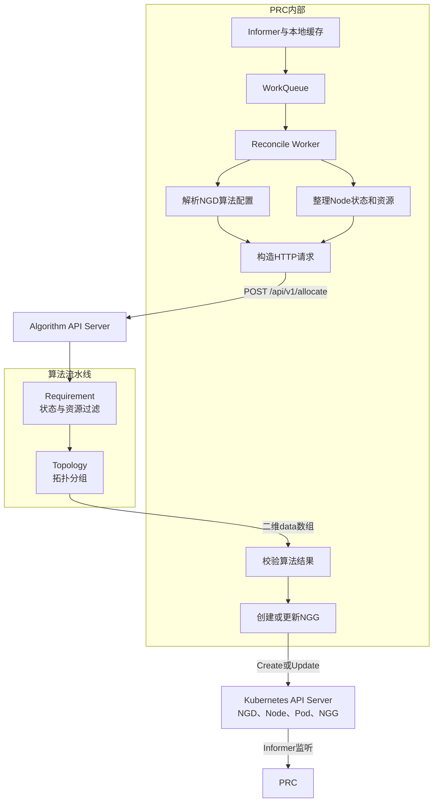

# PRC与Algorithm API Server技术方案

## 1. 文档目的

本文档说明资源池控制组件（Pool Resource Controller，PRC）与算法服务（Algorithm API Server）的职责边界、内部流程、HTTP接口、算法执行方式、返回数据结构和失败处理机制。

当前第一版只实现两个算法阶段：

```text
requirement
→ topology
```

- `requirement`：根据节点状态、节点数量以及CPU、内存、GPU等资源要求过滤节点；
- `topology`：根据拓扑配置对Requirement输出的节点进行分组，返回所有满足数量要求的节点组。

当前版本暂不实现：

- Load Balance负载均衡；
- Prometheus指标计算；
- 节点或节点组评分；
- 唯一最优节点组选择；
- Pod到Node的最终绑定。

---

## 2. 核心设计原则

### 2.1 PRC理解Kubernetes

PRC负责读取和解析节点组需求（Node Group Demand，NGD）、Node和Pod等Kubernetes对象，将Kubernetes原始状态转换为算法服务可以直接处理的通用数据。

### 2.2 Algorithm API Server不理解NGD

Algorithm API Server不接收完整NGD，不需要知道NGD名称、命名空间、任务类型或Kubernetes对象结构，只接收：

```text
请求标识
+
需要依次执行的算法及其参数
+
PRC整理后的节点数据
```

### 2.3 每个算法管理自己的参数

不存在顶层`requirements`字段。Requirement相关配置全部位于：

```json
algorithms[].parameters
```

Topology相关配置也位于对应算法的`parameters`中。

### 2.4 算法结果统一为二维数组

```text
外层数组：候选节点组集合
内层数组：一个候选节点组中的Node集合
```

- 只执行Requirement时，外层数组中只有一个内部数组；
- 执行Topology时，外层数组中可以有多个内部数组；
- Topology没有找到可行节点组时，返回空数组。

---

## 3. 总体架构



总体流程为：

```text
NGD创建或修改
→ PRC的NGD Informer观察到变化
→ NGD Key进入WorkQueue
→ PRC解析NGD中的算法配置
→ PRC整理Node状态、剩余资源和Label
→ PRC调用Algorithm API Server
→ Algorithm API Server依次执行Requirement和Topology
→ Algorithm API Server返回二维节点数组
→ PRC校验返回结果
→ PRC创建或更新NGG
```

---

## 4. PRC设计

### 4.1 PRC职责

PRC负责：

1. 监听任务级NGD；
2. 解析NGD中的算法名称、执行顺序和算法参数；
3. 监听Node和Pod；
4. 判断Node的Kubernetes基础状态；
5. 计算Node剩余资源；
6. 提取Node Label；
7. 构造通用HTTP请求；
8. 调用Algorithm API Server；
9. 校验算法返回结果；
10. 创建或更新NGG；
11. 更新NGD处理状态；
12. 处理超时、失败重试和过期响应。

PRC不负责：

- 实现Requirement过滤算法；
- 实现Topology分组算法；
- 对节点或节点组评分；
- 将多个拓扑节点组合并；
- 为Pod选择最终Node；
- 执行Pod Bind。

### 4.2 PRC内部组件

| 组件 | 作用 |
|---|---|
| NGD Informer | 监听NGD创建、修改和删除事件 |
| Node Informer | 缓存Node状态、Allocatable、Taint和Label |
| Pod Informer | 统计已经绑定到Node的Pod资源请求 |
| WorkQueue | 保存需要处理的NGD Key并提供退避重试 |
| Reconcile Worker | 执行一次完整的解析、请求、校验和写回流程 |
| HTTP Client | 调用Algorithm API Server |
| NGG Writer | 通过Kubernetes Client创建或更新NGG |

### 4.3 NGD解析

NGD保存任务需要执行的算法和对应参数。例如：

```yaml
spec:
  algorithms:
    - name: requirement
      parameters:
        requiredNodeCount: 4
        resourcesPerNode:
          cpu: "8"
          memory: "32Gi"
          nvidia.com/gpu: "1"

    - name: topology
      parameters:
        profile: datacenter-v1
        strategy: NarrowestFit
        widestAllowedLevel: server-room
```

PRC解析后得到：

```text
算法顺序：requirement → topology
要求Node数量：4
每台Node要求：8 CPU、32Gi内存、1张GPU
拓扑Profile：datacenter-v1
搜索策略：NarrowestFit
允许的最宽拓扑范围：server-room
```

PRC不把完整NGD发送给算法服务，只发送解析后的算法配置。

### 4.4 Node基础状态归一化

PRC根据Kubernetes Node状态计算统一字段：

```json
{
  "available": true
}
```

第一版节点基础可用条件为：

```text
Node没有处于删除状态
AND Ready=True
AND 没有被Cordon
AND NetworkUnavailable不为True
AND MemoryPressure不为True
AND DiskPressure不为True
AND PIDPressure不为True
AND 不存在任务无法容忍的NoSchedule或NoExecute污点
```

不可用节点可以附带原因：

```json
{
  "available": false,
  "unavailableReason": "NODE_NOT_READY"
}
```

Algorithm API Server不需要解析Kubernetes原始Condition、Taint和Cordon。

### 4.5 Node剩余资源计算

PRC根据Node和Pod缓存计算：

```text
availableResources
=
Node.status.allocatable
-
该Node上所有已绑定Pod的Resource Requests
```

例如：

```json
{
  "availableResources": {
    "cpu": "16",
    "memory": "64Gi",
    "nvidia.com/gpu": "2"
  }
}
```

资源使用Kubernetes通用资源Map，不为GPU、RDMA、FPGA或NPU设计独立固定字段。后续可以直接增加：

```json
{
  "availableResources": {
    "cpu": "16",
    "memory": "64Gi",
    "nvidia.com/gpu": "2",
    "example.com/rdma": "1"
  }
}
```

### 4.6 Node Label提取

PRC直接传递Node Label，不将拓扑写死成HTTP固定字段：

```json
{
  "labels": {
    "topology.kubernetes.io/region": "region-a",
    "topology.kubernetes.io/zone": "zone-a",
    "topology.example.io/datacenter": "dc-01",
    "topology.example.io/server-room": "room-01",
    "topology.example.io/fabric-pod": "fabric-01",
    "topology.example.io/leaf-switch": "leaf-01",
    "topology.example.io/rack": "rack-01"
  }
}
```

具体使用哪些Label以及层级顺序，由Topology Profile决定。

### 4.7 请求与NGD的本地关联

HTTP请求中不传递NGD名称、命名空间或generation。PRC在本地保存：

```text
requestId
→ NGD UID
→ NGD generation
```

该映射用于：

- 将HTTP响应关联回原NGD；
- 判断响应是否已经过期；
- 更新正确的NGD和NGG；
- 进行日志追踪。

---

## 5. Algorithm API Server设计

### 5.1 职责

Algorithm API Server负责：

1. 接收PRC发送的HTTP请求；
2. 读取`algorithms`数组；
3. 按数组顺序加载和执行算法；
4. 在算法阶段之间传递中间结果；
5. 返回一个或多个满足条件的节点组。

Algorithm API Server不负责：

- 读取或解析NGD；
- 监听Kubernetes对象；
- 查询Kubernetes API Server；
- 查询Node和Pod；
- 计算Node剩余资源；
- 创建或修改NGG；
- 更新NGD状态；
- 绑定Pod。

Algorithm API Server可以设计成无状态服务，不需要Kubernetes访问权限。

### 5.2 算法流水线

每个算法统一表示为：

```json
{
  "name": "algorithm-name",
  "parameters": {}
}
```

算法按照数组顺序执行：

```json
{
  "algorithms": [
    {
      "name": "requirement",
      "parameters": {}
    },
    {
      "name": "topology",
      "parameters": {}
    }
  ]
}
```

对应：

```text
requirement
→ topology
```

Algorithm API Server内部维护执行上下文：

```text
AlgorithmContext
├── requestId
├── requiredNodeCount
├── currentNodes
├── nodeGroups
└── executedAlgorithms
```

Requirement将过滤后的Node和`requiredNodeCount`写入上下文，Topology从上下文读取，不需要重复配置Node数量。

---

## 6. Requirement算法

### 6.1 参数

Requirement的所有要求放在该算法的`parameters`中：

```json
{
  "name": "requirement",
  "parameters": {
    "requiredNodeCount": 4,
    "resourcesPerNode": {
      "cpu": "8",
      "memory": "32Gi",
      "nvidia.com/gpu": "1"
    }
  }
}
```

含义为：

```text
任务需要4台不同Node；
每台Node至少需要8核CPU、32Gi内存和1张GPU。
```

### 6.2 执行逻辑

对于每台Node，Requirement依次判断：

```text
available == true
AND availableResources.cpu >= 8
AND availableResources.memory >= 32Gi
AND availableResources.nvidia.com/gpu >= 1
```

资源比较不是固定比较CPU、内存和GPU，而是遍历`resourcesPerNode`中的全部资源键：

```text
for each resource in resourcesPerNode:
    node.availableResources[resource]
    >=
    resourcesPerNode[resource]
```

过滤完成后检查：

```text
合格Node数量 >= requiredNodeCount
```

如果数量不足，Requirement返回业务不满足，Topology不再执行。

### 6.3 Requirement结果

只执行Requirement时，返回一个内部数组，包含所有满足条件的Node：

```json
"data": [
  [
    {"name": "node-01"},
    {"name": "node-02"}
  ]
]
```

Requirement不从合格Node中截取`requiredNodeCount`台，而是返回全部合格Node。

---

## 7. Topology算法

### 7.1 Topology参数

```json
{
  "name": "topology",
  "parameters": {
    "profile": "datacenter-v1",
    "strategy": "NarrowestFit",
    "widestAllowedLevel": "server-room"
  }
}
```

| 参数 | 含义 |
|---|---|
| `profile` | 使用的拓扑层级配置 |
| `strategy` | 拓扑搜索策略，当前固定为从最小范围开始搜索 |
| `widestAllowedLevel` | 最多允许扩大到的拓扑范围 |

### 7.2 Topology Profile

Topology层级不写死在HTTP结构或算法代码中，而是由Algorithm API Server配置加载。例如：

```yaml
profiles:
  datacenter-v1:
    levels:
      - name: region
        labelKey: topology.kubernetes.io/region

      - name: zone
        labelKey: topology.kubernetes.io/zone

      - name: datacenter
        labelKey: topology.example.io/datacenter

      - name: server-room
        labelKey: topology.example.io/server-room

      - name: fabric-pod
        labelKey: topology.example.io/fabric-pod

      - name: leaf-switch
        labelKey: topology.example.io/leaf-switch

      - name: rack
        labelKey: topology.example.io/rack
```

Profile按照从大范围到小范围排列：

```text
region
→ zone
→ datacenter
→ server-room
→ fabric-pod
→ leaf-switch
→ rack
```

不同集群可以配置不同Profile，不需要修改HTTP接口。

### 7.3 搜索逻辑

当：

```text
widestAllowedLevel = server-room
```

Topology反向搜索：

```text
rack
→ leaf-switch
→ fabric-pod
→ server-room
```

在每一级执行：

```text
按照完整拓扑路径对Requirement输出的Node分组
→ 统计每组Node数量
→ 保留Node数量不少于requiredNodeCount的节点组
```

只要某一级存在可行节点组，就返回该级的所有可行组，不再扩大范围。

### 7.4 完整路径分组

不能只使用：

```text
leaf-switch=leaf-01
```

因为不同机房可能有同名交换机。Leaf Switch节点组的分组键应使用完整路径：

```text
region-a
/zone-a
/dc-01
/room-01
/fabric-01
/leaf-01
```

### 7.5 Topology结果

Topology返回多个内部数组，每个数组表示一个独立节点组：

```json
"data": [
  [
    {"name": "node-01", "groupId": "region-a/zone-a/dc-01/room-01/fabric-01/leaf-01"},
    {"name": "node-02", "groupId": "region-a/zone-a/dc-01/room-01/fabric-01/leaf-01"}
  ],
  [
    {"name": "node-03", "groupId": "region-a/zone-a/dc-01/room-02/fabric-02/leaf-02"},
    {"name": "node-04", "groupId": "region-a/zone-a/dc-01/room-02/fabric-02/leaf-02"}
  ]
]
```

不同内部数组是相互独立的可选节点组，不能直接合并。

---

## 8. HTTP接口设计

### 8.1 接口定义

```http
POST /api/v1/allocate
Content-Type: application/json
```

### 8.2 顶层请求结构

```json
{
  "requestId": "request-001",
  "algorithms": [],
  "nodes": []
}
```

| 字段 | 说明 |
|---|---|
| `requestId` | PRC生成的请求标识，算法服务原样返回 |
| `algorithms` | 按顺序执行的算法和各自参数 |
| `nodes` | PRC归一化后的节点状态、资源和Label |

HTTP请求不包含完整NGD，也不包含顶层`requirements`字段。

### 8.3 完整请求示例

```json
{
  "requestId": "request-001",
  "algorithms": [
    {
      "name": "requirement",
      "parameters": {
        "requiredNodeCount": 2,
        "resourcesPerNode": {
          "cpu": "8",
          "memory": "32Gi",
          "nvidia.com/gpu": "1"
        }
      }
    },
    {
      "name": "topology",
      "parameters": {
        "profile": "datacenter-v1",
        "strategy": "NarrowestFit",
        "widestAllowedLevel": "server-room"
      }
    }
  ],
  "nodes": [
    {
      "name": "node-01",
      "available": true,
      "availableResources": {
        "cpu": "16",
        "memory": "64Gi",
        "nvidia.com/gpu": "2"
      },
      "labels": {
        "topology.kubernetes.io/region": "region-a",
        "topology.kubernetes.io/zone": "zone-a",
        "topology.example.io/datacenter": "dc-01",
        "topology.example.io/server-room": "room-01",
        "topology.example.io/fabric-pod": "fabric-01",
        "topology.example.io/leaf-switch": "leaf-01",
        "topology.example.io/rack": "rack-01"
      }
    },
    {
      "name": "node-02",
      "available": true,
      "availableResources": {
        "cpu": "12",
        "memory": "48Gi",
        "nvidia.com/gpu": "1"
      },
      "labels": {
        "topology.kubernetes.io/region": "region-a",
        "topology.kubernetes.io/zone": "zone-a",
        "topology.example.io/datacenter": "dc-01",
        "topology.example.io/server-room": "room-01",
        "topology.example.io/fabric-pod": "fabric-01",
        "topology.example.io/leaf-switch": "leaf-01",
        "topology.example.io/rack": "rack-02"
      }
    }
  ]
}
```

---

## 9. 成功响应设计

### 9.1 统一响应结构

```json
{
  "status": "SUCCESS",
  "requestId": "request-001",
  "executedAlgorithms": [],
  "algorithmResults": {},
  "data": []
}
```

### 9.2 只执行Requirement

```json
{
  "status": "SUCCESS",
  "requestId": "request-001",
  "executedAlgorithms": [
    "requirement"
  ],
  "data": [
    [
      {"name": "node-01"},
      {"name": "node-02"}
    ]
  ]
}
```

语义为：

```text
data[0]
=
所有满足Requirement的Node
```

### 9.3 执行Requirement和Topology

```json
{
  "status": "SUCCESS",
  "requestId": "request-001",
  "executedAlgorithms": [
    "requirement",
    "topology"
  ],
  "algorithmResults": {
    "topology": {
      "profile": "datacenter-v1",
      "selectedLevel": "leaf-switch"
    }
  },
  "data": [
    [
      {
        "name": "node-01",
        "groupId": "region-a/zone-a/dc-01/room-01/fabric-01/leaf-01"
      },
      {
        "name": "node-02",
        "groupId": "region-a/zone-a/dc-01/room-01/fabric-01/leaf-01"
      }
    ],
    [
      {
        "name": "node-03",
        "groupId": "region-a/zone-a/dc-01/room-02/fabric-02/leaf-02"
      },
      {
        "name": "node-04",
        "groupId": "region-a/zone-a/dc-01/room-02/fabric-02/leaf-02"
      }
    ]
  ]
}
```

语义为：

```text
data[0] = 第一个满足条件的拓扑节点组
data[1] = 第二个满足条件的拓扑节点组
```

---

## 10. 失败分类与处理原则

失败分为：

1. 业务条件不满足；
2. HTTP调用失败；
3. 请求或算法配置错误；
4. 算法响应内容异常；
5. 响应已经过期。

只有Algorithm API Server返回`SUCCESS`，并且PRC完成结构、Node数量和拓扑一致性校验后，才允许创建或更新有效NGG。

---

## 11. 业务条件不满足

Algorithm API Server正常完成计算，但没有找到满足要求的Node或节点组时，属于业务不满足，不属于HTTP故障。

HTTP仍返回：

```http
HTTP/1.1 200 OK
```

### 11.1 Requirement失败

```json
{
  "status": "UNSATISFIABLE",
  "requestId": "request-001",
  "executedAlgorithms": [
    "requirement"
  ],
  "failedAlgorithm": "requirement",
  "reason": "INSUFFICIENT_QUALIFIED_NODES",
  "message": "要求4台Node，但只有2台Node满足状态和资源要求",
  "data": [
    [
      {"name": "node-01"},
      {"name": "node-02"}
    ]
  ]
}
```

PRC处理：

```text
不创建新的有效NGG
→ 不把data中的部分节点作为授予结果
→ 更新NGD为Unsatisfied
→ 等待Node、Pod或NGD变化后重新计算
```

Requirement失败时返回的部分Node仅用于排障。

### 11.2 Topology失败

```json
{
  "status": "UNSATISFIABLE",
  "requestId": "request-001",
  "executedAlgorithms": [
    "requirement",
    "topology"
  ],
  "failedAlgorithm": "topology",
  "reason": "NO_TOPOLOGY_GROUP_SATISFIES_REQUIREMENT",
  "message": "没有符合拓扑要求且Node数量不少于4的节点组",
  "data": []
}
```

PRC处理：

```text
不创建新的有效NGG
→ 更新NGD为Unsatisfied
→ 等待Node拓扑、Node数量或NGD要求变化
```

### 11.3 业务失败后的重新触发

| 失败原因 | 重新触发条件 |
|---|---|
| Node数量不足 | Node新增、恢复Ready或解除Cordon |
| CPU、内存、GPU不足 | Pod完成、Pod删除或Node新增 |
| Taint不满足 | Node Taint或任务容忍配置变化 |
| 拓扑节点组数量不足 | Node拓扑Label变化或Node新增 |
| NGD要求过高 | NGD资源或Node数量要求修改 |
| 拓扑范围过严 | NGD的`widestAllowedLevel`修改 |

业务不满足时不进行高频定时重试；相关集群事件或NGD变化后再重新计算。

---

## 12. HTTP调用失败

### 12.1 可重试错误

| 情况 | 表现 |
|---|---|
| 连接失败 | Connection refused |
| 请求超时 | Timeout |
| 服务限流 | HTTP 429 |
| 临时内部错误 | HTTP 500 |
| 服务不可用 | HTTP 503 |
| 网关超时 | HTTP 504 |

PRC处理：

```text
不创建或覆盖NGG
→ 记录调用错误
→ 将NGD重新加入WorkQueue
→ 指数退避重试
```

第一版建议退避时间：

```text
第1次：1秒
第2次：2秒
第3次：4秒
第4次：8秒
第5次：30秒
```

连续失败5次后：

```text
NGD标记为Degraded
→ 记录告警
→ 停止高频重试
→ 每60秒进行一次低频重试
```

### 12.2 不可重试错误

| HTTP状态 | 含义 |
|---:|---|
| 400 | JSON格式错误或缺少必要参数 |
| 404 | HTTP接口不存在 |
| 422 | 算法不存在或算法参数不合法 |

统一错误响应示例：

```json
{
  "status": "ERROR",
  "requestId": "request-001",
  "reason": "INVALID_ALGORITHM_PARAMETER",
  "message": "widestAllowedLevel不在指定Topology Profile中",
  "retryable": false,
  "data": []
}
```

PRC处理：

```text
不自动重试
→ NGD标记为Invalid
→ 记录具体参数错误
→ 等待用户修改NGD
```

---

## 13. 算法响应校验

即使HTTP返回`200 OK`和`status=SUCCESS`，PRC也必须进行二次校验。

### 13.1 结构校验

成功结果必须满足：

```text
requestId与请求一致
AND data存在
AND data是二维数组
AND data至少包含一个节点组
```

### 13.2 Node校验

每个返回Node必须满足：

```text
Node存在于本次请求的nodes中
AND Node名称不重复
AND Node当前仍然存在
AND Node当前仍然可用于调度
```

### 13.3 数量校验

每个成功节点组必须满足：

```text
组内不同Node数量
>=
requirement.parameters.requiredNodeCount
```

### 13.4 Topology一致性校验

如果执行了Topology，同一个内部数组中的全部Node必须属于同一个`selectedLevel`拓扑域。

如果两个Node属于不同Leaf Switch，但被放入同一个Leaf Switch组，PRC必须拒绝该响应。

### 13.5 响应校验失败处理

```text
不创建或更新NGG
→ 记录INVALID_ALGORITHM_RESPONSE
→ 有限次数重试
→ 连续失败后将NGD标记为Degraded并告警
```

---

## 14. 过期响应处理

PRC调用算法服务期间，NGD可能发生变化。例如：

```text
发起请求时：NGD generation=3
收到响应前：NGD generation=4
```

PRC通过本地映射比较请求版本和当前版本。如果不一致：

```text
丢弃旧响应
→ 不更新NGG
→ 使用最新NGD重新构造请求
→ 再次调用Algorithm API Server
```

这是正常并发处理，不需要告警。

---

## 15. 已有NGG的失败处理

### 15.1 第一次计算失败

如果当前不存在NGG：

```text
保持无有效NGG
→ NGD标记为Unsatisfied、Invalid或Degraded
→ 对应Pod保持Pending
```

### 15.2 同一NGD版本发生临时HTTP失败

如果NGD没有修改，已有NGG仍对应当前generation，仅Algorithm API Server临时不可用：

```text
暂时保留原NGG
→ 不使用失败结果覆盖
→ 后台退避重试
```

### 15.3 NGD修改后重新计算失败

如果NGD已经从`generation=3`更新为`generation=4`，旧NGG只对应旧需求：

```text
旧NGG不能继续作为新需求的有效结果
→ 将旧NGG标记为Stale或Inactive
→ 等待新版本计算成功
```

### 15.4 明确返回UNSATISFIABLE

如果算法服务正常返回业务不满足：

```text
将原NGG标记为Inactive
→ 不继续向新Pod提供旧候选节点
→ 保留对象和历史结果用于排障
```

---

## 16. NGD状态建议

| 状态 | 含义 |
|---|---|
| `Allocating` | 正在构造请求或调用算法服务 |
| `Fulfilled` | 已成功生成有效NGG |
| `Unsatisfied` | 当前节点资源或拓扑条件不满足 |
| `Invalid` | NGD算法配置或参数错误 |
| `Degraded` | 算法服务不可用或响应异常 |

业务不满足示例：

```yaml
status:
  phase: Unsatisfied
  observedGeneration: 3
  reason: InsufficientQualifiedNodes
  message: 要求4台Node，但只有2台满足Requirement
  lastAttemptTime: "2026-08-03T11:20:00+09:00"
```

算法服务异常示例：

```yaml
status:
  phase: Degraded
  observedGeneration: 3
  reason: AlgorithmServiceUnavailable
  message: Algorithm API Server连接超时
  retryCount: 5
  lastAttemptTime: "2026-08-03T11:20:00+09:00"
```

---

## 17. 失败处理对照表

| 失败情况 | 是否立即重试 | NGD状态 | NGG处理 |
|---|---:|---|---|
| Requirement资源不足 | 否 | `Unsatisfied` | 不创建新NGG；旧NGG失效 |
| Topology无可行组 | 否 | `Unsatisfied` | 不创建新NGG；旧NGG失效 |
| 算法名称错误 | 否 | `Invalid` | 不创建或更新NGG |
| 算法参数错误 | 否 | `Invalid` | 不创建或更新NGG |
| HTTP连接失败 | 是，退避 | `Degraded` | 同版本可暂时保留旧NGG |
| HTTP 500、503或504 | 是，退避 | `Degraded` | 不覆盖旧NGG |
| HTTP 429 | 是，退避 | `Degraded` | 不覆盖旧NGG |
| 响应结构错误 | 有限重试 | `Degraded` | 不写入NGG |
| 响应Node不存在 | 有限重试 | `Degraded` | 不写入NGG |
| NGD generation已变化 | 按新版本重算 | `Allocating` | 丢弃旧响应 |
| 成功且校验通过 | 否 | `Fulfilled` | 创建或更新NGG |

---

## 18. PRC生成NGG时的注意事项

Algorithm API Server返回：

```json
{
  "data": [
    [
      {"name": "node-01"},
      {"name": "node-02"}
    ],
    [
      {"name": "node-03"},
      {"name": "node-04"}
    ]
  ]
}
```

表示两个相互独立的可行节点组。PRC不能将它们合并为：

```text
node-01、node-02、node-03、node-04
```

否则会破坏Topology算法的组边界。NGG必须保留：

```text
group-1：node-01、node-02
group-2：node-03、node-04
```

当前Algorithm API Server只负责返回全部可行节点组，不负责选择唯一节点组。最终选择哪个节点组由后续节点组选择机制确定。

---

## 19. 后续扩展方式

后续增加Load Balance时，只需要在`algorithms`中增加新的算法：

```json
{
  "algorithms": [
    {
      "name": "requirement",
      "parameters": {
        "requiredNodeCount": 4,
        "resourcesPerNode": {
          "cpu": "8",
          "memory": "32Gi"
        }
      }
    },
    {
      "name": "loadBalance",
      "parameters": {
        "maxCpuUsage": 0.8,
        "maxMemoryUsage": 0.85
      }
    },
    {
      "name": "topology",
      "parameters": {
        "profile": "datacenter-v1",
        "strategy": "NarrowestFit",
        "widestAllowedLevel": "server-room"
      }
    }
  ]
}
```

扩展后执行流程为：

```text
requirement
→ loadBalance
→ topology
```

PRC主流程、HTTP顶层结构和二维`data`返回格式均不需要改变。

---

## 20. 最终职责边界

### 20.1 PRC

```text
理解NGD和Kubernetes
→ 解析算法参数
→ 判断Node基础状态
→ 计算Node剩余资源
→ 提取Node Label
→ 构造HTTP请求
→ 关联requestId与NGD generation
→ 校验算法返回结果
→ 处理失败和重试
→ 创建或更新NGG
```

### 20.2 Algorithm API Server

```text
不理解NGD和Kubernetes对象
→ 按algorithms顺序执行算法
→ Requirement过滤Node
→ Topology划分节点组
→ 返回统一二维data数组
```

### 20.3 第一版最终流程

```text
PRC解析NGD
→ PRC整理Node状态、资源和Label
→ HTTP调用Algorithm API Server
→ Requirement过滤满足基础状态和资源要求的Node
→ Topology返回所有满足拓扑和Node数量要求的节点组
→ PRC校验二维节点组结果
→ PRC生成NGG
→ 后续调度流程消费NGG
```
