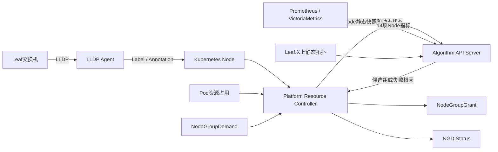

# NGD/NGG 拓扑感知资源池调度

本项目根据 Kubernetes Node、Pod、LLDP 直连 Leaf、Leaf 以上静态拓扑和 Prometheus 指标处理 `NodeGroupDemand`（NGD），计算满足资源与拓扑约束的节点集合，并生成正式 `NodeGroupGrant`（NGG）。

项目当前负责从拓扑采集到 NGG 生成的完整链路；下游 Volcano 或 kube-scheduler 如何消费 NGG 并完成 Pod 绑定不在当前代码范围内。

## 系统链路



一次计算的主要过程：

1. LLDP Agent 在每个节点采集直连 Leaf，并更新 Node Label 和 Annotation。
2. PRC 监听集群级 NGD，读取 Node、Pod 和 LLDP 元数据。
3. PRC 将 Node 静态快照同步给 Algorithm，并为每次请求构造动态资源状态。
4. Algorithm 合并 Leaf 以上拓扑及 Prometheus 指标，调用长期运行的 Python Worker。
5. Python Worker执行需求过滤、拓扑分组、资源可行性检查和负载评分。
6. PRC 采用排名第一的候选组创建或更新 `ngg-<ngd-name>`。
7. 成功结果写入 NGG 和 NGD Status；失败时将具体错误码与根因写入 NGD `status.message`。

## 组件

| 组件 | 目录 | 职责 |
|---|---|---|
| LLDP Agent | [`topology_agent/`](topology_agent/) | 以 DaemonSet 运行，通过 Linux Raw Socket接收LLDP，识别物理网卡和Bond，把一个或两个直连Leaf写入Node。程序不依赖`lldpd`。 |
| Platform Resource Controller | [`prc/`](prc/) | 监听NGD，采集Node/Pod状态，调用Algorithm，维护NGD/NGG生命周期及Status。 |
| Algorithm API Server | [`algorithm_server/go/`](algorithm_server/go/) | 提供HTTP接口，维护Node静态快照、上层拓扑和Prometheus指标缓存，并管理Python Worker。 |
| Python Algorithm Worker | [`algorithm_server/python/algorithm_worker/`](algorithm_server/python/algorithm_worker/) | 执行资源过滤、拓扑分组、候选组评分和失败根因分析；不维护跨请求缓存。 |

### 数据边界

- LLDP Agent只负责 Node 到直连 Leaf 的观测，不推断 Room、Border、Spine 等上层拓扑。
- Leaf 以上拓扑由 Algorithm 从独立 YAML 配置读取。
- PRC负责 Kubernetes 对象、静态快照同步和请求级动态状态，不执行算法评分。
- Algorithm的Go进程负责缓存、协议校验、Quantity规范化和Python进程生命周期。
- NGD继续使用 Kubernetes 原生 Quantity，例如`320`、`1280Gi`；内部计算使用规范化后的CPU毫核和内存字节。
- Python Worker只接收一次请求所需的完整上下文。

## 仓库结构

```text
.
├── topology_agent/        LLDP采集、Bond识别与Node元数据更新
├── prc/                   Platform Resource Controller
├── algorithm_server/      Go API Server与Python算法Worker
├── deploy-incluster/      当前目标集群三组件部署清单与演示文件
├── config/                通用Manager、RBAC和上层拓扑示例
├── docker/                按PRC、Algorithm、LLDP划分的Dockerfile
├── images/                镜像归档、验证脚本与验证结果
├── test/                  Go、Python、NGD集群测试及旧测试归档
├── scripts/               构建、发布、部署和性能测试脚本
├── docs/                  CRD、技术设计、测试与阶段文档
├── Makefile               常用构建和测试入口
└── go.work                本地Go多模块工作区
```

各目录的详细说明：

- [PRC说明](prc/README.md)
- [Algorithm说明](algorithm_server/README.md)
- [LLDP Agent说明](topology_agent/README.md)
- [Dockerfile说明](docker/README.md)
- [镜像构建与验证](images/README.md)
- [测试入口](test/README.md)
- [In-Cluster部署](deploy-incluster/README.md)
- [集群演示手册](deploy-incluster/demo/README.md)

## 环境要求

本地开发和测试需要：

- Go 1.25或更高版本；
- Python 3.10或更高版本；
- Bash与GNU Make；
- Docker和Docker Buildx，用于镜像构建与镜像级测试；
- `kubectl`，用于目标集群部署和验收。

Windows可以使用Git Bash或WSL执行Makefile和Shell脚本。Go、Python与Docker也可以分别在PowerShell中直接使用。

## 本地测试

首次运行先加载envtest环境：

```bash
source scripts/go-test-env.sh
```

运行正式Go测试：

```bash
make go-test-all
```

分组入口：

```bash
make go-test-topology-agent  # LLDP、Bond和Node元数据
make go-test-group1          # Go Algorithm调用真实Python Worker
make go-test-group2          # PRC客户端调用Algorithm和Mock Prometheus
make go-test-group3          # envtest中PRC监听NGD并生成NGG
make go-test-group4          # PRC、真实Algorithm和Python完整链路
make go-test-group5          # 周期刷新、更新、删除及Status字段隔离
make go-test-group7          # Active-Backup和负载均衡Bond拓扑链路
```

运行Python Worker单元测试：

```bash
PYTHONPATH=algorithm_server/python \
  python -m unittest discover -s test/python -p 'test_*.py'
```

运行3000 Node性能矩阵：

```bash
make benchmark-3000-all
make benchmark-3000-report
```

测试输入、Golden结果、实际输出和Debug方式见[`test/go/README.md`](test/go/README.md)。真实集群NGD测试见[`test/ngd/README.md`](test/ngd/README.md)。

## 镜像构建与发布

普通开发镜像：

```bash
make prc-image
make algorithm-image
make lldp-agent-image
```

发布流程先在Go构建容器中分别编译`linux/amd64`和`linux/arm64`二进制，再使用纯运行时Dockerfile打包：

```bash
RELEASE_VERSION=v0.6.2 make release-images
RELEASE_VERSION=v0.6.2 make release-verify
```

产物位于`images/`：

```text
images/ngd-ngg-prc-v0.6.2-multiarch.oci.tar
images/ngd-ngg-algorithm-v0.6.2-multiarch.oci.tar
images/ngd-ngg-lldp-v0.6.2-multiarch.oci.tar
images/SHA256SUMS
images/results/
```

登录Docker Hub后发布三个多架构Tag：

```bash
docker login -u ghwdsl
RELEASE_VERSION=v0.6.2 make release-push
```

Dockerfile统一位于`docker/<component>/`，完整发布与验证说明见[`images/README.md`](images/README.md)。

## Kubernetes部署

当前真实集群入口是[`deploy-incluster/`](deploy-incluster/)。清单使用`welkin-system`命名空间，包含：

- `lldp-agent.yaml`：ServiceAccount、RBAC和DaemonSet；
- `algorithm.yaml`：上层拓扑、Prometheus指标配置、Service和Deployment；
- `prc.yaml`：ServiceAccount、RBAC和Platform Resource Controller Deployment；
- `kustomization.yaml`：三组件统一部署入口。

部署前需要检查清单中的镜像地址、Prometheus/VictoriaMetrics地址、Bearer Token挂载、`CLUSTER_ID`和上层拓扑。仓库中的集群清单是当前联调环境配置，迁移到其他集群时必须按目标环境修改。

安装正式CRD：

```bash
kubectl apply -f docs/paas-schedbridge-master-new/crd-deploy/nodegroupdemand-crd.yaml
kubectl apply -f docs/paas-schedbridge-master-new/crd-deploy/nodegroupgrant-crd.yaml
```

创建命名空间并部署三组件：

```bash
kubectl create namespace welkin-system --dry-run=client -o yaml | kubectl apply -f -
kubectl apply -k deploy-incluster
```

检查运行状态：

```bash
kubectl get daemonset/lldp-agent -n welkin-system
kubectl get deployment/platform-resource-controller -n welkin-system
kubectl get deployment/ngd-ngg-algorithm -n welkin-system
kubectl get pods -n welkin-system -o wide
```

查看Node上的LLDP拓扑：

```bash
kubectl get nodes \
  -L topology.demo.ngg.io/leaf-switch,topology.demo.ngg.io/leaf-set-id,topology.demo.ngg.io/leaf-count
```

查看组件日志：

```bash
kubectl logs -n welkin-system daemonset/lldp-agent --tail=200
kubectl logs -n welkin-system deployment/platform-resource-controller --tail=200
kubectl logs -n welkin-system deployment/ngd-ngg-algorithm --tail=200
```

## NGD到NGG冒烟测试

应用演示NGD：

```bash
kubectl apply -f deploy-incluster/demo/ngd-go-test-demand.yaml
kubectl get ngd go-test-demand -o yaml
kubectl get ngg ngg-go-test-demand -o yaml
```

重点查看：

- NGD `status.phase`、`status.message`、`status.resolvedNodeCount`和`status.grantRef`；
- NGG `spec.nodes`、候选节点分数、`status.phase`和`status.resolvedCapacity`；
- PRC日志中的NGD事件、Algorithm调用和NGG发布；
- Algorithm日志中的拓扑解析、Prometheus刷新、候选组和失败根因。

测试结束后删除NGD，PRC会清理对应NGG：

```bash
kubectl delete -f deploy-incluster/demo/ngd-go-test-demand.yaml
kubectl get ngd,ngg -A
```

更多资源、拓扑和失败场景见[`test/ngd/`](test/ngd/)。

## 当前边界

本仓库已经覆盖LLDP采集、Node拓扑元数据、NGD监听、资源与拓扑计算、Prometheus指标、NGG生成和状态回写。测试中的envtest提供真实`kube-apiserver`与`etcd`，但不包含生产集群的ServiceAccount/RBAC、DNS、CNI、物理交换机或真实Prometheus，因此正式发布前仍需在目标集群完成联调。
