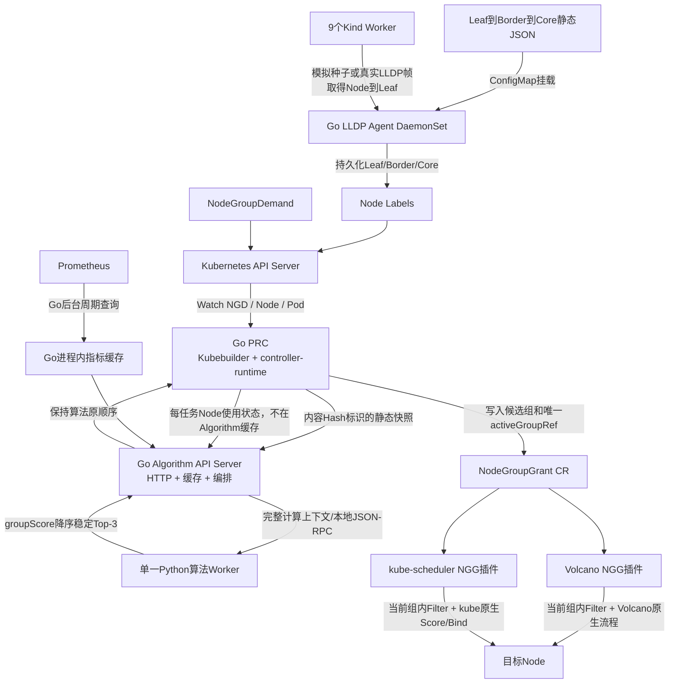

# NGD/NGG 两层调度 Demo v3

本工程验证“任务级节点组划分 + Pod 级调度”的完整闭环，并同时支持 VolcanoJob 和 Kubernetes Job。

- 第一层：Go PRC 读取 NGD、Node、Pod 和三层拓扑 Label，调用 Go Algorithm API Server；Go 负责 HTTP、静态/Prometheus 缓存和编排，单一 Python Worker 只执行算法函数，生成最多 3 个有序候选组的 NGG；
- 第二层：Volcano 插件或自定义 kube-scheduler 插件只允许当前 `activeGroupRef` 中的 Node；
- 当前组超时且零 Pod 绑定时，PRC 按 Algorithm 原顺序切到下一组；
- 任意任务 Pod 首次绑定后立即锁组，同一 NGD generation 不再跨组；
- 缺少有效 NGG 时两个插件都 Fail Closed，受管 Pod 保持 Pending。

## 整体结构



Kind 拓扑为 1 个 Control Plane 和 9 个 Worker：

```text
                            core-0
                    /          |          \
             switch-a       switch-b       switch-c
             /  |  \          /  \        /  |  |  \
       worker-01 02 03   worker-04 05  worker-06 07 08 09
```

| 交换机 | Worker 数 | 模拟带宽 | 模拟时延 |
|---|---:|---:|---:|
| switch-a | 3 | 20 Gbps | 1.5 ms |
| switch-b | 2 | 10 Gbps | 5 ms |
| switch-c | 4 | 25 Gbps | 1 ms |

## 关键目录

- `prc/`：正式 Go PRC，包含 controller-runtime Manager、Watch、Snapshot、Algorithm Client 和 NGG 状态机；
- `algorithm_server/`：Algorithm 完整实现目录；`go/` 负责 HTTP、缓存、Prometheus 与进程管理，`python/algorithm_worker/` 负责 Python 算法；
- `topology_agent/`：Go LLDP 采集、静态三层拓扑解析、Node Watch 和 Label 持久化；
- `src/ngd_ngg_demo/`：保留的 Python legacy PRC/LLDP 对照实现和公共领域逻辑，不作为当前镜像入口；
- `plugin/nodegroupgrant/`：Volcano NGG 插件；
- `plugin/kubescheduler/`：kube-scheduler NGG 插件及自定义 scheduler 注册入口；
- `config/crd/`：NGD、NGG、NNT CRD；
- `config/manager/`：PRC、Algorithm 和 LLDP Agent 部署；
- `config/kubescheduler/`：第二个 scheduler profile 和 Deployment；
- `manifests/monitoring/`：Prometheus、node-exporter 和 kube-state-metrics；
- `manifests/topology-*`：VolcanoJob 演示；
- `manifests/kubernetes-*`：Kubernetes Job 演示；
- `scripts/08-run-demo.sh`：Volcano Top-3、超时切组和锁组验收；
- `scripts/09-run-kubernetes-demo.sh`：kube-scheduler Fail Closed 和绑定验收；
- `results/generated-ngg-v2/`：实跑导出的 NGD、NGG、三层拓扑 Node YAML 和旧 NNT 对照 YAML。

## 从零运行

所有工程文件、Go 缓存、镜像归档和 Docker 数据都位于 `/mnt/data0`。

使用已有镜像归档：

```bash
cd /mnt/data0/volcano-scheduler/ngd-ngg-scheduling-demo
make demo-prebuilt
```

从源码重新构建：

```bash
make demo
```

只运行某一条演示：

```bash
make run             # VolcanoJob
make run-kubernetes  # Kubernetes Job + ngg-scheduler
make monitoring      # 单独安装或重新部署监控组件
make monitoring-check # 检查 Prometheus 查询和 Algorithm 指标缓存
```


只测试 Algorithm 或测试当前项目协议衔接：

```bash
make algorithm-test
make algorithm-go-test
make algorithm-1000-test
make algorithm-1000-demo
make algorithm-integration-test
```
单独构建或部署：

```bash
make prc-image
make algorithm-image
make lldp-agent-image
make plugin-image
make kube-scheduler-image

make prc
make algorithm
make lldp-agent
make plugin
make kube-scheduler
```

## 镜像归档

```text
images/
├── ngd-ngg-prc-v0.3.0.tar
├── ngd-ngg-algorithm-v0.4.0.tar
├── ngd-ngg-lldp-agent-v0.2.0.tar
├── volcano-ngg-scheduler-v1.15.0.tar
└── ngg-kube-scheduler-v1.35.3.tar
```

PRC 和自定义 kube-scheduler 都使用 Go 1.25 构建，Kubernetes 依赖锁定在 v1.35.3/v0.35.3；Volcano 插件锁定 v1.15.0。

## 当前验证结果

- Python 全项目 30 项测试通过，包含算法函数、单一 Worker、PRC 兼容契约和 1000 节点测试；
- 新 Algorithm 与当前 PRC/NGG 协议衔接测试 3 项通过；
- Go PRC 测试通过；主机没有 Go 时，测试脚本自动使用 `golang:1.25-alpine`，依赖缓存写入数据盘 `.cache/`；
- Go Algorithm v0.4.0 镜像构建成功；`/healthz`、`/readyz`、Go 静态/Prometheus 缓存、Python Worker、新 `/api/v1/allocate` 和旧 PRC 兼容接口均完成真实容器测试；
- Volcano 和 kube-scheduler 插件测试通过；
- Go LLDP Agent DaemonSet `9/9 Ready`，9 个 Worker 均写入 Leaf/Border/Core、带宽、时延、来源和拓扑版本 Label；
- Prometheus、kube-state-metrics 和 9 个 Worker 上的 node-exporter 正常运行；Algorithm 指标缓存包含 9 个 Node，`degraded=false`；
- Volcano 路径返回 `switch-c → switch-a → switch-b`，阻塞 switch-c 后切到 switch-a，4 个 Pod 绑定并锁组；
- Kubernetes Job 在没有 NGG 时 4 个 Pod 全部 Pending；创建 NGD/NGG 后 4 个 Pod 只落在 activeGroup 并进入 Running；
- Algorithm 重启后由 PRC 使用内容 Hash 重新同步静态 Node 快照；
- Kubernetes Job 和 VolcanoJob 均通过直接 Owner UID 与 NGD/NGG 关联。

主要证据：

- `results/generated-ngg-v2/ngg-topology.yaml`；
- `results/generated-ngg-v2/ngg-kubernetes.yaml`；
- `results/topology-placement.txt`；
- `results/kubernetes-fail-closed.txt`；
- `results/kubernetes-placement.txt`；
- `results/algorithm-calculation-result.txt`、`results/algorithm-metrics-cache-status.json`；
- `results/prometheus-query-checks.txt`、`results/prometheus-node-cpu.json`、`results/prometheus-node-memory.json`；
- `results/prc-v2.log`、`results/kube-scheduler.log`、`results/algorithm.log`。

## Prometheus 和 LLDP 边界

Kind 集群已部署 Prometheus、kube-state-metrics 和 node-exporter。node-exporter 只运行在 9 个 Worker 上；Prometheus 同时采集这 9 个 Worker 的主机指标、10 个 Kubernetes Node 的对象状态以及 kubelet/cAdvisor 指标。Go Algorithm 主进程通过集群内地址 `http://prometheus.monitoring.svc.cluster.local:9090` 每 30 秒查询 CPU、内存利用率并保存当前/上一份内存快照，不使用 Redis、Kafka或跨 Pod 共享内存。调度时 Go 将选定的指标快照连同静态节点和当次动态状态发给 Python Worker；Prometheus 暂时不可用时保留最后一次有效快照并标记 degraded。

`make demo` 和 `make demo-prebuilt` 已包含监控安装与端到端检查。也可执行 `make monitoring` 重新部署，再执行 `make monitoring-check` 验证 PromQL 返回值以及 Algorithm 缓存的 `enabled=true`、`ready=true`、`degraded=false` 和 `nodeCount=9`。最新 Volcano 实跑生成了非空的 `sha256:...` 指标快照身份，具体值见 `results/algorithm-calculation-result.txt`。

新接口使用 `nodeUsageStates[].inUse`。当前 Go PRC 尚未切换该字段，因此 Algorithm 暂时保留 `/api/v1/node-groups/calculate` 和旧 `schedulerState` 请求适配；这条兼容路径只用于项目平滑衔接，后续修改 PRC 后可删除。

Kind 使用 Go LLDP Agent 的 `Simulated` 模式；物理集群可用 `config/manager/lldp-agent-real-patch.yaml` 切为真实 `0x88CC` 监听。Agent 使用 Cobra CLI，启动时优先从 Node Label 恢复内存状态；仅在 Label 不完整时采集 Node→Leaf，再与 ConfigMap 中 Leaf→Border→Core 静态 JSON 合并并 Patch Node。PRC 优先读取 Label，旧 NNT 仅作为迁移回退。真实网卡、交换机命名和 NET_RAW 权限仍需在目标物理网络验证。
