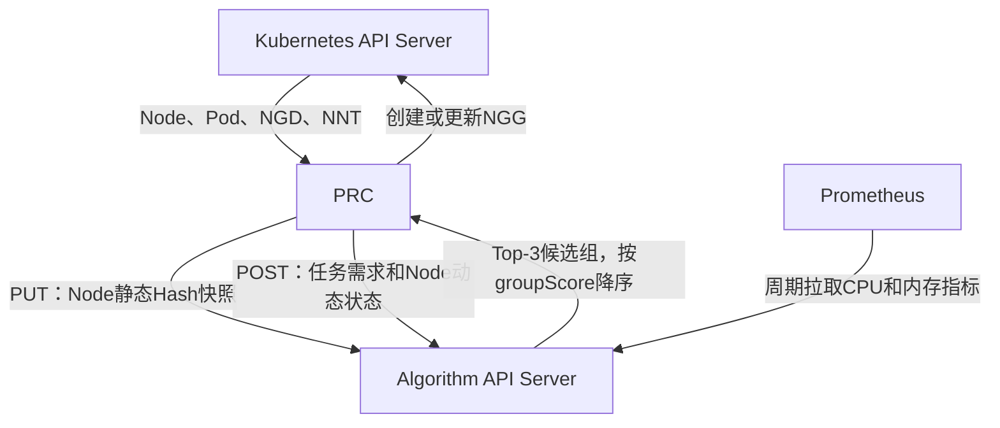
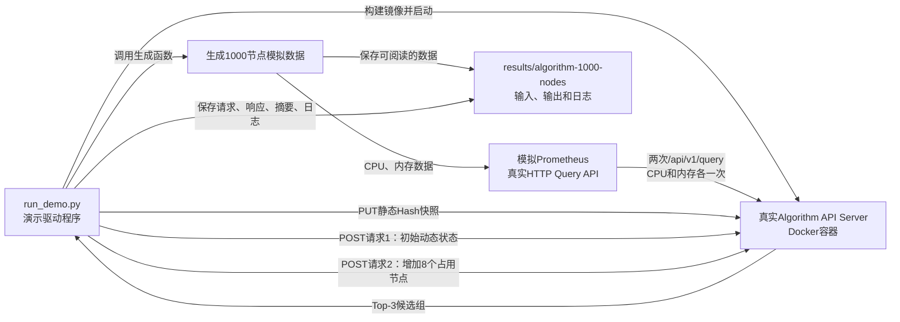

# Algorithm API Server 说明

本目录是 NGD/NGG 两层调度系统中的第一层算法服务。它不直接创建 Pod、不绑定 Node，也不写 NGG；它接收 PRC 提供的节点静态快照和任务级动态状态，读取并缓存 Prometheus 指标，执行可配置算法流水线，返回按分数排序的候选节点组。

## 1. 在整体系统中的位置



数据边界如下：

- Node 静态数据：由 PRC 上传，Algorithm 保存当前和前一个内容 Hash 快照。
- Node 动态数据：由 PRC 随每次任务请求发送，只在本次请求中使用，不跨请求缓存。
- Prometheus 指标：由 Algorithm 自己周期读取，进程内保存当前和前一个有效快照。
- 拓扑数据：位于静态 Node 的 `topology` 字段中，当前模型是 Core Switch → Leaf Switch → Node。
- 输出：最多 3 个候选组；Algorithm 稳定排序，PRC 不修改分数和顺序。

## 2. 目录结构

```text
algorithm_api_server/
├── README.md
├── demo_1000_nodes/
│   └── run_demo.py
└── algorithm_api_server/
    ├── app.py
    ├── models.py
    ├── pipeline.py
    ├── context.py
    ├── errors.py
    ├── quantity.py
    ├── cache/
    │   ├── static_nodes.py
    │   ├── scheduler_state.py
    │   ├── metrics.py
    │   └── snapshot_resolver.py
    ├── collectors/
    │   └── prometheus_collector.py
    ├── services/
    │   ├── node_view_builder.py
    │   └── result_builder.py
    ├── algorithms/
    │   ├── requirement.py
    │   ├── topology.py
    │   └── loadbalance.py
    └── config/
        └── loadbalance_profiles.json
```

各模块职责：

| 模块 | 职责 |
|---|---|
| `app.py` | FastAPI 路由、生命周期和统一错误响应 |
| `pipeline.py` | 装配缓存和服务，校验并执行算法流水线 |
| `context.py` | 保存一次调度计算中的数据和阶段结果 |
| `models.py` | 算法阶段及插件协议 |
| `errors.py` | 400、409、422、503 等业务错误 |
| `quantity.py` | Kubernetes CPU、内存、扩展资源数量解析与装箱检查 |
| `cache/static_nodes.py` | Hash 标识的当前/上一份 Node 静态快照 |
| `cache/scheduler_state.py` | 校验请求携带的动态状态；不做跨请求缓存 |
| `cache/metrics.py` | Prometheus 当前/上一份有效指标快照和降级状态 |
| `cache/snapshot_resolver.py` | 为一次计算解析静态和指标快照 |
| `collectors/prometheus_collector.py` | 调用 Prometheus instant query API |
| `services/node_view_builder.py` | 合并静态 Node、动态占用状态和任务选择条件 |
| `services/result_builder.py` | 构造新版响应及当前 PRC 使用的兼容响应 |
| `algorithms/requirement.py` | FILTER：节点标签、资源和占用状态过滤 |
| `algorithms/topology.py` | GROUP：优先生成 Leaf 组，必要时扩大到 Core 组 |
| `algorithms/loadbalance.py` | SCORE：结合资源、实时负载和拓扑质量评分 |
| `config/loadbalance_profiles.json` | 负载均衡权重配置 |

## 3. 算法流水线

默认流水线为：

```text
requirement/v1 (FILTER)
        ↓
topology/v1 (GROUP)
        ↓
loadbalance/v1 (SCORE)
        ↓
按 groupScore 降序稳定排序，最多返回 3 组
```

请求可以通过 `algorithms[]` 指定参数，但阶段顺序必须是 FILTER → GROUP → SCORE，并且三类阶段都必须存在。

### FILTER

综合以下数据形成当前任务的可用 Node 视图：

- 静态快照中的标签和 `allocatable`；
- `nodeUsageStates[].inUse`；
- `nodeRequirements.nodeSelector`；
- `podSets[].resourcesPerPod`。

### GROUP

默认先按 `leafSwitchId` 分组。叶交换机无法容纳任务且 `widestAllowedLevel=coreSwitch` 时，扩大为 `coreSwitchId` 分组。每组必须满足资源装箱和 `requiredDistinctNodes`。

### SCORE

节点分数综合资源基础分和 Prometheus CPU/内存负载；组分数再结合带宽、时延形成的拓扑质量。最终使用分数、拓扑层级和组 ID 做稳定排序。

## 4. HTTP 接口

| 方法和路径 | 作用 |
|---|---|
| `GET /healthz` | 进程存活检查 |
| `GET /readyz` | API 可接收请求检查；不等待缓存预热 |
| `GET /internal/v1/cache/status` | 查看静态快照、Prometheus 和动态状态模式 |
| `PUT /internal/v1/node-static-snapshots/{hash}` | 上传 Node 静态快照 |
| `POST /api/v1/allocate` | 新版候选组计算接口 |
| `POST /api/v1/node-groups/calculate` | 当前 Go PRC 使用的兼容接口 |

静态快照路径中的 Hash 必须是对以下内容进行稳定 JSON 编码后得到的 SHA-256：

```json
{
  "clusterId": "cluster-a",
  "topologyVersion": "core-leaf-node-v1",
  "nodes": []
}
```

动态状态是任务级完整数据，不使用增量版本：

```json
{
  "nodeUsageStates": [
    {"nodeUID": "uid-worker-0001", "inUse": false},
    {"nodeUID": "uid-worker-0002", "inUse": true}
  ]
}
```

## 5. Prometheus 配置

| 环境变量 | 默认值 | 说明 |
|---|---:|---|
| `PROMETHEUS_URL` | 空 | 空值表示关闭指标采集 |
| `PROMETHEUS_REFRESH_SECONDS` | 30 | 后台刷新周期 |
| `PROMETHEUS_STALE_SECONDS` | 120 | 指标过期阈值 |
| `PROMETHEUS_REQUEST_TIMEOUT_SECONDS` | 5 | 单次查询超时 |
| `PROMETHEUS_NODE_LABEL` | node | Prometheus 结果中的节点标签 |
| `PROMETHEUS_CPU_QUERY` | 内置 PromQL | Node CPU 使用率 |
| `PROMETHEUS_MEMORY_QUERY` | 内置 PromQL | Node 内存使用率 |

未要求实时指标时，Prometheus 不可用会返回 `degraded=true` 并继续使用硬约束；算法参数设置 `requireMetrics=true` 时，指标未就绪返回 HTTP 503。

当前 Kind Demo 已将 `PROMETHEUS_URL` 配置为 `http://prometheus.monitoring.svc.cluster.local:9090`。执行 `make monitoring` 可安装或重新部署 Prometheus、node-exporter 和 kube-state-metrics；Algorithm 部署完成后执行 `make monitoring-check`，会同时检查正式 PromQL 和 `/internal/v1/cache/status`，并把检查证据写入 `results/`。这里使用的是真实集群监控；下节 1000 节点独立演示使用的是模拟 Prometheus HTTP API，两者用途不同。

## 6. 1000 节点独立演示

该演示不需要 Kubernetes、Volcano 或 PRC，但会启动真实 Algorithm Docker 容器并通过 HTTP 调用所有关键接口。模拟规模为：

- 4 个 Core Switch；
- 每个 Core 下 25 个 Leaf Switch，共 100 个 Leaf；
- 每个 Leaf 下 10 个 Node，共 1000 个 Node；
- 1000 份 CPU/内存 Prometheus 指标；
- 1000 条请求级动态状态，其中初始 200 个 Node 为 `inUse=true`；
- 32 个带 GPU 资源需求的任务副本；
- 返回稳定排序的 Top-3 候选叶交换机组。

### 6.1 演示总体是怎么模拟的



演示中只有 Algorithm API Server 是项目的真实服务。Kubernetes API Server、PRC、Volcano 和真实 Prometheus 都没有启动：

- PRC 的行为由 `run_demo.py` 模拟：上传静态快照、构造任务请求、携带 Node 动态状态；
- Prometheus 由 Python 标准库实现一个临时 HTTP Server，返回与 Prometheus instant query 相同的 JSON 结构；
- Algorithm 使用正式 Dockerfile、正式 FastAPI 路由、正式缓存和正式算法代码；
- 所有调用都通过 HTTP 完成，不是直接调用 Python 算法类；
- 演示结束后自动停止 Algorithm 容器和模拟 Prometheus。

因此，这个 Demo 验证的是“PRC 已经准备好协议数据时，Algorithm 能否独立完成缓存、过滤、拓扑分组、评分和 Top-3 返回”。

### 6.2 1000 个 Node 静态数据怎么生成

节点编号从 `worker-0001` 到 `worker-1000`，UID 从 `uid-worker-0001` 到 `uid-worker-1000`。每个节点使用相同的静态资源容量：

| 资源 | 每个 Node 的 `allocatable` |
|---|---:|
| CPU | 32 核 |
| 内存 | 128 GiB |
| GPU | 4 张 |

每个 Node 还包含三个演示标签：

- `demo.ngg/worker=true`：任务的 `nodeSelector` 用它筛选计算节点；
- `demo.ngg/core=core-xx`：便于人查看节点所在 Core；
- `demo.ngg/leaf=leaf-xxx`：便于人查看节点所在 Leaf。

单个节点的模拟结构如下：

```json
{
  "nodeName": "worker-0001",
  "nodeUID": "uid-worker-0001",
  "allocatable": {
    "cpu": "32",
    "memory": "128Gi",
    "nvidia.com/gpu": "4"
  },
  "labels": {
    "demo.ngg/worker": "true",
    "demo.ngg/core": "core-01",
    "demo.ngg/leaf": "leaf-001"
  },
  "topology": {
    "coreSwitchId": "core-01",
    "leafSwitchId": "leaf-001",
    "bandwidthGbps": 25,
    "latencyMillis": 4.0
  }
}
```

静态快照内容由 `clusterId + topologyVersion + nodes` 组成。演示按照稳定 JSON 编码计算 SHA-256，例如：

```text
sha256:f2ee5a501ef72149c0e8080b03ac5ad100f2057ca10118197fb4d566d3407f55
```

驱动程序通过下面的真实接口上传快照：

```text
PUT /internal/v1/node-static-snapshots/{snapshotId}
```

Algorithm 会重新计算 Hash。路径中的 Hash 和内容不一致时请求失败，因此不是随便填写一个版本号。

### 6.3 三层拓扑怎么模拟

节点和交换机的映射规则是确定的：

```text
Node编号
  └─ 每10个Node组成1个Leaf Switch
       └─ 每25个Leaf Switch组成1个Core Switch
```

具体规模：

| 层级 | 数量 | 编号 | 下挂关系 |
|---|---:|---|---|
| Core Switch | 4 | `core-01` ～ `core-04` | 每个 Core 下 25 个 Leaf |
| Leaf Switch | 100 | `leaf-001` ～ `leaf-100` | 每个 Leaf 下 10 个 Node |
| Node | 1000 | `worker-0001` ～ `worker-1000` | 每个 Node 只属于一个 Leaf 和一个 Core |

例如：

```text
core-01
├── leaf-001
│   ├── worker-0001
│   ├── ...
│   └── worker-0010
├── leaf-002
│   ├── worker-0011
│   └── ...
└── leaf-025
    └── worker-0250

core-02
└── leaf-026 ～ leaf-050
```

为了让拓扑质量有差异，Leaf 按编号循环使用四组链路参数：

| 循环类型 | 带宽 | 时延 |
|---:|---:|---:|
| 1 | 25 Gbps | 4.0 ms |
| 2 | 40 Gbps | 2.5 ms |
| 3 | 50 Gbps | 1.5 ms |
| 4 | 100 Gbps | 0.8 ms |

这里的带宽和时延是演示值。真实集群中应由 LLDP/NNT、网络控制器或其他拓扑采集组件提供。

需要注意：

- Algorithm 真正使用的拓扑来自 `node-static-snapshot.json` 中每个 Node 的 `topology` 字段；
- `topology.json` 是根据同一批数据额外导出的“人类可读拓扑总览”；
- `topology.json` 不会被单独上传给 Algorithm，不能把它理解成第二个接口请求。

### 6.4 Prometheus 指标怎么模拟

演示为每个 Node 生成两个 0～1 之间的指标：

- `cpuUsageRatio`：CPU 使用率；
- `memoryUsageRatio`：内存使用率。

指标不是随机数，而是由 Leaf 编号和 Node 在 Leaf 内的位置计算，目的是保证每次演示的输入和排序稳定。简化公式如下：

```text
cpuUsageRatio =
  0.08 + ((leaf编号 × 13 + leaf内位置 × 7) mod 65) / 100

memoryUsageRatio =
  0.10 + ((leaf编号 × 11 + leaf内位置 × 5) mod 60) / 100
```

例如 `worker-0001` 的指标是：

```json
{
  "cpuUsageRatio": 0.28,
  "memoryUsageRatio": 0.26
}
```

`run_demo.py` 会临时启动一个模拟 Prometheus HTTP Server。Algorithm 仍然使用正式 `PrometheusCollector` 请求：

```text
GET /api/v1/query?query=<PromQL>
```

模拟服务返回标准 vector 形式：

```json
{
  "status": "success",
  "data": {
    "resultType": "vector",
    "result": [
      {
        "metric": {"node": "worker-0001"},
        "value": [时间戳, "0.28"]
      }
    ]
  }
}
```

Algorithm 启动后执行两次查询：

1. CPU PromQL 返回 1000 个 CPU 样本；
2. 内存 PromQL 返回 1000 个内存样本。

两组数据合并成一个包含 1000 个 Node 的进程内指标快照。演示请求设置 `requireMetrics=true`，如果指标没有读到、已经过期或处于 degraded 状态，接口会返回 503，而不会悄悄忽略指标。

`prometheus-metrics.json` 保存的是生成器内部的简化 Node→指标映射，便于查看和复现；Algorithm 实际读取的是模拟 HTTP Server 返回的 Prometheus vector，不是直接读取该 JSON 文件。

### 6.5 Node 动态状态怎么模拟

动态状态只使用当前协议确定的两个字段：

```json
{
  "nodeUID": "uid-worker-0005",
  "inUse": true
}
```

含义：

| 字段 | 含义 |
|---|---|
| `nodeUID` | 与静态快照中的 Node UID 关联，不能使用未知 UID |
| `inUse=false` | 该任务本次计算可以考虑这个 Node |
| `inUse=true` | 该 Node 当前已被占用，对这个任务直接排除 |

初始状态使用固定规则：每第 5 个 Node 为占用状态。因此：

- 1000 个 Node 中有 200 个 `inUse=true`；
- 每个 Leaf 有 10 个 Node，其中第 5、10 个被占用；
- 每个 Leaf 初始剩余 8 个可用 Node。

这里的 `inUse` 是二值状态，不表达“已经用了几核 CPU”。第一版协议中，节点一旦是 `true` 就整体排除；更细的 Pod 已请求资源、Taint、Volume、HostPort 等约束仍由 PRC/第二层调度器负责。

`node-dynamic-state.json` 是初始动态状态的单独展示文件。真实接口没有“上传动态状态”这一步，1000 条状态会完整嵌入每次 `allocation-request-*.json` 的 `nodeUsageStates` 中。Algorithm 只在该请求中使用它们，不给动态状态生成版本，也不跨请求缓存。

### 6.6 模拟的任务是什么

第一次请求模拟一个分布式 GPU 任务：

| 参数 | 值 | 含义 |
|---|---:|---|
| `replicas` | 32 | 期望副本数 |
| `minAvailable` | 32 | 本次节点组必须至少容纳 32 个副本 |
| 每 Pod CPU | 4 核 | 32 个 Pod 共需 128 核 |
| 每 Pod 内存 | 8 GiB | 32 个 Pod 共需 256 GiB |
| 每 Pod GPU | 1 张 | 32 个 Pod 共需 32 张 GPU |
| `requiredDistinctNodes` | 6 | 候选组至少包含 6 个可用 Node |
| `maxCandidateGroups` | 3 | 最多返回 3 个候选组 |

一个 Leaf 初始有 8 个可用 Node：

```text
CPU：8 × 32 = 256核      ≥ 任务需要128核
内存：8 × 128Gi = 1024Gi ≥ 任务需要256Gi
GPU：8 × 4 = 32张         = 任务需要32张
可用Node：8个             ≥ requiredDistinctNodes 6
```

所以每个正常 Leaf 都能独立容纳任务，算法优先返回 `leafSwitch` 级候选组，不需要扩大到 Core。GPU 是这个模拟任务的紧约束。

算法编排为：

```text
requirement/v1
  → 排除inUse节点，检查标签和单Pod资源

topology/v1
  → 按Leaf分组，验证整个组能否容纳minAvailable

loadbalance/v1
  → 使用Prometheus负载和拓扑质量评分

Top-3
  → groupScore降序；同分时按稳定规则排序
```

`balanced-v1` 的权重为：

- Node 资源基础分权重 0.4；
- Node 实时负载分权重 0.6；
- 形成组分数时拓扑质量权重 0.15。

由于所有 Node 的静态容量相同，演示中的组间差异主要由 CPU/内存使用率以及带宽、时延产生。

### 6.7 为什么要发送两次请求

第一次请求使用初始状态：每个 Leaf 有 8 个可用 Node。实跑结果为：

```text
leaf:leaf-016 → leaf:leaf-076 → leaf:leaf-032
```

第一次响应中 `leaf:leaf-016` 包含 8 个通过过滤的 Node。驱动程序把这 8 个 Node 在第二份完整动态状态中全部改成 `inUse=true`。加上这个 Leaf 原本已经占用的 2 个 Node，`leaf-016` 的 10 个 Node 全部不可用。

第二次请求：

- 静态快照 Hash 不变；
- Prometheus 指标快照不变；
- 任务资源需求和算法配置不变；
- `requestId` 改变；
- 动态状态中 `inUse=true` 从 200 条增加到 208 条。

实跑结果变为：

```text
leaf:leaf-076 → leaf:leaf-032 → leaf:leaf-092
```

这证明：

1. Algorithm 每次都使用请求携带的完整动态状态；
2. 第一请求的动态状态没有污染第二请求；
3. 被占用的 Node 会在 FILTER 阶段被排除；
4. 无可用 Node 的 `leaf-016` 不再进入候选组；
5. Algorithm 会从后续可行组中重新产生稳定 Top-3。

### 6.8 运行方式

```bash
cd /mnt/data0/volcano-scheduler/ngd-ngg-scheduling-demo
make algorithm-1000-demo
```

### 6.9 实际执行过程

1. 从当前代码构建 `ngd-ngg-algorithm:v0.3.0`；
2. 生成静态 Node、三层拓扑、Prometheus 指标和动态状态；
3. 启动模拟 Prometheus HTTP API；
4. 启动真实 Algorithm API Server 容器；
5. 等待 1000 个 Node 的指标进入缓存；
6. PUT 1000 节点静态 Hash 快照；
7. POST 第一次调度请求并校验 Top-3；
8. 将第一候选组节点全部标记为占用；
9. POST 第二次请求，校验该组已从候选结果中移除；
10. 保存全部输入、响应、摘要和服务日志。

结果位于：

```text
results/algorithm-1000-nodes/
├── node-static-snapshot.json
├── topology.json
├── prometheus-metrics.json
├── node-dynamic-state.json
├── allocation-request-1.json
├── allocation-response-1.json
├── allocation-request-2.json
├── allocation-response-2.json
├── demo-summary.json
└── algorithm-server.log
```

### 6.10 输出文件分别是什么

所有文件每次运行都会重新写入 `results/algorithm-1000-nodes/`。它们分为“模拟输入”“真实接口请求/响应”和“验收证据”三类。

| 文件 | 类型 | 内容和用途 |
|---|---|---|
| `node-static-snapshot.json` | 模拟静态输入 | 1000 个 Node 的名称、UID、容量、标签和拓扑，以及计算出的 `snapshotId` |
| `topology.json` | 可读拓扑证据 | 按 Core→Leaf→Node 展开的树形总览；不单独发送给 Algorithm |
| `prometheus-metrics.json` | 模拟指标源证据 | 1000 个 Node 的 CPU/内存利用率；模拟 HTTP Server 根据它构造 Prometheus vector |
| `node-dynamic-state.json` | 初始动态状态证据 | 1000 条 `nodeUID + inUse`，其中 200 条为 true |
| `allocation-request-1.json` | 真实接口请求 | 静态 Hash、任务需求、初始 1000 条动态状态、算法顺序和参数 |
| `allocation-response-1.json` | 真实接口响应 | 第一次请求的状态、快照身份、Top-3 组、组分和候选 Node |
| `allocation-request-2.json` | 真实接口请求 | 第一候选组的 8 个 Node 改为占用后的完整第二次请求 |
| `allocation-response-2.json` | 真实接口响应 | 第二次 Top-3，用于证明动态状态改变已经生效 |
| `demo-summary.json` | 验收摘要 | 节点/拓扑/指标数量、缓存状态、两次候选摘要和 PASS 状态 |
| `algorithm-server.log` | 服务证据 | Uvicorn 启动以及 health、cache、PUT、两次 POST 的 HTTP 200 日志 |

#### node-static-snapshot.json

顶层字段：

| 字段 | 含义 |
|---|---|
| `snapshotId` | 演示计算出的内容 SHA-256；用于 URL 和请求引用 |
| `clusterId` | 模拟集群身份 `algorithm-1000-node-demo` |
| `topologyVersion` | 当前拓扑模型版本 `core-leaf-node-v1` |
| `nodes` | 1000 个静态 Node 对象 |

文件中的 `snapshotId` 是为了展示方便附加的字段。PUT 时实际发送的 Hash 内容是 `clusterId + topologyVersion + nodes`，不会把 `snapshotId` 自己参与 Hash，否则会形成循环计算。

#### topology.json

这个文件从 Node 静态数据反向整理出三层树：

```json
{
  "model": "core-leaf-node",
  "coreSwitchCount": 4,
  "leafSwitchCount": 100,
  "nodeCount": 1000,
  "cores": [
    {
      "coreSwitchId": "core-01",
      "leafSwitches": [
        {
          "leafSwitchId": "leaf-001",
          "bandwidthGbps": 25,
          "latencyMillis": 4.0,
          "nodeNames": ["worker-0001", "...", "worker-0010"]
        }
      ]
    }
  ]
}
```

它适合检查拓扑是否生成正确；Algorithm 不读取这个文件。

#### prometheus-metrics.json

顶层 `source=mock-prometheus-http-api` 表明它是模拟指标；`nodeCount=1000` 用于快速核对数量；`nodes` 以 Node 名称为键保存 CPU 和内存使用率。

Algorithm 内部通过 Node 名称把 Prometheus 指标与静态 Node 对齐。Node 名称不存在于静态快照时，该指标不会产生可调度节点。

#### node-dynamic-state.json

- `scope=request`：强调数据是请求级；
- `nodeCount=1000`：状态覆盖全部静态 Node；
- `inUseCount=200`：初始排除节点数；
- `nodes`：完整状态列表。

这个文件本身不参与 HTTP 调用；相同列表被嵌入 `allocation-request-1.json`。

#### allocation-request-1.json

关键字段：

| 字段 | 含义 |
|---|---|
| `requestId` | 本次调用的唯一追踪 ID |
| `taskUID` | 被分配节点组的任务身份 |
| `ngdUID/ngdGeneration` | 对应 NGD 及其 generation |
| `nodeStaticSnapshotId` | 本次计算必须使用的静态 Hash |
| `podSets` | 副本数、Gang 最小数和每 Pod 资源 |
| `nodeRequirements` | Node 标签选择条件 |
| `nodeUsageStates` | 本次请求完整的 1000 条动态状态 |
| `algorithms` | FILTER、GROUP、SCORE 的顺序、版本和参数 |
| `maxCandidateGroups` | 返回候选组上限 3 |

#### allocation-response-1.json

关键字段：

| 字段 | 含义 |
|---|---|
| `algorithmBootId` | 当前 Algorithm 进程身份 |
| `nodeStaticSnapshotId` | 实际使用的静态快照 |
| `metricsSnapshotId` | 实际使用的指标快照 |
| `degraded/warnings` | Prometheus 是否降级以及警告 |
| `status` | 有候选组为 `SUCCESS`，无可行组为 `UNSATISFIABLE` |
| `candidateNodeGroups` | 最多 3 个有序候选组 |

每个候选组：

- `groupId`：例如 `leaf:leaf-016`；
- `topologyLevel`：本例为 `leafSwitch`；
- `groupScore`：组综合分；
- `rank`：Algorithm 最终顺序；
- `nodes`：组内通过过滤的 Node，以及每个 Node 的分数。

响应里的 Node 只有 8 个而不是 Leaf 下的 10 个，因为两个初始 `inUse=true` 的 Node 已在 FILTER 阶段删除。

#### allocation-request-2.json 和 allocation-response-2.json

第二份请求不是增量补丁，而是再次携带 1000 条完整状态。它与第一次请求的主要差异是第一候选组的 8 个可用 Node 也变为 `inUse=true`。

第二份响应用于检查 `leaf:leaf-016` 是否消失，并确认新的第三候选组 `leaf:leaf-092` 被补入。

#### demo-summary.json

这是最适合快速验收的文件：

- `status=PASS`：所有断言通过；
- `staticNodeCount=1000`：静态输入规模；
- `topology`：4 Core、100 Leaf、1000 Node；
- `prometheus.nodeMetricCount=1000`：指标覆盖数量；
- `prometheus.degraded=false`：计算使用了有效指标；
- `dynamicState`：第一次 200 个占用，第二次 208 个占用；
- `request1Candidates/request2Candidates`：两次候选摘要；
- `removedAfterDynamicStateChange`：预期被动态状态移除的组；
- `cacheStatus`：Algorithm 静态和指标缓存的真实状态。

#### algorithm-server.log

日志应至少出现以下五类成功请求：

```text
GET  /healthz                                      200
GET  /internal/v1/cache/status                     200
PUT  /internal/v1/node-static-snapshots/{hash}     200
POST /api/v1/allocate                              200
POST /api/v1/allocate                              200
```

它证明演示走的是实际 FastAPI HTTP 路由，而不是绕过 API 直接调用算法函数。

### 6.11 如何理解本次实际结果

第一次 Top-3：

| rank | groupId | groupScore | 可用 Node |
|---:|---|---:|---:|
| 1 | `leaf:leaf-016` | 82.04 | 8 |
| 2 | `leaf:leaf-076` | 82.04 | 8 |
| 3 | `leaf:leaf-032` | 81.94 | 8 |

`leaf-016` 和 `leaf-076` 分数相同，最终仍按照稳定规则得到固定顺序，因此重复运行不会随机交换。

第二次把 `leaf-016` 的 8 个候选 Node 设为占用后：

| rank | groupId | groupScore | 可用 Node |
|---:|---|---:|---:|
| 1 | `leaf:leaf-076` | 82.04 | 8 |
| 2 | `leaf:leaf-032` | 81.94 | 8 |
| 3 | `leaf:leaf-092` | 81.94 | 8 |

静态 Hash 和指标 Hash 都没有变化，只有请求级动态状态变化，所以候选变化可以明确归因于 `nodeUsageStates`。

### 6.12 成功标准

- 静态缓存显示 `nodeCount=1000`；
- Prometheus 缓存显示 `nodeCount=1000` 且 `degraded=false`；
- 返回 3 个叶交换机候选组，rank 为 1、2、3，分数降序；
- 候选节点均通过资源、标签和动态占用过滤；
- 第二次请求不再包含被新标记为占用的第一候选组；
- 终端输出 `Algorithm API Server 1000 节点独立演示：PASS`。

## 7. 其他测试

```bash
make algorithm-test
make algorithm-integration-test
make test
```

- `algorithm-test`：Algorithm 模块单元测试；
- `algorithm-integration-test`：与当前 Go PRC 请求、应答和 NGG 结构契约联调；
- `test`：整个 Demo 的 Python 回归测试。
