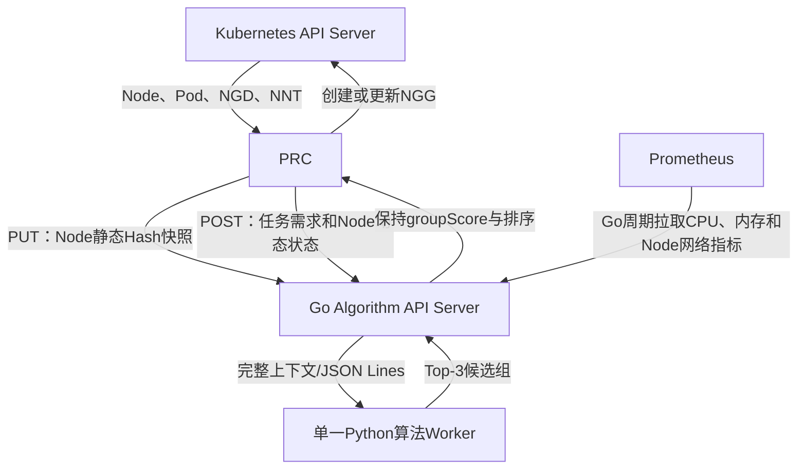
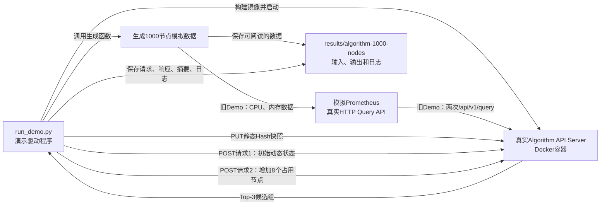

# Algorithm API Server 说明（Go 主进程 + Python 算法 Worker）

当前镜像版本为 `v0.4.0`。本目录集中保存 Algorithm 的全部实现：`go/` 是 HTTP 主服务、静态快照缓存、Prometheus 缓存、请求适配和进程管理；`python/algorithm_worker/` 只保存 Python 算法及单一 Worker 入口。

Python 不启动 FastAPI，也不保存跨请求缓存。镜像入口是 Go 二进制 `/app/algorithm-server`，它启动并管理唯一的 `python3 -m algorithm_worker.worker` 子进程。旧 Python HTTP、缓存、Prometheus 采集和响应组装实现已经删除，避免形成两套数据所有权。

## 1. 在整体系统中的位置



数据边界如下：

- Node 静态数据：由 PRC 上传，Go 保存当前和前一个内容 Hash 快照。
- Node 动态数据：由 PRC 随每次任务请求发送，只在本次请求中使用，不跨请求缓存。
- Prometheus 指标：由 Go 自己周期读取，进程内保存当前和前一个有效快照。
- 拓扑数据：位于静态 Node 的 `topology` 字段中，当前 profile 是 Node → Leaf → Border → Core；缺失可选 Border 数据时可继续扩大到 Core。
- 输出：Python 最多返回 3 个稳定排序候选组；Go 和 PRC 均不修改分数和顺序。

## 2. 目录结构

```text
algorithm_server/
├── README.md
├── demo_1000_nodes/
│   └── run_demo.py
├── go/
│   ├── main.go
│   ├── cache.go
│   ├── metrics.go
│   ├── metrics_config.go
│   ├── prometheus_metrics.json
│   ├── service.go
│   ├── worker.go
│   ├── types.go
│   └── cache_test.go
└── python/
    └── algorithm_worker/
        ├── worker.py
        ├── models.py
        ├── pipeline.py
        ├── context.py
        ├── errors.py
        ├── quantity.py
        ├── services/
        │   └── node_view_builder.py
        ├── algorithms/
        │   ├── requirement.py
        │   ├── topology.py
        │   └── loadbalance.py
        └── config/
            ├── topology_profiles.json
            └── loadbalance_profiles.json
```

各模块职责：

| 文件                                                         | 实现方式和功能                                                                                                                                                                |
| ------------------------------------------------------------ | ----------------------------------------------------------------------------------------------------------------------------------------------------------------------------- |
| `go/main.go`                                               | 正式 Server 入口。读取环境变量，启动 Python Worker、Prometheus 刷新协程和 Go`net/http` 服务，注册 health、ready、cache、snapshot 和 calculate 路由，处理 SIGTERM 优雅退出。 |
| `go/cache.go`                                              | Node 静态快照缓存。校验`sha256:` 内容 Hash、Node UID 唯一性和三层拓扑字段，内存中仅保留 current/previous 两份快照。                                                         |
| `go/metrics.go`                                            | Prometheus 采集与缓存。周期调用 instant query，按 Node 名合并 CPU、内存、吞吐、丢包、错误、重传、链路和带宽指标，记录覆盖率并维护 current/previous。                           |
| `go/metrics_config.go`                                     | 加载指标目录，配置 Bearer Token/Token 文件、CA、TLS Server Name 和超时，构造正式 Prometheus HTTP Client。                                                                    |
| `go/prometheus_metrics.json`                               | Mock 与真实 Prometheus 共用的指标契约，保存内部字段名、完整 PromQL、单位、归一化方式和 required 标志。                                                                        |
| `go/service.go`                                            | 一次调度请求的编排层。校验协议、解析静态快照、将 PRC`schedulerState` 适配为 `nodeUsageStates`、调用 Worker，并组装新/兼容 API 响应。                                      |
| `go/worker.go`                                             | Go 管理 Python 子进程。通过 stdin/stdout JSON Lines 发送完整请求上下文，用消息 ID 匹配结果，传递超时和业务错误；单 Worker 串行保证协议不串包。                                |
| `go/types.go`                                              | Go 内部协议类型：静态/指标快照、Worker 请求包、候选组结果、API 错误和 Prometheus 响应。                                                                                       |
| `../test_suites/group1_algorithm/`                         | 统一Algorithm测试组，将Cold和Warm作为两个独立Case展示；两者都统计PRC发送到接收和Algorithm内部处理时间。Mock Prometheus仅作为指标基础设施。                                                       |
| `go/go.mod`                                                | Go 模块定义；当前主服务只使用 Go 标准库。                                                                                                                                     |
| `python/algorithm_worker/worker.py`                        | Python 进程入口。从 stdin 读 JSON Lines，构造单次`AllocationContext`，执行 Pipeline，向 stdout 返回 Top-3 或结构化错误。                                                    |
| `python/algorithm_worker/pipeline.py`                      | 注册 requirement/topology/loadbalance，校验算法名、版本及 FILTER→GROUP→SCORE 顺序，执行后稳定截取 Top-3。                                                                   |
| `python/algorithm_worker/context.py`                       | 定义静态快照、指标快照和单次计算上下文；不保存跨请求状态。                                                                                                                    |
| `python/algorithm_worker/models.py`                        | 定义三个算法阶段枚举及 Python 算法插件`Protocol`。                                                                                                                          |
| `python/algorithm_worker/errors.py`                        | 定义输入、算法顺序/参数、未知算法和强制指标未就绪错误。                                                                                                                       |
| `python/algorithm_worker/quantity.py`                      | 解析 Kubernetes CPU、内存和扩展资源 Quantity，计算 PodSet 最小资源需求并进行节点装箱检查。                                                                                    |
| `python/algorithm_worker/services/node_view_builder.py`    | 合并 Node 静态属性、请求级占用状态和`nodeSelector`，生成本次算法使用的 Node 视图。                                                                                          |
| `python/algorithm_worker/algorithms/requirement.py`        | FILTER 插件：排除已占用、标签不符或无法满足单 Pod 资源的 Node。                                                                                                               |
| `python/algorithm_worker/algorithms/topology.py`           | GROUP 插件：按 profile 依次尝试 Leaf、Border、Core，选择能容纳整个 PodSet 的最窄层级。                                                                                         |
| `python/algorithm_worker/algorithms/loadbalance.py`        | SCORE 插件：综合资源、CPU/内存、网络利用率、丢包、错误、TCP 重传、链路状态、可用带宽和静态拓扑质量；组内 Node 也稳定按 score 降序。                                            |
| `python/algorithm_worker/config/topology_profiles.json`    | 三层拓扑字段与层级顺序配置；默认 profile 为 `leaf-border-core-v1`。                                                                                                          |
| `python/algorithm_worker/config/loadbalance_profiles.json` | 评分 profile 及资源、负载、拓扑权重，新增 profile 无需修改 Go 主服务。                                                                                                        |
| `demo_1000_nodes/run_demo.py`                              | 独立验证驱动：在内存中生成 1000 Node/拓扑/动态/指标数据，启动模拟 Prometheus 和真实 Algorithm 容器，走 HTTP 协议并导出证据。                                                  |
| `Dockerfile.algorithm`                                     | 位于项目根目录。第一阶段编译 Go 二进制，第二阶段加入 Python Worker，最终`ENTRYPOINT` 为 `/app/algorithm-server`。                                                         |

## 3. 算法流水线

默认流水线为：

```text
requirement/v1 (FILTER)
        ↓
topology/v1 (GROUP)
        ↓
loadbalance/v1 (SCORE)
        ↓
按 groupScore 降序稳定排序，最多返回 3 组
```

请求可以通过 `algorithms[]` 指定参数，但阶段顺序必须是 FILTER → GROUP → SCORE，并且三类阶段都必须存在。

### FILTER

综合以下数据形成当前任务的可用 Node 视图：

- 静态快照中的标签和 `allocatable`；
- `nodeUsageStates[].inUse`；
- `nodeRequirements.nodeSelector`；
- `podSets[].resourcesPerPod`。

### GROUP

默认先按 `leafSwitchId` 分组。叶交换机无法容纳任务且 `widestAllowedLevel=coreSwitch` 时，扩大为 `coreSwitchId` 分组。每组必须满足资源装箱和 `requiredDistinctNodes`。

### SCORE

节点分数综合资源基础分与 Prometheus CPU、内存和网络质量；组分数再结合静态带宽、时延形成的拓扑质量。Node 按 `score desc → nodeName → nodeUID` 排序，组按 `groupScore desc → topologyOrder → groupId` 排序。

## 4. HTTP 接口

| 方法和路径                                        | 作用                                    |
| ------------------------------------------------- | --------------------------------------- |
| `GET /healthz`                                  | 进程存活检查                            |
| `GET /readyz`                                   | API 可接收请求检查；不等待缓存预热      |
| `GET /internal/v1/cache/status`                 | 查看静态快照、Prometheus 和动态状态模式 |
| `PUT /internal/v1/node-static-snapshots/{hash}` | 上传 Node 静态快照                      |
| `POST /api/v1/allocate`                         | 新版候选组计算接口                      |
| `POST /api/v1/node-groups/calculate`            | 旧 Demo 的兼容接口；当前 PRC 已使用新版接口 |

静态快照路径中的 Hash 必须是对以下内容进行稳定 JSON 编码后得到的 SHA-256：

```json
{
  "clusterId": "cluster-a",
  "topologyVersion": "core-leaf-node-v1",
  "nodes": []
}
```

动态状态是任务级完整数据，不使用增量版本：

```json
{
  "nodeUsageStates": [
    {"nodeUID": "uid-worker-0001", "inUse": false},
    {"nodeUID": "uid-worker-0002", "inUse": true}
  ]
}
```

### 4.1 测试展示用 Pipeline Trace

测试请求可显式增加 `"debugTrace": true`。此时正式响应除候选组外还包含 `pipelineTrace`，依次给出 Requirement/FILTER、Topology/GROUP、LoadBalance/SCORE 的实际输入和输出。普通请求不返回该字段，也不会构造 Trace。

统一测试会把它拆分成便于展示的文件：

```text
intermediate/algorithm-pipeline/
├── 01-requirement/input.json + output.json
├── 02-topology/input.json + output.json
└── 03-loadbalance/input.json + output.json
```

该能力只用于验收留痕，不应作为生产业务协议的必填字段；生产性能数据应使用未开启 Trace 的请求测量。

## 5. Server 在哪里启动

### 5.1 最终进程入口

正式 Server 从 [`go/main.go`](go/main.go) 的 `main()` 启动。容器中的完整进程关系是：

```text
Docker ENTRYPOINT /app/algorithm-server
└─ Go main()
   ├─ 启动 HTTP Server，默认 :8080
   ├─ 启动 Prometheus 指标刷新 goroutine
   └─ 启动 python3 -m algorithm_worker.worker
      └─ 通过 stdin/stdout JSON Lines 执行 Python 算法
```

Python `worker.py` 是算法子进程入口，不是 HTTP Server 入口。对外的 8080 端口始终由 Go 提供。

### Go与Python原始协议证据

正式运行不落盘Go与Python之间的大报文。第一组`evidence-run`会显式设置：

```bash
ALGORITHM_WORKER_EVIDENCE_DIR=/evidence
```

此时Go主进程按stdin/stdout的真实JSON Lines协议输出：

- `go-to-python-request.jsonl`：Go发送给Python的完整`workerEnvelope`，包含请求级动态状态、Go静态缓存和Prometheus指标缓存；
- `python-to-go-response.jsonl`：Python返回给Go的候选组、Pipeline Trace或结构化错误。

`timing-run`不设置该环境变量，因此不会打开证据文件，也不会让协议写盘污染性能耗时。完整运行命令和结果目录见`test_suites/README.md`。

### 5.2 整个 Kind Demo 中如何启动

```text
make algorithm / make deploy / make demo-prebuilt
        ↓
scripts/04b-build-algorithm.sh       构建 v0.4.0 镜像并加载到 Kind
        ↓
scripts/05a-deploy-algorithm.sh      应用 Deployment/Service 并滚动重启
        ↓
config/manager/algorithm.yaml        在 ngd-ngg-system 启动 1 个 Pod
        ↓
scripts/08-run-demo.sh               只检查/使用已部署 Server，不临时启动 Server
```

- Deployment：`ngd-ngg-system/ngd-ngg-algorithm`
- Service：`ngd-ngg-system/ngd-ngg-algorithm:8080`
- PRC 访问地址：`http://ngd-ngg-algorithm.ngd-ngg-system.svc:8080`
- 镜像配置：`config/manager/algorithm.yaml`
- Demo 检查位置：`scripts/08-run-demo.sh` 开头的 Deployment、Service、rollout 和副本数检查

`make run` 本身不部署 Algorithm；它要求先执行 `make algorithm`、`make deploy` 或 `make demo-prebuilt`。

### 5.3 当前是否已切换最新版

当前源码、默认镜像变量、Deployment 和 1000 Node Demo 统一使用 `ngd-ngg-algorithm:v0.4.0`。但因为 Kind 使用本地镜像且 `imagePullPolicy=IfNotPresent`，不能只看 tag 判断是否最新；每次修改后应执行：

```bash
make algorithm
```

该命令会重建镜像、`kind load docker-image`、重启 Deployment 并等待 rollout。验证最新 Go+Python Worker 的标准是：

```bash
kubectl --context kind-volcano-ngd-ngg-v2-demo \
  -n ngd-ngg-system logs deployment/ngd-ngg-algorithm --tail=20

# 应出现：
# Go Algorithm API Server listening on :8080; Python module=algorithm_worker.worker
```

健康接口应返回 `"runtime":"go"` 和 `"algorithmWorker":"python"`。2026-08-19 的 Prometheus/拓扑/评分改造按要求未构建镜像、未滚动部署也未测试，因此现有集群 Pod 不能作为本轮源码版本的运行证据。

### 5.4 是否可以单独启动

可以。最稳定的方式是用 Docker，不需要 Kubernetes、Volcano 和 PRC：

```bash
cd /mnt/data0/volcano-scheduler/ngd-ngg-scheduling-demo
docker build -t ngd-ngg-algorithm:v0.4.0 -f Dockerfile.algorithm .
docker run --rm --name ngd-ngg-algorithm-standalone \
  -p 18080:8080 \
  -e PROMETHEUS_URL= \
  ngd-ngg-algorithm:v0.4.0
```

另一个终端验证：

```bash
curl http://127.0.0.1:18080/healthz
curl http://127.0.0.1:18080/readyz
curl http://127.0.0.1:18080/internal/v1/cache/status
```

关闭 Prometheus 时 Server 仍可启动，指标状态为 degraded；请求中的 `loadbalance.parameters.requireMetrics` 必须为 `false`。如需测试完整 PUT+POST 协议，直接执行：

```bash
make algorithm-1000-demo
```

该命令会使用内存 Mock 的 1000 Node 数据和模拟 Prometheus，只启动 1 个 Algorithm 容器，不会创建 1000 个 Kubernetes Node。

也可以不经 Docker 直接启动，但需要本机已安装 Go 和 Python 3：

```bash
cd /mnt/data0/volcano-scheduler/ngd-ngg-scheduling-demo/algorithm_server/go
PYTHONPATH=../python \
  ALGORITHM_LISTEN_ADDRESS=:18080 \
  PROMETHEUS_URL= \
  go run .
```

## 6. Prometheus 配置

| 环境变量                               |      默认值 | 说明                        |
| -------------------------------------- | ----------: | --------------------------- |
| `PROMETHEUS_URL`                     |          空 | 空值表示关闭指标采集        |
| `PROMETHEUS_REFRESH_SECONDS`         |          30 | 后台刷新周期                |
| `PROMETHEUS_STALE_SECONDS`           |         120 | 指标过期阈值                |
| `PROMETHEUS_REQUEST_TIMEOUT_SECONDS` |           5 | 单次查询超时                |
| `PROMETHEUS_NODE_LABEL`              | 指标目录中的 `node` | Prometheus 结果中的节点标签 |
| `PROMETHEUS_METRICS_CONFIG_FILE`     | 内嵌指标目录 | 可选的外部 JSON 指标目录   |
| `PROMETHEUS_BEARER_TOKEN`            | 空 | 直接配置 Bearer Token（与文件方式互斥） |
| `PROMETHEUS_BEARER_TOKEN_FILE`       | 空 | 从 Secret 挂载文件读取 Bearer Token |
| `PROMETHEUS_CA_FILE`                 | 空 | 自定义 CA PEM 文件          |
| `PROMETHEUS_TLS_SERVER_NAME`         | 空 | TLS Server Name             |
| `PROMETHEUS_INSECURE_SKIP_VERIFY`    | false | 仅隔离测试环境可显式启用  |

未要求实时指标时，Prometheus 不可用会返回 `degraded=true` 并继续使用硬约束；算法参数设置 `requireMetrics=true` 时，指标未就绪返回 HTTP 503。

内置目录读取 CPU、内存及 node-exporter 可提供的 11 项网络指标。CPU/内存为必需项；可选网络查询失败时保留该轮快照并返回 coverage/warning，但不会仅因可选项缺失就把整份快照判为 degraded。比例值限制到 0～1，bytes/s、packets/s 等绝对值只限制为非负数。

当前 Kind Demo 的 `PROMETHEUS_URL` 是 `http://prometheus.monitoring.svc.cluster.local:9090`。生产环境推荐把 Token 放入 Kubernetes Secret，再通过只读 Volume 挂载并设置 `PROMETHEUS_BEARER_TOKEN_FILE`，不要把 Token 写入日志或 ConfigMap。

## 7. 1000 节点独立演示

> 当前状态（2026-08-19）：Algorithm 已切换为完整 CPU/内存/网络指标目录和 Bearer 认证能力；本节旧 Demo 生成器仍只模拟 CPU/内存且不校验认证，因此本轮没有执行。下一阶段测试实现时必须按最新测试方案补齐全部查询与认证后再作为通过证据。

该演示不需要 Kubernetes、Volcano 或 PRC，但会启动真实 Algorithm Docker 容器并通过 HTTP 调用所有关键接口。模拟规模为：

- 4 个 Core Switch；
- 每个 Core 下 25 个 Leaf Switch，共 100 个 Leaf；
- 每个 Leaf 下 10 个 Node，共 1000 个 Node；
- 1000 份 CPU/内存 Prometheus 指标；
- 1000 条请求级动态状态，其中初始 200 个 Node 为 `inUse=true`；
- 32 个带 GPU 资源需求的任务副本；
- 返回稳定排序的 Top-3 候选叶交换机组。

### 7.1 演示总体是怎么模拟的



演示中只有 Algorithm API Server 是项目的真实服务。Kubernetes API Server、PRC、Volcano 和真实 Prometheus 都没有启动：

- PRC 的行为由 `run_demo.py` 模拟：上传静态快照、构造任务请求、携带 Node 动态状态；
- Prometheus 由 Python 标准库实现一个临时 HTTP Server，返回与 Prometheus instant query 相同的 JSON 结构；
- Algorithm 使用正式 Dockerfile、Go HTTP 路由、Go 缓存和 Python 算法代码；
- 所有调用都通过 HTTP 完成，不是直接调用 Python 算法类；
- 演示结束后自动停止 Algorithm 容器和模拟 Prometheus。

因此，这个 Demo 验证的是“PRC 已经准备好协议数据时，Algorithm 能否独立完成缓存、过滤、拓扑分组、评分和 Top-3 返回”。

### 7.2 1000 个 Node 静态数据怎么生成

节点编号从 `worker-0001` 到 `worker-1000`，UID 从 `uid-worker-0001` 到 `uid-worker-1000`。每个节点使用相同的静态资源容量：

| 资源 | 每个 Node 的`allocatable` |
| ---- | --------------------------: |
| CPU  |                       32 核 |
| 内存 |                     128 GiB |
| GPU  |                        4 张 |

每个 Node 还包含三个演示标签：

- `demo.ngg/worker=true`：任务的 `nodeSelector` 用它筛选计算节点；
- `demo.ngg/core=core-xx`：便于人查看节点所在 Core；
- `demo.ngg/leaf=leaf-xxx`：便于人查看节点所在 Leaf。

单个节点的模拟结构如下：

```json
{
  "nodeName": "worker-0001",
  "nodeUID": "uid-worker-0001",
  "allocatable": {
    "cpu": "32",
    "memory": "128Gi",
    "nvidia.com/gpu": "4"
  },
  "labels": {
    "demo.ngg/worker": "true",
    "demo.ngg/core": "core-01",
    "demo.ngg/leaf": "leaf-001"
  },
  "topology": {
    "coreSwitchId": "core-01",
    "leafSwitchId": "leaf-001",
    "bandwidthGbps": 25,
    "latencyMillis": 4.0
  }
}
```

静态快照内容由 `clusterId + topologyVersion + nodes` 组成。演示按照稳定 JSON 编码计算 SHA-256，例如：

```text
sha256:f2ee5a501ef72149c0e8080b03ac5ad100f2057ca10118197fb4d566d3407f55
```

驱动程序通过下面的真实接口上传快照：

```text
PUT /internal/v1/node-static-snapshots/{snapshotId}
```

Algorithm 会重新计算 Hash。路径中的 Hash 和内容不一致时请求失败，因此不是随便填写一个版本号。

### 7.3 三层拓扑怎么模拟

节点和交换机的映射规则是确定的：

```text
Node编号
  └─ 每10个Node组成1个Leaf Switch
       └─ 每25个Leaf Switch组成1个Core Switch
```

具体规模：

| 层级        | 数量 | 编号                               | 下挂关系                              |
| ----------- | ---: | ---------------------------------- | ------------------------------------- |
| Core Switch |    4 | `core-01` ～ `core-04`         | 每个 Core 下 25 个 Leaf               |
| Leaf Switch |  100 | `leaf-001` ～ `leaf-100`       | 每个 Leaf 下 10 个 Node               |
| Node        | 1000 | `worker-0001` ～ `worker-1000` | 每个 Node 只属于一个 Leaf 和一个 Core |

例如：

```text
core-01
├── leaf-001
│   ├── worker-0001
│   ├── ...
│   └── worker-0010
├── leaf-002
│   ├── worker-0011
│   └── ...
└── leaf-025
    └── worker-0250

core-02
└── leaf-026 ～ leaf-050
```

为了让拓扑质量有差异，Leaf 按编号循环使用四组链路参数：

| 循环类型 |     带宽 |   时延 |
| -------: | -------: | -----: |
|        1 |  25 Gbps | 4.0 ms |
|        2 |  40 Gbps | 2.5 ms |
|        3 |  50 Gbps | 1.5 ms |
|        4 | 100 Gbps | 0.8 ms |

这里的带宽和时延是演示值。真实集群中应由 LLDP/NNT、网络控制器或其他拓扑采集组件提供。

需要注意：

- Algorithm 真正使用的拓扑来自 `node-static-snapshot.json` 中每个 Node 的 `topology` 字段；
- `topology.json` 是根据同一批数据额外导出的“人类可读拓扑总览”；
- `topology.json` 不会被单独上传给 Algorithm，不能把它理解成第二个接口请求。

### 7.4 Prometheus 指标怎么模拟

演示为每个 Node 生成两个 0～1 之间的指标：

- `cpuUsageRatio`：CPU 使用率；
- `memoryUsageRatio`：内存使用率。

指标不是随机数，而是由 Leaf 编号和 Node 在 Leaf 内的位置计算，目的是保证每次演示的输入和排序稳定。简化公式如下：

```text
cpuUsageRatio =
  0.08 + ((leaf编号 × 13 + leaf内位置 × 7) mod 65) / 100

memoryUsageRatio =
  0.10 + ((leaf编号 × 11 + leaf内位置 × 5) mod 60) / 100
```

例如 `worker-0001` 的指标是：

```json
{
  "cpuUsageRatio": 0.28,
  "memoryUsageRatio": 0.26
}
```

`run_demo.py` 会临时启动一个模拟 Prometheus HTTP Server。Algorithm 仍然使用正式 `PrometheusCollector` 请求：

```text
GET /api/v1/query?query=<PromQL>
```

模拟服务返回标准 vector 形式：

```json
{
  "status": "success",
  "data": {
    "resultType": "vector",
    "result": [
      {
        "metric": {"node": "worker-0001"},
        "value": [时间戳, "0.28"]
      }
    ]
  }
}
```

Algorithm 启动后执行两次查询：

1. CPU PromQL 返回 1000 个 CPU 样本；
2. 内存 PromQL 返回 1000 个内存样本。

两组数据合并成一个包含 1000 个 Node 的进程内指标快照。演示请求设置 `requireMetrics=true`，如果指标没有读到、已经过期或处于 degraded 状态，接口会返回 503，而不会悄悄忽略指标。

`prometheus-metrics.json` 保存的是生成器内部的简化 Node→指标映射，便于查看和复现；Algorithm 实际读取的是模拟 HTTP Server 返回的 Prometheus vector，不是直接读取该 JSON 文件。

### 7.5 Node 动态状态怎么模拟

动态状态只使用当前协议确定的两个字段：

```json
{
  "nodeUID": "uid-worker-0005",
  "inUse": true
}
```

含义：

| 字段            | 含义                                           |
| --------------- | ---------------------------------------------- |
| `nodeUID`     | 与静态快照中的 Node UID 关联，不能使用未知 UID |
| `inUse=false` | 该任务本次计算可以考虑这个 Node                |
| `inUse=true`  | 该 Node 当前已被占用，对这个任务直接排除       |

初始状态使用固定规则：每第 5 个 Node 为占用状态。因此：

- 1000 个 Node 中有 200 个 `inUse=true`；
- 每个 Leaf 有 10 个 Node，其中第 5、10 个被占用；
- 每个 Leaf 初始剩余 8 个可用 Node。

这里的 `inUse` 是二值状态，不表达“已经用了几核 CPU”。第一版协议中，节点一旦是 `true` 就整体排除；更细的 Pod 已请求资源、Taint、Volume、HostPort 等约束仍由 PRC/第二层调度器负责。

`node-dynamic-state.json` 是初始动态状态的单独展示文件。真实接口没有“上传动态状态”这一步，1000 条状态会完整嵌入每次 `allocation-request-*.json` 的 `nodeUsageStates` 中。Algorithm 只在该请求中使用它们，不给动态状态生成版本，也不跨请求缓存。

### 7.6 模拟的任务是什么

第一次请求模拟一个分布式 GPU 任务：

| 参数                      |    值 | 含义                             |
| ------------------------- | ----: | -------------------------------- |
| `replicas`              |    32 | 期望副本数                       |
| `minAvailable`          |    32 | 本次节点组必须至少容纳 32 个副本 |
| 每 Pod CPU                |  4 核 | 32 个 Pod 共需 128 核            |
| 每 Pod 内存               | 8 GiB | 32 个 Pod 共需 256 GiB           |
| 每 Pod GPU                |  1 张 | 32 个 Pod 共需 32 张 GPU         |
| `requiredDistinctNodes` |     6 | 候选组至少包含 6 个可用 Node     |
| `maxCandidateGroups`    |     3 | 最多返回 3 个候选组              |

一个 Leaf 初始有 8 个可用 Node：

```text
CPU：8 × 32 = 256核      ≥ 任务需要128核
内存：8 × 128Gi = 1024Gi ≥ 任务需要256Gi
GPU：8 × 4 = 32张         = 任务需要32张
可用Node：8个             ≥ requiredDistinctNodes 6
```

所以每个正常 Leaf 都能独立容纳任务，算法优先返回 `leafSwitch` 级候选组，不需要扩大到 Core。GPU 是这个模拟任务的紧约束。

算法编排为：

```text
requirement/v1
  → 排除inUse节点，检查标签和单Pod资源

topology/v1
  → 按Leaf分组，验证整个组能否容纳minAvailable

loadbalance/v1
  → 使用Prometheus负载和拓扑质量评分

Top-3
  → groupScore降序；同分时按稳定规则排序
```

`balanced-v1` 的权重为：

- Node 资源基础分权重 0.4；
- Node 实时负载分权重 0.6；
- 形成组分数时拓扑质量权重 0.15。

由于所有 Node 的静态容量相同，演示中的组间差异主要由 CPU/内存使用率以及带宽、时延产生。

### 7.7 为什么要发送两次请求

第一次请求使用初始状态：每个 Leaf 有 8 个可用 Node。实跑结果为：

```text
leaf:leaf-016 → leaf:leaf-076 → leaf:leaf-032
```

第一次响应中 `leaf:leaf-016` 包含 8 个通过过滤的 Node。驱动程序把这 8 个 Node 在第二份完整动态状态中全部改成 `inUse=true`。加上这个 Leaf 原本已经占用的 2 个 Node，`leaf-016` 的 10 个 Node 全部不可用。

第二次请求：

- 静态快照 Hash 不变；
- Prometheus 指标快照不变；
- 任务资源需求和算法配置不变；
- `requestId` 改变；
- 动态状态中 `inUse=true` 从 200 条增加到 208 条。

实跑结果变为：

```text
leaf:leaf-076 → leaf:leaf-032 → leaf:leaf-092
```

这证明：

1. Algorithm 每次都使用请求携带的完整动态状态；
2. 第一请求的动态状态没有污染第二请求；
3. 被占用的 Node 会在 FILTER 阶段被排除；
4. 无可用 Node 的 `leaf-016` 不再进入候选组；
5. Algorithm 会从后续可行组中重新产生稳定 Top-3。

### 7.8 运行方式

```bash
cd /mnt/data0/volcano-scheduler/ngd-ngg-scheduling-demo
make algorithm-1000-demo
```

### 7.9 实际执行过程

1. 从当前代码构建 `ngd-ngg-algorithm:v0.4.0`；
2. 生成静态 Node、三层拓扑、Prometheus 指标和动态状态；
3. 启动模拟 Prometheus HTTP API；
4. 启动真实 Algorithm API Server 容器；
5. 等待 1000 个 Node 的指标进入缓存；
6. PUT 1000 节点静态 Hash 快照；
7. POST 第一次调度请求并校验 Top-3；
8. 将第一候选组节点全部标记为占用；
9. POST 第二次请求，校验该组已从候选结果中移除；
10. 保存全部输入、响应、摘要和服务日志。

结果位于：

```text
results/algorithm-1000-nodes/
├── node-static-snapshot.json
├── topology.json
├── prometheus-metrics.json
├── node-dynamic-state.json
├── allocation-request-1.json
├── allocation-response-1.json
├── allocation-request-2.json
├── allocation-response-2.json
├── demo-summary.json
└── algorithm-server.log
```

### 7.10 输出文件分别是什么

所有文件每次运行都会重新写入 `results/algorithm-1000-nodes/`。它们分为“模拟输入”“真实接口请求/响应”和“验收证据”三类。

| 文件                           | 类型             | 内容和用途                                                                    |
| ------------------------------ | ---------------- | ----------------------------------------------------------------------------- |
| `node-static-snapshot.json`  | 模拟静态输入     | 1000 个 Node 的名称、UID、容量、标签和拓扑，以及计算出的`snapshotId`        |
| `topology.json`              | 可读拓扑证据     | 按 Core→Leaf→Node 展开的树形总览；不单独发送给 Algorithm                    |
| `prometheus-metrics.json`    | 模拟指标源证据   | 1000 个 Node 的 CPU/内存利用率；模拟 HTTP Server 根据它构造 Prometheus vector |
| `node-dynamic-state.json`    | 初始动态状态证据 | 1000 条`nodeUID + inUse`，其中 200 条为 true                                |
| `allocation-request-1.json`  | 真实接口请求     | 静态 Hash、任务需求、初始 1000 条动态状态、算法顺序和参数                     |
| `allocation-response-1.json` | 真实接口响应     | 第一次请求的状态、快照身份、Top-3 组、组分和候选 Node                         |
| `allocation-request-2.json`  | 真实接口请求     | 第一候选组的 8 个 Node 改为占用后的完整第二次请求                             |
| `allocation-response-2.json` | 真实接口响应     | 第二次 Top-3，用于证明动态状态改变已经生效                                    |
| `demo-summary.json`          | 验收摘要         | 节点/拓扑/指标数量、缓存状态、两次候选摘要和 PASS 状态                        |
| `algorithm-server.log`       | 服务证据         | Go Server 启动、Python Worker 模块及 health、cache、PUT、两次 POST 的日志     |

#### node-static-snapshot.json

顶层字段：

| 字段                | 含义                                          |
| ------------------- | --------------------------------------------- |
| `snapshotId`      | 演示计算出的内容 SHA-256；用于 URL 和请求引用 |
| `clusterId`       | 模拟集群身份`algorithm-1000-node-demo`      |
| `topologyVersion` | 当前拓扑模型版本`core-leaf-node-v1`         |
| `nodes`           | 1000 个静态 Node 对象                         |

文件中的 `snapshotId` 是为了展示方便附加的字段。PUT 时实际发送的 Hash 内容是 `clusterId + topologyVersion + nodes`，不会把 `snapshotId` 自己参与 Hash，否则会形成循环计算。

#### topology.json

这个文件从 Node 静态数据反向整理出三层树：

```json
{
  "model": "core-leaf-node",
  "coreSwitchCount": 4,
  "leafSwitchCount": 100,
  "nodeCount": 1000,
  "cores": [
    {
      "coreSwitchId": "core-01",
      "leafSwitches": [
        {
          "leafSwitchId": "leaf-001",
          "bandwidthGbps": 25,
          "latencyMillis": 4.0,
          "nodeNames": ["worker-0001", "...", "worker-0010"]
        }
      ]
    }
  ]
}
```

它适合检查拓扑是否生成正确；Algorithm 不读取这个文件。

#### prometheus-metrics.json

顶层 `source=mock-prometheus-http-api` 表明它是模拟指标；`nodeCount=1000` 用于快速核对数量；当前旧生成器的 `nodes` 只保存 CPU 和内存使用率，尚未达到新版网络指标与认证测试要求。

Algorithm 内部通过 Node 名称把 Prometheus 指标与静态 Node 对齐。Node 名称不存在于静态快照时，该指标不会产生可调度节点。

#### node-dynamic-state.json

- `scope=request`：强调数据是请求级；
- `nodeCount=1000`：状态覆盖全部静态 Node；
- `inUseCount=200`：初始排除节点数；
- `nodes`：完整状态列表。

这个文件本身不参与 HTTP 调用；相同列表被嵌入 `allocation-request-1.json`。

#### allocation-request-1.json

关键字段：

| 字段                     | 含义                                    |
| ------------------------ | --------------------------------------- |
| `requestId`            | 本次调用的唯一追踪 ID                   |
| `taskUID`              | 被分配节点组的任务身份                  |
| `ngdUID/ngdGeneration` | 对应 NGD 及其 generation                |
| `nodeStaticSnapshotId` | 本次计算必须使用的静态 Hash             |
| `podSets`              | 副本数、Gang 最小数和每 Pod 资源        |
| `nodeRequirements`     | Node 标签选择条件                       |
| `nodeUsageStates`      | 本次请求完整的 1000 条动态状态          |
| `algorithms`           | FILTER、GROUP、SCORE 的顺序、版本和参数 |
| `maxCandidateGroups`   | 返回候选组上限 3                        |

#### allocation-response-1.json

关键字段：

| 字段                     | 含义                                                |
| ------------------------ | --------------------------------------------------- |
| `algorithmBootId`      | 当前 Algorithm 进程身份                             |
| `nodeStaticSnapshotId` | 实际使用的静态快照                                  |
| `metricsSnapshotId`    | 实际使用的指标快照                                  |
| `degraded/warnings`    | Prometheus 是否降级以及警告                         |
| `status`               | 有候选组为`SUCCESS`，无可行组为 `UNSATISFIABLE` |
| `candidateNodeGroups`  | 最多 3 个有序候选组                                 |

每个候选组：

- `groupId`：例如 `leaf:leaf-016`；
- `topologyLevel`：本例为 `leafSwitch`；
- `groupScore`：组综合分；
- `rank`：Algorithm 最终顺序；
- `nodes`：组内通过过滤的 Node，以及每个 Node 的分数。

响应里的 Node 只有 8 个而不是 Leaf 下的 10 个，因为两个初始 `inUse=true` 的 Node 已在 FILTER 阶段删除。

#### allocation-request-2.json 和 allocation-response-2.json

第二份请求不是增量补丁，而是再次携带 1000 条完整状态。它与第一次请求的主要差异是第一候选组的 8 个可用 Node 也变为 `inUse=true`。

第二份响应用于检查 `leaf:leaf-016` 是否消失，并确认新的第三候选组 `leaf:leaf-092` 被补入。

#### demo-summary.json

这是最适合快速验收的文件：

- `status=PASS`：所有断言通过；
- `staticNodeCount=1000`：静态输入规模；
- `topology`：4 Core、100 Leaf、1000 Node；
- `prometheus.nodeMetricCount=1000`：指标覆盖数量；
- `prometheus.degraded=false`：计算使用了有效指标；
- `dynamicState`：第一次 200 个占用，第二次 208 个占用；
- `request1Candidates/request2Candidates`：两次候选摘要；
- `removedAfterDynamicStateChange`：预期被动态状态移除的组；
- `cacheStatus`：Algorithm 静态和指标缓存的真实状态。

#### algorithm-server.log

日志应至少出现以下五类成功请求：

```text
GET  /healthz                                      200
GET  /internal/v1/cache/status                     200
PUT  /internal/v1/node-static-snapshots/{hash}     200
POST /api/v1/allocate                              200
POST /api/v1/allocate                              200
```

它证明演示走的是实际 Go HTTP 路由和 Go→Python Worker 调用，而不是绕过 API 直接调用算法函数。

### 7.11 如何理解本次实际结果

第一次 Top-3：

| rank | groupId           | groupScore | 可用 Node |
| ---: | ----------------- | ---------: | --------: |
|    1 | `leaf:leaf-016` |      82.04 |         8 |
|    2 | `leaf:leaf-076` |      82.04 |         8 |
|    3 | `leaf:leaf-032` |      81.94 |         8 |

`leaf-016` 和 `leaf-076` 分数相同，最终仍按照稳定规则得到固定顺序，因此重复运行不会随机交换。

第二次把 `leaf-016` 的 8 个候选 Node 设为占用后：

| rank | groupId           | groupScore | 可用 Node |
| ---: | ----------------- | ---------: | --------: |
|    1 | `leaf:leaf-076` |      82.04 |         8 |
|    2 | `leaf:leaf-032` |      81.94 |         8 |
|    3 | `leaf:leaf-092` |      81.94 |         8 |

静态 Hash 和指标 Hash 都没有变化，只有请求级动态状态变化，所以候选变化可以明确归因于 `nodeUsageStates`。

### 7.12 成功标准

- 静态缓存显示 `nodeCount=1000`；
- Prometheus 缓存显示 `nodeCount=1000` 且 `degraded=false`；
- 返回 3 个叶交换机候选组，rank 为 1、2、3，分数降序；
- 候选节点均通过资源、标签和动态占用过滤；
- 第二次请求不再包含被新标记为占用的第一候选组；
- 终端输出 `Algorithm API Server 1000 节点独立演示：PASS`。

## 8. 统一测试

原来位于各组件旁边的独立测试已经移除。当前统一测试位于 `test_suites/`，Algorithm 独立组入口为：

```bash
make demo-group1-timing
make demo-group1-evidence
make demo-group1
```

该组使用真实Go Server、真实长期Python Worker、Mock Prometheus基础设施和固定3000 Node Fixture。Timing与Evidence使用相同输入但独立运行：Timing不启用Trace或协议落盘；Evidence输出PRC↔Go HTTP、Go↔Python JSONL、Go缓存和Python Pipeline全过程。详细目录见`test_suites/README.md`。
