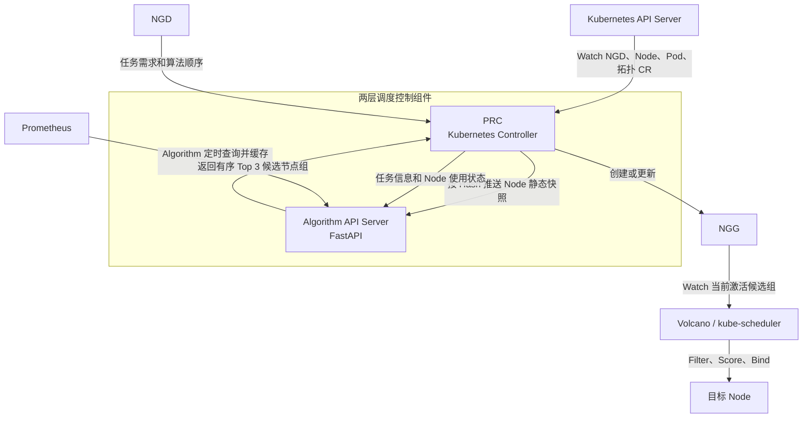
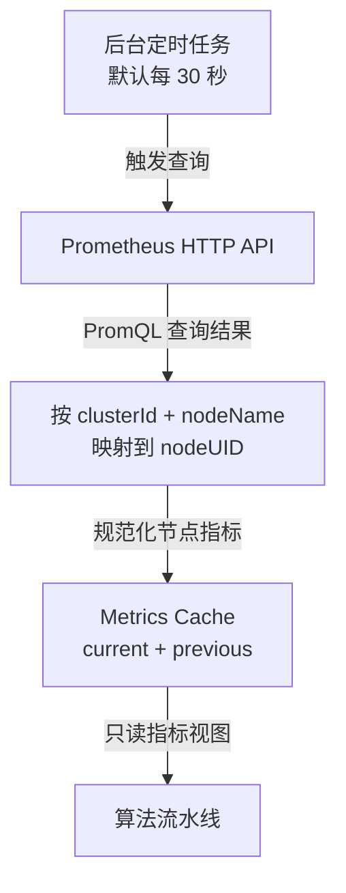
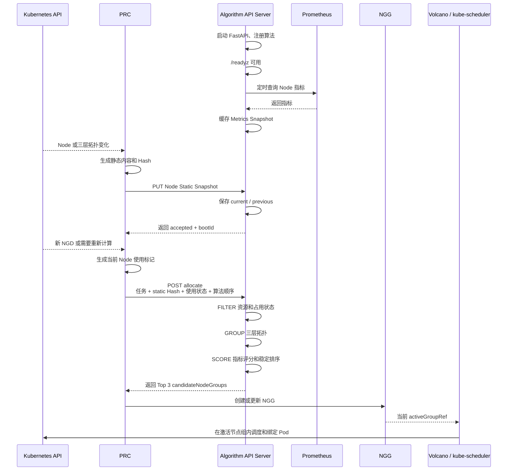

# Algorithm API Server 内存快照与可配置算法流水线实现说明 v1.1（修订版）

> 本文是 Algorithm API Server 的目标实现说明，覆盖原 v1.1 设计。  
> 本次仅确定接口、数据模型和实现方式，不表示相关代码已经完成。  
> PRC 需要配合修改的内容统一放在本文最后一章。

## 1. 文档目标

Algorithm API Server 负责接收 PRC 发来的任务计算请求，结合以下数据计算最多 3 个候选节点组：

1. PRC 提供的 Node 静态快照；
2. PRC 随任务请求发送的 Node 动态使用状态；
3. Algorithm API Server 自己从 Prometheus 读取并缓存的运行指标；
4. NGD 中指定的算法编排顺序及算法参数。

计算完成后，Algorithm API Server 按分数从高到低稳定返回候选节点组。PRC 不修改分数、不重新排序，只按照返回顺序创建 NGG 并逐组尝试。

本文明确不采用以下设计：

- 不使用 Redis；
- 不使用 Kafka；
- 不保存 Node 动态状态的全量缓存；
- 不实现 Node 动态状态增量同步；
- 不让 Algorithm API Server 直接访问 Kubernetes API；
- 不让 Algorithm API Server 创建或修改 NGD、NGG、Pod、Node。

## 2. 已确定的设计结论

本版本采用以下固定设计：

1. Algorithm API Server 与 PRC 在工程目录和部署架构上处于同一层级；
2. PRC 使用 Go、Kubebuilder 和 controller-runtime；
3. Algorithm API Server 使用 Python 和 FastAPI；
4. Node 静态快照由 PRC 生成并推送给 Algorithm API Server；
5. Node 静态快照使用内容 Hash 作为唯一身份；
6. Algorithm API Server 只在内存中保留当前静态快照和上一份静态快照；
7. Node 动态状态不在 Algorithm API Server 中长期缓存，由 PRC 随每次任务请求发送；
8. Node 动态状态第一版只用于标识节点当前是否已经被占用；
9. Prometheus 指标由 Algorithm API Server 自己定时读取并缓存在进程内；
10. 算法按“资源过滤、拓扑分组、评分选择”三个阶段执行；
11. PRC 可以通过有序的 `algorithms` 数组指定算法及参数；
12. Algorithm API Server 保持调用方给出的同阶段算法顺序，不自行重新排序；
13. 第一版拓扑采用三层结构：核心交换机、接入交换机、Node；
14. 计算结果统一返回最多 3 个 `candidateNodeGroups`；
15. Algorithm API Server 的 Kubernetes Readiness 不依赖静态快照和 Prometheus 指标是否已经就绪；
16. 缓存未准备好时，计算接口单独返回明确的错误状态；
17. PRC 的静态快照同步与 NGD 计算请求在逻辑上分开；
18. PRC 配合修改最后实施，本文先确定 Algorithm API Server 的目标接口。

## 3. 系统位置和职责

### 3.1 工程目录

目标目录结构如下：

```text
ngd-ngg-scheduling-demo/
├── prc/
├── algorithm_server/
│   └── python/algorithm_worker/
│       ├── __init__.py
│       ├── worker.py
│       ├── models.py
│       ├── pipeline.py
│       ├── context.py
│       ├── errors.py
│       ├── quantity.py
│       ├── services/
│       │   ├── __init__.py
│       │   └── node_view_builder.py
│       ├── algorithms/
│       │   ├── __init__.py
│       │   ├── requirement.py
│       │   ├── topology.py
│       │   └── loadbalance.py
│       └── config/
│           └── loadbalance_profiles.json
├── config/
├── tests/
└── docs/
```

PRC 和 Algorithm API Server 是两个独立组件，分别构建镜像和部署。

### 3.2 部署关系



### 3.3 职责边界

PRC 负责：

- 从 Kubernetes 获取 NGD、Node、Pod 和拓扑信息；
- 生成 Node 静态快照及其 Hash；
- 在节点静态信息变化时推送新快照；
- 在每次计算请求中标识哪些节点已经被占用；
- 将 NGD 的任务信息、算法顺序和参数发送给 Algorithm API Server；
- 校验 Algorithm 返回结果；
- 创建和更新 NGG；
- 按既有状态机逐组激活候选组。

Algorithm API Server 负责：

- 接收和缓存 Node 静态快照；
- 定时读取并缓存 Prometheus 指标；
- 校验任务请求、静态快照 Hash 和算法编排；
- 按算法流水线计算可行节点组；
- 稳定返回最多 3 个候选节点组；
- 提供健康检查、就绪检查和缓存状态接口。

Algorithm API Server 不负责：

- Watch Kubernetes 资源；
- 判断 NGD、NGG 生命周期；
- 将任何结果写回 Kubernetes；
- 绑定 Pod；
- 替代 Volcano 或 kube-scheduler 的最终调度检查。

## 4. 数据来源

### 4.1 Node 静态快照

Node 静态快照由 PRC 生成，内容发生变化时才重新推送。

静态信息至少包括：

- 集群标识；
- Node 名称和 UID；
- CPU、内存等可分配资源；
- 调度所需标签；
- 三层拓扑关系。

示例：

```json
{
  "snapshotId": "sha256:7bb9d0...",
  "clusterId": "demo-cluster",
  "createdAt": "2026-08-16T10:00:00Z",
  "nodes": [
    {
      "nodeName": "worker-a1",
      "nodeUID": "uid-worker-a1",
      "allocatable": {
        "cpuMilli": 8000,
        "memoryBytes": 17179869184,
        "gpu": 0
      },
      "labels": {
        "node-role": "worker"
      },
      "topology": {
        "coreSwitchId": "core-1",
        "leafSwitchId": "switch-a"
      }
    }
  ]
}
```

Hash 计算规则必须固定：

1. 对参与 Hash 的字段进行稳定排序；
2. JSON 使用固定序列化方式；
3. 不把 `createdAt` 等易变字段放入 Hash 内容；
4. 对规范化后的内容计算 SHA-256；
5. 生成 `sha256:<hex>` 格式的 `snapshotId`。

同一份内容必须生成同一个 Hash。

### 4.2 Node 动态使用状态

Node 动态状态不单独推送、不保存版本、不做增量同步，也不由 Algorithm API Server 长期缓存。

PRC 在每次任务请求中发送当前节点使用状态：

```json
{
  "nodeUsageStates": [
    {
      "nodeUID": "uid-worker-a1",
      "inUse": true
    },
    {
      "nodeUID": "uid-worker-a2",
      "inUse": false
    }
  ]
}
```

第一版只定义：

- `inUse: true`：该节点已经被其他资源池或任务占用，本次第一层算法不得选择；
- `inUse: false`：该节点可以进入本次第一层候选计算。

Node 动态状态是本次请求的即时输入。Algorithm API Server 不在请求完成后依赖这份数据处理其他任务。

Taint、Toleration、Affinity、Volume、HostPort 等 Pod 级细粒度约束继续由 Volcano 或 kube-scheduler 处理，不在第一版 `nodeUsageStates` 中重复实现。

### 4.3 Prometheus 指标

Prometheus 指标由 Algorithm API Server 自己读取和缓存，PRC 不传递这些指标。

第一版建议读取：

- Node CPU 使用率；
- Node 内存使用率；
- 必要时增加 GPU、网络带宽等指标。

指标读取流程：



指标缓存使用内容 Hash 标识：

```json
{
  "metricsSnapshotId": "sha256:metrics...",
  "capturedAt": "2026-08-16T10:00:30Z",
  "nodes": {
    "uid-worker-a1": {
      "cpuUsageRatio": 0.42,
      "memoryUsageRatio": 0.61
    }
  }
}
```

配置项建议包括：

```yaml
prometheus:
  enabled: true
  baseUrl: http://prometheus.monitoring.svc:9090
  refreshIntervalSeconds: 30
  requestTimeoutSeconds: 5
  maxMetricAgeSeconds: 120
```

如果某个算法声明必须使用 Prometheus，而指标缺失或过期，则本次计算返回明确错误；不依赖指标的算法仍可继续运行。

## 5. 三层拓扑模型

第一版拓扑固定为：

```text
Core Switch
    └── Leaf Switch
          └── Node
```

示例：

```text
core-1
├── switch-a
│   ├── worker-a1
│   ├── worker-a2
│   └── worker-a3
├── switch-b
│   ├── worker-b1
│   └── worker-b2
└── switch-c
    ├── worker-c1
    ├── worker-c2
    ├── worker-c3
    └── worker-c4
```

Algorithm API Server 只消费 PRC 已经整理好的拓扑字段，不读取 LLDP、不访问拓扑 CR，也不负责融合多种拓扑来源。

拓扑算法优先在同一个 Leaf Switch 中找到满足任务的节点组；单个 Leaf Switch 无法满足时，再根据算法参数决定是否允许扩大到同一个 Core Switch。

示例参数：

```yaml
name: topology
version: v1
parameters:
  strategy: NarrowestFit
  widestAllowedLevel: coreSwitch
```

第一版只接受：

- `leafSwitch`；
- `coreSwitch`。

后续扩展 region、datacenter、rack 等层级时，不改变节点组响应结构。

## 6. 内存缓存设计

Algorithm API Server 只维护两类缓存。

### 6.1 Static Snapshot Cache

保存：

- `current`：当前 Node 静态快照；
- `previous`：上一份 Node 静态快照。

用途：

- 支持正在进行中的请求完成；
- 支持 PRC 与 Algorithm 短时间版本交错；
- 避免静态信息每次随任务重复发送。

收到已有 Hash 时必须幂等返回成功。相同 Hash 对应不同内容时必须拒绝。

### 6.2 Metrics Cache

保存：

- `current`：最近一次成功读取的指标；
- `previous`：上一份成功读取的指标；
- 最近一次查询时间；
- 最近一次错误信息。

Prometheus 临时失败时保留上一份成功指标，并根据 `maxMetricAgeSeconds` 判断是否仍可使用。

### 6.3 不设置 Scheduler State Cache

本版本不设置 Scheduler State Cache，原因是 Node 使用状态随任务请求发送：

```text
PRC 生成任务请求
    ↓
请求携带 nodeUsageStates
    ↓
Algorithm 仅在本次计算中使用
    ↓
请求结束后不作为全局动态状态保留
```

因此不需要：

- Scheduler State Version；
- Scheduler State Hash；
- 全量动态状态同步接口；
- PATCH 增量接口；
- previousVersion；
- 增量丢失恢复；
- Algorithm 重启后的动态状态重建。

## 7. API 设计

### 7.1 存活检查

```http
GET /healthz
```

只检查进程和 HTTP 服务是否存活：

```json
{
  "status": "ok",
  "bootId": "algorithm-7b7568c4"
}
```

Kubernetes Liveness Probe 使用该接口。

### 7.2 Kubernetes 就绪检查

```http
GET /readyz
```

Ready 的含义是：

- FastAPI 已启动；
- 配置文件加载成功；
- 后台任务已经启动；
- 静态快照写入接口可以访问。

它不要求：

- 已经收到 Node 静态快照；
- Prometheus 已经查询成功；
- 当前已经能够执行所有算法。

这样 PRC 可以通过 Kubernetes Service 向刚启动的 Algorithm Pod 推送第一份静态快照，不会形成启动死锁。

### 7.3 缓存状态

```http
GET /internal/v1/cache/status
```

示例：

```json
{
  "bootId": "algorithm-7b7568c4",
  "nodeStatic": {
    "ready": true,
    "currentSnapshotId": "sha256:7bb9d0...",
    "previousSnapshotId": "sha256:61ed20..."
  },
  "metrics": {
    "ready": true,
    "currentSnapshotId": "sha256:metrics...",
    "capturedAt": "2026-08-16T10:00:30Z",
    "lastError": null
  }
}
```

### 7.4 推送 Node 静态快照

```http
PUT /internal/v1/node-static-snapshots/{snapshotId}
Content-Type: application/json
```

处理规则：

1. 校验路径 Hash 与请求体 `snapshotId` 一致；
2. 重新计算内容 Hash；
3. Hash 不一致时拒绝；
4. 与 current 相同则幂等成功；
5. 与 current 不同时，将 current 移到 previous，再写入新的 current。

成功响应：

```json
{
  "accepted": true,
  "snapshotId": "sha256:7bb9d0...",
  "bootId": "algorithm-7b7568c4"
}
```

### 7.5 计算候选节点组

```http
POST /api/v1/allocate
Content-Type: application/json
```

请求示例：

```json
{
  "requestId": "req-001",
  "taskUID": "task-001",
  "ngdUID": "ngd-001",
  "ngdGeneration": 3,
  "nodeStaticSnapshotId": "sha256:7bb9d0...",
  "podSets": [
    {
      "name": "worker",
      "replicas": 4,
      "minAvailable": 4,
      "resourcesPerPod": {
        "cpuMilli": 2000,
        "memoryBytes": 4294967296,
        "gpu": 0
      }
    }
  ],
  "nodeUsageStates": [
    {
      "nodeUID": "uid-worker-a1",
      "inUse": true
    },
    {
      "nodeUID": "uid-worker-a2",
      "inUse": false
    }
  ],
  "algorithms": [
    {
      "name": "requirement",
      "version": "v1",
      "parameters": {}
    },
    {
      "name": "topology",
      "version": "v1",
      "parameters": {
        "strategy": "NarrowestFit",
        "widestAllowedLevel": "coreSwitch"
      }
    },
    {
      "name": "loadbalance",
      "version": "v1",
      "parameters": {
        "profile": "balanced-v1"
      }
    }
  ],
  "maxCandidateGroups": 3
}
```

`podSets` 是第一版的任务资源模型。不能简单把 Pod 数推导为节点数，因为多个 Pod 可能共享节点，不同 PodSet 的单 Pod 资源也可能不同。

如果某个业务算法要求互不相同的独占节点，必须通过该算法参数显式声明，例如：

```yaml
parameters:
  requiredDistinctNodes: 4
```

## 8. 算法流水线

### 8.1 三个阶段

第一版固定三个阶段：

```text
FILTER
  资源与使用状态过滤
        ↓
GROUP
  三层拓扑分组
        ↓
SCORE
  指标评分、排序和候选选择
```

推荐内置算法：

| 算法 | 阶段 | 主要作用 |
|---|---|---|
| `requirement/v1` | FILTER | 排除已占用或资源不满足的节点 |
| `topology/v1` | GROUP | 按 Leaf/Core 拓扑形成可行节点组 |
| `loadbalance/v1` | SCORE | 使用 Prometheus 指标评分并选出 Top 3 |

### 8.2 编排顺序

PRC 按 NGD 中的顺序发送 `algorithms`。Algorithm API Server：

1. 不修改同一阶段内算法的先后顺序；
2. 不自动补充调用方未指定的算法；
3. 不自动重新排序；
4. 校验阶段只能从 FILTER 到 GROUP 再到 SCORE；
5. 如果出现阶段回退，则拒绝请求。

允许：

```text
requirement-a → requirement-b → topology → loadbalance
```

不允许：

```text
topology → requirement → loadbalance
```

这样既保留可配置性，也避免后执行的过滤算法让已经形成的拓扑组失效。后续新增算法时，只需要注册算法名称、版本、阶段、参数模型和执行函数。

### 8.3 算法注册表

建议接口：

```python
class AlgorithmPlugin(Protocol):
    name: str
    version: str
    stage: AlgorithmStage
    requires: set[str]
    provides: set[str]

    def validate_parameters(self, parameters: dict) -> None:
        ...

    def execute(
        self,
        context: AllocationContext,
        parameters: dict,
    ) -> StageResult:
        ...
```

注册表示例：

```python
REGISTRY = {
    ("requirement", "v1"): RequirementAlgorithm(),
    ("topology", "v1"): TopologyAlgorithm(),
    ("loadbalance", "v1"): LoadBalanceAlgorithm(),
}
```

每个阶段先返回 `StageResult`，验证成功后再提交到 Context，避免算法执行失败时留下部分修改。

### 8.4 稳定排序

候选组排序必须稳定：

1. 首先按 `groupScore` 降序；
2. 分数相同时按 `topologyLevel` 的固定优先级；
3. 仍相同时按 `groupId` 字典序；
4. Node 列表按 `nodeName` 排序；
5. 最多返回 `maxCandidateGroups`，且上限强制为 3。

同一输入和同一指标快照应得到相同顺序。

## 9. 返回结果

成功响应统一使用结构化候选组：

```json
{
  "requestId": "req-001",
  "taskUID": "task-001",
  "ngdUID": "ngd-001",
  "ngdGeneration": 3,
  "algorithmBootId": "algorithm-7b7568c4",
  "nodeStaticSnapshotId": "sha256:7bb9d0...",
  "metricsSnapshotId": "sha256:metrics...",
  "candidateNodeGroups": [
    {
      "rank": 1,
      "groupId": "leaf:switch-a",
      "topologyLevel": "leafSwitch",
      "groupScore": 93.5,
      "nodes": [
        {
          "nodeName": "worker-a1",
          "nodeUID": "uid-worker-a1"
        },
        {
          "nodeName": "worker-a2",
          "nodeUID": "uid-worker-a2"
        }
      ]
    },
    {
      "rank": 2,
      "groupId": "leaf:switch-c",
      "topologyLevel": "leafSwitch",
      "groupScore": 88.1,
      "nodes": [
        {
          "nodeName": "worker-c1",
          "nodeUID": "uid-worker-c1"
        }
      ]
    }
  ]
}
```

不再使用“主结果放在 `data`，备用结果放在 `alternatives`”的双重结构。

如果没有可行候选组，HTTP 仍返回 200，但业务状态明确表示不可满足：

```json
{
  "requestId": "req-001",
  "taskUID": "task-001",
  "ngdUID": "ngd-001",
  "ngdGeneration": 3,
  "status": "UNSATISFIABLE",
  "reason": "NO_FEASIBLE_NODE_GROUP",
  "candidateNodeGroups": []
}
```

## 10. 错误处理

建议错误分类：

| HTTP 状态 | 错误码 | 含义 |
|---|---|---|
| 400 | `INVALID_REQUEST` | 请求 JSON 或基础字段错误 |
| 409 | `STATIC_SNAPSHOT_NOT_FOUND` | 指定的静态 Hash 不在 current/previous |
| 422 | `UNKNOWN_ALGORITHM` | 算法名称或版本未注册 |
| 422 | `INVALID_ALGORITHM_ORDER` | 算法阶段顺序不合法 |
| 422 | `INVALID_ALGORITHM_PARAMETERS` | 算法参数不符合模型 |
| 503 | `REQUIRED_METRICS_NOT_READY` | 当前算法必须使用指标，但指标不可用 |
| 500 | `ALGORITHM_EXECUTION_FAILED` | 算法内部执行异常 |

错误响应必须带 `requestId`，便于与 PRC 日志关联：

```json
{
  "requestId": "req-001",
  "code": "STATIC_SNAPSHOT_NOT_FOUND",
  "message": "node static snapshot sha256:7bb9d0... is not available",
  "retryable": true
}
```

## 11. 就绪、启动和重启流程

### 11.1 启动流程

```text
FastAPI 启动
    ↓
加载算法注册表和配置
    ↓
启动 Prometheus 后台读取任务
    ↓
/readyz 返回成功
    ↓
PRC 可以通过 Service 推送静态快照
    ↓
收到静态快照后可以处理 allocate 请求
```

### 11.2 Algorithm 重启

Algorithm API Server 每次启动生成新的 `bootId`。内存静态快照丢失后：

1. `/readyz` 仍表示 HTTP 服务可访问；
2. `/internal/v1/cache/status` 显示静态缓存未就绪；
3. `/api/v1/allocate` 返回 `409 STATIC_SNAPSHOT_NOT_FOUND`；
4. PRC 重新推送当前静态快照；
5. 后续任务请求恢复执行。

Node 动态使用状态在每次请求中重新发送，因此不需要恢复动态缓存。

## 12. 并发和一致性

第一版建议：

- Algorithm API Server 使用 1 个 Pod；
- Uvicorn 使用 1 个 Worker；
- 静态缓存更新使用写锁；
- 计算请求开始时获取静态快照和指标快照的只读引用；
- 请求执行期间即使缓存更新，也继续使用请求开始时取得的引用；
- 不在多个 Worker 之间共享进程内缓存；
- 不引入 Redis 等外部状态组件。

单个请求必须固定使用：

- 一个 Node 静态快照 Hash；
- 请求自身携带的一份 Node 使用状态；
- 一个 Prometheus 指标快照 Hash。

响应回显这些快照身份，便于 PRC 校验和复现。

## 13. 推荐代码结构

```text
algorithm_server/
└── python/algorithm_worker/
    ├── __init__.py
    ├── app.py
    ├── models.py
    ├── pipeline.py
    ├── context.py
    ├── errors.py
    ├── quantity.py
    ├── cache/
    │   ├── __init__.py
    │   ├── static_nodes.py
    │   ├── scheduler_state.py
    │   ├── metrics.py
    │   └── snapshot_resolver.py
    ├── collectors/
    │   ├── __init__.py
    │   └── prometheus_collector.py
    ├── services/
    │   ├── __init__.py
    │   ├── node_view_builder.py
    │   └── result_builder.py
    ├── algorithms/
    │   ├── __init__.py
    │   ├── requirement.py
    │   ├── topology.py
    │   └── loadbalance.py
    └── config/
        └── loadbalance_profiles.json
```

## 14. 验证方案

### 14.1 静态快照

验证：

- 相同内容产生相同 Hash；
- 重复 PUT 幂等成功；
- 内容变化产生新 Hash；
- current/previous 正确切换；
- 路径 Hash 和内容 Hash 不一致时拒绝；
- 请求引用不存在的 Hash 时返回 409。

### 14.2 动态使用状态

验证：

- `inUse=true` 的节点不会进入候选组；
- `inUse=false` 的节点可以参与计算；
- 两个并发任务携带不同状态时互不污染；
- 请求完成后，状态不会影响下一次请求；
- 不存在 Scheduler State 增量同步接口。

### 14.3 Prometheus

验证：

- 后台任务按周期查询；
- 指标按 `clusterId + nodeName` 映射到 Node UID；
- 查询失败时保留上一份成功快照；
- 指标过期后，依赖指标的算法返回明确错误；
- 不依赖指标的算法可以继续执行。

### 14.4 算法流水线

验证：

- 按请求中的算法顺序执行；
- 同阶段多算法保持输入顺序；
- 阶段回退被拒绝；
- 未知算法和未知版本被拒绝；
- 参数错误被拒绝；
- 同一输入稳定得到同一排序。

### 14.5 候选组

验证：

- 最多返回 3 组；
- 按 `groupScore` 降序；
- 分数相同排序稳定；
- 每组包含 `rank`、`groupId`、`topologyLevel`、`groupScore` 和 Node；
- Leaf 无法满足时可按参数扩大到 Core；
- 无可行组时返回 `UNSATISFIABLE`。

## 15. PRC 后续需要配合的修改

本章只列出接口层面的后续工作，本次不修改 PRC 代码。

### 15.1 工程和部署

- 将 Algorithm API Server 调整为与 `prc/` 同级的独立工程目录；
- PRC 和 Algorithm 分别构建镜像；
- 两个 Deployment 放在同一系统命名空间；
- Algorithm Service 必须能在静态缓存为空时仍接收快照 PUT 请求。

### 15.2 静态快照同步

PRC 内部增加独立的 Static Snapshot Sync 逻辑：

- Watch Node 和三层拓扑数据；
- 规范化静态内容；
- 计算内容 Hash；
- 仅在 Hash 变化或 Algorithm `bootId` 变化时推送；
- 定期读取 Algorithm 缓存状态，发现重启后重新同步；
- 静态同步不依赖某个 NGD 是否正在 Reconcile。

### 15.3 任务请求

NGD Reconciler 调用 Algorithm 时需要发送：

- `requestId`；
- `taskUID`；
- `ngdUID` 和 `ngdGeneration`；
- 当前静态快照 Hash；
- `podSets`；
- 当前 `nodeUsageStates`；
- NGD 中有序的 `algorithms`；
- 每个算法的 `name`、`version` 和 `parameters`；
- `maxCandidateGroups`，最大为 3。

PRC 不再发送或维护：

- Scheduler State Version；
- Scheduler State Hash；
- 动态全量同步请求；
- 动态增量 PATCH；
- `previousVersion`。

### 15.4 三层拓扑

PRC 需要把现有拓扑信息统一整理为：

```json
{
  "coreSwitchId": "core-1",
  "leafSwitchId": "switch-a"
}
```

Algorithm 不关心这些字段是来自 Node Label、NNT、LLDP 还是其他来源。来源融合和冲突处理由 PRC 负责。

### 15.5 返回结果处理

PRC 按以下规则处理响应：

1. 校验 `requestId`、`taskUID`、`ngdUID` 和 `ngdGeneration`；
2. 校验返回的静态快照 Hash 与请求一致；
3. 接受最多 3 个 `candidateNodeGroups`；
4. 校验 `rank` 连续且分数按降序排列；
5. 不修改 `groupScore`；
6. 不重新排序；
7. 按返回顺序写入 NGG；
8. 只激活当前 `activeGroupRef`；
9. 候选组全部为空时，将 NGD 按既有状态机处理为不可满足。

## 16. 最终数据流



## 17. 实施边界

按照本文实施后，Algorithm API Server 的第一版能力是：

- 缓存 Hash 标识的 Node 静态快照；
- 接收任务级 Node 使用状态；
- 自主读取和缓存 Prometheus 指标；
- 按可配置但阶段受约束的流水线运行算法；
- 支持 Core Switch、Leaf Switch、Node 三层拓扑；
- 返回有序 Top 3 候选节点组；
- 重启后通过 PRC 重新同步静态快照恢复；
- 不保存 Kubernetes 状态，不承担最终 Pod 调度。

PRC 的具体代码修改、CRD 字段调整和部署清单修改在后续实施阶段单独处理。
