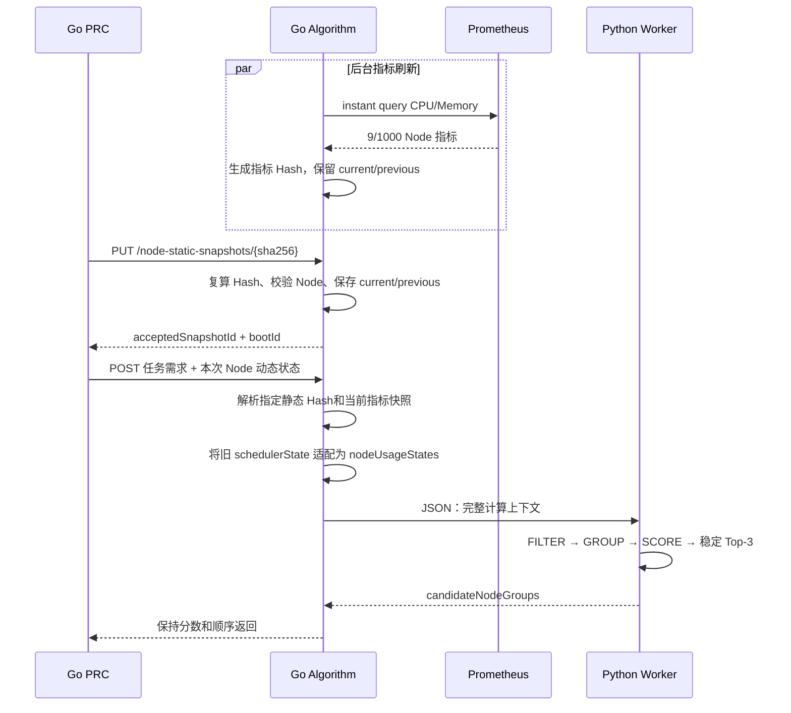

# Algorithm Go 主进程与 Python 算法 Worker 实现说明 v2.0

> 2026-08-19 补充：Prometheus 已扩展为配置化 CPU/内存/网络指标并支持 Bearer/TLS，拓扑已改为 Leaf→Border→Core profile，详细变化见 `Prometheus三层拓扑与联通正式NGG改造说明v2.1.md`。

## 1. 最终语言边界

当前实现采用下面的明确边界：

```text
Go PRC
  │ HTTP
  ▼
Go Algorithm API Server
  ├── HTTP 接口与错误响应
  ├── Node 静态 Hash 快照（current/previous）
  ├── Prometheus 周期读取与指标快照（current/previous）
  ├── PRC 旧/新动态状态字段适配
  ├── 请求校验、快照解析、响应构造
  └── Python Worker 生命周期与调用串行化
          │ 本地 JSON Lines RPC
          ▼
     单一 Python Worker
       ├── requirement/v1：FILTER
       ├── topology/v1：GROUP
       └── loadbalance/v1：SCORE + 稳定 Top-3
```

Python 只实现算法。它不监听 HTTP、不访问 Kubernetes、不查询 Prometheus，也不维护跨请求静态或指标缓存。

## 2. 为什么使用一个 Python Worker

所有 Python 算法注册在同一 Worker 进程中，由一个 `PipelineRunner` 顺序调用。这样满足多算法共进程要求，也避免每个算法各自复制 1000 节点静态快照和指标缓存。

Go 与 Python 没有使用 cgo 或嵌入式解释器。Go 启动子进程：

```bash
python3 -m algorithm_api_server.worker
```

双方使用标准输入/输出上的一行一个 JSON 消息。Go 每次传入已经解析好的静态快照、指标快照、动态状态和任务要求；Python 只返回候选组或结构化算法错误。

## 3. 代码位置

```text
algorithm_server/                     # Go 主进程
├── main.go                            # 启动、路由、健康检查
├── cache.go                           # 静态 current/previous Hash 缓存
├── metrics.go                         # Prometheus 读取和指标缓存
├── service.go                         # 请求适配、Worker 调用、响应构造
├── worker.go                          # Python 子进程与 JSON Lines RPC
├── types.go                           # 协议结构
└── cache_test.go                      # 缓存与 1000 Node Go 测试

algorithm_api_server/algorithm_api_server/
├── worker.py                          # 唯一 Python 生产入口
├── pipeline.py                        # 算法注册、阶段校验、Top-3
└── algorithms/
    ├── requirement.py
    ├── topology.py
    └── loadbalance.py
```

镜像由 `Dockerfile.algorithm` 多阶段构建：第一阶段编译静态 Go 二进制，第二阶段只放入 Python 解释器、算法包和 Go 二进制。容器入口为 `/app/algorithm-server`，版本为 `ngd-ngg-algorithm:v0.4.0`。

## 4. 一次计算的详细流程



Go 不修改 `groupScore`，也不重新排序。旧 PRC 接口只做拓扑级别和组 ID 的兼容格式转换，例如 `leaf:switch-a` 转成 `switch-a`。

## 5. Ready 与故障处理

- `/readyz` 不等待静态快照或 Prometheus 预热，避免 PRC 尚未上传静态快照时发生启动死锁。
- 指定静态 Hash 不在 current/previous 中时返回 HTTP 409、`STATIC_SNAPSHOT_NOT_FOUND`，PRC 可重新上传后重试。
- Prometheus 未就绪时，非强制指标算法可以降级计算；请求设置 `requireMetrics=true` 时由 Python 返回 503。
- Python 算法异常会转换为结构化错误；Python 标准错误输出进入容器日志。
- 动态 Node 状态始终属于单个请求，Go 和 Python 都不跨请求保存。

## 6. 已执行验证

### 6.1 1000 节点独立 HTTP Demo

执行：

```bash
make algorithm-image
make algorithm-1000-demo
```

Demo 在内存中模拟 1000 Node、4 Core、100 Leaf、1000 组 CPU/内存指标以及 1000 条动态状态，并通过真实 HTTP 请求调用容器。当前结果：

```text
Algorithm API Server 1000 节点独立演示：PASS
静态节点=1000，Core=4，Leaf=100
Prometheus节点指标=1000
第一次返回稳定Top-3
标记第一候选组为占用后，第二次不再返回该组
```

这 1000 个 Node 是内存 Mock 对象，不会创建 1000 个 Kind Worker，因此不会消耗 1000 台真实节点的容器运行资源。

### 6.2 当前 Kind 全链路

`scripts/08-run-demo.sh` 已验证：

```text
Go PRC
→ Go Algorithm v0.4.0
→ metricSnapshotId=sha256:...
→ Python Top-3: switch-c / switch-a / switch-b
→ PRC 写 NGG
→ switch-c 超时零绑定后切换 switch-a
→ 4 Pod 成功绑定并 Locked
```

因此当前不是“设计草案”，而是 Go 缓存/服务和 Python 算法分层后的实际运行路径。
