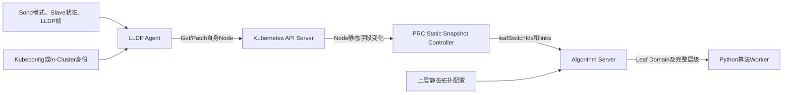

# Go LLDP拓扑采集与Node元数据持久化实现说明 v2.0

## 1. 当前实现边界

`topology_agent/`是Go实现的LLDP Agent，以DaemonSet运行，每个目标Worker一个Pod、一个Go进程。它只负责采集Node直接连接的Leaf及物理链路事实，不读取也不保存Border、Spine、机房、数据中心等上层拓扑。



当前主链路不安装、不注册、不Watch、不读取`NodeNetworkTopology`。`config/crd/nodenetworktopology.yaml`仅是历史定义，不参与当前运行。

## 2. Kubernetes连接

配置选择顺序为：

```text
--kubeconfig
→ KUBECONFIG
→ In-Cluster ServiceAccount
→ 默认kubeconfig
```

显式Kubeconfig或`KUBECONFIG`无效时直接启动失败，避免静默连接其他集群。Agent使用官方`client-go`调用Node Get/Patch；最小RBAC只有`nodes/get`和`nodes/patch`。

部署文件：

- `config/manager/lldp-agent.yaml`：默认In-Cluster、Kind模拟模式；
- `config/manager/lldp-agent-real-patch.yaml`：Host Network、NET_RAW、真实LLDP和宿主机`/sys/class/net`；
- `config/manager/lldp-agent-kubeconfig-patch.yaml`：挂载Kubeconfig Secret并关闭ServiceAccount自动挂载。

## 3. Bond与双Leaf

Agent从`/sys/class/net`读取Bond信息：

- `active-backup`：只选择`active_slave`；
- `802.3ad`、balance-xor等负载模式：选择所有链路Up的Slave；
- 普通网卡：按接口过滤条件直接采集；
- 同一Leaf重复出现时去重；Leaf集合排序后最多保留2个。

Agent每30秒重新探测。采集失败时保留Node上最后一次有效拓扑；新旧有效内容完全一致时不Patch，避免无意义API写入。

## 4. Node持久化格式

Label只保存适合索引的短字段：

```text
topology.demo.ngg.io/leaf-set-id=<Leaf集合内容Hash>
topology.demo.ngg.io/leaf-count=1|2
topology.demo.ngg.io/leaf-switch=<单Leaf兼容字段，仅值合法时写入>
```

Annotation保存原始事实：

```text
topology.demo.ngg.io/leaf-switch-ids=["Leaf-A","Leaf-B"]
topology.demo.ngg.io/leaf-links=[{"interfaceName":"eth0",...}]
topology.demo.ngg.io/source=LLDP|Simulated
topology.demo.ngg.io/observed-at=<RFC3339时间>
```

交换机长名称和JSON不受Kubernetes Label 63字符及字符集约束，因此必须放Annotation。`observed-at`只表示采集时间，PRC静态快照内容Hash不包含它。

## 5. PRC与Algorithm处理

PRC只Watch Node。它优先读取`leaf-switch-ids` Annotation，兼容期内可读取单值`leaf-switch` Label，并把规范化的`leafSwitchIds`和链路明细同步到Algorithm静态缓存。缺少Leaf元数据的Node不会回退到NNT。

Algorithm从自身上层拓扑配置解析Leaf所属Room、Border Domain及Peer Leaf。两个满足“同Room、同Border Domain、对称Peer关系”的Leaf组成稳定的Leaf Domain；单Leaf形成单成员Domain。一个双Leaf Node只归入一个Leaf Domain，容量和负载只统计一次。Python Worker按Leaf Domain作为最窄层级生成候选组。

## 6. 代码位置

| 功能 | 文件 |
|---|---|
| CLI、配置加载与进程启动 | `topology_agent/main.go`、`topology_agent/kube_config.go` |
| Node Get/Patch | `topology_agent/kube.go` |
| Bond识别和有效接口选择 | `topology_agent/pkg/bond/discovery.go`；入口适配为`topology_agent/bond.go` |
| Leaf规范化和Node元数据生成 | `topology_agent/pkg/topologyfacts/facts.go` |
| LLDP多接口接收与解析 | `topology_agent/lldp.go` |
| 周期采集、规范化和Patch去重 | `topology_agent/agent.go` |
| PRC Node静态快照 | `prc/pkg/controller/static_snapshot_controller.go`、`snapshot.go` |
| Algorithm Leaf Domain解析 | `algorithm_server/go/algorithm/topology.go` |
| Python拓扑分组 | `algorithm_server/python/algorithm_worker/algorithms/topology.py` |

## 7. 已完成测试

- Kubeconfig优先级、Context和无效显式配置失败；
- Active-Backup只选择主网卡，负载模式选择全部Up Slave；
- 单Leaf、双Leaf、长交换机名称、结果去重和稳定排序；
- PRC只从Node Annotation/Label生成快照，确认无NNT回退；
- 联通式长交换机名称及对称Peer Leaf形成同一Leaf Domain；
- 双Leaf Node在Algorithm解析后只出现一次；
- Group1～Group5原有主链路回归；Group7的Active-Backup与802.3ad全链路通过。

物理环境仍需验证交换机实际LLDP System Name、Bond驱动暴露方式、报文到达、Kubeconfig证书及安全策略。
