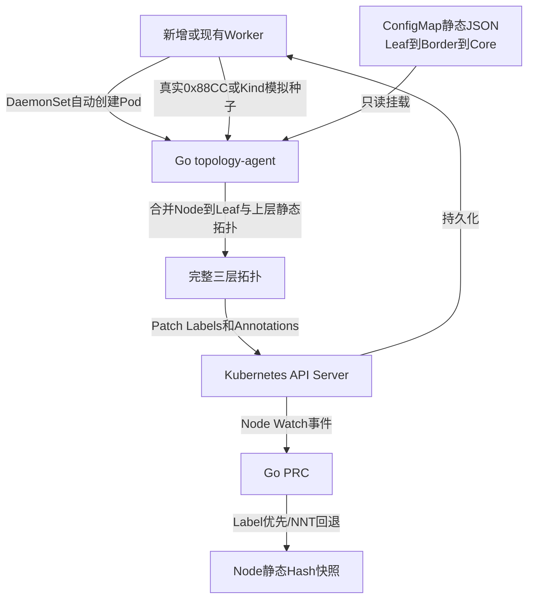

# Go LLDP 拓扑采集与 Node Label 持久化实现说明 v2.0

## 1. 当前实现

拓扑采集组件已经由 Python 改为 Go，源码位于 `topology_agent/`，镜像为 `ngd-ngg-lldp-agent:v0.2.0`。它使用 Cobra 提供命令行参数，并以 DaemonSet 运行在每个 Worker。



## 2. 动态与静态数据边界

- 动态采集：Node 连接的 Leaf 交换机、远端端口、本地网卡。物理集群来自 LLDP；Kind Demo 来自预置的模拟种子 Label。
- 静态配置：Leaf→Border→Core、链路带宽和时延，来自 `ngd-ngg-static-topology` ConfigMap 中的 JSON。
- 持久化：Leaf、Border、Core、带宽、时延、来源和版本写 Node Label；端口、网卡和采集时间写 Annotation。
- 内存：Agent 保存本 Node 当前 Observation。Pod 重启先读 Label，内容完整时直接恢复，不重新监听 LLDP，也不重复 Patch。

## 3. 新增 Node 的流程

```text
Kubernetes 新增 Worker
→ 满足 demo.ngg/worker=true 后 DaemonSet 自动创建 Agent Pod
→ Agent GET 自己的 Node
→ Label 不完整：采集 Node→Leaf
→ 查静态 JSON 得到 Border/Core
→ PATCH Node Labels/Annotations
→ PRC 收到 Node Watch 事件
→ Pending/Unsatisfied/Degraded NGD 重新计算
```

Agent 还会 Watch 自己的 Node。当拓扑 Label 已经完整时只恢复内存；Label 被清除或 Node 新建时才重新采集和持久化。

## 4. 真实 LLDP

Go 使用 Linux `AF_PACKET/SOCK_RAW` 监听 EtherType `0x88CC`，解析 Chassis ID、Port ID、TTL 和 System Name。部署具备：

```text
hostNetwork: true
CAP_NET_RAW
readOnlyRootFilesystem: true
runAs non-root image user
```

Kind 默认 `--mode=Simulated`。物理集群使用 `config/manager/lldp-agent-real-patch.yaml` 将参数改为 `--mode=LLDP`。真实网卡、交换机 System Name、报文到达和安全策略仍需要在联通物理环境验收。

## 5. 已验证结果

- Go LLDP 帧解析单测通过；
- Leaf→Border→Core 静态解析单测通过；
- 1000 份 Node Label 内存恢复单测通过；
- 当前 Kind DaemonSet 为 `9/9 Ready`；
- switch-a 的 3 个 Worker 写入 border-a，switch-b 的 2 个写入 border-b，switch-c 的 4 个写入 border-c，三组均连接 core-0；
- PRC 从 Label 生成新的静态 Hash，后续 Algorithm/NGG/Volcano 全链路验证通过；
- NNT CRD 和 PRC 回退读取暂时保留，新 Agent 不再写 NNT。
