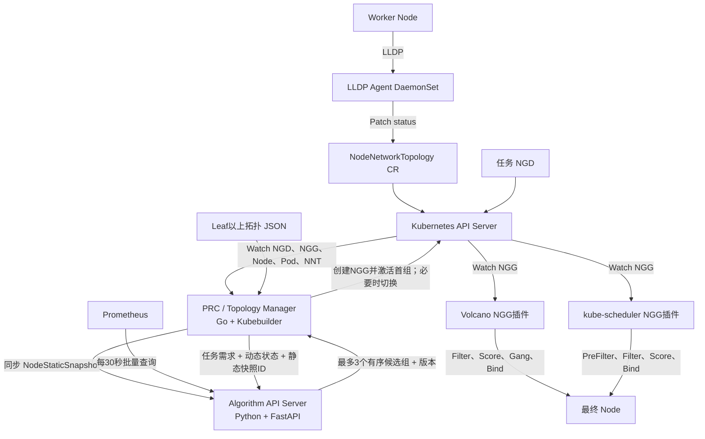

# Kubernetes–Volcano 任务级 NGD–NGG 两层调度统一技术方案

> 版本：v1.3  
> 日期：2026-08-14  
> 适用规模：约 500 个 Kubernetes Node

## 1. 文档目的

本方案面向同时使用 Volcano Scheduler 和 kube-scheduler 的 Kubernetes 集群，建设两层调度系统：

```text
第一层：为任务计算最多3个有序候选节点组，并激活其中一个
第二层：在授权节点组内完成Pod级实时调度与绑定
```

第一层以节点组需求 `NodeGroupDemand`（NGD）为输入，综合 Kubernetes 状态、网络拓扑和 Prometheus 负载，生成节点组授予 `NodeGroupGrant`（NGG）。

第二层由 Volcano 插件和 kube-scheduler 插件共同实现。Pod 根据 `spec.schedulerName` 只进入其中一个调度器，但两个插件使用相同的 NGG API、有效性校验和故障关闭规则。

NGG 的 `activeGroup` 仅表示当前节点边界，不是资源预留。最终绑定前仍由第二层调度器检查实时资源、Taint、Affinity、Volume 等约束。

## 2. v1.3 已确认决策

本版本正式确定以下设计：

1. PRC 使用 Go、Kubebuilder 和 controller-runtime 实现；
2. Algorithm API Server 使用 Python、FastAPI 实现；
3. 不引入 Redis、Kafka和跨 Pod 共享内存；
4. Algorithm 在进程内缓存 Node 静态快照和 Prometheus 指标；
5. Node 静态快照使用内容 Hash 作为协议身份，不依赖内存自增版本；
6. Node 动态调度状态由 PRC 按任务请求发送；
7. Algorithm 对可行拓扑组评分，按 `groupScore` 降序稳定返回，最多返回 3 个 `candidateNodeGroups`；
8. PRC 不修改分数、不重新排序，只按 Algorithm 给出的顺序逐组激活；
9. NGG 保存最多 3 个候选组和唯一 `activeGroupRef`，两个调度插件只允许当前激活组中的 Node；
10. 当前组在尝试超时后仍没有任何任务 Pod 绑定时，PRC 才能切换到下一组；
11. 任意任务 Pod 一旦成功绑定，PRC 立即锁定当前组，同一 NGD generation 内不再跨组切换；
12. 3 个候选组全部失败时，NGG 进入 `Inactive/Exhausted`，NGD 进入 `Unsatisfied`，等待资源或拓扑变化后重新计算；
13. Pod/Node 资源变化后，PRC 主动重新计算 Pending、Unsatisfied 和到达重试时间的 Degraded NGD；
14. 未锁定的 Active NGG 可在候选失效、静态拓扑变化或 TTL 即将到期时重新计算；已经锁组且存在已绑定 Pod 时，不自动换组；
15. Taint、Toleration、Affinity、Volume、HostPort 等细粒度约束第一版由第二层调度器处理；
16. Volcano NGG 插件和 kube-scheduler NGG 插件在同一实施阶段完成；
17. 缺少有效 NGG 时统一故障关闭，受管 Pod 保持 Pending；
18. 第一版支持 VolcanoJob 和 Kubernetes Job，Pod 通过直接 Owner UID 与任务绑定；
19. 拓扑 Demo 使用 1 个 Control Plane 和 9 个 Worker，模拟 switch-a、switch-b、switch-c 三个接入交换机，分别连接 3、2、4 个 Worker。

## 3. 核心对象和职责

### 3.1 NGD：任务需求

NGD 是第一层输入，描述：

- 任务引用和目标调度器；
- 一个或多个 PodSet 的副本数、`minAvailable` 和单 Pod 资源需求；
- Node Label、GPU 类型和拓扑要求；
- 算法流水线及参数；
- NGG TTL、超时和重试策略。

NGD 中的 `taskRef.uid` 可以省略。PRC 必须从 Kubernetes API 解析当前真实任务 UID；任务尚未创建时，NGD 进入 `Pending/TaskNotFound`。

### 3.2 PRC：控制和编排

PRC 负责：

- Watch NGD、NGG、Node、Pod 和 NodeNetworkTopology；
- 维护 Kubernetes 本地缓存；
- 生成 Node 静态快照；
- 计算 Node 动态账面状态；
- 同步静态快照到 Algorithm；
- 调用 Algorithm；
- 校验响应、候选组顺序、结果身份和数据版本；
- 维护当前组的尝试、切换、锁定和耗尽状态；
- 创建、更新、失效 NGG；
- 回写 NGD Status；
- 管理重试、TTL 和 Leader Election。

PRC 不实现 requirement、topology 或 loadbalance 算法，也不查询 Prometheus。

### 3.3 Algorithm API Server：算法和指标

Algorithm 负责：

- 接收并缓存不可变 Node 静态快照；
- 每 30 秒批量查询 Prometheus；
- 维护标准化指标内存快照；
- 合并静态、动态和指标数据；
- 执行 requirement、topology 和 loadbalance；
- 对候选组打分并稳定排序；
- 返回最多 3 个完整候选组、使用版本和降级状态。

Algorithm 不访问 Kubernetes API，不创建 NGD/NGG，不绑定 Pod。

### 3.4 NGG：节点组授权

NGG 是第一层输出，包含：

- NGD UID 和 generation；
- 任务 UID；
- 目标调度器；
- 最多 3 个按分数排序的 `candidateNodeGroups`；
- 唯一的 `activeGroupRef` 及其尝试状态；
- Node name、UID 和第一层分数；
- 静态、动态、指标和 Algorithm 实例版本；
- revision、生成时间和有效期；
- Active、Stale、Inactive 状态。

### 3.5 第二层调度器插件

Volcano 和 kube-scheduler 插件均负责：

- 在进程启动时创建一次 NGG Informer；
- 将有效 NGG 转换为本地 Node Set；
- 校验 Pod、任务、NGD、调度器和 Node 身份；
- 排除 `activeGroupRef` 所指候选组之外的 Node；
- 不在调度热路径远程调用 PRC 或 Algorithm。

## 4. 总体架构



## 5. 数据分类和一致性

### 5.1 Node 静态快照

静态快照包含低频变化字段：

- clusterId、Node name、UID、创建时间；
- CPU、内存和扩展资源 Allocatable；
- GPU 类型和算法使用的 Node Label；
- Node—Leaf 连接和 Leaf 以上融合拓扑；
- topologyVersion 和 topologyStatus。

静态快照使用规范化 JSON 计算：

```text
nodeStaticSnapshotId = SHA256(canonical NodeStaticSnapshot)
```

参与 Hash 的规范化内容不包含 `generatedAt`、本地自增序号等易变展示字段，数组按 Node UID、Map 按 Key 稳定排序。因此同一份有效内容在不同 PRC 副本上得到相同 ID。Node UID、容量、算法 Label、网络拓扑或上层 JSON 版本变化，都会产生新的 ID。

可额外保留仅用于展示的 `nodeStaticRevision`，但协议一致性只检查 Snapshot ID。

### 5.2 Node 动态调度状态

动态状态包含：

- Ready；
- Unschedulable；
- 每个 Node 上已绑定、未终止 Pod 的 Resource Requests；
- 快照生成时间。

第一版不在 Algorithm 中处理 Taint/Toleration。Taint 可以不发送，或者仅用于审计，不作为 Node 全局可用状态。

账面剩余资源为：

```text
Available(node)
= Allocatable(node)
- BoundPodRequests(node)
```

动态状态按规范化内容生成：

```text
schedulerStateSnapshotId = SHA256(canonical SchedulerState)
```

它只用于本次请求和结果追踪，不要求 Algorithm 长期缓存。

### 5.3 Prometheus 指标

Prometheus 指标仅用于硬约束通过后的软评分：

| 资源 | 当前利用率 | 30分钟平均值 | 30分钟P95 |
|---|---:|---:|---:|
| CPU | 是 | 是 | 是 |
| 内存 | 是 | 是 | 是 |
| GPU | 是 | 是 | 是 |

Metrics Collector 每 30 秒批量查询所有 Node，禁止逐 Node 查询。Prometheus 使用 `cluster_id + node_name` 定位节点，再通过静态索引映射为当前 Node UID。

Node 同名重建后 UID 改变。新 Node 不继承旧 UID 的历史数据；创建未满 30 分钟时，历史平均值和 P95 标记为无效或降权。

### 5.4 一次计算使用的数据版本

NGG 记录：

```text
nodeStaticSnapshotId
+ schedulerStateSnapshotId
+ metricSnapshotId
+ algorithmBootId
```

`algorithmBootId` 在 Algorithm 每次进程启动时生成，用于识别缓存丢失和服务重启。

## 6. Node 静态快照同步

Algorithm 提供：

```http
PUT /internal/v1/node-static-snapshots/{snapshotId}
GET /internal/v1/node-static-cache/status
```

同步流程：

```text
PRC构建规范化快照并计算SHA256
→ PUT完整快照
→ Algorithm校验snapshotId、checksum、Node UID唯一性和Node数量
→ 构建不可变Snapshot B
→ 原子切换当前快照引用
→ 返回algorithmBootId和acceptedSnapshotId
→ PRC确认后才允许新请求引用该版本
```

ACK 示例：

```json
{
  "algorithmBootId": "boot-6a91",
  "acceptedSnapshotId": "sha256:6e57e6f3",
  "nodeCount": 500,
  "checksum": "sha256:6e57e6f3"
}
```

PRC 在以下情况重新推送：

- 首次启动；
- 静态 Snapshot ID 变化；
- Algorithm `bootId` 变化；
- Algorithm 返回 `node_static_not_ready`；
- PRC Leader 切换后确认 Algorithm 当前状态。

Algorithm 保留当前和上一个静态快照，允许已发出的旧版本请求在短时间内完成。

## 7. NGD API 设计

推荐 NGD：

```yaml
apiVersion: scheduling.example.io/v1alpha1
kind: NodeGroupDemand
metadata:
  name: spark-job-001
  namespace: default
spec:
  taskRef:
    apiVersion: batch.volcano.sh/v1alpha1
    kind: Job
    name: spark-job-001
    # uid可省略，由PRC解析

  schedulerName: volcano

  podSets:
  - name: worker
    replicas: 4
    minAvailable: 4
    resourcesPerPod:
      cpu: "8"
      memory: "32Gi"
      nvidia.com/gpu: "1"
    nodeRequirements:
      nodeSelector:
        accelerator.example.io/model: A100

  topologyRequirement:
    level: leafGroup
    mode: same

  algorithms:
  - name: requirement
    version: v1
  - name: topology
    version: v1
  - name: loadbalance
    version: v1
    parameters:
      cpuWeight: 0.4
      memoryWeight: 0.2
      gpuWeight: 0.4
      groupSelection: HighestScoreStable

  grantPolicy:
    ttlSeconds: 600
    refreshBeforeSeconds: 120
    algorithmTimeoutSeconds: 5
    maxCandidateGroups: 3
    groupAttemptTimeoutSeconds: 30
```

`scheduling.example.io` 是方案示例 API Group，上线前必须替换为组织实际持有的稳定域名；CRD 投产后不应随意更换 Group。

约束：

- `minAvailable <= replicas`；
- `maxCandidateGroups` 允许设置为 1～3，服务端硬上限为 3；
- `groupAttemptTimeoutSeconds` 在 NGG 当前 revision 已确认 Active，且至少一个未终止任务 Pod 已出现后开始计算；任务 Pod 尚未创建时不消耗尝试时间；
- 资源使用 Kubernetes 通用 ResourceList，不为每种 GPU/NPU 单独增加固定字段；
- 第一版支持 VolcanoJob 和 Kubernetes Job；
- VolcanoJob 使用 `schedulerName: volcano`；
- Kubernetes Job 使用 `schedulerName: default-scheduler`；
- 受管 Pod 必须携带 NGD 引用注解；
- Deployment 等间接 Owner 工作负载后续通过准入控制器或 Owner 链索引扩展。

NGD Status：

| Phase | 含义 |
|---|---|
| Pending | 等待任务、静态快照或必要输入 |
| Allocating | 正在构造状态或调用 Algorithm |
| Fulfilled | 已生成有效 NGG |
| Unsatisfied | 当前资源或拓扑不满足 |
| Invalid | Spec 或算法参数错误 |
| Degraded | 外部服务或数据异常，可重试 |

## 8. Algorithm API 设计

### 8.1 任务接口

```http
POST /api/v1/node-groups/calculate
```

请求示例：

```json
{
  "requestId": "ngd-uid-generation-3-attempt-1",
  "taskUID": "task-uid-001",
  "ngdUID": "ngd-uid-001",
  "ngdGeneration": 3,
  "nodeStaticSnapshotId": "sha256:6e57e6f3",
  "schedulerStateSnapshotId": "sha256:921a",
  "schedulerStateCapturedAt": "2026-08-14T10:00:01Z",
  "podSets": [
    {
      "name": "worker",
      "replicas": 4,
      "minAvailable": 4,
      "resourcesPerPod": {
        "cpu": "8",
        "memory": "32Gi",
        "nvidia.com/gpu": "1"
      },
      "nodeSelector": {
        "accelerator.example.io/model": "A100"
      }
    }
  ],
  "topologyRequirement": {
    "level": "leafGroup",
    "mode": "same"
  },
  "algorithms": [
    {"name": "requirement", "version": "v1"},
    {"name": "topology", "version": "v1"},
    {"name": "loadbalance", "version": "v1"}
  ],
  "maxCandidateGroups": 3,
  "schedulerState": [
    {
      "nodeUID": "uid-001",
      "ready": true,
      "unschedulable": false,
      "requestedResources": {
        "cpu": "18",
        "memory": "64Gi",
        "nvidia.com/gpu": "2"
      }
    }
  ]
}
```

响应示例：

```json
{
  "status": "SUCCESS",
  "requestId": "ngd-uid-generation-3-attempt-1",
  "taskUID": "task-uid-001",
  "ngdUID": "ngd-uid-001",
  "ngdGeneration": 3,
  "algorithmBootId": "boot-6a91",
  "nodeStaticSnapshotId": "sha256:6e57e6f3",
  "schedulerStateSnapshotId": "sha256:921a",
  "metricSnapshotId": "metrics-20260814T100000Z-a81f",
  "degraded": false,
  "candidateNodeGroups": [
    {
      "rank": 1,
      "groupId": "switch-c",
      "topologyLevel": "leafGroup",
      "groupScore": 91.20,
      "nodes": [
        {"nodeUID": "uid-006", "nodeName": "worker-06", "score": 93.0},
        {"nodeUID": "uid-007", "nodeName": "worker-07", "score": 92.1},
        {"nodeUID": "uid-008", "nodeName": "worker-08", "score": 90.4},
        {"nodeUID": "uid-009", "nodeName": "worker-09", "score": 89.3}
      ]
    },
    {
      "rank": 2,
      "groupId": "switch-a",
      "topologyLevel": "leafGroup",
      "groupScore": 84.55,
      "nodes": [
        {"nodeUID": "uid-001", "nodeName": "worker-01", "score": 86.4},
        {"nodeUID": "uid-002", "nodeName": "worker-02", "score": 84.2},
        {"nodeUID": "uid-003", "nodeName": "worker-03", "score": 82.7}
      ]
    },
    {
      "rank": 3,
      "groupId": "switch-b",
      "topologyLevel": "leafGroup",
      "groupScore": 79.50,
      "nodes": [
        {"nodeUID": "uid-004", "nodeName": "worker-04", "score": 80.2},
        {"nodeUID": "uid-005", "nodeName": "worker-05", "score": 78.8}
      ]
    }
  ],
  "warnings": []
}
```

### 8.2 算法顺序

```text
校验静态Snapshot ID
→ 按nodeUID合并静态和动态状态
→ requirement执行硬约束过滤
→ topology产生相互独立的可行组
→ 对每个组执行minAvailable装箱可行性检查
→ loadbalance计算Node分数和Group分数
→ 按groupScore降序、groupId升序进行稳定排序
→ 去重后截取前min(maxCandidateGroups, 3)个组
→ 返回完整candidateNodeGroups
```

`minAvailable` 是 Pod 数量，不等于不同 Node 数量。算法必须判断整个组能否容纳各 PodSet 的最小 Pod 数，不能仅判断合格 Node 数量。

即使流水线未启用 `loadbalance`，Algorithm 仍必须生成基础 Group Score：按可用资源余量计算分数，再以 `groupId` 字典序处理同分，保证候选组顺序稳定、可复现。

Algorithm 返回的每个候选组都必须单独满足硬约束和 `minAvailable` 装箱要求。PRC 只校验结果，不重新评分、不改变顺序；“从第一组切换到下一组”属于执行 Algorithm 排序结果，不属于 PRC 算法决策。

### 8.3 Algorithm 并发

第一版使用一个 Pod、一个 Uvicorn Worker和一份内存缓存。

CPU 密集算法不得直接阻塞 FastAPI 事件循环。应使用受限线程池或进程池，并配置并发信号量，确保 Metrics Collector 和健康检查持续运行。

## 9. NGG API 设计

推荐 NGG：

```yaml
apiVersion: scheduling.example.io/v1alpha1
kind: NodeGroupGrant
metadata:
  name: ngg-spark-job-001
  namespace: default
spec:
  demandRef:
    name: spark-job-001
    uid: ngd-uid-001
    generation: 3

  taskRef:
    apiVersion: batch.volcano.sh/v1alpha1
    kind: Job
    name: spark-job-001
    uid: task-uid-001

  schedulerName: volcano

  candidateNodeGroups:
  - rank: 1
    groupId: switch-c
    topologyLevel: leafGroup
    groupScore: 91.20
    nodes:
    - {name: worker-06, uid: uid-006, score: 93.0}
    - {name: worker-07, uid: uid-007, score: 92.1}
    - {name: worker-08, uid: uid-008, score: 90.4}
    - {name: worker-09, uid: uid-009, score: 89.3}
  - rank: 2
    groupId: switch-a
    topologyLevel: leafGroup
    groupScore: 84.55
    nodes:
    - {name: worker-01, uid: uid-001, score: 86.4}
    - {name: worker-02, uid: uid-002, score: 84.2}
    - {name: worker-03, uid: uid-003, score: 82.7}
  - rank: 3
    groupId: switch-b
    topologyLevel: leafGroup
    groupScore: 79.50
    nodes:
    - {name: worker-04, uid: uid-004, score: 80.2}
    - {name: worker-05, uid: uid-005, score: 78.8}

  activeGroupRef:
    rank: 1
    groupId: switch-c

  groupAttemptPolicy:
    timeoutSeconds: 30
    lockAfterFirstBind: true

  dataVersions:
    algorithmBootId: boot-6a91
    nodeStaticSnapshotId: sha256:6e57e6f3
    schedulerStateSnapshotId: sha256:921a
    metricSnapshotId: metrics-20260814T100000Z-a81f

  revision: 8
  generatedAt: "2026-08-14T10:00:05Z"
  validUntil: "2026-08-14T10:10:05Z"

status:
  phase: Active
  observedGeneration: 1
  observedRevision: 8
  activeGroupState: Trying
  activeGroupId: switch-c
  activeGroupRank: 1
  attemptStartedAt: "2026-08-14T10:00:05Z"
  boundPodCount: 0
  activeNodeCount: 4
  conditions:
  - type: Ready
    status: "True"
    reason: ActiveGroupTrying
```

NGG Phase：

| Phase | 是否可被插件使用 | 含义 |
|---|---:|---|
| Active | 是 | 当前 revision 已确认且未过期 |
| Stale | 否 | NGD generation 或依赖版本已变化 |
| Inactive | 否 | 资源不满足、候选组耗尽、任务结束或被主动失效 |

`status.activeGroupState`：

| 状态 | 含义 |
|---|---|
| Trying | 当前组正在等待第二层产生首次绑定 |
| Locked | 至少一个任务 Pod 已绑定，当前组禁止切换 |
| Exhausted | 所有候选组均在零绑定前尝试失败 |

调度插件根据 `activeGroupRef` 在 `candidateNodeGroups` 中定位唯一节点集合，只读取该组的 `nodes`。插件不能把多个候选组求并集，也不能自行切换 rank。

## 10. PRC Reconcile 流程

```text
1. WorkQueue取出namespace/name
2. 从缓存读取最新NGD
3. 处理删除、Finalizer和任务结束
4. 校验NGD Spec并解析真实task UID
5. 如果NGD generation变更，先把旧NGG标记为Stale
6. 确认Algorithm bootId和NodeStaticSnapshotId已就绪
7. 构造最新SchedulerState并计算Snapshot ID
8. NGD状态改为Allocating
9. 同步调用Algorithm
10. 返回后重新读取NGD
11. UID或generation变化则丢弃旧响应并重新入队
12. 校验requestId、版本、candidateNodeGroups数量、顺序、Node UID、组内唯一性和拓扑
13. SUCCESS时创建或Patch NGG，首次固定activeGroupRef=rank-1，并确认revision
14. UNSATISFIABLE时将NGG置Inactive、NGD置Unsatisfied
15. 参数错误时NGD置Invalid
16. 临时故障时NGD置Degraded并限速重试
17. 成功后NGD置Fulfilled并记录grantRef
```

同一 NGD 重复 Reconcile 不得创建多个 NGG。NGG 没有实质变化时不写 API Server。

### 10.1 候选组尝试状态机

PRC Watch 与 `taskRef.uid` 对应的任务 Pod，并对当前 NGG 执行：

```text
激活rank-1，activeGroupState=Trying
→ 等待至少一个未终止任务Pod出现
→ 记录attemptStartedAt，等待第二层调度器尝试调度
→ 发现任意任务Pod的spec.nodeName非空
→ activeGroupState=Locked
→ 同一NGD generation内保持当前组

如果已开始的Trying超过groupAttemptTimeoutSeconds
→ 重新读取任务Pod并确认boundPodCount仍为0
→ 有下一候选组：activeGroupRef切到下一rank，revision加1，重新计时
→ 没有下一候选组：activeGroupState=Exhausted，NGG Inactive，NGD Unsatisfied
```

这里的“成功绑定”以受该 `taskRef.uid` 管理的 Pod 已设置 `spec.nodeName` 为准，不要求容器已经 Ready。没有任务 Pod 时不启动计时。切组前必须再次确认绑定数为 0，防止 Pod 绑定事件和超时事件并发导致跨组分散。

Volcano Gang 在 Bind 前通常能保持组级一致性；Kubernetes Job 会逐 Pod 绑定，因此“首个 Pod 绑定即锁组”是两个调度器共同的安全边界。如果锁组后仍有部分 Pod 无法调度，第一版保持当前组并报告 `PartialScheduling`，不自动迁移或删除已绑定 Pod。

Algorithm 返回候选列表后，PRC 的 rank 切换不再次调用 Algorithm。仅当列表耗尽，或 Kubernetes 资源、静态拓扑、NGD generation 发生有效变化时，才用新快照重新计算一批候选组。

### 10.2 资源变化触发

Node/Pod 事件只在有效字段变化时触发处理：

- Pod 绑定、删除、进入终态或 Resource Requests 变化；
- Node Ready、删除、Unschedulable、Allocatable 或算法 Label 变化；
- NodeNetworkTopology 或上层拓扑版本变化。

事件经过约 1 秒防抖后：

```text
资源释放
→ 重新入队Pending/Unsatisfied NGD

Trying组的候选Node删除或不可用，且仍为零绑定
→ 优先切换已有下一候选组；列表失效时重新计算

Locked组的候选Node删除或不可用
→ 不切组，将NGD标记Degraded，并在NGG写入PartialScheduling Condition后告警

静态快照变化
→ 先同步Algorithm
→ 再重新入队受影响NGD

普通负载变化
→ 不反复重算所有Active NGD
```

第一版 NGD 数量可控时，可以重新入队全部 Pending/Unsatisfied NGD；后续再增加资源类型和拓扑域索引。

### 10.3 TTL 刷新

Active NGG 默认 TTL 为 600 秒。PRC 使用 `RequeueAfter` 在剩余 120 秒时刷新。Trying 状态可以使用新快照重算候选列表；Locked 状态只校验并延长当前组，不因软指标或拓扑评分变化而换组。

同 generation 临时失败时，可以继续使用旧 NGG，直到 TTL 到期；NGD generation 改变时，旧 NGG 必须立即 Stale。

## 11. Node 网络拓扑

### 11.1 自定义组件边界

- Kubernetes Node 是内置资源；
- NodeNetworkTopology 是本项目自定义 ClusterScope CRD；
- NodeTopologyReconciler 是本项目使用 Kubebuilder 开发的自定义 Controller；
- Kubernetes/Kubebuilder 不自带 NodeTopologyReconciler。

### 11.2 写入边界

采用单一字段写入者：

```text
NodeTopologyReconciler
→ 创建NodeNetworkTopology
→ 写spec.nodeRef和期望采集配置
→ 管理Finalizer和删除

LLDP Agent
→ 只Patch本Node对象的status.attachments和采集状态

Topology Reconciler
→ 读取status
→ 与Leaf以上JSON融合
→ 生成Node静态拓扑
```

Agent 通过准入校验和 Node 身份绑定，只允许更新自己所在 Node 对应的对象。

### 11.3 LLDP Agent

LLDP Agent 以 Go DaemonSet 部署：

```yaml
hostNetwork: true
securityContext:
  capabilities:
    add:
    - NET_RAW
```

Agent 只监听 LLDP EtherType `0x88CC`，过滤虚拟接口，无变化时不更新 CRD。也可读取宿主机已有 `lldpd` 的只读 Socket。

### 11.4 Leaf 以上拓扑

Leaf 以上拓扑通过 ConfigMap/只读 Volume 提供 JSON，以 Chassis ID 为主键。JSON 必须包含 `topologyVersion` 和 checksum，并纳入 Node 静态 Snapshot ID。

第一版更新 JSON 后通过滚动重启控制面加载，不实现热更新接口。

### 11.5 Demo 三交换机拓扑

Demo 新建一个独立 Kind 集群，规模为 `1 Control Plane + 9 Worker`。9 个 Worker 在逻辑上分属 3 个接入交换机：

```text
                            core-0
                    /          |          \
             switch-a       switch-b       switch-c
             /  |  \          /  \        /  |  |  \
       worker-01 02 03   worker-04 05  worker-06 07 08 09
```

| 交换机 | Worker | 数量 |
|---|---|---:|
| switch-a | worker-01～worker-03 | 3 |
| switch-b | worker-04～worker-05 | 2 |
| switch-c | worker-06～worker-09 | 4 |

建议模拟指标：

| 链路范围 | 时延 | 带宽 | 用途 |
|---|---:|---:|---|
| 同一接入交换机 | 1 ms | 25 Gbps | 优先候选组 |
| 不同接入交换机，经 core-0 | 5 ms | 10 Gbps | 跨交换机备选或惩罚项 |

Kind 的 Worker 本质上是容器，默认 Docker 网络不能真实复现三台物理交换机的 LLDP 邻接。因此 Demo 仍部署每 Worker 一个 LLDP Agent，但运行 `Simulated` 模式：Agent 读取模拟邻接标签并生成 `NodeNetworkTopology` Status。物理集群切换为 `LLDP` 模式后，Agent 通过 `hostNetwork + NET_RAW` 监听 EtherType `0x88CC` 并解析真实交换机和端口。两种模式进入同一 NNT、Snapshot 和 Algorithm 处理链路，避免形成两套算法代码。

当前 Demo 已验证 9 副本 Agent 在删除旧 NNT 后可自动重建 A/B/C 三组共 9 个 NNT。真实 LLDP 代码路径已保留，最终仍需在联通物理网络验证网卡选择、交换机命名规则和权限基线。

Demo 至少覆盖以下任务：

- 2 节点需求：验证 A、B、C 均可形成候选组并返回分数最高的 3 个；
- 3 节点需求：验证 A、C 优先，B 因容量或装箱不足被过滤；
- 4 节点需求：验证 C 成为首选；
- 人为阻塞 C：验证在零 Pod 绑定时从 C 切换到下一候选组；
- C 已绑定一个 Pod 后再制造资源不足：验证锁组，不跨交换机拆散任务。

## 12. Prometheus 指标缓存

Algorithm Lifespan 启动一个常驻 Metrics Collector：

```text
进程启动立即查询一次
→ 以后每30秒批量查询
→ 一轮使用统一求值时间
→ 校验样本时间、覆盖率和Node映射
→ 构建不可变指标快照
→ 原子替换当前引用
```

没有 NGD 时仍持续查询；NGD 到达不触发额外 Prometheus 查询。

建议参数：

| 参数 | 建议值 |
|---|---:|
| Exporter 抓取周期 | 15秒 |
| Recording Rules 周期 | 30秒 |
| Collector 查询周期 | 30秒 |
| 单轮总超时 | 2～3秒 |
| 正常指标年龄 | ≤60秒 |
| 最大容忍年龄 | 120秒 |

降级规则：

| 指标年龄 | 处理 |
|---|---|
| ≤60秒 | 正常评分 |
| 60～120秒 | 标记陈旧并降低权重 |
| >120秒 | 忽略负载评分，只执行资源和拓扑算法 |

Prometheus 查询失败不覆盖上一成功快照。

## 13. Volcano 与 kube-scheduler 插件

两个插件在同一实施阶段开发，共享以下语义：

```text
受管Pod没有有效NGG
→ Fail Closed
→ Pod保持Pending

非受管Pod没有NGD引用
→ 跳过NGG插件
→ 保持原调度行为
```

共同校验：

```text
NGG.phase == Active
NGG revision == observedRevision
NGG metadata.generation == status.observedGeneration
当前时间 < validUntil
Pod schedulerName == NGG schedulerName
Pod namespace == NGG namespace
Pod直接Owner UID == NGG taskRef.uid
activeGroupRef能唯一解析到候选组
候选Node name和UID均属于activeGroup
```

### 13.1 Volcano 插件

- 进程启动时创建一次 Dynamic Informer；
- 每个 Session 开始时生成只读 NGG 快照；
- Predicate 排除 activeGroup 外节点；
- 之后继续执行 Gang、Queue、Predicates、NodeOrder 和 Bind；
- 禁止每个 Session 或 Pod 重建 Informer。

### 13.2 kube-scheduler 插件

- `PreFilter`：解析 Pod NGD 引用并把有效 NGG 写入 CycleState；
- `Filter`：校验 Node 是否属于 activeGroup；
- 可选 `Score`：叠加第一层分数，但不替代原生评分；
- `QueueingHint/EnqueueExtension`：NGG 从无效变为 Active 或候选范围变化时，重新激活 Pending Pod。

### 13.3 调度周期一致性

NGG 更新时：

- Volcano 当前 Session 使用打开时的 revision，下一个 Session 使用新 revision；
- kube-scheduler 当前 Cycle 使用 PreFilter 时的 revision，下一个 Cycle 使用新 revision。

PRC 切换 `activeGroupRef` 时必须同时增加 `revision`。两个插件观察到新 revision 后只使用新组；插件不得根据失败次数自行选择其他候选组。

## 14. 异常和安全

| 异常 | 处理 |
|---|---|
| NGD 格式错误 | NGD Invalid，不调用 Algorithm |
| 任务尚未创建 | NGD Pending/TaskNotFound |
| Algorithm 静态缓存未就绪 | PRC 重推快照并限速重试 |
| Algorithm bootId 变化 | 重新确认/同步静态快照 |
| Algorithm 超时或 503 | NGD Degraded；同代旧 NGG 保留至 TTL |
| Algorithm 返回 UNSATISFIABLE | NGD Unsatisfied，NGG Inactive |
| Algorithm 返回超过3个候选组、rank不连续或顺序错误 | 拒绝结果，NGD Degraded并告警 |
| 返回未知 Node UID | 拒绝结果，NGD Degraded并告警 |
| HTTP 期间 NGD generation 变化 | 丢弃响应并按最新版本重算 |
| Prometheus 过期 | 忽略软评分，不绕过硬约束 |
| Node 静态或动态数据损坏 | 不生成有效 NGG |
| NGG 缺失、Stale、Inactive或过期 | 受管 Pod Pending |
| 最终资源不足 | 第二层 Filter 排除，等待重新调度 |
| 当前组超时且零Pod绑定 | PRC切换到下一rank并增加revision |
| 当前组已有Pod绑定 | 锁组；即使部分Pod Pending也不自动跨组 |

通信要求：

- PRC 与 Algorithm 使用 ClusterIP Service；
- 静态同步接口只允许 PRC 访问；
- 设置连接、请求和总超时；
- 限制请求体和响应体大小；
- 支持 gzip；
- 日志记录 requestId、Snapshot ID、revision，不输出敏感拓扑信息；
- Leaf JSON 不保存交换机凭据。

## 15. 部署方案

| 组件 | 形式 | 第一版副本 |
|---|---|---:|
| NGD、NGG、NodeNetworkTopology CRD | Kubernetes API 扩展 | 1套 |
| control-plane-manager | Deployment + Leader Election | 2 |
| LLDP Agent | DaemonSet | 每个Worker 1个 |
| Algorithm API Server | Deployment，单Uvicorn Worker | 1 |
| Volcano Scheduler | 自定义镜像/插件 | 按现网 |
| kube-scheduler | 自定义镜像/插件 | 按现网 |
| Prometheus/Exporter | 复用现有监控 | 按现网 |
| Leaf以上JSON | ConfigMap/只读Volume | 1份版本化配置 |

Algorithm 单副本是第一版可用性边界：重启期间新 NGD 暂时不能计算，但已有、未过期且同 generation 的 NGG 可以继续使用。后续多副本需要增加快照广播、拉取或共享状态，不直接增加 Uvicorn Worker。

## 16. 实施阶段

### 阶段一：接口和 CRD

1. 创建 Kubebuilder Go 工程；
2. 定义 NGD、NGG、NodeNetworkTopology；
3. 固化 Algorithm 最多3个有序候选组的 HTTP Schema；
4. 生成 DeepCopy、CRD、RBAC；
5. 完成 API 校验和状态模型测试。

### 阶段二：PRC 与 Algorithm 基础链路

1. 实现 NodeGroupDemandReconciler；
2. 实现 Node/Pod 缓存和 Resource Requests 统计；
3. 实现 Hash 静态/动态 Snapshot；
4. 实现 Algorithm 静态快照接收、ACK、bootId 和恢复；
5. 实现 requirement、minAvailable 装箱、候选组评分排序和Top-3截断；
6. 实现 NGG 幂等写入、activeGroup状态机、Stale、Inactive、TTL；
7. 完成 NGD → Algorithm → NGG 联调。

### 阶段三：拓扑和 Prometheus

1. 实现 NodeNetworkTopology CRD 和写入边界；
2. 实现 LLDP Agent DaemonSet；
3. 实现 NodeTopologyReconciler；
4. 创建1 Control Plane + 9 Worker的Kind集群和三交换机模拟数据；
5. 加载并校验 Leaf 以上 JSON；
6. 实现 topology 分组；
7. 实现 Metrics Collector、Recording Rules 和 UID 映射；
8. 实现 loadbalance 和指标过期降级。

### 阶段四：两个第二层调度插件

同一阶段并行完成：

1. Volcano NGG Informer、Session Snapshot 和 Predicate；
2. kube-scheduler PreFilter、Filter 和 QueueingHint；
3. 两个插件共用 NGG 有效性测试向量；
4. 验证 Pod/任务 UID、TTL、revision 和 Node UID；
5. 验证 activeGroup 切换后两个插件都使用新 revision；
6. 完成两套调度器升级和回滚方案。

### 阶段五：联调和压测

1. VolcanoJob 和 Kubernetes Job 端到端测试；
2. 三交换机9 Worker拓扑和Top-3候选组端到端测试；
3. 500 Node 静态快照生成、同步和恢复测试；
4. 并发 NGD 和动态状态请求测试；
5. Node 新增、删除、同名重建和双归属测试；
6. Algorithm、PRC、Prometheus 和 LLDP 故障测试；
7. Leader 切换和 Snapshot Hash 一致性测试；
8. 调度热路径性能测试。

## 17. 验收标准

### 17.1 控制和版本

- NGD Spec 变化触发 Reconcile，仅 Status 变化不重复计算；
- PRC Leader 切换后相同静态内容得到相同 Snapshot ID；
- Algorithm 重启后 PRC 能主动恢复静态快照；
- HTTP 期间 NGD 更新时旧响应被丢弃；
- NGG generation、revision、TTL 和 task UID 校验有效。

### 17.2 资源和算法

- requirement 使用 Allocatable - Pod Requests，不使用 Prometheus 超卖；
- 多 PodSet 的 minAvailable 装箱校验正确；
- Algorithm 最多返回3个完整候选组；
- SUCCESS 响应包含1～3个候选组；无可行组必须返回UNSATISFIABLE；
- 候选组按groupScore降序排列，同分按groupId稳定排序；
- PRC不改变Algorithm返回的排序；
- 当前组零绑定超时后按rank切换并增加revision；
- 任意任务Pod绑定后当前组锁定，不发生跨组分散；
- 所有候选组失败后NGG Exhausted、NGD Unsatisfied；
- Prometheus 过期后自动降级但不绕过硬约束。

### 17.3 动态恢复

- 资源不足的 NGD 为 Unsatisfied；
- Pod 完成释放资源后 Unsatisfied NGD 自动重算；
- Trying 状态下候选 Node 删除或 NotReady 且零绑定时，PRC 切换下一组或重算；
- Locked 状态下候选 Node 删除或 NotReady 时不跨组，NGD进入Degraded、NGG写入PartialScheduling Condition并告警；
- Active NGG 在 TTL 到期前刷新；
- 普通 Pod 波动不导致全部 Active NGD 反复重算。

### 17.4 网络拓扑

- 每个目标 Worker 运行一个 LLDP Agent；
- Agent 只能更新本 Node 的 NNT Status；
- Chassis ID 能与上层 JSON 精确关联；
- 双归属 Node 保留全部连接；
- Node 同名重建不复用旧 UID 拓扑；
- JSON topologyVersion 进入静态 Snapshot ID；
- Demo 的 switch-a、switch-b、switch-c 分别映射3、2、4个 Worker；
- 模拟拓扑和LLDP实采拓扑使用同一NNT与Snapshot接口。

### 17.5 两个调度器

- VolcanoJob 只由 Volcano 调度；
- Kubernetes Job 只由 kube-scheduler 调度；
- 两个插件均在 NGG 缺失或无效时故障关闭；
- 两个插件均排除 activeGroup 范围外 Node；
- 两个插件均校验 Node UID 和任务 UID；
- NGG 变为 Active 后两种 Pending Pod 都能重新进入调度；
- 两种调度器都不在热路径调用 Algorithm。

## 18. 与当前 Demo 的关系

当前 Demo 已验证：

```text
NGD
→ PRC计算
→ NGG写入Kubernetes
→ Volcano插件Watch NGG
→ Predicate限制节点边界
→ Pod在NGG范围内Bind
```

新版实现应保留该链路作为 Volcano 回归用例，并增加：

- Go/Kubebuilder PRC；
- Python Algorithm API Server；
- Snapshot Hash 和恢复协议；
- LLDP 与融合拓扑；
- Prometheus 负载评分；
- 最多3个有序候选组和activeGroup状态机；
- 三交换机9 Worker拓扑Demo；
- kube-scheduler 插件和 Kubernetes Job 用例。

## 19. 最终流程

```text
Node、Pod、NNT变化
→ PRC维护Kubernetes状态和Hash静态快照
→ Algorithm确认并缓存静态快照

Algorithm Metrics Collector每30秒查询Prometheus
→ 更新本地指标快照

NGD到达或需要重算
→ PRC发送任务需求和动态状态
→ Algorithm过滤、分组、装箱和评分，返回最多3个有序候选组
→ PRC校验并生成带UID、generation、版本和TTL的NGG，激活rank-1

Volcano插件与kube-scheduler插件Watch同一NGG API
→ 根据schedulerName处理各自Pod
→ 只允许activeGroup中的Node
→ 执行第二层实时约束、评分和Bind

如果当前组在超时前没有任何Pod绑定
→ PRC按rank切换到下一候选组并增加revision
→ 两个插件观察新revision后使用新activeGroup

如果任意Pod已经绑定
→ PRC锁定当前组
→ 同一NGD generation内不再跨组切换
```

该设计在不引入外部共享缓存的前提下，形成 PRC、Algorithm、拓扑、Prometheus、Volcano 和 kube-scheduler 的完整闭环，并确保两个调度器使用统一的任务级节点边界。
