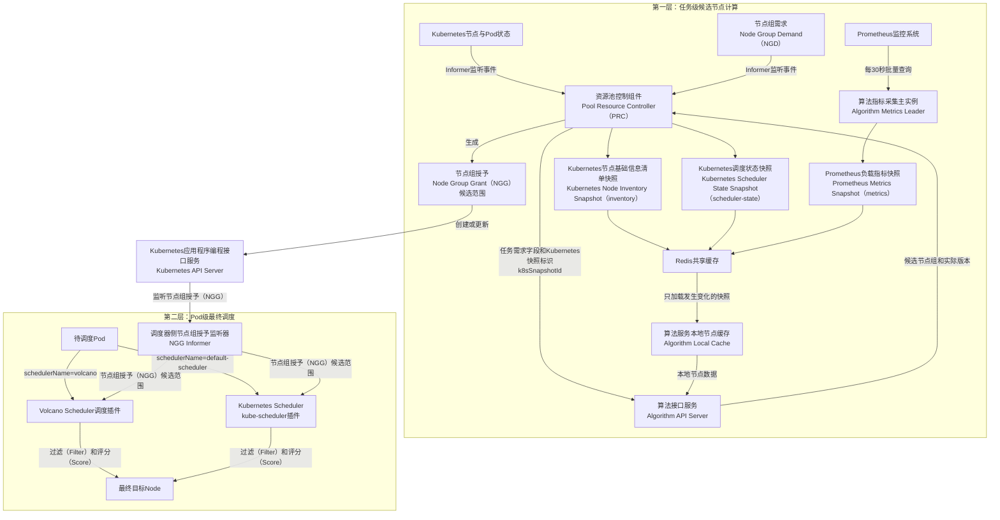
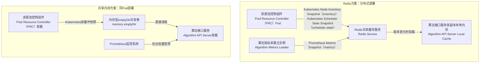
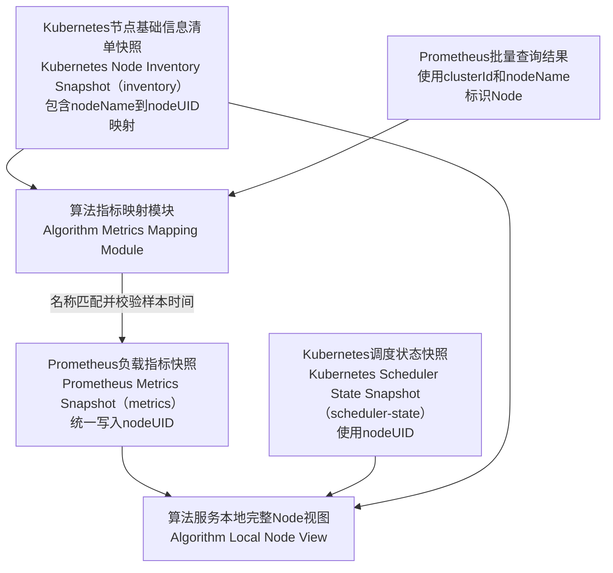

# Kubernetes/Volcano两层调度中Prometheus指标读取与缓存优化设计说明

## 1. 汇报版总体说明

### 1.1 一句话说明整体方案

本方案面向约500个Node的Kubernetes/Volcano两层调度场景：第一层根据单个任务的节点组需求（Node Group Demand，NGD）计算候选节点范围并生成节点组授予（Node Group Grant，NGG），第二层由Volcano Scheduler或Kubernetes Scheduler在NGG范围内完成Pod到Node的最终调度。

最新确定的职责划分为：

```text
资源池控制组件（Pool Resource Controller，PRC）
  → 负责Kubernetes数据、节点组需求（Node Group Demand，NGD）和节点组授予（Node Group Grant，NGG）流程

算法应用程序编程接口服务（Algorithm Application Programming Interface Server，简称Algorithm API Server）
  → 负责Prometheus指标采集、指标缓存和候选节点计算
```

任务到达不会触发重新采集500个Node，也不会实时查询Prometheus。Kubernetes状态和Prometheus指标通过后台链路提前同步到Algorithm API Server本地内存，任务请求只传递需求字段和Kubernetes快照标识。

### 1.2 先明确三类节点数据

本方案将算法需要的节点数据拆成三类。三类数据的含义、来源和用途不同，不能笼统称为“Node状态”。

下文中的Node唯一标识符（Unique Identifier，UID）对应Kubernetes Node对象的`metadata.uid`；中央处理器（Central Processing Unit，CPU）和图形处理器（Graphics Processing Unit，GPU）分别表示通用计算资源与加速计算资源。

| 中文全称 | 英文全称及简称 | 主要回答的问题 | 典型字段 | 数据来源 |
| --- | --- | --- | --- | --- |
| Kubernetes节点基础信息清单快照 | Kubernetes Node Inventory Snapshot，简称`inventory`快照 | 集群中有哪些Node，每个Node具有什么基础能力 | `nodeUID`、`nodeName`、CPU/内存/GPU可分配总量、GPU类型、拓扑Label | Kubernetes Node Informer |
| Kubernetes调度状态快照 | Kubernetes Scheduler State Snapshot，简称`scheduler-state`快照 | Node当前能否调度，账面资源已经被Pod申请了多少 | Ready、Unschedulable、Taint、已绑定Pod的CPU/内存/GPU Resource Requests | Kubernetes Node/Pod Informer |
| Prometheus负载指标快照 | Prometheus Metrics Snapshot，简称`metrics`快照 | Node资源实际上使用了多少，近期负载是否较高 | CPU/GPU/内存当前利用率、30分钟平均值、30分钟第95百分位数（95th Percentile，P95） | Prometheus |

三类数据分别可以理解为：

```text
Kubernetes节点基础信息清单快照（Kubernetes Node Inventory Snapshot，inventory）
  → 节点是谁、在哪里、总共具有什么资源

Kubernetes调度状态快照（Kubernetes Scheduler State Snapshot，scheduler-state）
  → 节点现在是否允许调度、资源已经被申请了多少

Prometheus负载指标快照（Prometheus Metrics Snapshot，metrics）
  → 节点资源实际上使用了多少、最近一段时间负载如何
```

`inventory`不是永久不变的数据，而是低频变化的节点基础数据；`scheduler-state`是随Node和Pod状态变化的高频调度数据；`metrics`是按固定周期更新的运行负载数据。

例如某Node共有64核CPU，Pod已经申请40核，但实际只使用20核：

```text
Kubernetes节点基础信息清单快照：CPU可分配总量 = 64核
Kubernetes调度状态快照：Pod已申请CPU = 40核，账面剩余 = 24核
Prometheus负载指标快照：CPU实际使用量约 = 20核
```

硬约束必须根据Kubernetes账面剩余资源判断，不能因为Prometheus实际利用率较低就重复分配已经被Pod申请的资源。Prometheus指标只用于满足硬约束后的负载均衡和节点评分。

### 1.3 分层总体架构



一、二层的边界如下：

| 层级 | 输入 | 核心处理 | 输出 | 是否绑定Pod |
| --- | --- | --- | --- | --- |
| 第一层 | NGD、Kubernetes状态、拓扑、Prometheus指标 | requirement过滤、topology分组、loadbalance评分 | NGG候选节点范围 | 否 |
| 第二层 | 待调度Pod、NGG、调度器实时状态 | Filter、Score及Volcano或原生调度流程 | Pod绑定到具体Node | 是 |

第一层回答“这个任务可以使用哪些Node”，第二层回答“这个Pod最终调度到哪个Node”。Pod通过`spec.schedulerName`只进入Volcano或kube-scheduler中的一个调度器。

### 1.4 整体运行逻辑

系统分为后台数据同步和任务实时计算两条链路。

#### 1.4.1 后台数据同步

```text
Kubernetes Node/Pod发生变化
  → 资源池控制组件（Pool Resource Controller，PRC）通过Informer更新本地缓存
  → PRC生成Kubernetes节点基础信息清单快照（Kubernetes Node Inventory Snapshot，inventory）
  → PRC生成Kubernetes调度状态快照（Kubernetes Scheduler State Snapshot，scheduler-state）
  → PRC写入Redis共享缓存

Prometheus指标更新
  → 算法指标采集主实例（Algorithm Metrics Leader）每30秒批量查询
  → 根据PRC提供的Node映射将指标转换为nodeUID
  → Algorithm生成Prometheus负载指标快照（Prometheus Metrics Snapshot，metrics）
  → Algorithm写入Redis共享缓存并更新自己的本地内存

其他算法接口服务（Algorithm API Server）副本
  → 从Redis加载最新Kubernetes节点基础信息清单快照
  → 从Redis加载最新Kubernetes调度状态快照和Prometheus负载指标快照
  → 构建本地完整节点视图
```

#### 1.4.2 任务实时计算

```text
节点组需求（Node Group Demand，NGD）到达
  → 资源池控制组件（Pool Resource Controller，PRC）解析任务资源、拓扑和算法需求
  → PRC发送需求字段和Kubernetes快照标识（k8sSnapshotId）
  → 算法接口服务（Algorithm API Server）选择最新有效Prometheus负载指标版本（metricVersion）
  → Algorithm API Server直接使用本地节点视图执行算法
  → 返回候选节点组及实际使用的全部版本
  → PRC创建或更新节点组授予（Node Group Grant，NGG）
  → 第二层调度器通过Watch获得节点组授予（NGG）
  → 完成Pod到Node的最终调度
```

正常任务处理过程中：

- 不查询Prometheus；
- 不重新读取全部Kubernetes Node；
- 不传输500个Node完整数据；
- 通常不实时访问Redis；
- 只通过超文本传输协议（Hypertext Transfer Protocol，HTTP）传递任务需求、版本和候选节点组。

### 1.5 组件之间传输什么

| 传输方向 | 传输内容 | 触发方式 |
| --- | --- | --- |
| Kubernetes API Server → PRC | Node、Pod、NGD Watch事件 | 资源变化时 |
| PRC → Redis | Kubernetes节点基础信息清单快照（`inventory`）、Kubernetes调度状态快照（`scheduler-state`）、Kubernetes快照组合清单（`k8s-manifest`） | Kubernetes数据变化时 |
| Prometheus → Algorithm Metrics Leader | 全部Node的聚合指标查询结果 | 每30秒 |
| Algorithm Metrics Leader → Redis | 标准化后的Prometheus负载指标快照（`metrics`） | 查询成功后 |
| Redis → Algorithm各副本 | 版本发生变化的Kubernetes或指标快照 | 后台预加载或请求补载 |
| PRC → Algorithm API Server | 任务需求和`k8sSnapshotId` | NGD到达时 |
| Algorithm API Server → PRC | 候选节点组、Kubernetes版本、指标版本和降级状态 | 算法完成时 |
| PRC → Kubernetes API Server | NGG | 算法成功后 |
| Kubernetes API Server → 调度器 | NGG Watch事件 | NGG变化时 |

### 1.6 Redis与共享内存如何选择

两种方案的数据分类和调度流程相同，区别是PRC如何把Kubernetes快照交给Algorithm API Server，以及多副本之间如何共享Prometheus指标。



| 对比项 | Redis方案 | 共享内存方案 |
| --- | --- | --- |
| 部署范围 | 跨Pod、跨Node | 同一Pod |
| 多副本 | 支持 | 困难 |
| PRC与Algorithm扩缩容 | 相互独立 | 通常共同扩缩容 |
| 数据读取 | Redis同步后读取Algorithm本地内存 | 直接读取共享内存 |
| 网络开销 | 只在快照更新时发生 | 无 |
| 版本和生存时间（Time to Live，TTL） | Redis原生支持 | 需要自行实现 |
| 重启恢复 | 可从Redis恢复 | 需要重新构建 |
| 开发复杂度 | 相对简单 | 双缓冲和同步复杂 |
| 适用场景 | 分布式、多副本、生产部署 | 同Pod、固定实例、Demo |

当前约500个Node且考虑独立部署和扩展，推荐Redis加Algorithm本地内存。共享内存保留为同Pod轻量备选方案。

---

## 2. 最新职责划分

### 2.1 PRC职责

PRC负责：

- 维护Node、Pod和NGD Informer；
- 获取Node UID、名称、容量、GPU类型和七层拓扑Label；
- 获取Ready、Unschedulable和Taint状态；
- 汇总各Node上已绑定Pod的CPU、内存和GPU Resource Requests；
- 生成并发布Kubernetes节点基础信息清单快照和Kubernetes调度状态快照；
- 解析NGD并调用Algorithm API Server；
- 接收候选节点组及实际使用版本；
- 创建或更新NGG。

PRC不再查询Prometheus，也不生成Prometheus负载指标快照。

### 2.2 Algorithm API Server职责

Algorithm API Server包含两个逻辑模块。

#### 指标采集模块（Metrics Collector）

- 后台周期查询Prometheus；
- 查询当前负载和最近30分钟聚合特征；
- 将Prometheus标签映射为Kubernetes Node UID；
- 生成`metricVersion`；
- 写入Redis并更新本地指标缓存；
- 处理指标陈旧、缺失和Node重建。

#### 算法请求处理模块（Algorithm Request Handler）

- 加载PRC发布的Kubernetes快照；
- 接收任务需求和`k8sSnapshotId`；
- 选择最新有效的`metricVersion`；
- 合并Kubernetes状态和Prometheus特征；
- 执行requirement、topology和loadbalance；
- 返回候选节点组及实际使用版本。

### 2.3 Redis职责

Redis只负责跨Pod共享、版本同步和实例恢复：

- 保存PRC发布的Kubernetes节点基础信息清单快照、Kubernetes调度状态快照及其组合清单；
- 保存Algorithm Metrics Leader发布的Prometheus负载指标快照；
- 为新Algorithm副本提供初始化数据；
- 在组件短暂异常时保留最近少量版本。

正常算法请求读取本地内存，不在每次任务中查询Redis。

### 2.4 单一写入者原则

PRC和Algorithm不能同时修改同一个快照对象。写入边界固定为：

```text
PRC唯一写入：Kubernetes节点基础信息清单快照（inventory）、Kubernetes调度状态快照（scheduler-state）、Kubernetes快照组合清单（k8s-manifest）
Algorithm Metrics Leader唯一写入：Prometheus负载指标快照（metrics）、Prometheus指标当前版本指针（metrics-current）
```

不再由PRC生成绑定全部数据的统一Manifest。一次算法计算实际使用的数据集合为：

```text
usedDataVersion
= k8sSnapshotId
+ metricVersion
```

Algorithm在响应中返回两部分版本，实现结果追踪。

---

## 3. 节点基础数据、调度状态、负载指标及传输方式

### 3.1 数据对象与更新方式

| 数据类型 | 数据来源 | 写入者 | 更新触发 | 第一版传输方式 |
| --- | --- | --- | --- | --- |
| Kubernetes节点基础信息清单快照（Kubernetes Node Inventory Snapshot，`inventory`） | Node Informer | PRC Leader | Node新增/删除，容量、GPU类型、拓扑或算法Label变化 | 精简字段分类全量快照 |
| Kubernetes调度状态快照（Kubernetes Scheduler State Snapshot，`scheduler-state`） | Node/Pod Informer | PRC Leader | Ready、Taint、Unschedulable或Pod Requests变化 | 1秒内事件合并后发布分类全量快照 |
| Prometheus负载指标快照（Prometheus Metrics Snapshot，`metrics`） | Prometheus | Algorithm Metrics Leader | 完成一轮固定时刻批量查询 | 每30秒发布聚合特征全量快照 |
| Kubernetes快照组合清单（Kubernetes Snapshot Manifest，`k8s-manifest`） | PRC | PRC Leader | `inventory`或`scheduler-state`更新成功 | 绑定两个Kubernetes子版本 |
| Prometheus指标当前版本指针（Prometheus Metrics Current Pointer，`metrics-current`） | Algorithm | Algorithm Metrics Leader | `metrics`更新成功 | 指向当前`metricVersion` |

这里的“全量”是指某一类数据中约500个Node的精简记录，不是完整Kubernetes对象，也不是把三类数据捆绑后反复传输。

### 3.2 Kubernetes节点基础信息清单快照（inventory）

该快照描述Node的身份、硬件容量和拓扑等基础属性，回答“集群中有哪些Node，每个Node具有什么能力”。它不保存Pod当前占用了多少资源，也不保存CPU/GPU实际利用率。

主要字段分为三组：

- 身份字段：`clusterId`、`nodeUID`、`nodeName`和`createdAt`；
- 容量字段：CPU、内存和GPU可分配总量、GPU类型；
- 拓扑字段：region、datacenter、serveroom、rack等Label。

```json
{
  "inventoryVersion": 120,
  "generatedAt": "2026-08-09T10:00:00+09:00",
  "nodeIndex": {
    "cluster-a/node-01": "node-uid-abc123"
  },
  "nodes": [
    {
      "clusterId": "cluster-a",
      "nodeUID": "node-uid-abc123",
      "nodeName": "node-01",
      "createdAt": "2026-08-01T08:00:00+09:00",
      "allocatableCPU": 32,
      "allocatableMemoryGiB": 128,
      "allocatableGPU": 4,
      "gpuType": "A100",
      "region": "region-01",
      "datacenter": "dc-01",
      "serveroom": "sr-01",
      "rack": "rack-02"
    }
  ]
}
```

节点基础属性不变时，即使Prometheus每30秒更新，`inventory:120`也不会重新传输。Node新增、删除、重新创建、硬件容量变化或拓扑Label变化时，PRC才生成新的`inventoryVersion`。

### 3.3 Kubernetes调度状态快照（scheduler-state）

该快照描述Kubernetes调度器视角下的实时可调度状态和账面资源占用，回答“Node当前还能不能调度，已经有多少资源被Pod申请”。它不同于Prometheus实际利用率。

主要字段包括：

- Node是否Ready、是否被设置为Unschedulable；
- Taint等影响调度的状态；
- 已绑定Pod累计申请的CPU、内存和GPU Resource Requests；
- 根据Node Allocatable与Resource Requests计算出的账面剩余资源。

```json
{
  "schedulerStateVersion": 8841,
  "generatedAt": "2026-08-09T10:00:01+09:00",
  "nodes": [
    {
      "nodeUID": "node-uid-abc123",
      "ready": true,
      "unschedulable": false,
      "requestedCPU": 18,
      "requestedMemoryGiB": 64,
      "requestedGPU": 2
    }
  ]
}
```

Pod或Node连续变化时，PRC将例如1秒内的Informer事件合并后再生成新版本，避免每个事件都传输一次。

### 3.4 Kubernetes快照组合清单（k8s-manifest）

Kubernetes快照组合清单本身不重复保存500个Node的数据，只负责把某一版Kubernetes节点基础信息清单快照和某一版Kubernetes调度状态快照绑定为一个一致的`k8sSnapshotId`。

```json
{
  "k8sSnapshotId": "cluster-a/k8s-4201",
  "inventoryVersion": 120,
  "schedulerStateVersion": 8841,
  "createdAt": "2026-08-09T10:00:02+09:00",
  "nodeCount": 500,
  "checksum": "..."
}
```

PRC先写入发生变化的子快照，再写Kubernetes快照组合清单（`k8s-manifest`），最后原子切换Kubernetes当前版本指针（`k8s-current`）。Algorithm读取组合清单并只加载发生变化的子快照。

### 3.5 Prometheus负载指标快照（metrics）

该快照描述Node资源的实际运行负载，回答“CPU、内存和GPU现在实际用了多少，最近30分钟的负载是否持续偏高”。它不用于替代Kubernetes账面可分配资源。

Algorithm Metrics Leader查询Prometheus后，将指标统一转换成以`nodeUID`为主键的结构：

```json
{
  "metricVersion": 1024,
  "mappedInventoryVersion": 120,
  "evaluatedAt": "2026-08-09T10:00:00+09:00",
  "nodes": [
    {
      "clusterId": "cluster-a",
      "nodeUID": "node-uid-abc123",
      "nodeName": "node-01",
      "cpuCurrent": 0.42,
      "cpuAvg30m": 0.38,
      "cpuP95_30m": 0.68,
      "memoryCurrent": 0.61,
      "memoryAvg30m": 0.57,
      "gpuCurrent": 0.75,
      "gpuAvg30m": 0.62,
      "sourceSampleAt": "2026-08-09T09:59:45+09:00",
      "sourceAgeSeconds": 15,
      "windowCoverage": 0.98,
      "valid": true
    }
  ]
}
```

Redis和本地缓存只保存聚合特征，不保存最近30分钟全部原始采样点。

---

## 4. 三类数据如何对应同一个Node

### 4.1 统一主键

Kubernetes节点基础信息清单快照天然具有Node UID，Prometheus负载指标通常只有`instance`、互联网协议地址（Internet Protocol Address，IP地址）或Node名称。最终不能使用IP地址作为主键，推荐：

```text
Prometheus查询和定位阶段：clusterId + nodeName
Algorithm标准化和计算阶段：clusterId + nodeUID
```

Prometheus抓取配置应通过Service Discovery和Relabel至少补充：

```text
cluster_id
node_name
```

### 4.2 指标映射流程



具体过程：

```text
1. Algorithm加载PRC最新Kubernetes节点基础信息清单快照（`inventory`）；
2. 得到clusterId/nodeName → nodeUID映射；
3. Metrics Leader批量查询Prometheus；
4. 根据clusterId和nodeName查询nodeIndex；
5. 匹配成功后把当前nodeUID写入指标记录；
6. Prometheus负载指标、节点基础信息和Kubernetes调度状态统一按nodeUID合并。
```

### 4.3 本地完整节点视图

```text
Node完整算法视图[nodeUID]
= Kubernetes节点基础信息清单快照 inventory[nodeUID]
+ Kubernetes调度状态快照 schedulerState[nodeUID]
+ Prometheus负载指标快照 metrics[nodeUID]
```

```json
{
  "nodeUID": "node-uid-abc123",
  "nodeName": "node-01",
  "allocatableCPU": 32,
  "requestedCPU": 18,
  "allocatableGPU": 4,
  "requestedGPU": 2,
  "gpuType": "A100",
  "serveroom": "sr-01",
  "ready": true,
  "cpuCurrent": 0.42,
  "cpuAvg30m": 0.38,
  "gpuCurrent": 0.75
}
```

### 4.4 异常匹配规则

| 情况 | 处理方式 |
| --- | --- |
| Kubernetes节点基础信息清单快照和Prometheus负载指标快照都存在 | 按nodeUID正常合并 |
| Kubernetes节点基础信息清单快照存在、Prometheus负载指标缺失 | `metricValid=false`，仍可参与Kubernetes硬约束 |
| Prometheus负载指标存在、Kubernetes节点基础信息清单中不存在该Node | 丢弃指标，不生成候选节点 |
| 一个Node名称对应多个UID | 拒绝合并并告警 |
| 指标样本早于Node创建时间 | 视为旧节点残留数据并丢弃 |
| Node UID发生变化 | 清除旧UID缓存，按新Node重新积累历史 |
| Prometheus只有instance/IP | 先通过Relabel补充clusterId和nodeName |

Node删除后使用相同名称重新创建时，UID会变化。新Node不能继承旧Node的30分钟历史特征，在窗口覆盖率达到要求前将`historyValid`标记为`false`。

---

## 5. Redis方案具体设计

### 5.1 Redis Key与写入者

```text
# PRC Leader写入
scheduler:{cluster}:inventory:{inventoryVersion}
scheduler:{cluster}:state:{schedulerStateVersion}
scheduler:{cluster}:k8s-manifest:{k8sSnapshotId}
scheduler:{cluster}:k8s-current

# Algorithm Metrics Leader写入
scheduler:{cluster}:metrics:{metricVersion}
scheduler:{cluster}:metrics-current
```

PRC和Algorithm写入不同Key空间，不存在两个组件覆盖同一对象的问题。

### 5.2 PRC发布Kubernetes快照

```text
Node或Pod发生变化
  → 资源池控制组件（Pool Resource Controller，PRC）更新Informer本地缓存
  → 写入发生变化的Kubernetes节点基础信息清单快照（inventory）
    或Kubernetes调度状态快照（scheduler-state）新版本
  → 校验Node数量、长度和校验和
  → 写入新的Kubernetes快照组合清单（k8s-manifest）
  → 原子更新Kubernetes当前版本指针（k8s-current）
```

### 5.3 Algorithm发布Prometheus负载指标快照

```text
算法指标采集主实例（Algorithm Metrics Leader）选择统一求值时刻T
  → 批量查询Prometheus Recording Rules
  → 使用Kubernetes节点基础信息清单快照（inventory）中的nodeIndex映射nodeUID
  → 校验源样本时间和覆盖率
  → 写入Prometheus负载指标快照（metrics）新版本
  → 更新Algorithm Metrics Leader本地不可变缓存
  → 原子更新Prometheus指标当前版本指针（metrics-current）
```

先写Redis还是先切换本地缓存可以根据实现确定，但只有完整校验成功的版本才能写入`metrics-current`并对外使用。

### 5.4 Algorithm各副本加载数据

所有Algorithm副本后台检查`k8s-current`和`metrics-current`：

```text
版本未变化
  → 继续使用本地缓存

Kubernetes节点基础信息清单版本（inventoryVersion）变化
  → 只加载新的Kubernetes节点基础信息清单快照（inventory）

Kubernetes调度状态版本（schedulerStateVersion）变化
  → 只加载新的Kubernetes调度状态快照（scheduler-state）

Prometheus负载指标版本（metricVersion）变化
  → 只加载新的Prometheus负载指标快照（metrics）

加载完成
  → 合并并校验nodeUID
  → 原子切换本地完整Node视图
```

如果任务请求携带的`k8sSnapshotId`尚未在本地加载，该副本可以从Redis按版本补载一次。正常任务不实时访问Redis。

### 5.5 多副本与Leader

生产部署可以同时运行多个PRC和Algorithm副本，但必须分别选举：

- PRC Leader：唯一发布Kubernetes快照和写入NGG；
- Algorithm Metrics Leader：唯一查询Prometheus并发布Prometheus负载指标快照；
- 其他Algorithm副本：只从Redis加载指标并处理算法请求。

如果每个Algorithm副本都独立查询Prometheus，会产生重复查询、不同指标版本和Redis写入冲突，因此不推荐。

---

## 6. Algorithm API调用设计

### 6.1 请求内容

PRC不需要提前指定`metricVersion`，只发送任务需求和当前Kubernetes快照：

```json
{
  "taskUID": "job-001",
  "k8sSnapshotId": "cluster-a/k8s-4201",
  "requirement": {
    "cpu": 8,
    "memoryGiB": 32,
    "gpu": 1,
    "gpuType": "A100"
  },
  "topology": {
    "level": "serveroom",
    "sameDomain": true
  },
  "algorithm": ["requirement", "topology", "loadbalance"]
}
```

### 6.2 Algorithm处理

```text
收到任务请求
  → 检查本地是否存在指定Kubernetes快照标识（k8sSnapshotId）
  → 不存在时从Redis补载或返回可重试错误
  → 选择本地最新且有效的Prometheus负载指标版本（metricVersion）
  → 按nodeUID合并数据
  → 资源需求算法（requirement）执行资源硬约束过滤
  → 拓扑算法（topology）执行拓扑分组
  → 负载均衡算法（loadbalance）执行Prometheus负载评分
  → 返回结果和全部实际版本
```

### 6.3 响应内容

```json
{
  "taskUID": "job-001",
  "k8sSnapshotId": "cluster-a/k8s-4201",
  "inventoryVersion": 120,
  "schedulerStateVersion": 8841,
  "metricVersion": 1024,
  "degraded": false,
  "candidateNodeGroups": [
    ["node-01", "node-02"],
    ["node-05", "node-06"]
  ]
}
```

PRC将实际使用的版本记录到NGG状态或日志中，便于重现算法结果。

### 6.4 完整示例

10:00:00时：

```text
PRC已发布k8sSnapshotId=k8s-4201
  inventoryVersion=120
  schedulerStateVersion=8841

Algorithm已发布metricVersion=1024
Algorithm各副本已加载上述数据
```

10:00:05任务到达：

```text
资源池控制组件（Pool Resource Controller，PRC）→ Algorithm API Server：任务需求 + Kubernetes快照k8s-4201
Algorithm API Server：使用本地Kubernetes快照k8s-4201 + Prometheus负载指标快照metrics-1024计算
Algorithm API Server → PRC：候选节点组 + 实际版本
PRC → Kubernetes API Server：写入节点组授予（Node Group Grant，NGG）
```

10:00:30只有Prometheus指标更新：

```text
inventoryVersion=120，不重新传输
schedulerStateVersion=8841，不重新传输
metricVersion更新为1025
Algorithm副本只加载metrics:1025
```

下一任务使用`k8s-4201 + metrics-1025`，Kubernetes节点基础信息不会跟随Prometheus负载指标重复传输。

---

## 7. Prometheus指标处理

### 7.1 历史数据保存位置

```text
Node/GPU Exporter
  → Prometheus周期抓取
  → 时间序列数据库（Time Series Database，TSDB）保存原始样本
  → 持久卷声明（Persistent Volume Claim，PVC）提供持久化能力
```

Redis和Algorithm本地内存不替代Prometheus保存历史，只保存当前值和历史聚合特征。

### 7.2 Recording Rules预计算

```yaml
groups:
  - name: node-load-recording
    interval: 30s
    rules:
      - record: node:cpu_usage:ratio
        expr: |
          1 - avg by (cluster_id, node_name) (
            rate(node_cpu_seconds_total{mode="idle"}[1m])
          )

      - record: node:cpu_usage:avg30m
        expr: avg_over_time(node:cpu_usage:ratio[30m])

      - record: node:cpu_usage:p95_30m
        expr: quantile_over_time(0.95, node:cpu_usage:ratio[30m])
```

内存和GPU采用相同方式预计算。Metrics Leader只查询规则结果，不下载30分钟全部采样点。

### 7.3 第一阶段指标

| 指标类型 | 当前值 | 30分钟平均值 | 30分钟P95/峰值 |
| --- | --- | --- | --- |
| CPU利用率 | 是 | 是 | 是 |
| 内存利用率 | 是 | 是 | 是 |
| GPU利用率 | 是 | 是 | 是 |

标准差和趋势在算法确实使用后再加入。GPU如需精确到设备，可以补充每张GPU利用率、最大利用率、低负载GPU数量和可用显存。

### 7.4 查询方式和周期

Algorithm Metrics Leader不能按Node循环查询，应按指标执行批量Prometheus查询语言（Prometheus Query Language，PromQL）查询，并为整轮查询使用相同求值时刻`T`。

| 参数 | 建议值 |
| --- | ---: |
| Exporter抓取周期 | 15秒 |
| Recording Rules计算周期 | 30秒 |
| Metrics Leader查询周期 | 30秒 |
| 单轮查询总超时 | 2～3秒 |
| 动态指标正常有效期 | 60秒 |
| 动态指标最大容忍时间 | 120秒 |
| Redis旧版本保留时间 | 5～10分钟 |

### 7.5 指标真实新鲜度

查询完成时间不等于源样本时间。指标快照必须包含`sourceSampleAt`、`sourceAgeSeconds`和`windowCoverage`，并结合Exporter的`up`状态判断是否有效。

---

## 8. Kubernetes硬约束与Prometheus软评分

### 8.1 Kubernetes数据用于硬约束

节点必须满足：

- Ready；
- 未被禁止调度；
- Taint与任务容忍条件匹配；
- 剩余CPU、内存和GPU Requests满足需求；
- GPU类型和拓扑条件满足要求。

```text
可供任务申请的资源
= Node Allocatable
- 已绑定Pod的Resource Requests
```

Prometheus利用率不能代替Kubernetes可调度资源。例如CPU利用率可能只有20%，但Pod Requests可能已经占用了大部分容量。

### 8.2 Prometheus数据用于软评分

节点通过硬约束后，再根据当前负载、30分钟平均值和P95执行负载均衡。Prometheus指标异常不应使节点绕过Kubernetes硬约束。

### 8.3 第二层仍需最终检查

NGG是候选范围，不是资源预留。多个任务可以获得包含相同Node的NGG。Pod绑定前，Volcano或kube-scheduler仍然执行最终资源、亲和性、Taint和其他调度检查。

---

## 9. 共享内存备选方案

### 9.1 部署范围

共享内存仅推荐用于PRC与Algorithm API Server固定在同一个Pod中的场景：

```text
同一个Pod
├── PRC容器
├── memory emptyDir共享卷
└── Algorithm API Server容器
```

不同Pod即使位于同一Node，也不能直接共享同一个`emptyDir`，不建议使用`hostPath`实现跨Pod共享。

### 9.2 数据区域和写入者

```text
/snapshot/inventory-A/B       → 资源池控制组件（Pool Resource Controller，PRC）写入Kubernetes节点基础信息清单快照
/snapshot/state-A/B           → PRC写入Kubernetes调度状态快照
/snapshot/k8s-header          → PRC写入Kubernetes快照组合信息
/snapshot/metrics-A/B         → Algorithm API Server写入Prometheus负载指标快照，或直接使用Algorithm本地内存
/snapshot/metrics-header      → Algorithm API Server写入Prometheus负载指标版本信息
```

PRC和Algorithm分别维护自己的Header，避免两个进程同时修改同一个版本指针。Algorithm在本地组合Kubernetes版本和指标版本。

### 9.3 双缓冲

```text
区域A：当前可读版本
区域B：写入新版本
  → 完成长度和校验和检查
  → 原子切换当前指针
  → 旧区域等待现有读者释放后复用
```

共享内存需要自行实现数据格式、原子指针、读者生命周期、版本校验、有效期、重启恢复和旧数据清理。

### 9.4 与Redis方案的主要差异

共享内存不经过网络，但部署耦合强、无法方便支持多个Algorithm副本。对于当前生产扩展目标，仍推荐Redis方案。

---

## 10. 失败与降级策略

### 10.1 Prometheus查询失败

如果Metrics Leader本轮查询失败：

1. 不写入空指标快照；
2. 不覆盖`metrics-current`；
3. Algorithm副本继续保留上一版指标；
4. 根据源样本时间计算真实年龄；
5. 下一周期重新查询。

| 指标年龄 | 使用方式 |
| --- | --- |
| 60秒以内 | 正常参与负载评分 |
| 60～120秒 | 标记陈旧并降低权重 |
| 超过120秒 | 忽略动态负载，只执行Kubernetes硬约束和拓扑算法 |

### 10.2 Kubernetes快照异常

Kubernetes数据属于硬约束。Algorithm找不到PRC指定的`k8sSnapshotId`，或者快照损坏、明显过期时，应返回可重试错误，不能使用不确定数据继续计算。

### 10.3 Redis异常

- PRC和Algorithm均保留最后一份本地快照；
- 本地数据仍有效时，Redis短暂异常不阻塞当前计算；
- Redis恢复后，两个Leader分别发布自己的新版本；
- Algorithm新副本在Redis不可用且没有本地快照时不能进入Ready状态。

### 10.4 建议错误码

- `k8s_snapshot_not_ready`；
- `k8s_snapshot_not_found`；
- `snapshot_corrupted`；
- `metrics_not_ready`；
- `metrics_expired`；
- `insufficient_metrics`；
- `algorithm_timeout`。

PRC重试时保留`taskUID`，防止重复创建多个NGG。

---

## 11. 500个Node的传输优化

采用两条独立链路：

```text
数据同步链路：分类数据发生变化时同步对应快照
任务请求链路：每个任务只发送需求和Kubernetes快照标识（k8sSnapshotId）
```

建议按以下顺序优化：

1. 只保留算法实际使用的字段；
2. 拆分inventory、scheduler-state和metrics；
3. Kubernetes节点基础信息不随Prometheus负载指标重复传输；
4. Algorithm只加载版本发生变化的子快照；
5. JSON启用HTTP压缩；
6. 监测到瓶颈后再采用Protobuf或MessagePack；
7. 节点规模和变化频率显著增加后再考虑增量协议。

约500个Node每30秒同步一次精简Prometheus负载指标快照通常可控，不需要引入Apache Kafka，也不需要第一版就实现复杂的逐字段差量同步。

---

## 12. Redis与共享内存完整对比

| 对比项 | Redis | 共享内存 |
| --- | --- | --- |
| 共享范围 | 跨Pod、跨Node | 同一Pod |
| PRC与Algorithm部署 | 可以独立部署 | 必须共同部署 |
| 指标多副本共享 | Metrics Leader写Redis，其他副本加载 | 困难 |
| 任务读取路径 | Algorithm本地内存 | 共享内存或Algorithm本地内存 |
| 网络开销 | 快照更新时存在 | 无 |
| 版本和TTL | 容易实现 | 需要自行实现 |
| 原子更新 | Redis原子操作 | 自行实现双缓冲 |
| 重启恢复 | 可从Redis加载 | 需要重新构建 |
| Pod迁移 | 不受组件位置影响 | 共享数据随Pod删除 |
| 开发复杂度 | 相对简单 | 底层同步复杂 |
| 运维复杂度 | 需要维护Redis | 组件少但程序复杂 |
| 适用场景 | 分布式、多副本、生产部署 | 同Pod、固定实例、Demo |

---

## 13. 可观测性与验收

PRC建议暴露：

- 当前`k8sSnapshotId`、`inventoryVersion`和`schedulerStateVersion`；
- Informer同步状态；
- 快照构建耗时和大小；
- Redis写入失败次数；
- PRC Leader状态。

Algorithm建议暴露：

- Metrics Leader状态；
- Prometheus查询成功率和耗时；
- 当前`metricVersion`；
- 指标覆盖率和最大源样本年龄；
- 本地Kubernetes版本和指标版本；
- Redis补载次数和耗时；
- 正常、陈旧和降级请求数量；
- 各算法阶段耗时。

| 验收项 | 建议目标 |
| --- | ---: |
| 500个Node指标快照生成时间 | 小于3秒 |
| 正常指标年龄 | 不超过60秒 |
| Algorithm本地版本滞后 | 不超过一个同步周期 |
| 正常任务是否查询Prometheus | 否 |
| 正常任务是否访问Redis | 否 |
| Prometheus异常时硬约束是否可执行 | 是 |
| 结果是否返回全部实际数据版本 | 是 |
| 不同数据是否统一按nodeUID合并 | 是 |

---

## 14. 最终结论

最终推荐链路为：

```text
Kubernetes API Server
  → 资源池控制组件（Pool Resource Controller，PRC）通过Informer维护Node和Pod状态
  → PRC发布Kubernetes节点基础信息清单快照（inventory）
  → PRC发布Kubernetes调度状态快照（scheduler-state）和Kubernetes快照标识（k8sSnapshotId）

Prometheus
  → 算法指标采集主实例（Algorithm Metrics Leader）每30秒批量查询
  → 使用Kubernetes节点基础信息清单快照（inventory）完成nodeName到nodeUID映射
  → 发布Prometheus负载指标版本（metricVersion）并更新本地缓存

节点组需求（Node Group Demand，NGD）到达
  → PRC发送任务需求和Kubernetes快照标识（k8sSnapshotId）
  → Algorithm API Server组合指定Kubernetes快照和最新有效Prometheus负载指标快照
  → 返回候选节点组及全部实际版本
  → PRC创建或更新节点组授予（Node Group Grant，NGG）
  → 第二层调度器在节点组授予（NGG）范围内完成Pod调度
```

该方案使PRC专注Kubernetes流程控制，使Algorithm API Server负责算法相关指标的采集、缓存和计算。PRC与Algorithm分别写入不同Redis数据空间，避免多写入者冲突；Prometheus指标通过`clusterId + nodeName`定位，再映射为`nodeUID`，可以与Kubernetes节点基础信息清单快照和Kubernetes调度状态快照准确合并。

对当前约500个Node、独立部署和后续多副本扩展需求，推荐Redis加Algorithm本地内存；同Pod固定实例可以使用共享内存。

---

## 15. 参考资料

- [Prometheus HTTP API](https://prometheus.io/docs/prometheus/latest/querying/api/)
- [Prometheus PromQL查询基础](https://prometheus.io/docs/prometheus/latest/querying/basics/)
- [Prometheus Recording Rules](https://prometheus.io/docs/prometheus/latest/configuration/recording_rules/)
- [Prometheus查询函数](https://prometheus.io/docs/prometheus/latest/querying/functions/)
- [Kubernetes emptyDir卷](https://kubernetes.io/docs/concepts/storage/volumes/#emptydir)
- [Kubernetes Service](https://kubernetes.io/docs/concepts/services-networking/service/)
