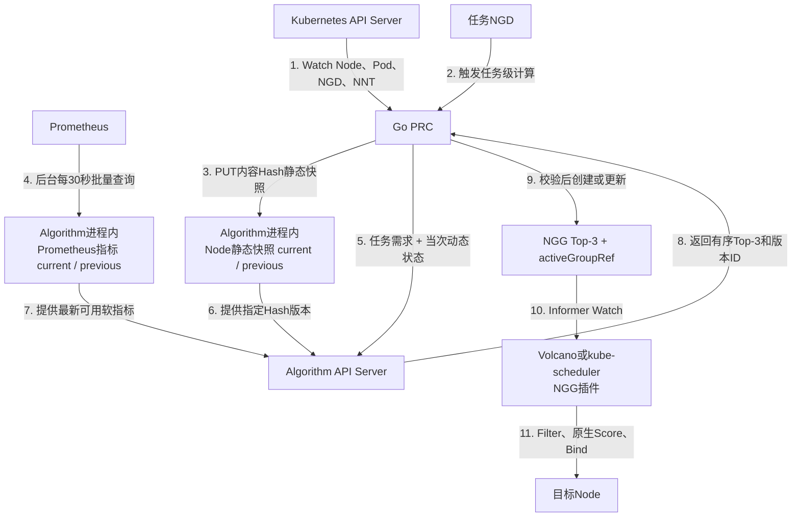

# Kubernetes/Volcano 两层调度中的 Prometheus 指标读取与缓存说明 v2.0

## 1. 结论

当前正式实现采用：

```text
Kubernetes硬状态由PRC按任务发送
Node静态信息由Algorithm进程内缓存
Prometheus软指标由Algorithm后台采集并在进程内缓存
不使用Redis、Kafka或跨Pod共享内存
```

Prometheus 不参与资源是否足够的最终判断，只影响候选节点组的软评分。即使 Prometheus 暂时不可用，Kubernetes 的资源、Ready 和 Cordon 等硬约束仍然有效。

## 2. 整体结构



关键点是：任务请求不会同步查询 Prometheus。Prometheus 慢或短暂不可用，不会直接卡住 PRC 的一次 reconcile。

## 3. 三类数据的分工

| 数据 | 来源 | 传输或缓存方式 | 用途 |
|---|---|---|---|
| Node 静态信息 | Node + NNT | PRC 生成内容 Hash，Algorithm 保存 current/previous | 身份、容量、Label、交换机拓扑 |
| Node 动态状态 | Node + Pod | PRC 每次任务计算时随请求发送 | Ready、Cordon、已绑定 Pod Requests |
| 实时利用率 | Prometheus | Algorithm 后台线程周期采集并保存 current/previous | CPU/内存负载软评分 |

静态快照包含 Node UID，Node 删除后即使使用同名重建，也不会继承旧授权。

动态资源按下面方式计算：

```text
账面可用资源
= Node.status.allocatable
- 已绑定且未结束Pod的Resource Requests
```

Prometheus 指标不能覆盖这个结果。例如 CPU 实际利用率只有 10%，但 Requests 已占满时，第一层仍然不能把该 Node 当作资源充足。

## 4. Algorithm 指标缓存

实现文件为：

```text
algorithm_server/python/algorithm_worker/cache/metrics.py
```

缓存行为：

1. FastAPI 启动时创建一个后台线程；
2. 每隔 `PROMETHEUS_REFRESH_SECONDS` 执行 CPU 和内存 instant query；
3. 使用 `PROMETHEUS_NODE_LABEL` 把结果映射到 Node name；
4. 生成内容 Hash 形式的 `metricSnapshotId`；
5. 保存当前版本和上一个不同版本；
6. 算法请求只读内存副本，不调用 Prometheus；
7. 新一轮查询失败时保留最后一次成功快照；
8. 快照超过 `PROMETHEUS_STALE_SECONDS` 后继续可读，但响应标记 `degraded=true`。

环境变量：

| 变量 | 默认值 | 含义 |
|---|---|---|
| `PROMETHEUS_URL` | 空 | 空表示关闭指标采集 |
| `PROMETHEUS_REFRESH_SECONDS` | `30` | 后台刷新周期 |
| `PROMETHEUS_STALE_SECONDS` | `90` | 超过该时间视为陈旧 |
| `PROMETHEUS_NODE_LABEL` | `node` | Prometheus 结果中的节点名 Label |
| `PROMETHEUS_CPU_QUERY` | Node CPU 利用率查询 | 可按现场指标名覆盖 |
| `PROMETHEUS_MEMORY_QUERY` | Node 内存利用率查询 | 可按现场指标名覆盖 |

部署示例：

```yaml
env:
- name: PROMETHEUS_URL
  value: http://prometheus-server.monitoring.svc:80
- name: PROMETHEUS_REFRESH_SECONDS
  value: "30"
- name: PROMETHEUS_STALE_SECONDS
  value: "90"
- name: PROMETHEUS_NODE_LABEL
  value: node
```

现场 Prometheus 的指标名和 Label 往往不同，接入时必须先验证查询结果是否确实包含 Kubernetes Node name，不能直接照搬默认 PromQL。

## 5. 评分方式

第一层先执行硬过滤：

- Node Ready；
- Node 未 Cordon；
- Node Selector 满足；
- `allocatable - requests` 能容纳任务最小 Pod 集合；
- 候选节点属于满足要求的同一接入交换机组。

之后计算软评分：

```text
nodeScore = 70% × 账面空闲率 + 30% × 实时低负载得分
groupScore = 70% × 组内平均nodeScore + 30% × 拓扑质量得分
```

没有有效 Prometheus 指标时，`nodeScore` 只使用账面空闲率，同时响应带：

```json
{
  "metricSnapshotId": "metrics-disabled",
  "degraded": true,
  "warnings": ["Prometheus metrics cache is disabled"]
}
```

PRC 不修改 Algorithm 返回的 `groupScore`，也不重新排序，只按返回顺序写入 NGG 并逐组激活。

## 6. 故障处理

| 情况 | 行为 |
|---|---|
| `PROMETHEUS_URL` 未配置 | 关闭指标评分，使用 Kubernetes 硬状态，标记 degraded |
| 第一次采集尚未完成 | 使用硬状态，标记 metric snapshot not ready |
| 刷新失败但有旧快照 | 保留最后一次成功快照，不阻塞调度 |
| 快照超过 stale 时间 | 使用旧快照并明确标记 stale/degraded |
| 某个 Node 缺少指标 | 保留该 Node，只跳过该 Node 的指标加权 |
| Kubernetes 硬状态不足 | 无论 Prometheus 多空闲都必须过滤 |

如果 Algorithm 整体不可用，PRC 将 NGD 标记为 `Degraded` 并重试；两个第二层插件在没有有效 NGG 时统一 Fail Closed。

## 7. 当前 Demo 状态

当前 Kind 集群没有部署 Prometheus，因此运行状态为：

```text
metricsEnabled=false
metricsReady=false
metricSnapshotId=metrics-disabled
metricsDegraded=true
```

但缓存实现和以下测试已经完成：

- Prometheus 指标能够改变软评分；
- 指标不会改变 Ready/资源等硬过滤；
- 刷新失败后保留最后一次有效快照；
- 无 Prometheus 时返回明确的降级信息。

要在联通目标集群启用，只需确认 PromQL 和 Node Label 映射后设置 `PROMETHEUS_URL` 等环境变量，不需要修改 PRC、NGD、NGG 或两个调度插件。

## 8. 当前方案为什么不使用 Redis

正式第一版固定 Algorithm 单副本，并把静态快照和指标快照都保存在同一进程内，因此没有跨副本共享状态需求。这样可以减少：

- Redis 部署和运维；
- 快照序列化与跨组件一致性问题；
- Redis 故障对调度链路的影响；
- 与本次 Demo 无关的恢复逻辑。

如果未来必须把 Algorithm 扩为多副本，需要重新决定一致性策略；这属于后续扩展，不在当前第一版中预埋 Redis。
