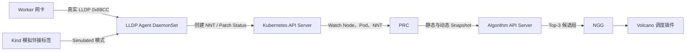

# LLDP Agent 实现与演示说明

## 1. 在总体架构中的位置



每个目标 Worker 运行一个 Agent。Agent 只负责把节点到接入交换机的邻接关系写入 `NodeNetworkTopology`，PRC 和 Algorithm 不直接读取网卡。

## 2. 两种采集模式

| 模式 | 使用环境 | 数据来源 | NNT source |
|---|---|---|---|
| `Simulated` | Kind Demo | Node Label/Annotation | `SimulatedLLDP` |
| `LLDP` | 物理 Kubernetes 集群 | EtherType `0x88CC` LLDP 帧 | `LLDP` |

Kind 节点是 Docker 容器，无法真实连接三台物理交换机，所以演示使用 Simulated 模式，但 NNT、Snapshot、Algorithm 和调度路径与真实模式完全相同。

真实模式能够从必选 LLDP TLV 中解析：

- Chassis ID；
- Port ID；
- TTL；
- System Name；
- 本地接收网卡。

LLDP 不直接提供链路时延。带宽需要结合网卡/交换机接口信息，时延由 Prometheus 或网络探测指标补充。

## 3. 主要文件

- `src/ngd_ngg_demo/lldp.py`：监听和解析 LLDP 帧；
- `src/ngd_ngg_demo/lldp_agent.py`：Agent 循环与 NNT 写入；
- `config/rbac/lldp-agent.yaml`：ServiceAccount 和 NNT 写权限；
- `config/manager/lldp-agent.yaml`：Kind Simulated DaemonSet；
- `config/manager/lldp-agent-real-patch.yaml`：真实 LLDP 模式补丁；
- `scripts/05b-deploy-lldp-agent.sh`：部署并等待 9 个 NNT；
- `tests/test_lldp_agent.py`：LLDP TLV 和模拟状态测试。

## 4. Demo 验证结果

当前 `volcano-ngd-ngg-v2-demo` 集群已经验证：

1. DaemonSet 在 9 个 Worker 上达到 `9/9 Ready`；
2. 删除原有全部 NNT；
3. 9 个 Agent 自动创建 9 个新 NNT；
4. NNT 正确恢复为 switch-a 3 个、switch-b 2 个、switch-c 4 个；
5. PRC 使用新 NNT 形成静态 Snapshot；
6. Algorithm 返回 `switch-c → switch-a → switch-b`；
7. Volcano 最终把 4 个 Pod 调度到 activeGroup switch-a。

查看状态：

```bash
kubectl --context kind-volcano-ngd-ngg-v2-demo \
  -n ngd-ngg-system get daemonset,pods -l app=ngd-ngg-lldp-agent

kubectl --context kind-volcano-ngd-ngg-v2-demo get nnt
```

## 5. 真实集群切换方式

真实集群需要为 Agent 启用宿主机网络和 `NET_RAW`，并将模式改为 `LLDP`：

```bash
kubectl patch daemonset lldp-agent \
  -n ngd-ngg-system \
  --type strategic \
  --patch-file config/manager/lldp-agent-real-patch.yaml
```

生产接入时还需要确认：

- 服务器交换机端口已开启 LLDP；
- Agent 监听的是物理业务网卡，不是 CNI、veth、bridge 等虚拟接口；
- Chassis/System Name 与 Leaf 以上拓扑数据的交换机 ID 一致；
- Pod Security、SELinux/AppArmor 和 `NET_RAW` 权限符合安全基线；
- Agent 只能更新本节点对应的 NNT，生产版通过准入策略进一步限制写入范围。
