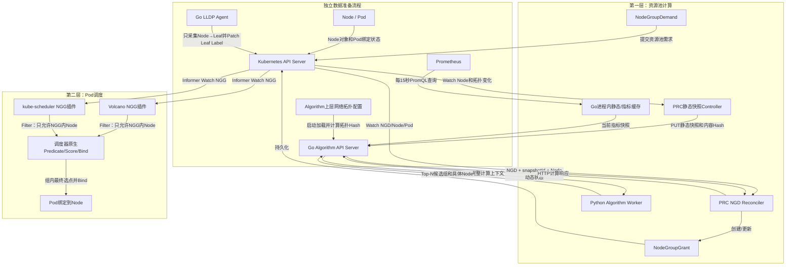
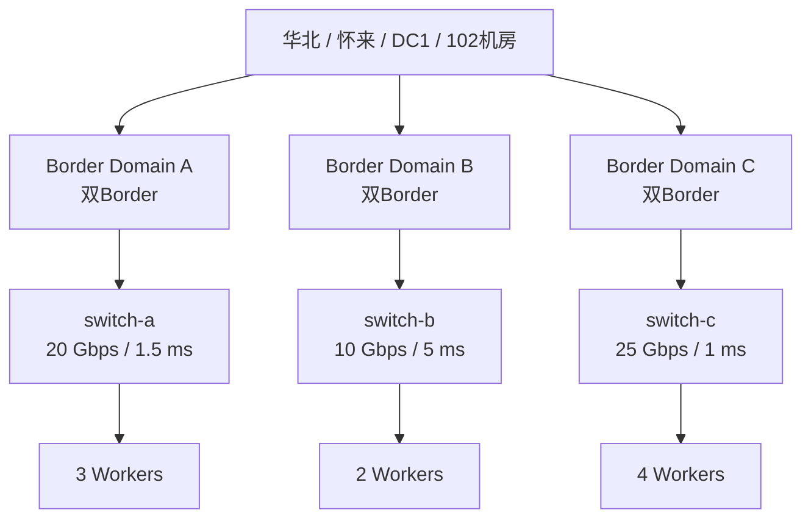
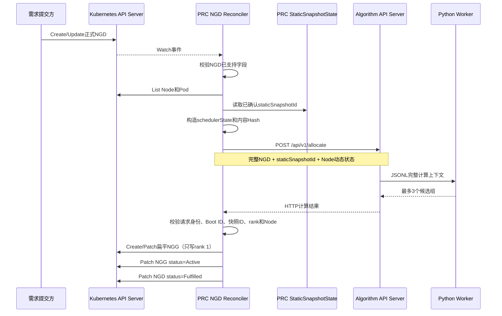

# NGD-NGG 两层调度项目技术说明（当前版）

> 项目路径：`/mnt/data0/volcano-scheduler/ngd-ngg-scheduling-demo`  
> 整理日期：2026-09-02  
> 代码基线：`main` 分支，提交 `54fac80`（`feat: add Unicom border-domain topology scheduling`）

## 1. 文档目的

本文以当前代码为准，说明 NGD-NGG 两层调度 Demo 的技术目标、系统组成、数据来源、接口协议、核心代码、运行方法、测试范围和当前尚未完成的事项。

项目解决的问题可以概括为：

1. 第一层根据任务资源需求、网络拓扑和实时负载，计算一组可以交给任务使用的 Node；
2. 第一层将结果写成 Kubernetes `NodeGroupGrant`（NGG）对象；
3. 第二层的 Volcano 或 kube-scheduler 插件读取 NGG，把 Pod 限制在授权 Node 范围内；
4. 具体选择组内哪一个 Node、如何 Bind Pod，仍由第二层调度器完成。

因此，NGG 表示“可调度范围”，不是每个 Pod 的最终绑定结果。

## 2. 当前实现结论

当前项目已经实现：

- Go PRC，基于 Kubebuilder/controller-runtime 的 Manager 和 Reconciler；
- Go Algorithm API Server，负责 HTTP、静态缓存、Prometheus 缓存和 Python Worker 生命周期；
- Python 算法 Worker，固定执行 `requirement → topology → loadbalance`；
- Go LLDP Agent，支持模拟采集和真实 LLDP 帧监听，只把 Node 直连 Leaf 持久化到 Node Label；
- Algorithm Server 独立加载“区域→位置→数据中心→机房→Border Domain→可选 Spine→Leaf”网络配置；
- 联通正式 Cluster-scoped NGD 的读取，以及联通扁平 NGG 的生成；
- 旧版 Top-3 NGG 的 Volcano 插件和 kube-scheduler 插件演示；
- 1000 Node 四组 Go Test、VS Code/Delve Debug 和 3000 Node 性能矩阵。

必须注意，项目现在同时保留了两套协议路径：

| 路径 | NGD/NGG Group | 范围 | NGG 结构 | 当前用途 |
|---|---|---|---|---|
| 联通正式路径 | `scheduling.platform.example.io` | Cluster-scoped | 扁平 `spec.nodes`，只写算法排名第一的组 | 当前主要开发和 Go Test 路径 |
| 旧版 Demo 路径 | `scheduling.demo.ngg.io` | Namespaced | 最多 3 个 `candidateNodeGroups` 和 `activeGroupRef` | Kind 中 Volcano/kube-scheduler 实际演示路径 |

正式路径目前已经验证到“PRC 生成正式 NGG”。实际 Volcano 和 kube-scheduler 插件仍 Watch 旧版 Namespaced NGG，尚未切换为直接消费正式扁平 NGG。`ngg_consumer/formalgrant/` 已有正式 NGG 的解析、校验和合并核心，但还没有注册到两个实际调度器插件中。

## 3. 整体架构



三类数据采用不同生命周期：

| 数据 | 来源 | 维护者 | 更新方式 | 调度请求中是否完整传输 |
|---|---|---|---|---|
| Node 静态数据 | Kubernetes Node + Leaf Label | PRC 静态 Controller、Algorithm 静态缓存 | Node/Leaf变化触发，内容 Hash 去重 | 否，只传 `nodeStaticSnapshotId` |
| 上层网络拓扑 | Algorithm YAML 配置 | Algorithm 拓扑缓存 | 服务启动时严格解析，内容 Hash 标识 | 否，NGD不携带拓扑图 |
| Node 动态状态 | Node Ready/Unschedulable + 已绑定 Pod Request | PRC NGD Reconciler | 每次任务请求重新构造 | 是，当前以 `schedulerState` 发送 |
| 实时指标 | Prometheus | Algorithm Go 主进程 | 启动后立即拉取，之后每 15 秒刷新 | PRC 不传；Algorithm 从内存取快照 |

静态数据和 Prometheus 指标都不是等 NGD 到达后才准备。正常流程中它们在任务计时前已经进入 Algorithm 内存；NGD 到达时只需发送需求和动态状态。

## 4. 核心对象

### 4.1 NGD：NodeGroupDemand

NGD 是第一层资源池计算的输入，描述“需要什么样的一组节点”。正式 CRD 位于：

- `docs/paas-schedbridge-master/crd-deploy/nodegroupdemand-crd.yaml`
- 示例：`docs/paas-schedbridge-master/crd-deploy/nodegroupdemand-cr-example.yaml`

正式对象为 Cluster-scoped：

```yaml
apiVersion: scheduling.platform.example.io/v1alpha1
kind: NodeGroupDemand
metadata:
  name: example-demand
spec:
  schedulerName: volcano
  nodeSelector:
    matchLabels:
      kubernetes.io/arch: amd64
  maxNodes: 100
  minResources:
    cpu: "3200"
    memory: 12800Gi
  quota:
    cpu: "3200"
    memory: 12800Gi
```

当前真正参与算法计算的字段是：

- `schedulerName`；
- `nodeSelector`；
- `maxNodes`；
- `minResources`；
- `quota`。

以下字段会被 PRC 原样传给 Algorithm，但当前算法只生成 warning，不参与计算：

- `minThroughput`；
- `crossClusterAffinity`；
- `intraClusterAffinity`；
- `networkReachability`；
- `preferredSubnet`。

正式 NGD 严格采用联通原始 CRD，不增加 `profile`、`topologyRequirement`、
`algorithms` 或 `maxCandidateGroups`。算法顺序、NarrowestFit 层级和 Top-3
上限由服务端固定；上层网络关系来自 Algorithm 独立配置。

NGD Status 由 PRC 更新：

```yaml
status:
  phase: Fulfilled
  grantRef: ngg-example-demand
  resolvedNodeCount: 100
  lastUpdated: "..."
  message: selectedGroup=border-domain:HB-HL-DC1-102-BORDER-DOMAIN-01 nodes=100
```

### 4.2 NGG：NodeGroupGrant

NGG 是第一层计算结果，也是第二层调度器应消费的 Node 授权范围。正式 CRD 位于：

- `config/crd/nodegroupgrant-platform.yaml`
- 联通原始定义：`docs/paas-schedbridge-master/crd-deploy/nodegroupgrant-crd.yaml`
- 示例：`docs/paas-schedbridge-master/crd-deploy/nodegroupgrant-cr-example.yaml`

正式路径只选择 Algorithm 返回的 rank 1 组，写成一份扁平 NGG：

```yaml
apiVersion: scheduling.platform.example.io/v1alpha1
kind: NodeGroupGrant
metadata:
  name: ngg-example-demand
spec:
  schedulerName: volcano
  version: v1
  timestamp: "..."
  source: normal
  demandRef: example-demand
  nodes:
  - name: worker-001
    score: 86
    resources:
      cpuAvailable: "32"
      memoryAvailable: 128Gi
    topology:
      dataCenter: dc-test-01
      convergenceSwitch: HB-HL-DC1-102-BORDER-DOMAIN-01
      accessSwitch: leaf-001
status:
  phase: Active
  resolvedCapacity:
    nodes: 100
    cpu: "3200"
    memory: 12800Gi
```

关键语义：

- `spec.nodes` 是授权范围，并按 Node score 降序排列；
- `score` 越高表示越适合调度，但最终 Pod 落点由第二层决定；
- `source=normal` 表示使用了有效指标；
- 指标禁用时为 `disabled`；指标不可用或过期时为 `degraded`；
- `degraded/disabled` 情况下 PRC 按协议把 Node 分数改为中性值 50；
- PRC 更新 Status 时保留由消费方写入的 `status.consumer`。

### 4.3 Algorithm 返回结果

Algorithm 内部仍可以返回最多 3 个候选组：

```json
{
  "status": "SUCCESS",
  "candidateNodeGroups": [
    {
      "rank": 1,
      "groupId": "border-domain:HB-HL-DC1-102-BORDER-DOMAIN-01",
      "topologyLevel": "borderDomain",
      "groupScore": 82.35,
      "nodes": [
        {
          "nodeUID": "...",
          "nodeName": "worker-001",
          "score": 86,
          "resources": {
            "cpuAvailable": "32",
            "memoryAvailable": "128Gi"
          }
        }
      ]
    }
  ]
}
```

正式 PRC 不修改候选顺序，直接选择 `candidateNodeGroups[0]` 生成一组扁平 NGG。旧版 Demo 才会把最多 3 组全部写进旧 NGG 并维护 `activeGroupRef`。

## 5. 拓扑采集与静态快照

### 5.1 拓扑模型

算法当前使用以下层级。SPINE 是可选层，联通样例中为空时直接跳过：

```text
华北 Region
└── 怀来 Location
    └── HB-HL-DC1 DataCenter
        └── HB-HL-DC1-102 Room
            └── Border Domain（显式双Border集合，彼此不重叠）
                └── Spine Domain（可选，允许为空）
                    └── Leaf Switch
                        └── Kubernetes Node（一台Node暂只连接一个Leaf）
```

Kind Demo 的模拟拓扑为：



1000/3000 Node 测试均采用联通式空 SPINE、双 Border Domain 配置；每个 Leaf
连接 20 个内存模拟 Node。配置文件为 `config/topology/*.yaml`。

### 5.2 LLDP Agent 工作方式

入口：`topology_agent/main.go`。核心流程：`topology_agent/agent.go`。

Agent 作为 DaemonSet 运行在每个 Worker：

1. 通过Kubeconfig或In-Cluster配置创建client-go客户端并读取本Node；
2. 从Node Annotation恢复上次有效观测，作为采集失败时的保留值；
3. 识别Bond模式：Active-Backup只选Active Slave，负载模式选择全部Up Slave；
4. `Simulated`模式读取种子Annotation，`LLDP`模式监听`0x88CC`帧；
5. 规范化最多两个Leaf和链路明细，内容变化时才Patch自身Node；
6. 每30秒独立重新探测，以发现主备切换、链路Down和邻居变化。

关键 Node Label：

```text
topology.demo.ngg.io/leaf-set-id
topology.demo.ngg.io/leaf-count
topology.demo.ngg.io/leaf-switch        # 仅单Leaf兼容字段
```

完整Leaf列表和物理链路分别保存在`leaf-switch-ids`、`leaf-links` Annotation。Border、Spine、Leaf互联端口和Region/Location/DataCenter/Room均不写Node。
Algorithm 启动时从 `TOPOLOGY_CONFIG_FILE` 加载并校验独立 YAML；联通原始样例
见 `config/topology/unicom-huailai-102-sample.yaml`。

部署配置：`config/manager/lldp-agent.yaml`。物理网络切换参考：`config/manager/lldp-agent-real-patch.yaml`。

### 5.3 PRC 如何取得拓扑

PRC静态Controller从Kubernetes API列出Node，优先读取`leaf-switch-ids` Annotation，并兼容单值`leaf-switch` Label。缺少Leaf元数据的Node不会再回退读取`NodeNetworkTopology`。

静态快照包含：

- Node 名称和 UID；
- Node 创建时间；
- `status.allocatable`；
- Node Labels；
- `leafSwitchIds`和物理链路列表（同时兼容填充单值`leafSwitchId`/`switchId`）；
- 固定静态协议版本 `node-leaf-set-v2`。

PRC 对规范化后的完整快照计算 SHA-256 内容 Hash。内容不变时 snapshot ID 不变，不使用进程内自增版本号。

Algorithm收到请求后先把单/双Leaf解析成唯一Leaf Domain，再补齐Region、Location、
DataCenter、Room、Border Domain、可选Spine、带宽和时延。拓扑配置本身另算
`topologySnapshotId`，不会混入 PRC 的 Node 静态快照 Hash。

## 6. PRC 实现

### 6.1 启动和组件注册

正式入口：`prc/cmd/main.go`。

入口读取 `ALGORITHM_URL`、`CLUSTER_ID` 和 controller-runtime 参数，然后调用：

```text
application.New(Config)
└── 创建 controller-runtime Manager
    ├── 注册 NodeStaticSnapshotReconciler
    ├── 注册 NodeGroupDemandReconciler
    ├── 注册 healthz/readyz
    └── 创建两者共享的 StaticSnapshotState

Application.Start(ctx)
└── 启动 Manager、Informer、Watch 和 Reconcile Worker
```

统一封装位于 `prc/pkg/application/application.go`。生产 `main.go` 与 Group3/Group4 测试都使用这个入口，因此 Controller 注册逻辑一致。

### 6.2 静态快照 Controller

代码：`prc/pkg/controller/static_snapshot_controller.go`。

职责：

1. 只Watch Node容量、Label和Leaf Annotation；
2. 构造规范化静态快照；
3. 计算内容 Hash；
4. 查询 Algorithm 当前 Boot ID 和缓存状态；
5. 必要时调用 `PUT /internal/v1/node-static-snapshots/{snapshotID}`；
6. Algorithm 确认后更新进程内 `StaticSnapshotState`。

它和任务 Reconciler 是独立流程。Algorithm 重启后 Boot ID 改变，即使 Node 内容未变化，静态 Controller 也会把快照重新同步到新进程。

### 6.3 NGD Reconciler

代码：`prc/pkg/controller/prc_controller.go`。

当前事件Controller只Watch正式/旧版NGD的创建、generation变化和删除。Node、Pod不直接触发任务Reconcile，而是在独立15秒刷新到期后由Demand Processor重新读取；NNT不再注册或Watch。Node静态字段变化只触发Static Snapshot Controller同步新的内容Hash。

正式 NGD 的处理过程：



当前正式 Reconcile 成功后返回：

```go
ctrl.Result{RequeueAfter: 15 * time.Second}
```

所以即使 NGD 没有变化，也会每 15 秒重新进入 `Reconcile()`，再次调用 Algorithm 并刷新 NGG 的 timestamp/nodes。当前尚未实现“根据 NGD/NGG 状态和输入版本无变化时跳过完整计算”的短路逻辑。

另外，Watch 事件和 `RequeueAfter` 是两种机制：Watch 可以提前触发，15 秒 Requeue 是兜底的定时重新入队，不是 Watch 每 15 秒执行。

### 6.4 PRC 发送的动态状态

代码：`prc/pkg/controller/snapshot.go`。

PRC 根据 Node 和已绑定 Pod 构造：

```json
{
  "nodeName": "worker-001",
  "nodeUID": "...",
  "ready": true,
  "unschedulable": false,
  "requestedResources": {
    "cpu": "4000m",
    "memory": "8Gi"
  }
}
```

当前 PRC 仍使用兼容字段 `schedulerState`。Algorithm Go 层将其转换为新语义 `nodeUsageStates[].inUse`：

- Node NotReady：`inUse=true`；
- Node Unschedulable：`inUse=true`；
- 声明的正容量资源全部达到上限：`inUse=true`；
- 其他情况：`inUse=false`，同时保留 `requestedResources` 供算法计算可用资源。

动态状态不在 Algorithm 中跨请求缓存。

### 6.5 PRC 与 Algorithm HTTP 接口

客户端代码：`prc/pkg/controller/algorithm_client.go`。

| 方法 | 路径 | 用途 |
|---|---|---|
| `GET` | `/internal/v1/node-static-cache/status` | 获取 Algorithm Boot ID 和静态缓存状态 |
| `PUT` | `/internal/v1/node-static-snapshots/{snapshotID}` | 上传完整静态快照 |
| `POST` | `/api/v1/allocate` | 发送 NGD 和本次 Node 动态状态并计算 |

PRC 会验证 Algorithm 响应中的请求 ID、NGD UID/generation、任务 UID、Boot ID、静态快照 ID、动态快照 ID、候选 rank、Node UID/名称以及重复 Node。

## 7. Algorithm API Server 实现

### 7.1 进程结构

正式入口：`algorithm_server/go/cmd/algorithm-server/main.go`。

```text
Go Algorithm Server进程
├── HTTP Server
├── Node静态快照缓存
├── Prometheus指标缓存及15秒刷新协程
├── 请求校验和响应组装
└── Python Worker子进程
    └── requirement → topology → loadbalance
```

Go 没有在进程内嵌入 Python 解释器。Go 使用 `exec.Command` 启动独立 Python 子进程，通过 stdin/stdout 的一行一个 JSON（JSONL）进行通信。Worker 常驻，不是每个请求重新启动一次。

统一封装：

- `algorithm.NewApplication()`：组装缓存、Worker 和 HTTP Handler；
- `algorithm.NewServer()`：绑定监听端口并管理 HTTP、指标协程和 Worker 生命周期；
- `Server.Start()`：非阻塞启动；
- `Server.Run()`：正式进程使用，启动后阻塞；
- `Server.WaitForReady()`：测试等待 HTTP 和首次 Prometheus 快照就绪；
- `Server.Close()`：统一关闭 HTTP 和 Python Worker。

生产入口和 Group2/Group4 测试使用同一套 Server/Application 实现。

### 7.2 HTTP 接口

路由注册：`algorithm_server/go/algorithm/application.go`。

| 方法 | 路径 | 说明 |
|---|---|---|
| `GET` | `/healthz` | 进程存活检查 |
| `GET` | `/readyz` | HTTP 服务已启动；不表示静态快照已经上传 |
| `GET` | `/internal/v1/cache/status` | 查看静态、动态和指标缓存状态 |
| `GET` | `/internal/v1/node-static-cache/status` | PRC 静态同步专用状态 |
| `PUT` | `/internal/v1/node-static-snapshots/{snapshotID}` | 保存当前/上一份静态快照 |
| `POST` | `/api/v1/allocate` | 当前正式计算接口 |
| `POST` | `/api/v1/node-groups/calculate` | 旧协议兼容接口 |

### 7.3 缓存边界

Algorithm 只缓存两类数据：

- Node 静态快照；
- Prometheus 指标快照。

它不缓存任务级 Node 动态状态。每次 `/api/v1/allocate` 都必须由 PRC 发送完整动态状态。

所有缓存都在 Go 进程内，不使用 Redis、Kafka或跨 Pod 共享内存。当前部署为单副本；如果将来扩为多副本，每个副本都需要独立接收静态快照并维护自己的指标缓存。

### 7.4 Prometheus 读取

代码：

- `algorithm_server/go/algorithm/metrics.go`
- `algorithm_server/go/algorithm/metrics_config.go`
- 指标目录：`algorithm_server/go/algorithm/prometheus_metrics.json`

Algorithm Server 启动 HTTP 后立即读取一次 Prometheus，之后默认每 15 秒刷新。请求形式为：

```text
GET {PROMETHEUS_URL}/api/v1/query?query=<PromQL>
Accept: application/json
Authorization: Bearer <token>   # 配置token时才发送
```

当前指标目录共 14 项：

- CPU 使用率；
- 内存使用率；
- 网络收发字节速率；
- 网络收发包速率；
- 网络收发丢包率；
- 网络收发错误率；
- TCP 重传率；
- 网卡 Up 比例；
- 网络利用率；
- 可用带宽。

CPU 和内存是 required 指标；网络指标当前是 optional。必需指标查询失败时保留上一份成功快照；可选指标失败记录 warning。快照超过默认 120 秒后被视为过期并进入 degraded。

指标认证支持 Bearer Token；测试 Mock Prometheus 会验证：

- 正确 Token 返回成功；
- 缺失 Token 返回 401；
- 错误 Token 返回 403；
- 查询超时能够被识别。

### 7.5 固定算法流程

入口：`algorithm_server/python/algorithm_worker/pipeline.py`。

当前算法不是由 NGD 动态编排，而是固定执行：


#### requirement

代码：`algorithm_server/python/algorithm_worker/algorithms/requirement.py` 和 `services/node_view_builder.py`。

依次过滤：

1. `inUse=true` 的 Node；
2. `nodeSelector.matchLabels` 不匹配的 Node；
3. `matchExpressions` 不匹配的 Node；
4. 可用资源无法容纳最小任务资源的 Node。

#### topology

代码：`algorithm_server/python/algorithm_worker/algorithms/topology.py`。

使用 `NarrowestFit`：

1. 先按 Leaf 分组；
2. 存在 Spine 时按 Spine Domain 分组；SPINE 为空时跳过；
3. Leaf/Spine不能满足时按非重叠的 Border Domain 分组；
4. 再依次放宽到 Room、DataCenter、Location、Region；
5. 在找到至少一个可行层级后，不再返回更宽层级。

层级顺序由服务端固定，NGD 不再提供 profile 或 `widestAllowedLevel`。

#### loadbalance

代码：`algorithm_server/python/algorithm_worker/algorithms/loadbalance.py`。

配置：`algorithm_server/python/algorithm_worker/config/loadbalance_profiles.json`。

默认使用 `balanced-v2`：

- 资源可用度权重：0.15；
- Prometheus 指标权重：0.70；
- 静态拓扑质量权重：0.15。

Node score 综合 CPU/内存可用比例和 Prometheus 指标。拓扑质量根据带宽与时延计算。组分数为 Node 平均分和拓扑质量的加权结果。

组按以下规则稳定排序：

1. `groupScore` 降序；
2. 拓扑层级顺序；
3. `groupId` 字典序。

组内 Node 按以下规则稳定排序：

1. Node score 降序；
2. Node name；
3. Node UID。

正式资源池模式随后根据 `maxNodes`、`minResources` 和 `quota` 从高分到低分选择具体 Node。服务端最多返回 3 组。

## 8. 第二层调度器

### 8.1 Volcano

插件代码：`plugin/nodegroupgrant/nodegroupgrant.go`。Volcano v1.15.0 接入补丁：`patches/volcano-v1.15.0-nodegroupgrant-register.patch`。

插件注册 PredicateFn，在 Volcano 原生 `gang`、`predicates`、`nodeorder` 和 Bind 之前增加 NGG 范围检查：

- 没有 NGD Annotation 的 Pod 不受插件管理；
- 受管 Pod 缺少有效 NGG 时 Fail Closed；
- 只允许当前 active group 中名称和 UID 都匹配的 Node；
- 通过后继续执行 Volcano 原生调度流程。

配置：`config/volcano/scheduler-config.yaml`。

### 8.2 kube-scheduler

插件代码：`plugin/kubescheduler/nodegroupgrant/plugin.go`。注册入口：`plugin/kubescheduler/cmd/ngg-scheduler/main.go`。

它以独立 scheduler profile `ngg-scheduler` 运行，在 Filter 扩展点执行 NGG 范围检查；通过后由 kube-scheduler 原生逻辑 Score 和 Bind。

配置：`config/kubescheduler/scheduler.yaml`。

### 8.3 当前正式协议接入边界

上述两个实际插件当前读取：

```text
scheduling.demo.ngg.io/v1alpha1
Namespaced NodeGroupGrant
candidateNodeGroups + activeGroupRef
```

联通正式 PRC 输出的是：

```text
scheduling.platform.example.io/v1alpha1
Cluster-scoped NodeGroupGrant
扁平 spec.nodes
```

因此，正式 NGG 到实际 Volcano/kube-scheduler 的最后接入还未完成。已有 `ngg_consumer/formalgrant/grant.go` 可以校验正式 NGG 的 phase、schedulerName、version、source、timestamp 和 nodes，并合并多份有效授权；下一步需要把该核心接入两个插件的 Informer、Filter 和必要的 Score 扩展点。

## 9. 正式链路端到端流程

```text
1. LLDP Agent只把Node直连Leaf写入Node Label
2. PRC静态Controller Watch Node并构造静态快照
3. PRC通过PUT把静态快照同步到Algorithm
4. Algorithm启动时加载独立上层拓扑并计算topologySnapshotId
5. Algorithm后台每15秒从Prometheus更新指标快照
6. 用户创建Cluster-scoped NGD
7. PRC Watch到NGD，读取Node/Pod并构造动态状态
8. PRC调用Algorithm /api/v1/allocate
9. Algorithm用Leaf补齐上层拓扑，并读取Prometheus缓存
10. Algorithm通过JSONL调用Python Worker
11. Python执行requirement→topology→loadbalance并最多返回3组
12. PRC校验响应并选择rank 1
13. PRC创建/更新一份扁平正式NGG
14. PRC设置NGG Active和NGD Fulfilled
15. 正式调度插件应读取spec.nodes并限定Pod候选Node（当前待接入）
16. Volcano或kube-scheduler在授权范围内完成最终选点和Bind
```

## 10. 部署与演示

### 10.1 环境和版本

| 组件 | 当前版本/镜像 |
|---|---|
| Kind Node | Kubernetes v1.35.5 |
| PRC | `ngd-ngg-prc:v0.3.0` |
| Algorithm | `ngd-ngg-algorithm:v0.4.0` |
| LLDP Agent | `ngd-ngg-lldp-agent:v0.2.0` |
| Volcano | v1.15.0，自定义镜像 `volcano-ngg-scheduler:v1.15.0` |
| kube-scheduler | v1.35.3，自定义镜像 `ngg-kube-scheduler:v1.35.3` |
| Python runtime | Dockerfile 中为 Python 3.13 Alpine |

### 10.2 从零部署

从项目根目录执行：

```bash
cd /mnt/data0/volcano-scheduler/ngd-ngg-scheduling-demo
make demo
```

如果已经存在构建好的镜像归档：

```bash
make demo-prebuilt
```

完整 `make demo` 顺序为：

```text
环境检查
→ 创建1 Control Plane + 9 Worker Kind集群
→ 安装Volcano
→ 安装Prometheus/node-exporter/kube-state-metrics
→ 安装CRD和RBAC
→ 构建部署LLDP Agent
→ 构建部署Algorithm
→ 构建部署PRC
→ 构建部署Volcano插件
→ 构建部署自定义kube-scheduler
→ 检查Prometheus和Algorithm缓存
→ 运行Volcano Demo
→ 运行Kubernetes Job Demo
```

### 10.3 单独部署组件

```bash
make monitoring
make lldp-agent
make algorithm
make prc
make plugin
make kube-scheduler
```

Algorithm 必须先于 PRC 部署，因为 PRC 启动后的静态 Controller 需要访问 Algorithm。

### 10.4 当前 Kind 演示

```bash
make run             # 旧版NGD/NGG + VolcanoJob
make run-kubernetes  # 旧版NGD/NGG + Kubernetes Job
```

`make run` 验证旧版 Top-3：Algorithm 返回 `switch-c → switch-a → switch-b`，脚本预先给 switch-c 加 Taint，使首组无法绑定，PRC 切换到 switch-a；Pod 首次绑定后锁组。

`make run-kubernetes` 先验证缺少 NGG 时 Pod 保持 Pending，再创建 NGD，使 Pod 只能落在当前 active group。

这两条命令用于验证第二层插件闭环，不代表正式扁平 NGG 已经接入插件。

## 11. 测试体系

### 11.1 1000 Node 四组 Go Test

统一说明：`go_test_suites/README.md`。

```bash
make go-test-group1
make go-test-group2
make go-test-group3
make go-test-group4
make go-test-all
```

| 组 | 验证内容 | 是否真实 HTTP | 是否真实 Python | 是否 envtest |
|---|---|---:|---:|---:|
| Group1 | Go 通过 JSONL 调用 Python Worker | 否 | 是 | 否 |
| Group2 | PRC HTTP Client 调用完整 Algorithm | 是 | 是 | 否 |
| Group3 | PRC Watch 正式 NGD并生成正式 NGG，Algorithm 为 Mock | 是 | 否 | 是 |
| Group4 | envtest + 真实 PRC + 真实 Algorithm + Mock Prometheus + Python | 是 | 是 | 是 |

Group4 的业务边界为：

```text
PRC通过Watch观察到NGD并进入Reconcile
→ 真实Algorithm
→ Python Worker
→ PRC写入NGG且status.phase=Active
```

固定输入放在各组 `testdata/input/`，Golden 预期放在 `testdata/expected/`，实际结果放在各组 `results/<run-id>/`。`comparison/diff.txt` 为空表示规范化后的 Expected 与 Actual 一致。

### 11.2 envtest 模拟范围

Group3/Group4 使用 `go_test_suites/common/envtest.go` 启动真实的本地 `kube-apiserver` 和 `etcd` 二进制，并安装正式 CRD。PRC 使用 controller-runtime Client/Informer，通过真实 Kubernetes API 访问这些对象。

envtest 不包含：

- kubelet；
- CNI；
- 容器运行时；
- 实际 Volcano；
- 实际 kube-scheduler；
- Pod 真正 Running。

因此 Group4 的终点是 NGG Active，不包含真实 Pod Bind。

### 11.3 Mock Prometheus

代码：`go_test_suites/common/mock_prometheus.go`。

Mock Server 模拟正式 `/api/v1/query` 接口、vector 响应和 Bearer Token 校验。Algorithm 在服务启动后主动向它查询，而不是由测试直接把指标塞进 Algorithm 私有缓存。

### 11.4 VS Code / Delve

VS Code 配置：`.vscode/launch.json`。

打开项目根目录，在“运行和调试”中选择：

- `Debug Group1 - Go calls Python`；
- `Debug Group2 - PRC calls Algorithm`；
- `Debug Group3 - PRC watches NGD with Mock Algorithm`；
- `Debug Group4 - Full component chain`。

Group4 Debug 会设置 `NGG_TEST_DEBUG=true` 并放宽内部超时。断点暂停时间会进入墙上时钟，因此 Debug 产生的耗时不能作为性能结果。

### 11.5 3000 Node 性能测试

说明和结果：`go_test_suites/scale_benchmark_3000/README.md`。

```bash
make benchmark-3000-all
```

测试固定 3000 个静态 Node，分别选择 1000、800、500、300、100、10 个 Node；四组各规模预热 3 次、正式执行 30 次，计算 Mean、P50、P95、Min、Max 和标准差，共 720 个正式样本。

正式结果目录：`go_test_suites/scale_benchmark_3000/reports/20260825-formal-3000/`。

以选择 1000 Node 为例：

| 组 | Mean | P50 | P95 |
|---|---:|---:|---:|
| Group1 Go→Python | 396.887 ms | 394.931 ms | 418.050 ms |
| Group2 PRC→Algorithm | 459.026 ms | 461.181 ms | 493.190 ms |
| Group3 PRC→Mock Algorithm→NGG | 630.081 ms | 642.379 ms | 734.512 ms |
| Group4 完整真实链路 | 1068.278 ms | 1073.947 ms | 1152.996 ms |

该性能结果运行于当前 Demo 服务器和 envtest 环境，不能直接等同于联通 3000 个真实 Kubernetes Node 集群的生产性能。

## 12. 运行结果和排障

### 12.1 查看组件

```bash
kubectl --context kind-volcano-ngd-ngg-v2-demo -n ngd-ngg-system get deploy,pod,svc
kubectl --context kind-volcano-ngd-ngg-v2-demo -n monitoring get pod,svc
kubectl --context kind-volcano-ngd-ngg-v2-demo get nodes -L topology.demo.ngg.io/leaf-switch
```

### 12.2 查看正式对象

```bash
kubectl get nodegroupdemands.scheduling.platform.example.io
kubectl get nodegroupgrants.scheduling.platform.example.io
kubectl get nodegroupgrant.scheduling.platform.example.io <ngg-name> -o yaml
```

### 12.3 查看旧版 Demo 对象

```bash
kubectl -n ngd-ngg-demo get ngd,ngg
kubectl -n ngd-ngg-demo get ngg ngg-topology -o yaml
```

由于两套 API 都注册了 `ngd`/`ngg` shortName，排障时建议使用完整资源名，避免 kubectl shortName 指向错误的 Group。

### 12.4 查看日志和缓存

```bash
kubectl -n ngd-ngg-system logs deployment/prc
kubectl -n ngd-ngg-system logs deployment/ngd-ngg-algorithm
kubectl -n ngd-ngg-system logs daemonset/lldp-agent --all-pods=true --prefix
kubectl -n kube-system logs deployment/ngg-scheduler
```

本地访问 Algorithm 缓存状态：

```bash
kubectl -n ngd-ngg-system port-forward service/ngd-ngg-algorithm 8080:8080
curl http://127.0.0.1:8080/internal/v1/cache/status
```

### 12.5 演示证据

Kind 演示输出位于 `results/`，主要包括：

- `results/generated-ngg-v2/`：导出的NGD、NGG、带Leaf元数据的Node和调度证据；
- `results/algorithm-calculation-result.txt`：Algorithm 候选组和快照身份；
- `results/topology-placement.txt`：Volcano Pod 最终落点；
- `results/kubernetes-fail-closed.txt`：缺少 NGG 时的 Pending 证据；
- `results/kubernetes-placement.txt`：Kubernetes Job 落点；
- `results/prometheus-*.json/txt`：Prometheus 查询与指标缓存证据；
- `results/prc-v2.log`、`results/algorithm.log`、`results/kube-scheduler.log`。

## 13. 当前限制和下一步

### 13.1 正式 NGG 消费尚未接入调度器

这是当前最重要的接口缺口。需要将 Volcano 和 kube-scheduler 插件从旧版 Namespaced NGG 切换或扩展为 Watch 正式 Cluster-scoped 扁平 NGG，并明确 Pod 如何关联某一份正式 NGG。

### 13.2 正式路径没有状态短路

当前正式 NGD 成功后每 15 秒执行一次完整 Reconcile。后续可保留 15 秒检查，但比较 NGD generation、静态 Hash、动态 Hash、指标快照和 NGG 状态；全部未变化时快速返回，不再调用 Algorithm 和重复写 NGG。

### 13.3 PRC 动态协议仍走兼容适配

目标协议为 `nodeUsageStates[].inUse`，当前 PRC 仍发送 `schedulerState`，由 Algorithm Go 层兼容转换。后续应由 PRC 直接生成新协议，再删除 Algorithm 的旧字段适配。

### 13.4 部分正式 NGD 字段未实现

吞吐量下限、跨集群/集群内亲和、外部网络可达性和子网偏好尚未参与计算。当前只保留字段并返回 warning。

### 13.5 真实 LLDP 尚需物理环境验证

代码能够监听真实 LLDP 帧，但当前 Kind 使用模拟模式。目标集群还需要确认物理网卡、交换机标识、NET_RAW 权限、LLDP 报文可见性及 Leaf 名称与静态上层配置的一致性。

### 13.6 Algorithm 当前是单副本内存状态

静态和指标快照都在进程内。扩展为多副本前需要解决请求粘性、每副本静态同步、独立指标预热和就绪判断，否则 PRC 可能请求到没有对应 snapshot ID 的副本。

### 13.7 readiness 语义有限

Algorithm `/readyz` 只表示 HTTP 服务可用，不表示静态快照就绪。PRC 通过静态缓存状态接口单独确认；部署和运维监控应区分“进程 Ready”和“可处理某个 snapshot 的业务 Ready”。

## 14. 项目目录与关键文件

| 路径 | 功能 |
|---|---|
| `README.md` | 项目快速说明和常用命令 |
| `Makefile` | 构建、部署、演示和测试统一入口 |
| `go.work` | 本地 Go 多模块工作区 |
| `prc/cmd/main.go` | PRC 正式进程入口 |
| `prc/pkg/application/application.go` | PRC Manager、Controller和生命周期统一封装 |
| `prc/pkg/controller/static_snapshot_controller.go` | 静态快照独立同步 |
| `prc/pkg/controller/prc_controller.go` | NGD Watch、Algorithm调用和NGG生成 |
| `prc/pkg/controller/snapshot.go` | 静态/动态快照构造和Hash |
| `prc/pkg/controller/algorithm_client.go` | PRC→Algorithm HTTP客户端 |
| `algorithm_server/go/cmd/algorithm-server/main.go` | Algorithm 正式入口 |
| `algorithm_server/go/algorithm/application.go` | 缓存、Worker、路由组装 |
| `algorithm_server/go/algorithm/server.go` | HTTP监听与完整生命周期 |
| `algorithm_server/go/algorithm/service.go` | 一次Allocate请求的业务编排 |
| `algorithm_server/go/algorithm/cache.go` | Node静态快照缓存 |
| `algorithm_server/go/algorithm/topology.go` | 独立拓扑YAML校验、Hash及Leaf到上层拓扑解析 |
| `algorithm_server/go/algorithm/metrics.go` | Prometheus拉取和指标快照 |
| `algorithm_server/go/algorithm/prometheus_metrics.json` | 14项PromQL指标目录 |
| `algorithm_server/go/algorithm/worker.go` | Go启动Python及JSONL通信 |
| `algorithm_server/python/algorithm_worker/pipeline.py` | 固定算法流水线 |
| `algorithm_server/python/algorithm_worker/services/node_view_builder.py` | 动态状态、标签和资源过滤 |
| `algorithm_server/python/algorithm_worker/algorithms/requirement.py` | FILTER阶段入口 |
| `algorithm_server/python/algorithm_worker/algorithms/topology.py` | Leaf→可选Spine→Border Domain→Room→DC→Location→Region NarrowestFit分组 |
| `algorithm_server/python/algorithm_worker/algorithms/loadbalance.py` | Node/Group评分和资源池Node选择 |
| `algorithm_server/python/algorithm_worker/config/` | 负载均衡Profile |
| `topology_agent/main.go` | LLDP Agent Cobra入口 |
| `topology_agent/lldp.go` | 真实LLDP帧监听和解析 |
| `topology_agent/agent.go` | Node直连Leaf采集、恢复和Label持久化流程 |
| `config/topology/` | Algorithm独立上层网络拓扑配置及联通102机房样例 |
| `ngg_consumer/formalgrant/grant.go` | 正式扁平NGG校验与合并核心 |
| `plugin/nodegroupgrant/nodegroupgrant.go` | 旧版NGG Volcano插件 |
| `plugin/kubescheduler/nodegroupgrant/plugin.go` | 旧版NGG kube-scheduler Filter插件 |
| `config/crd/` | Demo NGD/NGG及正式NGG CRD；NNT文件仅为历史定义，当前不安装 |
| `config/manager/` | PRC、Algorithm、LLDP Agent部署清单 |
| `config/rbac/` | 各组件ServiceAccount/权限 |
| `config/volcano/` | Volcano插件配置 |
| `config/kubescheduler/` | 自定义kube-scheduler配置 |
| `manifests/monitoring/` | Prometheus、node-exporter、kube-state-metrics |
| `manifests/` | 旧版 VolcanoJob/Kubernetes Job 演示输入 |
| `scripts/01-create-kind.sh` | 创建1+9 Kind集群 |
| `scripts/03-install-apis.sh` | 安装两套CRD、RBAC和Demo基础资源 |
| `scripts/04*-build-*.sh` | 构建组件镜像 |
| `scripts/05*-deploy-*.sh` | 部署PRC、Algorithm和LLDP Agent |
| `scripts/07*-deploy-*.sh` | 部署两个调度器插件 |
| `scripts/08-run-demo.sh` | Volcano Top-3/切组/锁组演示 |
| `scripts/09-run-kubernetes-demo.sh` | kube-scheduler Fail Closed演示 |
| `scripts/11-install-prometheus.sh` | 安装监控栈 |
| `scripts/12-check-prometheus.sh` | 检查PromQL和Algorithm指标缓存 |
| `go_test_suites/common/` | Fixture、Golden、Mock Prometheus、envtest和进程工具 |
| `go_test_suites/group1_algorithm_worker/` | Go→Python单元/集成测试 |
| `go_test_suites/group2_prc_algorithm/` | PRC→Algorithm测试 |
| `go_test_suites/group3_prc_ngd_ngg/` | PRC Watch正式NGD和Mock Algorithm测试 |
| `go_test_suites/group4_full_real_algorithm/` | 正式NGD到正式NGG完整真实算法测试 |
| `go_test_suites/scale_benchmark_3000/` | 3000 Node、720样本性能矩阵 |
| `test_suites/` | 早期三组展示型测试，当前标准测试以`go_test_suites/`为准 |
| `src/ngd_ngg_demo/` | 早期Python PRC/LLDP兼容实现，不是当前镜像入口 |
| `src/ngd_ngg_algorithm_legacy_v030/` | 早期Python Algorithm兼容实现，不是当前镜像入口 |
| `results/` | Kind实跑输出和日志证据 |

## 15. 推荐阅读顺序

第一次看项目时，建议按以下顺序阅读：

1. 本文第 3 节整体架构；
2. `docs/paas-schedbridge-master/crd-deploy/nodegroupdemand-crd.yaml`；
3. `prc/pkg/application/application.go`；
4. `prc/pkg/controller/static_snapshot_controller.go`；
5. `prc/pkg/controller/prc_controller.go` 的 `reconcilePlatformDemand()`；
6. `algorithm_server/go/algorithm/service.go`；
7. `algorithm_server/python/algorithm_worker/pipeline.py`；
8. 三个 Python 算法文件；
9. `go_test_suites/group4_full_real_algorithm/group4_test.go`；
10. `go_test_suites/scale_benchmark_3000/README.md`。

这样可以先理解“需求如何变成 NGG”，再深入缓存、算法、调度插件和性能测试细节。
