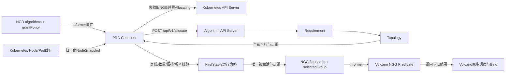

# PRC 拆分为 Controller 与 Algorithm API Server：设计审查与改造计划

## 1. 审查结论

`PRC与Algorithm-API-Server技术方案_副本.md` 的总体拆分方向正确，可以作为后续实现基础：

- PRC 负责 Kubernetes 对象监听、状态归一化、调用编排、结果校验、NGD/NGG 生命周期和失败恢复；
- Algorithm API Server 不访问 Kubernetes，不理解 NGD，只处理通用节点数据和算法流水线；
- 两个组件通过同步 HTTP 接口解耦；
- Requirement 和 Topology 分阶段执行，后续可插入 Load Balance 等算法。

不过，当前文档还不能直接进入编码。下面几个问题必须先补齐，否则即使 HTTP 接口实现完成，也无法与当前 NGG 和 Volcano 插件形成正确闭环。

## 2. 必须修正的设计问题

### 2.1 多个候选节点组没有最终消费者

文档规定 Topology 返回多个相互独立的可行节点组，同时规定 PRC 不选择唯一节点组。当前实现却是：

- NGG 只有一个扁平的 `spec.nodes`；
- Volcano `nodegroupgrant` 插件只判断节点是否存在于这个扁平集合；
- Predicate 是逐 Pod、逐 Node 执行的，无法保证一个任务的所有 Pod 选择同一个候选组。

因此以下做法都不正确：

1. 把多个组直接合并到 `NGG.spec.nodes`，会破坏拓扑组边界；
2. 把多个组全部放进 NGG，再让现有插件取并集，仍会导致任务跨组；
3. 不选择节点组，NGG 就无法进入 `Active`，后续调度链路中断。

第一版推荐采用确定性的运行策略：

```text
Algorithm Server返回全部可行组
→ PRC校验并按groupId稳定排序
→ PRC按grantPolicy.groupSelection=FirstStable选择第一个组
→ 只把被选择组写入NGG.spec.nodes
```

`FirstStable` 不是最优算法，也不声称组质量最优，只负责让第一版接口闭环。未来增加 `loadBalance` 或 `groupSelect` 算法后，用算法结果替换该策略。

NGG 中建议增加选择结果元数据：

```yaml
spec:
  selectedGroup:
    id: region-a/zone-a/dc-01/room-01/leaf-01
    topologyLevel: leaf-switch
    selectionPolicy: FirstStable
  nodes: []
```

当前 Volcano 插件仍只消费 `spec.nodes`，不需要在第一版中实现跨 Pod 的组选择状态机。

### 2.2 `requiredNodeCount` 与 Pod/Gang 语义不同

当前 NGD 使用 `podSets[].minAvailable`，含义是最少要调度多少个 Pod；新文档使用 `requiredNodeCount`，含义是需要多少台不同 Node。两者不能直接等同：

```text
minAvailable=4
不代表
requiredNodeCount=4
```

因为 Volcano 可能把 4 个 Pod 调度到同一个资源充足的 Node。Requirement 证明存在 4 台合格 Node，也不代表 Volcano 一定每台放一个 Pod。

需要在 NGD API 中明确：

- `requiredNodeCount` 是第一层要求的不同节点数量；
- `resourcesPerNode` 是每台候选节点需要具备的剩余资源；
- 它们不自动从 VolcanoJob 的 `minAvailable` 推导；
- 如果业务要求“一台 Node 一个 Pod”，VolcanoJob 还必须配置 PodAntiAffinity、TopologySpread，或者后续扩展 Volcano 插件实现任务级分布约束。

第一版 Demo 可使用 `requiredNodeCount=1` 和该任务在单节点上的聚合资源要求，先验证拆分链路；不要把它描述为多节点资源预留。

### 2.3 NGG 是候选边界，不是资源预留

PRC 计算：

```text
allocatable - 已绑定Pod requests
```

得到的是请求时刻的资源快照。两个并发 NGD 可能同时看到同一批空闲资源，分别获得重叠 NGG。Algorithm Server 拆分以后，这个问题依然存在。

第一版必须在文档中明确：

- NGG 只限制任务可以在哪些节点调度；
- NGG 不保证这些资源已被独占预留；
- 最终是否能调度仍由 Volcano Predicates 和实际资源状态决定。

如果需求方要求硬保证，需要单独设计 Reservation、配额或 PRC 内部软预留账本，不能仅靠本次 HTTP 拆分解决。

### 2.4 Node 的 `available` 混合了全局状态与任务相关约束

Ready、Cordon、删除状态、Pressure 属于节点全局状态；Taint 是否可接受则取决于具体 Pod 的 Toleration。当前 NGD 没有定义 Toleration 来源，而且一个 VolcanoJob 的不同 PodSet 还可能使用不同 Toleration。

第一版建议：

- `available` 只处理节点删除、Ready、Cordon、NetworkUnavailable 和 Pressure；
- Taint、Affinity、Volume、Port 等 Kubernetes 精细约束继续交给 Volcano 原生 Predicates；
- 如果必须在第一层处理 Taint，NGD 需要增加明确的 tolerations 输入，并定义多 PodSet 的合并语义后再实现。

### 2.5 HTTP 返回只带 Node 名称，身份校验不足

当前 NGG 同时记录 Node name 和 UID，用来防止同名 Node 删除重建后复用旧授权。新 HTTP 请求和响应只有 `name`。

推荐请求中增加一个算法不解释的稳定标识：

```json
{
  "nodeId": "<Node UID>",
  "name": "node-01",
  "available": true,
  "availableResources": {},
  "labels": {}
}
```

Algorithm Server 只把 `nodeId` 当作不透明字符串，并在响应中原样返回。PRC 收到结果后必须确认：

```text
nodeId在本次请求快照中
AND 当前Node仍存在
AND 当前Node UID仍等于nodeId
```

然后才能写入 NGG。

### 2.6 同步 HTTP 不需要长期维护本地 requestId 映射

文档描述了 `requestId → NGD UID → generation` 的本地映射，但接口是同步 `POST /allocate`，并没有回调或异步查询。

推荐把关联信息保存在单次 reconcile 的局部上下文中：

```text
调用前保存NGD UID、generation和Node快照
→ 同步调用HTTP
→ 返回后重新读取NGD
→ UID或generation变化则丢弃结果
```

进程重启时本次 HTTP 调用自然失败，WorkQueue 会重新执行，不需要持久化 requestId 映射。`requestId` 仍用于日志追踪和响应匹配。

### 2.7 NGD 修改后必须先让旧 NGG 失效

如果 NGD 从 generation 3 更新为 generation 4，而算法调用需要几秒，旧 NGG 不能在此期间继续被视作新需求的授权。

推荐 reconcile 顺序：

```text
发现NGD generation大于NGG.spec.demandGeneration
→ 先把旧NGG.status.phase改为Stale
→ NGD改为Allocating
→ 再调用Algorithm Server
→ 成功后写入新revision并改为Active
```

NGG 建议增加：

```yaml
spec:
  demandGeneration: 4
  algorithmRequestId: request-xxx
```

长期生产版本还应让 Volcano 插件同时缓存 NGD，校验 NGG 的 `demandGeneration` 是否仍等于当前 NGD generation。第一版 Demo 可以先依赖 PRC 及时失效和 NGG TTL。

### 2.8 触发策略在大集群中会造成全量风暴

Node/Pod 任意变化时，如果把全部 NGD 都加入队列，5000 节点集群会产生大量重复计算和大 HTTP 请求。

第一版 Demo 可以采用全局事件触发加防抖，但生产方案需要：

- WorkQueue 相同 key 自动合并；
- Node/Pod 事件 1～3 秒防抖；
- 只在资源 requests、nodeName、终态、Node Ready/Label/Allocatable 等有效字段变化时触发；
- 用 NGD 索引按资源类型、拓扑 Profile 或池标签缩小重算范围；
- 为 Algorithm Server 设置并发上限和 PRC 客户端限流。

### 2.9 请求和响应缺少规模边界

5000 个 Node 加完整 Label 可能形成很大的 JSON。Topology 又可能返回大量候选组，当前 NGG 对节点最多只允许 64 个。

需要增加明确限制：

```yaml
grantPolicy:
  maxCandidateGroups: 32
  maxNodesPerGroup: 64
  groupSelection: FirstStable
  grantTTLSeconds: 600
```

同时规定：

- PRC 只传算法需要的资源键；
- Node Label 按配置的允许前缀或白名单发送；
- HTTP Server 限制请求体和响应体大小；
- 超出规模返回明确错误，不允许静默截断导致数量语义变化；
- Topology 输出按 `groupId` 和 `nodeId` 稳定排序，保证结果可复现。

### 2.10 API 错误分类需要区分“用户错误”和“系统集成错误”

不能简单认为所有 HTTP 400 都是 NGD Invalid：

- 算法参数被拒绝，属于 NGD `Invalid`；
- PRC 构造了不符合约定的 JSON，属于 PRC/协议错误，应为 `Degraded` 并告警；
- HTTP 404 可能是 Service 路由或版本配置错误，也应为系统 `Degraded`；
- HTTP 422 且 reason 为算法参数问题，才适合标记 `Invalid`。

建议以响应中的 `reason`、`retryable` 和错误来源联合判断，不只看 HTTP 状态码。

## 3. 推荐的第一版闭环架构



推荐保留同步调用。Algorithm Server 是无状态 Deployment，不需要 ServiceAccount 权限访问 Kubernetes。

## 4. 推荐 NGD 结构

```yaml
apiVersion: scheduling.demo.ngg.io/v1alpha1
kind: NodeGroupDemand
metadata:
  name: training
  namespace: ngd-ngg-demo
spec:
  taskRef:
    apiVersion: batch.volcano.sh/v1alpha1
    kind: Job
    name: ngg-training
  schedulerName: volcano

  algorithms:
  - name: requirement
    version: v1
    parameters:
      requiredNodeCount: 1
      resourcesPerNode:
        cpu: "200m"
        memory: "128Mi"

  - name: topology
    version: v1
    parameters:
      profile: kind-demo-v1
      strategy: NarrowestFit
      widestAllowedLevel: partition

  grantPolicy:
    groupSelection: FirstStable
    maxCandidateGroups: 16
    maxNodesPerGroup: 64
    grantTTLSeconds: 600
```

接口建议：

- `algorithms` 必须按执行顺序保存；
- 算法增加 `version`，避免同名算法升级后语义漂移；
- 第一版只允许 `requirement` 或 `requirement → topology`；
- `parameters` 在 CRD 中允许扩展，但由 PRC 在发请求前做基础校验，由 Algorithm Server 做最终算法参数校验；
- 删除旧的 `podSets`、`nodeRequirements` 和 `candidatePolicy` 前要确认不存在兼容需求。Demo 可直接修改；生产 CRD 应升级版本而不是原地改变已有字段语义。

## 5. 推荐 HTTP 契约

### 5.1 请求

```json
{
  "apiVersion": "allocation.ngg.io/v1alpha1",
  "requestId": "opaque-request-id",
  "algorithms": [],
  "limits": {
    "maxCandidateGroups": 16,
    "maxNodesPerGroup": 64
  },
  "nodes": [
    {
      "nodeId": "opaque-node-uid",
      "name": "node-01",
      "available": true,
      "unavailableReason": "",
      "availableResources": {
        "cpu": "16",
        "memory": "64Gi"
      },
      "labels": {}
    }
  ]
}
```

### 5.2 成功响应

```json
{
  "apiVersion": "allocation.ngg.io/v1alpha1",
  "status": "SUCCESS",
  "requestId": "opaque-request-id",
  "executedAlgorithms": ["requirement", "topology"],
  "algorithmResults": {
    "topology": {
      "profile": "kind-demo-v1",
      "selectedLevel": "partition"
    }
  },
  "data": [
    [
      {
        "nodeId": "opaque-node-uid",
        "name": "node-01",
        "groupId": "training"
      }
    ]
  ]
}
```

PRC 必须忽略 Algorithm Server 返回的资源值和 UID 之外的权威信息。最终写入 NGG 的 Node name、UID 必须从 PRC 本次请求快照和调用后的 Kubernetes 缓存中重新取得。

## 6. 文件级改造计划

### 6.1 PRC 代码

保留包 `src/ngd_ngg_demo`，按职责拆分：

```text
src/ngd_ngg_demo/
├── main.py                 # PRC入口、配置、生命周期
├── controller.py           # Reconcile状态机，不再实现算法
├── kube.py                 # Kubernetes API/Informer适配
├── ngd.py                  # 新增：解析和校验NGD算法流水线
├── node.py                 # 新增：Node/Pod归一化和剩余资源计算
├── algorithm_client.py     # 新增：HTTP调用、超时、错误分类
├── response_validator.py   # 新增：结果、Node身份、数量、拓扑校验
├── grant.py                # 新增：FirstStable选择和NGG构造/失效
└── models.py               # 新增：内部请求、响应和错误模型
```

当前 `domain.py` 的处理方式：

- 资源 Quantity 解析和 Pod requests 计算移到 `node.py`；
- `select_candidate_nodes` 从 PRC 删除，Requirement/Topology 移到 Algorithm Server；
- `stable_grant_spec` 移到 `grant.py`；
- 补全 init container、Pod overhead、扩展资源等 requests 计算规则，或者在第一版中明确未支持项。

### 6.2 Algorithm API Server

新增独立包：

```text
src/algorithm_server/
├── __init__.py
├── main.py                 # HTTP Server入口
├── api.py                  # /healthz、/readyz、/api/v1/allocate
├── contract.py             # JSON解析、响应结构和错误结构
├── pipeline.py             # 算法注册、顺序校验和上下文传递
├── quantity.py             # Kubernetes Quantity精确比较
├── profiles.py             # Topology Profile加载和校验
└── algorithms/
    ├── __init__.py
    ├── requirement.py
    └── topology.py
```

第一版可以继续使用 Python 标准库 HTTP Server，避免引入额外依赖；如果面向生产部署，建议改用 FastAPI/Uvicorn 或等价成熟框架，并设置请求大小、并发和超时限制。

### 6.3 Kubernetes 配置

新增：

```text
Dockerfile.algorithm
config/algorithm/topology-profiles.yaml
config/manager/algorithm-server.yaml
config/network/algorithm-server-policy.yaml
scripts/04-build-algorithm.sh
scripts/05-deploy-algorithm.sh
```

更新：

- `config/crd/nodegroupdemand.yaml`：增加 `algorithms` 和 `grantPolicy`；
- `config/crd/nodegroupgrant.yaml`：增加 `demandGeneration`、`algorithmRequestId`、`selectedGroup` 和 `Stale/Inactive` 状态语义；
- `config/manager/prc.yaml`：增加 Algorithm Service URL、连接超时、总超时和并发配置；
- `config/rbac/prc.yaml`：若使用 Informer，需要 `watch`；Algorithm Server 不授予 Kubernetes RBAC；
- `Makefile` 和部署脚本：先部署 Algorithm Server，再部署 PRC；
- `manifests/*-demand.yaml`：改成算法流水线格式；
- Demo Node 标签：增加 `kind-demo-v1` Profile 使用的层级标签。

### 6.4 Volcano 插件

第一版采用“PRC 选择一个组、NGG 仍输出扁平 nodes”后，插件主体无需重写，只需：

- 继续只接受 `Active` NGG；
- 保留 revision、generation、TTL、Node UID 和任务 UID 校验；
- 增加 `demandGeneration` 字段解析和日志；
- 后续生产版本再增加 NGD Informer，校验授权是否对应当前 NGD generation。

## 7. PRC 新 Reconcile 流程

```text
1. WorkQueue取出namespace/name
2. 从Informer缓存读取最新NGD
3. 校验taskRef并解析真实任务UID
4. 解析algorithms和grantPolicy
5. 如果已有NGG对应旧generation，先标记Stale
6. 把NGD状态更新为Allocating
7. 从Node/Pod缓存构造NodeSnapshot
8. 生成requestId并同步调用Algorithm Server
9. HTTP返回后重新读取NGD
10. UID或generation变化：丢弃响应并重新入队
11. status=UNSATISFIABLE：NGG置Inactive，NGD置Unsatisfied
12. status=ERROR：按错误类型置Invalid或Degraded并决定是否退避重试
13. status=SUCCESS：执行结构、身份、数量、拓扑和规模校验
14. 对可行组稳定排序，按FirstStable选择一个组
15. 从当前Node缓存补全name和UID，创建或更新NGG
16. NGG置Active并确认observedRevision/observedGeneration
17. NGD置Fulfilled并写入grantRef、requestId和结果摘要
18. WorkQueue Forget该Key
```

## 8. 分阶段实施顺序

### 阶段一：冻结接口和 CRD

1. 确认 `requiredNodeCount` 的业务语义是不同 Node 数量；
2. 确认第一版使用 `FirstStable` 激活一个组；
3. 确认 NGG 仍是候选边界而非资源预留；
4. 固化 NGD、NGG 和 HTTP v1alpha1 示例；
5. 定义错误码、超时、数量上限和 Topology 缺失 Label 的处理。

### 阶段二：实现 Algorithm Server

1. 实现 HTTP contract 和健康检查；
2. 实现 Kubernetes Quantity 比较；
3. 实现 Requirement；
4. 实现 Topology Profile、完整路径分组和 NarrowestFit；
5. 实现稳定排序、错误返回和规模限制；
6. 完成纯算法和 HTTP contract 单元测试。

### 阶段三：拆分 PRC

1. 增加 `ngd.py`、`node.py` 和内部模型；
2. 把本地候选算法从 `domain.py` 移除；
3. 增加 HTTP Client 和 response validator；
4. 重写 Controller 状态机和 NGG 失效逻辑；
5. 先沿用当前 3 秒 reconcile 完成拆分链路，降低一次性改动风险；
6. 链路稳定后替换为 Informer + WorkQueue + 退避队列。

### 阶段四：部署与联调

1. 增加 Algorithm Server 镜像、Deployment、Service 和 ConfigMap；
2. PRC 通过集群内 Service DNS 调用；
3. 更新演示 NGD、Node 拓扑标签和 Makefile；
4. 验证 NGD → HTTP → 多组结果 → FirstStable → NGG → Volcano；
5. 补充异常、并发和过期响应演示。

### 阶段五：生产化增强

1. Informer/WorkQueue、leader election 和 optimistic concurrency；
2. NetworkPolicy、认证、限流、请求大小限制和审计；
3. Prometheus 指标、traceId、算法耗时和结果规模观测；
4. 5000 节点负载测试；
5. 根据业务要求决定是否增加资源预留；
6. 增加真正的节点组评分/选择算法。

## 9. 验收用例

至少应覆盖：

| 用例 | 期望结果 |
|---|---|
| 仅 Requirement 成功 | 返回一个候选组，PRC 生成 Active NGG |
| Requirement + Topology 成功且有多个组 | PRC 稳定选择一个组，NGG 不合并组 |
| 合格 Node 数量不足 | NGD Unsatisfied，NGG Inactive，Pod Pending |
| Topology 无可行组 | NGD Unsatisfied，不使用 Requirement 的部分结果 |
| Algorithm Server 超时/503 | NGD Degraded，退避重试，不用失败结果覆盖 NGG |
| 算法参数非法 | NGD Invalid，不进行高频重试 |
| 返回未知 nodeId | PRC 拒绝响应并标记 InvalidAlgorithmResponse |
| HTTP 调用期间 NGD generation 改变 | 丢弃旧响应，按新版本重算 |
| Node 同名重建 | UID 不匹配，旧结果不能写入 NGG |
| NGG 过期或 Stale | Volcano 插件 fail-closed，Pod 不得越界调度 |
| 两个拓扑组均可行 | 同一任务的 NGG 只包含被选中的一个组 |
| Algorithm Server 无 Kubernetes RBAC | 服务仍能正常完成算法调用 |

## 10. 最终建议

可以按该文档方向改造，但编码前应先把以下四点写回正式技术方案并由需求方确认：

1. `requiredNodeCount` 表示不同 Node 数量，不等于 Pod `minAvailable`；
2. 第一版多组结果采用 `FirstStable` 选一个组，不能把节点组合并；
3. NGG 是调度范围授权，不是资源预留；
4. Taint 等任务相关 Kubernetes 约束第一版仍由 Volcano Predicates 负责。

这四点确认后，其他接口和文件改造可以按本文计划直接推进。

