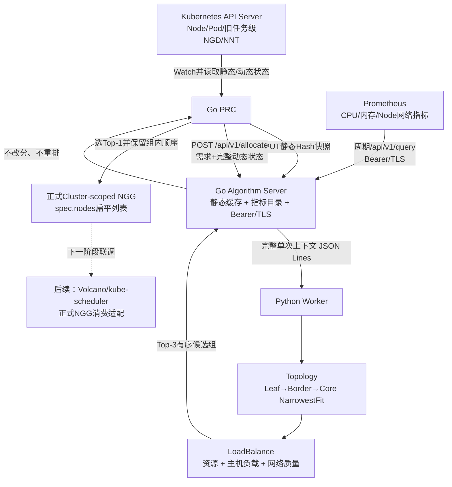

# Prometheus、三层拓扑与联通正式 NGG 改造说明 v2.1

> 日期：2026-08-19  
> 状态：代码已修改，按要求尚未执行测试  
> 范围：Algorithm Server 指标读取/拓扑/评分，以及 PRC 的 NGG 输出

## 1. 本轮结果

本轮完成两条主链路改造：

1. Algorithm Go 主进程从 Prometheus 周期读取 CPU、内存和 Node 网络指标，支持 Bearer Token、Token 文件和 HTTPS/TLS；
2. Python Worker 按可配置的 Leaf → Border → Core 三层拓扑分组，并将主机负载与网络质量纳入评分；
3. PRC 改用正式 `POST /api/v1/allocate`；
4. PRC 选择 Algorithm 返回的排名第一候选组，生成联通定义的 Cluster-scoped、扁平 `NodeGroupGrant.spec.nodes`；
5. 最新测试方案已补充与真实 Prometheus 一致的 Mock 指标和认证要求，但本轮没有运行测试。



## 2. Prometheus 读取改造

### 2.1 指标目录

指标不再由 `PROMETHEUS_CPU_QUERY`、`PROMETHEUS_MEMORY_QUERY` 两个散落环境变量定义，而是统一放在：

```text
algorithm_server/go/prometheus_metrics.json
```

每一项声明内部字段名、完整 PromQL、单位、归一化类型和是否必需。Mock 与真实 Prometheus 必须使用同一目录。

| 类别 | 指标 |
|---|---|
| 必需主机指标 | `cpuUsageRatio`、`memoryUsageRatio` |
| 吞吐 | 收/发 bytes/s、收/发 packets/s |
| 网络质量 | 收/发丢包率、收/发错误率、`tcpRetransmitRatio` |
| 链路 | `networkLinkUpRatio`、`networkUtilizationRatio`、`availableBandwidthBytesPerSecond` |

网络 PromQL 在 Prometheus 侧按 `node` 聚合，并排除 `lo`、`veth`、`cali`、`cni`、`flannel`、`docker` 和桥接接口。比例值限制在 0～1；bytes/s、packets/s 只限制为非负数，不会被错误截断到 1。

本轮没有新增交换机 Exporter、Blackbox Exporter 或其他采集组件，因此交换机 CPU/内存、主动 RTT/丢包、跨集群可达性尚未进入指标目录。

### 2.2 认证与 TLS

实现文件：

```text
algorithm_server/go/metrics_config.go
```

支持：

| 环境变量 | 作用 |
|---|---|
| `PROMETHEUS_BEARER_TOKEN_FILE` | 推荐，从 Kubernetes Secret 只读挂载文件读取 Token |
| `PROMETHEUS_BEARER_TOKEN` | 直接 Token，与文件方式互斥 |
| `PROMETHEUS_CA_FILE` | 自定义 CA |
| `PROMETHEUS_TLS_SERVER_NAME` | TLS 名称校验 |
| `PROMETHEUS_INSECURE_SKIP_VERIFY` | 仅隔离测试环境显式使用 |

HTTP 请求使用标准 `GET /api/v1/query?query=...`，请求头为 `Authorization: Bearer <token>`。代码和状态接口不输出 Token 原文。

### 2.3 缓存与降级

实现文件：

```text
algorithm_server/go/metrics.go
```

- CPU/内存任一必需查询失败：本轮刷新失败，保留上一份成功快照；
- 可选网络查询失败：生成快照并记录 `coverage/warnings`，不会仅因可选项缺失就把整份快照判为不可用；
- 快照 Hash 包含指标目录版本和 Node 指标内容；
- 响应增加 `metricSnapshotCapturedAt`，供 PRC 写入正式 NGG 的 `spec.timestamp`；
- 调度计算仍只读内存，不在任务请求热路径同步访问 Prometheus。

## 3. 三层拓扑算法

层级配置位于：

```text
algorithm_server/python/algorithm_worker/config/topology_profiles.json
```

默认 profile `leaf-border-core-v1` 的顺序是：

```text
Node → leafSwitchId → borderSwitchId → coreSwitchId
```

`topology/v1` 执行 NarrowestFit：先检查每个 Leaf 是否能容纳整个任务；全部不满足时扩大到 Border；仍不满足时扩大到 Core。某些兼容数据没有 Border 时，会跳过空层并继续检查 Core。

可配置参数包括：

- `profile`；
- `strategy=NarrowestFit`；
- `widestAllowedLevel`；
- `requiredDistinctNodes`。

## 4. 评分算法

评分 profile 位于：

```text
algorithm_server/python/algorithm_worker/config/loadbalance_profiles.json
```

默认 `balanced-v2`：

```text
Node分 = 15%资源基础分 + 70%实时综合指标分
Group分 = 85%组内Node平均分 + 15%静态拓扑质量分
```

实时综合指标使用 CPU、内存、网络利用率、丢包、错误、TCP 重传、链路 Up 比例和可用带宽。低 CPU/内存/利用率/丢包/错误/重传得分更高；高 Link Up 和可用带宽得分更高。缺少可选指标时，只对实际存在的指标重新归一化权重。

确定性排序：

```text
组内Node：score降序 → nodeName → nodeUID
候选组：groupScore降序 → 拓扑层级顺序 → groupId
```

PRC 只验证顺序和分值范围，不重新排序。

## 5. PRC 输出正式 NGG

### 5.1 API 与 CRD

PRC 调用入口已经从兼容接口切换为：

```text
POST /api/v1/allocate
```

正式 NGG CRD：

```text
config/crd/nodegroupgrant-platform.yaml
apiVersion: scheduling.platform.example.io/v1alpha1
scope: Cluster
```

旧 Demo NGG CRD 暂时保留，只为旧插件进程能够启动；PRC 不再向旧组写 NGG。

### 5.2 转换规则

Algorithm 仍最多返回 3 个有序候选组。PRC：

1. 校验请求身份、快照身份、连续 rank、groupScore 顺序、Node score 顺序、UID 和重复项；
2. 选择 rank=1 的候选组；
3. 不重新排序组内 Node；
4. `source=normal` 时保留 Algorithm Node score；
5. 指标不可用或关闭时分别写 `source=degraded/disabled`，并按正式契约把 score 写为 50；
6. 将 Leaf/Border Label 映射为 `accessSwitch/convergenceSwitch`；
7. 更新 `status.phase=Active` 和 `status.resolvedCapacity`；
8. 更新 status 时保留由消费方维护的 `status.consumer`。

如果新一轮计算没有可行候选，PRC 不再让旧授权保持 Active：已有 NGG 会进入 `Returned` 且解析容量归零，NGD 标记为 `Unsatisfied`。

示例：

```yaml
apiVersion: scheduling.platform.example.io/v1alpha1
kind: NodeGroupGrant
metadata:
  name: ngg-ngd-ngg-demo-topology
spec:
  schedulerName: volcano
  version: v1
  timestamp: "2026-08-19T10:30:00Z"
  source: normal
  demandRef: ngd-ngg-demo/topology
  nodes:
  - name: worker-02
    score: 86
    topology:
      accessSwitch: leaf-a
      convergenceSwitch: border-a
  - name: worker-03
    score: 79
    topology:
      accessSwitch: leaf-a
      convergenceSwitch: border-a
status:
  phase: Active
  resolvedCapacity:
    nodes: 2
    cpu: "64"
    memory: 256Gi
```

Cluster-scoped NGG 不能对 namespaced 旧 NGD 设置 OwnerReference，因此当前使用 `spec.demandRef` 和 Label 追溯来源，名称中也包含原 Namespace。

## 6. 当前边界和下一步

本轮按要求未执行单元测试、集成测试、1000/3000 Node Demo 或 Kind 全链路演示。

尚未完成的接口衔接：

1. PRC 输入当前仍是旧任务级 namespaced NGD；正式 Cluster-scoped NGD 输入适配留待下一阶段；
2. Volcano 与 kube-scheduler 插件当前仍消费旧 Top-3 NGG，尚未切换为联通正式扁平 NGG；
3. 旧 `scripts/08-run-demo.sh`、`09-run-kubernetes-demo.sh` 依赖旧 NGG 状态机，本轮不能作为新契约验收入口；
4. `demo_1000_nodes/run_demo.py` 的 Mock Prometheus 仍只模拟 CPU/内存，必须按最新测试方案补齐网络指标和 Bearer 认证后再运行；
5. 正式测试需要按 `docs/会议纪要-0818/NGD-NGG三大测试组最新测试方案v2.0.md` 分组实施。

## 7. 关键改动文件

| 文件 | 本轮作用 |
|---|---|
| `algorithm_server/go/prometheus_metrics.json` | 真实/Mock 共用指标目录 |
| `algorithm_server/go/metrics_config.go` | 指标配置、Bearer 和 TLS |
| `algorithm_server/go/metrics.go` | 多指标查询、归一化、覆盖率和缓存 |
| `algorithm_server/go/service.go` | 返回指标快照采集时间 |
| `algorithm_server/python/algorithm_worker/config/topology_profiles.json` | Leaf/Border/Core 层级配置 |
| `algorithm_server/python/algorithm_worker/algorithms/topology.py` | 三层 NarrowestFit |
| `algorithm_server/python/algorithm_worker/config/loadbalance_profiles.json` | 多指标评分权重 |
| `algorithm_server/python/algorithm_worker/algorithms/loadbalance.py` | Node/Group 评分和稳定排序 |
| `prc/internal/controller/algorithm_client.go` | 切换正式 allocate API |
| `prc/internal/controller/prc_controller.go` | Top-1 到正式扁平 NGG 的转换和状态写入 |
| `config/crd/nodegroupgrant-platform.yaml` | 联通正式 NGG CRD |
| `config/rbac/prc.yaml` | 正式 NGG 读写权限 |
