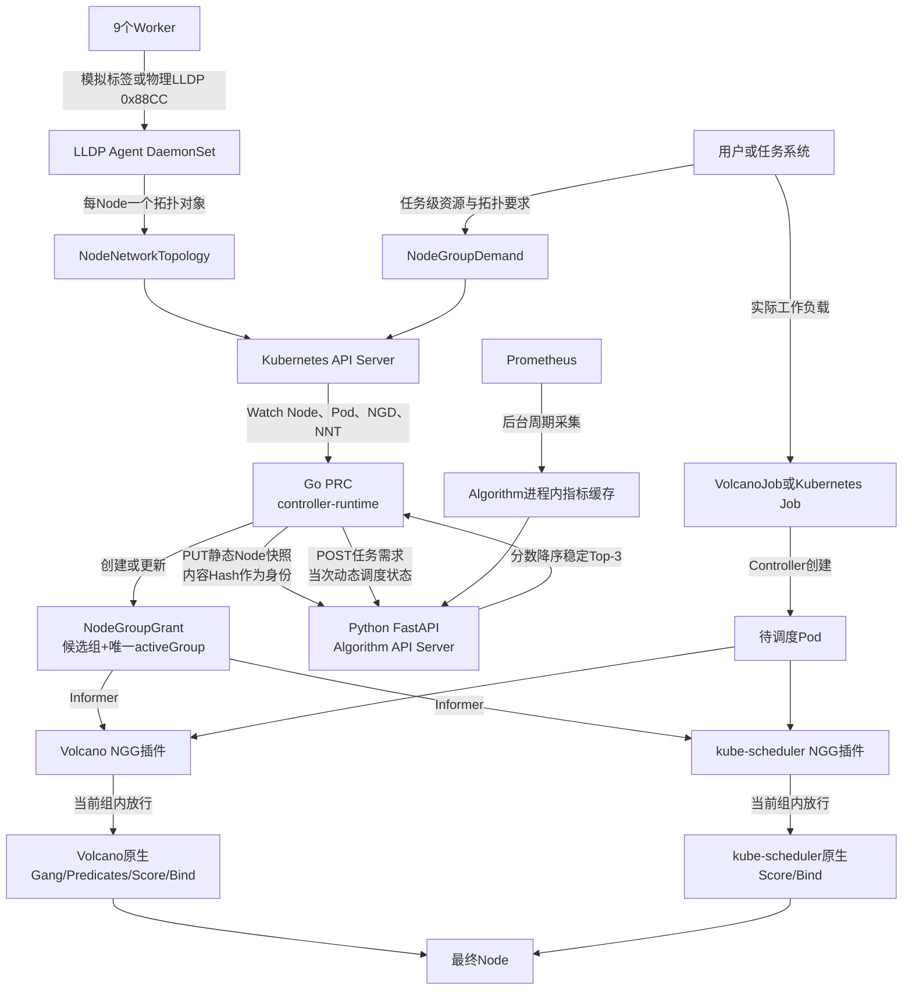
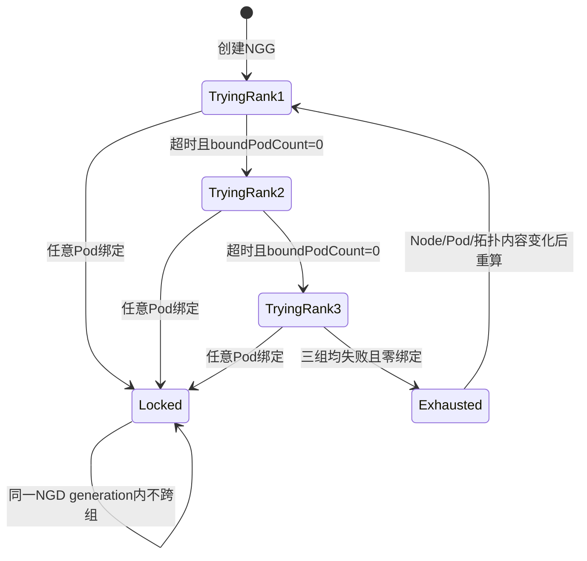

# NGD/NGG 两层调度 Demo：从零实现与复现说明

## 1. 要解决的问题

普通 Kubernetes/Volcano 调度器直接在全体可用 Node 中为 Pod 选最终节点。本 Demo 在它们上面增加一个任务级第一层：

```text
第一层：根据整个任务需求划分和排序候选节点组
第二层：只在当前授权节点组内为每个Pod选择最终Node
```

第一层不绑定 Pod，也不预留资源；第二层仍负责 Taint/Toleration、Affinity、Volume、HostPort、实际资源冲突和 Bind。

## 2. 总体结构



主线各条线的含义：

- Worker → LLDP Agent：取得节点连接的接入交换机和端口；
- API Server → PRC：PRC 从 Kubernetes 获得第一层所需的节点与任务状态；
- PRC → Algorithm：PRC 发送静态拓扑快照、动态状态和任务需求；
- Algorithm → PRC：Algorithm 只计算并排序，不访问 Kubernetes；
- PRC → NGG：PRC 把结果持久化为调度器能 Watch 的授权 CR；
- NGG → 两个插件：插件只允许当前激活组中的 Node；
- 原生调度流程 → Node：第二层完成最终 Pod 绑定。

## 3. 集群与网络拓扑

Kind 集群名为 `volcano-ngd-ngg-v2-demo`，包含 1 个 Control Plane 和 9 个 Worker：

```text
                            core-0
                    /          |          \
             switch-a       switch-b       switch-c
             /  |  \          /  \        /  |  |  \
       worker-01 02 03   worker-04 05  worker-06 07 08 09
```

| 接入交换机 | Worker | 模拟链路 |
|---|---:|---|
| switch-a | 3 | 20 Gbps / 1.5 ms |
| switch-b | 2 | 10 Gbps / 5 ms |
| switch-c | 4 | 25 Gbps / 1 ms |

Kind 使用 LLDP Agent 的 Simulated 模式。物理集群切换为 LLDP 模式后，Agent 通过 `hostNetwork + NET_RAW` 监听 `0x88CC` 帧；NNT 之后的 PRC、Algorithm、NGG 和调度插件无需改变。

## 4. 三个 CR

### 4.1 NNT：一个 Node 的网络拓扑

```yaml
apiVersion: scheduling.demo.ngg.io/v1alpha1
kind: NodeNetworkTopology
spec:
  nodeRef: {name: worker-01, uid: <Node-UID>}
  collectionMode: Simulated
status:
  switchId: switch-a
  coreSwitchId: core-0
  localInterface: eth0
  remotePortId: Ethernet1/1
  bandwidthGbps: 20
  latencyMillis: 1.5
```

Node name 和 UID 同时保存，防止同名 Node 重建后误用旧拓扑。

### 4.2 NGD：任务向第一层提出的需求

```yaml
spec:
  taskRef:
    apiVersion: batch.volcano.sh/v1alpha1 # 也支持batch/v1
    kind: Job
    name: ngg-topology
  schedulerName: volcano                # 或ngg-scheduler
  podSets:
  - name: worker
    replicas: 4
    minAvailable: 4
    resourcesPerPod: {cpu: 100m, memory: 64Mi}
  nodeRequirements:
    nodeSelector: {demo.ngg/worker: "true"}
  topologyRequirement: {level: leafGroup, mode: same}
  grantPolicy:
    maxCandidateGroups: 3
    groupAttemptTimeoutSeconds: 15
    ttlSeconds: 600
```

Volcano 输入为 `manifests/topology-demand.yaml`；Kubernetes Job 输入为 `manifests/kubernetes-demand.yaml`。

### 4.3 NGG：第一层给第二层的授权

```yaml
spec:
  candidateNodeGroups:
  - {rank: 1, groupId: switch-c, groupScore: 100, nodes: [...]}
  - {rank: 2, groupId: switch-a, groupScore: 92.8, nodes: [...]}
  - {rank: 3, groupId: switch-b, groupScore: 80.2, nodes: [...]}
  activeGroupRef: {rank: 2, groupId: switch-a}
  groupAttemptPolicy: {timeoutSeconds: 15, lockAfterFirstBind: true}
  dataVersions:
    nodeStaticSnapshotId: sha256:...
    schedulerStateSnapshotId: sha256:...
    metricSnapshotId: sha256:...
  revision: 2
  validUntil: "..."
status:
  phase: Active
  activeGroupState: Locked
  boundPodCount: 4
  observedRevision: 2
```

NGG 最多保存 3 组，但只有 `activeGroupRef` 指向的一组有效。两个插件都不会把三组 Node 合并使用。

## 5. Go PRC 的实现

正式 PRC 位于 `prc/`，使用 Go 1.25、Kubebuilder 工程结构和 controller-runtime v0.23.1。

主要文件：

- `prc/cmd/main.go`：Manager、leader election、健康检查和 Controller 注册；
- `prc/internal/controller/prc_controller.go`：NGD reconcile、NGG 写入、状态机和重算策略；
- `prc/internal/controller/snapshot.go`：静态快照、动态状态、内容 Hash 和直接 Owner UID 关联；
- `prc/internal/controller/algorithm_client.go`：Algorithm HTTP 客户端；
- `prc/internal/controller/prc_controller_test.go`：协议、Hash、Owner UID、候选顺序和 Exhausted 测试。

Controller Watch NGD、Node、Pod 和 NNT。Node/Pod/NNT 变化会主动把 NGD 重新入队：

- Pending、Unsatisfied 在资源或拓扑内容变化时重新计算；
- 到达重试时间的 Degraded 会重新调用 Algorithm；
- 未锁定 Active NGG 在候选失效、静态 Hash 变化、动态状态变化或 TTL 临近时重算；
- 已有绑定 Pod 的 Locked NGG 不自动换组，节点异常时只标记 Degraded。

旧 Python PRC 仍保留在 `src/ngd_ngg_demo/controller.py`，镜像入口备份为 `Dockerfile.prc-python-legacy`，但正式 Deployment 已使用 `ngd-ngg-prc:v0.3.0` Go 二进制。

## 6. PRC 与 Algorithm 的协议

### 静态快照

PRC 从 Node 和 NNT 构造：

- Node name、UID、创建时间；
- Allocatable、Labels；
- switch、core switch、带宽、时延；
- topologyVersion。

对规范化 JSON 计算 SHA-256，通过：

```text
PUT /internal/v1/node-static-snapshots/{snapshotId}
```

同步给 Algorithm。Algorithm 重新计算 checksum，只在一致时 ACK，并在进程内保留 current/previous 两个不同版本。

### 动态状态

PRC 每次任务请求发送：

- Node UID 和 `inUse` 使用标记；
- NGD PodSets、Selector、拓扑要求和算法参数。

`cache/scheduler_state.py` 只负责校验和规范化本次请求，不保存版本、不做增量同步，也不把动态状态放入跨请求全局缓存。

## 7. Algorithm 与 Prometheus 缓存

Algorithm 位于 `algorithm_api_server/algorithm_api_server/`：

1. `requirement.py` 通过 NodeViewBuilder 排除 `inUse=true`、Selector 不匹配或单 Pod 资源不满足的 Node；
2. `topology.py` 按 Core Switch、Leaf Switch、Node 三层拓扑形成候选组；
3. 检查每组能否容纳 PodSet 的 `minAvailable`；
4. `loadbalance.py` 按配置 Profile 结合 Prometheus 指标和拓扑质量评分；
5. 按 `groupScore` 降序、`groupId` 稳定排序；
6. 最多返回 3 个 `candidateNodeGroups`。

PRC 只校验结果，不修改分数、不重新排序。

`metrics.py` 在 Algorithm 进程内保存 Prometheus current/previous 快照。Kind 集群内已部署 Prometheus、kube-state-metrics 和仅覆盖 9 个 Worker 的 node-exporter。Algorithm 使用集群内 Service 地址每 30 秒查询 Node CPU/内存利用率；调度请求只读内存快照，查询失败则保留最后一次成功快照并标记 degraded。正常实跑返回内容 Hash 形式的 `metricSnapshotId`。

整个方案不引入 Redis、Kafka或跨 Pod 共享内存，Algorithm 第一版固定单副本。

## 8. 候选组状态机



关键规则：

- 超时不是充分条件，必须同时满足“一个任务 Pod 都没有绑定”；
- 首个 Pod 一旦绑定，当前组立刻 Locked；
- 全部候选失败时 NGG 为 `Inactive/Exhausted`、NGD 为 `Unsatisfied`；
- 数据内容未变化时 Exhausted 不做周期性空转计算；
- NGD generation 改变后可以生成新一轮候选组。

## 9. 两个第二层插件

### Volcano

`plugin/nodegroupgrant/` 被编译进 Volcano v1.15.0 `vc-scheduler`。通过后继续执行 Volcano 原生 Gang、Predicates、NodeOrder 和 Bind。

### kube-scheduler

`plugin/kubescheduler/nodegroupgrant/` 实现 Kubernetes v1.35 Filter 插件；`cmd/ngg-scheduler/main.go` 使用 `app.WithPlugin` 注册进自定义二进制。Demo 以第二个 scheduler profile 运行，名称为 `ngg-scheduler`，不会替换控制面的默认 kube-scheduler。

两个插件采用相同 Fail Closed 校验：

- 只处理带 `scheduling.demo.ngg.io/node-group-demand` Annotation 的 Pod；
- NGG 必须 Active，状态为 Trying 或 Locked；
- generation、revision、TTL 必须有效；
- Pod schedulerName 和任务直接 Owner UID 必须匹配；
- 只允许 activeGroup 中 name、UID 均匹配的 Node。

没有上述 Annotation 的普通 Pod 不受 NGG 限制。

## 10. 从零运行

```bash
cd /mnt/data0/volcano-scheduler/ngd-ngg-scheduling-demo
make demo-prebuilt  # 使用images/中的5个镜像归档
# 或 make demo      # 从源码重新构建全部自定义镜像
```

完整顺序为：

```text
环境检查和测试
→ 创建1+9 Kind集群
→ 安装Volcano
→ 安装Prometheus、node-exporter和kube-state-metrics
→ 安装NGD/NGG/NNT CRD
→ 部署LLDP Agent、Algorithm、Go PRC
→ 部署Volcano NGG插件和自定义ngg-scheduler
→ 检查Prometheus查询和Algorithm指标缓存
→ 运行VolcanoJob切组演示
→ 运行Kubernetes Job Fail Closed演示
→ 导出NGD、NGG、NNT、落点和日志
```

只重跑：

```bash
make run
make run-kubernetes
make monitoring       # 单独重新部署监控组件
make monitoring-check # 检查Prometheus和Algorithm缓存
```

## 11. 当前实跑结果

| 验证项 | 结果 |
|---|---|
| Kind | 1 Control Plane + 9 Worker |
| LLDP Agent | 9/9 Ready，9 个 NNT |
| Go PRC | controller-runtime leader 正常，Hash 协议联调通过 |
| Prometheus | 31 个健康 Target；9 个 Worker 主机指标、10 个 Kubernetes Node 对象指标可查询 |
| Algorithm | FastAPI v0.3.0；指标缓存 9 个 Node，ready/enabled=true、degraded=false；Top-3 使用实际指标快照 |
| Volcano | switch-c 零绑定超时后切 switch-a，4 Pod 绑定，Locked |
| kube-scheduler | 无 NGG 时 4 Pod Pending；有 NGG 后 4 Pod 同组 Running |
| Python 测试 | 27 项通过，其中 Algorithm 独立测试 14 项 |
| Go 测试 | PRC、Volcano 插件、kube-scheduler 插件通过 |

结果文件：

- `results/generated-ngg-v2/ngd-topology.yaml`；
- `results/generated-ngg-v2/ngg-topology.yaml`；
- `results/generated-ngg-v2/ngd-kubernetes.yaml`；
- `results/generated-ngg-v2/ngg-kubernetes.yaml`；
- `results/generated-ngg-v2/node-network-topologies.yaml`；
- `results/topology-placement.txt`；
- `results/kubernetes-fail-closed.txt`；
- `results/kubernetes-placement.txt`；
- `results/algorithm-calculation-result.txt`；
- `results/algorithm-metrics-cache-status.json`；
- `results/prometheus-query-checks.txt`、`prometheus-node-cpu.json`、`prometheus-node-memory.json`；
- `results/prc-v2.log`、`algorithm.log`、`kube-scheduler.log`。

## 12. 当前边界

- Kind 中 LLDP 为模拟数据，真实 `0x88CC` 模式需在物理网络验证；
- Kind 已接入 Prometheus 并完成演示验证；目标物理集群的 exporter 部署方式、PromQL 和 Node Label 映射仍需按现场监控体系确认；
- Taint、Toleration、Affinity、Volume 和 HostPort 由第二层处理；
- NGG 是候选边界，不是资源预留；并发任务的最终资源冲突仍由原生调度器判断；
- Algorithm 当前为单副本进程内缓存，扩为多副本时需要另行设计一致性方案。
