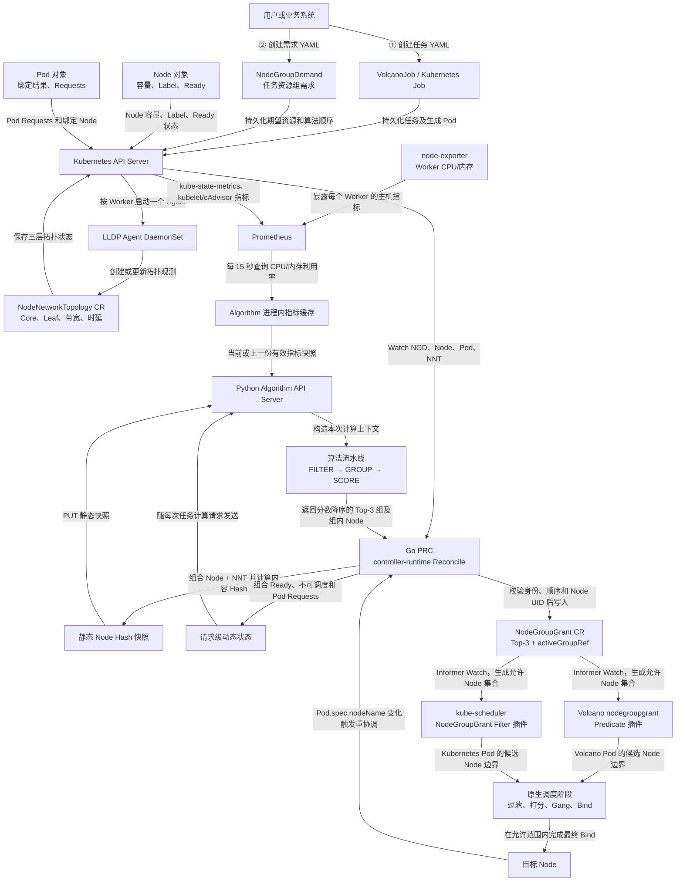
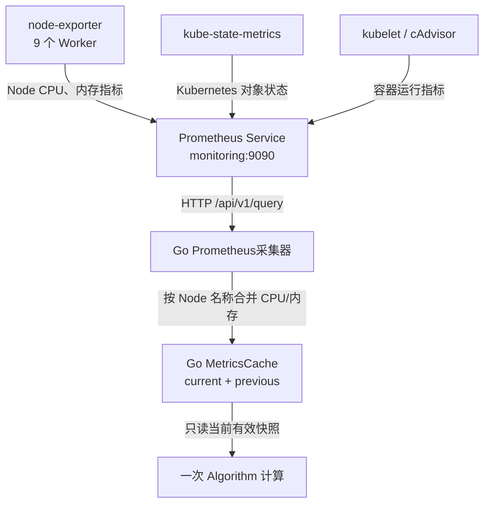
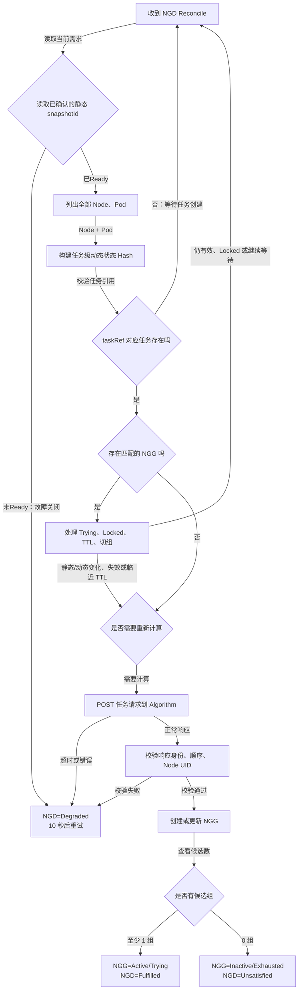
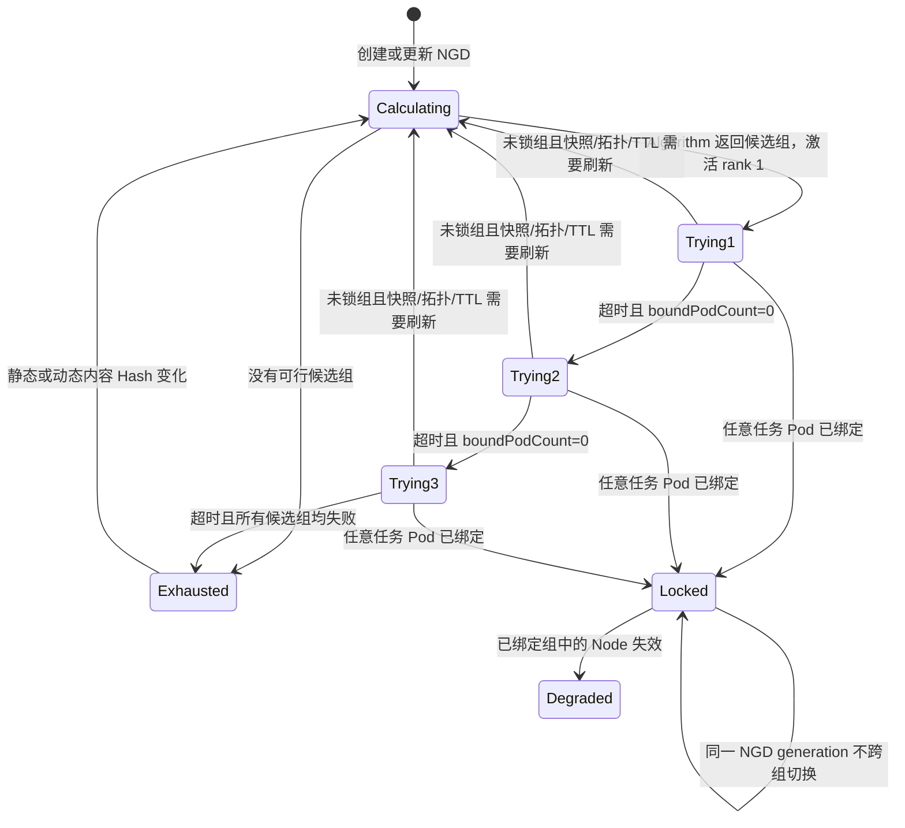
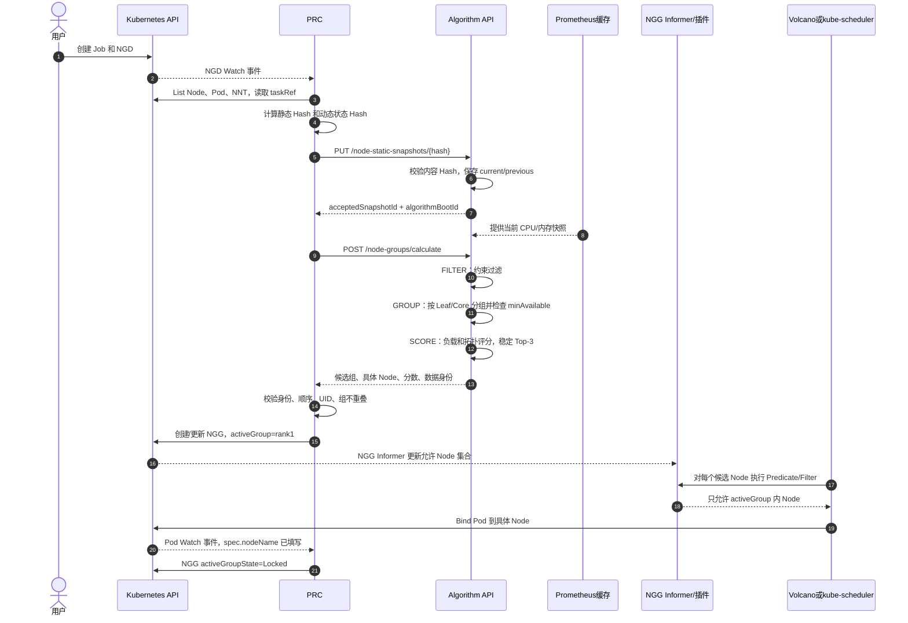

# NGD/NGG 两层调度 Demo 代码实现详细流程说明

> 本文主体记录旧 Top-3 + activeGroup Demo 链路。2026-08-19 起，Algorithm 的 Prometheus/三层拓扑/评分及 PRC 的联通正式扁平 NGG 输出已改造；差异与尚未衔接部分见 `Prometheus三层拓扑与联通正式NGG改造说明v2.1.md`。在调度插件完成正式 NGG 适配前，不应把本文旧演示结果当作新契约的全链路验证。

## 1. 文档范围

本文说明当前仓库代码如何完成一次真实的两层调度，不只描述设计目标。主流程是：

1. 用户创建任务和 `NodeGroupDemand`（NGD）；
2. PRC 从 Kubernetes 读取 Node、Pod 和网络拓扑状态；
3. PRC 把静态 Node 快照上传给 Algorithm API Server，并随任务请求发送动态状态；
4. Algorithm 执行“约束过滤 → 拓扑分组 → 负载评分”，返回最多 3 个候选节点组；
5. PRC 校验结果并生成 `NodeGroupGrant`（NGG）；
6. Volcano 或自定义 kube-scheduler 只在 NGG 当前激活组的 Node 中调度 Pod；
7. PRC 根据 Pod 绑定结果锁组、切换到下一候选组，或进入 Exhausted。

一句话概括：**第一层 Algorithm 选择并排序资源组，第二层 Volcano/kube-scheduler 在当前资源组内选择每个 Pod 的具体 Node。**

### 文档导航

- 第 2～4 章：整体架构、核心对象和代码目录；
- 第 5～6 章：从零部署、拓扑/指标来源和任务提交；
- 第 7 章：PRC Reconcile、快照和 HTTP 调用；
- 第 8 章：Algorithm 的缓存、FILTER/GROUP/SCORE 流水线；
- 第 9～10 章：NGG 写入及 Volcano/kube-scheduler 执行；
- 第 11～12 章：切组状态机和完整运行时序；
- 第 13～16 章：演示验证、实现边界、排查入口和阅读顺序。

---

## 2. 整体代码架构

下面的图按“数据从哪里来、经过谁处理、结果由谁执行”自上而下排列。每条线都标明了传递内容。



这里有两个必须区分的结果：

- Algorithm 的结果是“候选交换机组 + 每组具体 Node 列表”，不是只返回一个交换机名称；
- 每个 Pod 最终落到组内哪台 Node，由第二层调度器决定，Algorithm 不执行 Kubernetes Bind。

---

## 3. 核心对象分别保存什么

| 对象 | 创建者 | 主要内容 | 使用者 |
|---|---|---|---|
| VolcanoJob / Kubernetes Job | 用户 | Pod 模板、并行度、资源 Requests、schedulerName | Volcano / kube-scheduler |
| NGD | 用户 | taskRef、PodSet、节点约束、拓扑要求、算法顺序、候选策略 | PRC |
| NNT | LLDP Agent | Node UID、Core/Leaf Switch、端口、带宽、时延、观测时间 | PRC |
| 静态 Node 快照 | PRC | Node 名称/UID、Allocatable、Label、三层拓扑 | Algorithm 静态缓存 |
| 请求级动态状态 | PRC | Ready、Unschedulable、已绑定 Pod 的 Requests | Algorithm 单次请求 |
| Prometheus 指标快照 | Algorithm | 每个 Node 的 CPU/内存利用率及内容 Hash | `loadbalance/v1` |
| NGG | PRC | Top-3 候选组、每组 Node、唯一 activeGroupRef、TTL、数据版本 | 两个调度插件 |

### 3.1 NGD 是“任务想要什么”

CRD 位于 [`config/crd/nodegroupdemand.yaml`](../config/crd/nodegroupdemand.yaml)，演示实例位于 [`manifests/topology-demand.yaml`](../manifests/topology-demand.yaml)。关键字段为：

```yaml
spec:
  taskRef:                         # 对应哪个 VolcanoJob / Kubernetes Job
  schedulerName: volcano           # 由哪套第二层调度器执行
  podSets:                         # 副本数、minAvailable、单 Pod 资源
  nodeRequirements:                # 第一层支持的 Node Selector
  topologyRequirement:             # 当前演示要求同一 Leaf 组
  algorithms:                      # Algorithm 流水线顺序
  grantPolicy:                     # Top-3、TTL、超时切组等策略
```

NGD 不保存最终 Node，也不直接触发 Bind；它是第一层资源组计算的输入。

### 3.2 NNT 是“Node 连接在哪里”

CRD 位于 [`config/crd/nodenetworktopology.yaml`](../config/crd/nodenetworktopology.yaml)。当前 Demo 的一条 NNT 大致包含：

```yaml
spec:
  nodeRef:
    name: volcano-ngd-ngg-v2-demo-worker6
    uid: 64e2...
  collectionMode: Simulated
status:
  coreSwitchId: core-0
  switchId: switch-c
  bandwidthGbps: 25
  latencyMillis: 1
  source: SimulatedLLDP
  topologyVersion: lldp-agent-simulated-v1
```

### 3.3 NGG 是“第一层批准第二层使用什么范围”

CRD 位于 [`config/crd/nodegroupgrant.yaml`](../config/crd/nodegroupgrant.yaml)。NGG 同时保存全部候选组和唯一激活组：

```yaml
spec:
  candidateNodeGroups:
  - rank: 1
    groupId: switch-c
    groupScore: 77.05
    nodes:                       # 不只是 switch 名称
    - {name: worker6, uid: ..., score: 67}
    - {name: worker7, uid: ..., score: 68}
  - rank: 2
    groupId: switch-a
    nodes: [...]
  activeGroupRef:
    rank: 1
    groupId: switch-c
  dataVersions:
    algorithmBootId: algorithm-...
    nodeStaticSnapshotId: sha256:...
    schedulerStateSnapshotId: sha256:...
    metricSnapshotId: sha256:...
```

第二层插件只展开 `activeGroupRef` 对应组的 `nodes`，其他两个候选组暂时不可用。

---

## 4. 代码目录与职责

```text
ngd-ngg-scheduling-demo/
├── prc/
│   ├── cmd/main.go                         # PRC 进程入口
│   └── internal/controller/
│       ├── prc_controller.go               # Reconcile、NGG、切组和状态机
│       ├── snapshot.go                     # 静态/动态快照与内容 Hash
│       └── algorithm_client.go              # 调用 Algorithm HTTP API
├── algorithm_server/
│   └── python/algorithm_worker/
│       ├── app.py                           # FastAPI 路由和生命周期
│       ├── pipeline.py                      # 插件注册、顺序校验和执行
│       ├── cache/                           # 静态 Node、Prometheus 快照
│       ├── collectors/                      # Prometheus HTTP Query API
│       ├── services/                        # NodeView 和响应构造
│       └── algorithms/                      # requirement/topology/loadbalance
├── src/ngd_ngg_demo/
│   ├── lldp_agent.py                        # NNT Reconcile
│   └── lldp.py                              # 真实 LLDP 0x88CC 解析
├── plugin/nodegroupgrant/                    # Volcano Predicate 插件
├── plugin/kubescheduler/nodegroupgrant/      # kube-scheduler Filter 插件
├── config/crd/                               # NGD、NGG、NNT CRD
├── config/manager/                           # PRC、Algorithm、LLDP 部署
├── config/kubescheduler/                     # ngg-scheduler Profile 和 Deployment
├── manifests/monitoring/                     # Prometheus 监控资源
├── manifests/topology-*.yaml                 # Volcano 演示输入
├── manifests/kubernetes-*.yaml               # Kubernetes Job 演示输入
└── scripts/                                  # 构建、部署、运行和验收脚本
```

---

## 5. 从零部署时代码如何启动

顶层 [`Makefile`](../Makefile) 的完整入口是：

```text
make demo
  ├─ check                         检查工具
  ├─ test                          执行 Python 测试
  ├─ cluster                       创建 1 Control Plane + 9 Worker
  ├─ volcano                       安装 Volcano
  ├─ monitoring                    安装 Prometheus 监控
  ├─ deploy
  │   ├─ crds                      安装 CRD、RBAC、Queue，并标注拓扑
  │   ├─ lldp-agent                生成 9 个 NNT
  │   ├─ algorithm                 部署 Algorithm API Server
  │   ├─ prc                       部署 PRC
  │   ├─ plugin                    部署含 NGG 插件的 Volcano
  │   └─ kube-scheduler            部署 ngg-scheduler
  ├─ monitoring-check              验证 Prometheus → Algorithm 缓存
  ├─ run                           VolcanoJob 演示
  └─ run-kubernetes                Kubernetes Job 演示
```

使用镜像归档时运行 `make demo-prebuilt`，代码流程相同，只是不重新编译自定义镜像。

### 5.1 9 个 Worker 的模拟拓扑

[`scripts/03a-configure-topology.sh`](../scripts/03a-configure-topology.sh) 给 Worker 添加模拟信息：

| Leaf Switch | Worker 数 | 带宽 | 时延 |
|---|---:|---:|---:|
| switch-a | 3 | 20 Gbps | 1.5 ms |
| switch-b | 2 | 10 Gbps | 5 ms |
| switch-c | 4 | 25 Gbps | 1 ms |

所有 Leaf 当前都连接 `core-0`。Kind 中这些值是实验数据，不是容器自动发现的物理交换机参数。

### 5.2 LLDP Agent 如何生成 NNT

[`src/ngd_ngg_demo/lldp_agent.py`](../src/ngd_ngg_demo/lldp_agent.py) 的 `LLDPAgent.reconcile()` 执行：

1. 按 `NODE_NAME` 读取本机 Node；
2. `Simulated` 模式从 Node Label/Annotation 读取交换机和端口；
3. `LLDP` 模式调用 [`lldp.py`](../src/ngd_ngg_demo/lldp.py) 监听 EtherType `0x88CC`；
4. 创建或更新与 Node 同名的 NNT；
5. 更新 NNT Status 中的拓扑观测；
6. 每 30 秒重复一次。

当前 [`config/manager/lldp-agent.yaml`](../config/manager/lldp-agent.yaml) 使用 `Simulated`。物理集群需要应用 real patch，并提供 hostNetwork、`NET_RAW` 和正确网卡。

### 5.3 Prometheus 如何进入 Algorithm



[`metrics.go`](../algorithm_server/go/metrics.go) 由 Go 主进程启动后台刷新，默认每 15 秒执行两条 PromQL：

```promql
1 - avg by (node) (rate(node_cpu_seconds_total{mode="idle"}[5m]))
1 - (node_memory_MemAvailable_bytes / node_memory_MemTotal_bytes)
```

成功结果按 Node 名称合并并计算内容 Hash。失败时不会清空上一份成功数据，而是设置 `degraded=true`；超过 120 秒后快照被视为 stale。`requireMetrics=true` 时，未就绪或降级直接返回 HTTP 503。

---

## 6. 用户提交任务时发生什么

Volcano 路径需要两个 YAML：

- [`manifests/topology-job.yaml`](../manifests/topology-job.yaml)：创建 VolcanoJob；
- [`manifests/topology-demand.yaml`](../manifests/topology-demand.yaml)：为该任务创建 NGD。

Kubernetes 路径对应：

- [`manifests/kubernetes-job.yaml`](../manifests/kubernetes-job.yaml)；
- [`manifests/kubernetes-demand.yaml`](../manifests/kubernetes-demand.yaml)。

Job 与 NGD 通过 `spec.taskRef` 对应，Pod 与 NGD 通过 Annotation 对应：

```yaml
metadata:
  annotations:
    scheduling.demo.ngg.io/node-group-demand: topology
```

同时还要满足：

- Pod 的 `schedulerName` 与 NGD/NGG 一致；
- Pod 的直接 Owner UID 必须等于 NGG 中的任务 UID；
- 这可以防止另一个任务伪造相同 NGD 名称使用资源组。

未带上述 Annotation 的 Pod 不受 NGG 插件限制，仍按原生方式调度。

---

## 7. PRC 的完整 Reconcile 流程

PRC 入口是 [`prc/cmd/main.go`](../prc/cmd/main.go)。它创建 controller-runtime Manager、启用 Leader Election，然后注册 `NodeGroupDemandReconciler`。

### 7.1 哪些事件会触发 PRC

[`main.go`](../prc/cmd/main.go)在同一个controller-runtime Manager内注册两个控制器：

- [`NodeStaticSnapshotReconciler`](../prc/pkg/controller/static_snapshot_controller.go)：监听Node和拓扑对象，把集群级事件折叠为一个Reconcile Key，独立维护Algorithm静态缓存；
- [`NodeGroupDemandReconciler`](../prc/pkg/controller/prc_controller.go)：处理NGD、构造任务级动态状态、调用Algorithm并生成NGG。

任务Reconciler注册的事件来源包括：

- NGD generation 变化：只协调这个 NGD；
- Node 变化：把所有 NGD 重新入队；
- Pod 变化：把所有 NGD 重新入队；
- NNT 变化：把所有 NGD 重新入队。

这样 Pending、Unsatisfied、Degraded 任务能在资源或拓扑变化后重新计算。当前实现是“事件扇出到全部 NGD”，适合 Demo，但大型集群需要按任务/节点索引缩小入队范围。

### 7.2 Reconcile 主链



### 7.3 静态快照如何独立构造与同步

[`NodeStaticSnapshotReconciler`](../prc/pkg/controller/static_snapshot_controller.go)不等待NGD，Node或拓扑变化时调用[`buildStaticSnapshot()`](../prc/pkg/controller/snapshot.go)。构造逻辑优先读取Node三层拓扑Label，不完整时再用旧NNT的`spec.nodeRef.uid`建立拓扑索引，然后把每个有有效拓扑的Node转成：

```json
{
  "nodeName": "...",
  "nodeUID": "...",
  "createdAt": "...",
  "allocatable": {"cpu": "80", "memory": "131626932Ki"},
  "labels": {"demo.ngg/worker": "true"},
  "topology": {
    "coreSwitchId": "core-0",
    "switchId": "switch-c",
    "bandwidthGbps": 25,
    "latencyMillis": 1
  }
}
```

Node按UID/名称稳定排序，整体JSON规范化后计算`sha256:`内容Hash。Hash变化时通过HTTP PUT上传；Hash未变时通过状态接口核对Algorithm boot ID和缓存身份。Algorithm重启或缓存丢失会触发重新上传。已确认身份保存在共享`StaticSnapshotState`，供NGD Reconciler只读使用。

### 7.4 动态状态如何构造

[`buildSchedulerState()`](../prc/pkg/controller/snapshot.go) 对当前全部 Node 生成：

```json
{
  "nodeUID": "...",
  "ready": true,
  "unschedulable": false,
  "requestedResources": {"cpu": "580m", "memory": "490Mi"}
}
```

`requestedResources` 来自已经绑定到该 Node、且未 Succeeded/Failed 的 Pod Container Requests。动态状态也计算内容 Hash，但不上传到长期缓存，而是随本次任务请求发送。

当前 Go PRC 发送字段名仍是 `schedulerState`。Algorithm Go 主进程的 [`service.go`](../algorithm_server/go/service.go) 把它转换成请求级 `nodeUsageStates[].inUse`：

- Node 不 Ready → `inUse=true`；
- Node 被设为 Unschedulable → `inUse=true`；
- Requests 已达到声明容量 → `inUse=true`；
- 其他情况 → `inUse=false`。

这是一条兼容路径。新 `/api/v1/allocate` 已支持 PRC 直接发送 `nodeUsageStates`，但当前 Go PRC 尚未切换到该接口。

### 7.5 PRC 调用 Algorithm 的两个 HTTP 请求

独立静态Controller通过[`algorithm_client.go`](../prc/pkg/controller/algorithm_client.go)调用：

```http
PUT /internal/v1/node-static-snapshots/{sha256}
```

只有Algorithm返回相同`acceptedSnapshotId`和有效`algorithmBootId`，`StaticSnapshotState`才变为Ready。任务Reconciler随后直接读取这个身份并调用：

```http
POST /api/v1/allocate
```

请求包含完整NGD、任务/NGD身份、已确认静态Hash和本次Node动态状态。静态构造和PUT不发生在这次任务HTTP调用中；静态缓存未Ready时任务故障关闭并等待重试。

---

## 8. Algorithm API Server 内部流程

### 8.1 服务入口与缓存生命周期

[`main.go`](../algorithm_server/go/main.go) 启动 HTTP 服务、静态缓存、Prometheus 后台采集和唯一 Python Worker 子进程。Python 不启动 HTTP 服务，也不持有跨请求缓存。

主要接口：

| 接口 | 当前用途 |
|---|---|
| `GET /healthz` | 进程存活和 `algorithmBootId` |
| `GET /readyz` | HTTP 服务可接收请求；不等待快照预热 |
| `GET /internal/v1/cache/status` | 静态缓存、指标缓存和动态状态模式 |
| `GET /internal/v1/node-static-cache/status` | PRC核对Boot ID、当前静态Hash和Node数量 |
| `PUT /internal/v1/node-static-snapshots/{hash}` | PRC 上传静态 Node 快照 |
| `POST /api/v1/allocate` | 新协议入口 |
| `POST /api/v1/node-groups/calculate` | 当前 PRC 使用的兼容入口 |

静态快照缓存由 Go [`cache.go`](../algorithm_server/go/cache.go) 保存 current 和 previous 两份。它会重新计算规范化 JSON Hash，路径 Hash 与内容不一致时拒绝请求。

### 8.2 一次计算如何建立上下文

Go [`service.go`](../algorithm_server/go/service.go) 与 Python [`AlgorithmWorker.calculate()`](../algorithm_server/python/algorithm_worker/worker.py) 依次完成：

1. 校验 requestId、任务/NGD 身份和 Top-3 上限；
2. 根据 `nodeStaticSnapshotId` 解析静态缓存；
3. 读取当前 Prometheus 指标快照和 degraded 状态；
4. 规范化本次请求的 Node 动态使用状态；
5. 解析 PodSet 的 `minAvailable × resourcesPerPod`；
6. 创建 `AllocationContext`；
7. 执行可配置 Pipeline；
8. 构造包含快照身份和 Top-3 的响应。

动态状态只存在于这个 `AllocationContext`，不会写入跨请求共享缓存。

### 8.3 Pipeline 顺序校验

[`PipelineRunner`](../algorithm_server/python/algorithm_worker/pipeline.py) 默认注册三个插件：

```text
requirement/v1  →  topology/v1  →  loadbalance/v1
FILTER             GROUP           SCORE
```

流水线必须同时包含 FILTER、GROUP、SCORE，阶段不能倒序，同名/同版本插件不能重复。NGD 可以配置顺序和参数，但不能把 SCORE 放到 FILTER 前面。

### 8.4 FILTER：requirement/v1

[`RequirementAlgorithm`](../algorithm_server/python/algorithm_worker/algorithms/requirement.py) 调用 [`NodeViewBuilder`](../algorithm_server/python/algorithm_worker/services/node_view_builder.py)，依次排除：

1. `inUse=true` 的 Node；
2. 不满足 `nodeRequirements.nodeSelector` 的 Node；
3. 连一个 PodSet 的单个 Pod Requests 都放不下的 Node。

输出是本次任务可继续参与分组的 `current_nodes`。

### 8.5 GROUP：topology/v1

[`TopologyAlgorithm`](../algorithm_server/python/algorithm_worker/algorithms/topology.py) 当前使用 `NarrowestFit`：

1. 优先按 `leafSwitchId` 分组；
2. 对每个组检查能否容纳全部 PodSet 的 `minAvailable`；
3. 可选 `widestAllowedLevel=coreSwitch` 时，Leaf 均不可行才扩大到 Core；
4. 可以通过 `requiredDistinctNodes` 要求至少使用多少台不同 Node；
5. 不可容纳任务最小集合的组直接删除。

当前 Demo 只允许 CRD 中的 `leafGroup/same`，因此正常输出 `switch-a/b/c` 三个 Leaf 候选组。

### 8.6 SCORE：loadbalance/v1

[`LoadBalanceAlgorithm`](../algorithm_server/python/algorithm_worker/algorithms/loadbalance.py) 使用 [`loadbalance_profiles.json`](../algorithm_server/python/algorithm_worker/config/loadbalance_profiles.json) 的 `balanced-v1`：

```text
Node 分数 = 0.4 × 资源基础分 + 0.6 × 实时负载分
组分数   = 0.85 × 组内 Node 平均分 + 0.15 × 拓扑质量分
```

其中：

- 当前资源基础分实现为：有 Allocatable 即 100，否则 0；
- 实时负载分为：`100 × (1 - CPU/内存平均利用率)`；
- 带宽越高、时延越低，拓扑质量分越高；
- 组按 `groupScore` 降序；同分时先 Leaf、再按 groupId 稳定排序；
- 最终截断到 `maxCandidateGroups`，当前上限为 3，并重写连续 rank。

因此当前代码中的 Requests 主要承担可行性/占满判断，尚未形成精细的“剩余资源比例分”；这也是后续替换具体优化算法时最适合扩展的位置。

### 8.7 返回结果包含什么

Go [`service.go`](../algorithm_server/go/service.go) 在 Python 候选组结果外组装完整响应，返回：

- 请求、任务、NGD generation 身份；
- Algorithm 进程启动身份；
- 实际使用的静态、动态和 Prometheus 快照身份；
- `SUCCESS` 或 `UNSATISFIABLE`；
- 最多 3 个 `candidateNodeGroups`；
- 每组的 rank、groupId、groupScore；
- 每组中每个 Node 的 name、UID 和 score；
- Prometheus 是否 degraded 及 warnings。

兼容接口会把 `leaf:switch-c` 转换为当前 CRD 使用的 `switch-c`，并把 `leafSwitch` 转为 `leafGroup`。

---

## 9. PRC 如何把 Algorithm 结果写成 NGG

Algorithm 返回结果后，PRC 的 `validateResponse()` 不会改分或重新排序，而是检查：

- requestId、taskUID、ngdUID、NGD generation 完全匹配；
- Algorithm Boot ID 和静态/动态快照身份匹配；
- 候选组不超过 3 个；
- rank 必须从 1 连续递增；
- 分数必须降序，同分时 groupId 顺序稳定；
- Node UID 必须来自本次动态状态；
- 不同候选组不能包含同一个 Node UID。

`buildGrantSpec()` 随后构建 NGG：

- 保留 Algorithm 返回的组顺序、组分和 Node 分；
- 默认激活 rank 1；
- 保存 Algorithm/静态/动态/指标四类身份；
- 设置 `revision`、`generatedAt` 和 `validUntil`；
- 设置 `lockAfterFirstBind=true`。

`upsertGrant()` 创建 NGG 时把 NGD 设置为 Controller Owner，因此删除 NGD 后 Kubernetes 可以级联清理 NGG。

---

## 10. 第二层调度插件如何执行 NGG

### 10.1 共同的 Fail Closed 规则

两个插件都通过 Informer 监听 NGG，并只接受同时满足以下条件的对象：

- `status.phase=Active`；
- `activeGroupState` 为 `Trying` 或 `Locked`；
- NGG generation/revision 已被 Status 确认；
- `validUntil` 尚未过期；
- `activeGroupRef` 能解析到非空 Node 列表；
- schedulerName、任务 Owner UID 均匹配；
- Node 名称和 Node UID 同时匹配。

对于带 NGD Annotation 的受管 Pod：缓存未就绪、没有有效 NGG、Node 不在 activeGroup 等情况都拒绝调度。对于无 Annotation 的普通 Pod直接放行。

### 10.2 Volcano 路径

[`plugin/nodegroupgrant/nodegroupgrant.go`](../plugin/nodegroupgrant/nodegroupgrant.go) 被编译进 Volcano v1.15.0 的 `vc-scheduler`：

1. 后台 Dynamic Informer 缓存 NGG；
2. `OnSessionOpen()` 获取一个只读快照；
3. `AddPredicateFn()` 为本次 Session 注册过滤函数；
4. `evaluate()` 检查 Pod、任务 UID、NGG 和候选 Node；
5. 只有 activeGroup 内的 Node 能进入后续阶段；
6. Volcano 原生 Gang、Predicates、NodeOrder 和 Bind 再决定具体落点。

### 10.3 kube-scheduler 路径

[`plugin/kubescheduler/nodegroupgrant/plugin.go`](../plugin/kubescheduler/nodegroupgrant/plugin.go) 实现 Kubernetes Scheduling Framework 的 `FilterPlugin`：

1. [`cmd/ngg-scheduler/main.go`](../plugin/kubescheduler/cmd/ngg-scheduler/main.go) 把插件注册进 kube-scheduler；
2. [`config/kubescheduler/scheduler.yaml`](../config/kubescheduler/scheduler.yaml) 创建名为 `ngg-scheduler` 的 Profile；
3. `Filter()` 对每个 Pod/Node 组合执行 NGG 判断；
4. 无有效 NGG 时返回 `UnschedulableAndUnresolvable` 并记住 Pending Pod；
5. NGG Informer收到新对象或更新后调用 `handle.Activate()` 重新激活 Pending Pod；
6. 原生 Score 和 Bind 在允许 Node 范围内完成最终调度。

---

## 11. 候选组切换与锁组状态机



对应实现位于 `handleExisting()` 和 `advanceGroup()`：

1. **Trying**：已经出现任务 Pod，但尚无 Pod 绑定时开始计时；
2. **切组**：超过 `groupAttemptTimeoutSeconds` 且绑定数仍为 0，激活下一 rank；
3. **Locked**：只要任意任务 Pod 的 `spec.nodeName` 非空，立即锁定当前组；
4. **锁后不切组**：避免一部分 Pod 已在 A 组，剩余 Pod 被切到 B 组；
5. **Exhausted**：三个候选组都零绑定失败，NGG 变 `Inactive/Exhausted`，NGD 变 `Unsatisfied`；
6. **重新计算**：Node、Pod、NNT 或 NGD 变化造成内容 Hash 变化后重新调用 Algorithm；
7. **Locked 失效**：已经锁组且 Node 不可用时标记 Degraded，但不会自动跨组迁移已运行任务。

---

## 12. 一次完整任务的时序



---

## 13. 当前演示如何验证这些代码

### 13.1 Volcano 演示

[`scripts/08-run-demo.sh`](../scripts/08-run-demo.sh) 的验收逻辑是：

1. 检查 Algorithm Deployment 和 Service 可用；
2. 给预计排名第一的 switch-c 四个 Node 添加 `NoSchedule` Taint；
3. 创建 NGD 和 VolcanoJob；
4. 等待 Algorithm 返回 `switch-c → switch-a → switch-b`；
5. 保存 Top-3 分数及四类数据身份；
6. Algorithm 第一版不处理 Taint，因此仍首选 switch-c；
7. Volcano 原生 Predicate 因 Taint 拒绝 switch-c，15 秒内零绑定；
8. PRC 把 activeGroup 从 rank 1 切到 rank 2 的 switch-a；
9. 4 个 Pod 全部落入 switch-a；
10. PRC 观察到绑定并把 NGG 设为 Locked；
11. 导出 NGD、NGG、NNT、落点和日志到 `results/`。

这验证了两层边界：第一层提供有序候选范围，第二层仍保留 Kubernetes 细粒度约束的最终决定权。

### 13.2 Kubernetes Job 演示

[`scripts/09-run-kubernetes-demo.sh`](../scripts/09-run-kubernetes-demo.sh) 先创建 Job、不创建 NGD：

1. 4 个 Pod 因没有有效 NGG 全部 Pending，验证 Fail Closed；
2. 再创建 NGD；
3. PRC 和 Algorithm 生成 NGG；
4. Informer 激活 Pending Pod；
5. 4 个 Pod 只能绑定到 activeGroup 内的 Node；
6. PRC 把组状态更新为 Locked，`boundPodCount=4`。

### 13.3 主要结果文件

| 文件 | 用途 |
|---|---|
| `results/algorithm-calculation-result.txt` | Algorithm 镜像标签、Top-3、快照身份 |
| `results/generated-ngg-v2/ngg-topology.yaml` | Volcano 路径最终 NGG |
| `results/generated-ngg-v2/ngg-kubernetes.yaml` | kube-scheduler 路径最终 NGG |
| `results/topology-placement.txt` | Volcano Pod 的 Node/Switch 落点 |
| `results/kubernetes-fail-closed.txt` | 无 NGG 时 Pending 证据 |
| `results/kubernetes-placement.txt` | 有 NGG 后的 Kubernetes Pod 落点 |
| `results/algorithm-metrics-cache-status.json` | Prometheus 缓存状态和 Node 数量 |
| `results/prometheus-query-checks.txt` | Prometheus Target/Node 指标数量检查 |
| `results/prc-v2.log` | PRC 计算、切组和锁组日志 |
| `results/algorithm.log` | FastAPI 请求日志 |

---

## 14. 当前实现与目标协议之间的边界

下面这些是阅读代码时需要知道的真实现状：

1. Algorithm 的新接口是 `/api/v1/allocate`，当前 Go PRC 仍调用兼容接口 `/api/v1/node-groups/calculate`；
2. 目标协议是 PRC 直接发送 `nodeUsageStates[].inUse`，当前 PRC 仍发送 `schedulerState`，由 Algorithm 转换；
3. 动态状态不做增量同步，也不在 Algorithm 跨请求缓存，这一点已经按目标实现；
4. Prometheus 由 Algorithm 自己读取和缓存，PRC 不传 CPU/内存实时指标；
5. Taint、Toleration、Affinity、Volume、HostPort 等仍交给第二层处理；
6. 第一层当前只实现 Node Selector、粗粒度占用、PodSet 容量和三层拓扑；
7. 当前资源基础分没有按“实际剩余量”细分，有 Allocatable 即 100，主要差异来自 Prometheus 和拓扑质量；
8. PRC 的 Node/Pod/NNT 事件会重排全部 NGD，大规模集群应增加索引和限流；
9. Algorithm 使用单副本进程内缓存，多副本需要额外的一致性或请求路由设计；
10. FastAPI 内部版本为 `1.2.0`，当前容器标签仍沿用 `ngd-ngg-algorithm:v0.3.0`；标签不能单独证明代码版本，正式发布应升级镜像标签并输出 imageID/构建版本；
11. Kind 的 9 个 Worker 是同一宿主机上的容器，容量和 node-exporter 指标会非常接近，不能等同于 9 台独立物理服务器。

---

## 15. 常用排查入口

```bash
cd /mnt/data0/volcano-scheduler/ngd-ngg-scheduling-demo

# 查看任务需求和批准结果
kubectl -n ngd-ngg-demo get ngd,ngg -o wide
kubectl -n ngd-ngg-demo get ngg ngg-topology -o yaml

# 查看拓扑来源
kubectl get nodes -L topology.demo.ngg.io/switch
kubectl get nnt -o wide

# 查看第一层服务和缓存
kubectl -n ngd-ngg-system get deploy ngd-ngg-algorithm prc
make monitoring-check

# 查看第二层落点
kubectl -n ngd-ngg-demo get pods -o wide

# 重新运行两条验收路径
make run
make run-kubernetes
```

本项目的 `kubectl` 由 `scripts/common.sh` 加入 PATH。如果直接执行命令提示缺少 `kubectl`，可以先执行：

```bash
source scripts/common.sh
kube get nodes
```

---

## 16. 阅读代码的推荐顺序

第一次阅读建议按下面顺序，不容易在三个控制面之间绕乱：

1. [`manifests/topology-demand.yaml`](../manifests/topology-demand.yaml)：先理解用户输入；
2. [`prc_controller.go`](../prc/internal/controller/prc_controller.go)：理解 Reconcile 主流程和状态机；
3. [`snapshot.go`](../prc/internal/controller/snapshot.go)：理解三类数据边界；
4. [`algorithm_client.go`](../prc/internal/controller/algorithm_client.go)：理解 PRC 与 Algorithm 协议；
5. [`pipeline.py`](../algorithm_server/python/algorithm_worker/pipeline.py)：理解 Algorithm 编排；
6. `algorithms/requirement.py → topology.py → loadbalance.py`：理解具体计算；
7. [`nodegroupgrant.go`](../plugin/nodegroupgrant/nodegroupgrant.go)：理解 Volcano 如何执行 NGG；
8. [`kube-scheduler Filter`](../plugin/kubescheduler/nodegroupgrant/plugin.go)：理解 Kubernetes Job 路径；
9. [`scripts/08-run-demo.sh`](../scripts/08-run-demo.sh)：把所有组件串成一次可观察实验。
