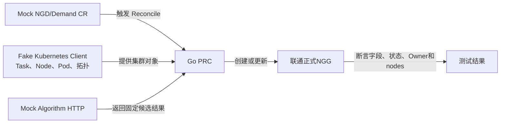
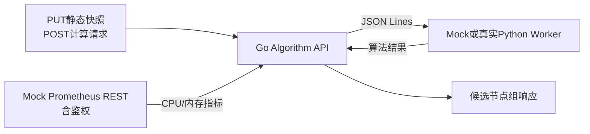
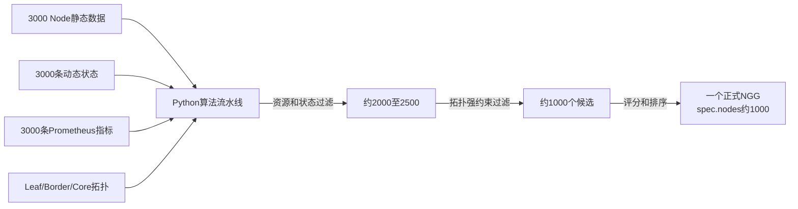

# 0818 会议要求落实分析与后续实施计划

> 整理日期：2026-08-18  
> 依据文档：`20260818_资源调度节点筛选模块开发会议纪要_详细版.md`  
> 说明：本文用于把会议要求映射到当前代码，明确下一步测试、性能验证和接口对齐工作；本文暂不修改代码。

## 1. 结论

当前项目的主体架构不需要重写：PRC 和 Algorithm 主服务使用 Go，Algorithm 由 Go 启动一个长期运行的 Python Worker，通过 stdin/stdout 上的 JSON Lines 执行具体算法。现有 Kind Demo、1000 节点模拟测试和模块单元测试已经为后续工作提供了基础。

下一阶段重点不是继续扩展功能，而是完成下面四项工作：

1. 补齐 `Demand CR → PRC Reconcile → NGG` 的完整 Controller 单元测试；
2. 将现有 Algorithm API 测试整理为会议要求的独立第二段测试；
3. 生成完整的 3000 节点模拟数据，完成正确性和性能测试；
4. 将联通提供的正式 NGD/NGG CRD 适配到 PRC、Algorithm 协议和 Volcano 插件；
5. 在动代码前确认 C2/NGG、Top1/Top3 和“1000 个候选节点”的正式接口含义。

## 2. 当前实现与会议要求对照

| 会议要求 | 当前实现 | 判断 | 后续动作 |
|---|---|---|---|
| Go 负责编排 | PRC、Algorithm HTTP 服务、缓存和 Worker 管理均为 Go | 已完成 | 保持现状 |
| Python 执行具体算法 | Python 实现 requirement、topology、loadbalance | 已完成 | 保持可配置流水线 |
| Go 启动 Python 子进程 | Go 启动一个长期运行的 Python Worker | 已完成 | 性能测试中验证进程稳定性 |
| JSON 进程通信 | stdin/stdout JSON Lines，一次请求对应一条消息 | 已完成 | 文档中统一准确表述 |
| Demand CR 到结果 CR 单元测试 | 当前主要测试辅助函数和 Algorithm Client，尚未以 fake Kubernetes client 完整执行 `Reconcile()` | 部分完成 | 新增完整 Controller 流程测试 |
| Mock 外部 API | 已有 fake Calculator、Mock Prometheus HTTP、PRC Mock Algorithm HTTP | 基本完成 | 归并为第二段独立测试入口 |
| 完整模拟静态、动态、指标和拓扑 | 1000 节点测试已经覆盖 | 已完成1000规模 | 参数化并扩展到3000节点 |
| 3000 节点性能测试 | 当前没有独立的3000节点基准测试 | 未完成 | 新增专用 Benchmark |
| Prometheus Mock 鉴权 | 当前 Mock Prometheus 未验证认证头 | 未完成 | 增加 Bearer Token 正反用例 |
| 第一版 Top1 | 当前默认最多返回 Top3，并支持降级换组 | 与会议要求不一致 | 使用配置实现 Top1，暂不删除 Top3能力 |
| NGG active/inactive | 当前已有 `status.phase`、`activeGroupState` 和 `validUntil` | 基本完成 | 对齐正式字段并补超时测试 |
| 联通正式 NGD/NGG CRD | 已收到 `paas-schedbridge-master/crd-deploy/` 中的4个文件 | 尚未适配 | 作为下一阶段P0，适配PRC和Volcano插件 |
| 测试数据交付 | 已有1000节点输入、请求和响应文件 | 部分完成 | 生成3000节点标准数据包 |

## 3. 下一阶段测试总体结构

### 3.1 测试一：Controller流程



本段验证 PRC 能否从联通正式 Demand CR 出发，正确调用后端并生成符合正式接口约定的 NGG，不需要启动真实 Algorithm 和 Kubernetes 集群。

### 3.2 测试二：Algorithm API链路



本段验证 Algorithm API Server 的 HTTP 接口、静态快照、Prometheus 指标读取、Go/Python 通信和结果返回，不依赖 Kubernetes。

### 3.3 测试三：3000节点算法与性能



本段使用完整的大规模模拟输入，验证算法正确性、稳定性和性能。三个测试相互独立，最后再用现有 Kind Demo 验证模块衔接。

## 4. 实施前必须明确的四个接口问题

### 4.1 C2 与 NGG 的关系

会议摘要中出现“生成 C2”，但联通提供的正式接口包和详细会议纪要均使用 NGD/NGG，项目中没有名为 C2 的 CRD 或 Go 类型。

当前实际流程为：

```text
NGD/Demand
  → PRC
  → Algorithm candidateNodeGroups
  → PRC生成NodeGroupGrant（NGG）
```

结合联通正式接口，建议第一版按以下方式处理：

- 如果 C2 指算法候选结果，则对应 `candidateNodeGroups`；
- 如果 C2 指最终结果 CR，则统一使用联通的 `NodeGroupGrant`；
- 如果需求方希望新增一个名为 C2 的 CR，必须先提供 Group、Version、Kind 和字段 Schema，再编写测试。

### 4.2 Top1 与当前 Top3 的关系

当前实现支持：

- Algorithm 最多返回3组；
- PRC 保存候选组顺序；
- 当前组失败且没有 Pod 绑定时切换下一组；
- 任一 Pod 绑定后锁定当前组。

详细会议纪要要求第一版 Top3 改为 Top1，联通正式 NGG 也不是候选组数组，而是一份扁平的 `spec.nodes` 列表。建议采用兼容方式：

1. 第一版 NGD 设置 `grantPolicy.maxCandidateGroups: 1`；
2. Algorithm 本轮只输出一组，PRC 将该组转换为正式 NGG 的 `spec.nodes`；
3. 保留内部最多3组的通用能力，不删除已经验证过的降级代码；
4. 联通正式接口模式不向外暴露 `candidateNodeGroups` 和 `activeGroupRef`。

这样既满足本次 Top1 验收，也不会破坏现有 Top3 Demo。

### 4.3 “3000筛到1000”是否写入NGG

当前 Demo CRD 对每个候选组设置了 `nodes.maxItems: 64`；联通正式 NGG 使用扁平的 `spec.nodes`，Schema 中没有设置节点数量上限。因此“3000筛到约1000”在联通正式接口中可以作为最终候选列表，但仍需验证 Kubernetes 对象大小和插件处理性能。

建议：

- 3000 → 约1000作为联通模式的正式筛选目标；
- PRC 将约1000个候选节点按 score 降序写入一个 NGG 的 `spec.nodes`；
- 在测试中记录完整 NGG 的 JSON/YAML 字节数、Kubernetes API 写入耗时和 Volcano 插件解析耗时；
- 性能报告记录 `inputCount=3000`、`afterRequirementCount`、`afterTopologyCount≈1000` 和最终 `spec.nodes` 数量。

如果完整对象接近 Kubernetes/etcd请求限制，应优先精简每个节点的可选展示字段，而不是未经联通确认擅自截断候选节点。

### 4.4 联通正式 CRD 与当前 Demo 的适配

联通提供的正式接口位于：

```text
docs/会议纪要-0818/paas-schedbridge-master/crd-deploy/
├── nodegroupdemand-crd.yaml
├── nodegroupdemand-cr-example.yaml
├── nodegroupgrant-crd.yaml
└── nodegroupgrant-cr-example.yaml
```

这套接口不是当前 Demo CRD 的简单改名，两者语义存在明显差异：

| 对比项 | 当前 Demo | 联通正式接口 | 适配动作 |
|---|---|---|---|
| API Group | `scheduling.demo.ngg.io` | `scheduling.platform.example.io` | PRC、RBAC、插件Informer改用正式GVK |
| Scope | Namespaced | Cluster | Reconcile不再依赖Namespace，补ClusterRole |
| NGD定位 | 任务级，带 `taskRef`、`podSets` | 资源池级，描述节点筛选和配额 | 增加正式NGD到内部算法请求的转换层 |
| NGD约束 | 任务资源、拓扑级别、算法顺序 | selector、maxNodes、quota、吞吐量、IP亲和、可达性 | 实现字段校验和过滤映射 |
| NGG节点结构 | Top3组、`activeGroupRef`、节点UID | 单个扁平 `nodes[]`，按score降序 | PRC把正式结果构造成扁平节点列表 |
| NGG时效 | `generatedAt`、`validUntil` | `timestamp`，插件配置 `expirySeconds` | 统一过期判断和配置来源 |
| 指标状态 | Active/Inactive及Trying/Locked/Exhausted | `source=normal/degraded/disabled` | 指标可用性映射到source |
| 生命周期 | Active/Inactive | Active/ReclaimRequested/Draining/Returned | MVP先实现Active，其余状态保留接口 |
| 拓扑字段 | leaf/border/core | access/convergence/dataCenter/subnet/rack/hops | 建立明确字段映射，不在插件中临时猜测 |
| 消费方式 | 按任务Owner UID查找一个NGG | Volcano读取所有有效NGG并取nodes并集 | 重写正式模式下的插件Store和过滤逻辑 |

建议增加一个正式接口适配层，不让联通 CRD 字段直接侵入 Algorithm 核心：

```text
联通 NodeGroupDemand
  → PRC Formal API Adapter
  → 内部标准 Demand/NodeRequirement
  → Algorithm API Server
  → 内部候选结果
  → PRC Formal NGG Builder
  → 联通 NodeGroupGrant
```

第一阶段适配范围：

1. 安装联通 Cluster-scoped NGD/NGG CRD；
2. PRC Watch正式 NGD并使用ClusterRole读取和写入；
3. 将 `nodeSelector`、`maxNodes`、`minThroughput`、IP亲和、`minResources` 和网络可达性转换为内部算法输入；
4. 将 Node静态、动态、Prometheus和拓扑结果转换为正式 `spec.nodes[]`；
5. 填写 `schedulerName`、`version=v1`、`timestamp`、`source` 和 `demandRef`；
6. 填写NGD的 `phase`、`grantRef`、`resolvedNodeCount`、`lastUpdated` 和 `message`；
7. Volcano插件Watch正式 NGG，校验版本、时间戳、source和phase后构建所有有效nodes的并集；
8. 对同一Node出现在多个NGG中的情况，按正式接口文档选取最高score；
9. 暂时保留当前Demo CRD和Top3路径用于回归，正式接口通过独立配置启用；
10. 完成迁移验证后，再决定是否删除旧接口。

正式接口中仍有两处需要联通确认：

- NGG说明使用 `expirySeconds` 判断过期，但该字段不在NGG CRD中；接口文档说明它是Volcano插件配置，需确认最终配置名称、默认值和ConfigMap位置；
- 联通生命周期没有 `Inactive`，指标异常建议使用 `source=degraded` 且保留 `phase=Active`。如果会议坚持增加Inactive，必须先由联通修改正式CRD枚举。

## 5. 测试一：联通正式 Demand CR 到 NGG

### 5.1 目标

不启动真实 Kubernetes、Prometheus 和 Algorithm，通过 controller-runtime fake client 完整调用 PRC `Reconcile()`，验证从联通 Cluster-scoped NGD 输入到正式 NGG 的全过程。

### 5.2 Mock 输入

- 一个 `scheduling.platform.example.io/v1alpha1` NodeGroupDemand；
- 若干带 UID、容量、资源状态和正式拓扑 Label 的 Node；
- NGD中的 `nodeSelector`、`maxNodes`、资源、吞吐量、IP亲和与网络可达性约束；
- Mock Algorithm HTTP Server；
- 固定的 Algorithm 静态快照确认和候选节点响应。

当前任务级 NGD、Kubernetes Job 和 VolcanoJob 测试继续保留为旧接口回归，但不作为联通正式接口的输入模型。

### 5.3 必须验证的正常流程

1. PRC 能以 Cluster scope 读取联通正式 NGD；
2. PRC 能读取 Node、Pod 和拓扑数据；
3. PRC 生成稳定的静态 Hash；
4. PRC 向 Mock Algorithm PUT 静态快照；
5. PRC POST 的计算请求包含正式 Demand约束、Node动态状态和算法顺序；
6. PRC 不修改 Algorithm 返回的分数和顺序；
7. PRC 创建一个 `scheduling.platform.example.io/v1alpha1` NGG；
8. NGG 使用扁平 `spec.nodes`，并按score降序排列；
9. NGG正确填写 `version=v1`、`timestamp`、`source` 和 `demandRef`；
10. NGG状态为Active，NGD状态为Fulfilled；
11. NGD的 `grantRef`、`resolvedNodeCount`、`lastUpdated` 和 `message` 正确；
12. Cluster-scoped OwnerReference和RBAC行为正确。

### 5.4 必须验证的异常流程

- NGD字段或LabelSelector非法；
- Node 没有可用拓扑；
- Algorithm 不可访问或超时；
- 静态快照没有被正确确认；
- Algorithm 返回错误的请求身份或快照 Hash；
- 候选分数顺序错误；
- 没有可行候选组；
- NGG 已存在时进行 Patch，而不是重复 Create；
- Prometheus暂时异常时保留NGG并设置 `source=degraded`，不直接删除；
- NGD被删除时按照联通正式生命周期清理对应NGG。

### 5.5 建议代码位置

```text
prc/internal/controller/reconcile_flow_test.go
```

## 6. 测试二：Mock 外部 API 到 Algorithm 返回

### 6.1 目标

独立验证 Go Algorithm API Server 的 HTTP、缓存、Prometheus 读取、Go/Python 协议和结果返回，不依赖 Kubernetes。

### 6.2 当前可复用的测试

- `algorithm_server/go/http_test.go`：PUT静态快照和POST计算请求；
- `algorithm_server/go/metrics_test.go`：Mock Prometheus和缓存状态；
- `algorithm_server/go/worker_test.go`：Go/Python JSON Lines协议；
- `prc/internal/controller/algorithm_client_test.go`：PRC侧Algorithm HTTP Client。

### 6.3 本轮需要补充

1. Mock Prometheus 要求 `Authorization: Bearer <token>`；
2. 正确 Token 返回标准 Prometheus vector；
3. 缺失或错误 Token 返回401/403；
4. 验证 Algorithm 对鉴权失败进入 degraded 或按 `requireMetrics` 返回错误；
5. 增加一个将静态快照、Prometheus和Python Worker串联起来的完整 API 测试；
6. 把第二段测试结果单独输出，便于会议演示。

## 7. 测试三：3000节点算法正确性与性能

### 7.1 数据规模

建议生成固定且可复现的数据：

| 数据 | 数量或范围 |
|---|---|
| Node | 3000 |
| Node动态状态 | 3000条完整状态，不使用增量 |
| Prometheus指标 | 每个Node一组CPU和内存指标 |
| 拓扑 | Leaf、Border、Core三级拓扑 |
| 初次资源过滤后 | 约2000～2500个Node |
| 拓扑过滤后 | 约1000个最终候选Node |
| 正式输出 | 一个联通正式NGG，`spec.nodes`约1000条并按score降序 |

数据生成必须使用固定随机种子，保证不同机器和不同运行次数得到相同输入和预期结果。

### 7.2 正确性检查

- 资源不足、不可调度、NotReady和已占用节点必须被排除；
- 拓扑不满足 Demand 的节点必须被排除；
- Prometheus指标能正确参与评分；
- 分数相同时排序稳定；
- 返回结果不包含未知 Node、重复 Node 或不可用 Node；
- 多次使用相同输入时结果完全一致；
- Node 动态状态发生变化后结果能够变化；
- Algorithm 不修改输入数据。

### 7.3 性能测量边界

必须分别记录：

1. Python纯算法计算耗时；
2. Go JSON编码耗时；
3. Go → Python写入和Python JSON解码耗时；
4. Python → Go返回耗时；
5. HTTP `POST /calculate` 端到端耗时；
6. 静态快照 PUT 耗时；
7. NGG 构造和写入耗时；
8. 单请求和并发请求排队时间。

正式的“算法筛选时间”采用第1项，不把容器启动、Prometheus预热、静态快照上传和测试数据生成时间混入算法耗时。

### 7.4 执行方法

- 预热5次；
- 正式执行至少30次；
- 输出 min、mean、P50、P95、P99、max；
- 记录输入和输出JSON字节数；
- 记录 Go 与 Python 峰值RSS；
- 记录每个流水线阶段的输入/输出节点数；
- 增加10个并发请求测试，记录单Worker串行排队影响；
- 在固定服务器、固定镜像和固定CPU/内存限制下执行。

### 7.5 验收目标

按照会议纪要：

- 优先目标：纯算法计算约500 ms以内；
- 复杂情况：纯算法计算1 s以内可接受；
- 结果必须正确且稳定；
- 完整请求必须小于 Algorithm HTTP 的32 MiB限制；
- Go → Python单条消息必须小于当前 Scanner 的32 MiB限制；
- Algorithm响应必须小于 PRC Client 的4 MiB读取限制；
- 完整端到端耗时单独报告，不与纯算法时间混淆。

### 7.6 性能优化顺序

先测量再优化，建议按照以下顺序定位：

1. 是否存在重复遍历或嵌套线性扫描；
2. 是否可以先用强约束缩小候选集；
3. Node、UID和拓扑是否建立 O(1) 索引；
4. Go/Python JSON编码、复制和传输占比；
5. Python算法自身计算占比；
6. 单Python Worker互斥串行造成的排队时间；
7. 是否需要让Python按静态Hash缓存，或由Go发送更小的任务级节点视图。

## 8. 关于“JSON避免内存冗余”的准确说明

当前设计避免了多个独立算法服务各自长期保存一份完整缓存，但 JSON 通信本身不会消除所有内存复制。

一次计算期间可能同时存在：

```text
Go中的静态/动态对象
  + Go序列化后的JSON字节
  + Python反序列化后的对象
```

因此建议在正式材料中表述为：

> Go统一持有静态快照和Prometheus缓存，Python Worker不维护跨请求共享缓存；Go与长期运行的单一Python Worker通过stdin/stdout JSON Lines交互，减少多算法服务长期缓存多份数据的问题。请求处理期间仍存在必要的序列化临时副本，其成本由3000节点性能测试评估。

需要特别强调：3000节点JSON不能放进命令行参数中，否则可能受到操作系统 `ARG_MAX` 限制；当前使用标准输入/输出管道是正确做法。

## 9. NGG状态与超时

当前 Demo 实现已经具备：

- `status.phase=Active/Inactive`；
- `activeGroupState=Trying/Locked/Exhausted`；
- `conditions[].lastTransitionTime`；
- `spec.generatedAt`；
- `spec.validUntil`；
- NGD `lastReconcileTime` 和 `nextRetryAt`。

联通正式接口使用另一套状态语义：

- `spec.timestamp` 表示本次数据快照时间；
- `spec.source=normal/degraded/disabled` 表示指标可信度；
- `status.phase=Active/ReclaimRequested/Draining/Returned` 表示资源池生命周期；
- Volcano插件通过外部 `expirySeconds` 配置判断数据是否过期。

本轮主要补充测试和接口对齐：

1. 以联通提供的正式NGG CRD为接口基准；
2. 明确插件 `expirySeconds` 的配置名称、默认值和ConfigMap位置；
3. 验证超过时效阈值后插件拒绝使用该NGG；
4. 验证外部指标短暂失败时保留NGG并设置 `source=degraded`；
5. 指标恢复后通过Patch恢复为 `source=normal`；
6. 调度插件只接受版本匹配、未过期、phase=Active的NGG；
7. 仅在NGD真正删除时按正式生命周期删除对应NGG。

## 10. 3000节点测试数据交付结构

建议生成以下目录：

```text
results/algorithm-3000-nodes/
├── node-static-snapshot.json
├── topology.json
├── prometheus-metrics.json
├── node-dynamic-state.json
├── demand.json
├── allocation-request.json
├── allocation-response.json
├── formal-nodegroupgrant.yaml
├── stage-counts.json
├── benchmark-raw.json
├── benchmark-summary.json
└── README.md
```

| 文件 | 含义 |
|---|---|
| `node-static-snapshot.json` | 3000个Node的UID、资源、Label和拓扑，以及内容Hash |
| `topology.json` | Leaf、Border、Core与Node的可读关系 |
| `prometheus-metrics.json` | 3000个Node的CPU/内存模拟指标 |
| `node-dynamic-state.json` | 3000条请求级动态状态 |
| `demand.json` | 本次筛选需求和算法顺序 |
| `allocation-request.json` | 实际发送给Algorithm的完整请求 |
| `allocation-response.json` | 排序后的候选节点结果和数据版本 |
| `formal-nodegroupgrant.yaml` | PRC按联通正式CRD生成的约1000节点NGG |
| `stage-counts.json` | 3000、资源过滤后、拓扑过滤后和最终组的节点数量 |
| `benchmark-raw.json` | 每轮各阶段原始耗时和内存数据 |
| `benchmark-summary.json` | P50、P95、P99、最大值和验收结论 |
| `README.md` | Schema、随机种子、生成方式、执行命令和预期输出 |

交给后续人员的数据必须同时包含生成器、固定随机种子和字段说明，不能只提供一批无法复现来源的JSON。

## 11. 计划修改的代码和文档

| 位置 | 计划内容 |
|---|---|
| `config/crd/` | 纳入联通正式Cluster-scoped NGD/NGG CRD并补版本说明 |
| `prc/internal/formalapi/` | 联通NGD到内部请求、内部结果到正式NGG的适配层 |
| `prc/internal/controller/reconcile_flow_test.go` | 联通Demand到正式NGG的完整fake client测试 |
| `deploy/rbac/` | PRC和插件访问Cluster-scoped NGD/NGG的ClusterRole权限 |
| `plugin/nodegroupgrant/` | Watch正式NGG、合并nodes、版本/时效/source/phase校验 |
| `algorithm_server/go/metrics_test.go` | Prometheus鉴权及错误场景 |
| `algorithm_server/go/http_test.go` | 完整PUT+POST API链路测试 |
| `tests/test_algorithm_3000_nodes.py` | 3000节点算法正确性测试 |
| `algorithm_server/performance/` | 可复现数据生成器和性能驱动 |
| `scripts/` | 三段测试和性能测试统一入口 |
| `Makefile` | 增加分段测试及3000节点Benchmark命令 |
| `results/algorithm-3000-nodes/` | 输入、输出和性能证据 |
| `docs/` | 测试说明与性能报告 |

建议最终提供以下命令：

```bash
make test-demand-flow
make test-algorithm-api
make test-algorithm-core
make benchmark-algorithm-3000
make unit-test-all
```

## 12. 验收清单

### 12.1 三段测试

- [ ] 联通正式Demand CR可以通过fake client完整驱动PRC Reconcile；
- [ ] PRC能够生成符合联通正式Schema的Cluster-scoped NGG；
- [ ] NGG `spec.nodes`可保存并稳定排序约1000个候选节点；
- [ ] Algorithm API可以在Mock Prometheus和Python Worker下独立运行；
- [ ] Prometheus Mock认证成功和失败路径均被覆盖；
- [ ] 3000节点静态、动态、指标和拓扑数据完整；
- [ ] 3000节点算法结果正确、稳定且可复现；
- [ ] 所有测试输出Pass/Fail和日志。

### 12.2 性能

- [ ] 记录纯算法时间，不混入服务启动和数据生成；
- [ ] 至少完成5次预热和30次正式测量；
- [ ] 输出P50、P95、P99和最大值；
- [ ] 输出每阶段候选节点数量；
- [ ] 纯算法优先不超过500 ms，复杂情况不超过1 s；
- [ ] 请求、Worker消息和响应均未超过大小限制；
- [ ] 记录单请求及并发排队结果；
- [ ] 形成独立性能测试Markdown报告。

### 12.3 接口与状态

- [ ] C2和NGG术语已统一；
- [x] 已获得联通正式NGD/NGG CRD；
- [ ] PRC、RBAC和Volcano插件已完成正式CRD适配；
- [ ] 正式模式输出一个扁平NGG，同时不破坏现有Top3 Demo；
- [ ] “约1000候选”作为正式 `spec.nodes` 输出并通过对象大小测试；
- [ ] `timestamp/expirySeconds`、`source`和生命周期phase语义明确；
- [ ] 外部指标异常时保留NGG并切换为degraded；
- [ ] 插件能够合并多个有效NGG，重复Node取最高score。

## 13. 时间安排

| 日期 | 工作 |
|---|---|
| 8月18日 | 完成联通正式CRD差异分析；确认C2/NGG、时效配置和1000候选口径 |
| 8月19日 | 完成正式CRD适配层及Demand到NGG的Controller单元测试；补Prometheus Mock鉴权 |
| 8月20日 | 完成3000节点数据、正确性测试和第一轮性能测试 |
| 8月21日 | 完成Volcano插件正式NGG适配，根据性能数据优化并全量回归 |

## 14. 最终交付物

本轮应形成以下可验收成果：

1. 联通正式NGD → PRC → 正式NGG完整单元测试；
2. Mock Prometheus → Go Algorithm → Python Worker → 结果的API测试；
3. 3000节点算法正确性测试；
4. 3000节点性能测试及原始数据；
5. 3000节点模拟数据交付包；
6. 单元测试结果Markdown；
7. 性能测试结果Markdown；
8. 联通NGD/NGG与当前Demo接口对照说明；
9. 适配联通正式NGG的Volcano插件及测试。

完成以上内容后，再使用现有Kind Demo作为最终衔接验证。当前阶段的主要交付边界仍然是生成符合约定的NGG；Volcano或kube-scheduler后续Pod Bind不作为本轮性能验收重点。
