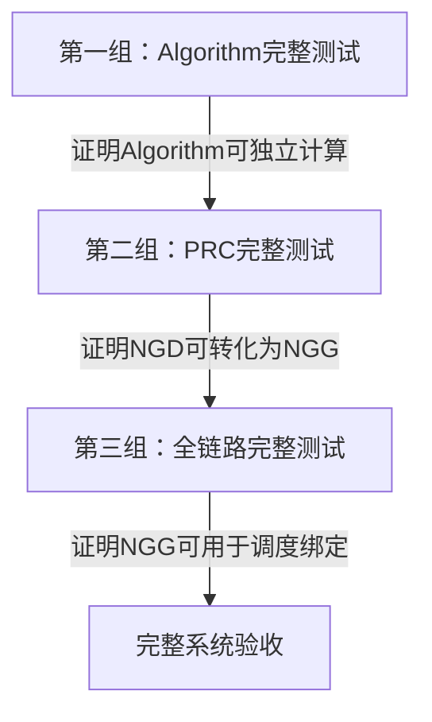
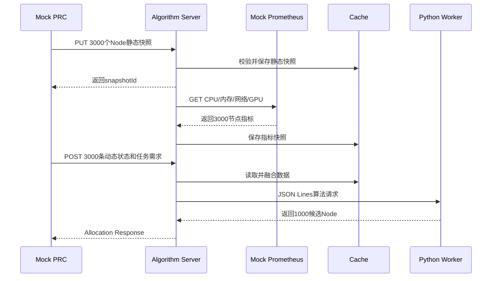
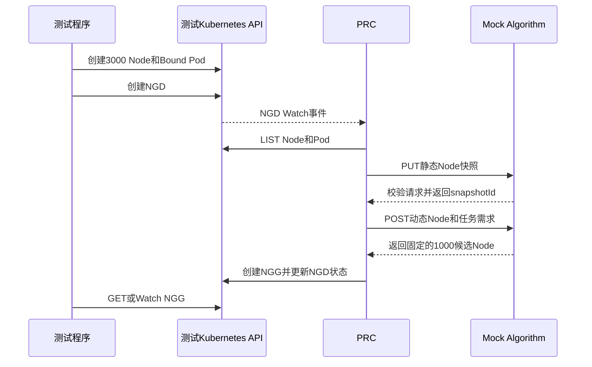
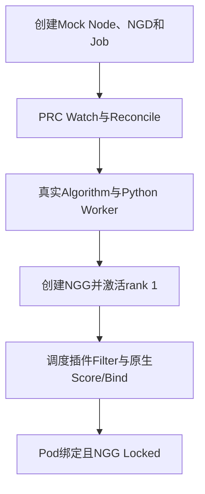

# NGD-NGG 三大测试组与全链路分阶段测试设计

## 1. 文档目的

本文定义 Kubernetes/Volcano NGD-NGG 两层调度项目的测试方案。测试保持三个大组：

1. Algorithm 完整测试；
2. PRC 完整测试；
3. 全链路完整测试。

每个大组都必须能够独立启动、独立运行并输出明确的最终结果。静态快照、Prometheus 指标采集、数据融合、Go 与 Python 进程通信、算法流水线、NGG 生成和调度绑定等内容，不再作为与三大组并列的测试，而是作为各大组内部的子阶段。

每个子阶段必须至少记录：

- 阶段名称；
- 请求或触发方式；
- 输入数据及数量；
- 输出数据及数量；
- 开始时间和结束时间；
- 阶段耗时；
- 成功或失败状态；
- 失败原因。

## 2. 测试边界与统一原则

### 2.1 三个大组采用不同的 Mock 边界

三个大测试组需要分别隔离被测组件，因此Mock对象不完全相同：

| 大测试组 | Mock内容 | 真实运行内容 |
| --- | --- | --- |
| Algorithm完整测试 | Mock PRC、Mock Prometheus | Algorithm Server、缓存、Prometheus Client、Python Worker、算法流水线 |
| PRC完整测试 | Kubernetes API中的Mock Node/Pod、Mock Algorithm HTTP Server | Kubernetes测试API、PRC Manager、NGG读写 |
| 全链路完整测试 | Kubernetes API中的Mock Node/Pod、Mock Prometheus | PRC、Algorithm、Python Worker、NGG、调度插件和调度器 |

只有第三大组将PRC、Algorithm和后续链路全部连接起来。第二大组只验证PRC，不启动Prometheus、真实Algorithm Server或Python Worker。

其中，Mock Node 环境统一承载以下内容：

- Node 名称和 UID；
- CPU、内存和 GPU 等静态可分配资源；
- Node Ready 等运行状态；
- 已绑定 Pod 和已分配资源；
- `inUse` 或剩余资源等动态状态；
- Datacenter、ServerRoom、Core、Border、Leaf 等拓扑 Label/Annotation；
- 静态带宽和静态时延等网络属性。

拓扑采集组件本身不在本测试方案中单独模拟。拓扑采集后的结果直接作为 Mock Node 的 Label 和 Annotation 提供。

三个大测试组采用两种不同的 Node 模拟方式：

| 大测试组 | Node 模拟方式 |
| --- | --- |
| Algorithm 完整测试 | Mock PRC直接构造3000个Node静态快照和3000条Node动态状态，通过真实HTTP PUT/POST调用Algorithm；不启动Kubernetes API Server |
| PRC 完整测试 | 通过envtest Kubernetes API Server创建Node、更新Node Status、创建Bound Pod，由真实PRC List/Watch读取；Algorithm使用HTTP Mock Server |
| 全链路完整测试 | 通过Kind中的真实Kubernetes API Server创建Node、更新Node Status、创建Job/Pod，由真实PRC和调度器读取 |

PRC完整测试和全链路测试中的 Node 数据使用以下 Kubernetes 对象和字段模拟：

| 数据类型 | Kubernetes 对象和字段 | 模拟方式 |
| --- | --- | --- |
| Node 基本信息 | `metadata.name`、`metadata.uid`、Label、Annotation | Kubernetes CREATE Node |
| Node 静态资源 | `status.capacity`、`status.allocatable` | Kubernetes Status Update/Patch |
| Node 运行状态 | `status.conditions` | Kubernetes Status Update/Patch |
| Node 拓扑 | Label、Annotation | Kubernetes CREATE/PATCH Node |
| Node 动态占用 | Pod `spec.nodeName`、Container Resources、Pod Phase | Kubernetes CREATE/UPDATE Pod |
| 已绑定 Pod 数量 | 按 `spec.nodeName` 聚合 Pod | 通过 Kubernetes LIST/Watch 计算 |
| 剩余 CPU/内存/GPU | Allocatable 减去 Bound Pod Requests | 通过 Kubernetes LIST/Watch 计算 |

测试数据文件的使用规则如下：

- 第一大组的测试数据由Mock PRC读取并组装为正式Algorithm协议，只能通过HTTP PUT/POST发送给Algorithm，不能直接写Algorithm缓存；
- 第二大组使用 `controller-runtime envtest` 启动本地 Kubernetes API Server 和 etcd；
- 第三大组使用 Kind 中的真实 Kubernetes API Server；
- 第二、第三大组由真实 PRC 通过 List/Watch 读取 Node、Pod。

### 2.2 Algorithm测试中的Mock PRC

Mock PRC不是一个完整Controller，也不访问Kubernetes。它是Algorithm完整测试的请求驱动器，负责模拟真实PRC的两个HTTP调用：

```text
Mock PRC
├─ PUT 3000个Node静态快照
└─ POST 3000条Node动态状态、NGD解析结果和算法配置
```

Mock PRC必须：

- 使用与正式PRC相同的请求结构；
- 生成并传递`requestId`、`staticSnapshotId`和Node UID；
- 在PUT请求中提供Node静态资源、Label和拓扑；
- 在POST请求中提供Node动态状态、占用资源、剩余资源和任务需求；
- 记录每次请求的输入数量、响应数量和往返耗时；
- 只通过Algorithm公开HTTP接口交互，不直接调用Service或Cache内部函数。

### 2.3 Mock Prometheus 必须是真实 HTTP 服务

Mock Prometheus 不能只是一份被 Algorithm 直接读取的 JSON 文件，而必须启动一个真实 HTTP Mock Server。Algorithm Server 使用正式 Prometheus Client，通过真实 HTTP 请求查询：

Mock Prometheus只用于第一大组Algorithm完整测试和第三大组全链路完整测试，第二大组PRC完整测试不启动Prometheus。

```http
GET /api/v1/query?query=<PromQL>
Authorization: Bearer test-token
```

Mock Prometheus 按 Prometheus HTTP API 标准格式返回 JSON。这样可以验证：

- 请求方法和路径；
- PromQL 参数；
- Bearer Token 等认证信息；
- HTTP 超时和错误处理；
- Prometheus Vector 解析；
- 指标与 Node 的匹配；
- 指标缓存更新。

### 2.4 必须通过真实请求驱动

测试不能只调用内部函数并直接向缓存写数据。组件之间存在协议边界时，必须通过真实协议调用：

| 调用边界 | 测试方式 |
| --- | --- |
| 测试客户端 → Algorithm | HTTP PUT、HTTP POST |
| Algorithm → Prometheus | HTTP GET |
| Go Algorithm → Python Worker | stdin/stdout JSON Lines |
| 测试客户端 → Kubernetes | Kubernetes REST API |
| Kubernetes → PRC | Watch 事件和 Work Queue |
| PRC → Algorithm | HTTP PUT、HTTP POST |
| PRC → Kubernetes | CREATE、UPDATE、PATCH NGG |
| 调度插件 → Kubernetes | Informer/List/Watch NGG |
| 调度器 → Node | Filter、Score、Bind |

内部算法函数仍然可以保留细粒度单元测试，但不能替代本文定义的三个完整测试组。

### 2.5 Prometheus 为周期采集，不由任务触发

Algorithm Server 按固定周期，例如每 30 秒，主动查询 Prometheus 并更新内存指标快照。任务到达时读取最近一份有效指标快照，不应在收到 NGD 或计算请求后临时查询 Prometheus。

因此测试报告需要区分：

- **环境准备耗时**：启动 Mock Server、创建 Mock Node、启动组件；
- **指标刷新耗时**：Prometheus 查询、解析、匹配和缓存；
- **业务链路耗时**：任务请求到达后，直到产生最终结果。

指标刷新耗时单独报告，不计入单次任务算法的关键路径耗时。

## 3. 三大测试组总体关系



| 大测试组 | 完整输入 | 真实运行范围 | 最终输出 |
| --- | --- | --- | --- |
| 第一组：Algorithm 完整测试 | Mock PRC提供的Node静态/动态数据、Mock Prometheus、任务计算请求 | Go Algorithm、缓存、Prometheus Client、Python Worker、算法流水线 | Allocation Response |
| 第二组：PRC 完整测试 | Kubernetes API中的Mock Node/Pod、Mock Algorithm响应、NGD | Kubernetes 测试 API、PRC Manager、NGG读写 | NGG |
| 第三组：全链路完整测试 | Kubernetes API中的Mock Node/Pod、Mock Prometheus、NGD、Job/Pod | Kubernetes、PRC、Algorithm、NGG、调度插件、调度器 | Pod Bind、NGG Locked |

## 4. 公共测试数据

### 4.1 Node 规模

测试场景默认使用：

```text
Mock Node总数：3000
Algorithm最终候选Node：1000
```

测试数据必须是确定性的。可以使用固定随机种子生成，但不能在每次运行时产生不同的预期结果。

### 4.2 Mock Node 静态数据

不同测试组中的静态数据来源如下：

- Algorithm完整测试：由Mock PRC直接构造下面的正式静态快照协议，并通过HTTP PUT发送；
- PRC完整测试和全链路测试：先通过Kubernetes API创建标准Node对象，再由真实PRC读取并转换为同一静态快照协议。

下面的JSON表示发送给Algorithm的Node静态快照内容。

每个 Node 至少包含：

```json
{
  "nodeName": "worker-0001",
  "nodeUID": "uid-0001",
  "allocatable": {
    "cpu": "32",
    "memory": "128Gi",
    "nvidia.com/gpu": "4"
  },
  "labels": {
    "demo.ngg/worker": "true"
  },
  "topology": {
    "datacenter": "dc-01",
    "serverRoom": "room-01",
    "core": "core-01",
    "border": "border-01",
    "leaf": "leaf-001",
    "bandwidthGbps": 100,
    "latencyMs": 0.8
  }
}
```

### 4.3 Mock Node 动态数据

不同测试组中的动态数据来源如下：

- Algorithm完整测试：Mock PRC直接构造3000条Node动态状态，并通过HTTP POST计算请求发送；
- PRC完整测试和全链路测试：测试程序通过Kubernetes API创建带`spec.nodeName`和资源Requests的Bound Pod，并更新Node Condition，再由真实PRC List/Watch Node、Pod并计算动态状态。

下面的 JSON 表示最终发送给 Algorithm 的动态状态协议。

```json
{
  "nodeName": "worker-0001",
  "nodeUID": "uid-0001",
  "ready": true,
  "inUse": false,
  "allocated": {
    "cpu": "12",
    "memory": "40Gi",
    "nvidia.com/gpu": "1"
  },
  "remaining": {
    "cpu": "20",
    "memory": "88Gi",
    "nvidia.com/gpu": "3"
  },
  "boundPodCount": 7
}
```

### 4.4 Mock Prometheus 指标

第一版建议至少覆盖以下指标：

| 分类 | 指标 |
| --- | --- |
| CPU | 当前使用率、5 分钟平均值、30 分钟平均值、30 分钟 P95、Load 1/5/15 |
| 内存 | 当前使用率、可用字节数、5 分钟平均值、30 分钟平均值、30 分钟 P95、Swap 使用率 |
| 网络 | RX、TX、RX/TX P95、接收/发送 Drop、接收/发送 Error、RTT、探测成功率 |
| GPU | GPU 使用率、显存使用率、温度、设备错误状态 |
| Node | Ready、MemoryPressure、DiskPressure、PIDPressure |

其中：

- Node Exporter 提供 CPU、内存、网络吞吐、Drop 和 Error；
- RTT、探测成功率可由 Blackbox Exporter 或自定义 Exporter 提供；
- GPU 指标可由 DCGM Exporter 提供；
- 静态额定带宽和基础时延仍来自 Node 拓扑属性。

## 5. 第一大组：Algorithm 完整测试

### 5.1 测试目标

在不启动PRC和Kubernetes的情况下，由Mock PRC通过真实HTTP请求提供Node静态、动态数据，并完整验证Algorithm Server：

```text
接收静态Node
→ 周期查询Prometheus
→ 接收动态Node和任务需求
→ 融合数据
→ 调用Python Worker
→ 执行Topology/Requirement/LoadBalance
→ 返回候选节点
```

### 5.2 Mock 与真实组件

| 类型 | 内容 |
| --- | --- |
| Mock | PRC调用方、PRC提供的Node静态数据、Node动态数据、Prometheus |
| 真实 | Go HTTP Server、静态缓存、指标缓存、Prometheus Client、Python Worker、算法流水线 |

Mock PRC只模拟正式PRC对Algorithm的调用行为，不模拟PRC的Watch、Reconcile和NGG写入逻辑。它通过正式请求结构向Algorithm发送3000个Node的静态快照和动态状态。

### 5.3 完整请求流程



### 5.4 组内子阶段

| 阶段 | 请求或触发 | 输入 | 输出 | 计时范围 |
| ---: | --- | --- | --- | --- |
| A1 | 启动 Mock Prometheus | 3000 Node 指标 | Prometheus HTTP Ready | 启动到健康检查通过 |
| A2 | 启动 Algorithm | 配置、Prometheus 地址、Worker 命令 | HTTP Ready、Worker Ready | 进程启动到全部 Ready |
| A3 | Mock PRC构造静态请求 | 3000 Node静态资源、Label、拓扑 | Static Snapshot PUT请求 | 数据生成和请求序列化 |
| A4 | HTTP PUT | 3000 Node静态快照 | Algorithm收到请求 | HTTP请求完整往返 |
| A5 | 快照接口处理 | PUT请求体 | 3000 Node静态快照、snapshotId、Hash | HTTP读取、校验、Hash、缓存写入 |
| A6 | HTTP GET Prometheus | 多类PromQL | 多组Prometheus Vector | 每条请求发出到响应接收 |
| A7 | 指标处理 | Prometheus Vector | 3000 Node指标快照 | 解析、匹配、合并、缓存 |
| A8 | Mock PRC构造计算请求 | 3000条动态状态、任务需求、snapshotId | Allocation POST请求 | 数据生成和请求序列化 |
| A9 | HTTP POST | Allocation请求 | Algorithm收到请求 | HTTP请求发出到Server接收 |
| A10 | 请求校验 | 静态、动态、指标各3000条 | 3000条合法匹配数据 | 校验和版本对齐 |
| A11 | 数据融合 | 三类Node数据 | 3000个NodeView | Node匹配、剩余资源计算、上下文构造 |
| A12 | JSON Lines写入 | 3000个NodeView | Python请求JSON | Go序列化和stdin写入 |
| A13 | Topology | 3000个Node | 拓扑过滤和分组结果 | Topology开始到结束 |
| A14 | Requirement | Topology输出 | 资源和状态过滤结果 | Requirement开始到结束 |
| A15 | LoadBalance | Requirement输出 | 1000个候选Node | Score、排序、截取 |
| A16 | JSON Lines读取 | Python响应 | Go内部候选结果 | stdout读取和解析 |
| A17 | HTTP Response | Go候选结果 | Allocation Response | 响应构造、序列化和返回 |

### 5.5 Algorithm 阶段结果示例

```json
{
  "testGroup": "algorithm-complete",
  "status": "PASS",
  "stages": [
    {
      "name": "static-snapshot-put",
      "input": {"nodes": 3000},
      "output": {"cachedNodes": 3000, "snapshotId": "static-001"},
      "durationMs": 62
    },
    {
      "name": "prometheus-refresh",
      "input": {"queries": 15, "expectedNodes": 3000},
      "output": {"metricNodes": 3000, "missingNodes": 0},
      "durationMs": 203
    },
    {
      "name": "node-view-build",
      "input": {
        "staticNodes": 3000,
        "dynamicNodes": 3000,
        "metricNodes": 3000
      },
      "output": {"nodeViews": 3000},
      "durationMs": 53
    },
    {
      "name": "topology",
      "input": {"nodes": 3000},
      "output": {"nodes": 1800},
      "durationMs": 81
    },
    {
      "name": "requirement",
      "input": {"nodes": 1800},
      "output": {"nodes": 1200},
      "durationMs": 104
    },
    {
      "name": "loadbalance",
      "input": {"nodes": 1200},
      "output": {"nodes": 1000},
      "durationMs": 148
    }
  ],
  "finalOutput": {
    "candidateGroups": 3,
    "candidateNodes": 1000
  },
  "timing": {
    "environmentPreparationMs": 265,
    "metricRefreshMs": 203,
    "allocationRequestMs": 416
  }
}
```

示例中的 `3000 → 1800 → 1200 → 1000` 仅用于说明阶段化输出。正式测试应根据确定的测试数据生成对应的固定期望值。

### 5.6 通过条件

- Algorithm HTTP Server 和 Python Worker 成功启动；
- Mock PRC提供3000个Node的静态、动态和拓扑数据；
- Mock PRC使用与正式PRC相同的HTTP请求结构；
- 静态Node通过真实PUT请求进入Algorithm；
- 动态Node和任务需求通过真实POST请求进入Algorithm；
- Algorithm 通过真实 GET 请求查询 Mock Prometheus；
- Prometheus 请求包含正确认证信息；
- 动态 Node 和任务需求通过真实 POST 请求进入系统；
- 静态、动态、指标数据正确融合；
- Python Worker 实际执行算法；
- 最终返回预期的候选组和 1000 个候选 Node；
- 每个阶段均记录输入、输出和耗时；
- 单次 Allocation 业务处理目标为 500 ms 以内，第一阶段可接受 1 秒以内。

## 6. 第二大组：PRC 完整测试

### 6.1 测试目标

在不启动Prometheus、真实Algorithm Server和Python Worker的情况下，验证PRC能否独立完成：

```text
接收NGD
→ 读取Node和Pod
→ 构造静态、动态数据
→ HTTP调用Mock Algorithm
→ 接收Mock候选结果
→ 创建NGG
```

Mock Algorithm只替代PRC的下游依赖。PRC的Watch、Reconcile、Node/Pod读取、请求构造、HTTP Client、响应校验和NGG写入全部使用真实代码。

### 6.2 Mock 与真实组件

| 类型 | 内容 |
| --- | --- |
| Mock | Kubernetes API中的Node/Pod、Algorithm HTTP Server及其固定响应 |
| 真实 | Kubernetes测试API、PRC Manager、Informer/Cache、Algorithm HTTP Client、NGG读写 |

本组使用`controller-runtime envtest`启动本地Kubernetes API Server和etcd，安装NGD、NGG CRD，并启动真实PRC Manager。测试程序通过Kubernetes API创建Node、Pod和NGD，不直接调用PRC内部函数。

Mock Algorithm使用真实HTTP Mock Server，并实现PRC会调用的两个接口：

```text
PUT  /api/v1/node-snapshots/{snapshotId}
POST /api/v1/allocations
```

Mock Algorithm需要记录并校验每次请求，再返回固定的预期响应。它不查询Prometheus、不启动Python Worker，也不执行真实算法。

### 6.3 完整请求流程



### 6.4 Mock Algorithm设计

Mock Algorithm必须检查：

- PRC是否先发送PUT静态快照，再发送POST计算请求；
- PUT请求是否包含3000个Node的名称、UID、静态资源、Label和拓扑；
- POST请求是否包含3000条动态状态、NGD解析结果、算法顺序和快照ID；
- PUT和POST的`requestId`、`snapshotId`是否能够关联；
- 请求方法、路径、Content-Type和超时配置是否正确；
- Node数量、UID和动态状态是否符合固定测试数据。

Mock Algorithm固定返回：

```json
{
  "requestId": "prc-test-001",
  "staticSnapshotId": "static-001",
  "status": "SUCCESS",
  "groups": [
    {
      "groupId": "leaf:leaf-001",
      "rank": 1,
      "groupScore": 95.2,
      "nodes": []
    }
  ],
  "candidateNodeCount": 1000
}
```

正式Fixture中应给出完整1000个候选Node，示例仅省略具体Node列表。

### 6.5 组内子阶段

| 阶段 | 请求或触发 | 输入 | 输出 | 计时范围 |
| ---: | --- | --- | --- | --- |
| P1 | 启动envtest | Kubernetes测试配置 | API Server、etcd Ready | 启动到健康检查通过 |
| P2 | Kubernetes CREATE/PATCH Node | 3000 Node及Status、拓扑 | 3000完整Kubernetes Node | 创建和状态更新到全部可读 |
| P3 | Kubernetes CREATE Pod | Mock Bound Pod | Kubernetes Pod | 创建开始到全部可读 |
| P4 | 启动Mock Algorithm | 固定快照响应和1000候选Node响应 | Mock HTTP Server Ready | 启动到健康检查通过 |
| P5 | 启动PRC Manager | Kubernetes和Mock Algorithm地址 | Controller Ready | Manager启动到Cache Sync |
| P6 | Kubernetes CREATE NGD | NGD YAML | Kubernetes中的NGD | API请求开始到接受 |
| P7 | Kubernetes Watch | NGD事件 | Reconcile请求 | 事件产生到Reconcile开始 |
| P8 | Kubernetes LIST Node | 3000 Node | 3000条静态和拓扑信息 | List请求到解析完成 |
| P9 | Kubernetes LIST Pod | Node和Bound Pod | 3000条动态状态 | List、聚合和剩余资源计算 |
| P10 | PRC构造快照 | Node和拓扑 | 静态快照、snapshotId、Hash | 快照构造开始到完成 |
| P11 | HTTP PUT Mock Algorithm | 3000 Node快照 | Mock快照成功响应 | PUT完整往返及Mock校验 |
| P12 | PRC组装请求 | NGD、PodSet、动态状态 | Allocation请求 | 组装和序列化 |
| P13 | HTTP POST Mock Algorithm | Allocation请求 | 固定候选组和1000 Node | POST完整往返及Mock校验 |
| P14 | PRC校验响应 | Mock Algorithm响应 | 合法候选结果 | requestId、UID、快照、重复项校验 |
| P15 | PRC构造NGG | 合法候选结果 | NGG对象 | 对象构造开始到完成 |
| P16 | Kubernetes CREATE/PATCH NGG | NGG对象 | 持久化NGG | API请求完整往返 |
| P17 | Kubernetes Status Update | 处理结果 | NGD Fulfilled状态 | Status请求完整往返 |
| P18 | Kubernetes GET/Watch NGG | NGG名称 | 最终NGG | 等待结果可见 |

### 6.6 PRC 阶段结果示例

```json
{
  "testGroup": "prc-complete",
  "status": "PASS",
  "input": {
    "nodes": 3000,
    "pods": 850,
    "ngd": 1
  },
  "stages": [
    {
      "name": "ngd-watch-delay",
      "input": {"ngd": 1},
      "output": {"reconcileRequests": 1},
      "durationMs": 12
    },
    {
      "name": "read-node",
      "input": {"nodes": 3000},
      "output": {"staticNodes": 3000},
      "durationMs": 37
    },
    {
      "name": "build-dynamic-state",
      "input": {"nodes": 3000, "pods": 850},
      "output": {"nodeUsageStates": 3000, "inUseNodes": 600},
      "durationMs": 58
    },
    {
      "name": "put-static-snapshot",
      "input": {"nodes": 3000},
      "output": {"acceptedNodes": 3000},
      "durationMs": 18
    },
    {
      "name": "call-mock-algorithm",
      "input": {"nodes": 3000},
      "output": {"candidateNodes": 1000},
      "durationMs": 22
    },
    {
      "name": "create-ngg",
      "input": {"candidateNodes": 1000},
      "output": {"ngg": 1, "nggNodes": 1000},
      "durationMs": 47
    }
  ],
  "finalOutput": {
    "nggCount": 1,
    "candidateGroups": 3,
    "candidateNodes": 1000,
    "ngdStatus": "Fulfilled"
  },
  "timing": {
    "environmentPreparationMs": 1920,
    "ngdToNGGMs": 318
  }
}
```

### 6.7 通过条件

- Mock Node 通过 Kubernetes API 创建；
- 测试程序通过 Kubernetes API 创建 NGD；
- PRC 通过 Watch 自动收到 NGD，不直接调用 `Reconcile()`；
- PRC 真实读取 Node 和 Pod；
- PRC 真实发起静态快照 PUT 和计算 POST；
- Mock Algorithm正确接收、记录并校验PUT和POST请求；
- Mock Algorithm按固定Fixture返回1000个候选Node；
- 本组不启动Prometheus、真实Algorithm Server或Python Worker；
- PRC 创建并持久化真实 NGG 对象；
- NGG 包含预期候选组和 1000 个候选 Node；
- NGD 状态更新为预期状态；
- 每个阶段均记录输入、输出和耗时。

## 7. 第三大组：全链路完整测试

### 7.1 测试目标

在第二大组基础上继续验证第二层调度：

```text
NGD和Job
→ PRC
→ Algorithm
→ NGG
→ 调度插件
→ Filter/Score/Bind
→ Pod绑定
→ NGG Locked
```

### 7.2 测试环境

本组建议使用 Kind，而不是 envtest。envtest 只提供 Kubernetes API Server 和 etcd，不运行真实 kube-scheduler、Volcano Scheduler、Job Controller 和 Bind 流程。

| 类型 | 内容 |
| --- | --- |
| Mock | Node、Prometheus |
| 真实 | Kubernetes、PRC、Algorithm、Python Worker、NGG、Volcano/kube-scheduler 插件、调度器 |

Mock Node 通过 Kubernetes API 创建，并设置 Ready、Allocatable、UID、拓扑 Label 和可调度状态。若 Mock Node 没有真实 kubelet，本组验收以 Pod 已完成调度绑定，即 `Pod.spec.nodeName` 已赋值，为准，不要求容器进入 Running。

### 7.3 完整请求流程



### 7.4 组内子阶段

| 阶段 | 请求或触发 | 输入 | 输出 | 计时范围 |
| ---: | --- | --- | --- | --- |
| F1 | Kubernetes CREATE Node | 3000 Mock Node | Kubernetes Node | 批量创建到全部可读 |
| F2 | 启动 Mock Prometheus | 3000 Node 指标 | Prometheus HTTP Ready | 启动到健康检查通过 |
| F3 | 启动 Algorithm | 配置和 Worker | HTTP、Worker、指标快照 Ready | 启动到全部 Ready |
| F4 | 启动 PRC | Kubernetes 和 Algorithm 配置 | PRC Ready | Deployment Ready、Cache Sync |
| F5 | 启动调度器和插件 | Scheduler 配置 | Scheduler Ready | Deployment Ready |
| F6 | Kubernetes CREATE NGD | NGD YAML | Kubernetes NGD | API 请求完整往返 |
| F7 | Kubernetes CREATE Job | Job/VolcanoJob | Pending Pod | Job 创建到 Pod 可见 |
| F8 | NGD Watch | NGD 事件 | PRC Reconcile | Watch 和队列等待 |
| F9 | PRC 数据构造 | Node、Pod、拓扑 | 静态快照和动态状态 | 读取、聚合、Hash |
| F10 | HTTP PUT | 静态快照 | Algorithm 缓存成功 | PUT 完整往返 |
| F11 | 周期 Prometheus GET | 多类 PromQL | 3000 Node 指标快照 | 查询、解析、合并、缓存 |
| F12 | HTTP POST | NGD、动态状态、快照 ID | 1000 候选 Node | Algorithm 完整计算 |
| F13 | Kubernetes CREATE/PATCH NGG | 候选结果 | 持久化 NGG | NGG 构造和写入 |
| F14 | 插件 List/Watch NGG | NGG | activeGroup | 插件观察到有效 NGG |
| F15 | Scheduler Filter | Pod、3000 Node、activeGroup | 授权 Node 集合 | Filter 开始到结束 |
| F16 | Scheduler Score | Filter 通过的 Node | 最终 Node | Score 开始到选定 |
| F17 | Scheduler Bind | Pod 和最终 Node | Bound Pod | Bind 请求完整往返 |
| F18 | PRC Watch Pod | Bound Pod | boundPodCount 更新 | Pod 绑定到 PRC 收到事件 |
| F19 | Kubernetes Status Update | NGG Trying | NGG Locked | 状态更新完整往返 |
| F20 | 验收汇总 | NGD、NGG、Pod | 最终测试报告 | 最终状态收集和校验 |

其中：

- F9、F10和F13应复用第二大组中PRC读取数据、构造请求、校验响应和写入NGG的阶段记录方式；
- 第二大组P13调用Mock Algorithm，而全链路F12必须调用真实Algorithm，二者不能混用；
- F12 应包含第一大组 A10～A17 的 Algorithm 分阶段结果；
- F11 为周期指标刷新，不计入任务关键路径，但必须单独报告。

### 7.5 全链路结果示例

```json
{
  "testGroup": "full-chain-complete",
  "status": "PASS",
  "input": {
    "nodes": 3000,
    "metricNodes": 3000,
    "ngd": 1,
    "job": 1,
    "pods": 32
  },
  "algorithmOutput": {
    "candidateGroups": 3,
    "candidateNodes": 1000
  },
  "schedulingOutput": {
    "activeGroup": "rank-1",
    "allowedNodes": 400,
    "boundPods": 32,
    "podsOutsideActiveGroup": 0
  },
  "nggOutput": {
    "phase": "Locked",
    "boundPodCount": 32
  },
  "timing": {
    "environmentPreparationMs": 4200,
    "metricRefreshMs": 203,
    "ngdToNGGMs": 764,
    "nggToFirstBindMs": 126,
    "allPodsBoundMs": 481,
    "businessTotalMs": 1245
  }
}
```

### 7.6 通过条件

- Kubernetes 接收 NGD 和 Job/VolcanoJob；
- PRC 真实调用 Algorithm；
- Algorithm 真实查询 Mock Prometheus；
- Python Worker 真实执行算法；
- PRC 创建 NGG；
- 调度插件读取有效 NGG 和 activeGroup；
- Filter 只放行 activeGroup 中授权的 Node；
- 所有测试 Pod 均绑定到授权 Node；
- 没有 Pod 绑定到 NGG 候选范围之外；
- 首个任务 Pod 绑定后，NGG 进入 Locked；
- 每个阶段均记录输入、输出和耗时。

## 8. 统一计时与跟踪设计

### 8.1 统一阶段记录结构

```go
type StageTiming struct {
    RequestID  string         `json:"requestId"`
    Component  string         `json:"component"`
    Name       string         `json:"name"`
    Input      map[string]any `json:"input"`
    Output     map[string]any `json:"output"`
    StartedAt  time.Time      `json:"startedAt"`
    FinishedAt time.Time      `json:"finishedAt"`
    DurationMS int64          `json:"durationMs"`
    Status     string         `json:"status"`
    Error      string         `json:"error,omitempty"`
}
```

### 8.2 统一跟踪字段

每次测试请求至少贯穿以下字段：

```text
requestId
ngdUID
ngdGeneration
staticSnapshotId
metricSnapshotId
topologyVersion
component
stage
```

日志示例：

```text
requestId=request-001
component=algorithm
stage=requirement
inputNodes=1800
outputNodes=1200
durationMs=104
status=success
```

### 8.3 三类耗时

| 耗时类型 | 包含内容 | 是否计入业务关键路径 |
| --- | --- | --- |
| 环境准备耗时 | 创建 Mock Node、启动 Mock Prometheus、启动组件 | 否 |
| 指标刷新耗时 | Prometheus 查询、解析、匹配、缓存 | 否，单独报告 |
| 业务链路耗时 | 任务输入到最终业务输出 | 是 |

三大组的业务计时范围分别为：

```text
Algorithm组：POST /allocations 发出 → Allocation Response接收

PRC组：NGD创建成功 → NGG可见且状态正确

全链路组：NGD和Job创建成功 → 全部Pod完成Bind且NGG Locked
```

## 9. 测试结果文件

建议每个大组生成独立结果目录：

```text
results/tests/
├── algorithm-complete/
│   ├── static-snapshot-request.json
│   ├── static-snapshot-response.json
│   ├── prometheus-request-log.json
│   ├── allocation-request.json
│   ├── allocation-response.json
│   └── summary.json
├── prc-complete/
│   ├── node-summary.json
│   ├── pod-summary.json
│   ├── ngd.yaml
│   ├── algorithm-request.json
│   ├── algorithm-response.json
│   ├── ngg.yaml
│   └── summary.json
└── full-chain-complete/
    ├── ngd.yaml
    ├── job.yaml
    ├── algorithm-summary.json
    ├── ngg.yaml
    ├── pod-placement.json
    ├── scheduler-log.txt
    └── summary.json
```

完整请求和响应可以保存为证据，但阶段报告应优先保存数量、Hash、ID、状态和耗时，避免在 `summary.json` 中重复写入全部 3000 个 Node。

## 10. 建议运行入口

```makefile
test-algorithm-complete:
	go test ./tests/algorithm/... \
	  -run TestAlgorithmGroup_Complete -v

test-prc-complete:
	go test ./tests/prc/... \
	  -run TestPRCGroup_Complete -v

test-full-chain-complete:
	go test ./tests/fullchain/... \
	  -run TestFullChainGroup_Complete -v

test-acceptance:
	$(MAKE) test-algorithm-complete
	$(MAKE) test-prc-complete
	$(MAKE) test-full-chain-complete
```

会议展示时，三个大组分别输出：

```text
[PASS] Algorithm完整测试
  静态Node：3000 → 3000
  Prometheus指标：3000 → 3000
  Algorithm：3000 → 1000
  Allocation业务耗时：416 ms

[PASS] PRC完整测试
  NGD：1
  Node：3000
  Algorithm候选Node：1000
  NGG：1，包含1000个候选Node
  NGD到NGG耗时：764 ms

[PASS] 全链路完整测试
  NGD → PRC → Algorithm → NGG → Scheduler → Bind
  Pod绑定：32/32
  越界绑定：0
  NGG状态：Locked
  业务链路总耗时：1245 ms
```

## 11. 最终验收结论

三个大测试组分别回答三个问题：

1. **Algorithm 完整测试**：Mock PRC通过HTTP PUT/POST提供Node静态、动态和拓扑数据，Mock Prometheus通过HTTP提供指标后，Algorithm Server是否能通过真实缓存和真实Python Worker产生正确候选结果；
2. **PRC 完整测试**：提交NGD后，PRC是否能读取Kubernetes API中的Mock Node/Pod，向Mock Algorithm发出正确PUT/POST请求，并根据固定响应生成正确NGG；
3. **全链路完整测试**：NGG 是否能够被调度插件正确使用，并最终把 Pod 绑定到授权 Node，同时完成 NGG 状态锁定。

三个大组均为完整测试，组内子阶段用于定位问题、展示输入输出和分析性能，但不改变三个大组的总体划分。
