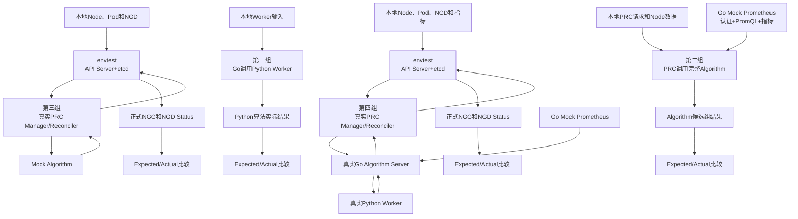
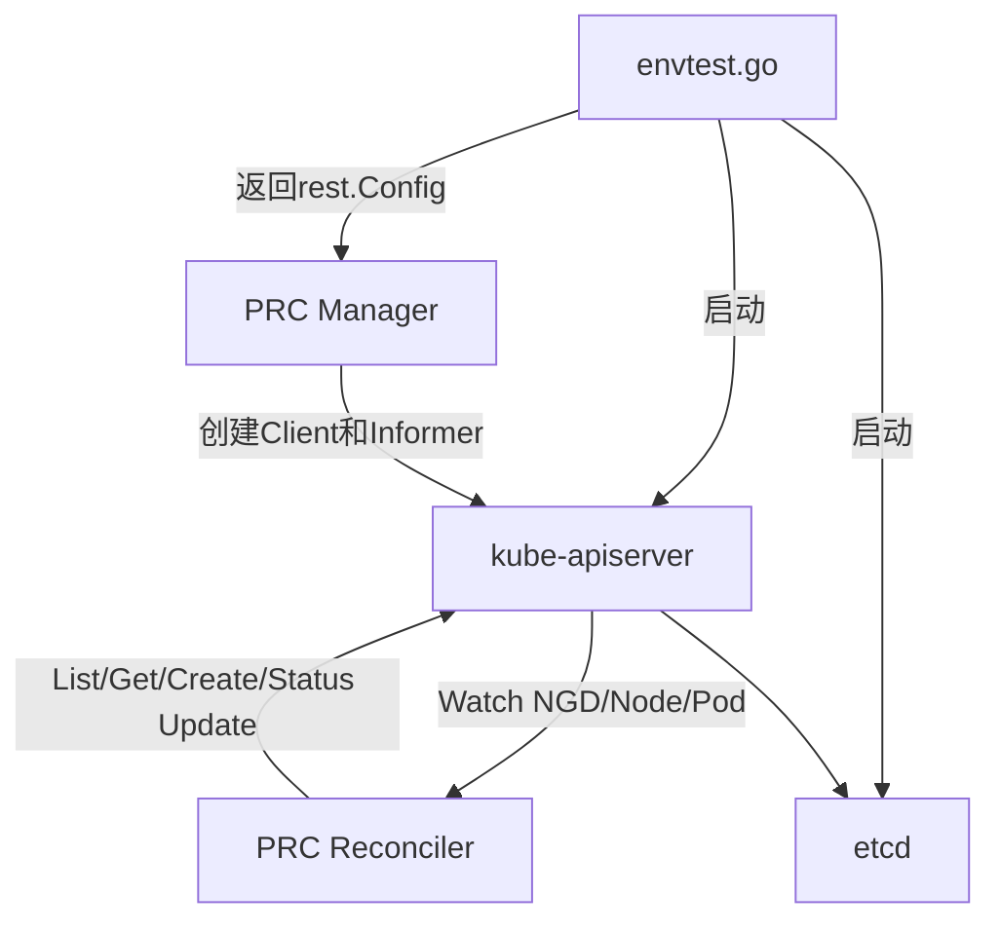
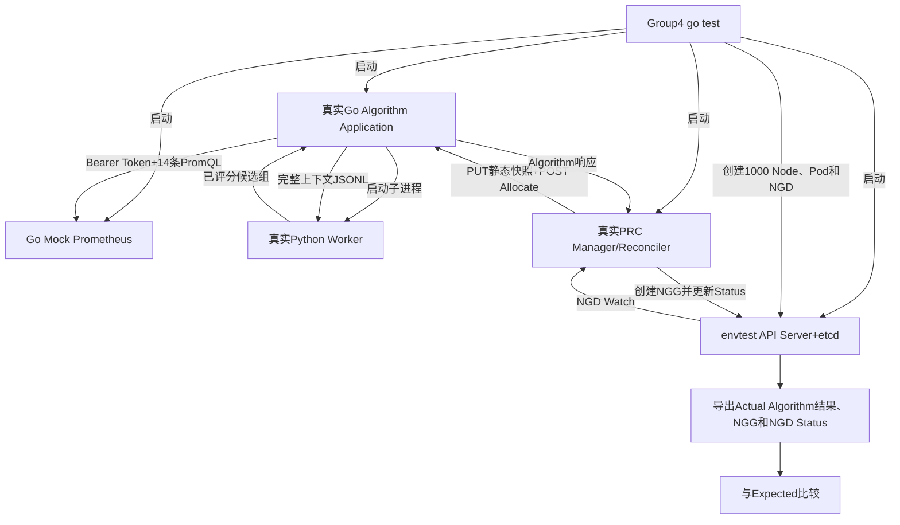

# Go Test四组测试与本地Debug实施方案 v1.2

> 日期：2026年8月21日  
> 项目：`/mnt/data0/volcano-scheduler/ngd-ngg-scheduling-demo`  
> 状态：设计方案，尚未开始修改生产代码和测试代码

## 1. 目标

需求方要求把现有演示测试调整为本地 `go test` 形式，并满足以下要求：

1. 测试代码使用标准 `*_test.go`；
2. 可以通过命令行或IDE Debug运行；
3. 不依赖Kind集群、真实Prometheus和Docker容器；
4. 测试输入、预期输出、实际输出均保存在本地文件；
5. 每次测试自动比较Expected与Actual，不一致时测试失败并输出差异；
6. 测试划分为四个边界清晰的组：
   - 第一组：Go Algorithm调用Python Worker；
   - 第二组：PRC调用完整Algorithm部分；
   - 第三组：PRC Watch NGD并通过Mock Algorithm生成NGG；
   - 第四组：PRC Watch NGD、调用真实Algorithm Server并生成NGG。

形式上四组都通过 `go test` 运行。技术上，第一组属于进程边界单元测试，第二组属于组件集成测试，第三组属于基于envtest的Controller集成测试，第四组属于本地全链路组件测试。

## 2. 四组测试整体关系



| 测试组 | 最外层输入 | 最外层输出 | 真实组件 | 模拟组件 |
| --- | --- | --- | --- | --- |
| 第一组 | Worker Payload | Worker Result | Go Worker管理、Python Worker、三段算法 | Node静态、动态和指标快照 |
| 第二组 | PRC静态快照PUT和Allocate请求 | Algorithm候选组结果 | PRC AlgorithmClient、Go Algorithm、Python Worker | Prometheus |
| 第三组 | Node、Pod和正式NGD | 正式NGG、NGD Status | API Server、etcd、PRC Manager/Reconciler | 集群对象内容、Algorithm结果 |
| 第四组 | Node、Pod、正式NGD和Prometheus指标 | Algorithm结果、正式NGG、NGD Status | API Server、etcd、PRC、Go Algorithm、Python Worker | 集群对象内容、Prometheus |

## 3. 建议目录结构

测试在项目根目录下建立独立Go模块，与 `prc`、`algorithm_server` 平级。测试模块通过本地Go Workspace引用两个生产模块，不归属于任何一个业务组件：

```text
go_test_suites/
├── go.mod
├── README.md
├── common/
│   ├── golden.go                 # Expected/Actual读取、标准化和Diff
│   ├── fixture.go                # JSON/YAML Fixture读取
│   ├── mock_prometheus.go        # Go httptest Prometheus
│   ├── envtest.go                # API Server/etcd启动与关闭
│   └── process.go                # Python Worker启动与清理
│
├── group1_algorithm_worker/
│   ├── group1_test.go
│   ├── testdata/
│   │   ├── input/
│   │   │   └── worker-payload.json
│   │   └── expected/
│   │       └── worker-result.json
│   └── actual/
│       ├── go-to-python.json
│       ├── python-to-go.json
│       └── worker-result.json
│
├── group2_prc_algorithm/
│   ├── group2_test.go
│   ├── testdata/
│   │   ├── input/
│   │   │   ├── node-static-snapshot.json
│   │   │   ├── allocation-request.json
│   │   │   └── prometheus/
│   │   │       ├── auth.json
│   │   │       └── query-responses/
│   │   └── expected/
│   │       ├── static-ack.json
│   │       └── algorithm-response.json
│   └── actual/
│       ├── prometheus-requests.jsonl
│       ├── static-ack.json
│       └── algorithm-response.json
│
├── group3_prc_ngd_ngg/
│   ├── group3_test.go
│   ├── testdata/
│   │   ├── input/
│   │   │   ├── nodes.json
│   │   │   ├── pods.json
│   │   │   ├── ngd.yaml
│   │   │   └── mock-algorithm-response.json
│   │   └── expected/
│   │       ├── prc-allocation-request.json
│   │       ├── ngg.yaml
│   │       └── ngd-status.yaml
│   └── actual/
│       ├── prc-allocation-request.json
│       ├── ngg-raw.yaml
│       ├── ngg-normalized.yaml
│       └── ngd-status.yaml
│
└── group4_full_real_algorithm/
    ├── group4_test.go
    ├── testdata/
    │   ├── input/
    │   │   ├── nodes.json
    │   │   ├── pods.json
    │   │   ├── ngd.yaml
    │   │   └── prometheus/
    │   │       ├── auth.json
    │   │       └── query-responses/
    │   └── expected/
    │       ├── algorithm-response.json
    │       ├── ngg.yaml
    │       └── ngd-status.yaml
    └── actual/
        ├── prometheus-requests.jsonl
        ├── prc-algorithm-http.jsonl
        ├── algorithm-response.json
        ├── ngg-raw.yaml
        ├── ngg-normalized.yaml
        └── ngd-status.yaml
```

管理规则：

- `go_test_suites`具有独立 `go.mod`，测试依赖不会改变PRC或Algorithm的运行入口；
- `testdata/input`和`testdata/expected`纳入Git；
- `actual`由测试运行时生成，通过 `.gitignore` 排除；
- 测试失败时仍保留Actual，便于现场查看；
- 不使用随机数据，统一使用固定的本地Fixture；
- 首轮默认使用1000个Node，满足规模要求；3000 Node可后续作为独立规模Case，不放入默认Debug流程。

## 4. 第一组：Go Algorithm调用Python Worker

### 4.1 测试目标

验证Go能够正确启动和管理Python Worker，并通过stdin/stdout JSONL协议完成一次真实算法计算。

计划测试函数：

```go
func TestGroup1_GoAlgorithmCallsPythonWorker(t *testing.T)
```

当前对应代码：

- Go Worker管理：[`algorithm_server/go/worker.go`](../../algorithm_server/go/worker.go)
- Python入口：[`algorithm_server/python/algorithm_worker/worker.py`](../../algorithm_server/python/algorithm_worker/worker.py)
- Python流水线：[`algorithm_server/python/algorithm_worker/pipeline.py`](../../algorithm_server/python/algorithm_worker/pipeline.py)

### 4.2 输入

`worker-payload.json`保存Go实际传给Python的完整Payload，包括：

- 任务需求；
- Node静态资源和三层拓扑；
- Node动态占用状态；
- Prometheus指标快照；
- `requirement -> topology -> loadbalance`算法顺序和参数。

本组不启动Prometheus。指标已经是Worker Payload的一部分，因为本组只验证Go与Python的调用边界。

### 4.3 执行过程

```text
读取worker-payload.json
        ↓
Go启动真实Python Worker子进程
        ↓
Go通过stdin发送一行JSONL
        ↓
Python执行requirement、topology、loadbalance
        ↓
Python通过stdout返回一行JSONL
        ↓
Go校验消息ID并解析Worker Result
        ↓
保存Actual并与Expected比较
```

### 4.4 输出和断言

保存以下Actual文件：

- Go发送给Python的原始JSON；
- Python返回给Go的原始JSON；
- Go最终解析的候选组结果。

必须比较：

- 候选组数量；
- `rank`、`groupId`和`topologyLevel`；
- `groupScore`；
- 每组具体Node、Node顺序和Node分数；
- Requirement、Topology和LoadBalance的最终处理结果。

## 5. 第二组：PRC调用完整Algorithm

### 5.1 测试目标

验证PRC生成并发送Algorithm协议，真实Go Algorithm读取Mock Prometheus、调用真实Python Worker，并把候选组结果返回PRC。

计划测试函数：

```go
func TestGroup2_PRCClientCallsCompleteAlgorithm(t *testing.T)
```

当前对应代码：

- PRC HTTP客户端：[`prc/internal/controller/algorithm_client.go`](../../prc/internal/controller/algorithm_client.go)
- PRC快照生成：[`prc/internal/controller/snapshot.go`](../../prc/internal/controller/snapshot.go)
- Go Algorithm服务：[`algorithm_server/go/service.go`](../../algorithm_server/go/service.go)
- Prometheus读取：[`algorithm_server/go/metrics.go`](../../algorithm_server/go/metrics.go)

### 5.2 执行过程

```text
本地Node、Pod和NGD配置
        ↓
PRC生成静态快照和动态状态
        ↓
真实AlgorithmClient发送PUT静态快照
        ↓
真实AlgorithmClient发送POST Allocate
        ↓
Go Algorithm读取Mock Prometheus指标
        ↓
Go Algorithm调用真实Python Worker
        ↓
Python返回已排序候选组
        ↓
Go Algorithm通过HTTP返回PRC
        ↓
保存Actual并与Expected比较
```

### 5.3 测试边界

本组不启动Kubernetes API Server，也不测试NGD Watch和NGG创建。输入是PRC即将发送给Algorithm的本地协议数据；隔离的Kubernetes Controller流程由第三组验证，真实衔接流程由第四组验证。

## 6. Mock Prometheus设计

Mock Prometheus使用Go标准库 `httptest.NewServer`，与 `go test` 运行在同一进程，不需要部署独立服务。

必须实现：

1. `GET /api/v1/query?query=<PromQL>`；
2. 校验 `Authorization: Bearer <token>`；
3. 缺少Token返回401；
4. Token错误返回403；
5. 未配置PromQL返回422；
6. 正确请求返回Prometheus标准 `vector` 结构；
7. 每项指标为1000个Node返回对应样本；
8. 把Algorithm实际发送的请求写入 `actual/prometheus-requests.jsonl`。

示例响应：

```json
{
  "status": "success",
  "data": {
    "resultType": "vector",
    "result": [
      {
        "metric": {"node": "worker-0001"},
        "value": [1724217600, "0.35"]
      }
    ]
  }
}
```

Mock使用与正式Algorithm相同的14条PromQL配置，覆盖CPU、内存、吞吐、包速率、丢包、错误、TCP重传、链路状态、网络利用率和可用带宽。

该Mock由第二组和第四组共用：第二组验证PRC/Algorithm边界，第四组验证包含envtest和PRC Watch的真实Algorithm完整链路。

## 7. 第三组：PRC Watch NGD生成NGG

### 7.1 测试目标

验证真实Kubernetes Watch和Controller流程：测试创建正式NGD后，PRC收到Watch事件、执行Reconcile、调用Mock Algorithm、创建正式NGG并更新NGD/NGG Status。

计划测试函数：

```go
func TestGroup3_PRCWatchesNGDAndCreatesNGG(t *testing.T)
```

当前对应代码：

- PRC Manager/Reconciler：[`prc/internal/controller/prc_controller.go`](../../prc/internal/controller/prc_controller.go)
- 当前envtest参考实现：[`test_suites/group2_prc/runner/main.go`](../../test_suites/group2_prc/runner/main.go)

### 7.2 执行过程

```text
envtest启动API Server和etcd
        ↓
安装正式NGD、NGG及拓扑CRD
        ↓
创建1000个Node和本地Pod API对象
        ↓
启动真实PRC Manager/Reconciler并等待Cache Sync
        ↓
测试通过Kubernetes API创建正式NGD
        ↓
API Server向PRC发送真实Watch事件
        ↓
PRC读取NGD、Node和Pod
        ↓
PRC调用Mock Algorithm
        ↓
PRC创建正式NGG并更新Status
        ↓
导出Actual NGG、NGD Status和PRC请求
        ↓
与Expected比较
```

### 7.3 为什么第三组使用Mock Algorithm

第三组只验证 `NGD Watch -> PRC Reconcile -> NGG`。如果同时引入Prometheus和Python，一旦失败将无法快速判断是Watch、PRC还是算法问题。

第二组已经覆盖完整Algorithm，因此第三组使用确定性的Mock Algorithm：

- 校验PRC上传的静态快照；
- 校验PRC发送的动态状态、拓扑要求和算法顺序；
- 返回本地文件中固定的候选组；
- 使最终NGG结果稳定且可与Expected比较。

## 8. envtest.go如何模拟Kubernetes

`envtest.go`是测试辅助代码，不对PRC提供业务API。它负责启动本地真实 `kube-apiserver` 和 `etcd`，并把连接配置返回给PRC Manager：

```go
environment := &envtest.Environment{
    CRDDirectoryPaths:     crdPaths,
    BinaryAssetsDirectory: envtestAssets,
}

config, err := environment.Start()
mgr, err := ctrl.NewManager(config, options)
```

访问关系：



PRC不是调用 `envtest.go`，而是使用 `rest.Config` 连接kube-apiserver。PRC访问方式和正式集群完全一致：

```go
r.Get(ctx, key, ngd)
r.List(ctx, nodes)
r.List(ctx, pods)
r.Create(ctx, ngg)
r.Status().Update(ctx, ngg)
```

envtest提供真实API、Watch、Informer Cache、Generation、UID和Status子资源语义，但不启动kubelet、CNI、Volcano或kube-scheduler。1000个Node只是API对象，不是1000台虚拟机。

不建议使用controller-runtime fake client代替envtest，因为fake client不能完整验证真实Watch、Informer和Status行为。

## 9. 第四组：PRC Watch NGD并调用真实Algorithm Server

### 9.1 测试目标

第四组把第三组中的Mock Algorithm替换为真实Algorithm组件，验证以下本地完整链路：

```text
envtest Kubernetes
  -> 真实PRC Watch/Reconcile
  -> 真实Go Algorithm Server
  -> 真实Python Worker
  -> 真实Algorithm候选结果
  -> PRC生成正式NGG
```

计划测试函数：

```go
func TestGroup4_PRCWatchesNGDCallsRealAlgorithmAndCreatesNGG(t *testing.T)
```

### 9.2 “真实Algorithm Server”的含义

第四组不使用固定Algorithm响应，而是启动真实的：

- Node静态快照缓存；
- Prometheus指标读取和缓存；
- `/internal/v1/node-static-snapshots/{snapshotID}`接口；
- `/api/v1/allocate`接口；
- Go到Python的JSONL通信；
- Python `requirement -> topology -> loadbalance`流水线；
- 候选组评分和稳定排序。

为保证 `go test` 和Delve能够进入Algorithm代码，测试使用真实Algorithm Application和Handler创建本地HTTP Server：

```go
app, err := algorithm.NewApplication(config)
algorithmServer := httptest.NewServer(app.Handler())
defer algorithmServer.Close()
defer app.Close()
```

这里的 `httptest.NewServer` 只代替端口监听和进程部署，Algorithm业务实现全部是真实代码，不返回预设候选组。正式 `cmd/algorithm-server/main.go` 仍使用相同Application和Handler，因此测试与正式服务不会形成两套实现。

### 9.3 执行过程



详细步骤：

1. 读取本地Node、Pod、NGD和Prometheus输入；
2. 启动Mock Prometheus并开启Bearer Token和PromQL校验；
3. 启动真实Go Algorithm Application和Python Worker；
4. 等待Algorithm完成首次Prometheus指标刷新；
5. 启动envtest API Server和etcd，安装正式CRD；
6. 创建1000个Node和本地Pod对象；
7. 启动真实PRC Manager/Reconciler并等待Informer Cache同步；
8. 通过Kubernetes API创建正式NGD；
9. PRC收到Watch事件并调用真实Algorithm；
10. Algorithm执行真实Python算法并返回候选组；
11. PRC选择rank 1并创建正式NGG；
12. 导出所有Actual文件，再与Expected逐项比较；
13. 测试结束后关闭PRC、envtest、Algorithm、Python Worker和Mock Prometheus。

### 9.4 输入、输出和断言

主要输入：

- 1000个Node及三层拓扑；
- Node动态占用状态和Pod资源请求；
- 正式NGD；
- 14项Prometheus指标及Bearer Token；
- 正式Algorithm配置文件。

主要Actual输出：

- Prometheus认证和PromQL请求记录；
- PRC上传的静态快照；
- PRC发送的Allocate请求；
- 真实Algorithm候选组结果；
- 正式NGG Raw和Normalized YAML；
- 最终NGD、NGG Status。

必须断言：

1. Algorithm实际执行完成，不能使用Mock候选结果；
2. Prometheus的14项指标均被正确查询并通过认证；
3. PRC请求中的静态Hash、动态状态、拓扑要求和算法顺序正确；
4. Algorithm候选组rank、分数、拓扑层级和Node顺序符合Expected；
5. PRC只把rank 1写入正式NGG；
6. NGG `spec.nodes`全部来自Algorithm第一候选组；
7. NGG进入Active，NGD进入Fulfilled；
8. Actual标准化后与Expected完全一致。

### 9.5 与第二、第三组的区别

| 组 | Kubernetes Watch | PRC | Algorithm | Python | Prometheus | 最终NGG |
| --- | --- | --- | --- | --- | --- | --- |
| 第二组 | 不启动 | 只使用请求构造和AlgorithmClient | 真实 | 真实 | Mock | 不生成 |
| 第三组 | 真实envtest | 真实 | Mock固定响应 | 不启动 | 不启动 | 生成 |
| 第四组 | 真实envtest | 真实 | 真实 | 真实 | Mock | 生成 |

第四组是最终衔接验证；第一至第三组用于在第四组失败时快速定位具体边界。

## 10. Expected与Actual比较规则

每组测试统一执行以下流程：

```text
读取Input
   ↓
执行业务代码
   ↓
先保存Raw Actual
   ↓
去除非确定字段，生成Normalized Actual
   ↓
读取Expected
   ↓
cmp.Diff(Expected, Actual)
   ↓
一致：PASS；不一致：FAIL并显示字段差异
```

需要标准化的非确定字段：

- Kubernetes `uid`、`resourceVersion`、`creationTimestamp`和`managedFields`；
- NGD、NGG中的动态时间；
- Algorithm `bootId`；
- Prometheus `capturedAt`；
- HTTP和算法处理耗时。

不能删除或重新排序的业务字段：

- 候选组rank和顺序；
- `groupId`、`topologyLevel`和 `groupScore`；
- Node顺序和Node分数；
- NGG `spec.nodes`；
- NGD/NGG业务Status。

Expected默认只读，测试不能自动覆盖。确实需要更新基准时显式执行：

```bash
UPDATE_GOLDEN=1 go test ...
```

## 11. 为独立测试模块和Go Debug需要进行的结构调整

测试目录调整到项目根目录后，需要让PRC和Algorithm都提供可导入的Go包。否则测试只能把它们作为外部子进程启动，无法在一个Delve会话中进入完整Go调用链。

### 11.1 Algorithm调整

当前Algorithm核心代码属于 `package main`，独立测试模块无法把真实Go Algorithm作为库加载到同一个Debug进程中。

建议调整为：

```text
当前：
algorithm_server/go/*.go                  package main

调整后：
algorithm_server/go/*.go                  package algorithm
algorithm_server/go/cmd/algorithm-server  package main
```

正式main只负责：

- 读取环境变量；
- 创建Algorithm Application；
- 启动HTTP Server；
- 处理进程退出信号。

核心包提供可测试构造方法，例如：

```go
app, err := algorithm.NewApplication(config)
handler := app.Handler()
defer app.Close()
```

该调整不修改算法、HTTP协议、缓存策略和Python调用方式，只提高可测试性。

### 11.2 PRC调整

当前PRC核心位于 `prc/internal/controller`。Go的 `internal` 规则禁止项目根目录下的独立测试模块直接导入该包，因此建议把可复用Controller代码调整为公开包：

```text
当前：
prc/internal/controller/*.go       package controller

调整后：
prc/pkg/controller/*.go            package controller
prc/cmd/main.go                     继续作为正式进程入口
```

正式PRC `main`和独立测试模块都引用同一个 `scheduling.demo.ngg.io/prc/pkg/controller`，不会复制Controller实现。

PRC当前已经支持注入 `AlgorithmURL` 和 `HTTPClient`：第三组接入Mock Algorithm的 `httptest.Server`；第二组和第四组接入真实Algorithm Handler。除包位置和必要的构造方法外，不修改Reconcile、快照、协议和NGG生成逻辑。

### 11.3 独立Go Workspace

项目根目录增加 `go.work`，统一关联三个平级模块：

```text
go.work
├── ./algorithm_server/go
├── ./prc
└── ./go_test_suites
```

`go_test_suites/go.mod`只声明本地测试需要的PRC、Algorithm、controller-runtime和比较工具依赖。生产镜像仍分别从PRC和Algorithm模块构建。

## 12. 本地Debug环境

当前机器检查结果：

| 环境 | 当前状态 | 用途 |
| --- | --- | --- |
| Python 3.11.2 | 已安装 | Python Worker |
| envtest 1.35.5二进制 | 已存在 | API Server和etcd |
| Go | 当前不在PATH | 必须补充Go 1.25.x |
| Delve | 当前未安装 | Go断点调试需要补充 |
| Docker/Kind | 新测试不需要 | 不进入go test依赖 |
| Prometheus | 不需要安装 | 使用Go httptest模拟 |

envtest二进制位置：

```text
/mnt/data0/volcano-scheduler/ngd-ngg-scheduling-demo/.cache/envtest/1.35.5/
├── kube-apiserver
├── etcd
└── kubectl
```

建议Go、Delve和缓存都放在数据盘：

```text
/mnt/data0/tools/go/
/mnt/data0/tools/bin/dlv
/mnt/data0/volcano-scheduler/ngd-ngg-scheduling-demo/.cache/go-mod/
/mnt/data0/volcano-scheduler/ngd-ngg-scheduling-demo/.cache/go-build/
```

Go Debug可以进入PRC和Go Algorithm代码。Python Worker是独立子进程，默认通过保存的JSONL协议文件进行边界调试；如果后续要求进入Python代码打断点，再增加可选的 `debugpy` 远程调试配置。

## 13. 规划运行命令

以下命令为实施完成后的规划命令，当前尚不可直接执行：

```bash
cd /mnt/data0/volcano-scheduler/ngd-ngg-scheduling-demo

go test ./go_test_suites/group1_algorithm_worker -v -count=1
go test ./go_test_suites/group2_prc_algorithm -v -count=1
go test ./go_test_suites/group3_prc_ngd_ngg -v -count=1
go test ./go_test_suites/group4_full_real_algorithm -v -count=1
```

单独运行指定测试：

```bash
go test ./go_test_suites/group1_algorithm_worker \
  -run '^TestGroup1_GoAlgorithmCallsPythonWorker$' \
  -v -count=1
```

Delve Debug：

```bash
dlv test ./go_test_suites/group1_algorithm_worker -- \
  -test.run '^TestGroup1_GoAlgorithmCallsPythonWorker$' \
  -test.v
```

第四组完整链路Debug：

```bash
dlv test ./go_test_suites/group4_full_real_algorithm -- \
  -test.run '^TestGroup4_PRCWatchesNGDCallsRealAlgorithmAndCreatesNGG$' \
  -test.v
```

同时规划四个IDE Debug入口：

```text
Debug Group1 - Go calls Python
Debug Group2 - PRC calls Algorithm
Debug Group3 - PRC watches NGD with Mock Algorithm
Debug Group4 - Full chain with Real Algorithm
```

## 14. 实施顺序

### 阶段一：准备本地Go Debug环境

1. 在数据盘安装Go 1.25.x；
2. 安装Delve；
3. 配置Go Module和Build缓存到数据盘；
4. 建立本地Go Workspace，关联PRC、Algorithm和独立测试三个模块。

### 阶段二：调整PRC和Algorithm可测试结构

1. 将Algorithm核心从 `package main`调整为可导入包；
2. 移动正式启动入口到 `cmd/algorithm-server`；
3. 提供Application、Handler和Close生命周期接口；
4. 将PRC Controller从 `internal/controller`调整到可导入的 `pkg/controller`；
5. 更新正式PRC入口的import路径；
6. 确认正式镜像、Reconcile逻辑和现有HTTP/CRD协议不变。

### 阶段三：实现公共测试工具

1. Fixture读取；
2. Expected/Actual标准化和Diff；
3. Go Mock Prometheus；
4. envtest启动和CRD安装；
5. Python Worker生命周期管理；
6. Actual目录清理和落盘。

### 阶段四：依次实现四组测试

1. 先完成第一组，稳定Go/Python边界；
2. 再完成第二组，接入Mock Prometheus和完整Algorithm；
3. 完成第三组，接入envtest、真实PRC Watch和Mock Algorithm；
4. 最后完成第四组，把envtest、真实PRC、真实Algorithm和Python Worker连成完整链路；
5. 为每组补充README、运行命令和IDE Debug配置。

## 15. 验收标准

每组必须同时满足：

1. 能使用独立 `go test -run` 命令运行；
2. 能在IDE或Delve中设置Go断点；
3. 不依赖Docker、Kind和外部Prometheus；
4. Input、Expected和Actual目录完整；
5. Actual在断言前完成落盘；
6. Expected与Actual一致时PASS；
7. 不一致时FAIL并显示字段级Diff；
8. 测试结束后正确关闭Python、Mock HTTP Server、API Server和etcd；
9. 默认Fixture至少包含1000个Node；
10. 四组分别定位Go/Python边界、PRC/Algorithm边界、NGD/NGG Controller边界和真实Algorithm完整衔接边界。

## 16. 本次不做的内容

- 不启动Kind或真实Kubernetes集群；
- 不部署真实Prometheus；
- 不启动Volcano和kube-scheduler；
- 不验证真实Pod调度和容器运行；
- 不把性能耗时作为单元测试通过条件；
- 不在本方案阶段修改调度算法结果。
