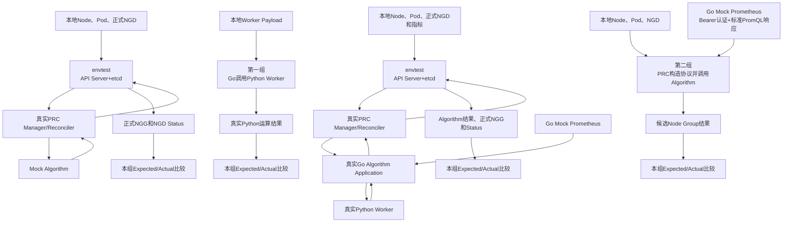
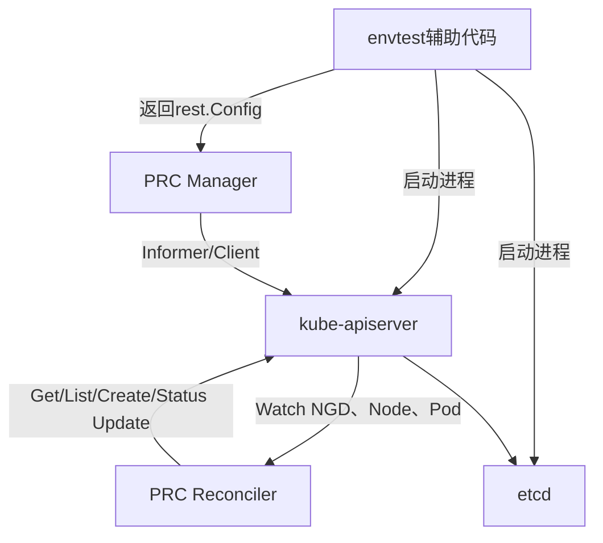
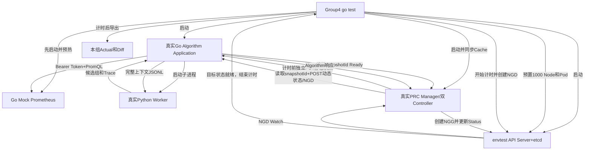

# Go Test四组测试与本地Debug实施方案 v1.3

> 日期：2026年8月24日
> 项目：`/mnt/data0/volcano-scheduler/ngd-ngg-scheduling-demo`
> 状态：已确认并实施；四组测试已通过
> 基于版本：v1.2

## 1. 本版结论

四组测试边界保持不变：

1. 第一组：Go Algorithm调用Python Worker；
2. 第二组：PRC调用完整Algorithm部分；
3. 第三组：PRC Watch NGD，通过Mock Algorithm生成NGG；
4. 第四组：PRC Watch NGD，调用真实Algorithm Server生成NGG。

v1.3正式修正以下内容：

- 每组在自己的目录下保存独立`results/<run-id>`，不建立四组共用的结果目录；
- NGD测试输入不再填写算法编排，Algorithm始终执行固定`requirement -> topology -> loadbalance`流水线；
- PRC和Algorithm必须提供可导入、可Debug的最小Go接口，不能在测试代码中复制生产逻辑；
- Prometheus测试通过配置注入完成首次同步，不等待生产环境15秒刷新周期；
- Kubernetes动态UID与派生Hash按稳定规则比较，避免Golden文件随机失败；
- envtest严格安装联通提供的NGD、NGG CRD；
- 正式1000 Node测试限制Go并发，避免共享服务器内存压力；
- 第四组称为“PRC—Algorithm—NGG完整组件链路测试”，不宣称验证真实Pod调度。

四组都以`go test`运行，但技术类型不同：

| 测试组 | 技术类型              | 主要边界                             |
| ------ | --------------------- | ------------------------------------ |
| 第一组 | 进程边界单元/组件测试 | Go与Python JSONL协议                 |
| 第二组 | 组件集成测试          | PRC AlgorithmClient与真实Algorithm   |
| 第三组 | Controller集成测试    | Kubernetes Watch、Reconcile与NGG写入 |
| 第四组 | 本地完整组件链路测试  | envtest、PRC、Algorithm、Python、NGG |

## 2. 四组整体关系



| 测试组 | 最外层输入                         | 最外层输出                         | 真实组件                                                  | 模拟组件             |
| ------ | ---------------------------------- | ---------------------------------- | --------------------------------------------------------- | -------------------- |
| 第一组 | Worker Payload                     | Worker Result                      | Go Worker管理、Python Worker、固定三段算法                | 静态、动态、指标快照 |
| 第二组 | PRC本地Node、Pod、NGD数据          | Algorithm候选组结果                | PRC协议构造、AlgorithmClient、Go Algorithm、Python Worker | Prometheus           |
| 第三组 | Node、Pod、正式NGD                 | 正式NGG、NGD Status                | API Server、etcd、PRC Manager/Reconciler                  | Algorithm响应        |
| 第四组 | Node、Pod、正式NGD、Prometheus指标 | Algorithm结果、正式NGG、NGD Status | API Server、etcd、PRC、Go Algorithm、Python Worker        | Prometheus           |

## 3. 目录结构

测试模块与`prc`、`algorithm_server`平级。每组拥有自己的输入、预期输出和运行结果：

```text
go_test_suites/
├── go.mod
├── README.md
├── common/
│   ├── golden.go
│   ├── fixture.go
│   ├── normalize.go
│   ├── mock_prometheus.go
│   ├── envtest.go
│   └── process.go
│
├── group1_algorithm_worker/
│   ├── README.md
│   ├── group1_test.go
│   ├── testdata/
│   │   ├── input/
│   │   │   └── worker-payload.json
│   │   └── expected/
│   │       └── worker-result.json
│   └── results/
│       └── <run-id>/
│           ├── actual/
│           │   ├── go-to-python.json
│           │   ├── python-to-go.json
│           │   └── worker-result.json
│           ├── comparison/
│           │   └── diff.txt
│           └── timing.txt
│
├── group2_prc_algorithm/
│   ├── README.md
│   ├── group2_test.go
│   ├── testdata/
│   │   ├── input/
│   │   │   ├── nodes.json
│   │   │   ├── pods.json
│   │   │   ├── ngd.yaml
│   │   │   └── prometheus/
│   │   │       ├── auth.json
│   │   │       └── query-responses/
│   │   └── expected/
│   │       ├── static-ack.json
│   │       └── algorithm-response.json
│   └── results/
│       └── <run-id>/
│           ├── actual/
│           │   ├── node-static-snapshot.json
│           │   ├── scheduler-state.json
│           │   ├── prometheus-requests.jsonl
│           │   ├── go-to-python.json
│           │   ├── python-to-go.json
│           │   ├── static-ack.json
│           │   └── algorithm-response.json
│           ├── comparison/
│           │   └── diff.txt
│           └── timing.txt
│
├── group3_prc_ngd_ngg/
│   ├── README.md
│   ├── group3_test.go
│   ├── testdata/
│   │   ├── input/
│   │   │   ├── nodes.json
│   │   │   ├── pods.json
│   │   │   ├── ngd.yaml
│   │   │   └── mock-algorithm-response.json
│   │   └── expected/
│   │       ├── prc-allocation-request.json
│   │       ├── ngg.yaml
│   │       └── ngd-status.yaml
│   └── results/
│       └── <run-id>/
│           ├── actual/
│           │   ├── ngd-input.yaml
│           │   ├── node-static-snapshot.json
│           │   ├── scheduler-state.json
│           │   ├── prc-allocation-request.json
│           │   ├── mock-algorithm-response.json
│           │   ├── ngg-raw.yaml
│           │   ├── ngg-normalized.yaml
│           │   └── ngd-status.yaml
│           ├── comparison/
│           │   └── diff.txt
│           └── timing.txt
│
└── group4_full_real_algorithm/
    ├── README.md
    ├── group4_test.go
    ├── testdata/
    │   ├── input/
    │   │   ├── nodes.json
    │   │   ├── pods.json
    │   │   ├── ngd.yaml
    │   │   └── prometheus/
    │   │       ├── auth.json
    │   │       └── query-responses/
    │   └── expected/
    │       ├── algorithm-response.json
    │       ├── ngg.yaml
    │       └── ngd-status.yaml
    └── results/
        └── <run-id>/
            ├── actual/
            │   ├── ngd-input.yaml
            │   ├── prometheus-requests.jsonl
            │   ├── node-static-snapshot.json
            │   ├── scheduler-state.json
            │   ├── prc-algorithm-http.jsonl
            │   ├── go-to-python.json
            │   ├── python-to-go.json
            │   ├── algorithm-response.json
            │   ├── ngg-raw.yaml
            │   ├── ngg-normalized.yaml
            │   └── ngd-status.yaml
            ├── comparison/
            │   └── diff.txt
            └── timing.txt
```

管理规则：

- 每组`testdata/input`和`testdata/expected`纳入Git；
- 每组`results/`独立生成并通过`.gitignore`排除；
- `<run-id>`使用时间戳加短随机后缀，避免同组两次运行互相覆盖；
- 测试失败时也保留本组Actual和Diff；
- 结果文件写入发生在业务计时结束后，不计入业务耗时；
- 正式验收Fixture为1000 Node；可选`-short`只用于日常Debug，不替代正式结果。

## 4. NGD、算法流水线与NGG契约

### 4.1 NGD来源

envtest安装并使用联通提供的正式CRD：

- `docs/paas-schedbridge-master/crd-deploy/nodegroupdemand-crd.yaml`
- `docs/paas-schedbridge-master/crd-deploy/nodegroupgrant-crd.yaml`

测试NGD参考：

- `docs/paas-schedbridge-master/crd-deploy/nodegroupdemand-cr-example.yaml`

测试NGG结构参考：

- `docs/paas-schedbridge-master/crd-deploy/nodegroupgrant-cr-example.yaml`

本阶段只计算：

- 节点资源数值需求；
- `topologyRequirement`拓扑要求；
- 负载均衡评分。

其他联通NGD字段仍允许存在并随完整`spec`传输，但当前算法不参与处理。测试主Fixture不填写`algorithms`。

### 4.2 固定算法流水线

Algorithm不读取NGD中的`algorithms`编排，固定执行：

```text
requirement（资源过滤）
    ↓
topology（按允许层级形成拓扑组）
    ↓
loadbalance（节点和组评分、稳定排序）
```

当请求设置`debugTrace=true`时，Python Worker返回每一阶段的输入和输出，用于测试展示。`pipelineTrace`只作为证据，不改变算法结果。

### 4.3 NGG输出

Algorithm最多可返回3个候选组并按`groupScore`降序排列。PRC按照联通NGG契约只把第一候选组写入一个正式NGG：

- `spec.nodes`包含第一候选组的具体节点；
- 节点按Algorithm返回顺序写入；
- PRC不修改Algorithm节点分数；
- NGG Status进入`Active`；
- NGD Status进入`Fulfilled`。

## 5. 第一组：Go调用Python Worker

### 5.1 目标

验证Go启动、调用和关闭真实Python Worker，并通过stdin/stdout JSONL完成计算。

```go
func TestGroup1_GoAlgorithmCallsPythonWorker(t *testing.T)
```

### 5.2 输入

`worker-payload.json`保存完整Worker Payload：

- `request`：NGD资源需求、拓扑需求、Node动态状态和`debugTrace=true`；
- `staticSnapshot`：1000个Node的容量、标签、三层网络拓扑；
- `metricSnapshot`：与正式Prometheus读取结果相同结构的指标快照；
- `metricsDegraded`和`warnings`。

Payload不携带可变算法编排。Python内部固定执行三段流水线。

### 5.3 流程

```text
读取Worker Payload
  -> Go启动真实Python Worker
  -> Go写入一行JSONL
  -> Python执行固定三段流水线
  -> Python写回一行JSONL
  -> Go校验消息ID并解析结果
  -> 结束计时
  -> 保存本组Actual并比较Expected
```

### 5.4 断言

- 请求和响应消息ID一致；
- Python没有返回协议错误；
- `pipelineTrace`顺序严格为requirement、topology、loadbalance；
- 每阶段过滤、分组和评分结果与Expected一致；
- 候选组不超过3个，rank连续且排序稳定；
- 每组包含具体Node、Node分数和Group分数；
- Worker可以正常关闭，不遗留子进程。

本组业务耗时从Go开始写入Worker请求前计时，到Go完成响应解析时结束；结果落盘不计时。

## 6. 第二组：PRC调用完整Algorithm

### 6.1 目标

验证PRC使用真实快照构造代码和AlgorithmClient调用真实Go Algorithm；Algorithm读取Mock Prometheus并调用真实Python Worker。

```go
func TestGroup2_PRCClientCallsCompleteAlgorithm(t *testing.T)
```

本组不启动Kubernetes API Server，不验证Watch、Reconcile和NGG创建。

### 6.2 流程

```text
读取本地Node、Pod和NGD
  -> PRC生成Node静态快照
  -> PRC生成Node动态调度状态
  -> PRC PUT静态快照
  -> Algorithm确认静态snapshotId Ready
  -> Prometheus指标缓存Ready
  -> 开始计时
  -> PRC POST Allocate
  -> Go Algorithm读取已准备好的Prometheus缓存
  -> Go Algorithm调用真实Python Worker
  -> Python返回排序后的候选组
  -> PRC解析响应
  -> 结束计时
  -> 保存本组Actual并比较Expected
```

### 6.3 Prometheus准备

Mock Prometheus在业务计时前启动并完成Bearer Token配置。Algorithm Application必须支持：

- 注入Mock Prometheus URL和Token；
- 注入短刷新间隔，或显式执行`RefreshNow()`；
- 等待首次指标快照Ready；
- 不等待生产环境15秒刷新周期；
- 不依赖测试之间共享的进程环境变量。

### 6.4 断言

- PRC静态快照、动态状态和Allocate协议来自生产代码；
- 静态Snapshot Hash与Algorithm Ack一致；
- Mock Prometheus认证、PromQL和响应解析正确；
- Algorithm确实调用Python Worker；
- 固定三段流水线顺序正确；
- PRC收到的候选组与Expected一致。

本组业务耗时从PRC发送`POST /api/v1/allocate`前计时，到PRC完成Allocate响应解析时结束。静态快照PUT/Ready确认、Prometheus预热、Fixture读取和结果落盘均不计时，与3000 Node整组Group2保持相同口径。

## 7. Mock Prometheus

Mock使用Go标准库`httptest.NewServer`，由第二组和第四组测试进程内部启动，不单独部署服务。

必须模拟正式Prometheus HTTP行为：

1. `GET /api/v1/query?query=<PromQL>`；
2. 正确Token返回200及标准Prometheus`vector`响应；
3. 缺少`Authorization`返回401；
4. Bearer Token错误返回403；
5. 未配置PromQL返回422；
6. 每项指标按Node名返回对应样本；
7. 覆盖正式Algorithm配置的CPU、内存和网络指标；
8. 记录Algorithm实际请求到本组`results/<run-id>/actual/prometheus-requests.jsonl`。

认证错误Case单独调用Mock接口验证，不混入主链路业务计时。

## 8. 第三组：PRC Watch NGD并通过Mock Algorithm生成NGG

### 8.1 目标

验证真实Kubernetes API语义下的：

```text
Create NGD -> Watch -> Reconcile -> Mock Algorithm -> Create NGG -> Update Status
```

```go
func TestGroup3_PRCWatchesNGDAndCreatesNGG(t *testing.T)
```

### 8.2 流程

```text
envtest启动API Server和etcd
  -> 安装联通NGD、NGG CRD
  -> 创建1000个Node和Pod对象
  -> 启动PRC Manager、静态快照Controller和NGD Reconciler
  -> 静态Controller独立构造并PUT快照，等待Algorithm确认Ready
  -> 修改Node静态Label，验证无NGD时也能生成新Hash
  -> 开始计时并创建正式NGD
  -> PRC收到Watch事件并读取NGD、Node、Pod
  -> PRC读取已确认snapshotId并构造动态状态
  -> PRC调用Mock Algorithm
  -> PRC把第一候选组写入正式NGG
  -> 等待NGG与NGD Status达到目标状态
  -> 结束计时
  -> 导出本组Actual并比较Expected
```

Mock Algorithm只返回固定响应并记录PRC真实请求，不复制PRC协议构造逻辑。

### 8.3 断言

- PRC由真实Watch触发，而不是直接调用`Reconcile()`；
- 静态快照同步不依赖NGD，Node静态变化能独立触发新Hash和PUT；
- NGD任务Reconcile期间静态PUT次数不增加；
- PRC发送完整NGD `spec`、静态Hash和Node动态状态；
- 主Fixture不含算法编排字段；若CRD中存在该可选字段，Mock只验证其被保留，不把它作为算法顺序；
- PRC只选择Mock响应的rank 1；
- 正式NGG结构符合联通CRD；
- NGG `spec.nodes`来自第一候选组；
- NGG为`Active`，NGD为`Fulfilled`。

本组业务耗时从PRC通过Watch观察到NGD并进入Reconcile开始，到NGG进入`Active`结束。NGD `Fulfilled`作为正确性断言但不计时；envtest启动、CRD安装、Node/Pod预置、静态快照同步和结果落盘均不计时。

## 9. envtest如何模拟Kubernetes

envtest启动真实的本地`kube-apiserver`和`etcd`，不向PRC暴露自定义业务API。它返回`rest.Config`，PRC Manager通过该配置访问Kubernetes API：



envtest提供真实API、Watch、Informer Cache、Generation、UID和Status子资源语义，但不提供kubelet、CNI、Volcano、kube-scheduler或真实容器调度。

1000个Node是API对象，不是1000台虚拟机。为避免资源压力，同一测试进程内不并行启动多套envtest。

## 10. 第四组：完整PRC—Algorithm—NGG组件链路

### 10.1 目标

第四组把第三组的Mock Algorithm替换为真实Algorithm Application：

```text
envtest Kubernetes
  -> 真实PRC Watch/Reconcile
  -> 真实Go Algorithm Application
  -> 真实Python Worker
  -> 真实候选组结果
  -> PRC生成正式NGG
```

```go
func TestGroup4_PRCWatchesNGDCallsRealAlgorithmAndCreatesNGG(t *testing.T)
```

### 10.2 流程



### 10.3 断言

- PRC由真实NGD Watch触发；
- 独立静态Controller在NGD前完成快照同步，任务Reconcile期间不再次PUT；
- Algorithm使用真实Go缓存、HTTP Handler和Python Worker；
- Mock Prometheus收到带正确认证的正式PromQL请求；
- Algorithm固定执行requirement、topology、loadbalance；
- 候选组rank、Group分数、拓扑层级、具体Node和Node分数符合Expected；
- PRC只将第一候选组写入一个正式NGG；
- 正式NGG及NGD Status符合联通CRD；
- 所有进程和Server在测试结束后正确关闭。

本组业务耗时从PRC通过Watch观察到NGD并进入Reconcile开始，到正式NGG进入`Active`结束。NGD `Fulfilled`作为正确性断言但不计时；Prometheus预热、静态快照同步、envtest初始化、数据预置和结果落盘均不计时。

第四组不启动Volcano或kube-scheduler，因此不验证Pod最终绑定。

## 11. Expected与Actual稳定比较

### 11.1 比较流程

```text
读取Input
  -> 执行业务代码并结束计时
  -> 保存Raw Actual
  -> 标准化Actual
  -> 读取Expected
  -> 生成字段级Diff
  -> 一致PASS；不一致FAIL并保留本组结果
```

### 11.2 Kubernetes动态字段

允许标准化：

- `resourceVersion`；
- `creationTimestamp`和动态业务时间；
- `managedFields`；
- Algorithm `bootId`；
- Prometheus `capturedAt`；
- HTTP、算法和测试运行耗时。

UID不能在最终阶段简单删除，因为它参与Snapshot Hash、Scheduler State Hash和Request ID。应在构造Fixture对象后、计算Hash前，将envtest生成的UID按对象名稳定映射为测试别名；或者对Hash使用关系断言，例如：

```text
Algorithm Ack.acceptedSnapshot == PRC request.nodeStaticSnapshotId
Algorithm Response.schedulerStateSnapshotId == PRC Allocate请求中的同名值
```

不允许删除或重排：

- 候选组rank和顺序；
- `groupId`、`topologyLevel`和`groupScore`；
- Node顺序和Node分数；
- NGG `spec.nodes`；
- NGD/NGG业务Status。

Expected默认只读。更新Golden必须显式指定测试参数或专用命令，不能在普通测试或CI中自动覆盖。

## 12. 生产代码可测试性调整

以下可测试性调整已经按本方案完成。

### 12.1 Algorithm Go包

当前已经调整为可导入的核心包与薄`main`入口：

```text
algorithm_server/go/
├── algorithm/
│   ├── application.go
│   ├── server.go
│   ├── worker.go
│   ├── cache.go
│   ├── metrics.go
│   ├── service.go
│   └── types.go
└── cmd/algorithm-server/
    └── main.go
```

完整进程封装提供：

```go
server, err := algorithm.NewServer(config, algorithm.ServerOptions{ListenAddress: "127.0.0.1:0"})
err = server.Start(ctx)
err = server.WaitForReady(readyCtx)
defer server.Close(shutdownCtx)
```

`Config`至少允许注入：

- Prometheus URL、Token和HTTP Client；
- 指标刷新周期或首次同步方法；
- Python命令、模块和`PYTHONPATH`；
- Worker超时；
- 测试时钟或Boot ID（仅在需要稳定证据时）。

第一组还需要一个最小、正式可用的Worker构造和Calculate接口，不能通过复制`worker.go`实现测试。

调整目录后必须同步修改根目录`Dockerfile.algorithm`：递归复制Go源码，并构建`./cmd/algorithm-server`。镜像构建和服务启动必须作为回归检查，但不属于四组`go test`运行依赖。

### 12.2 PRC Go包

当前Controller位于`prc/internal/controller`，独立测试模块不能导入。建议迁移到：

```text
prc/pkg/controller
```

迁移后还需要导出最小接口：

```go
BuildStaticSnapshot(...)
BuildSchedulerState(...)
AlgorithmClient.PutStatic(...)
AlgorithmClient.Calculate(...)
```

PRC已增加`prc/pkg/application.Application`，统一创建Manager、注册静态快照Controller和NGD Reconciler、管理私有共享状态并提供`Start/WaitForReady`。正式`prc/cmd/main.go`、Group3和Group4使用同一封装，测试不再手工组装Reconciler。

### 12.3 Go Workspace

项目根目录增加：

```text
go.work
├── ./algorithm_server/go
├── ./prc
└── ./go_test_suites
```

三个模块仍保持独立`go.mod`。Workspace只负责本地开发和Debug，不改变生产镜像的模块边界。

## 13. 本地环境规划

当前检查结果：

| 环境           | 当前状态       | 规划                                |
| -------------- | -------------- | ----------------------------------- |
| Python 3.11.2  | 已安装         | 直接用于Python Worker               |
| envtest 1.35.5 | 二进制已存在   | 从项目`.cache/envtest/1.35.5`加载 |
| Go 1.25.13     | 已安装         | `/mnt/data0/tools/go`             |
| Delve 1.27.0   | 已安装         | `/mnt/data0/tools/bin/dlv`        |
| Docker/Kind    | 四组测试不依赖 | 仅用于后续镜像回归                  |
| Prometheus     | 不安装         | 使用Go httptest Mock                |

规划路径：

```text
/mnt/data0/tools/go/
/mnt/data0/tools/bin/dlv
/mnt/data0/volcano-scheduler/ngd-ngg-scheduling-demo/.cache/go-mod/
/mnt/data0/volcano-scheduler/ngd-ngg-scheduling-demo/.cache/go-build/
```

Go Debug能够进入PRC和Go Algorithm。Python Worker是独立子进程，Go Delve不能直接进入Python代码；本阶段通过保存的JSONL输入、输出和`pipelineTrace`调试Python边界。

## 14. 规划运行命令

以下命令已经可以直接运行：

```bash
cd /mnt/data0/volcano-scheduler/ngd-ngg-scheduling-demo

GOMAXPROCS=2 go test -p=1 ./go_test_suites/group1_algorithm_worker -v -count=1
GOMAXPROCS=2 go test -p=1 ./go_test_suites/group2_prc_algorithm -v -count=1
GOMAXPROCS=2 go test -p=1 ./go_test_suites/group3_prc_ngd_ngg -v -count=1
GOMAXPROCS=2 go test -p=1 ./go_test_suites/group4_full_real_algorithm -v -count=1
```

单独Debug：

```bash
dlv test ./go_test_suites/group1_algorithm_worker -- \
  -test.run '^TestGroup1_GoAlgorithmCallsPythonWorker$' \
  -test.v -test.count=1
```

第四组：

```bash
dlv test ./go_test_suites/group4_full_real_algorithm -- \
  -test.run '^TestGroup4_PRCWatchesNGDCallsRealAlgorithmAndCreatesNGG$' \
  -test.v -test.count=1 -test.timeout=30m
```

运行Group4 Debug前还需设置`NGG_TEST_DEBUG=true`和`NGG_TEST_DEBUG_TIMEOUT=10m`；它们同时放宽测试等待、PRC调用Algorithm和指标快照有效期，单独增加`-test.timeout`不足够。

IDE规划四个入口：

- `Debug Group1 - Go calls Python`；
- `Debug Group2 - PRC calls Algorithm`；
- `Debug Group3 - PRC watches NGD with Mock Algorithm`；
- `Debug Group4 - Full component chain`。

## 15. 实施结果

已按以下顺序完成实施：

1. 安装数据盘Go和Delve，配置Go缓存、envtest和IDE；
2. 将Algorithm拆分为可导入业务包和`cmd`入口，同步修正镜像构建；
3. 将PRC Controller调整为可导入包并导出最小接口；
4. 建立`go.work`和独立`go_test_suites`模块；
5. 实现Fixture、标准化、Diff、Mock Prometheus和envtest公共工具；
6. 依次完成第一至第四组；
7. 为每组补充独立README、结果目录、命令和IDE Debug配置；
8. 使用`-p=1`完成1000 Node四组验收；
9. 最后回归PRC与Algorithm镜像构建和现有启动入口。

### 15.1 首次正式串行回归

2026年8月24日使用`make go-test-all`、1000 Node Fixture且未设置`UPDATE_GOLDEN`，四组全部通过。下表是改造前历史口径，只保留作追溯，不再用于当前性能比较：

| 测试组 | 业务计时边界                                             |    本次耗时 |
| ------ | -------------------------------------------------------- | ----------: |
| 第一组 | Go写Worker请求 → Go解析Worker响应                       |  228.191 ms |
| 第二组 | 历史旧口径：PRC PUT静态快照 → PRC解析Allocate响应       |  230.758 ms |
| 第三组 | Create NGD → NGG Active且NGD Fulfilled                  | 2818.448 ms |
| 第四组 | Create NGD → 真实Algorithm → NGG Active且NGD Fulfilled | 3142.858 ms |

每组完整输入、Expected、Actual、Diff和`timing.txt`分别保存在各自目录，不共用结果目录。

### 15.2 统一计时边界后的当前复测

2026年8月27日统一四组计时口径：Group1的通用对象转换移到JSONL计时前；Group2的静态PUT/Ready确认和Prometheus预热移到Allocate计时前；Group3/4的独立静态同步同样位于NGD业务计时前。1000 Node功能Fixture复测结果如下；这里的目标授权结果只有3个Node，不等同于3000 Node性能矩阵中的“选择1000个Node”：

| 测试组 | 当前业务计时边界 | 本次耗时 |
| --- | --- | ---: |
| 第一组 | Go发送已准备JSONL → Go解析Python JSONL响应 | 122.212 ms |
| 第二组 | PRC POST Allocate（静态/指标已Ready）→ PRC解析响应 | 165.340 ms |
| 第三组 | PRC观察到NGD → Mock Algorithm → NGG Active | 56.067 ms |
| 第四组 | PRC观察到NGD → 真实Algorithm → NGG Active | 212.325 ms |

包含关系符合设计：`Group1 < Group2 < Group4`。Group3使用Mock Algorithm，主要测PRC控制器和NGG小结果写入，不参与这个真实Algorithm包含关系排序。

3000个静态Node、6种选择规模、每种30次的正式结果见`go_test_suites/scale_benchmark_3000/README.md`。

## 16. 验收标准

每组必须满足：

1. 使用标准`*_test.go`和独立`go test -run`命令；
2. 能在IDE或Delve中进入对应Go生产代码；
3. 不依赖Kind、真实Kubernetes、外部Prometheus或Docker运行环境；
4. 使用本组独立的Input、Expected和`results/<run-id>`；
5. 结果文件写入不计入业务耗时；
6. Actual标准化后与Expected自动比较；
7. 失败时保存Actual并输出字段级Diff；
8. 正确关闭Python、Mock HTTP Server、PRC Manager、API Server和etcd；
9. 正式验收Fixture至少包含1000个Node；
10. 第二、第四组验证Prometheus认证和正式PromQL；
11. 第三、第四组严格使用联通NGD、NGG CRD；
12. 四组共同证明Go/Python边界、PRC/Algorithm边界、Controller边界和完整组件链路。

## 17. 本阶段不做

- 不启动真实Kubernetes或Kind集群；
- 不启动外部Prometheus；
- 不启动Volcano和kube-scheduler；
- 不验证Pod最终绑定和容器运行；
- 不把耗时阈值作为单元测试PASS/FAIL条件；
- 不修改算法业务公式；
- 不实现NGD中暂不处理的网络可达性、亲和性等字段；
