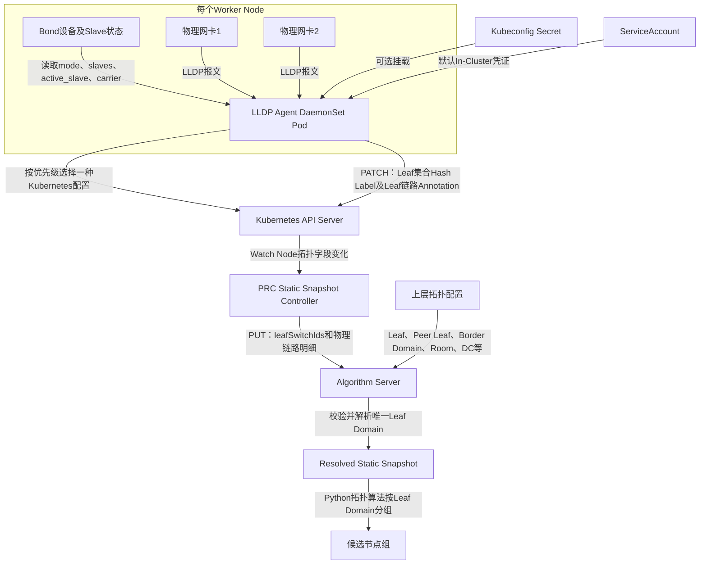

# LLDP 采集 Kubeconfig 与双 Leaf 逻辑域改造设计 v1.0

> 日期：2026-09-03  
> 文档性质：设计与当前实现说明
> 当前状态：核心改造已实现并完成单元/集成回归
> 适用范围：LLDP Agent、PRC静态快照、Algorithm Server拓扑解析与相关测试

## 1. 背景与本次目标

本次需要解决两个生产部署问题：

1. LLDP Agent除现有In-Cluster方式外，还要支持通过Kubeconfig连接Kubernetes集群；
2. 生产主机可能通过Bond连接两个Leaf Switch，需要根据Bond模式选择有效网卡，并将双Leaf合并成唯一逻辑域参与调度计算。

本次确定以下原则：

- `hostNetwork`负责获取宿主机网络和LLDP报文，Kubeconfig/In-Cluster负责访问Kubernetes API，两者互相独立；
- LLDP Agent只采集并保存Node直接连接的Leaf，不保存Border、Spine、机房、数据中心等上层拓扑；
- Active-Backup模式只采集当前Active Slave；
- 负载均衡模式采集所有状态正常的Slave；
- 一个Node即使连接两个Leaf，在算法中也只能属于一个Leaf Domain，资源只能统计一次；
- Leaf以上的拓扑关系和Leaf Domain解析由Algorithm Server维护；
- 不修改联通提供的NGD CRD。

---

## 2. 当前实现与差距

### 2.1 Kubernetes连接方式

PRC入口使用`ctrl.GetConfigOrDie()`，已经支持：

```text
--kubeconfig
  → KUBECONFIG
  → In-Cluster
  → ~/.kube/config
```

改造前LLDP Agent在`topology_agent/main.go`中固定调用`inClusterClient()`，并在`topology_agent/kube.go`中手动读取：

```text
KUBERNETES_SERVICE_HOST
KUBERNETES_SERVICE_PORT_HTTPS
/var/run/secrets/kubernetes.io/serviceaccount/token
/var/run/secrets/kubernetes.io/serviceaccount/ca.crt
```

当前实现已替换为client-go标准配置加载和Node客户端，同时支持Kubeconfig与In-Cluster。

### 2.2 单Leaf模型

改造前链路只支持一个Leaf：

```text
receiveLLDP()返回第一个邻居
  → Node Label保存一个leaf-switch
  → PRC静态快照生成一个leafSwitchId
  → Algorithm按leafSwitchId分组
```

当前协议核心字段为：

```json
{
  "topology": {
    "switchId": "Leaf-A",
    "leafSwitchId": "Leaf-A"
  }
}
```

当前实现通过`leafSwitchIds`和`leaf-links`表达一个负载均衡Bond同时连接Leaf-A和Leaf-B。

### 2.3 缺少持续链路探测

改造前Agent发现Node已经存在Leaf Label后会直接恢复缓存并返回，因此不能及时发现：

- Active-Backup主备切换；
- Slave链路Down；
- Bond成员变化；
- Leaf邻居变化。

当前实现已按30秒周期持续采集，并仅在有效内容变化时Patch Node。

---

## 3. 目标架构



每个Worker仍然运行一个Agent Pod和一个Go主进程：

```text
N个符合NodeSelector的Worker
  → N个DaemonSet Pod
  → N个LLDP Agent Go主进程
```

不会为每块网卡再启动独立进程，同一进程内完成Bond识别、多接口LLDP监听和Node更新。

---

## 4. Kubeconfig与In-Cluster双模式

### 4.1 配置选择规则

LLDP Agent统一使用以下优先级：

```text
1. 显式--kubeconfig文件
2. KUBECONFIG环境变量
3. In-Cluster ServiceAccount
4. 默认~/.kube/config
```

显式指定的Kubeconfig无法加载时必须启动失败，不能静默退回其他身份，避免连接错误集群。

### 4.2 Cobra参数

新增：

```text
--kubeconfig       Kubeconfig文件路径
--kube-context     可选，指定Kubeconfig Context
```

运行示例：

```bash
# 保持现有In-Cluster部署
topology-agent --mode=LLDP

# 使用Kubeconfig
topology-agent \
  --mode=LLDP \
  --kubeconfig=/etc/ngd-ngg/kubeconfig \
  --kube-context=target-cluster
```

### 4.3 客户端实现

删除手动拼接API地址、Bearer Token和CA Transport的固定逻辑，改用Kubernetes官方`client-go`：

```text
clientcmd加载Kubeconfig
rest.InClusterConfig加载Pod身份
kubernetes.NewForConfig创建Clientset
```

Node操作统一通过标准客户端完成：

```text
CoreV1().Nodes().Get
CoreV1().Nodes().Watch
CoreV1().Nodes().Patch
```

这样可以统一处理Token、客户端证书、CA、API Server地址及Context。

### 4.4 DaemonSet中的Kubeconfig

Kubeconfig包含凭证，使用Secret挂载，不使用ConfigMap：

```yaml
containers:
- name: lldp-agent
  args:
  - --mode=LLDP
  - --kubeconfig=/etc/ngd-ngg/kubeconfig
  volumeMounts:
  - name: kubeconfig
    mountPath: /etc/ngd-ngg
    readOnly: true

volumes:
- name: kubeconfig
  secret:
    secretName: lldp-kubeconfig
    defaultMode: 0400
```

验证纯Kubeconfig模式时，可以设置：

```yaml
automountServiceAccountToken: false
```

生产Kubeconfig中的API Server地址必须能够从所有Worker访问，不能使用只对配置生成机器有效的`127.0.0.1`地址。

Kubeconfig身份只授予Node的`get/patch`权限，不使用管理员Kubeconfig。Agent按`NODE_NAME`只读取和更新自身Node。

---

## 5. Bond识别与有效网卡选择

### 5.1 数据来源

Agent在宿主机网络环境中读取：

```text
/sys/class/net/<bond>/bonding/mode
/sys/class/net/<bond>/bonding/slaves
/sys/class/net/<bond>/bonding/active_slave
/sys/class/net/<slave>/carrier
/sys/class/net/<slave>/operstate
/proc/net/bonding/<bond>
```

为了保证容器内路径稳定，DaemonSet可将相关宿主机目录只读挂载；是否必须挂载需在目标物理环境验证。

### 5.2 内部模型

```go
type BondInfo struct {
    Name        string
    Mode        string
    Slaves      []string
    ActiveSlave string
}

type InterfaceState struct {
    Name      string
    CarrierUp bool
    OperState string
}
```

### 5.3 Active-Backup模式

Linux Bond Mode 1：

```text
active-backup
```

只选择`active_slave`：

```text
bond0
├─ eth0：Active，连接Leaf-A  ← 采集
└─ eth1：Standby，连接Leaf-B ← 不进入本次有效拓扑
```

结果为：

```text
eligibleInterfaces=[eth0]
leafSwitchIds=[Leaf-A]
```

主备切换后，Agent重新采集并更新为Leaf-B。

### 5.4 负载均衡模式

以下模式按负载/多链路模式处理：

```text
mode 0：balance-rr
mode 2：balance-xor
mode 3：broadcast
mode 4：802.3ad/LACP
mode 5：balance-tlb
mode 6：balance-alb
```

选择同时满足以下条件的Slave：

```text
属于当前Bond
carrier=1
operstate=up
```

例如：

```text
bond0 mode=802.3ad
├─ eth0：Up，连接Leaf-A  ← 采集
└─ eth1：Up，连接Leaf-B  ← 采集
```

结果为：

```text
eligibleInterfaces=[eth0,eth1]
leafSwitchIds=[Leaf-A,Leaf-B]
```

第一版可按“Bond成员且链路Up”判断可用；生产增强版再校验802.3ad Slave是否属于当前生效Aggregator。

---

## 6. 多接口LLDP采集

现有接口：

```go
receiveLLDP(allowed, timeout) (lldpNeighbor, error)
```

调整为：

```go
receiveLLDP(interfaces, timeout) ([]lldpNeighbor, error)
```

监听窗口内以接口名保存最新合法邻居：

```text
eth0 → Leaf-A / Remote-Port-1
eth1 → Leaf-B / Remote-Port-3
```

处理规则：

1. 只接收选定有效接口上的EtherType `0x88CC`报文；
2. 同一接口收到多次报文时保留最新合法邻居；
3. 以接口名和Leaf ID排序，保证输出与内容Hash稳定；
4. 对相同Leaf去重；
5. 没有有效邻居时保留上次结果并记录采集失败，不写入空拓扑；
6. 超过设计上限的Leaf数量记录异常，不直接合并未知拓扑。

---

## 7. Node持久化格式

### 7.1 Label用于变化识别和索引

建议写入：

```yaml
metadata:
  labels:
    topology.demo.ngg.io/leaf-set-id: 8b7c0913a127
    topology.demo.ngg.io/leaf-count: "2"
```

`leaf-set-id`只是排序后物理Leaf集合的内容Hash，用于触发Node Watch和识别连接是否变化，不代表Algorithm最终计算出的Leaf Domain。

生产Leaf名称可能超过Kubernetes Label值63字符限制，因此完整Leaf名称必须保存在Annotation。单Leaf且名称符合Label格式时，兼容期可以保留：

```yaml
topology.demo.ngg.io/leaf-switch: Leaf-A
```

双Leaf模式不能再把`leaf-switch`单值作为唯一拓扑事实。

### 7.2 Annotation保存物理明细

```yaml
metadata:
  annotations:
    topology.demo.ngg.io/leaf-links: |
      [
        {
          "bond":"bond0",
          "bondMode":"802.3ad",
          "interface":"eth0",
          "leafSwitchId":"Leaf-A",
          "remotePortId":"port-1",
          "active":true
        },
        {
          "bond":"bond0",
          "bondMode":"802.3ad",
          "interface":"eth1",
          "leafSwitchId":"Leaf-B",
          "remotePortId":"port-3",
          "active":true
        }
      ]
```

Annotation只保存Node直接连接Leaf的事实及采集诊断信息，不写Leaf Domain、Border、Spine、Room、DataCenter、Location和Region。

Agent计算新结果后先做内容比较，只有有效拓扑发生变化时才PATCH Node，避免自身更新触发无限循环。

---

## 8. Leaf Domain解析规则

### 8.1 域定义来源

Leaf Domain由Algorithm Server依据上层拓扑配置中的`LEAF`对等关系构建。例如：

```yaml
Leaf-A:
  LEAF:
    Leaf-B: {}

Leaf-B:
  LEAF:
    Leaf-A: {}
```

Algorithm启动时检查：

1. 两个Leaf互相声明为Peer；
2. 两个Leaf属于同一Room；
3. 两个Leaf解析到同一Border Domain；
4. 一个Leaf不能同时进入多个Leaf Domain；
5. 第一版一个Leaf Domain限制为1～2个成员。

### 8.2 稳定身份

域身份使用排序后成员集合生成内容Hash：

```text
[Leaf-B,Leaf-A]
  → 排序为[Leaf-A,Leaf-B]
  → SHA256
  → leaf-domain:<前12位>
```

Leaf输入顺序变化不会改变Domain ID。

### 8.3 主备与负载模式映射

Active-Backup节点只上报当前Active Leaf，但Algorithm通过静态Peer关系仍将Leaf-A和Leaf-B映射到同一Leaf Domain：

```text
主备切换前：Node → Leaf-A → Leaf Domain 01
主备切换后：Node → Leaf-B → Leaf Domain 01
```

负载模式节点同时上报两个Leaf：

```text
Node → [Leaf-A,Leaf-B] → Leaf Domain 01
```

如果一个Node上报的两个Leaf不能映射到同一个合法域，Algorithm故障关闭该Node并输出明确告警，例如：

```text
NODE_LEAF_DOMAIN_CONFLICT
```

不能把跨Room或跨Border Domain的Leaf直接合并。

---

## 9. 静态快照协议调整

PRC静态快照从单值：

```json
{
  "leafSwitchId": "Leaf-A"
}
```

升级为：

```json
{
  "leafSwitchIds": ["Leaf-A", "Leaf-B"],
  "links": [
    {
      "interface": "eth0",
      "leafSwitchId": "Leaf-A",
      "remotePortId": "port-1"
    },
    {
      "interface": "eth1",
      "leafSwitchId": "Leaf-B",
      "remotePortId": "port-3"
    }
  ]
}
```

兼容规则：

- 新数据优先读取`leafSwitchIds`；
- 只有旧`leafSwitchId`时转换为单元素数组；
- PRC只负责读取、规范化、排序和生成静态内容Hash；
- Algorithm负责验证Leaf集合并生成最终`leafDomainId`；
- Node上的`leaf-set-id`只用于变化识别，不能代替Algorithm配置验证，也不能直接作为调度域ID。

静态快照中的同一个Node只能出现一次，不能因为存在两个Leaf复制为两条Node记录。

---

## 10. 拓扑算法调整

当前Python拓扑算法最窄层按`leafSwitchId`分组：

```python
{
    "name": "leafSwitch",
    "field": "leafSwitchId",
    "groupPrefix": "leaf",
}
```

调整为按`leafDomainId`分组：

```python
{
    "name": "leafDomain",
    "field": "leafDomainId",
    "groupPrefix": "leaf-domain",
}
```

新的拓扑上升顺序：

```text
Leaf Domain
  → Spine Domain（配置为空时跳过）
  → Border Domain
  → Room
  → Data Center
  → Location
  → Region
```

示例：

```text
Leaf Domain 01
├─ Node-1：Active-Backup，当前Leaf-A
├─ Node-2：802.3ad，Leaf-A+Leaf-B
└─ Node-3：Active-Backup，当前Leaf-B
```

算法形成一个候选组：

```text
groupId=leaf-domain:01
nodes=[Node-1,Node-2,Node-3]
```

Node-2虽然连接两个Leaf，但只能出现一次，CPU、内存和节点数量均只能累计一次。

---

## 11. 持续探测与变化触发

Node Watch不能代替Bond探测，因为Bond主备切换首先发生在Linux网络层，不一定修改Kubernetes Node对象。

第一版建议：

```text
启动时从Node Annotation恢复上次状态
  → 立即执行真实Bond/LLDP采集
  → 每30秒重新探测
  → 新旧拓扑内容Hash不同才PATCH Node
```

后续增强：

```text
Netlink监听Link/Bond事件
  → 事件触发立即采集
  → 低频周期探测作为兜底
```

主备切换后的完整传播链为：

```text
Bond active_slave变化
  → Agent重新采集Leaf
  → PATCH Node拓扑字段
  → PRC Static Snapshot Controller Watch到静态字段变化
  → 生成新内容Hash并PUT Algorithm
  → Algorithm解析同一个Leaf Domain
```

---

## 12. 已完成的代码修改

| 文件/目录 | 已实现内容 |
|---|---|
| `topology_agent/main.go` | 增加Kubeconfig/Context参数，装配配置加载器、Bond探测器和多接口采集器 |
| `topology_agent/kube_config.go` | 新增Kubeconfig/In-Cluster标准加载逻辑 |
| `topology_agent/kube.go` | 使用client-go完成自身Node Get/Patch |
| `topology_agent/pkg/bond/discovery.go` | Bond模式、Slave、Active Slave及链路状态读取，供正式Agent和Group7共用 |
| `topology_agent/pkg/topologyfacts/facts.go` | Leaf集合规范化、内容Hash及Node Label/Annotation生成，供正式Agent和Group7共用 |
| `topology_agent/lldp.go` | 单邻居返回改为多接口邻居收集 |
| `topology_agent/agent.go` | 选择有效接口、生成Leaf链路集合、周期探测和变更去重 |
| `config/manager/lldp-agent.yaml` | 保持默认In-Cluster模拟部署并增加采集周期参数 |
| `config/manager/lldp-agent-kubeconfig-patch.yaml` | 新增Kubeconfig Secret挂载和纯Kubeconfig运行覆盖 |
| `config/manager/lldp-agent-real-patch.yaml` | 删除当前未注册的`--topology-config`参数，保留真实LLDP参数 |
| `prc/pkg/controller/snapshot.go` | 单Leaf静态模型升级为Leaf集合与链路列表，保留旧字段兼容 |
| `prc/pkg/controller/static_snapshot_controller.go` | Node拓扑字段变化后同步新的静态快照Hash |
| `algorithm_server/go/algorithm/cache.go` | 接收、规范化并校验`leafSwitchIds` |
| `algorithm_server/go/algorithm/topology.go` | 从上层配置构建Leaf Domain并补齐完整拓扑 |
| `algorithm_server/python/algorithm_worker/algorithms/topology.py` | 最窄分组层由Leaf Switch改为Leaf Domain |
| `go_test_suites/common/fixture.go` | 为规模Fixture增加Leaf集合、链路和解析后Leaf Domain字段 |
| Group1～Group5 | 更新协议输入、预期输出和Hash并完成回归 |

---

## 13. 测试与结果

### 13.1 Kubernetes连接测试

1. 未传Kubeconfig时使用In-Cluster；
2. 显式Kubeconfig优先于In-Cluster；
3. `KUBECONFIG`环境变量可用；
4. Kubeconfig Context选择正确；
5. Kubeconfig路径错误或Context不存在时启动失败；
6. Kubernetes客户端使用官方client-go完成Node Get/Patch；
7. Agent只能更新`NODE_NAME`指定的Node；
8. DaemonSet关闭ServiceAccount自动挂载后仍能通过Kubeconfig运行。

### 13.2 Bond与LLDP单元测试

1. 无Bond的单网卡Node；
2. Active-Backup只选择Active Slave；
3. 主备切换后选择新的Active Slave；
4. 802.3ad选择所有Up Slave；
5. Down Slave不进入有效接口集合；
6. 两个接口分别收到两个Leaf的LLDP报文；
7. 两接口收到同一Leaf时正确去重；
8. LLDP超时不写空拓扑；
9. 输入顺序变化不改变Leaf集合Hash。

### 13.3 Leaf Domain测试

1. 对称Peer Leaf形成一个域；
2. Active-Backup在Leaf-A/Leaf-B切换后Domain ID不变；
3. 双Leaf负载节点只进入一个候选组；
4. 同一Node资源不重复累计；
5. SPINE为空时正常上升到Border Domain；
6. 不同Room的Leaf禁止合并；
7. 不同Border Domain的Leaf禁止合并；
8. 非对称Peer配置启动校验失败；
9. 旧单`leafSwitchId`快照仍能兼容解析。

### 13.4 当前测试数据边界

1000/3000 Node规模Fixture继续使用确定性的单Leaf分布，但协议数据已经升级为`leafSwitchIds`、链路列表和解析后的Leaf Domain。这样保持既有性能结果可比较。

联通式双Leaf场景由专门单元测试覆盖：使用联通长交换机名称、对称`LEAF` Peer关系、共同Border Domain及一个同时上报两个Leaf的Node，验证该Node只解析到一个Leaf Domain且不重复计数。Bond测试使用临时sysfs目录分别覆盖Active-Backup、负载模式和Down Slave。

Group1～Group5用于原有主链路回归。新增Group7分别模拟Active-Backup和802.3ad，复用正式Bond探测与Node元数据生成代码，再贯通envtest、真实PRC、真实Go Algorithm、Mock Prometheus和Python Worker，验证最终正式NGG。物理联调后可再增加“真实主备切换→Node Annotation变化→快照Hash变化”的用例。

---

## 14. 验收标准

改造完成后至少满足：

1. LLDP Agent可以在不提供Kubeconfig时继续使用In-Cluster；
2. 指定Kubeconfig后只使用指定身份和集群；
3. Host Network与`NET_RAW`采集能力保持不变；
4. Active-Backup只标记当前Active链路；
5. 负载模式标记全部可用链路；
6. Node中只保存Leaf及链路事实，不保存上层拓扑；
7. Algorithm能将双Leaf稳定映射为一个Leaf Domain；
8. 主备切换不导致逻辑域变化；
9. 一个Node在同一候选组中只出现一次，资源不重复统计；
10. 非法跨域双Leaf故障关闭并提供明确错误；
11. 原有单Leaf数据在兼容期内仍可运行；
12. Group1～Group5、Group7及新增Bond/Kubeconfig测试全部通过。

---

## 15. 不修改NGD的原因

本次变化描述的是基础设施事实：

```text
Node有哪些Bond
哪些网卡当前有效
网卡连接哪个Leaf
两个Leaf属于哪个逻辑域
```

这些信息来自宿主机、LLDP和Algorithm上层拓扑配置，不应由任务提交方在NGD中声明。因此继续严格使用联通现有NGD：

```text
NGD表达资源与网络需求
Node/静态快照表达实际物理连接
Algorithm负责将物理连接解析为可调度逻辑域
```

最终数据边界为：

```text
LLDP Agent：Node → Leaf集合
PRC静态快照：传递规范化Leaf集合及内容Hash
Algorithm配置：Leaf → Leaf Domain → Border Domain → Room → DC → Location → Region
Python拓扑算法：按唯一Leaf Domain及更高层级生成候选组
```
