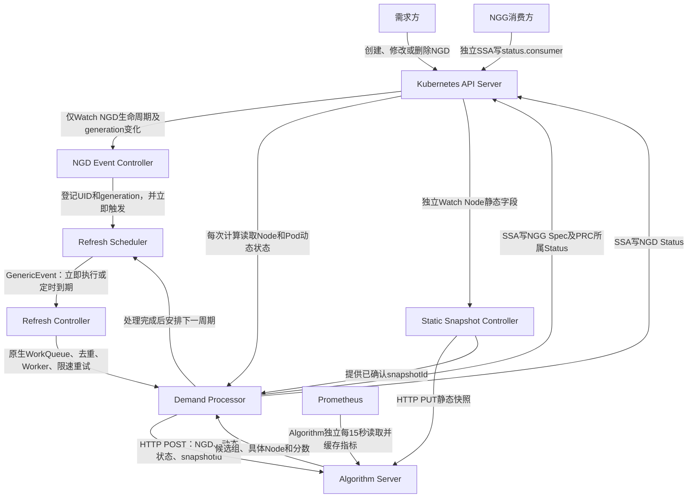

# PRC 事件驱动与周期刷新——当前实现说明 v1.0

> 更新日期：2026-09-03  
> 对应代码提交：`f89afde refactor: decouple PRC demand events and periodic refresh`  
> 说明范围：本文描述当前代码已经实现的行为，不把后续设计目标写成现状。

## 1. 当前实现结论

本次已把 PRC 的“NGD 事件处理”和“周期重新计算”拆开：

1. `NodeGroupDemandReconciler`只 Watch NGD 的创建、spec 修改和删除；
2. NGD Reconcile 不再通过`RequeueAfter: 15s`完成循环刷新；
3. `RefreshScheduler`只保存每个 NGD 的轻量定时状态，到期后发送`GenericEvent`；
4. `RefreshReconciler`使用 controller-runtime 原生 WorkQueue、去重、Worker、并发和错误重试；
5. `DemandProcessor`负责执行一次完整业务计算，即读取状态、调用 Algorithm、生成或更新 NGG；
6. 正式 NGD/NGG 的 Status 与 NGG Spec 使用 Server-Side Apply（SSA）分字段管理；
7. PRC 不写`status.consumer`，消费方写入的数据在周期刷新和 NGD 更新后仍能保留；
8. NGD 删除时会取消后续刷新、取消执行中的算法请求，并删除对应 NGG；
9. 已增加 Group5，覆盖创建、周期刷新、修改和删除完整生命周期。

当前没有实现完整的回收状态流转：

```text
Active → ReclaimRequested → Draining → Returned
```

目前 PRC 正常生成 NGG 时写`Active`；算法没有可行组且旧 NGG 存在时可写`Returned`。`ReclaimRequested`和`Draining`仍由后续消费/回收阶段实现。

---

## 2. 整体运行结构



这里有两条互相独立的数据链：

- 静态快照链：Node容量、Label或Leaf Annotation变化后，由Static Snapshot Controller独立同步给Algorithm；
- 任务计算链：NGD 到达或周期到期后，PRC 只发送完整 NGD、Node/Pod 动态状态和已确认的静态快照 ID。

Prometheus 指标不经过 PRC，由 Algorithm Server 自己定时读取并缓存。

---

## 3. 代码组件与职责

| 组件 | 代码位置 | 当前职责 |
|---|---|---|
| PRC 进程入口 | `prc/cmd/main.go` | 读取 Algorithm 地址、集群 ID、探针和 Leader Election 参数，创建并启动 Application |
| PRC 统一装配 | `prc/pkg/application/application.go` | 创建 Manager，并注册静态快照、NGD事件、刷新控制器及Scheduler |
| NGD Event Controller | `prc/pkg/controller/refresh_controller.go` | Watch NGD创建、generation变化和删除；不直接调用算法，不做循环Requeue |
| Refresh Controller | `prc/pkg/controller/refresh_controller.go` | 接收GenericEvent，用原生队列和Worker执行一次DemandProcessor |
| Refresh Scheduler | `prc/pkg/controller/refresh_scheduler.go` | 保存UID/generation、定时器和执行取消函数；负责立即或延时发事件 |
| Demand Processor | `prc/pkg/controller/prc_controller.go` | 完成一次NGD计算，构造算法请求，校验响应，写NGG和NGD Status |
| 静态快照控制器 | `prc/pkg/controller/static_snapshot_controller.go` | 只读取Node及其Leaf元数据，构造内容Hash快照并PUT给Algorithm；不读取NNT |
| 静态快照共享状态 | `prc/pkg/controller/snapshot.go` | 保存Algorithm已经确认的snapshotId及Ready状态 |
| Algorithm HTTP客户端 | `prc/pkg/controller/algorithm_client.go` | 调用静态快照和任务计算HTTP接口，并记录调试交换数据 |
| PRC RBAC | `config/rbac/prc.yaml` | 定义PRC读取Node/Pod/NGD、写Status、创建更新删除NGG等权限 |
| 生命周期集成测试 | `go_test_suites/group5_prc_refresh_lifecycle/group5_test.go` | 验证创建、周期刷新、修改、字段隔离和删除 |

### 3.1 启动与注册过程

```text
prc/cmd/main.go
  ↓ application.New(...)
创建 controller-runtime Manager
  ├─ 注册 NodeStaticSnapshotReconciler
  ├─ 创建并注册 RefreshScheduler（由Manager管理生命周期）
  ├─ 注册 NodeGroupDemandReconciler
  ├─ 注册 RefreshReconciler
  └─ 注册 healthz/readyz
  ↓ application.Start(ctx)
Manager启动Informer、Controller、原生队列和Worker
```

`main.go`和 Group3、Group4、Group5 使用同一个`application.New`装配入口，测试不会重新拼一套不同的 PRC Controller。

---

## 4. 四种核心运行流程

### 4.1 新建 NGD

```text
1. Kubernetes创建NGD，metadata.generation=1
2. GenerationChangedPredicate允许创建事件进入NGD Event Controller
3. PRC将NGD Status写为Pending
4. RefreshScheduler登记该NGD的UID和generation
5. Scheduler立即发送GenericEvent
6. Refresh Controller原生Worker调用DemandProcessor.Process
7. Processor读取Node/Pod动态状态和已确认snapshotId
8. Processor通过HTTP调用Algorithm Server
9. Algorithm返回按分数排序的候选组和具体Node
10. PRC选取rank 1，SSA创建NGG Spec并写NGG Status=Active
11. PRC写NGD Status=Fulfilled
12. 本次处理完成后，Scheduler安排“完成时间+15秒”的下一次刷新
```

正常周期不是固定墙上时钟，而是：

```text
NextRun = 本次处理完成时间 + 15秒
```

因此一次计算未结束时，不会因为15秒到期再重叠启动同一个 NGD 的第二次计算。

### 4.2 NGD 未修改时的周期刷新

```text
定时器到期
  → Scheduler发送GenericEvent
  → Refresh Controller原生队列接收
  → DemandProcessor重新读取Node/Pod动态状态
  → 再次调用Algorithm
  → SSA更新同一个NGG
  → NGD保持Fulfilled
  → 处理完成后再安排下一次15秒刷新
```

周期刷新不会修改 NGD spec，所以`metadata.generation`保持不变。若算法结果也完全没有变化，SSA可能不会增加 NGG generation，这是 Kubernetes 的正常行为。

### 4.3 修改 NGD spec

Kubernetes 在 spec 变化后自动增加`metadata.generation`。PRC 当前处理如下：

```text
1. NGD Event Controller收到generation变化
2. NGD Status写为Updating
3. Scheduler停止旧generation的定时器
4. Scheduler取消旧generation正在进行的HTTP上下文
5. 新generation立即进入Refresh Controller队列
6. DemandProcessor按新spec重新计算
7. 写入算法结果前再次GET NGD
8. UID/generation一致才允许更新原NGG
9. NGD Status恢复为Fulfilled
```

即使旧算法请求未及时响应，写结果前的`demandStillCurrent`检查也会丢弃过期结果，防止旧需求覆盖新需求。

修改 NGD 不会驱逐或迁移已经运行的 Pod。PRC 只更新资源组结果，正在运行工作负载的后续处理不属于当前实现范围。

### 4.4 删除 NGD

```text
1. NGD Event Controller GET得到NotFound
2. RefreshScheduler.Remove删除该Key
3. 停止下一次定时器
4. 取消当前执行上下文和算法HTTP请求
5. PRC删除确定性命名的对应NGG
6. 后续不再产生该NGD的周期算法调用
```

正式 NGG 还带有指向正式 NGD 的 OwnerReference，Kubernetes 垃圾回收作为删除兜底。

删除 NGD/NGG 不等于删除已经运行的 Pod；当前 PRC 不负责排空、迁移或终止业务 Pod。

---

## 5. 队列、并发和取消机制

### 5.1 哪些使用 controller-runtime 原生能力

当前使用原生能力完成：

- WorkQueue；
- 相同 NamespacedName Key 去重；
- 并发 Worker；
- Reconcile 返回 error 后的限速重试；
- Manager Context 取消；
- Leader Election 下的组件启停。

默认刷新 Worker 并发数是5，通过`MaxConcurrentReconciles`配置。它表示最多可同时处理5个不同 NGD，并不是创建5个 Kubernetes Worker Node。

### 5.2 PRC 自己实现了什么

`RefreshScheduler`只维护每个 NGD 的轻量状态：

```text
NamespacedName
  ├─ UID
  ├─ generation
  ├─ 下一次time.Timer
  └─ 当前执行context.CancelFunc
```

默认 GenericEvent 缓冲区大小为1024。它不是业务任务积压上限；真正的排队、去重和重试由 controller-runtime WorkQueue 管理。

### 5.3 特殊重试时间

- 正常成功：完成后15秒再次刷新；
- Algorithm暂时失败或静态快照未Ready：当前处理结果给出10秒重试提示；
- legacy任务等待：仍保留5秒/2秒轮询提示；
- Reconcile直接返回error：交给原生限速队列重试。

---

## 6. 正式 NGD/NGG 的读写边界

### 6.1 PRC 对 NGD

| 字段 | PRC行为 |
|---|---|
| `metadata.generation` | 只读，由Kubernetes在spec变化时自动维护 |
| `spec` | 只读，完整透传给Algorithm；当前算法主要处理资源、nodeSelector和拓扑要求 |
| `status.phase` | PRC写入Pending、Updating、Fulfilled或Failed |
| `status.grantRef` | PRC写入关联NGG名称 |
| `status.resolvedNodeCount` | PRC写入已解析Node数量 |
| `status.lastUpdated/message` | PRC写入本次处理信息 |

### 6.2 PRC 对 NGG

| 字段 | PRC行为 |
|---|---|
| `spec` | PRC通过SSA创建或更新，只输出Algorithm rank 1候选组的具体Node |
| `status.phase` | 正常结果写Active；无可行组且已有NGG时可写Returned |
| `status.resolvedCapacity` | PRC写入Node数、CPU和内存汇总 |
| `status.consumer` | PRC不写、不清空，由消费方自己的Field Manager维护 |

当前 SSA Field Manager：

| Field Manager | 所有者范围 |
|---|---|
| `ngd-ngg-prc-spec` | 正式NGG的metadata及spec |
| `ngd-ngg-prc-status` | PRC负责的正式NGD/NGG status字段 |
| 消费方自定义manager | `status.consumer`等消费结果 |

正式 CR 使用 SSA；项目为了兼容旧 Demo CR，legacy路径的 Status 仍使用 MergePatch。

### 6.3 当前状态行为

NGD 已实现状态：

```text
创建：空 → Pending → Fulfilled
修改：Fulfilled → Updating → Fulfilled
失败：Pending/Updating/Fulfilled → Failed
```

需要注意：当前正式路径遇到参数不支持、静态快照未就绪、算法请求失败、算法响应无效或没有可行组时，会写`Failed`；其中可重试错误仍会在10秒后重新计算。尚未实现“周期刷新一次失败但继续保留Fulfilled”的更细故障语义。

NGG 当前实际使用：

```text
正常可用：Active
无可行组且旧NGG存在：Returned
```

`ReclaimRequested`和`Draining`没有在本阶段实现。

---

## 7. Algorithm 请求与 NGG 结果

PRC 每次正式计算发送的主要数据为：

```text
requestId
taskUID / ngdUID / ngdGeneration
requestMode=resourcePool
完整NGD spec
nodeStaticSnapshotId
schedulerStateSnapshotId
schedulerStateCapturedAt
schedulerState（Node/Pod动态资源状态）
```

静态 Node 与上层拓扑本体不随每个 NGD 重复发送，只传 Algorithm 已确认的内容 Hash `nodeStaticSnapshotId`。

Algorithm 返回最多3个候选组，但正式联通 NGG 当前只写排名第一的组：

```text
candidateNodeGroups[0]
  ├─ groupId
  ├─ groupScore
  ├─ topologyLevel
  └─ nodes[]
       ├─ nodeName
       ├─ score
       ├─ resources
       └─ topology
```

PRC 不重新评分、不重新排序，直接将 rank 1 转成联通正式 NGG 的扁平`spec.nodes[]`。

---

## 8. 当前测试与运行方法

### 8.1 Group4：单次完整计算

Group4 验证一次完整主链路：

```text
真实envtest API Server/etcd
  → 真实PRC Application Watch NGD
  → 真实HTTP调用Algorithm Go Server
  → Algorithm通过JSONL调用真实Python Worker
  → PRC创建正式NGG
  → 测试从Kubernetes GET并校验NGG
```

Mock部分只有 Kubernetes运行环境、Prometheus数据和输入节点；PRC、Algorithm Go Server及Python Worker均使用项目真实代码。

运行：

```bash
cd /mnt/data0/volcano-scheduler/ngd-ngg-scheduling-demo
. ./scripts/go-test-env.sh
go test -p=1 ./go_test_suites/group4_full_real_algorithm \
  -run '^TestGroup4_' -v -count=1 -timeout=10m
```

最近一次全量回归的 Group4 业务耗时为`363.278 ms`；测试进程总耗时约`10.584 s`，其中还包含环境启动、数据预热、断言和结果文件生成，不能与业务耗时混用。

### 8.2 Group5：循环刷新和生命周期

Group5 在 Group4 真实链路基础上继续验证：

1. 创建 NGD，生成15个Node的 Active NGG；
2. 消费方通过独立 SSA 写`status.consumer`；
3. NGD不修改，周期重新计算且generation仍为1；
4. 修改NGD资源需求，generation变为2，同一个NGG更新为10个Node；
5. 删除NGD，对应NGG删除，Algorithm调用次数停止增长。

为了缩短自动化测试时间，Group5 将生产默认15秒改为测试配置250毫秒；代码路径和周期机制相同。

运行：

```bash
cd /mnt/data0/volcano-scheduler/ngd-ngg-scheduling-demo
. ./scripts/go-test-env.sh
go test -p=1 ./go_test_suites/group5_prc_refresh_lifecycle \
  -run '^TestGroup5_' -v -count=1 -timeout=10m
```

最近一次回归结果：

| 阶段 | 验证结果 | 业务边界耗时 |
|---|---|---:|
| 首次创建 | generation=1，NGG Active，15 Node | 386.813 ms |
| 无修改周期刷新 | generation仍为1，consumer保留 | 518.442 ms |
| 修改需求 | generation=2，原NGG更新为10 Node | 288.958 ms |
| 删除需求 | NGG删除，后续无新增算法调用 | 14.803 ms |

周期刷新耗时包含测试配置的250毫秒等待。结果文件写盘不在业务计时区间内。

每次运行的证据输出位于：

```text
go_test_suites/group5_prc_refresh_lifecycle/results/<timestamp>/actual/
├── 01-created-ngd.yaml
├── 02-initial-ngg.yaml
├── 03-periodic-ngg.yaml
├── 04-updated-ngd.yaml
├── 05-updated-ngg.yaml
├── 06-consumer-status.yaml
├── 07-algorithm-exchanges.json
├── 08-lifecycle-summary.json
└── python-worker/
```

### 8.3 全部回归

```bash
cd /mnt/data0/volcano-scheduler/ngd-ngg-scheduling-demo
make go-test-all
```

本次实现已通过：

- Group1～Group5 全量 Go Test；
- `go test -race ./prc/pkg/controller -count=1`；
- `go vet ./prc/...`。

---

## 9. 当前尚未实现的内容

为避免对当前能力产生误解，以下内容仍不属于本次已完成实现：

1. `ReclaimRequested → Draining → Returned`完整消费和回收流程；
2. PRC主动驱逐、迁移或终止已经运行的Pod；
3. 消费方对`status.consumer`的具体业务实现；
4. 周期刷新瞬时失败时保持旧`Fulfilled/Active`的容错状态模型；
5. 删除NGD前等待业务Pod排空的协作流程；
6. legacy CR路径完全迁移为联通正式CR和SSA。

当前版本已经解决的是：NGD 事件只进入事件控制器、周期任务独立运行、使用原生队列和 Worker、更新结果防过期、字段写入不互相覆盖，以及删除后停止刷新并清理 NGG。
