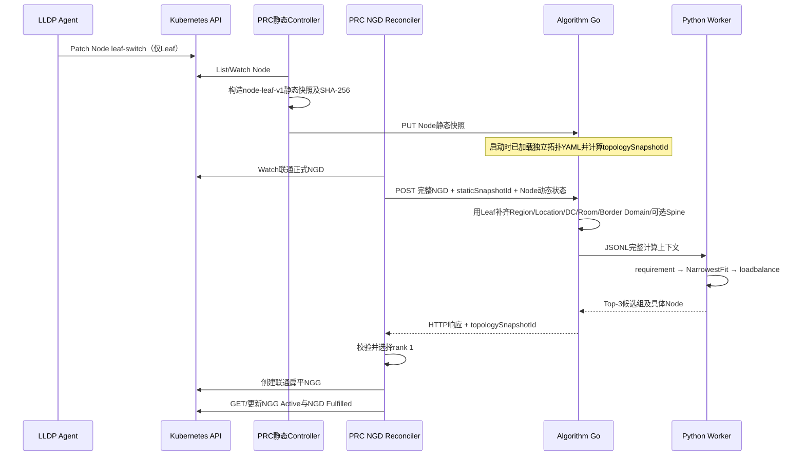

# 联通 Border Domain 拓扑实现与测试说明

> 实现日期：2026-09-02  
> 基线提交：`f81c3b1`（本轮开发开始前已提交）

## 1. 实现结论

本轮已经按以下边界实现：

1. LLDP Agent只发现Node直连的Leaf；
2. Kubernetes Node只持久化`topology.demo.ngg.io/leaf-switch`，不再保存Border、Spine、区域或链路指标；
3. PRC的Node静态快照只包含Node身份、容量、标签和`leafSwitchId`；
4. Region、Location、DataCenter、Room、Border、Spine、Leaf互联和链路参数保存在Algorithm Server独立YAML；
5. 双Border通过显式、非重叠的Border Domain建模；
6. `SPINE: {}`合法，算法会跳过空Spine层；
7. 正式NGD严格使用联通原始CRD，不增加拓扑profile、算法编排字段或拓扑配置；
8. Algorithm固定执行`requirement → topology → loadbalance`，最多返回3个候选组；
9. 正式PRC只选择rank 1，生成联通扁平NGG。

## 2. 数据结构

```text
华北 Region
└── 怀来 Location
    └── HB-HL-DC1 DataCenter
        └── HB-HL-DC1-102 Room
            └── Border Domain（双Border，组间不重叠）
                └── Spine Domain（可选；本次样例为空）
                    └── Leaf Switch
                        └── Kubernetes Node（第一版一个Node连接一个Leaf）
```

联通102机房样例配置位于：

- `config/topology/unicom-huailai-102-sample.yaml`

Kind三交换机部署配置位于：

- `config/topology/unicom-kind-topology.yaml`
- `config/manager/algorithm.yaml`中的同名ConfigMap和挂载配置

配置仍保留联通给出的结构：

```yaml
topology:
  HB-HL-DC1-102:
    <LEAF名称>:
      SPINE: {}
      BORDER:
        <BORDER-1>: {local_port: ..., peer_port: ...}
        <BORDER-2>: {local_port: ..., peer_port: ...}
      LEAF: {}
```

另外增加`scopes`和`borderDomains`，明确上层范围及两台Border如何构成一个调度域。Algorithm要求某Leaf的Border集合与一个显式Domain的成员集合完全一致，避免同一Node落入两个重叠Border候选组。

## 3. 代码流程



关键代码：

| 路径 | 功能 |
|---|---|
| `topology_agent/agent.go` | 采集/模拟Node直连Leaf并只写Leaf Label |
| `prc/pkg/controller/snapshot.go` | 从Node构造只含Leaf的静态快照 |
| `algorithm_server/go/algorithm/topology.go` | 解析、校验、Hash独立拓扑并按Leaf补齐上层关系 |
| `algorithm_server/go/algorithm/service.go` | 合并静态快照与拓扑缓存后调用Python |
| `algorithm_server/python/algorithm_worker/algorithms/topology.py` | 固定层级NarrowestFit |
| `prc/pkg/controller/prc_controller.go` | 选择rank 1并把候选拓扑转换为联通NGG字段 |

## 4. 模拟数据与需求

标准Group1～Group4使用1000个内存/envtest Node：

- 1个Region、1个Location、1个DataCenter、1个Room；
- 4个显式Border Domain，每组有2台Border；
- 50个Leaf，每个Leaf连接20个Node；
- SPINE全部为空；
- Node Label只有测试筛选标签和直连Leaf；
- 每个Node为32 CPU、128Gi内存，约三分之一Node模拟为占用；
- Algorithm从带Bearer认证的Mock Prometheus读取14项Node指标。

资源需求故意设置为至少15个Node：单Leaf只剩约13～14个可用Node，无法满足；空Spine被跳过；Border Domain可以满足。因此预期候选层级必须是`borderDomain`。

可查看的输入包括：

- `go_test_suites/group4_full_real_algorithm/testdata/input/node-static-snapshot.json`
- `go_test_suites/group4_full_real_algorithm/testdata/input/network-topology.yaml`
- `go_test_suites/group4_full_real_algorithm/testdata/input/resolved-node-static-snapshot.json`
- `go_test_suites/group4_full_real_algorithm/testdata/input/ngd.yaml`

## 5. 测试方法与结果

### 5.1 拓扑解析和LLDP边界

```bash
cd /mnt/data0/volcano-scheduler/ngd-ngg-scheduling-demo
source scripts/go-test-env.sh

cd algorithm_server/go
go test ./algorithm -run 'TestUnicomTopology|TestRepositoryTopology' -v

cd ../../topology_agent
GOWORK=off go test ./... -run TestSimulatedLLDPWritesOnlyDirectLeafAsNodeLabel -v
```

它们分别验证：联通长设备名可以解析、双Border归入同一Domain、空Spine合法，以及Node Patch中没有任何上层拓扑Label。

### 5.2 四组测试

```bash
cd /mnt/data0/volcano-scheduler/ngd-ngg-scheduling-demo
source scripts/go-test-env.sh
go test -p=1 ./go_test_suites/group1_algorithm_worker -run '^TestGroup1_' -v -count=1
go test -p=1 ./go_test_suites/group2_prc_algorithm -run '^TestGroup2_' -v -count=1
go test -p=1 ./go_test_suites/group3_prc_ngd_ngg -run '^TestGroup3_' -v -count=1
go test -p=1 ./go_test_suites/group4_full_real_algorithm -run '^TestGroup4_' -v -count=1
```

2026-09-02本轮运行结果：

| 测试 | 业务计时边界 | 时间 | 结果 |
|---|---|---:|---|
| Group1 | Go写Prepared JSONL → Go解析Python响应 | 151.998 ms | PASS |
| Group2 | PRC客户端POST暖缓存Algorithm → 解析响应 | 213.059 ms | PASS |
| Group3 | PRC观察到NGD → Mock Algorithm → NGG Active | 42.370 ms | PASS |
| Group4 | PRC观察到NGD → 真实Algorithm/Python → NGG Active | 273.529 ms | PASS |

Group2/Group4真实Algorithm结果均为：

```text
rank 1: border-domain:HB-HL-DC1-102-BORDER-DOMAIN-01，15 Node
rank 2: border-domain:HB-HL-DC1-102-BORDER-DOMAIN-04，15 Node
rank 3: border-domain:HB-HL-DC1-102-BORDER-DOMAIN-03，15 Node
```

Group4最终NGG只有rank 1的一组Node。每个NGG Node的拓扑字段来自Algorithm响应，而不是从Node上寻找已删除的Border Label：

```yaml
topology:
  dataCenter: HB-HL-DC1
  convergenceSwitch: HB-HL-DC1-102-BORDER-DOMAIN-01
  accessSwitch: leaf-xxx
```

最新单次运行证据在`go_test_suites/group4_full_real_algorithm/results/<run-id>/actual/`，主要查看`algorithm-response.json`、`ngg-raw.yaml`和`prc-allocation-request.json`。

### 5.3 3000 Node冒烟验证

本轮还用3000个内存/envtest Node对1000、500、10三种需求各跑1次，验证层级放宽和代码可运行；单样本不用于P50/P95结论：

| 组 | 1000 Node | 500 Node | 10 Node | 结果 |
|---|---:|---:|---:|---|
| Group1 | 415.498 ms | 411.842 ms | 354.063 ms | PASS |
| Group2 | 511.830 ms | 539.344 ms | 413.150 ms | PASS |
| Group3 | 548.432 ms | 275.390 ms | 117.378 ms | PASS |
| Group4 | 1075.366 ms | 851.364 ms | 574.249 ms | PASS |

1000 Node需求在Border Domain容量不足时扩大到Room；500 Node停在Border Domain；10 Node停在Leaf，从而覆盖了三种NarrowestFit路径。

### 5.4 1000 Node独立容器演示

Algorithm镜像已使用随源码vendor的YAML依赖成功离线构建，避免目标环境构建时依赖公网：

```bash
make algorithm-image
make algorithm-1000-demo
```

本轮结果为PASS。第一次Top-3为Domain 03、01、02；将Domain 03覆盖的全部Node置为占用后，第二次Top-3变为01、02、04，证明独立拓扑配置被读取、Border Domain分组生效，且请求级动态状态会改变结果。证据位于`results/algorithm-1000-nodes/`。

## 6. 当前边界

- 第一版按一个Node连接一个Leaf处理；多网卡、多Leaf选择尚未实现；
- 上层拓扑配置在Algorithm启动时加载，当前不支持运行时热更新；
- 真实LLDP仍需在联通物理网络验证设备标识与Leaf配置键完全一致；
- 正式扁平NGG到Volcano/kube-scheduler插件的最终消费仍是后续工作。
