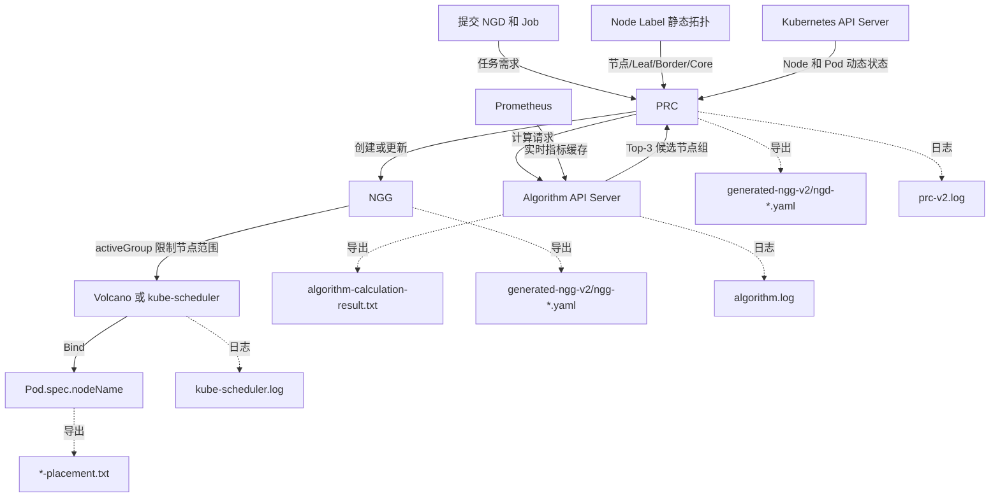

# 一次 Demo 运行生成文件说明

## 1. 文档目的

本文说明 `ngd-ngg-scheduling-demo` 一次运行过程中，会在 `results/` 下生成哪些文件、每个文件由哪个步骤产生，以及在哪里查看算法选择和 Pod 最终分配结果。

项目目录：

```text
/mnt/data0/volcano-scheduler/ngd-ngg-scheduling-demo
```

结果目录：

```text
/mnt/data0/volcano-scheduler/ngd-ngg-scheduling-demo/results
```

需要特别注意：当前结果目录不是按运行批次隔离的。同名文件会被新一次运行覆盖，目录中也可能同时保留历史版本、镜像构建、Prometheus 检查和 1000 节点独立 Demo 的结果。因此，不能认为 `results/` 中的所有文件都来自最近一次 `make run`。

## 2. 运行命令与范围

当前 Makefile 中的入口如下：

| 命令 | 实际执行内容 | 是否运行 Volcano 路径 | 是否运行 kube-scheduler 路径 |
|---|---|---:|---:|
| `make run` | 执行 `scripts/08-run-demo.sh` | 是 | 否 |
| `make run-kubernetes` | 执行 `scripts/09-run-kubernetes-demo.sh` | 否 | 是 |
| `make demo` | 环境检查、测试、创建集群、安装 Volcano/Prometheus、构建部署组件，再执行前面两个运行脚本 | 是 | 是 |
| `make demo-prebuilt` | 使用预构建镜像部署，再执行两个运行脚本 | 是 | 是 |
| `make algorithm-1000-demo` | 独立运行 1000 节点 Algorithm Server Demo | 否 | 否 |

如果只想重新验证已经部署好的集群，依次执行：

```bash
make run
make run-kubernetes
```

## 3. 一次完整调度的文件生成关系



这几个结果分别回答不同问题：

1. `algorithm-calculation-result.txt`：算法返回了哪些候选组；
2. `ngg-*.yaml`：PRC 最终激活并锁定了哪个候选组；
3. `*-placement.txt`：每个 Pod 最终绑定到了哪个具体 Node。

## 4. `make run` 生成的 Volcano 路径文件

`make run` 执行 `scripts/08-run-demo.sh`，验证 VolcanoJob、Top-3 候选组、候选组降级切换和首个 Pod 绑定后锁组。

### 4.1 算法计算摘要

文件：

```text
results/algorithm-calculation-result.txt
```

包含：

- 当前部署的 Algorithm Server 镜像；
- Algorithm Server 可用副本数；
- 最多三个候选节点组的 `rank`、`groupId` 和 `groupScore`；
- 每组包含的 Node 数量；
- 静态节点快照、动态调度状态和 Prometheus 指标快照的 Hash；
- Algorithm Server 本次启动身份。

该文件展示的是第一层算法输出摘要，不是 Pod 最终落点。

### 4.2 Volcano NGD 快照

文件：

```text
results/generated-ngg-v2/ngd-topology.yaml
```

包含：

- 关联的 VolcanoJob；
- Pod 副本数和 `minAvailable`；
- 每个 Pod 的 CPU、内存需求；
- Node Selector；
- 拓扑约束；
- 算法编排顺序；
- 候选组数量、超时和 TTL 策略；
- PRC 处理后的 `Fulfilled` 或其他状态。

NGD 表示“任务需要什么”。

### 4.3 Volcano NGG 快照

文件：

```text
results/generated-ngg-v2/ngg-topology.yaml
```

包含：

- Algorithm 返回的 Top-3 `candidateNodeGroups`；
- 每个候选组的组分数；
- 每个候选组允许使用的 Node；
- 当前 `activeGroupRef`；
- 候选组尝试超时策略；
- 是否已经锁组；
- 已绑定 Pod 数量；
- 计算使用的各类快照 Hash；
- NGG 有效期和 revision。

NGG 表示“任务当前允许在哪个节点组调度”。它只限定可用 Node 范围，不直接指定每个 Pod 必须落到哪一个 Node。

当前降级演示会临时给 `switch-c` 的节点添加 Taint。算法仍然把 `switch-c` 排在第一位，但第二层无法在该组绑定 Pod，PRC 在尝试超时后切换到第二候选 `switch-a`。

### 4.4 当前 Node 和拓扑输入快照

文件：

```text
results/generated-ngg-v2/topology-labeled-nodes.yaml
```

这是带 `demo.ngg/worker=true` 标签的 Worker Node 完整导出，主要包含：

- Node 名称和 UID；
- CPU、内存和 Pod 容量；
- Node Ready、压力等运行状态；
- Leaf、Border、Core 三层拓扑标签；
- 带宽、延迟、采集来源和拓扑版本；
- kubelet、容器运行时和节点地址等 Kubernetes 原生信息。

当前正式实现由 PRC 和 Algorithm Server读取 Node Label 中的拓扑信息。

### 4.5 旧拓扑对照快照

文件：

```text
results/generated-ngg-v2/node-network-topologies-legacy.yaml
```

该文件导出旧版 `NodeNetworkTopology` CR，仅用于迁移期对照。当前调度主流程不读取它，可以移除；但 `scripts/08-run-demo.sh` 目前仍包含对应导出命令，删除文件后再次运行还会重新生成。

`node-network-topologies.yaml` 是更早版本留下的同类历史文件，当前运行脚本不会生成它。

### 4.6 Volcano Pod 最终分配结果

文件：

```text
results/topology-placement.txt
```

每行表示一个 Pod 的最终调度结果，例如：

```text
ngg-topology-worker-0  node=volcano-ngd-ngg-v2-demo-worker  switch=switch-a  activeAllowed=yes
```

字段含义：

| 字段 | 含义 |
|---|---|
| Pod 名称 | 被调度的任务 Pod |
| `node` | Pod 的最终 `spec.nodeName` |
| `switch` | 该 Node 所属的 Leaf 交换机 |
| `activeAllowed` | Node 是否属于 NGG 当前激活候选组 |

这是 Volcano 路径最直接的最终分配结果。

### 4.7 Volcano 运行状态快照

文件：

```text
results/topology-cluster-state.txt
```

集中保存运行结束时的：

- Node 及三层拓扑标签；
- 旧 NNT 对照状态；
- LLDP Agent DaemonSet 和 Pod 状态；
- NGD、NGG 状态；
- 所有 Demo Pod 的 Node 落点。

该文件用于快速检查整个集群状态和问题定位。

### 4.8 Volcano 路径过程日志

| 文件 | 来源 | 主要用途 |
|---|---|---|
| `results/algorithm.log` | `ngd-ngg-algorithm` Deployment | 查看算法请求、流水线执行、候选组和指标缓存情况 |
| `results/prc-v2.log` | `prc` Deployment | 查看 NGD reconcile、算法调用、NGG 创建、切组和锁组 |
| `results/lldp-agent.log` | `lldp-agent` DaemonSet | 查看节点拓扑采集、静态拓扑合并和 Node Label 写入 |

## 5. `make run-kubernetes` 生成的文件

`make run-kubernetes` 执行 `scripts/09-run-kubernetes-demo.sh`，验证 Kubernetes Job 和自定义 kube-scheduler NGG 插件。

### 5.1 Fail Closed 结果

文件：

```text
results/kubernetes-fail-closed.txt
```

脚本先创建 Kubernetes Job，但暂时不创建 NGD。自定义调度插件发现任务没有有效 NGG，因此不允许 Pod 调度。文件中应看到这些 Pod 处于 `Pending`，且 `NODE` 为空。

该文件用于证明：受管任务缺少有效 NGG 时不会绕过第一层资源组限制。

### 5.2 Kubernetes NGD 快照

文件：

```text
results/generated-ngg-v2/ngd-kubernetes.yaml
```

它与 Volcano NGD 表达相同的资源和拓扑需求，但关联对象是 Kubernetes 原生 `batch/v1 Job`，调度器名称为自定义 `ngg-scheduler`。

### 5.3 Kubernetes NGG 快照

文件：

```text
results/generated-ngg-v2/ngg-kubernetes.yaml
```

包含 Kubernetes Job 的 Top-3 候选节点组、当前激活组、允许节点、锁组状态和已绑定 Pod 数量。

### 5.4 Kubernetes Pod 最终分配结果

文件：

```text
results/kubernetes-placement.txt
```

这是 `kubectl get pod -o wide` 的结果，重点查看：

- `STATUS`：Pod 当前状态；
- `NODE`：Pod 最终绑定的 Node；
- `NOMINATED NODE`：抢占等场景下的候选 Node，本 Demo 通常为空。

脚本还会逐个检查 Pod 的 Node 是否属于 NGG 当前 `activeGroupRef`，如果存在越界绑定，运行会直接失败。

### 5.5 kube-scheduler 插件日志

文件：

```text
results/kube-scheduler.log
```

它来自 `kube-system/ngg-scheduler` Deployment，用于检查自定义 kube-scheduler NGG 插件的过滤、放行和故障关闭行为。

## 6. `make demo` 构建和监控阶段的附加文件

执行完整 `make demo` 或相应子命令时，还会生成构建、测试和监控检查文件。这些不是单次调度决策本身，但用于证明运行环境和组件状态。

### 6.1 镜像信息

| 文件 | 内容 |
|---|---|
| `prc-image.txt` | PRC 镜像构建结果 |
| `algorithm-image.txt` | Algorithm Server 镜像构建结果 |
| `lldp-agent-image.txt` | LLDP Agent 镜像构建结果 |
| `scheduler-image.txt` | 自定义 Volcano Scheduler 镜像信息 |
| `kube-scheduler-image.txt` | 自定义 kube-scheduler 镜像信息 |

### 6.2 插件构建和测试日志

| 文件 | 内容 |
|---|---|
| `plugin-test.log` | Volcano NGG 插件测试结果 |
| `scheduler-build.log` | Volcano Scheduler 编译日志 |
| `scheduler-image-build.log` | Volcano Scheduler 镜像构建日志 |
| `kube-scheduler-plugin-test.log` | kube-scheduler NGG 插件测试结果；由独立插件测试命令产生 |

### 6.3 Prometheus 检查结果

| 文件 | 内容 |
|---|---|
| `prometheus-targets.json` | Prometheus 抓取目标和健康状态 |
| `prometheus-query-checks.txt` | PromQL 查询检查摘要 |
| `prometheus-node-cpu.json` | 节点 CPU 指标查询结果 |
| `prometheus-node-memory.json` | 节点内存指标查询结果 |
| `monitoring-pods.txt` | monitoring 命名空间 Pod 状态 |
| `algorithm-metrics-cache-status.json` | Algorithm Server 内部指标缓存状态 |

## 7. 1000 节点独立 Demo 文件

目录：

```text
results/algorithm-1000-nodes/
```

它只由 `make algorithm-1000-demo` 更新，不属于主集群 `make run` 的输出。

| 文件 | 内容 |
|---|---|
| `node-static-snapshot.json` | 1000 个模拟节点的静态属性和资源容量 |
| `topology.json` | 模拟节点的 Leaf、Border、Core 拓扑关系 |
| `prometheus-metrics.json` | 1000 个节点的模拟 Prometheus 指标 |
| `node-dynamic-state.json` | PRC 随请求提供的节点动态调度状态 |
| `allocation-request-1.json` | 第一次算法请求 |
| `allocation-response-1.json` | 第一次算法响应 |
| `allocation-request-2.json` | 第二次算法请求，用于验证缓存复用等行为 |
| `allocation-response-2.json` | 第二次算法响应 |
| `algorithm-server.log` | 独立 Algorithm Server 日志 |
| `demo-summary.json` | 候选组、耗时、缓存和规模统计摘要 |

## 8. 历史残留文件

当前 `results/` 中还可能存在以下旧版文件：

```text
generated-ngg/
placement.txt
cluster-state.txt
plugin.log
generated-ngg-v2/node-network-topologies.yaml
```

它们不是当前 `scripts/08-run-demo.sh` 和 `scripts/09-run-kubernetes-demo.sh` 的正式结果，查看最新演示时应优先使用 `generated-ngg-v2/`、`topology-placement.txt` 和 `kubernetes-placement.txt`。

## 9. 如何快速判断一次演示是否成功

### 9.1 Volcano 路径

检查：

```bash
cat results/algorithm-calculation-result.txt
cat results/topology-placement.txt
kubectl --context kind-volcano-ngd-ngg-v2-demo \
  -n ngd-ngg-demo get ngg/ngg-topology -o yaml
```

成功条件：

1. Algorithm 返回三个按分数排序的候选组；
2. `activeGroupRef` 最终为预期候选组；
3. `activeGroupState=Locked`；
4. `boundPodCount=4`；
5. `topology-placement.txt` 中所有 `activeAllowed=yes`。

### 9.2 Kubernetes Job 路径

检查：

```bash
cat results/kubernetes-fail-closed.txt
cat results/kubernetes-placement.txt
kubectl --context kind-volcano-ngd-ngg-v2-demo \
  -n ngd-ngg-demo get ngg/ngg-kubernetes -o yaml
```

成功条件：

1. 创建 NGD 前，Pod 全部 Pending 且没有 Node；
2. 创建 NGD 和 NGG 后，四个 Pod 均完成绑定；
3. `activeGroupState=Locked`；
4. `boundPodCount=4`；
5. 所有 Pod 的 Node 都属于当前激活候选组。

## 10. 当前文件管理特点

当前脚本直接覆盖固定文件名，例如：

```text
results/topology-placement.txt
results/generated-ngg-v2/ngg-topology.yaml
results/algorithm.log
```

这种方式便于快速查看最新结果，但不适合长期保存多次实验。如果后续需要比较不同算法或不同参数，建议改成以下结构：

```text
results/runs/<运行时间>/
├── metadata.txt
├── volcano/
│   ├── ngd.yaml
│   ├── ngg.yaml
│   ├── placement.txt
│   └── logs/
└── kubernetes/
    ├── ngd.yaml
    ├── ngg.yaml
    ├── placement.txt
    └── logs/
```

在尚未改造前，应结合文件修改时间判断某个文件是否属于当前一次运行：

```bash
find results -maxdepth 2 -type f \
  -printf '%TY-%Tm-%Td %TH:%TM:%TS %p\n' | sort
```
