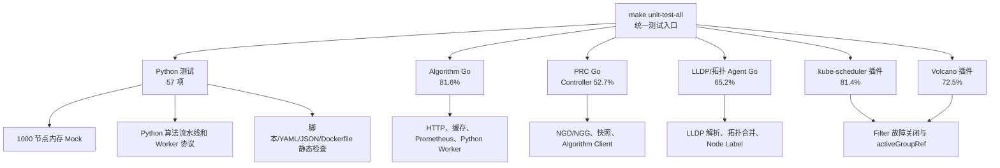

# 单元测试覆盖与执行结果

## 1. 测试结论

截至 2026 年 8 月 17 日，项目当前主要代码模块均已纳入自动化测试，统一执行结果为 **PASS**。

- Python 测试：57 项，全部通过；
- Go 测试：66 个 `Test...` 测试函数，全部通过；
- Algorithm Go 服务覆盖率：81.6%；
- PRC Controller 覆盖率：52.7%；
- LLDP/拓扑 Agent 覆盖率：65.2%；
- kube-scheduler NGG 插件覆盖率：81.4%；
- Volcano NGG 插件覆盖率：72.5%；
- Shell、JSON、Kubernetes YAML 和 Dockerfile 已加入静态检查。

本次全量执行约耗时 88 秒，机器上没有创建 1000 个真实 Kubernetes Node；1000 节点测试使用内存 Mock 数据完成，因此不会给当前服务器或 Kind 集群造成 1000 节点的运行压力。

### 1.1 测试是否全部通过

**是的，当前已经定义并执行的单元测试和集成演示均已通过。**

- 单元测试通过率为 100%：Python 57 项测试和 Go 66 个测试函数均无失败；
- Volcano 集成演示通过：已验证 Algorithm 计算、PRC 生成 NGG、Top-3 候选组降级切换、当前组锁定和最终 Pod 调度；
- kube-scheduler 集成演示通过：已验证缺少有效 NGG 时故障关闭，以及创建 NGD/NGG 后恢复调度；
- Prometheus 指标读取、Algorithm API Server 部署以及 PRC 与 Algorithm 的 HTTP 调用链路均已在 Demo 中验证。

因此，当前项目可以表述为：

> 当前项目的单元测试通过率为 100%，Volcano 与 kube-scheduler 两条集成演示链路均已验证通过。代码覆盖率尚未达到 100%，未覆盖部分主要是进程启动、真实网络和 Kubernetes 运行环境相关代码。

### 1.2 为什么覆盖率不是 100%

“测试通过率”和“代码覆盖率”是两个不同指标：

- **测试通过率 100%**：表示本次执行的测试没有失败；
- **代码覆盖率 52.7%～81.6%**：表示单元测试实际执行到了对应模块中多少可执行代码，并不表示只有这些比例的测试通过。

未被单元测试直接执行的代码主要是 Controller Manager 启动、Informer/Watch、真实网卡 LLDP 收包、进程信号、真实 Kubernetes API 和真实 Prometheus 网络交互。这些部分依赖运行环境，已经通过集成 Demo 验证其中的主要链路，但不能据此宣称所有可能的异常场景或每一行代码都已得到验证。

## 2. 测试覆盖结构



## 3. 各模块具体测了什么

| 模块 | 生产代码位置 | 测试位置 | 主要验证内容 |
|---|---|---|---|
| Algorithm API Server（Go） | `algorithm_server/go/` | 同目录下 `*_test.go` | HTTP 接口、静态快照缓存、Prometheus 指标缓存、资源数量转换、候选组结果处理、Go 调用 Python Worker、超时和异常处理 |
| Algorithm 算法（Python） | `algorithm_server/python/` | `tests/test_algorithm_*.py` | requirement、topology、loadbalance 流水线，节点视图构造，JSON Lines Worker 协议，非法输入和错误返回 |
| PRC（Go） | `prc/` | `prc/**/*_test.go` | Algorithm HTTP Client、静态/动态快照、旧拓扑兼容、候选组协议校验、NGG 生成策略、控制器辅助逻辑 |
| LLDP/拓扑 Agent（Go） | `topology_agent/` | 同目录下 `*_test.go` | LLDP 文本解析、静态 Leaf→Border→Core 配置合并、Kubernetes Node 查询/PATCH/Watch、模拟采集、Label 恢复、Cobra 参数 |
| kube-scheduler NGG 插件 | `plugin/kubescheduler/nodegroupgrant/` | 同目录下 `*_test.go` | 缺少有效 NGG 时故障关闭、任务 Owner/UID 匹配、activeGroupRef 限制、候选 Node 过滤、Store 更新和删除 |
| Volcano NGG 插件 | `plugin/nodegroupgrant/` | 同目录下 `*_test.go` | NGG Store 生命周期、受管 Pod 识别、当前激活组过滤、协议解析错误及各类不匹配分支 |
| 原有 Python PRC/兼容代码 | `src/` | `tests/test_controller.py`、`test_domain.py`、`test_clients_and_snapshots.py` 等 | 领域对象、控制流程、快照和客户端兼容行为 |
| 工程资产 | `scripts/`、`deploy/`、`config/`、Dockerfile | `tests/test_repository_assets.py` | Bash 语法、Python AST、JSON 可解析性、YAML 文档基本结构和 Dockerfile 基本结构 |

## 4. 1000 节点测试方式

1000 节点测试位于 `tests/test_algorithm_1000_nodes.py`，其过程如下：

1. 在测试进程内构造 1000 个 Node 静态对象，包括节点名、资源容量和三层网络拓扑；
2. 为每个节点构造可分配 CPU/内存、已请求资源等动态调度状态；
3. 构造对应的 Prometheus 指标，例如 CPU、内存和网络负载；
4. 将数据写入 Algorithm 的进程内缓存或作为一次任务请求传入；
5. 执行算法流水线，检查候选组数量、排序、节点集合和结果稳定性。

这里验证的是 Algorithm API Server 面对 1000 节点输入时的数据处理和算法行为，不是启动 1000 台虚拟机，也不是向 Kubernetes API Server 注册 1000 个真实 Node。

## 5. 如何执行

在项目根目录执行：

```bash
cd /mnt/data0/volcano-scheduler/ngd-ngg-scheduling-demo
make unit-test-all
```

统一入口由 `scripts/13-run-all-unit-tests.sh` 实现。任意一个测试阶段失败，脚本都会返回非零退出码，不会把失败结果误报为通过。

## 6. 本次实际执行结果

```text
generatedAt=2026-08-17T14:10:41Z
status=PASS
pythonTests=57
algorithmGoCoverage=81.6%
prcControllerCoverage=52.7%
topologyAgentCoverage=65.2%
kubeSchedulerPluginCoverage=81.4%
volcanoPluginCoverage=72.5%
```

测试结果保存在 `results/unit-tests/`：

| 文件 | 内容 |
|---|---|
| `summary.txt` | 本轮测试总结果和各模块覆盖率 |
| `python.log` | 57 项 Python 测试明细 |
| `algorithm-go.log` | Algorithm Go 测试和覆盖率 |
| `prc-go.log` | PRC Go 测试和覆盖率 |
| `topology-agent-go.log` | LLDP/拓扑 Agent 测试和覆盖率 |
| `kube-scheduler-plugin-go.log` | kube-scheduler 插件测试和覆盖率 |
| `volcano-plugin-prepare.log` | Volcano v1.15 测试工作区准备日志 |
| `volcano-plugin-go.log` | Volcano 插件测试和覆盖率 |

## 7. 对“每个文件都有单元测试”的准确说明

当前状态可以表述为：**每类核心生产模块均已纳入自动化测试，关键业务路径、异常路径和 1000 节点规模输入均已覆盖。**

但不能表述为“每一行代码都已覆盖”或“覆盖率 100%”。以下边界不适合仅靠单元测试验证：

- PRC 和调度器 `main` 入口启动真实 controller-runtime Manager 的过程；
- LLDP Agent 在真实网卡上收取 LLDP 报文的系统调用；
- 与真实 Kubernetes API Server、Prometheus、Volcano 和 kube-scheduler 的网络联调；
- 镜像构建、Pod 部署、Informer 事件和最终 Pod Bind 的完整时序。

这些内容由 `make run` 等集成 Demo 验证。单元测试负责快速、可重复地验证代码逻辑；集成 Demo 负责验证各进程和真实 Kubernetes 组件能够正确衔接，两者不能互相替代。
