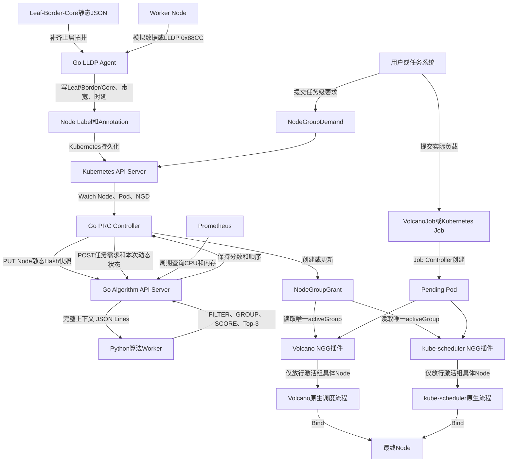
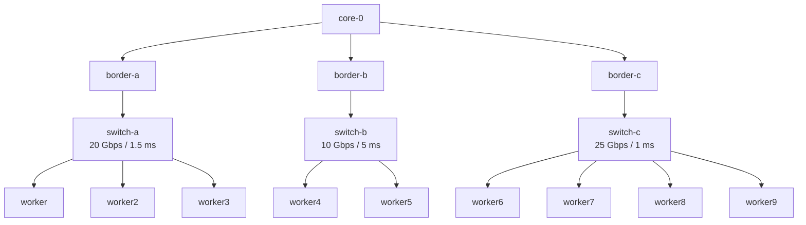
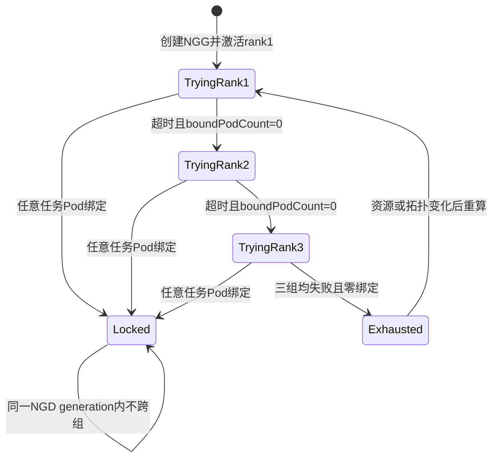
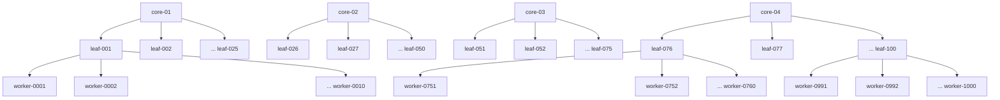
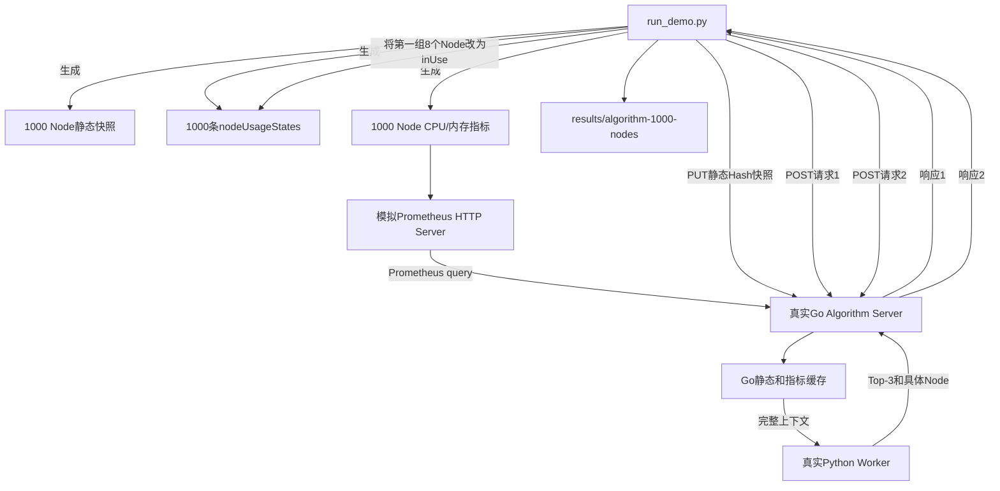

# Kubernetes/Volcano NGD-NGG 两层调度项目整体实现与 Algorithm Server 独立 Demo 说明

本文合并并重新组织了《从零实现说明》和 `algorithm_server/README.md` 的内容，阅读顺序为：

1. 先说明整个项目解决什么问题、组件如何配合、目录和文件分别负责什么；
2. 再单独说明 Algorithm Server 的实现和 1000 Node 独立 Demo；
3. 整体项目 Demo 与 Algorithm 独立 Demo 是两套不同规模的验证环境，不应混为一谈。

---

# 第一部分：整体项目

## 1. 项目要解决的问题

普通 Kubernetes 或 Volcano 调度器直接从所有可用 Node 中为每个 Pod 选择最终节点。本项目在原生调度器上方增加任务级第一层：

```text
第一层：资源组划分
根据整个任务的资源、拓扑和实时负载，返回有序候选节点组

第二层：Pod调度
只在当前激活节点组内，使用Volcano或kube-scheduler选择每个Pod的最终Node
```

第一层不直接绑定 Pod，也不真正预留资源。它输出的是“本任务允许使用哪些具体 Node”的边界。第二层继续处理：

- Gang 和 Queue；
- Taint/Toleration；
- Affinity/Anti-Affinity；
- Volume、HostPort；
- 最终资源冲突；
- Score 和 Bind。

## 2. 整体架构



## 3. 一次任务从提交到绑定的完整流程

| 步骤 | 发生的事情 | 关键代码或配置 |
|---:|---|---|
| 1 | LLDP Agent 获取 Node→Leaf，静态配置补齐 Leaf→Border→Core | `topology_agent/main.go`、`topology_agent/agent.go`、`topology_agent/lldp.go`、`topology_agent/config.go` |
| 2 | Agent 把拓扑、带宽、时延写入 Node Label/Annotation | `topology_agent/kube.go`、`config/manager/lldp-agent.yaml` |
| 3 | 用户提交 NGD 和 VolcanoJob/Kubernetes Job | `manifests/topology-demand.yaml`、`manifests/topology-job.yaml`、`manifests/kubernetes-demand.yaml`、`manifests/kubernetes-job.yaml` |
| 4 | PRC Watch NGD、Node、Pod，确认任务直接 Owner UID | `prc/internal/controller/prc_controller.go`、`prc/internal/controller/snapshot.go` |
| 5 | PRC 从 Node Label、Allocatable 和已绑定 Pod 构造静态/动态状态 | `prc/internal/controller/snapshot.go` |
| 6 | PRC PUT 静态 Hash 快照，再 POST 本次任务请求 | `prc/internal/controller/algorithm_client.go` |
| 7 | Go Algorithm 校验并缓存静态快照，读取 Prometheus 内存快照 | `algorithm_server/go/cache.go`、`algorithm_server/go/metrics.go`、`algorithm_server/go/service.go` |
| 8 | Go 把完整上下文通过 JSON Lines 发给唯一 Python Worker | `algorithm_server/go/worker.go`、`algorithm_server/python/algorithm_worker/worker.py` |
| 9 | Python 执行 FILTER→GROUP→SCORE，稳定返回最多3组 | `pipeline.py`、`requirement.py`、`topology.py`、`loadbalance.py` |
| 10 | PRC 不改分数和顺序，把候选组写入 NGG 并激活 rank 1 | `prc/internal/controller/prc_controller.go` |
| 11 | 若当前组超时且零绑定，PRC 依次切换下一组；一旦绑定立即锁组 | `prc/internal/controller/prc_controller.go` |
| 12 | Volcano/kube-scheduler 插件只放行当前组中 name、UID 都匹配的 Node | `plugin/nodegroupgrant/nodegroupgrant.go`、`plugin/kubescheduler/nodegroupgrant/plugin.go` |
| 13 | 原生调度器继续 Score/Bind，Pod 落到具体 Node | Volcano `vc-scheduler` 或自定义 `ngg-scheduler` |

## 4. 整体项目 Demo 的集群拓扑

整体项目使用 Kind 集群 `volcano-ngd-ngg-v2-demo`，包含 1 个 Control Plane 和 9 个 Worker：



Kind 中 LLDP 使用 `Simulated` 模式。物理环境切换到真实 LLDP 后，通过 `hostNetwork + NET_RAW` 监听 `0x88CC`，Node Label 之后的 PRC、Algorithm、NGG 和调度插件不需要修改。

## 5. 三种核心数据

### 5.1 Node Label：集群和网络静态信息

```text
topology.demo.ngg.io/leaf-switch=switch-a
topology.demo.ngg.io/border-switch=border-a
topology.demo.ngg.io/core-switch=core-0
topology.demo.ngg.io/bandwidth-gbps=20
topology.demo.ngg.io/latency-ms=1.5
topology.demo.ngg.io/source=SimulatedLLDP
topology.demo.ngg.io/topology-version=leaf-border-core-v1
```

正式路径由 PRC 读取 Node Label。旧 `NodeNetworkTopology` CRD 仅作为迁移回退和对照证据保留。

### 5.2 NGD：任务提出的节点组需求

NGD（NodeGroupDemand）描述整个任务，而不是单个 Pod：

- 对应哪个 VolcanoJob 或 Kubernetes Job；
- PodSet 的副本数、`minAvailable` 和单 Pod 资源；
- Node Selector；
- 是否要求同一个 Leaf 组；
- 使用哪些算法及顺序；
- 最多返回几组；
- 单组尝试超时和 NGG TTL。

CRD：`config/crd/nodegroupdemand.yaml`。

### 5.3 NGG：第一层给第二层的授权结果

NGG（NodeGroupGrant）保存：

- 最多3个有序候选组；
- 每组的 `groupId`、`groupScore`、rank；
- 每组允许使用的具体 Node name、UID 和 score；
- 唯一的 `activeGroupRef`；
- 静态、动态和指标快照身份；
- Trying、Locked、Exhausted 等状态；
- 已绑定 Pod 数量和有效期。

CRD：`config/crd/nodegroupgrant.yaml`。

候选组不是 Pod→Node 的最终映射。Algorithm 给出允许使用的具体 Node 集合，第二层调度器再决定每个 Pod 最终落到组内哪个 Node。

## 6. 候选组状态机



最关键的规则是：只有“尝试超时并且一个任务 Pod 都没有绑定”才能切组；任意 Pod 一旦绑定，立即锁定当前组。

## 7. 项目目录与文件功能

以下列出正式实现、部署和验证需要关注的文件。`.cache/`、`build/`、镜像归档和运行生成文件不属于手写核心源码。

### 7.1 根目录

| 文件 | 功能 |
|---|---|
| `README.md` | 项目入口、运行命令、版本和验证摘要 |
| `Makefile` | 把检查、构建、部署、测试和演示脚本组织为统一命令 |
| `Dockerfile.algorithm` | 构建 Go Algorithm 主进程和 Python Worker 的 `v0.4.0` 镜像 |
| `Dockerfile.prc` | 构建正式 Go PRC 镜像 |
| `Dockerfile.lldp-agent` | 构建 Go LLDP Agent 镜像 |
| `Dockerfile.kubescheduler` | 构建包含 NGG Filter 插件的 kube-scheduler |
| `Dockerfile.prc-python-legacy` | 旧 Python PRC 对照入口，不是正式部署路径 |
| `.dockerignore` | 控制镜像构建上下文，排除结果、缓存等无关文件 |

### 7.2 Kind 与 CRD

| 文件 | 功能 |
|---|---|
| `kind/kind-config.yaml` | 定义 1 Control Plane + 9 Worker Kind 集群 |
| `config/crd/nodegroupdemand.yaml` | NGD CRD schema |
| `config/crd/nodegroupgrant.yaml` | NGG CRD schema |
| `config/crd/nodenetworktopology.yaml` | 旧 NNT 兼容 CRD schema |

### 7.3 LLDP/拓扑采集

| 文件 | 功能 |
|---|---|
| `topology_agent/main.go` | Agent 进程入口，加载配置并启动采集循环 |
| `topology_agent/agent.go` | 编排节点发现、LLDP采集和拓扑更新 |
| `topology_agent/lldp.go` | 真实 LLDP 帧读取、解析和交换机/端口提取 |
| `topology_agent/config.go` | Simulated/Real 模式、静态上层拓扑和周期参数 |
| `topology_agent/kube.go` | Watch Node，并把拓扑写入 Node Label/Annotation |
| `topology_agent/topology_test.go` | LLDP解析、模拟模式和1000节点逻辑测试 |
| `config/manager/lldp-agent.yaml` | Kind 模拟模式 DaemonSet 和上层静态拓扑配置 |
| `config/manager/lldp-agent-real-patch.yaml` | 物理环境的 hostNetwork、NET_RAW 和真实模式补丁 |
| `config/rbac/lldp-agent.yaml` | Agent 读取和更新 Node 所需权限 |

### 7.4 Go PRC Controller

| 文件 | 功能 |
|---|---|
| `prc/cmd/main.go` | controller-runtime Manager、Leader Election、探针和 Controller 注册 |
| `prc/internal/controller/prc_controller.go` | Reconcile 主流程、NGG创建/更新、切组、锁组、重算和状态回写 |
| `prc/internal/controller/snapshot.go` | Node静态快照、Pod动态资源状态、内容Hash、Owner UID关联 |
| `prc/internal/controller/algorithm_client.go` | PUT静态快照和POST计算请求的HTTP客户端 |
| `prc/internal/controller/prc_controller_test.go` | 候选顺序、Hash、Owner UID、超时、锁组和Exhausted测试 |
| `config/manager/prc.yaml` | PRC Deployment和Algorithm Service地址 |
| `config/rbac/prc.yaml` | PRC Watch/更新 Node、Pod、NGD、NGG 等对象的权限 |

### 7.5 Algorithm Server

| 文件 | 功能 |
|---|---|
| `algorithm_server/go/main.go` | 正式HTTP Server入口，启动指标协程和Python Worker |
| `algorithm_server/go/cache.go` | 校验内容Hash并保存current/previous Node静态快照 |
| `algorithm_server/go/metrics.go` | 周期读取Prometheus CPU/内存并维护指标快照 |
| `algorithm_server/go/service.go` | 校验请求、适配动态状态、调用Worker、组装响应 |
| `algorithm_server/go/worker.go` | 通过stdin/stdout JSON Lines管理唯一Python子进程 |
| `algorithm_server/go/types.go` | Go缓存、Worker和HTTP内部协议类型 |
| `algorithm_server/go/cache_test.go` | Go缓存、指标、协议和1000 Node测试 |
| `algorithm_server/python/algorithm_worker/worker.py` | Python算法进程入口，构造单次上下文并执行Pipeline |
| `algorithm_server/python/algorithm_worker/pipeline.py` | 注册和校验FILTER→GROUP→SCORE流水线，截取Top-3 |
| `algorithm_server/python/algorithm_worker/context.py` | 单次请求的静态、动态、指标和阶段结果上下文 |
| `algorithm_server/python/algorithm_worker/models.py` | 算法阶段枚举和插件Protocol |
| `algorithm_server/python/algorithm_worker/errors.py` | 可返回给Go/PRC的结构化业务错误 |
| `algorithm_server/python/algorithm_worker/quantity.py` | Kubernetes Quantity解析和PodSet资源装箱 |
| `algorithm_server/python/algorithm_worker/services/node_view_builder.py` | 合并静态Node、`inUse`和Selector，构造可用Node视图 |
| `algorithm_server/python/algorithm_worker/algorithms/requirement.py` | FILTER：排除占用、标签不符和单Pod资源不足的Node |
| `algorithm_server/python/algorithm_worker/algorithms/topology.py` | GROUP：按Leaf分组，不可行时按允许范围扩大到Core |
| `algorithm_server/python/algorithm_worker/algorithms/loadbalance.py` | SCORE：结合Node负载、带宽和时延评分并稳定排序 |
| `algorithm_server/python/algorithm_worker/config/loadbalance_profiles.json` | 资源、负载和拓扑评分权重 |
| `config/manager/algorithm.yaml` | `v0.4.0` Deployment、Service、Prometheus地址和探针 |

### 7.6 第二层调度插件

| 文件 | 功能 |
|---|---|
| `plugin/nodegroupgrant/nodegroupgrant.go` | Volcano NGG插件；只放行activeGroup的Node |
| `plugin/nodegroupgrant/nodegroupgrant_test.go` | Volcano插件Fail Closed和Node过滤测试 |
| `patches/volcano-v1.15.0-nodegroupgrant-register.patch` | 把插件注册进Volcano v1.15.0源码 |
| `config/volcano/scheduler-config.yaml` | Volcano Session中插件启用顺序 |
| `plugin/kubescheduler/cmd/ngg-scheduler/main.go` | 注册NGG Filter并启动自定义kube-scheduler二进制 |
| `plugin/kubescheduler/nodegroupgrant/plugin.go` | Kubernetes Scheduler Framework Filter插件 |
| `plugin/kubescheduler/nodegroupgrant/plugin_test.go` | kube-scheduler插件Fail Closed和Node过滤测试 |
| `config/kubescheduler/scheduler.yaml` | `ngg-scheduler` profile及Leader Election配置 |
| `config/rbac/volcano-plugin.yaml` | Volcano读取NGD/NGG权限 |
| `config/rbac/kube-scheduler-plugin.yaml` | 自定义kube-scheduler读取NGD/NGG权限 |

两个插件均只处理带 NGD Annotation 的受管 Pod。普通 Pod 不受 NGG 影响；受管 Pod 缺少有效 NGG 时保持 Pending。

### 7.7 工作负载与监控清单

| 文件 | 功能 |
|---|---|
| `manifests/topology-demand.yaml` | Volcano切组演示的NGD |
| `manifests/topology-job.yaml` | VolcanoJob，创建4个受管Pod |
| `manifests/kubernetes-demand.yaml` | Kubernetes Job演示的NGD |
| `manifests/kubernetes-job.yaml` | 使用`ngg-scheduler`的原生Job |
| `manifests/batch-*.yaml`、`training-*.yaml` | 早期批处理和训练任务示例 |
| `manifests/demo-resources.yaml` | Demo命名空间等基础资源 |
| `manifests/monitoring/namespace.yaml` | monitoring命名空间 |
| `manifests/monitoring/prometheus.yaml` | Prometheus配置、抓取规则和Deployment |
| `manifests/monitoring/node-exporter.yaml` | 9个Worker主机CPU/内存指标DaemonSet |
| `manifests/monitoring/kube-state-metrics.yaml` | Kubernetes对象状态指标服务 |

### 7.8 自动化脚本

| 文件 | 功能 |
|---|---|
| `scripts/common.sh` | 集群名、镜像版本、kubectl上下文和通用函数 |
| `scripts/00-check-env.sh` | 检查Docker、kubectl和必要命令 |
| `scripts/01-create-kind.sh` | 创建1+9 Kind集群并设置节点标签 |
| `scripts/02-install-volcano.sh` | 安装Volcano v1.15.0 |
| `scripts/03-install-apis.sh` | 安装NGD、NGG和兼容NNT CRD |
| `scripts/03a-configure-topology.sh` | 配置Demo三交换机拓扑 |
| `scripts/04-build-prc.sh` | 构建/保存/加载Go PRC镜像 |
| `scripts/04b-build-algorithm.sh` | 构建/保存/加载Algorithm v0.4.0镜像 |
| `scripts/04c-load-images.sh` | 从`images/`加载预构建镜像 |
| `scripts/04d-build-lldp-agent.sh` | 构建/保存/加载LLDP Agent镜像 |
| `scripts/05-deploy-prc.sh` | 部署PRC |
| `scripts/05a-deploy-algorithm.sh` | 部署Algorithm并等待Rollout |
| `scripts/05b-deploy-lldp-agent.sh` | 部署LLDP Agent DaemonSet |
| `scripts/06-build-volcano-plugin.sh` | 应用patch并构建Volcano NGG调度器镜像 |
| `scripts/06b-test-kubescheduler-plugin.sh` | 测试kube-scheduler插件 |
| `scripts/06c-build-kubescheduler.sh` | 构建自定义`ngg-scheduler`镜像 |
| `scripts/07-deploy-volcano-plugin.sh` | 替换Volcano scheduler并加载配置 |
| `scripts/07b-deploy-kubescheduler.sh` | 部署第二个kube-scheduler profile |
| `scripts/08-run-demo.sh` | 运行Volcano Top-3、零绑定切组、锁组演示并导出证据 |
| `scripts/09-run-kubernetes-demo.sh` | 运行Kubernetes Job缺NGG Fail Closed和正常授权演示 |
| `scripts/10-test-algorithm-integration.sh` | 测试Algorithm Worker和PRC协议衔接 |
| `scripts/11-install-prometheus.sh` | 安装或重装Prometheus监控组件 |
| `scripts/12-check-prometheus.sh` | 检查Target、PromQL和Algorithm指标缓存 |
| `scripts/cleanup.sh` | 清理本项目创建的Kind演示环境 |

### 7.9 测试与结果目录

| 文件或目录 | 功能 |
|---|---|
| `tests/test_algorithm_worker.py` | Python Worker接收完整上下文且不持有缓存的测试 |
| `tests/test_algorithm_1000_nodes.py` | 1000 Node算法规模、稳定Top-3和请求级动态状态测试 |
| `tests/test_controller.py` | 候选切换和首个绑定锁组状态机测试 |
| `tests/test_domain.py` | 资源Quantity和装箱逻辑测试 |
| `tests/test_lldp_agent.py` | LLDP解析和模拟数据合同测试 |
| `results/generated-ngg-v2/` | 从集群导出的NGD、NGG、拓扑Node和旧NNT对照YAML |
| `results/algorithm-1000-nodes/` | Algorithm独立Demo的模拟输入、HTTP请求/响应、摘要和日志 |
| `results/*.log`、`results/*.txt`、`results/*.json` | 调度落点、监控查询、组件日志和验收证据 |

## 8. Algorithm Server 在整体项目中如何启动

正式入口是 `algorithm_server/go/main.go`：

```text
Docker ENTRYPOINT /app/algorithm-server
└─ Go main()
   ├─ HTTP Server :8080
   ├─ Prometheus刷新goroutine
   └─ python3 -m algorithm_worker.worker
      └─ stdin/stdout JSON Lines算法调用
```

部署链路：

```text
make algorithm
→ scripts/04b-build-algorithm.sh
→ Dockerfile.algorithm
→ kind load docker-image ngd-ngg-algorithm:v0.4.0
→ scripts/05a-deploy-algorithm.sh
→ config/manager/algorithm.yaml
→ ngd-ngg-system/ngd-ngg-algorithm:8080
```

`make run` 只使用并检查已经部署的 Algorithm，不负责临时启动它。完整环境应先执行 `make deploy`、`make demo` 或 `make demo-prebuilt`。

## 9. 从零运行整体项目

```bash
cd /mnt/data0/volcano-scheduler/ngd-ngg-scheduling-demo

# 使用images中的预构建镜像
make demo-prebuilt

# 或从当前源码重新构建全部自定义镜像
make demo
```

只重跑任务演示：

```bash
make run             # VolcanoJob
make run-kubernetes  # Kubernetes Job
```

监控：

```bash
make monitoring
make monitoring-check
```

## 10. 整体 Demo 结果如何理解

Volcano 路径：

1. Algorithm 返回 `switch-c → switch-a → switch-b`；
2. Demo 故意给 `switch-c` 加 Taint；
3. `switch-c` 在15秒内零绑定；
4. PRC 切到 rank 2 `switch-a`；
5. 4个Pod绑定后NGG进入Locked，不再切组。

Kubernetes 路径：

1. 先创建带NGD Annotation的Job但不创建NGD；
2. 缺少有效NGG时4个Pod保持Pending，证明Fail Closed；
3. 创建NGD后Algorithm返回Top-3；
4. rank 1 `switch-c` 激活；
5. 4个Pod在该组内完成绑定并锁组。

关键证据：

- `results/generated-ngg-v2/ngd-topology.yaml`：Volcano任务需求；
- `results/generated-ngg-v2/ngg-topology.yaml`：Volcano候选、切组和锁组结果；
- `results/generated-ngg-v2/ngd-kubernetes.yaml`：Kubernetes Job需求；
- `results/generated-ngg-v2/ngg-kubernetes.yaml`：Kubernetes候选和锁组结果；
- `results/generated-ngg-v2/topology-labeled-nodes.yaml`：正式Node Label拓扑输入；
- `results/topology-placement.txt`、`results/kubernetes-placement.txt`：最终Pod落点。

## 11. 当前实现边界

- 整体 Kind Demo 的 LLDP 是模拟数据，物理环境仍需验证网卡和真实 `0x88CC` 帧；
- Algorithm 是单副本、Go进程内缓存；多副本需要额外设计快照和请求路由一致性；
- NGG 是候选授权，不是资源预留；并发任务的最终冲突由第二层处理；
- Taint、Affinity、Volume、HostPort等细粒度约束由第二层处理；
- `inUse` 是当前第一版的粗粒度动态状态；后续可改成更精细的剩余资源向量；
- 当前资源基础分较简单，复杂优化算法适合替换或扩展Python SCORE插件。

---

# 第二部分：Algorithm Server 1000 Node 独立 Demo

## 12. 独立 Demo 验证什么

独立 Demo 不启动 Kubernetes、Volcano、PRC 或真实 Prometheus，只验证 Algorithm Server 本身：

- `run_demo.py` 模拟 PRC 上传静态快照和发送任务请求；
- Python标准库启动临时Prometheus HTTP API；
- Algorithm使用正式 `v0.4.0` Docker镜像；
- Go HTTP、Go缓存、Go→Python Worker和Python算法均为真实实现；
- 1000 Node全部是内存对象，不创建1000个真实Kubernetes Node；
- 最终保存完整输入、请求、响应、摘要和日志。

关键入口：`algorithm_server/demo_1000_nodes/run_demo.py`。

## 13. 1000 Node 模拟拓扑图

### 13.1 总体拓扑



图中省略号表示相同规则生成的中间 Leaf 和 Node。完整规模是：

```text
4个Core
× 每个Core 25个Leaf
× 每个Leaf 10个Node
= 1000个Node
```

映射规则：

```text
worker-0001 ~ worker-0010 → leaf-001 → core-01
worker-0011 ~ worker-0020 → leaf-002 → core-01
...
worker-0241 ~ worker-0250 → leaf-025 → core-01
worker-0251 ~ worker-0260 → leaf-026 → core-02
...
worker-0991 ~ worker-1000 → leaf-100 → core-04
```

### 13.2 Leaf 链路参数循环

Leaf 按编号循环使用四种链路参数：

| `(leaf编号-1) % 4` | 带宽 | 时延 |
|---:|---:|---:|
| 0 | 25 Gbps | 4.0 ms |
| 1 | 40 Gbps | 2.5 ms |
| 2 | 50 Gbps | 1.5 ms |
| 3 | 100 Gbps | 0.8 ms |

例如 `leaf-016`、`leaf-032`、`leaf-076` 和 `leaf-092` 都属于第四类，网络质量较高。

拓扑数据由 `build_demo_data()` 生成，并另存为 `results/algorithm-1000-nodes/topology.json` 供人查看。Algorithm 实际读取的是静态 Node 中的 `topology` 字段，不直接读取 `topology.json` 文件。

## 14. 模拟的 Node、动态状态和 Prometheus

### 14.1 每个 Node 的静态资源

| 资源 | 数量 |
|---|---:|
| CPU | 32核 |
| 内存 | 128 GiB |
| GPU | 4张 |

每个 Node 还包含：

- `nodeName` 和唯一 `nodeUID`；
- `demo.ngg/worker=true`；
- Core/Leaf标签；
- Core/Leaf拓扑ID；
- 带宽和时延。

### 14.2 请求级动态状态

生成规则：

```python
inUse = node_number % 5 == 0
```

因此每10个Node的Leaf中，第5和第10个Node初始不可用：

```text
每个Leaf：10个Node - 2个inUse = 8个可用Node
全局：1000个Node中200个inUse，800个可用
```

动态数据通过 `nodeUsageStates` 随每次任务请求完整发送，不写入Algorithm跨请求缓存。

### 14.3 Prometheus指标

每个Node生成确定性的CPU和内存利用率：

```text
CPU = 0.08 + ((leaf编号×13 + 组内位置×7) % 65) / 100
内存 = 0.10 + ((leaf编号×11 + 组内位置×5) % 60) / 100
```

临时HTTP Server返回与Prometheus `/api/v1/query` vector相同的JSON。Go Algorithm每秒刷新，按Node名称合并CPU和内存并计算指标Hash。

## 15. 模拟的任务需求

任务是一个32副本GPU分布式任务：

```yaml
podSets:
- name: distributed-workers
  replicas: 32
  minAvailable: 32
  resourcesPerPod:
    cpu: "4"
    memory: 8Gi
    nvidia.com/gpu: "1"
```

其他要求：

- 只允许 `demo.ngg/worker=true` 的Node；
- 至少使用6个不同Node；
- 优先寻找可容纳整个任务的单一Leaf；
- 如果所有Leaf都不可行，最多扩大到Core；
- `requireMetrics=true`，没有有效Prometheus快照就失败；
- 最多返回3个候选组。

一个Leaf的8个可用Node总计32张GPU，恰好容纳32个Pod，因此GPU是紧约束，正常情况下不需要扩大到Core。

## 16. 独立 Demo 的进程和数据流程



正式Server进程关系：

```text
/app/algorithm-server
├── Go HTTP :8080
├── Go Node静态缓存
├── Go Prometheus指标缓存
└── python3 -m algorithm_worker.worker
    ├── requirement FILTER
    ├── topology GROUP
    └── loadbalance SCORE
```

## 17. 算法为什么返回当前结果

### 17.1 过滤和资源可行性

每个Leaf剩余8个Node：

```text
CPU：8 × 32 = 256核，任务需要128核
内存：8 × 128 = 1024 GiB，任务需要256 GiB
GPU：8 × 4 = 32张，任务需要32张
可用Node：8个，要求至少6个
```

因此每个正常Leaf可以作为独立候选组，返回组中包含通过过滤的8个具体Node，不包含两个 `inUse=true` 的Node。

### 17.2 评分公式

`balanced-v1`：

```text
节点负载分 = 100 × (1 - CPU/内存平均利用率)
节点分 = 0.4 × 资源基础分 + 0.6 × 节点负载分
组分 = 0.85 × 组内节点平均分 + 0.15 × 拓扑质量分
```

当前所有Node都有相同Allocatable，资源基础分都是100，组间差异主要来自模拟CPU/内存和带宽/时延。

### 17.3 第一次实际Top-3

| rank | 候选组 | groupScore | 具体可用Node数 |
|---:|---|---:|---:|
| 1 | `leaf:leaf-016` | 82.04 | 8 |
| 2 | `leaf:leaf-076` | 82.04 | 8 |
| 3 | `leaf:leaf-032` | 81.94 | 8 |

`leaf-016` 的节点分是 `88、85、81、78、70、67、83、79`，平均为78.875；其链路为100 Gbps/0.8 ms，拓扑质量分100：

```text
0.85 × 78.875 + 0.15 × 100 = 82.04375 ≈ 82.04
```

`leaf-016` 与 `leaf-076` 同分时按 `groupId` 稳定排序，因此不是随机选择。

### 17.4 第二次实际Top-3

驱动程序把第一次第一候选组中的8个可用Node全部改成 `inUse=true`。`leaf-016` 加上原本2个占用Node后已经没有可用Node，因此从候选中消失：

| rank | 候选组 | groupScore | 具体可用Node数 |
|---:|---|---:|---:|
| 1 | `leaf:leaf-076` | 82.04 | 8 |
| 2 | `leaf:leaf-032` | 81.94 | 8 |
| 3 | `leaf:leaf-092` | 81.94 | 8 |

这验证了动态状态是请求级完整数据，第一次请求不会污染第二次请求。

## 18. 独立 Demo 输出文件

目录：`results/algorithm-1000-nodes/`。

| 文件 | 内容和作用 |
|---|---|
| `node-static-snapshot.json` | 1000个Node名称、UID、资源、标签、拓扑和snapshotId |
| `topology.json` | 按Core→Leaf→Node整理的可读拓扑树 |
| `prometheus-metrics.json` | 1000个Node的模拟CPU/内存指标源 |
| `node-dynamic-state.json` | 第一次请求的1000条完整动态状态，其中200条inUse |
| `allocation-request-1.json` | 第一次真实HTTP计算请求 |
| `allocation-response-1.json` | 第一次Top-3、组内具体Node和数据版本 |
| `allocation-request-2.json` | 第一候选组8个Node变为占用后的完整第二次请求 |
| `allocation-response-2.json` | 第二次Top-3，证明第一候选组已被排除 |
| `demo-summary.json` | 数量、缓存、两次候选和PASS状态摘要 |
| `algorithm-server.log` | Go Server、Python Worker和HTTP调用证据 |

`topology.json`、`prometheus-metrics.json` 和 `node-dynamic-state.json` 是便于人查看的证据；真正发送给Algorithm的是静态快照PUT以及两个 `allocation-request-*.json` POST请求。

## 19. 如何单独运行 Algorithm Demo

```bash
cd /mnt/data0/volcano-scheduler/ngd-ngg-scheduling-demo
make algorithm-1000-demo
```

它会：

1. 从当前源码构建 `ngd-ngg-algorithm:v0.4.0`；
2. 生成1000 Node、三层拓扑、指标和动态状态；
3. 启动模拟Prometheus；
4. 启动1个真实Algorithm容器；
5. 等待1000 Node指标进入Go缓存；
6. PUT静态Hash快照；
7. POST两次任务请求；
8. 验证Top-3稳定排序和动态排除；
9. 输出结果并自动停止临时服务。

成功标志：

```text
Algorithm API Server 1000 节点独立演示：PASS
```

## 20. Algorithm Server 也可以只启动服务

不运行1000 Node驱动，只启动服务：

```bash
cd /mnt/data0/volcano-scheduler/ngd-ngg-scheduling-demo
docker build -t ngd-ngg-algorithm:v0.4.0 -f Dockerfile.algorithm .
docker run --rm --name ngd-ngg-algorithm-standalone \
  -p 18080:8080 \
  -e PROMETHEUS_URL= \
  ngd-ngg-algorithm:v0.4.0
```

检查：

```bash
curl http://127.0.0.1:18080/healthz
curl http://127.0.0.1:18080/readyz
curl http://127.0.0.1:18080/internal/v1/cache/status
```

没有Prometheus时服务仍能启动，但指标状态是degraded；强制 `requireMetrics=true` 的计算请求会被拒绝。

---

# 附录：项目当前每个文件的用途

本附录以当前工作区中实际存在的文件为准。`.git/`、`.cache/`、`build/`、`__pycache__/` 属于版本库元数据、下载源码缓存、编译产物或解释器缓存，不逐项列出。

标记说明：

- **正式**：当前构建或运行链路直接使用；
- **历史**：旧版实现、旧版设计或迁移对照，不应作为当前入口；
- **生成**：脚本运行产生的镜像或验收证据，可重新生成。

## A.1 根目录文件

| 文件 | 性质 | 用途 |
|---|---|---|
| `.dockerignore` | 正式 | 排除Git、缓存、结果和镜像归档，缩小Docker构建上下文 |
| `.gitignore` | 正式 | 忽略本地缓存、编译产物、运行结果和临时文件 |
| `README.md` | 正式 | 项目首页，给出目标、目录、运行命令、版本和验收摘要 |
| `Makefile` | 正式 | 把测试、构建、部署、监控和两类Demo统一为`make`目标 |
| `Dockerfile.algorithm` | 正式 | 多阶段构建Go Algorithm主服务和Python Worker镜像 |
| `Dockerfile.prc` | 正式 | 构建Go PRC Controller镜像 |
| `Dockerfile.lldp-agent` | 正式 | 构建Go LLDP Agent镜像 |
| `Dockerfile.kubescheduler` | 正式 | 构建带NGG Filter的自定义kube-scheduler镜像 |
| `Dockerfile.prc-python-legacy` | 历史 | 旧Python PRC镜像入口，仅供迁移对照 |
| `PRC与Algorithm-API-Server技术方案_副本.md` | 历史 | 需求方提出PRC拆分和Algorithm API Server边界时的方案副本 |

## A.2 `docs/` 文档

| 文件 | 性质 | 用途 |
|---|---|---|
| `docs/项目整体实现与Algorithm-Server独立Demo说明.md` | 正式 | 当前综合说明；先讲整体项目，再讲1000 Node独立Demo，并包含本文件清单 |
| `docs/从零实现说明.md` | 正式参考 | 从环境创建到两条调度路径验收的原始从零说明 |
| `docs/代码实现详细流程说明.md` | 正式参考 | 按代码调用顺序解释Node、PRC、Algorithm、NGG和插件细节 |
| `docs/正式设计19项实现核对.md` | 正式参考 | 对19项确定设计逐项核对代码实现和差距 |
| `docs/Kubernetes-Volcano-NGD-NGG两层调度统一技术方案v1.3.md` | 正式参考 | NGD/NGG两层调度总体技术方案和协议设计 |
| `docs/Algorithm-Go主进程与Python算法Worker实现说明v2.0.md` | 正式参考 | Go主进程、Python Worker和进程内数据边界说明 |
| `docs/Go-LLDP拓扑采集与Node-Label持久化实现说明v2.0.md` | 正式参考 | LLDP采集、静态补全、Node Label持久化和1000节点测试说明 |
| `docs/Kubernetes-Volcano两层调度中Prometheus指标读取与缓存优化设计说明v2.0.md` | 正式参考 | 当前Go侧Prometheus采集、缓存、降级和时效策略 |
| `docs/LLDP-Agent实现与演示说明.md` | 正式参考 | LLDP Agent代码结构、Simulated/Real模式和演示方式 |
| `docs/PRC拆分设计审查与改造计划.md` | 历史参考 | 从单体PRC拆出Algorithm服务时的设计审查和改造计划 |
| `docs/Algorithm-API-Server内存快照与可配置算法流水线实现说明v1.1.md` | 历史参考 | 旧版Python主服务设计；当前HTTP和缓存已经迁移到Go |
| `docs/Kubernetes-Volcano两层调度中Prometheus指标读取与缓存优化设计说明v1.5.md` | 历史参考 | Prometheus缓存设计的旧版本，用于方案演进对照 |

## A.3 `algorithm_server/` 文件

| 文件 | 性质 | 用途 |
|---|---|---|
| `algorithm_server/README.md` | 正式 | Algorithm组件、接口、启动、配置和1000 Node Demo详细说明 |
| `algorithm_server/go/go.mod` | 正式 | Algorithm Go模块定义；当前只依赖标准库 |
| `algorithm_server/go/main.go` | 正式 | HTTP Server入口，启动Python Worker、指标刷新和路由 |
| `algorithm_server/go/cache.go` | 正式 | Node静态快照Hash校验及current/previous内存缓存 |
| `algorithm_server/go/metrics.go` | 正式 | Prometheus instant query、Node指标合并、Hash、stale/degraded处理 |
| `algorithm_server/go/service.go` | 正式 | 计算请求编排、动态状态适配、Worker调用和新旧响应组装 |
| `algorithm_server/go/worker.go` | 正式 | 启停Python子进程，并通过JSON Lines进行串行请求/响应 |
| `algorithm_server/go/types.go` | 正式 | 静态快照、指标快照、Worker信封和API错误等Go类型 |
| `algorithm_server/go/cache_test.go` | 正式 | Go缓存、指标、动态状态、Worker合同和1000 Node单测 |
| `algorithm_server/python/algorithm_worker/__init__.py` | 正式 | Python算法包声明，不提前导入Worker以避免`-m`重复加载 |
| `algorithm_server/python/algorithm_worker/worker.py` | 正式 | Python子进程入口，将完整JSON上下文转换为Pipeline计算 |
| `algorithm_server/python/algorithm_worker/context.py` | 正式 | 单次请求静态/指标快照和各算法阶段结果的数据类 |
| `algorithm_server/python/algorithm_worker/models.py` | 正式 | FILTER、GROUP、SCORE阶段枚举和算法插件Protocol |
| `algorithm_server/python/algorithm_worker/errors.py` | 正式 | 输入、算法、参数和指标未就绪等结构化业务错误 |
| `algorithm_server/python/algorithm_worker/pipeline.py` | 正式 | 注册插件、校验阶段顺序、执行流水线、截取Top-3和写rank |
| `algorithm_server/python/algorithm_worker/quantity.py` | 正式 | 解析CPU/内存/GPU Quantity并进行PodSet贪心装箱 |
| `algorithm_server/python/algorithm_worker/services/__init__.py` | 正式 | 算法共享服务包声明 |
| `algorithm_server/python/algorithm_worker/services/node_view_builder.py` | 正式 | 合并静态Node、`inUse`、Selector和单Pod资源过滤条件 |
| `algorithm_server/python/algorithm_worker/algorithms/__init__.py` | 正式 | 内置算法插件包声明 |
| `algorithm_server/python/algorithm_worker/algorithms/requirement.py` | 正式 | FILTER插件，生成当前任务可使用的Node集合 |
| `algorithm_server/python/algorithm_worker/algorithms/topology.py` | 正式 | GROUP插件，优先Leaf，必要时扩大到Core并检查整组可行性 |
| `algorithm_server/python/algorithm_worker/algorithms/loadbalance.py` | 正式 | SCORE插件，计算Node分、拓扑质量和稳定候选组排序 |
| `algorithm_server/python/algorithm_worker/config/loadbalance_profiles.json` | 正式 | `balanced-v1`、`resource-only`等评分权重Profile |
| `algorithm_server/demo_1000_nodes/run_demo.py` | 正式 | 生成1000 Node模拟输入，启动模拟Prometheus和真实Algorithm容器，执行两次HTTP计算 |

说明：旧 `app.py`、Python `cache/`、`collectors/`、`result_builder.py` 和 `requirements-legacy.txt` 已删除；当前HTTP、静态缓存、Prometheus缓存和响应组装全部由Go承担。

## A.4 `topology_agent/` 文件

| 文件 | 性质 | 用途 |
|---|---|---|
| `topology_agent/go.mod` | 正式 | LLDP Agent Go模块和Kubernetes依赖定义 |
| `topology_agent/go.sum` | 正式 | LLDP Agent Go依赖校验和锁定 |
| `topology_agent/main.go` | 正式 | Agent入口，解析配置、创建Kubernetes客户端并启动循环 |
| `topology_agent/config.go` | 正式 | 环境变量、Simulated/Real模式、静态上层拓扑和默认值 |
| `topology_agent/agent.go` | 正式 | 采集流程、Node处理和拓扑结果编排 |
| `topology_agent/lldp.go` | 正式 | 监听/解析LLDP帧，提取交换机和远端端口 |
| `topology_agent/kube.go` | 正式 | Watch Node并写入拓扑Label和Annotation |
| `topology_agent/topology_test.go` | 正式 | LLDP解析、模拟拓扑、Hash和1000节点行为测试 |

## A.5 `prc/` 文件

| 文件 | 性质 | 用途 |
|---|---|---|
| `prc/PROJECT` | 正式 | Kubebuilder工程元数据 |
| `prc/go.mod` | 正式 | PRC Go模块及controller-runtime/Kubernetes依赖 |
| `prc/go.sum` | 正式 | PRC Go依赖校验和锁定 |
| `prc/cmd/main.go` | 正式 | Manager、Leader Election、健康探针和Controller注册入口 |
| `prc/internal/controller/prc_controller.go` | 正式 | NGD Reconcile、NGG状态机、Top-3切换、锁组和重算主逻辑 |
| `prc/internal/controller/snapshot.go` | 正式 | Node静态快照、Pod请求资源、动态状态、Hash和Owner UID关联 |
| `prc/internal/controller/algorithm_client.go` | 正式 | Algorithm静态快照PUT和计算POST客户端 |
| `prc/internal/controller/prc_controller_test.go` | 正式 | 协议、快照、候选顺序、切组、锁组和Exhausted单测 |

## A.6 `plugin/` 与 `patches/` 文件

| 文件 | 性质 | 用途 |
|---|---|---|
| `plugin/Dockerfile.runtime` | 正式 | 把已编译Volcano scheduler二进制打成运行镜像 |
| `plugin/nodegroupgrant/nodegroupgrant.go` | 正式 | Volcano NGG插件，Session内读取NGG并过滤非activeGroup Node |
| `plugin/nodegroupgrant/nodegroupgrant_test.go` | 正式 | Volcano插件Owner、TTL、revision、UID和Fail Closed测试 |
| `patches/volcano-v1.15.0-nodegroupgrant-register.patch` | 正式 | 将本地NGG插件注册到Volcano v1.15.0构建树 |
| `plugin/kubescheduler/README.md` | 正式 | 自定义kube-scheduler插件构建、配置和运行说明 |
| `plugin/kubescheduler/go.mod` | 正式 | kube-scheduler插件模块和Kubernetes v1.35依赖 |
| `plugin/kubescheduler/go.sum` | 正式 | kube-scheduler插件依赖校验和锁定 |
| `plugin/kubescheduler/cmd/ngg-scheduler/main.go` | 正式 | 使用`app.WithPlugin`注册NGG Filter并启动调度器 |
| `plugin/kubescheduler/nodegroupgrant/plugin.go` | 正式 | Scheduler Framework Filter插件和NGG Informer缓存 |
| `plugin/kubescheduler/nodegroupgrant/plugin_test.go` | 正式 | Kubernetes Job、Owner、Fail Closed和Node范围测试 |

## A.7 `config/` 文件

| 文件 | 性质 | 用途 |
|---|---|---|
| `config/crd/nodegroupdemand.yaml` | 正式 | NGD的OpenAPI Schema、Spec和Status定义 |
| `config/crd/nodegroupgrant.yaml` | 正式 | NGG候选组、activeGroup、数据版本和状态Schema |
| `config/crd/nodenetworktopology.yaml` | 迁移兼容 | 旧NNT拓扑CRD，供回退读取和结果对照 |
| `config/manager/algorithm.yaml` | 正式 | Algorithm v0.4.0 Deployment、Service、Prometheus环境变量和探针 |
| `config/manager/prc.yaml` | 正式 | PRC Deployment、Algorithm Service URL和Controller参数 |
| `config/manager/lldp-agent.yaml` | 正式 | Kind Simulated模式Agent DaemonSet及静态上层拓扑 |
| `config/manager/lldp-agent-real-patch.yaml` | 正式模板 | 物理环境Real模式的hostNetwork、NET_RAW和网卡补丁 |
| `config/rbac/prc.yaml` | 正式 | PRC ServiceAccount、ClusterRole和Binding |
| `config/rbac/lldp-agent.yaml` | 正式 | Agent读取/更新Node的权限 |
| `config/rbac/volcano-plugin.yaml` | 正式 | Volcano scheduler读取NGD/NGG的权限 |
| `config/rbac/kube-scheduler-plugin.yaml` | 正式 | 自定义kube-scheduler读取NGD/NGG的权限 |
| `config/volcano/scheduler-config.yaml` | 正式 | Volcano Actions、Tiers和NGG插件启用配置 |
| `config/kubescheduler/scheduler.yaml` | 正式 | `ngg-scheduler` profile、插件和Leader Election配置 |

## A.8 `kind/` 和 `manifests/` 文件

| 文件 | 性质 | 用途 |
|---|---|---|
| `kind/kind-config.yaml` | 正式 | 1个Control Plane和9个Worker的Kind集群定义 |
| `manifests/demo-resources.yaml` | 正式 | Demo Namespace及基础资源 |
| `manifests/topology-demand.yaml` | 正式 | Volcano拓扑Demo的NGD需求 |
| `manifests/topology-job.yaml` | 正式 | VolcanoJob工作负载及受管Pod Annotation |
| `manifests/kubernetes-demand.yaml` | 正式 | Kubernetes Job路径的NGD需求 |
| `manifests/kubernetes-job.yaml` | 正式 | 使用`ngg-scheduler`的原生Job |
| `manifests/batch-demand.yaml` | 历史示例 | 早期批处理NGD示例 |
| `manifests/batch-job.yaml` | 历史示例 | 早期批处理VolcanoJob示例 |
| `manifests/training-demand.yaml` | 历史示例 | 早期训练任务NGD示例 |
| `manifests/training-job.yaml` | 历史示例 | 早期训练VolcanoJob示例 |
| `manifests/monitoring/namespace.yaml` | 正式 | 创建`monitoring` Namespace |
| `manifests/monitoring/prometheus.yaml` | 正式 | Prometheus ConfigMap、RBAC、Deployment和Service |
| `manifests/monitoring/node-exporter.yaml` | 正式 | 仅在9个Worker运行的主机指标DaemonSet |
| `manifests/monitoring/kube-state-metrics.yaml` | 正式 | Kubernetes对象指标Deployment、Service和RBAC |

## A.9 `scripts/` 文件

| 文件 | 性质 | 用途 |
|---|---|---|
| `scripts/common.sh` | 正式 | 镜像版本、集群上下文、目录和通用`kube/log/die`函数 |
| `scripts/00-check-env.sh` | 正式 | 检查Docker、kubectl、Kind环境和磁盘等前置条件 |
| `scripts/01-create-kind.sh` | 正式 | 创建1+9 Kind集群并初始化Worker标签 |
| `scripts/02-install-volcano.sh` | 正式 | 安装和等待Volcano v1.15.0组件 |
| `scripts/03-install-apis.sh` | 正式 | 安装NGD、NGG和旧NNT CRD |
| `scripts/03a-configure-topology.sh` | 正式 | 为三交换机Demo补充或校验拓扑标签 |
| `scripts/04-build-prc.sh` | 正式 | 构建、保存并按需加载PRC镜像 |
| `scripts/04b-build-algorithm.sh` | 正式 | 构建、保存并加载Algorithm v0.4.0镜像 |
| `scripts/04c-load-images.sh` | 正式 | 将`images/`中的预构建镜像归档加载到Kind |
| `scripts/04d-build-lldp-agent.sh` | 正式 | 构建、保存并加载LLDP Agent镜像 |
| `scripts/05-deploy-prc.sh` | 正式 | 应用PRC RBAC/Deployment并等待Rollout |
| `scripts/05a-deploy-algorithm.sh` | 正式 | 加载最新Algorithm镜像、应用Deployment/Service并滚动重启 |
| `scripts/05b-deploy-lldp-agent.sh` | 正式 | 应用Agent RBAC/DaemonSet并等待9个Worker就绪 |
| `scripts/06-build-volcano-plugin.sh` | 正式 | 获取Volcano源码、打patch、测试并构建自定义scheduler |
| `scripts/06b-test-kubescheduler-plugin.sh` | 正式 | 在Go容器中运行kube-scheduler插件单测 |
| `scripts/06c-build-kubescheduler.sh` | 正式 | 构建并保存自定义`ngg-scheduler`镜像 |
| `scripts/07-deploy-volcano-plugin.sh` | 正式 | 加载自定义Volcano镜像和scheduler配置 |
| `scripts/07b-deploy-kubescheduler.sh` | 正式 | 部署第二个kube-scheduler实例及其RBAC |
| `scripts/08-run-demo.sh` | 正式 | 运行Volcano Top-3、Taint零绑定、切组、锁组并导出结果 |
| `scripts/09-run-kubernetes-demo.sh` | 正式 | 验证缺NGG Fail Closed及创建NGD后的Kubernetes Job调度 |
| `scripts/10-test-algorithm-integration.sh` | 正式 | 运行Python Worker和Go PRC的协议衔接测试 |
| `scripts/11-install-prometheus.sh` | 正式 | 安装或重新应用Prometheus监控清单 |
| `scripts/12-check-prometheus.sh` | 正式 | 检查Target、PromQL、Node数量和Algorithm指标缓存 |
| `scripts/cleanup.sh` | 正式 | 删除本项目创建的Kind演示集群 |

## A.10 `tests/` 文件

| 文件 | 性质 | 用途 |
|---|---|---|
| `tests/test_algorithm_worker.py` | 正式 | Worker只接收完整上下文、不拥有HTTP和跨请求缓存的测试 |
| `tests/test_algorithm_1000_nodes.py` | 正式 | 1000 Node性能、稳定Top-3和动态状态请求隔离测试 |
| `tests/test_controller.py` | 正式 | 零绑定超时切下一rank和绑定后锁组测试 |
| `tests/test_domain.py` | 正式 | CPU/内存/GPU资源解析、Selector和装箱测试 |
| `tests/test_lldp_agent.py` | 正式 | LLDP帧解析和Simulated模式输出合同测试 |

说明：依赖旧Python Algorithm HTTP/cache实现的旧测试文件已删除，当前相应职责由Go测试、Worker测试和真实容器Demo覆盖。

## A.11 `src/` 旧Python实现

| 文件 | 性质 | 用途 |
|---|---|---|
| `src/ngd_ngg_algorithm_legacy_v030/__init__.py` | 历史 | v0.3.0 Algorithm旧包声明 |
| `src/ngd_ngg_algorithm_legacy_v030/api.py` | 历史 | 旧Python Algorithm HTTP API实现 |
| `src/ngd_ngg_algorithm_legacy_v030/engine.py` | 历史 | 旧版候选组计算引擎 |
| `src/ngd_ngg_algorithm_legacy_v030/metrics.py` | 历史 | 旧版Python Prometheus指标实现 |
| `src/ngd_ngg_demo/__init__.py` | 历史 | 旧Python单体Demo包声明 |
| `src/ngd_ngg_demo/main.py` | 历史 | 旧Python PRC/算法进程入口 |
| `src/ngd_ngg_demo/controller.py` | 历史 | 旧Python Controller和NGG写入逻辑 |
| `src/ngd_ngg_demo/algorithm_client.py` | 历史 | 旧Algorithm HTTP客户端 |
| `src/ngd_ngg_demo/snapshots.py` | 历史 | 旧静态/动态快照构造与Hash逻辑 |
| `src/ngd_ngg_demo/domain.py` | 历史 | 旧Python领域模型和资源计算 |
| `src/ngd_ngg_demo/kube.py` | 历史 | 旧Python Kubernetes API封装 |
| `src/ngd_ngg_demo/lldp.py` | 历史 | 旧Python LLDP数据模型和解析辅助 |
| `src/ngd_ngg_demo/lldp_agent.py` | 历史 | 旧Python LLDP Agent入口 |

这些文件不进入当前Go PRC、Go Algorithm或Go LLDP Agent镜像，只用于方案演进对照。

## A.12 `images/` 镜像归档

| 文件 | 性质 | 用途 |
|---|---|---|
| `images/ngd-ngg-prc-v0.2.0.tar` | 历史生成 | 旧PRC镜像归档 |
| `images/ngd-ngg-prc-v0.3.0.tar` | 生成 | 当前Go PRC预构建镜像归档 |
| `images/ngd-ngg-algorithm-v0.2.0.tar` | 历史生成 | 旧Algorithm镜像归档 |
| `images/ngd-ngg-algorithm-v0.3.0.tar` | 历史生成 | Go/Python重构前的Algorithm归档 |
| `images/ngd-ngg-lldp-agent-v0.1.0.tar` | 历史生成 | 旧LLDP Agent镜像归档 |
| `images/ngg-kube-scheduler-v1.35.3.tar` | 生成 | 自定义kube-scheduler预构建归档 |
| `images/volcano-ngg-scheduler-v1.15.0.tar` | 生成 | 包含NGG插件的Volcano scheduler归档 |

注意：当前Algorithm源码和Deployment是 `v0.4.0`；若要使用预构建全流程，需要先运行 `make algorithm-image` 生成 `images/ngd-ngg-algorithm-v0.4.0.tar`。旧 `v0.2.0/v0.3.0` 不代表当前实现。

## A.13 `results/` 运行结果

### A.13.1 Algorithm与组件状态

| 文件 | 性质 | 用途 |
|---|---|---|
| `results/.gitkeep` | 正式 | 让空结果目录能够被Git保留 |
| `results/algorithm-image.txt` | 生成 | Algorithm镜像ID和Tag证据 |
| `results/prc-image.txt` | 生成 | PRC镜像ID和Tag证据 |
| `results/lldp-agent-image.txt` | 生成 | LLDP Agent镜像ID和Tag证据 |
| `results/kube-scheduler-image.txt` | 生成 | 自定义kube-scheduler镜像证据 |
| `results/scheduler-image.txt` | 生成 | 自定义Volcano scheduler镜像证据 |
| `results/scheduler-build.log` | 生成 | Volcano插件编译过程日志 |
| `results/scheduler-image-build.log` | 生成 | Volcano运行镜像构建日志 |
| `results/cluster-state.txt` | 生成 | 集群Node、Pod、CR等综合状态快照 |
| `results/topology-cluster-state.txt` | 生成 | 拓扑Demo结束时Node、Agent、NGD、NGG和Pod状态 |
| `results/monitoring-pods.txt` | 生成 | Prometheus、node-exporter、kube-state-metrics Pod状态 |
| `results/algorithm-metrics-cache-status.json` | 生成 | Algorithm中Node静态缓存和Prometheus缓存状态 |
| `results/algorithm-calculation-result.txt` | 生成 | Algorithm镜像、Top-3和本次数据版本摘要 |

### A.13.2 组件和调度日志

| 文件 | 性质 | 用途 |
|---|---|---|
| `results/algorithm.log` | 生成 | 集群中Algorithm Go主进程和Python Worker日志 |
| `results/prc-v2.log` | 生成 | Go PRC Reconcile、Algorithm调用、切组和锁组日志 |
| `results/lldp-agent.log` | 生成 | 9个Agent Pod采集和Node Label更新日志 |
| `results/plugin.log` | 生成 | Volcano NGG插件运行日志 |
| `results/kube-scheduler.log` | 生成 | 自定义kube-scheduler及NGG Filter日志 |
| `results/plugin-test.log` | 生成 | Volcano插件自动测试日志 |
| `results/kube-scheduler-plugin-test.log` | 生成 | kube-scheduler插件自动测试日志 |

### A.13.3 监控证据

| 文件 | 性质 | 用途 |
|---|---|---|
| `results/prometheus-targets.json` | 生成 | Prometheus全部Target及健康状态；Target数不等于Node数 |
| `results/prometheus-node-cpu.json` | 生成 | Worker Node CPU PromQL原始响应 |
| `results/prometheus-node-memory.json` | 生成 | Worker Node内存 PromQL原始响应 |
| `results/prometheus-query-checks.txt` | 生成 | Target、Node数量、PromQL和Algorithm缓存检查摘要 |

### A.13.4 最终落点和Fail Closed证据

| 文件 | 性质 | 用途 |
|---|---|---|
| `results/topology-placement.txt` | 生成 | Volcano Demo中4个Pod的Node、switch和activeAllowed检查 |
| `results/kubernetes-placement.txt` | 生成 | Kubernetes Job中4个Pod最终Node和交换机 |
| `results/kubernetes-fail-closed.txt` | 生成 | 缺少NGG时受管Pod保持Pending的证据 |
| `results/placement.txt` | 历史生成 | 早期NGD/NGG Demo的Pod落点结果 |

### A.13.5 `results/generated-ngg-v2/`

| 文件 | 性质 | 用途 |
|---|---|---|
| `ngd-topology.yaml` | 生成 | VolcanoJob任务需求、算法顺序和Fulfilled状态 |
| `ngg-topology.yaml` | 生成 | Volcano Top-3、switch-c→switch-a切换、具体Node和Locked状态 |
| `ngd-kubernetes.yaml` | 生成 | Kubernetes Job任务需求和Fulfilled状态 |
| `ngg-kubernetes.yaml` | 生成 | Kubernetes Top-3、switch-c激活、具体Node和Locked状态 |
| `topology-labeled-nodes.yaml` | 生成 | PRC正式读取的9个Worker Node Label、资源和运行状态 |
| `node-network-topologies.yaml` | 历史生成 | 旧NNT拓扑导出，用于和Node Label路径对照 |
| `node-network-topologies-legacy.yaml` | 历史生成 | Volcano Demo结束时再次导出的旧NNT兼容证据 |

### A.13.6 `results/generated-ngg/` 早期结果

| 文件 | 性质 | 用途 |
|---|---|---|
| `ngg-batch.yaml` | 历史生成 | 早期batch任务NGG结果 |
| `ngg-training.yaml` | 历史生成 | 早期training任务NGG结果 |
| `all-ngg.yaml` | 历史生成 | 早期全部NGG对象汇总 |

### A.13.7 `results/algorithm-1000-nodes/`

| 文件 | 性质 | 用途 |
|---|---|---|
| `node-static-snapshot.json` | 生成 | 1000 Node静态资源、标签、拓扑和内容Hash |
| `topology.json` | 生成 | 4 Core、100 Leaf、1000 Node可读拓扑树 |
| `prometheus-metrics.json` | 生成 | 1000 Node模拟CPU和内存指标 |
| `node-dynamic-state.json` | 生成 | 第一次请求的1000条状态，其中200条`inUse=true` |
| `allocation-request-1.json` | 生成 | 第一次完整Algorithm HTTP请求 |
| `allocation-response-1.json` | 生成 | 第一次Top-3、组内具体Node和快照身份 |
| `allocation-request-2.json` | 生成 | 第一候选组8个Node变为占用后的完整请求 |
| `allocation-response-2.json` | 生成 | 第二次Top-3和动态排除结果 |
| `demo-summary.json` | 生成 | 规模、缓存、两次候选、移除组和PASS摘要 |
| `algorithm-server.log` | 生成 | 独立容器Go Server和Python Worker启动/调用日志 |
