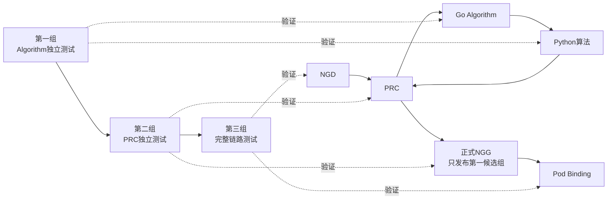
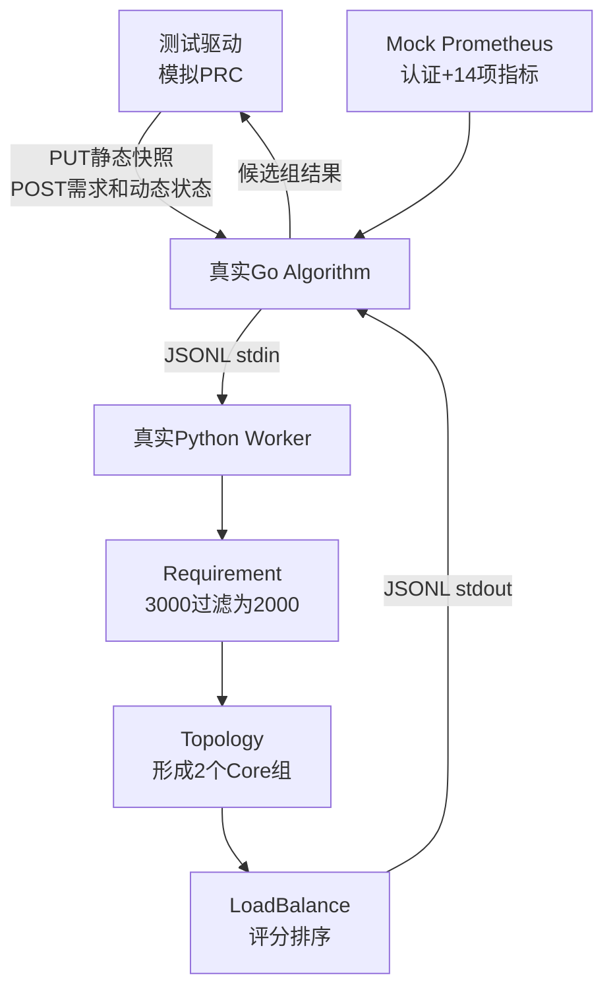
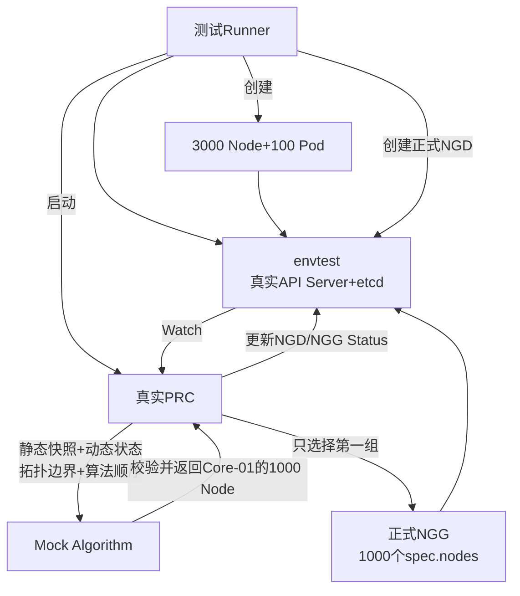
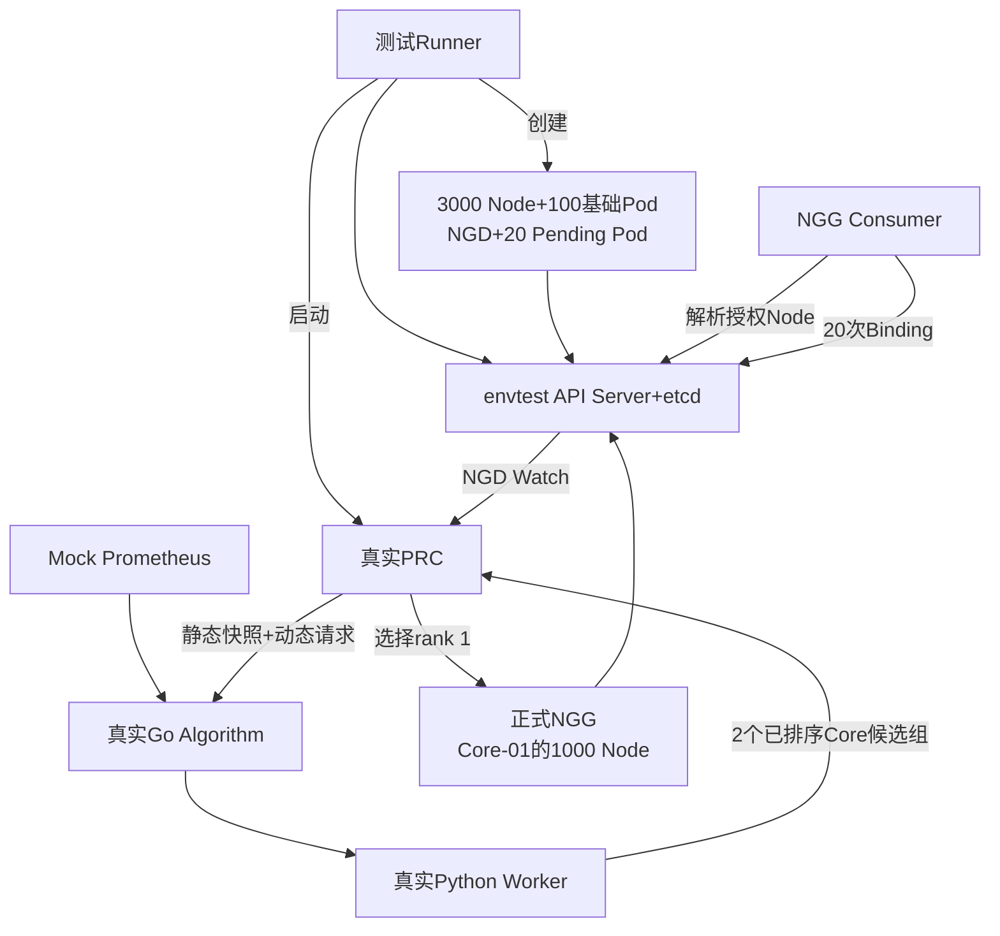

# NGD-NGG三组测试阶段汇报

> 日期：2026年8月21日
> 项目：`/mnt/data0/volcano-scheduler/ngd-ngg-scheduling-demo`

## 第一部分：三组测试整体预览

本阶段把NGD-NGG链路拆成三组：第一组验证Algorithm，第二组验证PRC，第三组验证完整链路。



| 测试组 | 主要验证内容                                  | 整组最外层输入 → 输出                  | 最终结果                                       |
| ------ | --------------------------------------------- | --------------------------------------- | ---------------------------------------------- |
| 第一组 | 真实Go/Python Algorithm处理3000 Node          | PRC Allocate请求 → Algorithm候选组结果 | 返回2个已评分候选组                            |
| 第二组 | 真实PRC Watch NGD并生成正式NGG                | 正式NGD → 正式NGG                      | 生成一组1000 Node的NGG                         |
| 第三组 | NGD、PRC、真实Algorithm、NGG、Binding完整链路 | 正式NGD → 正式NGG                      | NGG生成后，继续验证20个Pod全部在授权范围内绑定 |

统一模拟数据：

- 3000个Node，划分为2个Core、4个Border、150个Leaf；
- 每个Node模拟32 CPU、128Gi内存、4 GPU；
- 1000个Node标记为正在使用或不可调度，剩余2000个；
- Core-01和Core-02各有1000个可用Node；
- 拓扑按 `Leaf -> Border -> Core` 查找，最多放宽到Core；
- 算法顺序为 `requirement -> topology -> loadbalance`；
- Algorithm最多返回3个候选组，PRC只把rank 1写入联通正式NGG。

每组运行两遍：Timing Run只计时，Evidence Run保存输入、过程和输出，写文件时间不进入性能结果。

### Prometheus和Kubernetes如何模拟

#### Prometheus模拟

第一组和第三组会在测试进程中启动一个独立的Mock Prometheus HTTP Server；第二组不启动Prometheus，因为第二组只验证PRC，并使用可控Mock Algorithm隔离真实算法变量。

Mock Prometheus的行为不是简单返回固定JSON，而是按正式Prometheus查询接口模拟：

1. 在内存中为3000个Node生成14项指标，共42000个样本；
2. 提供正式的 `GET /api/v1/query` instant-query接口；
3. 返回与Prometheus一致的 `status/data/resultType/vector` 数据结构；
4. Algorithm必须携带 `Authorization: Bearer <token>`；缺少Token返回401，Token错误返回403；
5. Mock会把请求中的PromQL与14条配置逐项匹配，未知PromQL返回422；
6. Go Algorithm定时查询指标并缓存在进程内，Python Worker使用Go传入的指标快照，不直接访问Prometheus。

测试期间服务监听宿主机随机端口，Algorithm容器通过 `http://host.docker.internal:<随机端口>` 访问；测试结束后自动关闭。认证和查询记录保存在Evidence目录的 `infrastructure/prometheus-requests.jsonl`。

#### Kubernetes模拟

第二组和第三组使用controller-runtime的envtest；第一组不启动Kubernetes，由测试驱动直接模拟PRC请求。

envtest启动的 `kube-apiserver` 和 `etcd` 是真实二进制，并安装正式NGD、NGG和拓扑CRD，因此以下行为都走真实Kubernetes API：

- API对象的创建、读取和更新；
- PRC的Informer Cache和NGD Watch事件；
- NGD、NGG的Status子资源更新；
- 第三组的Pod Binding子资源调用。

测试使用 `.cache/envtest/1.35.5` 下的二进制。3000个Node和100个基础Pod是批量生成并写入API Server的模拟对象，不代表3000台真实服务器，也不会启动kubelet、CNI、Volcano或kube-scheduler。第三组用NGG Consumer读取授权节点并调用Binding API，模拟第二层调度器消费NGG的动作。

三组测试全部运行和查看总览：

```bash
cd /mnt/data0/volcano-scheduler/ngd-ngg-scheduling-demo
make demo-all-groups
make demo-show-latest
```

## 第二部分：三组测试详情

### 一、第一组：Algorithm Server独立测试

#### 1. 测什么

验证Go Algorithm Server、Prometheus缓存、Go调用常驻Python Worker，以及Requirement过滤、Topology分组和LoadBalance评分。测试驱动模拟PRC，不启动Kubernetes和PRC。

#### 2. 整组输入输出概览

```text
主要输入：PRC发送的Allocate请求
         ├── 资源池需求
         ├── Node动态状态
         ├── 静态快照Hash
         └── 算法顺序和参数

辅助输入：Go内存中的Node静态快照和Prometheus指标快照

主要输出：Algorithm候选组结果
         ├── candidateNodeGroups
         ├── 每组groupScore和rank
         └── 每组具体Node及node score
```

因此第一组最外层可以概括为：

```text
PRC Allocate请求 → Algorithm计算 → 候选组结果
```

#### 3. 流程图



#### 4. 模拟与实际内容

| 内容                            | 实际/模拟                                    |
| ------------------------------- | -------------------------------------------- |
| Go Algorithm Server             | 真实代码和进程                               |
| Python Worker及三段算法         | 真实代码和进程                               |
| Go与Python JSONL通信            | 真实                                         |
| Prometheus                      | Mock API，模拟Bearer认证、PromQL和vector结果 |
| 3000 Node静态、动态、拓扑和指标 | 确定性模拟数据                               |
| PRC                             | 测试驱动模拟                                 |

#### 5. 输入、输出文件及位置

输入包括3000 Node静态资源和拓扑、动态占用状态、14项Prometheus指标、1000 Node需求和算法顺序。

输出结果：

| rank | groupId          | groupScore | Node数 |
| ---: | ---------------- | ---------: | -----: |
|    1 | `core:core-01` |      86.26 |   1000 |
|    2 | `core:core-02` |      86.24 |   1000 |

结果目录：[第一组最新PASS结果](../../test_suites/group1_algorithm/runs/20260820-212042)

```text
/mnt/data0/volcano-scheduler/ngd-ngg-scheduling-demo/test_suites/
group1_algorithm/runs/20260820-212042/
```

| 文件位置                                                  | 内容                       |
| --------------------------------------------------------- | -------------------------- |
| `timing-run/timing-result.json`                         | 正式时间结果               |
| `evidence-run/infrastructure/prometheus-requests.jsonl` | Prometheus认证和查询记录   |
| `evidence-run/<case>/01-prc-go-http/`                   | 模拟PRC与Go的HTTP输入输出  |
| `evidence-run/<case>/02-go-cache/`                      | Go实际使用的静态和指标快照 |
| `evidence-run/<case>/03-go-python-worker/`              | Go与Python的JSONL输入输出  |
| `evidence-run/<case>/04-python-pipeline/`               | 三段算法各自的输入输出     |
| `evidence-run/<case>/05-final/allocation-response.json` | 最终候选组结果             |

`<case>`为 `cold_cache` 或 `warm_cache`。

#### 6. 运行时间

| 场景           | 计时内容                                   |                 时间 |
| -------------- | ------------------------------------------ | -------------------: |
| Cold外层       | 静态PUT、等待指标Ready、Allocate到收到结果 |          1156.330 ms |
| Cold内部       | Algorithm接收Allocate到候选结果完成        |           552.746 ms |
| Warm外层，30次 | 平均值 / P95                               | 552.270 / 569.872 ms |
| Warm内部，30次 | 平均值 / P95                               | 544.462 / 557.031 ms |

P50和P95表示多次测试的耗时分位数：

- `P50`：50%的请求耗时不超过该值，也就是中位数，表示典型耗时；
- `P95`：95%的请求耗时不超过该值，只有约5%的请求更慢，主要反映较慢请求和尾部延迟；
- 例如Warm外层P95为569.872 ms，表示30次测量中约95%的请求在569.872 ms以内完成。

#### 7. 运行和查看命令

推荐使用完整命令，它会依次执行Timing和Evidence，并检查两遍的候选结果一致：

```bash
cd /mnt/data0/volcano-scheduler/ngd-ngg-scheduling-demo
make demo-group1
```

需要分开演示时，改用下面两个命令，不需要再执行 `make demo-group1`：

```bash
make demo-group1-timing
make demo-group1-evidence
```

查看最新Cold/Warm结果及其文件清单：

```bash
./test_suites/show-latest.sh group1_algorithm cold_cache
./test_suites/show-latest.sh group1_algorithm warm_cache
```

查看最新一次的报告、耗时、最终候选组和Prometheus认证记录：

```bash
GROUP1_RUN_DIR="$(find test_suites/group1_algorithm/runs -mindepth 1 -maxdepth 1 -type d | sort | tail -n 1)"

sed -n '1,200p' "$GROUP1_RUN_DIR/report.md"
python3 -m json.tool "$GROUP1_RUN_DIR/timing-run/timing-result.json"
python3 -m json.tool "$GROUP1_RUN_DIR/evidence-run/cold_cache/05-final/allocation-response.json" | sed -n '1,160p'
sed -n '1,20p' "$GROUP1_RUN_DIR/evidence-run/infrastructure/prometheus-requests.jsonl"
```

### 二、第二组：PRC独立测试

#### 1. 测什么

验证真实PRC能否Watch正式NGD、读取3000 Node/Pod状态、生成静态和动态快照、传递拓扑与算法配置，并生成满足联通格式的一组正式NGG。

#### 2. 整组输入输出概览

```text
主要输入：NGD
         ├── Node筛选条件
         ├── 拓扑范围
         ├── 算法顺序和参数
         ├── maxNodes
         └── 最低资源要求

主要输出：NGG
         ├── schedulerName、version、timestamp、source
         ├── demandRef
         ├── 第一候选组的1000个spec.nodes
         └── Active和resolvedCapacity状态
```

因此第二组最外层可以概括为：

```text
正式NGD → PRC处理 → 正式NGG
```

PRC与Mock Algorithm之间的静态快照PUT、Allocate请求和Algorithm结果属于组内中间过程。

#### 3. 流程图



#### 4. 模拟与实际内容

| 内容                                     | 实际/模拟                         |
| ---------------------------------------- | --------------------------------- |
| kube-apiserver、etcd、CRD、Watch和Status | 真实envtest进程                   |
| PRC Manager/Reconciler                   | 真实代码和进程                    |
| NGD、NGG、Node、Pod                      | 真实API对象                       |
| 3000 Node和100 Pod的内容                 | 模拟数据，不启动真实服务器        |
| Algorithm                                | Mock，校验请求并固定返回1000 Node |
| Prometheus、Volcano、Binding             | 本组不启动                        |

#### 5. 输入、输出文件及位置

NGD输入明确包含：

```yaml
topologyRequirement:
  strategy: NarrowestFit
  widestAllowedLevel: coreSwitch
algorithms:
  - name: requirement
  - name: topology
  - name: loadbalance
maxCandidateGroups: 3
maxNodes: 1000
```

输出为一组正式NGG：`spec.nodes`包含Core-01的1000个Node，NGG为 `Active`，NGD为 `Fulfilled`。

结果目录：[第二组最新PASS结果](../../test_suites/group2_prc/runs/20260821-112142)

```text
/mnt/data0/volcano-scheduler/ngd-ngg-scheduling-demo/test_suites/
group2_prc/runs/20260821-112142/
```

| 文件位置                                                                | 内容                         |
| ----------------------------------------------------------------------- | ---------------------------- |
| `timing-run/timing-result.json`                                       | 正式时间结果                 |
| `evidence-run/normal_create/input/ngd-input.yaml`                     | 完整NGD输入                  |
| `evidence-run/normal_create/process/prc-static-snapshot-request.json` | 3000 Node静态资源和拓扑      |
| `evidence-run/normal_create/process/prc-allocation-request.json`      | 动态状态、拓扑边界和算法顺序 |
| `evidence-run/normal_create/process/algorithm-result.json`            | Mock Algorithm结果           |
| `evidence-run/normal_create/output/ngg-generated.yaml`                | 一组1000 Node的正式NGG       |
| `evidence-run/normal_create/output/ngd-final.yaml`                    | 最终Fulfilled NGD            |

#### 6. 运行时间

两个指标起点相同，都是PRC开始处理NGD Watch事件：

| 指标            | 终点                                              |       时间 |
| --------------- | ------------------------------------------------- | ---------: |
| NGG对象创建完成 | NGG spec已经创建                                  | 459.825 ms |
| 全部Ready       | NGG Active、ResolvedCapacity和NGD Fulfilled均完成 | 640.042 ms |

两者相差约180.217 ms，主要是Status更新和API确认时间。完整PRC处理时间以640.042 ms为准。

#### 7. 运行和查看命令

```bash
cd /mnt/data0/volcano-scheduler/ngd-ngg-scheduling-demo
make demo-group2
```

需要分开演示时：

```bash
make demo-group2-timing
make demo-group2-evidence
```

查看最新结果及其文件清单：

```bash
./test_suites/show-latest.sh group2_prc normal_create
```

查看最新一次的报告、耗时、NGD输入、PRC请求和最终NGG：

```bash
GROUP2_RUN_DIR="$(find test_suites/group2_prc/runs -mindepth 1 -maxdepth 1 -type d | sort | tail -n 1)"

sed -n '1,200p' "$GROUP2_RUN_DIR/report.md"
python3 -m json.tool "$GROUP2_RUN_DIR/timing-run/timing-result.json"
sed -n '1,160p' "$GROUP2_RUN_DIR/evidence-run/normal_create/input/ngd-input.yaml"
python3 -m json.tool "$GROUP2_RUN_DIR/evidence-run/normal_create/process/prc-allocation-request.json" | sed -n '1,160p'
sed -n '1,200p' "$GROUP2_RUN_DIR/evidence-run/normal_create/output/ngg-generated.yaml"
```

### 三、第三组：完整链路测试

#### 1. 测什么

验证正式NGD、真实PRC、真实Go/Python Algorithm、正式NGG、NGG Consumer和20个Pod Binding的完整链路，并比较Cold与Warm时间。

#### 2. 整组输入输出概览

```text
主要输入：正式NGD
         ├── Node筛选条件
         ├── 拓扑范围
         ├── 算法顺序和参数
         └── 1000 Node资源池需求

主要输出：联通正式NGG
         ├── Algorithm第一候选组的1000个spec.nodes
         └── Active和resolvedCapacity状态

链路验证输出：20个Pod的Binding结果
```

因此第三组的核心输入输出仍然是：

```text
正式NGD → PRC和真实Algorithm处理 → 正式NGG
```

在此基础上，第三组继续验证 `正式NGG → NGG Consumer → 20个Pod Binding`。

#### 3. 流程图



#### 4. 模拟与实际内容

| 内容                                 | 实际/模拟                          |
| ------------------------------------ | ---------------------------------- |
| kube-apiserver、etcd、PRC、NGD、NGG  | 真实envtest和正式代码              |
| Go Algorithm和Python三段算法         | 真实代码和进程                     |
| Prometheus                           | Mock正式查询、认证和指标结果       |
| 3000 Node、基础Pod和指标值           | 模拟数据、真实API对象              |
| NGG Consumer和Kubernetes Binding API | 真实代码及API调用                  |
| Volcano/kube-scheduler               | 未启动，由Consumer+Binding模拟消费 |

#### 5. 输入、输出文件及位置

输入为完整NGD、3000 Node、100个基础Pod、14项Prometheus指标及每个Case的20个Pending Pod。

Algorithm返回：

| rank | groupId          | groupScore | Node数 |
| ---: | ---------------- | ---------: | -----: |
|    1 | `core:core-01` |      86.26 |   1000 |
|    2 | `core:core-02` |      86.24 |   1000 |

PRC只把rank 1写入正式NGG。NGG中没有 `candidateNodeGroups` 和 `activeGroupRef`，只有Core-01的1000个扁平 `spec.nodes`。

| 场景 | 授权Node数 | 绑定Pod数 | 越界绑定数 |
| ---- | ---------: | --------: | ---------: |
| Cold |       1000 |        20 |          0 |
| Warm |       1000 |        20 |          0 |

结果目录：[第三组最新PASS结果](../../test_suites/group3_full_chain/runs/20260821-113515)

```text
/mnt/data0/volcano-scheduler/ngd-ngg-scheduling-demo/test_suites/
group3_full_chain/runs/20260821-113515/
```

| 文件位置                                                                     | 内容                         |
| ---------------------------------------------------------------------------- | ---------------------------- |
| `timing-run/timing-result.json`                                            | Cold/Warm正式时间            |
| `evidence-run/<case>/input/ngd-input.yaml`                                 | 完整NGD输入                  |
| `evidence-run/<case>/input/pending-pods.yaml`                              | Binding前20个Pod             |
| `evidence-run/<case>/process/prc-allocation-request.json`                  | PRC发送给真实Algorithm的请求 |
| `evidence-run/<case>/process/algorithm-result.json`                        | 真实Algorithm候选结果        |
| `evidence-run/<case>/process/ngg-consumer/02-output-authorized-nodes.json` | Consumer解析的1000个Node     |
| `evidence-run/<case>/process/ngg-consumer/03-input-output-bindings.json`   | 20个Binding明细              |
| `evidence-run/<case>/output/ngg-generated.yaml`                            | 只包含第一组的正式NGG        |
| `evidence-run/<case>/output/pods-after-binding.yaml`                       | Binding后的20个Pod           |
| `evidence-run/infrastructure/prometheus-requests.jsonl`                    | Prometheus认证和查询记录     |

`<case>`为 `cold_cache` 或 `warm_cache`。

#### 6. 运行时间

计时边界：PRC开始处理NGD Watch，直到NGG Ready并完成20个Pod Binding。

| 场景         |        时间 |
| ------------ | ----------: |
| Cold完整链路 | 2153.650 ms |
| Warm完整链路 | 1416.556 ms |

Warm复用Go静态快照、Prometheus指标快照和常驻Python Worker，比Cold减少约737.093 ms，约34.2%。

#### 7. 运行和查看命令

```bash
cd /mnt/data0/volcano-scheduler/ngd-ngg-scheduling-demo
make demo-group3
```

需要分开演示时：

```bash
make demo-group3-timing
make demo-group3-evidence
```

查看最新Cold/Warm结果及其文件清单：

```bash
./test_suites/show-latest.sh group3_full_chain cold_cache
./test_suites/show-latest.sh group3_full_chain warm_cache
```

查看最新一次的报告、耗时、NGD、Algorithm结果、NGG和Pod绑定结果：

```bash
GROUP3_RUN_DIR="$(find test_suites/group3_full_chain/runs -mindepth 1 -maxdepth 1 -type d | sort | tail -n 1)"

sed -n '1,220p' "$GROUP3_RUN_DIR/report.md"
python3 -m json.tool "$GROUP3_RUN_DIR/timing-run/timing-result.json"
sed -n '1,160p' "$GROUP3_RUN_DIR/evidence-run/cold_cache/input/ngd-input.yaml"
python3 -m json.tool "$GROUP3_RUN_DIR/evidence-run/cold_cache/process/algorithm-result.json" | sed -n '1,160p'
sed -n '1,200p' "$GROUP3_RUN_DIR/evidence-run/cold_cache/output/ngg-generated.yaml"
python3 -m json.tool "$GROUP3_RUN_DIR/evidence-run/cold_cache/process/ngg-consumer/03-input-output-bindings.json" | sed -n '1,200p'
sed -n '1,20p' "$GROUP3_RUN_DIR/evidence-run/infrastructure/prometheus-requests.jsonl"
```

## 第三部分：测试结论与复现

### 1. 测试结论

1. Algorithm在3000 Node模拟规模下完成了过滤、拓扑分组和评分；
2. PRC能够读取NGD中的拓扑边界和算法顺序并传给Algorithm；
3. Algorithm内部返回多个候选组，PRC按联通要求只发布rank 1；
4. 正式NGG只包含一组1000个 `spec.nodes`；
5. Cold和Warm完整链路均通过，20个Pod全部绑定且无越界。

### 2. 复现命令

```bash
cd /mnt/data0/volcano-scheduler/ngd-ngg-scheduling-demo
make demo-group1
make demo-group2
make demo-group3
```

### 3. 测试边界

- 3000 Node为内存Fixture或envtest API对象，不是真实3000节点集群；
- 第二组使用Mock Algorithm，专门验证PRC；
- 第三组使用真实Go/Python Algorithm，但未启动真实Volcano或kube-scheduler；
- 当前时间用于阶段功能和规模验证，不代表联通生产集群性能。
