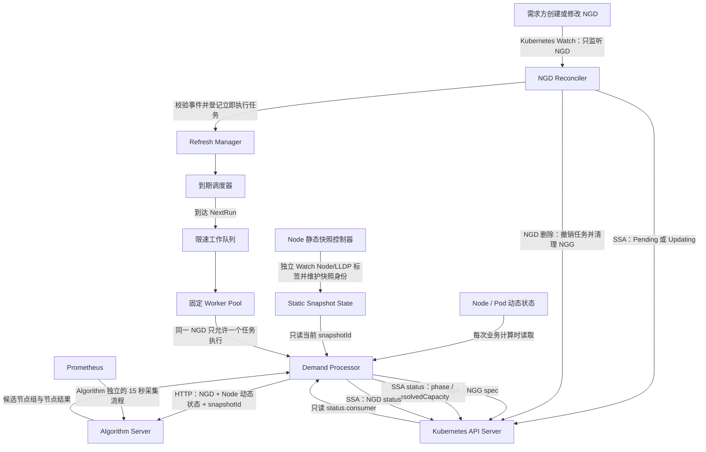
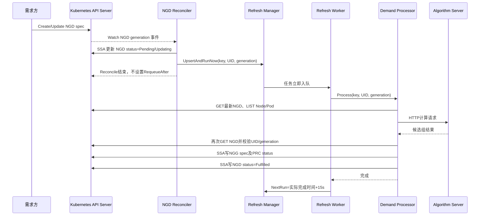
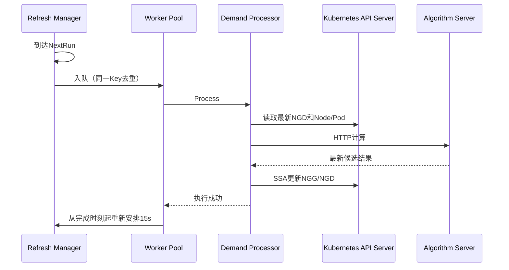
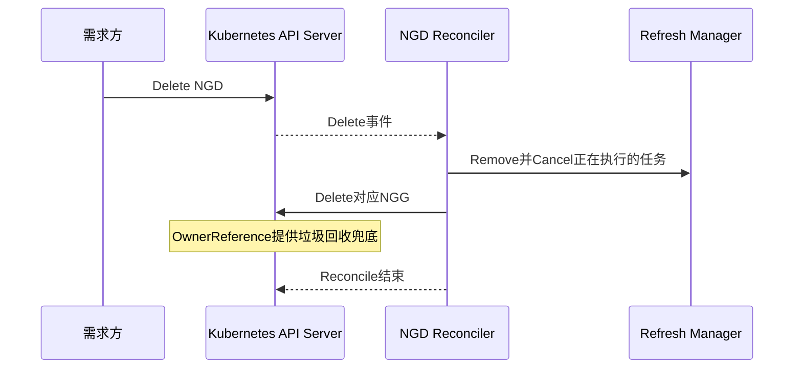
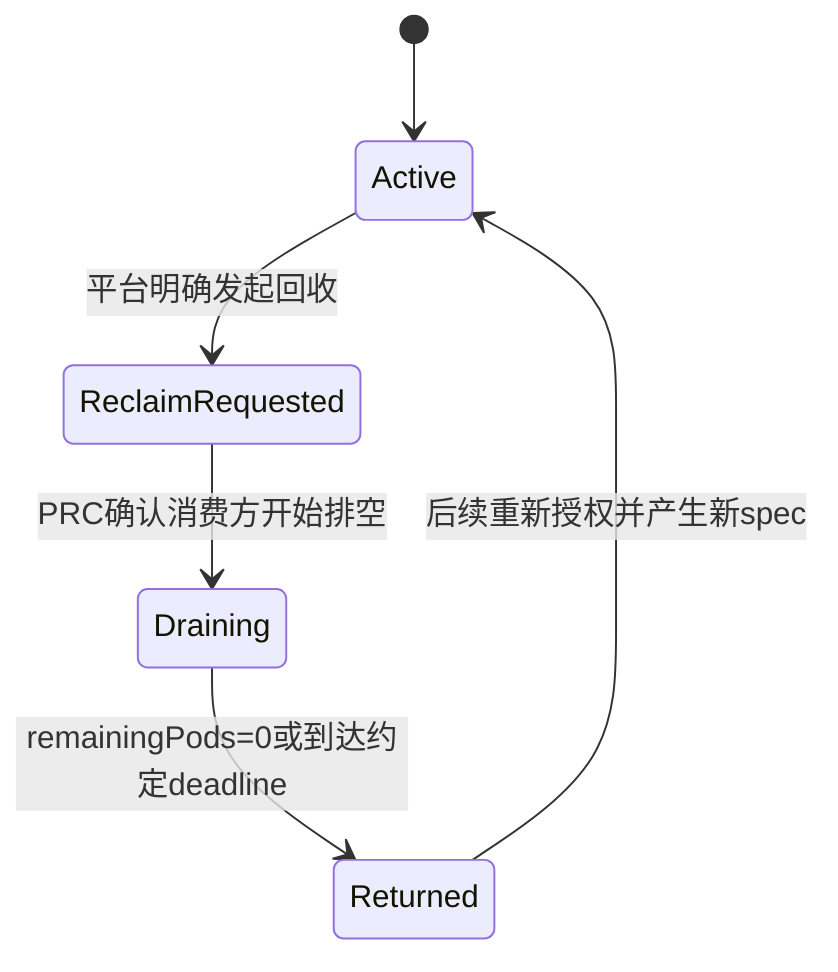

# PRC 事件驱动、周期刷新与接口权限完善设计 v1.0

## 1. 文档目的

本文只设计 **PRC（资源池控制器）**，不设计 Volcano/kube-scheduler 等 NGG 消费方的内部实现。

本文解决三个问题：

1. `NodeGroupDemandReconciler` 只响应 NGD 事件，不再使用 `RequeueAfter` 承担 15 秒循环刷新；
2. 使用独立的 Refresh Manager 持续计算并更新 NGG；
3. 按联通接口文档完善 PRC 的字段所有权、Server-Side Apply、删除清理和 NGG 生命周期处理。

设计依据：

- `docs/paas-schedbridge-master/接口设计文档.md`
- `docs/paas-schedbridge-master/crd-deploy/nodegroupdemand-crd.yaml`
- `docs/paas-schedbridge-master/crd-deploy/nodegroupgrant-crd.yaml`
- 当前实现 `prc/pkg/controller/prc_controller.go`

---

## 2. 范围与边界

### 2.1 PRC 负责

- Watch 联通正式 NGD；
- 读取 NGD `metadata/spec`；
- 写入 NGD `status`；
- 从 Kubernetes 读取 Node/Pod 动态状态；
- 使用独立维护的 Node 静态快照标识；
- 调用 Algorithm Server；
- 创建、更新和删除 NGG；
- 写入 NGG `metadata/spec`；
- 写入 NGG `status.phase` 和 `status.resolvedCapacity`；
- 只读 NGG `status.consumer`，不得覆盖该区域；
- 对 Active NGG 每 15 秒执行一次刷新；
- 管理刷新任务的并发、重试、取消和过期结果丢弃。

### 2.2 PRC 不负责

- Volcano/kube-scheduler 如何读取 NGG；
- 消费方如何使用 NGG 完成 Pod 调度；
- 消费方如何计算 `status.consumer.used`；
- 消费方如何执行排空并写入 `status.consumer.drain`；
- Algorithm Server 内部如何采集和缓存 Prometheus 指标；
- LLDP 采集器的具体实现。

PRC 只依赖上述组件提供约定的数据或接口，不接管其内部职责。

---

## 3. 当前实现存在的问题

当前 `NodeGroupDemandReconciler` 同时承担事件处理和周期任务：

```text
NGD/Node/Pod/拓扑事件
        │
        ▼
    Reconcile
        │
        ├──读取状态、调用算法、写 NGG
        │
        └──RequeueAfter(15s)
                 │
                 └────────再次进入 Reconcile
```

主要问题如下：

1. Reconcile 不仅 Watch NGD，还由 Node、Pod、拓扑事件批量触发所有 NGD；
2. `RequeueAfter(15s)`使没有 NGD 变更的对象也反复进入 Reconcile；
3. 初次处理和周期刷新存在两套触发语义，后续容易产生分支差异；
4. 每个 NGD 的刷新并发、超时和任务积压不容易统一控制；
5. NGD 在算法调用期间发生更新或删除时，旧结果可能覆盖新需求；
6. NGG 和 status 当前主要使用 Create/Merge Patch，而接口文档要求 SSA 字段所有权；
7. PRC RBAC 尚未包含删除正式 NGG 所需的 `delete` 权限；
8. NGD 删除后的 NGG 清理以及 `ReclaimRequested/Draining` 流程尚未完整实现。

---

## 4. 目标架构

### 4.1 总体结构



### 4.2 核心原则

- `NodeGroupDemandReconciler` **只 Watch NGD**；
- Reconcile **不调用 `RequeueAfter` 实现循环刷新**；
- 初次计算与周期刷新都经由同一个 `DemandProcessor`；
- Refresh Manager 是 Controller Manager 中独立运行的 Runnable；
- 静态快照维护和 Prometheus 指标采集仍是独立流程；
- Kubernetes CR 是事实来源，Refresh Task 只是可重建的进程内调度状态；
- PRC 只 Apply 自己拥有的字段，不复制、重写 `status.consumer`。

---

## 5. 组件职责

### 5.1 NodeGroupDemandReconciler

仅负责 NGD 事件入口，不直接执行完整算法链路。

#### NGD 创建

1. 读取并进行轻量协议校验；
2. 将 NGD status 设置为 `Pending`；
3. 调用 `RefreshManager.UpsertAndRunNow()`；
4. 返回空 `ctrl.Result{}`。

#### NGD spec 修改

1. Kubernetes 自动递增 NGD `metadata.generation`；
2. `GenerationChangedPredicate`接收该事件；
3. 将 NGD status 设置为 `Updating`；
4. 更新 Refresh Task 的 UID/generation，并要求立即执行；
5. 返回空 `ctrl.Result{}`。

#### 仅 status 变化

NGD status 子资源变化不会改变 `metadata.generation`，因此不会触发业务 Reconcile。

#### NGD 删除

1. 从 Refresh Manager 删除对应任务并取消正在执行的上下文；
2. 按确定性名称查询并删除对应 NGG；
3. 返回空 `ctrl.Result{}`。

正式 NGD 和 NGG 均为 Cluster Scope，创建 NGG 时还应设置指向 NGD 的 OwnerReference，作为控制器宕机期间遗漏删除事件时的兜底 GC 机制。

### 5.2 Refresh Manager

Refresh Manager 负责所有“什么时候计算”的问题，但不包含具体计算规则。

内部组成：

| 组件 | 职责 |
|---|---|
| Task Store | 保存 NGD Key、UID、generation、NextRun、Running、Dirty、取消函数 |
| Scheduler | 找出已到期任务，不执行具体刷新 |
| Rate-Limiting Queue | 去重、限速和失败退避 |
| Worker Pool | 固定并发读取任务并调用 Demand Processor |
| Recovery | PRC 启动后由现存 NGD 的 Add 事件重建内存任务 |

Refresh Task 建议结构：

```go
type RefreshTask struct {
    Key        types.NamespacedName
    UID        types.UID
    Generation int64
    Interval   time.Duration
    NextRun    time.Time
    Running    bool
    Dirty      bool
    Cancel     context.CancelFunc
}
```

`Generation`使用 Kubernetes 内建的 `metadata.generation`，不向联通 NGD spec/status 添加自定义字段。

### 5.3 Demand Processor

Demand Processor 是初次计算和周期刷新共用的唯一业务入口：

```go
Process(ctx, key, expectedUID, expectedGeneration) error
```

其职责为：

1. 从 Kubernetes 获取最新 NGD；
2. 校验 UID 和 generation；
3. 读取 Node/Pod 动态调度状态；
4. 获取已经准备好的静态快照 ID；
5. 构造请求并调用 Algorithm Server；
6. 校验 Algorithm 返回值与请求版本；
7. 再次读取 NGD，执行提交前版本检查；
8. 将排名第一的候选组转换成联通 NGG；
9. 使用 SSA 更新 NGG spec 和 PRC 拥有的 status 字段；
10. 使用 SSA 更新 NGD status。

Processor 不决定下一次执行时间，也不直接操作 Task Store。

### 5.4 Grant Lifecycle Coordinator

生命周期处理建议放在 Processor 内部的独立组件中，避免散落在 Reconciler 和 Refresh Manager：

```go
Evaluate(ngd, ngg) LifecycleDecision
```

它只处理 PRC 拥有的 `status.phase`，只读 `status.consumer`。

---

## 6. Watch 与周期刷新解耦后的流程

### 6.1 NGD 创建或修改



### 6.2 周期刷新



周期刷新不产生 NGD Watch 事件，也不会再次调用 `NodeGroupDemandReconciler.Reconcile()`。

### 6.3 NGD 删除



---

## 7. 调度、并发与一致性

### 7.1 15 秒周期定义

正常刷新采用：

```text
NextRun = 本次业务处理完成时间 + 15 秒
```

不采用“上一次计划时间 + 15 秒”，避免单次计算超过 15 秒后立即堆积补跑。

统计业务耗时时，只计算：

```text
Worker开始处理 → Algorithm调用 → NGG/NGD写入完成
```

日志和测试结果文件的生成时间不计入业务耗时。

### 7.2 同一 NGD 禁止并发

- 一个 UID 同一时刻最多有一个 Running 任务；
- Running 期间到达新的 generation 时，不再启动第二个任务，而是设置 `Dirty=true` 并取消旧请求；
- 旧任务退出后立即以最新 generation 再执行一次；
- 队列按 Key 去重，不能无限追加同一 NGD。

### 7.3 防止旧结果覆盖新需求

算法调用前记录：

```text
expectedUID
expectedGeneration
```

算法返回后、写 NGG 前重新 GET NGD：

- NGD 不存在：丢弃结果并清理 NGG；
- UID 不一致：表示同名 NGD 被删除后重建，丢弃旧结果；
- generation 不一致：表示 spec 已修改，丢弃旧结果并立即处理新 generation；
- 三者一致：允许提交结果。

### 7.4 多副本与主备

Refresh Manager 应作为 `controller-runtime.Manager` 的 Runnable 注册，并参与 Leader Election。多副本部署时只允许 Leader 调度和执行刷新任务。

Task Store 是内存状态，不需要额外 CRD 或 Redis：

- NGD/NGG 才是事实来源；
- Leader 重启后，Informer 会为现有 NGD 产生 Add 事件并重建任务；
- 首次恢复任务应立即运行，不需要等待一个完整的 15 秒周期。

### 7.5 失败重试

| 场景 | 处理 |
|---|---|
| Algorithm 暂时不可用 | 写 NGD Failed/message，按限速队列指数退避重试 |
| 静态快照未就绪 | 不调用算法，短退避重试 |
| Kubernetes 写入冲突 | 重新 GET 后重试 SSA，不盲目 Force |
| 没有可行候选节点 | 写 NGD Failed，NGG 按生命周期策略处理 |
| NGD 已更新或删除 | 当前结果作废，不记为业务失败 |

退避应设置上限；成功后清除失败次数并恢复正常 15 秒周期。

---

## 8. 字段所有权与 SSA 设计

### 8.1 PRC 字段边界

| 对象 | PRC 读取 | PRC 写入 | PRC 禁止写入 |
|---|---|---|---|
| NGD | `metadata/spec` | `status.*` | `spec.*` |
| NGG | 全对象 | `metadata/spec`、`status.phase`、`status.resolvedCapacity` | `status.consumer.*` |

### 8.2 Field Manager

建议使用两个明确的 Field Manager：

```text
ngd-ngg-prc-spec
ngd-ngg-prc-status
```

写入规则：

- NGG spec：主资源接口使用 SSA；
- NGD status：`Status().Patch(..., client.Apply, client.FieldOwner(...))`；
- NGG status：只在 Apply 对象中带 `phase/resolvedCapacity`；
- **不得为了“保留”而把现有 `status.consumer`复制到 PRC 的 Apply 对象中**；
- 不默认使用 `ForceOwnership`，发生冲突时应暴露配置或所有权错误；
- 如果历史 Merge Patch 已造成字段归属不清，可在升级窗口执行一次明确的迁移 Apply，不能在每轮刷新强制抢占。

目标 NGG status Patch 只包含：

```yaml
apiVersion: scheduling.platform.example.io/v1alpha1
kind: NodeGroupGrant
metadata:
  name: <grant-name>
status:
  phase: Active
  resolvedCapacity:
    nodes: 100
    cpu: "800"
    memory: "3200Gi"
```

其中不出现 `status.consumer`。

### 8.3 `metadata.generation`的使用

- 它是 Kubernetes 自动维护的内建字段；
- NGD spec 变化时递增，status 变化时不递增；
- Refresh Task 用它识别需求版本；
- PRC 不向联通 NGD 增加自定义 generation 字段。

NGG `status.consumer.acceptedGeneration`由消费方写入，表示消费方已经接受哪个 NGG spec generation。PRC 可以读取它用于可观测性，但：

- `acceptedGeneration == metadata.generation`不代表 NGG 已结束；
- Active NGG 仍需继续按 15 秒刷新；
- 不能用它决定是否停止 Refresh Task。

### 8.4 RBAC 调整

正式接口所需最小权限建议为：

```yaml
- apiGroups: ["scheduling.platform.example.io"]
  resources: ["nodegroupdemands"]
  verbs: ["get", "list", "watch"]
- apiGroups: ["scheduling.platform.example.io"]
  resources: ["nodegroupdemands/status"]
  verbs: ["get", "patch", "update"]
- apiGroups: ["scheduling.platform.example.io"]
  resources: ["nodegroupgrants"]
  verbs: ["get", "list", "watch", "create", "patch", "delete"]
- apiGroups: ["scheduling.platform.example.io"]
  resources: ["nodegroupgrants/status"]
  verbs: ["get", "patch", "update"]
```

重点是补充 NGG `delete`。PRC 不需要修改 NGD 主资源，也不需要修改 `status.consumer`。

---

## 9. NGG 生命周期处理

### 9.1 Active

- NGG 可供消费方使用；
- Refresh Task 每 15 秒重新计算；
- PRC更新 `spec.timestamp/source/nodes`和`status.resolvedCapacity`；
- PRC只读消费方状态；
- 消费方是否已更新 `acceptedGeneration`只影响告警，不停止刷新。

### 9.2 当前 MVP 的删除语义

联通接口文档当前明确：

```text
删除 NGD → PRC 删除对应 NGG
```

因此当前 MVP 应先严格执行：

1. 删除 Refresh Task；
2. 取消运行中的算法请求；
3. 删除 NGG；
4. 由 OwnerReference/GC 做遗漏事件兜底。

不应在没有接口触发字段和超时约定的情况下，擅自把 NGD 删除改成长期排空流程。

### 9.3 Phase 3 回收状态机

CRD 已预留：

```text
Active → ReclaimRequested → Draining → Returned
```

建议后续通过明确的平台回收入口驱动，而不是从 `acceptedGeneration`推断：



字段写入方：

| 字段 | 写入方 |
|---|---|
| `status.phase` | PRC |
| `status.resolvedCapacity` | PRC |
| `status.consumer.acceptedGeneration` | 消费方 |
| `status.consumer.used` | 消费方 |
| `status.consumer.drain` | 消费方 |

进入非 Active 状态后，普通 Refresh Worker 不得再次把 phase 写回 Active。Refresh Manager 应将该任务交给 Lifecycle Coordinator：

- `ReclaimRequested/Draining`：停止普通节点组重算，只周期检查消费反馈；
- `Returned`：移除 Refresh Task；
- 重新授权必须来自明确的新操作，不能由普通 15 秒刷新自动完成。

Phase 3 正式实现前还需由双方确认三个接口条件：回收触发来源、排空 deadline、超时后是强制 Returned 还是保持 Draining。它们不应通过新增未约定的 NGD 字段临时实现。

---

## 10. 建议代码结构

```text
prc/
├── cmd/main.go
└── pkg/
    ├── application/
    │   └── application.go              # 组装 Manager、Controller、Refresh Manager
    ├── controller/
    │   ├── ngd_controller.go           # 只 Watch NGD、登记/删除刷新任务
    │   └── static_snapshot_controller.go # 独立维护静态快照身份
    ├── refresh/
    │   ├── manager.go                  # Runnable生命周期
    │   ├── task_store.go               # UID/generation/运行状态
    │   ├── scheduler.go                # 到期调度
    │   └── worker.go                   # 固定并发和重试
    ├── processor/
    │   ├── demand_processor.go         # 唯一业务处理入口
    │   ├── request_builder.go          # 构造Algorithm请求
    │   ├── grant_builder.go            # Algorithm响应转联通NGG
    │   ├── lifecycle.go                # NGG生命周期判断
    │   └── stale_guard.go              # UID/generation提交前校验
    └── kubeio/
        ├── ssa_writer.go               # NGD/NGG按字段所有权Apply
        └── grant_cleanup.go            # 删除和OwnerReference
```

如果不希望一次拆分过多包，可以先保留 `controller` 包，但至少应形成四个清晰对象：

```text
NodeGroupDemandReconciler
RefreshManager
DemandProcessor
SSAWriter
```

---

## 11. Application 启停顺序

`application.New()`负责一次性组装完整 PRC：

1. 创建 controller-runtime Manager；
2. 创建共享 StaticSnapshotState；
3. 注册静态快照 Controller；
4. 创建 SSAWriter 和 DemandProcessor；
5. 创建 Refresh Manager，并以 Leader-Election Runnable 加入 Manager；
6. 注册只 Watch NGD 的 NodeGroupDemandReconciler；
7. 注册健康检查和就绪检查。

启动关系：

```text
prc/cmd/main.go
      │
      ▼
application.New
      │ 注册所有组件
      ▼
application.Start
      │
      ▼
controller-runtime Manager.Start
```

PRC Ready 至少应满足：

- Kubernetes Informer Cache 已同步；
- Refresh Manager 已启动；
- 静态快照已被当前 Algorithm Server 确认。

---

## 12. 可观测性

### 12.1 建议指标

| 指标 | 含义 |
|---|---|
| `prc_refresh_tasks` | 当前刷新任务数 |
| `prc_refresh_queue_depth` | 队列深度 |
| `prc_refresh_running` | 正在运行的任务数 |
| `prc_refresh_duration_seconds` | 单次业务刷新耗时 |
| `prc_algorithm_duration_seconds` | Algorithm HTTP耗时 |
| `prc_refresh_result_total{result}` | success/error/stale/cancelled计数 |
| `prc_refresh_lag_seconds` | 实际开始时间相对NextRun的延迟 |
| `prc_ngg_consumer_generation_lag` | NGG generation与acceptedGeneration差值 |

### 12.2 关键日志字段

每次处理统一记录：

```text
ngdName
ngdUID
ngdGeneration
trigger=create|update|periodic|retry
requestId
algorithmDuration
totalDuration
result=success|error|stale|cancelled
nggName
nggGeneration
```

---

## 13. 测试验收设计

### 13.1 Reconciler 单元测试

- NGD 创建只登记一个立即任务；
- NGD spec 更新用新 generation 覆盖旧任务；
- NGD status 更新不触发业务处理；
- Reconcile 返回值不包含 `RequeueAfter`；
- NGD 删除会 Remove/Cancel Task 并删除 NGG。

### 13.2 Refresh Manager 单元测试

- 15 秒到期后入队；
- 同一 NGD 不并发；
- 执行 20 秒时不在第 15 秒重叠启动；
- 完成后按“完成时间 + 15 秒”安排；
- 更新中的任务设置 Dirty 并切换到新 generation；
- 失败执行指数退避且有上限；
- Manager 停止时所有 Worker 和请求正确退出。

测试应使用 fake clock，避免单元测试真实等待 15 秒。

### 13.3 Processor/envtest 集成测试

- 使用真实 envtest API Server/etcd；
- 使用 Mock Algorithm HTTP Server；
- 验证 NGD → Algorithm请求 → NGG → NGD status 全链路；
- 算法执行期间更新 NGD，旧 generation 结果不得写入；
- 算法执行期间删除 NGD，不得重新创建 NGG；
- 消费方先写 `status.consumer`，PRC刷新后该字段和值保持不变；
- 检查 managedFields：PRC只拥有约定字段；
- NGD 删除后 NGG 被删除；
- 重启 Refresh Manager 后能从已有 NGD 恢复任务。

### 13.4 RBAC 验证

- PRC 可以 get/list/watch NGD；
- PRC 可以 patch NGD status；
- PRC 可以 create/patch/delete NGG；
- PRC 可以 patch 自己拥有的 NGG status；
- 测试或审计确认 PRC 不写 `status.consumer`。

---

## 14. 分阶段实施顺序

### 第一阶段：解耦执行路径

1. 提取 `DemandProcessor`；
2. 初次和周期执行统一调用 Processor；
3. 实现 Refresh Manager、Task Store、Worker Pool；
4. Reconciler 改为只 Watch NGD，并移除业务 `RequeueAfter`；
5. 更新 Application 统一装配。

### 第二阶段：接口权限完善

1. NGD status 改为 SSA；
2. NGG spec/status 改为分字段 SSA；
3. 去掉“读取后复制 consumer 再整体写 status”的实现；
4. 增加 NGG delete 权限；
5. 增加 OwnerReference 和删除清理；
6. 增加 managedFields/consumer 保留测试。

### 第三阶段：稳定性与观测

1. 增加 generation/UID 旧结果保护；
2. 增加失败退避、超时和取消；
3. 增加 Prometheus 指标和结构化日志；
4. 使用现有四组 Go Test 回归功能与性能。

### 第四阶段：Phase 3 回收（双方确认后）

1. 确认回收触发入口；
2. 确认排空 deadline 和超时策略；
3. 实现 Lifecycle Coordinator；
4. 联调消费方的 `status.consumer.drain`写回。

---

## 15. 最终结论

PRC 应从“一个反复 Requeue 的大 Reconciler”调整为：

```text
NGD Reconciler：只接收需求事件
Refresh Manager：独立管理15秒周期
Demand Processor：统一执行一次真实业务计算
SSA Writer：严格执行字段所有权
Lifecycle Coordinator：管理NGG生命周期
```

这样既满足“Reconcile 只 Watch NGD、循环刷新不放在 Reconcile”的要求，也与联通 NGD/NGG 接口的字段权限保持一致。当前应优先完成 Active/MVP 路径、SSA 和删除清理；`ReclaimRequested/Draining`应在回收触发条件与超时规则确认后再实现，避免擅自改变现有接口语义。
