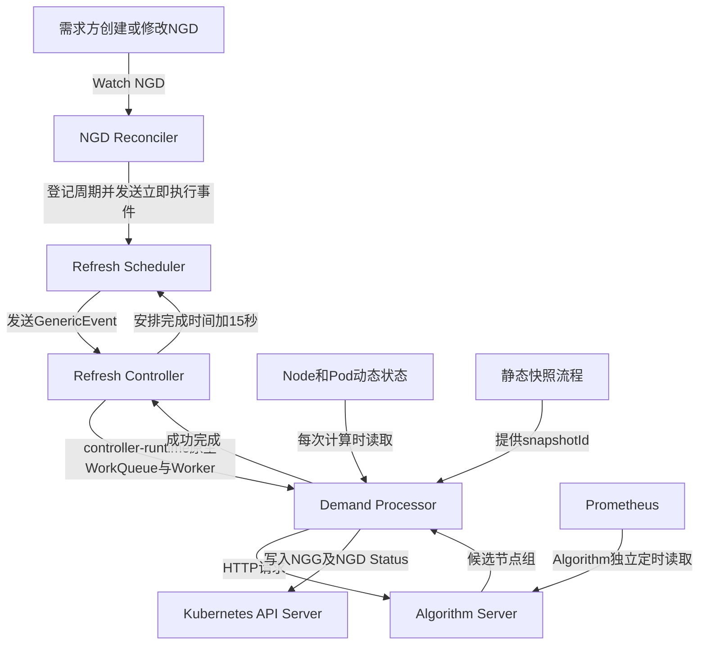

# PRC 事件驱动与周期刷新设计（精简版）v1.0

## 1. 设计目标

本方案只负责 PRC，不涉及 Volcano/kube-scheduler 消费 NGG 的内部实现。

需要完成三个调整：

1. PRC 的 Reconcile 只响应 NGD 创建、spec 更新和删除事件；
2. 15 秒循环刷新从 NGD Reconcile 中移出，由 Refresh Scheduler 触发；
3. PRC 按联通接口约定读写 NGD/NGG，不能覆盖消费方维护的字段。

任务队列、并发 Worker、失败限速和重试全部使用 `controller-runtime` 原生 Controller 能力，PRC 不自行实现 Worker Pool。

---

## 2. 整体结构



各组件可以简单理解为：

| 组件 | 功能 |
|---|---|
| NGD Reconciler | 发现 NGD 创建、修改或删除 |
| Refresh Scheduler | 只负责登记周期，并在立即执行或15秒到期时发送事件 |
| Refresh Controller | 使用 controller-runtime 原生队列、Worker、并发及失败重试 |
| Demand Processor | 完成一次“读取 NGD→调用算法→生成 NGG” |

这里的 Worker 是 controller-runtime Controller 内部的原生 Worker，不是 Kubernetes Worker Node，也不是 PRC 自己创建的一套 Worker Pool。

---

## 3. Reconcile 如何处理 NGD

Reconcile 不再包含循环定时器，也不直接承担 15 秒刷新。

### 3.1 创建 NGD

```text
创建NGD
   ↓
Reconciler Watch到事件
   ↓
NGD Status设为Pending
   ↓
Refresh Scheduler登记周期并发送立即执行事件
   ↓
Reconcile结束，不设置RequeueAfter
```

### 3.2 更新 NGD

更新 NGD spec 后，Kubernetes 会自动增加内建字段：

```yaml
metadata:
  generation: 2
```

处理流程：

```text
修改NGD spec
   ↓
Reconciler Watch到generation变化
   ↓
NGD Status设为Updating
   ↓
Refresh Scheduler发送新generation的立即执行事件
   ↓
重新调用Algorithm Server
   ↓
更新原来的NGG
   ↓
NGD Status设为Fulfilled
```

如果旧算法请求仍在执行，PRC 在写 NGG 前会重新读取 NGD：

- UID 或 generation 已变化：丢弃旧结果；
- UID 和 generation 没变化：允许写入结果。

这样可以避免旧需求的计算结果覆盖新需求。

### 3.3 删除 NGD

```text
删除NGD
   ↓
Reconciler收到删除事件
   ↓
删除Refresh Scheduler中的定时任务
   ↓
取消正在执行的算法请求
   ↓
删除对应NGG
```

正式 NGD 和 NGG 都是 Cluster Scope。创建 NGG 时增加指向 NGD 的 OwnerReference，用 Kubernetes 垃圾回收作为删除兜底。

---

## 4. 15 秒周期刷新与原生 Worker

Refresh Scheduler 是 PRC 中独立运行的定时触发组件，不通过下面的代码反复进入 NGD Reconcile：

```go
return ctrl.Result{RequeueAfter: 15 * time.Second}, nil
```

新的周期流程：

```text
Refresh Scheduler中的任务到期
   ↓
向Refresh Controller发送GenericEvent
   ↓
controller-runtime原生WorkQueue接收并去重
   ↓
controller-runtime原生Worker取出任务
   ↓
Demand Processor完成一次处理
   ↓
NGG和NGD Status写入完成
   ↓
从完成时间开始再等待15秒
```

下一次运行时间为：

```text
NextRun = 本次处理完成时间 + 15秒
```

如果一次处理用了 20 秒，不会在第 15 秒重叠执行第二次。同一个 NGD 同一时刻只能执行一个任务。

### 4.1 哪些能力使用原生实现

Refresh Controller 使用 controller-runtime 原生能力：

- 原生 WorkQueue；
- 相同 Key 去重；
- 原生并发 Worker；
- 返回 error 后的限速重试；
- Controller Context 取消；
- Leader Election 和组件启停管理。

并发数直接通过 Controller 配置：

```go
controller.Options{
    MaxConcurrentReconciles: 5,
}
```

PRC 不再自行编写下面这种 Worker Pool：

```go
for i := 0; i < workerCount; i++ {
    go worker.Run(ctx)
}
```

### 4.2 哪部分需要 PRC 实现

Kubernetes/controller-runtime 不知道每个 NGD 需要每 15 秒刷新一次，因此 PRC 只实现一个轻量的 Refresh Scheduler：

1. 保存 NGD Key、UID、generation 和下一次执行时间；
2. NGD 创建或更新时发送立即执行事件；
3. 到达 15 秒时向 Refresh Controller 发送 `GenericEvent`；
4. NGD 删除时取消对应定时任务；
5. Refresh Controller 成功结束后，从完成时间重新安排下一次执行。

Refresh Scheduler 不负责业务计算、不维护 Worker Pool，也不自行实现失败重试队列。

---

## 5. Demand Processor 一次做什么

Refresh Controller 的原生 Worker 取得任务后，只调用一个统一入口：

```go
processor.Process(ctx, ngdKey, uid, generation)
```

一次处理包括：

```text
1. 从Kubernetes读取最新NGD
2. 检查UID和generation
3. 读取Node/Pod动态状态
4. 获取静态快照snapshotId
5. 构造请求并调用Algorithm Server
6. 校验算法结果
7. 再次检查NGD是否更新或删除
8. 选择算法返回的第一候选组
9. 创建或更新NGG
10. 更新NGD Status
```

初次计算和后续 15 秒刷新都调用这一个 Processor，避免出现两套处理逻辑。

---

## 6. NGG 被消费后怎么处理

消费方通过以下字段表示已经接收当前 NGG：

```yaml
status:
  consumer:
    acceptedGeneration: 3
```

当：

```text
acceptedGeneration == NGG.metadata.generation
```

只表示消费方已接受当前 NGG 版本，不表示 NGG 已完成或可以删除。

正常处理方式：

```text
NGG处于Active
   ↓
消费方读取并使用NGG
   ↓
消费方更新status.consumer
   ↓
PRC只读取该状态，不修改
   ↓
PRC继续每15秒刷新NGG
```

当前 MVP 的停止条件是 NGD 被删除：

```text
NGD存在 → NGG保持Active并持续刷新
NGD删除 → 停止刷新并删除NGG
```

---

## 7. 字段读写权限

| 对象 | PRC读取 | PRC写入 | PRC不能写入 |
|---|---|---|---|
| NGD | `metadata/spec` | `status.*` | `spec.*` |
| NGG | 全对象 | `metadata/spec`、`status.phase`、`status.resolvedCapacity` | `status.consumer.*` |

PRC 使用 Kubernetes Server-Side Apply，只提交自己负责的字段。

建议 Field Manager：

```text
ngd-ngg-prc-spec
ngd-ngg-prc-status
```

PRC 更新 NGG status 时只提交：

```yaml
status:
  phase: Active
  resolvedCapacity:
    nodes: 100
    cpu: "800"
    memory: "3200Gi"
```

其中不能包含 `status.consumer`，因此不会覆盖消费方写入的内容。

RBAC 还需要给正式 NGG 增加 `delete` 权限，用于 NGD 删除后的清理。

---

## 8. NGG 生命周期

### 8.1 当前 MVP

当前严格按照联通接口文档处理：

```text
创建NGD → 创建Active NGG
更新NGD → 更新原NGG
消费NGG → NGG继续保留和刷新
删除NGD → 删除NGG
```

### 8.2 后续回收阶段

CRD 预留了：

```text
Active → ReclaimRequested → Draining → Returned
```

其中：

- PRC 写 `status.phase`；
- 消费方写 `status.consumer.drain`；
- PRC 只读取排空结果并推进生命周期。

正式实现前还需要需求方确认：

1. 谁发起回收；
2. 排空超时时间；
3. 超时后强制 Returned，还是继续保持 Draining。

因此该状态机作为后续 Phase 3，不影响当前 MVP。

---

## 9. 代码调整建议

至少形成五个清晰组件：

```text
NodeGroupDemandReconciler  # 只Watch NGD事件
RefreshScheduler          # 只管理15秒定时并发送GenericEvent
RefreshController         # 使用controller-runtime原生队列和Worker
DemandProcessor           # 执行一次完整业务处理
SSAWriter                 # 按权限写NGD和NGG
```

建议实施顺序：

1. 从当前 Reconcile 提取 Demand Processor；
2. 实现轻量 Refresh Scheduler；
3. 注册使用 GenericEvent Source 的 Refresh Controller，并配置 `MaxConcurrentReconciles`；
4. NGD Reconcile 改成只登记、更新或删除定时任务；
5. 删除 NGD 业务流程中的 `RequeueAfter`；
6. NGD/NGG 写入改成 SSA；
7. 增加 UID/generation 旧结果保护；
8. 增加 NGG 删除权限和 OwnerReference；
9. 回归现有 Go Test 与 Debug 流程。

---

## 10. 最终流程

```text
NGD创建或更新
      ↓
Reconciler登记任务后结束
      ↓
Refresh Scheduler发送立即或15秒到期事件
      ↓
Refresh Controller原生队列去重
      ↓
controller-runtime原生Worker并发执行
      ↓
Demand Processor调用Algorithm并写NGG
      ↓
完成15秒后再次刷新

NGD删除
      ↓
停止任务并删除NGG
```

最终达到：

- Reconcile 只处理 NGD 事件；
- 周期刷新不再反复进入 NGD Reconcile，而是进入独立的 Refresh Controller；
- 队列、并发 Worker 和失败重试使用 controller-runtime 原生能力；
- 初次处理和周期刷新使用同一业务代码；
- NGD 更新不会被旧计算结果覆盖；
- NGG 被消费后继续刷新，直到 NGD 被删除；
- PRC 不覆盖消费方维护的 `status.consumer`。
