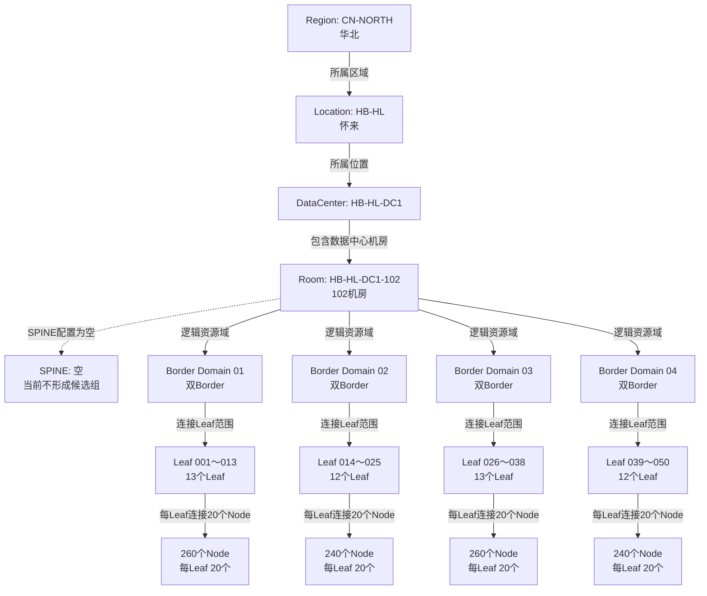
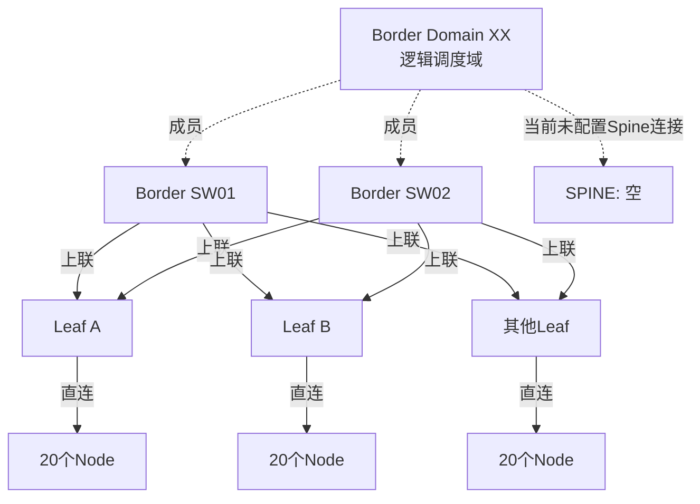
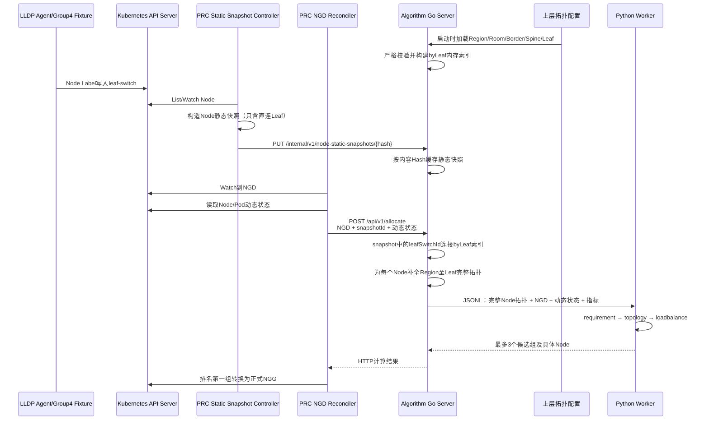
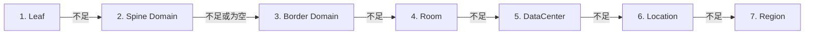
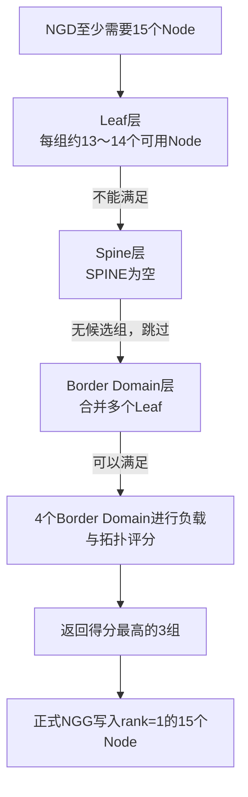

# Group4 拓扑获取、拼接与拓扑算法说明

> 项目路径：`/mnt/data0/volcano-scheduler/ngd-ngg-scheduling-demo`  
> 整理日期：2026-09-03  
> 说明范围：当前 Group4 全链路 Go Test、生产部署对应的数据获取方式，以及 Algorithm Server 的拓扑选择逻辑

## 1. 核心结论

当前拓扑采用“直连关系动态采集、上层关系独立配置、Algorithm Server 内存拼接”的方式：

1. LLDP Agent 只确认 `Node → Leaf`，并且只把直连 Leaf 写入 Kubernetes Node Label；
2. PRC 从 Kubernetes API 读取 Node，把 Node 身份、资源、标签和 `leafSwitchId` 上传为静态快照；
3. Algorithm Server 的 Go 层独立读取 Leaf 上层拓扑配置，包括 Region、Location、DataCenter、Room、Border Domain、Spine 和 Leaf 邻接关系；
4. 每次计算时，Go 层以 `leafSwitchId` 为连接键，把 PRC 静态快照与上层拓扑拼接成完整 Node 拓扑；
5. Python Worker 不读取拓扑文件，只消费 Go 层已经补全的 Node，固定执行 `requirement → topology → loadbalance`；
6. 拓扑算法采用 NarrowestFit：从最窄的 Leaf 开始，当前层不能满足资源需求才向更宽层级上升；
7. Algorithm 最多返回 3 个有序候选组，联通正式 NGG 当前只写入排名第一组及其具体 Node。

Kubernetes 只负责保存 Node Label、托管 ConfigMap 和持久化 NGD/NGG，不理解也不执行完整拓扑算法。

## 2. Group4 测试拓扑

### 2.1 总体规模

Group4 单组功能测试使用 1000 个模拟 Node：

| 层级 | 数量 | 说明 |
|---|---:|---|
| Region | 1 | `CN-NORTH`，华北 |
| Location | 1 | `HB-HL`，怀来 |
| DataCenter | 1 | `HB-HL-DC1` |
| Room | 1 | `HB-HL-DC1-102`，102 机房 |
| Border Domain | 4 | 每个 Domain 包含两台物理 Border |
| Spine | 0 | 配置保留 `SPINE: {}`，当前为空 |
| Leaf | 50 | 每个 Leaf 连接一个确定的双 Border Domain |
| Node | 1000 | 每个 Leaf 下 20 个 Node |

Group4 测试输入拓扑位于：

- `go_test_suites/group4_full_real_algorithm/testdata/input/network-topology.yaml`
- `go_test_suites/group4_full_real_algorithm/testdata/input/node-static-snapshot.json`
- `go_test_suites/group4_full_real_algorithm/testdata/input/kubernetes-nodes.json`

拓扑与 Node 数据由 `go_test_suites/common/fixture.go` 的 `GenerateFixture(1000)` 统一生成。

### 2.2 Group4 整体拓扑图



### 2.3 单个 Border Domain 的物理含义

Border Domain 是算法中的逻辑调度域，不是一台真实交换机。每个 Domain 显式包含两台物理 Border；该 Domain 下的多个 Leaf 均连接这组相同的 Border。



例如 `BORDER-DOMAIN-01` 的成员集合为：

```yaml
members:
  - HB-HL-DC1-102-BORDER-DOMAIN-01-SW01-ZTE9904X
  - HB-HL-DC1-102-BORDER-DOMAIN-01-SW02-ZTE9904X
```

属于该 Domain 的每个 Leaf，其 `BORDER` 邻接表必须与这个成员集合完全一致。这样不会把同一 Node 同时放入两个相互重叠的“单 Border 候选组”。

## 3. 拓扑数据从哪里来

### 3.1 生产环境的数据来源

生产设计中，拓扑分为两类数据：

| 数据 | 来源 | 持久化位置 | 使用方 |
|---|---|---|---|
| Node 直连 Leaf | LLDP Agent 动态采集 | Node Label | PRC、Algorithm |
| Region/Location/DC/Room | 运维静态配置 | Algorithm 拓扑 YAML | Algorithm Go 层 |
| Leaf 与 Spine/Border/Peer Leaf 的邻接关系 | 运维静态配置 | Algorithm 拓扑 YAML | Algorithm Go 层 |
| Border Domain 定义 | 运维显式配置 | Algorithm 拓扑 YAML | Algorithm Go 层 |
| Node CPU、内存、标签 | Kubernetes Node | Kubernetes API | PRC |
| Node Ready、不可调度和已请求资源 | Kubernetes Node/Pod | Kubernetes API | PRC |
| CPU、内存和网络负载指标 | Prometheus | Algorithm 内存指标缓存 | Algorithm、Python Worker |

LLDP Agent 写入的核心 Label 是：

```yaml
topology.demo.ngg.io/leaf-switch: leaf-001
```

Leaf 以上的信息不写入 Node，也不放进 NGD。

### 3.2 Group4 中如何模拟

Group4 不启动真实 LLDP Agent，也不创建 1000 台真实机器。测试通过以下方式模拟真实边界：

1. `GenerateFixture(1000)` 创建 1000 个 Kubernetes `Node` 对象；
2. 每个 Node 只携带 `topology.demo.ngg.io/leaf-switch` Label，模拟 LLDP 已完成采集和持久化；
3. 这些 Node 被提交到 envtest 启动的真实 Kubernetes API Server/etcd；
4. PRC 使用真实 controller-runtime Client/List/Watch 读取 Node 和 NGD；
5. 上层拓扑由 Fixture 生成独立 YAML，再通过 `TopologyConfigData` 注入真实 Algorithm Server；
6. Algorithm Server 仍使用生产代码 `loadTopologyCache()` 严格解析、校验和缓存拓扑；
7. Algorithm Go 层通过 JSONL 调用真实 Python Worker。

因此，Group4 模拟的是 LLDP 的“结果”，而不是 LLDP 报文本身；从 PRC 读取 Kubernetes 到 Algorithm 解析、拼接、计算和生成 NGG 均使用真实项目代码。

## 4. 拓扑拼接流程

### 4.1 全链路图



### 4.2 拼接前的数据

PRC 上传给 Algorithm 的 Node 静态拓扑只包含 Leaf：

```json
{
  "nodeName": "worker-0001",
  "nodeUID": "uid-worker-0001",
  "allocatable": {
    "cpu": "32",
    "memory": "128Gi",
    "nvidia.com/gpu": "4"
  },
  "labels": {
    "tests.ngg.io/worker": "true",
    "topology.demo.ngg.io/leaf-switch": "leaf-001"
  },
  "topology": {
    "switchId": "leaf-001",
    "leafSwitchId": "leaf-001"
  }
}
```

这个快照使用内容 SHA-256 Hash 作为 `nodeStaticSnapshotId`。拓扑关系变化导致 Node 的 Leaf Label 变化时，静态快照 Hash 也会变化。

### 4.3 上层拓扑配置

Algorithm Server 单独维护如下信息：

```yaml
version: unicom-border-domain-v1

scopes:
  regions:
    - id: CN-NORTH
      name: 华北
  locations:
    - id: HB-HL
      name: 怀来
      regionId: CN-NORTH
  dataCenters:
    - id: HB-HL-DC1
      locationId: HB-HL
  rooms:
    - id: HB-HL-DC1-102
      dataCenterId: HB-HL-DC1

borderDomains:
  HB-HL-DC1-102-BORDER-DOMAIN-01:
    roomId: HB-HL-DC1-102
    mode: exact-set
    members:
      - HB-HL-DC1-102-BORDER-DOMAIN-01-SW01-ZTE9904X
      - HB-HL-DC1-102-BORDER-DOMAIN-01-SW02-ZTE9904X

topology:
  HB-HL-DC1-102:
    leaf-001:
      SPINE: {}
      BORDER:
        HB-HL-DC1-102-BORDER-DOMAIN-01-SW01-ZTE9904X: {}
        HB-HL-DC1-102-BORDER-DOMAIN-01-SW02-ZTE9904X: {}
      LEAF: {}
```

生产 Kubernetes 部署通过 `config/manager/algorithm.yaml` 创建 ConfigMap，并挂载为：

```text
/etc/ngd-ngg/topology/topology.yaml
```

Algorithm Server 使用 `TOPOLOGY_CONFIG_FILE` 找到该文件。Kubernetes 只把 ConfigMap 当作普通文本保存和挂载，并不会理解其中的拓扑结构。

Group4 为保证测试输入确定，不读取生产 ConfigMap，而是将同结构 YAML 作为 `TopologyConfigData` 直接注入 Algorithm Server。两种方式最终都进入相同的 `loadTopologyCache()` 解析逻辑。

### 4.4 Go 层的连接键和补全结果

唯一连接键是：

```text
Node.topology.leafSwitchId
        =
topologyCache.byLeaf[leafId]
```

Go 层通过 Leaf 查询并补全：

```json
{
  "regionId": "CN-NORTH",
  "locationId": "HB-HL",
  "dataCenterId": "HB-HL-DC1",
  "roomId": "HB-HL-DC1-102",
  "borderDomainId": "HB-HL-DC1-102-BORDER-DOMAIN-01",
  "borderSwitchIds": [
    "HB-HL-DC1-102-BORDER-DOMAIN-01-SW01-ZTE9904X",
    "HB-HL-DC1-102-BORDER-DOMAIN-01-SW02-ZTE9904X"
  ],
  "spineDomainId": "",
  "spineSwitchIds": [],
  "leafSwitchId": "leaf-001",
  "switchId": "leaf-001",
  "peerLeafSwitchIds": [],
  "bandwidthGbps": 25,
  "latencyMillis": 4
}
```

如果 Node 的 Leaf 不存在于 Algorithm 拓扑配置中，该 Node 不进入本次计算并产生 warning；如果所有 Node 都无法解析，则本次请求返回拓扑解析失败。

## 5. 拓扑配置加载和校验

Algorithm Server 在启动阶段读取拓扑，而不是收到每个 NGD 后重新读取文件。当前主要校验包括：

1. `version` 不能为空；
2. Region、Location、DataCenter、Room 四级 Scope 必须存在；
3. Location 必须引用有效 Region；
4. DataCenter 必须引用有效 Location；
5. Room 必须引用有效 DataCenter；
6. 同一个 Leaf 不能出现在多个 Room；
7. 每个 Leaf 必须至少存在一个 Border 连接；
8. `SPINE: {}` 是合法配置；
9. Border Domain 必须包含 `roomId` 和非空成员集合；
10. Border Domain 成员必须是拓扑中真实出现的 Border；
11. 每个 Leaf 的 Border 集合必须精确匹配一个且仅一个 Border Domain；
12. Leaf 引用的 Peer Leaf 必须存在；
13. 规范化配置后计算内容 Hash，作为 `topologySnapshotId` 返回。

当前没有实现拓扑文件热加载。生产环境修改 ConfigMap 后，需要重启 Algorithm Deployment 才能加载新配置。

## 6. 拓扑算法

### 6.1 固定算法顺序

Python Worker 固定执行：

```text
requirement → topology → loadbalance
```

联通正式 NGD 不携带算法编排字段，也不携带完整拓扑配置。

### 6.2 Requirement：先确定可参与分组的 Node

Requirement 阶段合并静态 Node、PRC 发送的动态状态和 NGD 约束，依次排除：

1. `inUse=true` 的 Node；
2. `nodeSelector.matchLabels` 不匹配的 Node；
3. `nodeSelector.matchExpressions` 不匹配的 Node；
4. 扣除已请求资源后，无法容纳最低 Pod 请求的 Node。

输出是本次任务可参与拓扑分组的 `current_nodes`，并按 Node 名称和 UID 稳定排序。

### 6.3 Topology：从窄到宽生成候选组

固定层级顺序为：



每一层都按照对应字段分组：

| 层级 | Node 拓扑字段 | 候选组示例 |
|---|---|---|
| Leaf | `leafSwitchId` | `leaf:leaf-001` |
| Spine Domain | `spineDomainId` | `spine-domain:...` |
| Border Domain | `borderDomainId` | `border-domain:HB-HL-DC1-102-BORDER-DOMAIN-01` |
| Room | `roomId` | `room:HB-HL-DC1-102` |
| DataCenter | `dataCenterId` | `data-center:HB-HL-DC1` |
| Location | `locationId` | `location:HB-HL` |
| Region | `regionId` | `region:CN-NORTH` |

字段为空时不会生成该层候选组。因此 Group4 的 `spineDomainId` 为空，算法会自然跳过 Spine 层。

### 6.4 NarrowestFit：选择最窄可行层级

当前算法不是把所有层级混在一起比较，而是：

1. 从 Leaf 层开始检查；
2. 如果当前层存在任何能满足 NGD 资源下限的组，就只保留当前层；
3. 不再计算 Room、DataCenter 等更宽层级；
4. 只有当前层没有可行组时，才继续向上扩大范围。

这种方式尽量把任务限制在较小的网络故障域内，减少跨 Leaf、跨 Border Domain 或跨机房调度。

### 6.5 Loadbalance：层内评分与选 Node

确定最窄可行层级后，在该层级的多个候选组之间评分。Node 分数综合：

- Node 剩余 CPU 比例；
- Node 剩余内存比例；
- Prometheus CPU、内存和网络指标；
- 静态 Leaf 带宽与时延。

拓扑质量分当前按以下方式计算：

```text
bandwidthScore = min(100, bandwidthGbps / 25 × 100)
latencyScore   = min(100, 1 / latencyMillis × 100)

topologyQuality = 0.7 × bandwidthScore + 0.3 × latencyScore
```

候选组分数为：

```text
groupScore =
    (1 - topologyWeight) × 组内选中Node平均分
    + topologyWeight × topologyQuality
```

每个候选组内部按 Node 分数降序选择 Node，直到满足 `minResources`，同时不得超过：

- `maxNodes`；
- `quota.cpu`；
- `quota.memory`。

候选组最终按以下规则稳定排序：

1. `groupScore` 降序；
2. 同分时按拓扑层级顺序；
3. 再同分时按 `groupId` 字典序。

Algorithm 最多返回 3 个候选组和连续 `rank`。

## 7. Group4 为什么选择 Border Domain

### 7.1 NGD 资源需求

Group4 输入 NGD 为：

```yaml
apiVersion: scheduling.platform.example.io/v1alpha1
kind: NodeGroupDemand
metadata:
  name: go-test-demand
spec:
  schedulerName: volcano
  maxNodes: 18
  minResources:
    cpu: "480"
    memory: 1920Gi
  quota:
    cpu: "576"
    memory: 2304Gi
  nodeSelector:
    matchLabels:
      tests.ngg.io/worker: "true"
```

每个模拟 Node 的容量是：

```text
CPU：32
内存：128Gi
GPU：4
```

满足最低资源至少需要：

```text
480 CPU ÷ 32 CPU/Node = 15 Node
1920 Gi ÷ 128 Gi/Node = 15 Node
```

### 7.2 层级上升过程

每个 Leaf 原始包含 20 个 Node，但 Fixture 将每 3 个 Node 中的第 3 个标记为占用。每个 Leaf 通常只剩约 13～14 个可用 Node，因此无法独立提供 15 个 Node。



### 7.3 当前期望结果

Group4 Golden 结果中的候选组为：

| Rank | 候选组 | 拓扑层级 | groupScore | 选择 Node 数 |
|---:|---|---|---:|---:|
| 1 | `BORDER-DOMAIN-01` | `borderDomain` | 93.05 | 15 |
| 2 | `BORDER-DOMAIN-04` | `borderDomain` | 93.02 | 15 |
| 3 | `BORDER-DOMAIN-03` | `borderDomain` | 92.93 | 15 |

联通正式 NGG 是扁平 `spec.nodes` 结构，因此 PRC 不在正式 NGG 中保存三个组，而是直接把排名第一的 `BORDER-DOMAIN-01` 中 15 个具体 Node 写入 NGG。

算法返回的 Top-3 和正式 NGG 的 rank=1 Node 对应关系，可在一次 Group4 运行结果中查看：

```text
go_test_suites/group4_full_real_algorithm/results/<时间戳>/actual/
├── ngd-input.yaml
├── prc-allocation-request.json
├── go-to-python-request.jsonl
├── python-to-go-response.jsonl
├── algorithm-response.json
└── ngg-raw.yaml
```

## 8. 正式 NGG 中的拓扑映射

Algorithm 返回的 Node 拓扑字段在正式 NGG 中映射为：

| Algorithm 字段 | 正式 NGG Node 字段 | 含义 |
|---|---|---|
| `dataCenterId` | `topology.dataCenter` | 数据中心 |
| `borderDomainId` | `topology.convergenceSwitch` | 当前契约中用于承载 Border Domain |
| `leafSwitchId` | `topology.accessSwitch` | Node 直连 Leaf |

第二层调度器实际使用的是 NGG 中授权的具体 Node 范围；它不需要重新解析完整网络拓扑。

## 9. 关键代码位置

| 功能 | 文件与关键位置 |
|---|---|
| LLDP/模拟采集并只写 Leaf Label | `topology_agent/agent.go`，`reconcile()` |
| PRC 从 Node Label 构建静态快照 | `prc/pkg/controller/snapshot.go`，`buildStaticSnapshot()`、`topologyFromNodeLabels()` |
| Algorithm 启动读取拓扑 | `algorithm_server/go/algorithm/application.go`，`NewApplication()` |
| 拓扑 YAML 解析和严格校验 | `algorithm_server/go/algorithm/topology.go`，`loadTopologyCache()`、`normalizeTopologyConfig()` |
| Node Leaf 与上层拓扑拼接 | `algorithm_server/go/algorithm/topology.go`，`topologyCache.resolve()` |
| 一次计算的 Go 编排 | `algorithm_server/go/algorithm/service.go`，`service.allocate()` |
| Requirement 过滤 | `algorithm_server/python/algorithm_worker/services/node_view_builder.py` |
| 固定拓扑层级和分组 | `algorithm_server/python/algorithm_worker/algorithms/topology.py` |
| Node/Group 评分与资源池选取 | `algorithm_server/python/algorithm_worker/algorithms/loadbalance.py` |
| 固定算法顺序与 Top-3 截断 | `algorithm_server/python/algorithm_worker/pipeline.py` |
| PRC 将 rank=1 转换为正式 NGG | `prc/pkg/controller/prc_controller.go`，`buildPlatformGrantSpec()` |
| Group4 全链路测试 | `go_test_suites/group4_full_real_algorithm/group4_test.go` |
| 1000 Node Fixture 与上层拓扑生成 | `go_test_suites/common/fixture.go` |
| Group4 拓扑输入 | `go_test_suites/group4_full_real_algorithm/testdata/input/network-topology.yaml` |
| Group4 NGD 输入 | `go_test_suites/group4_full_real_algorithm/testdata/input/ngd.yaml` |

## 10. 当前边界

1. 第一版按一个 Node 只连接一个 Leaf 设计；
2. SPINE 结构已经保留，空 SPINE 会跳过；非空时按 Spine 成员集合生成稳定 Spine Domain；
3. Border Domain 必须显式配置，不从交换机名称猜测；
4. Leaf 到上层拓扑不存入 NGD，也不要求 Kubernetes 原生调度器理解；
5. 上层拓扑当前在 Algorithm 启动时加载，尚未支持运行时热更新；
6. Group4 模拟 LLDP 最终 Label，不测试真实网卡抓取 LLDP 帧；真实 LLDP 帧解析代码位于 `topology_agent/lldp.go`，不在 Group4 的验证范围内；
7. 正式扁平 NGG 当前只保留算法排名第一组，Top-3 主要保留在 Algorithm 响应证据中。
