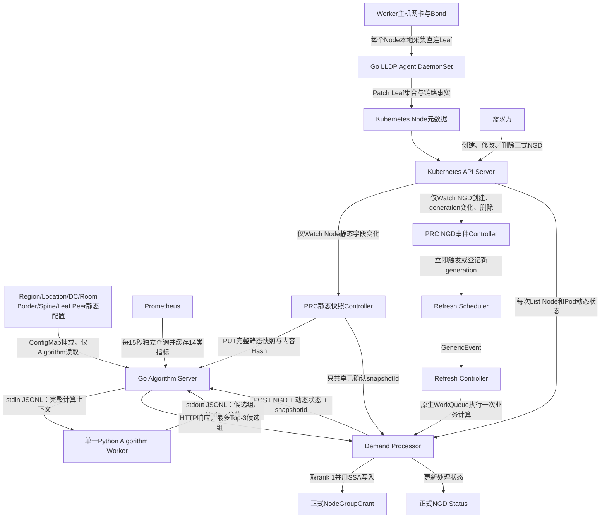
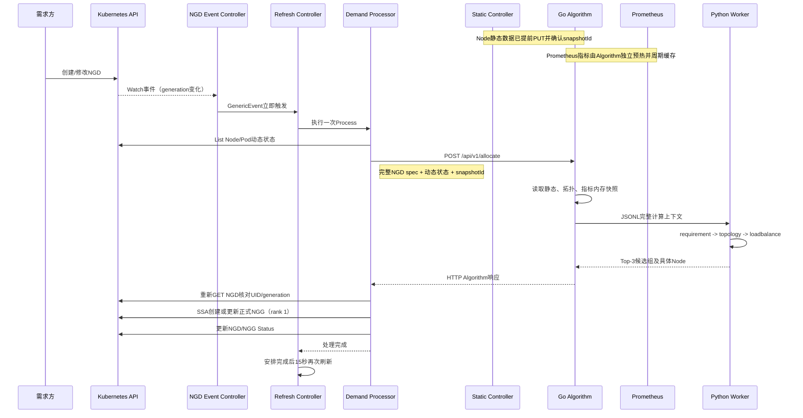

# NGD-NGG两层调度项目整体说明 v1.0

> 文档用途：0907阶段汇报与当前代码交接  
> 代码范围：`/mnt/data0/volcano-scheduler/ngd-ngg-scheduling-demo`当前工作区  
> 说明原则：区分“已经实现”“测试模拟”和“尚未接通”，不把设计目标写成当前能力。

## 1. 项目解决什么问题

本项目在 Kubernetes 集群中实现“任务级节点资源池划分”：

1. 根据任务提交的 NodeGroupDemand（NGD）、Node资源、网络拓扑和Prometheus指标选择一组Node；
2. PRC将选出的Node写成NodeGroupGrant（NGG）；
3. NGG作为本系统最终输出，向后续资源使用方提供节点名单、分数、可用资源和拓扑信息。

可以把核心关系理解为：

```text
输入NGD：说明需要多少资源以及允许哪些Node
输出NGG：给出最终选择的Node及其资源、分数和拓扑
```

当前主链路已经实现并测试：

```text
联通正式NGD
  -> PRC Watch与周期刷新
  -> Go Algorithm Server
  -> Python算法Worker
  -> 联通正式扁平NGG
```

本文说明范围到“PRC生成并读取正式NGG”为止。

## 2. 整体架构



上图中五条数据链相互独立：

| 数据链 | 数据来源 | 更新方式 | 使用方 |
|---|---|---|---|
| Node到Leaf | 主机网卡、Bond、LLDP | Agent每轮最多采集65秒，每3分钟启动一轮 | PRC静态Controller |
| Leaf以上拓扑 | 运维维护的YAML | Algorithm启动时加载 | Algorithm拓扑解析器 |
| Node静态快照 | Kubernetes Node | Node事件触发，另有15秒一致性检查 | Algorithm静态缓存 |
| Node动态状态 | Kubernetes Node和Pod | 每次NGD计算重新生成 | Python需求过滤算法 |
| 实时指标 | Prometheus | Algorithm默认每15秒拉取 | Python负载均衡算法 |

## 3. 核心组件及职责

| 组件 | 运行形态 | 语言 | 主要职责 |
|---|---|---|---|
| LLDP Agent | 每个Worker一个DaemonSet Pod | Go | 识别Bond、采集Node直连Leaf、更新Node元数据 |
| PRC | Deployment + controller-runtime Manager | Go | Watch NGD、同步静态快照、构造动态状态、调用算法、生成NGG |
| Algorithm Server | Deployment + HTTP Service | Go | 管理HTTP、静态/拓扑/指标缓存和Python Worker生命周期 |
| Algorithm Worker | Algorithm Pod内的单一子进程 | Python | 固定执行需求过滤、拓扑分组和负载评分 |
| Prometheus | Kubernetes监控组件 | — | 提供CPU、内存和网络实时指标 |

Go Algorithm 并未在进程内嵌入 Python 解释器。它启动一个长期存活的 Python 子进程，通过 stdin/stdout 上的逐行 JSON（JSONL）通信；因此不会为每个请求重新启动 Python。

## 4. 数据如何准备

### 4.1 Node静态数据

PRC从 Kubernetes Node 构造静态快照，主要包含：

- `nodeName`、`nodeUID`、创建时间；
- `status.allocatable`中的CPU、内存、GPU等容量；
- Node Labels；
- LLDP Agent写入的一个或两个Leaf；
- 本地接口、Bond模式、Leaf、远端端口等链路事实。

静态快照按 Node UID 稳定排序，序列化后计算 SHA-256 内容 Hash。相同内容得到相同`snapshotId`，不依赖某个进程内的自增版本。

静态数据不会随每个NGD重复发送。独立静态Controller先通过以下接口同步给Algorithm：

```text
PUT /internal/v1/node-static-snapshots/{snapshotId}
```

Algorithm明确返回`snapshotId`和`algorithmBootId`后，PRC才将该静态快照视为Ready。Algorithm重启导致`bootId`变化或缓存丢失时，PRC会重新PUT。

关键代码：

- `prc/pkg/controller/static_snapshot_controller.go`
- `prc/pkg/controller/snapshot.go`
- `algorithm_server/go/algorithm/cache.go`

### 4.2 Node动态状态

每次处理NGD时，PRC重新List Node和Pod，生成：

```text
nodeName
nodeUID
ready
unschedulable
requestedResources
```

其中`requestedResources`由已绑定且未结束Pod的Container Request累加得到。动态状态和静态快照内容分别计算Hash，用于请求关联和过期结果校验。

当前PRC发送字段名是`schedulerState`；Algorithm兼容层将其规范化为Python使用的`nodeUsageStates[].inUse`。新协议可直接发送`nodeUsageStates`，以后PRC完全切换后可删除兼容逻辑。

关键代码：

- `prc/pkg/controller/snapshot.go:buildSchedulerState`
- `algorithm_server/go/algorithm/service.go:normalizeUsageStates`

### 4.3 Prometheus指标

Prometheus由Algorithm自己读取，指标不经过PRC。默认行为：

```text
启动后立即拉取一次
-> 每15秒重新拉取
-> 当前快照保存在Go进程内
-> 失败时保留上一份有效快照并标记degraded
-> 超过120秒仍未成功则视为过期
```

当前指标目录共有14项：

- CPU、内存利用率；
- 网络收发字节率和包速率；
- 收发丢包率、错误率；
- TCP重传率；
- 网卡Up比例；
- 网络利用率；
- 可用带宽。

支持以下认证与TLS配置：

- Bearer Token直接值或Token文件；
- 自定义CA文件；
- TLS Server Name；
- 测试环境显式跳过证书校验。

Go Test中的Mock Prometheus会真实校验Bearer Header，并覆盖缺失Token、错误Token和超时行为。

关键代码：

- `algorithm_server/go/algorithm/metrics.go`
- `algorithm_server/go/algorithm/metrics_config.go`
- `algorithm_server/go/algorithm/prometheus_metrics.json`

## 5. 拓扑采集、存储与拼接

### 5.1 为什么只把Leaf写到Node

LLDP Agent只负责主机能够直接观测的事实：本机接口连接哪个Leaf。Region、Location、数据中心、机房、Border、Spine和Leaf Peer关系由网络运维配置，不写入每个Node，也不写入NGD。

这种拆分避免：

- 上层拓扑变化时批量修改所有Node；
- 把运维静态配置和主机动态探测混在一起；
- Node Label长度和字符限制无法容纳联通长交换机名称；
- 同一拓扑数据在数千个Node上重复保存。

### 5.2 LLDP Agent如何运行

Agent以DaemonSet部署，每个Worker一个独立进程，使用`hostNetwork: true`读取主机网络。两种连接Kubernetes API的方法都已支持：

1. 默认In-Cluster：使用Pod挂载的ServiceAccount；
2. Kubeconfig：通过`--kubeconfig`或`KUBECONFIG`读取指定文件，可用`--kube-context`选择上下文。

显式指定Kubeconfig失败时不会静默回退到其他身份，避免误连集群。

Agent只运行真实采集路径：识别可用物理接口后，在网卡监听EtherType `0x88CC`的LLDP帧。测试数据由Go Test直接注入Bond、LLDP和Node输入，不在生产Agent中保留模拟分支。

### 5.3 Bond选择规则

```text
存在bond0：只使用bond0，不混入管理网、存储网或其他Bond
Active-Backup：只采集active_slave对应网卡，记录一个Leaf
802.3ad及其他非主备模式：采集有效Slave，要求得到两个不同Chassis的Leaf
不存在bond0：回退采集满足条件的普通物理接口
```

非主备Bond的两张网卡即使都收到LLDP，也必须经Chassis ID去重后确认是两台
不同Leaf；如果65秒内没有得到两个不同Leaf，本轮不覆盖上一次成功拓扑。
Node最多保存两个Leaf。Agent写入的主要元数据为：

```text
Label:
  topology.demo.ngg.io/leaf-set-id      # Leaf集合的稳定短Hash
  topology.demo.ngg.io/leaf-count       # 1或2
  topology.demo.ngg.io/leaf-switch      # 仅单Leaf且值符合Label规范时写入

Annotation:
  topology.demo.ngg.io/leaf-switch-ids  # 完整Leaf名称数组
  topology.demo.ngg.io/leaf-links       # Bond、接口、Leaf、远端端口等明细
  topology.demo.ngg.io/source           # LLDP
  topology.demo.ngg.io/observed-at      # 采集时间
```

PRC不再注册、Watch或回退读取`NodeNetworkTopology` CR，只读取Node元数据。

关键代码：

- `topology_agent/main.go`
- `topology_agent/pkg/bond/discovery.go`
- `topology_agent/lldp.go`
- `topology_agent/pkg/topologyfacts/facts.go`
- `topology_agent/kube_config.go`

### 5.4 Leaf以上拓扑配置

Algorithm读取独立YAML，层级为：

```text
Region -> Location -> DataCenter -> Room
                              -> Border Domain -> Border Switch
                              -> Spine（允许为空）
                              -> Leaf -> Peer Leaf
```

联通102机房样例位于：

```text
config/topology/unicom-huailai-102-sample.yaml
```

部署时该内容通过ConfigMap只挂载给Algorithm：

```text
config/manager/algorithm.yaml
```

Kubernetes API本身不需要理解整张网络图；Kubernetes只保存Node到Leaf事实和最终NGD/NGG对象。

NGD中的拓扑约束严格使用联通新版`spec.topologyLabels`，当前只接受以下五级：

| NGD key | 配置来源 | Algorithm内部字段 |
|---|---|---|
| `topology.kubernetes.io/data-center` | `scopes.dataCenters[].id` | `dataCenterId` |
| `topology.kubernetes.io/room` | `scopes.rooms[].id` | `roomId` |
| `topology.kubernetes.io/border-switch` | `BORDER`物理交换机名或Border Domain ID | `borderDomainId` |
| `topology.kubernetes.io/spine-switch` | `SPINE`物理交换机名或Spine Domain ID | `spineDomainId` |
| `topology.kubernetes.io/leaf-switch` | 机房下Leaf物理交换机名或Leaf Domain ID | `leafDomainId` |

每一级都可省略；具体值表示指定位置，`requiredSame`表示不指定具体位置、但最终Node必须处于同一个该级逻辑域。多个字段按AND关系取交集。`access-switch`、`convergence-switch`、Region、Location和Subnet不属于当前NGD拓扑约束范围。

物理交换机名不会直接作为算法分组身份。Algorithm启动时基于独立拓扑配置建立别名索引：

```text
物理Border名称 -> Border Domain ID
物理Spine名称  -> Spine Domain ID
物理Leaf名称   -> Leaf Domain ID
```

因此需求方可填写联通拓扑中的物理交换机全名，算法会先映射到稳定逻辑域再执行筛选。

### 5.5 双Leaf如何形成一个逻辑域

两个Leaf只有同时满足以下条件才合并：

1. 配置为对称Peer；
2. 位于同一Room；
3. 属于同一显式Border Domain；
4. Leaf Domain成员数不超过2。

成员排序后计算内容Hash，形成稳定`pair-<hash>`逻辑域。主备从Leaf-A切换到Leaf-B时，单个Node观测值会变化，但两个Leaf映射到同一Leaf Domain，调度域身份保持稳定。负载模式同时观测两个Leaf时，同一Node只加入逻辑域一次，资源不会重复计算。

当前SPINE为空是合法输入。NGD没有Spine约束时，算法不生成空的Spine候选；NGD填写`spine-switch: requiredSame`或一个配置中不存在的具体Spine时，Algorithm把本次有效约束降级为`border-switch: requiredSame`，并在响应`warnings`记录`SPINE_EMPTY_FALLBACK`或`SPINE_NOT_FOUND_FALLBACK`。原始NGD不会被修改。

关键代码：

- `algorithm_server/go/algorithm/topology.go`
- `algorithm_server/python/algorithm_worker/algorithms/topology.py`

## 6. PRC的实现逻辑

### 6.1 PRC内部结构

```text
prc/cmd/main.go
  -> application.New(...)
      -> controller-runtime Manager
          ├── NodeStaticSnapshotReconciler
          ├── NodeGroupDemandReconciler
          ├── RefreshScheduler
          ├── RefreshReconciler
          └── DemandProcessor
  -> application.Start(ctx)
```

`main.go`只负责读取启动参数和启动Application。生产入口、Group3、Group4、Group5、Group7均通过同一个`application.New`装配，不在测试中重新实现一套PRC。

### 6.2 NGD事件与周期刷新已经解耦

`NodeGroupDemandReconciler`只Watch：

- NGD创建；
- NGD spec修改导致的`metadata.generation`变化；
- NGD删除。

它不直接执行算法，也不返回`RequeueAfter: 15s`。事件Controller把NGD的Key、UID和generation登记到`RefreshScheduler`，再发出`GenericEvent`。

`RefreshReconciler`接收事件后，通过controller-runtime原生WorkQueue调用`DemandProcessor.Process`。一次计算结束后，Scheduler才安排下一次刷新：

```text
NextRun = 本次业务处理结束时间 + demandRefreshInterval
```

因此，同一个NGD不会因为固定时钟到期而重叠执行。默认刷新周期为15秒、最多并行处理5个不同NGD；去重、Worker和错误限速重试均使用controller-runtime原生能力。

正式进程已经暴露`--demand-refresh-interval`和
`--max-concurrent-refreshes`两个参数。统一部署入口对应读取：

```json
"prc": {
  "demandRefreshSeconds": 15,
  "maxConcurrentRefreshes": 5
}
```

集群内Deployment和集群外Compose均由`deploy/render.py`转换为相同的PRC
启动参数。两个配置必须为正整数；旧配置缺少该段时兼容使用默认值。并发数是
单个PRC实例同时处理的不同NGD数，不改变同一NGD串行、去重的语义。

### 6.3 创建、更新和删除

新建NGD：

```text
generation=1
-> status=Pending
-> 立即计算
-> 创建NGG
-> NGG status=Active
-> NGD status=Fulfilled
-> 安排15秒后刷新
```

修改NGD spec：

```text
Kubernetes自动增加generation
-> PRC写status=Updating
-> 取消旧generation定时器和执行上下文
-> 按新spec立即计算
-> 发布前再次GET NGD核对UID和generation
-> 过期算法结果被丢弃
-> 更新同一个NGG
```

仅周期刷新、不修改spec：

```text
generation保持不变
-> 重新读取Node/Pod动态状态
-> 重新调用Algorithm
-> SSA更新原NGG
```

删除NGD：

```text
停止后续定时器
-> 取消执行中的算法请求
-> 删除对应NGG
-> OwnerReference提供Kubernetes垃圾回收兜底
```

PRC不会因为NGD修改或删除而主动驱逐、迁移或终止已经运行的Pod。

### 6.4 PRC与Algorithm的HTTP接口

| 方法与路径 | 用途 |
|---|---|
| `GET /healthz` | Algorithm进程存活检查 |
| `GET /readyz` | HTTP服务已启动检查，不代表静态/指标缓存已经Ready |
| `GET /internal/v1/cache/status` | 查看完整缓存状态 |
| `GET /internal/v1/node-static-cache/status` | PRC核对静态快照和Algorithm bootId |
| `PUT /internal/v1/node-static-snapshots/{id}` | PRC同步Node静态快照 |
| `POST /api/v1/allocate` | 正式资源池计算接口 |

## 7. Algorithm Server如何计算

### 7.1 Go主进程负责什么

Go层负责：

- HTTP服务和请求校验；
- Node静态快照缓存；
- 上层拓扑配置解析与Node拓扑补全；
- 校验五级`topologyLabels`，把物理Border/Spine/Leaf映射为逻辑域；
- 在有效范围没有Spine时生成Border `requiredSame`回退约束；
- Prometheus采集、认证、TLS、当前/上一份快照缓存；
- Python Worker启动、健康检查、超时和重启管理；
- 请求/响应模型转换和最终结果校验。

关键入口：

- `algorithm_server/go/cmd/algorithm-server/main.go`
- `algorithm_server/go/algorithm/application.go`
- `algorithm_server/go/algorithm/server.go`
- `algorithm_server/go/algorithm/service.go`

### 7.2 Python固定算法流水线

当前不允许NGD自定义`algorithms`编排字段。服务端固定按以下顺序执行：

```text
requirement -> topology -> loadbalance
```

第一步，`requirement`：

- 合并静态容量、动态资源占用和Node状态；
- 应用NGD的`nodeSelector`；
- 应用Algorithm Go层解析后的具体DataCenter、Room及交换机逻辑域约束；
- 剔除不可用、已占用或不满足硬约束的Node。

第二步，`topology`：

- 只按`leafDomain -> spineDomain -> borderDomain -> room -> dataCenter`逐层分组；
- `requiredSame`限制候选组允许扩展到的最宽层级，例如Border Same可以选择Leaf、Spine或Border组，但不能扩大到Room；
- 使用NarrowestFit，只保留第一个能满足全部最低资源需求的最窄层级；
- SPINE为空时自然跳过该层；
- 不从NGD读取拓扑图或算法Profile。

第三步，`loadbalance`：

- 在候选域内计算每个Node的资源余量分和Prometheus指标分；
- 结合静态带宽、时延计算拓扑质量；
- Node按score降序、同分按名称/UID稳定排序；
- 按顺序累加Node，达到`minResources`即停止；
- 不超过`maxNodes`和`quota`；
- 候选组按`groupScore`降序稳定排序，最多返回3组。

关键代码：

- `algorithm_server/python/algorithm_worker/pipeline.py`
- `algorithm_server/python/algorithm_worker/algorithms/requirement.py`
- `algorithm_server/python/algorithm_worker/algorithms/topology.py`
- `algorithm_server/python/algorithm_worker/algorithms/loadbalance.py`

### 7.3 当前处理与保留的NGD字段

当前算法实际处理：

- `schedulerName`；
- `nodeSelector`；
- `topologyLabels`，仅支持DataCenter、Room、Border、Spine、Leaf五级；
- `maxNodes`；
- `quota.cpu/memory`；
- `minResources.cpu/memory`。

以下联通NGD字段会被PRC完整透传，但当前算法只生成Warning，不参与计算：

- `minThroughput`；
- `networkReachability`；
- `crossClusterAffinity`；
- `intraClusterAffinity`；
- `preferredSubnet`。

这保证以后实现这些约束时不必再次修改PRC到Algorithm的基础协议。

## 8. NGD、NGG与字段所有权

### 8.1 正式NGD

正式对象为Cluster-scoped：

```text
apiVersion: scheduling.platform.example.io/v1alpha1
kind: NodeGroupDemand
```

参考CRD和样例：

- `docs/paas-schedbridge-master-new/crd-deploy/nodegroupdemand-crd.yaml`
- `docs/paas-schedbridge-master-new/crd-deploy/nodegroupdemand-cr-example.yaml`

当前测试使用的完整结构为：

```yaml
topologyLabels:
  topology.kubernetes.io/data-center: HB-HL-DC1
  topology.kubernetes.io/room: HB-HL-DC1-102
  topology.kubernetes.io/border-switch: requiredSame
  topology.kubernetes.io/spine-switch: spine-01
  topology.kubernetes.io/leaf-switch: requiredSame
```

模拟拓扑中没有`spine-01`，所以有效Spine约束回退为Border Same；Leaf Same更窄，最终候选仍为单个Leaf Domain。

`metadata.generation`不是NGD CRD自定义字段，而是所有Kubernetes对象都具备的标准元数据。只有spec变化时Kubernetes才增加generation；单纯周期刷新不会增加。

PRC对NGD的权限和写入范围：

| 区域 | PRC行为 |
|---|---|
| `metadata/spec` | 读取，不修改 |
| `status.phase` | 写入Pending、Updating、Fulfilled或Failed |
| `status.grantRef` | 写入关联NGG名称 |
| `status.resolvedNodeCount` | 写入最终Node数 |
| `status.lastUpdated/message` | 写入处理时间和说明 |

### 8.2 正式NGG

正式对象同样为Cluster-scoped：

```text
apiVersion: scheduling.platform.example.io/v1alpha1
kind: NodeGroupGrant
```

正式NGG不是Top-3候选组结构，而是最终选中组的扁平Node数组：

```yaml
spec:
  schedulerName: scheduler-a
  version: v1
  timestamp: "..."
  source: normal
  demandRef: example-demand
  nodes:
    - name: worker-0001
      score: 85
      resources:
        cpuAvailable: "32"
        memoryAvailable: 128Gi
      topology:
        dataCenter: HB-HL-DC1
        room: HB-HL-DC1-102
        borderSwitch: HB-HL-DC1-102-BORDER-DOMAIN-01
        leafSwitch: <Leaf Domain ID>
```

`borderSwitch/spineSwitch/leafSwitch`字段保存当前物理交换机映射后的逻辑域ID。没有Spine时省略`spineSwitch`，而不是伪造一个Spine值。

Algorithm可以返回Top-3，但PRC不重新评分、不重新排序，只把`candidateNodeGroups[0]`转成正式NGG。

字段所有权为：

| 区域 | 写入方 |
|---|---|
| NGG `metadata/spec` | PRC，SSA Field Manager为`ngd-ngg-prc-spec` |
| `status.phase/resolvedCapacity` | PRC，SSA Field Manager为`ngd-ngg-prc-status` |
| `status.consumer` | NGG消费方自己的Field Manager；PRC不写、不清空 |

当前NGG状态含义：

```text
Active            PRC已经给出可用节点组
ReclaimRequested  平台请求回收，当前PRC尚未实现流转
Draining          消费方正在排空，当前PRC尚未实现流转
Returned          节点组已归还；当前算法无可行组且旧NGG存在时PRC可写入
```

参考CRD和样例：

- `docs/paas-schedbridge-master-new/crd-deploy/nodegroupgrant-crd.yaml`
- `docs/paas-schedbridge-master-new/crd-deploy/nodegroupgrant-cr-example.yaml`

## 9. 一次正式NGD的完整处理流程



## 10. 测试体系

### 10.1 功能测试分组

这些测试直接调用生产Go包，不需要真实Kubernetes集群：

| 组 | Node规模 | 真实组件 | 模拟组件 | 主要验证 |
|---|---:|---|---|---|
| Group1 | 1000 | Go Worker Client、Python Worker | 固定输入 | Go与Python JSONL协议和算法结果 |
| Group2 | 1000 | PRC快照/HTTP Client、Go Algorithm、Python | Mock Prometheus | PRC调用完整算法服务 |
| Group3 | 1000 | envtest、PRC | Mock Algorithm | Watch正式NGD并生成正式NGG |
| Group4 | 1000 | envtest、PRC、Go Algorithm、Python | Mock Prometheus | NGD到NGG完整主链路 |
| Group5 | 1000 | Group4全部组件 | Mock Prometheus | 周期刷新、generation更新、consumer保留、删除清理 |
| Group7 | 20 | Bond选择、拓扑元数据、PRC、Go/Python | sysfs、LLDP邻居、Prometheus、envtest | 主备/负载双Leaf完整流程 |

其中envtest启动真实`kube-apiserver`和`etcd`二进制，不启动完整Kubernetes数据面。

运行全部功能组：

```bash
cd /mnt/data0/volcano-scheduler/ngd-ngg-scheduling-demo
make go-test-all
```

分别运行：

```bash
make go-test-topology-agent
make go-test-group1
make go-test-group2
make go-test-group3
make go-test-group4
make go-test-group5
make go-test-group7
```

每组结果位于：

```text
go_test_suites/<group>/results/<run-id>/
```

固定输入和Expected位于`testdata/`，Actual、diff和业务计时在独立结果目录。结果写盘不计入业务时间。

### 10.2 Group7双Leaf测试

每个子场景独立创建20个Worker，每个Node容量为32 CPU、128 GiB、4 GPU：

```text
华北 -> 怀来 -> DC1 -> 102机房
                     -> Border Domain 01（双Border）
                     -> Leaf-A <-> Leaf-B
                     -> 20个Worker通过bond0连接双Leaf

NGD最低资源：320 CPU + 1280 GiB
计算：320/32 = 10，1280/128 = 10
结果：20个候选 -> Algorithm选择10个 -> 正式NGG写10个
```

- Active-Backup：只采集`active_slave=eth1`对应Leaf-B；
- 802.3ad：采集eth0、eth1对应Leaf-A和Leaf-B；
- 两种场景最终都归入同一个Leaf Domain，同一Node只统计一次。

详细图、输入和输出见`go_test_suites/group7_bond_topology_flow/README.md`。

### 10.3 3000 Node规模测试

规模测试固定3000个静态Node，分别选择：

```text
1000、800、500、300、100、10个Node
```

四条链路、每个规模预热3次并正式运行30次，共720个正式样本，统计Mean、P50、P95、Min、Max和标准差。

运行：

```bash
make benchmark-3000-all
```

详细结果见`go_test_suites/scale_benchmark_3000/README.md`及其`reports/`目录。

## 11. 构建与部署

### 11.1 镜像与组件

| 组件 | 镜像 | 部署文件 |
|---|---|---|
| PRC | `ngd-ngg-prc:v0.3.0` | `config/manager/prc.yaml` |
| Algorithm | `ngd-ngg-algorithm:v0.4.0` | `config/manager/algorithm.yaml` |
| LLDP Agent | `ngd-ngg-lldp-agent:v0.2.0` | `config/manager/lldp-agent.yaml` |

单独构建或部署：

```bash
make lldp-agent-image
make algorithm-image
make prc-image

make lldp-agent
make algorithm
make prc
```

部署顺序为：

```text
CRD/RBAC
-> LLDP Agent
-> Algorithm
-> PRC
-> 提交NGD与任务
```

### 11.2 LLDP部署模式

基础DaemonSet已经是实际LLDP采集配置，包含Host Network、`NET_RAW`和`/sys/class/net`只读挂载。需要使用外部身份时，可叠加`config/manager/lldp-agent-kubeconfig-patch.yaml`挂载Kubeconfig并禁用ServiceAccount Token回退。

真实模式需要确认：

- 容器具备`NET_RAW`；
- Host Network可见正确物理接口；
- `/sys/class/net`映射正确；
- 交换机发送LLDP；
- Kubeconfig证书、地址和RBAC可用。

## 12. 项目目录与关键文件

```text
ngd-ngg-scheduling-demo/
├── algorithm_server/      Algorithm Server正式实现
├── prc/                   PRC正式实现
├── topology_agent/        LLDP/Bond拓扑采集正式实现
├── go_test_suites/        当前统一Go测试
├── config/                RBAC、组件部署和拓扑配置
├── scripts/               环境、构建、部署和测试辅助脚本
├── manifests/monitoring/  可选Prometheus监控清单
├── docs/                  接口、设计、测试和阶段说明
├── ngg_consumer/          NGG读取与校验公共库
├── test_suites/           较早测试程序及历史运行证据
├── results/               演示和构建结果
├── images/                本地镜像归档
├── build/                 本地编译产物
├── .cache/                Go依赖、编译与envtest缓存
├── .vscode/               VS Code Debug配置
├── Dockerfile.*           三个正式组件的镜像构建入口
├── go.work                Go多模块工作区
├── Makefile               统一命令入口
└── README.md              项目首页和快速使用说明
```

### 12.1 顶层目录分别做什么

| 目录 | 类型 | 作用 | 是否进入正式运行链路 |
|---|---|---|---|
| `algorithm_server/` | 核心源码 | 提供Algorithm HTTP服务、缓存Node静态快照和Prometheus指标，并调用Python算法Worker | 是 |
| `prc/` | 核心源码 | Watch正式NGD、准备静态/动态Node数据、调用Algorithm、生成NGG和更新Status | 是 |
| `topology_agent/` | 核心源码 | 在每台Worker采集Bond与LLDP信息，并把Node到Leaf事实写入Node元数据 | 是 |
| `config/` | 部署配置 | 保存RBAC、Deployment/DaemonSet/Service以及上层拓扑配置；正式CRD直接使用需求方新版文件 | 是 |
| `scripts/` | 工程脚本 | 检查环境、构建镜像、安装CRD、部署三个组件以及运行规模测试 | 部署或测试时使用 |
| `go_test_suites/` | 当前测试 | 统一保存Go Test、Mock输入、Expected、Actual、计时结果和3000 Node规模测试 | 不进入生产进程 |
| `docs/` | 文档 | 保存需求方原始接口、技术方案、实现说明、测试方案和阶段汇报 | 不进入生产进程 |
| `manifests/monitoring/` | 可选配置 | 提供Prometheus、node-exporter和kube-state-metrics参考清单；Algorithm也可接入集群已有Prometheus | 可选 |
| `ngg_consumer/` | 公共库 | 解析和校验正式扁平NGG，供本地完整链路验证复用 | 当前主要用于测试 |
| `test_suites/` | 历史测试 | 保存较早的容器化测试程序及运行证据；当前标准入口已经统一为`go_test_suites/` | 否 |
| `results/` | 输出目录 | 保存镜像构建信息、算法演示结果和历史NGD/NGG证据 | 否，可重新生成 |
| `images/` | 构建产物 | 保存三个组件的Docker镜像tar包，便于离线传输 | 部署准备阶段使用 |
| `build/` | 构建产物 | 保存本地编译出的PRC等二进制文件 | 否，可重新生成 |
| `.cache/` | 工具缓存 | 保存Go module、Go build cache和envtest API Server/etcd二进制 | 否，可重新下载生成 |
| `.vscode/` | 开发配置 | 保存Group1～Group7的VS Code/Delve调试入口 | 否 |

判断是否属于当前主链路时，可以记住：正式源码只有`topology_agent/`、`prc/`和`algorithm_server/`；其他目录负责配置、测试、文档或构建产物。

### 12.2 Algorithm Server内部目录

```text
algorithm_server/
├── go/
│   ├── cmd/algorithm-server/   Go服务main入口
│   ├── algorithm/              HTTP、缓存、Prometheus、拓扑和Worker管理
│   └── vendor/                 镜像构建使用的Go依赖
├── python/algorithm_worker/
│   ├── algorithms/             requirement、topology、loadbalance三步算法
│   ├── services/               Node计算视图等公共服务
│   ├── config/                 负载评分Profile
│   ├── pipeline.py             固定算法执行顺序
│   └── worker.py               JSONL Worker入口
├── demo_1000_nodes/            Algorithm独立1000 Node演示
└── README.md                   Algorithm详细协议和运行说明
```

Go和Python不是两个独立部署。Go主进程启动一个长期Python子进程：PRC通过HTTP调用Go，Go再通过stdin/stdout JSONL调用Python。

### 12.3 PRC内部目录

```text
prc/
├── cmd/                        PRC生产进程入口
├── pkg/application/            Manager和全部Controller的统一装配
├── pkg/controller/             静态快照、NGD事件、周期刷新、算法调用和NGG写入
├── go.mod、go.sum              PRC独立Go模块依赖
├── PROJECT                     Kubebuilder工程元数据
└── README.md                   PRC应用封装说明
```

`pkg/application`负责“把服务完整启动起来”，`pkg/controller`负责“具体处理什么业务”。测试和生产都从`application.New()`启动同一套PRC，避免测试重新拼装一套不同实现。

### 12.4 LLDP Agent内部目录

```text
topology_agent/
├── main.go                     Cobra命令、参数和进程生命周期
├── agent.go                    周期采集及Node Patch流程
├── lldp.go                     LLDP 0x88CC报文监听和解析
├── kube.go                     Kubernetes Node读取与Patch
├── kube_config.go              In-Cluster/Kubeconfig加载
├── pkg/bond/                   Bond模式、Slave和有效网卡选择
├── pkg/topologyfacts/          Leaf事实规范化及Node元数据生成
└── *_test.go                   Kubeconfig、Bond和采集基础单元测试
```

该目录只负责Node到Leaf，不保存或计算Region、机房、Border、Spine等上层关系。

### 12.5 配置目录

| 路径 | 内容 |
|---|---|
| `docs/paas-schedbridge-master-new/crd-deploy/nodegroupgrant-crd.yaml` | 需求方新版正式NGG CRD，PRC按此输出 |
| `docs/paas-schedbridge-master-new/crd-deploy/nodegroupdemand-crd.yaml` | 需求方新版正式NGD CRD，包含`topologyLabels` |
| `config/manager/prc.yaml` | PRC Deployment和运行参数 |
| `config/manager/algorithm.yaml` | Algorithm Deployment、Service和拓扑ConfigMap |
| `config/manager/lldp-agent.yaml` | 真实LLDP采集DaemonSet |
| `config/manager/lldp-agent-kubeconfig-patch.yaml` | LLDP Agent使用外部Kubeconfig时的补丁示例 |
| `config/rbac/prc.yaml` | PRC读取Node/Pod/NGD并写入NGG所需权限 |
| `config/rbac/lldp-agent.yaml` | Agent读取和Patch本机Node所需权限 |
| `config/topology/unicom-huailai-102-sample.yaml` | Algorithm读取的Leaf以上联通式拓扑样例 |

### 12.6 测试目录

| 目录 | 测试内容 |
|---|---|
| `group1_algorithm_worker/` | Go Algorithm调用真实Python Worker |
| `group2_prc_algorithm/` | PRC HTTP客户端调用完整Algorithm及Mock Prometheus |
| `group3_prc_ngd_ngg/` | envtest中PRC Watch NGD并生成NGG，Algorithm为Mock |
| `group4_full_real_algorithm/` | PRC、真实Go Algorithm和Python Worker完整链路 |
| `group5_prc_refresh_lifecycle/` | 周期刷新、NGD修改、consumer字段保留和删除清理 |
| `group7_bond_topology_flow/` | Active-Backup和负载Bond到正式NGG完整链路 |
| `scale_benchmark_3000/` | 3000静态Node、六种选点规模、每种30次的统计测试 |
| `common/` | envtest、Mock Prometheus、Fixture、Golden比较和进程辅助代码 |

每个Group通常包含：

```text
groupX/
├── groupX_test.go              测试流程与计时边界
├── testdata/input/             固定输入
├── testdata/expected/          预期输出
├── results/<run-id>/actual/    实际输出
├── results/<run-id>/comparison/Expected与Actual差异
└── README.md                   单组运行及Debug说明
```

### 12.7 根目录文件

| 文件 | 作用 |
|---|---|
| `Makefile` | 统一暴露测试、构建、部署和规模测试命令 |
| `go.work`、`go.work.sum` | 把PRC、Algorithm、Topology Agent和Go Test组成一个本地Go工作区 |
| `Dockerfile.prc` | 构建PRC运行镜像 |
| `Dockerfile.algorithm` | 构建Go Algorithm与Python Worker组合镜像 |
| `Dockerfile.lldp-agent` | 构建LLDP Agent镜像 |
| `README.md` | 项目入口、当前组件和常用命令 |

### 12.8 最关键代码文件

| 路径 | 功能 |
|---|---|
| `prc/cmd/main.go` | PRC生产进程入口 |
| `prc/pkg/application/application.go` | PRC完整组件装配 |
| `prc/pkg/controller/refresh_controller.go` | NGD事件Controller与刷新Controller |
| `prc/pkg/controller/refresh_scheduler.go` | 每NGD定时、generation和取消状态 |
| `prc/pkg/controller/prc_controller.go` | 一次业务计算、NGG/Status写入 |
| `prc/pkg/controller/static_snapshot_controller.go` | 独立Node静态快照同步 |
| `prc/pkg/controller/snapshot.go` | 静态/动态快照构造与Hash |
| `prc/pkg/controller/algorithm_client.go` | Algorithm HTTP客户端 |
| `algorithm_server/go/algorithm/application.go` | Algorithm缓存、Worker和路由装配 |
| `algorithm_server/go/algorithm/service.go` | 一次allocate请求编排 |
| `algorithm_server/go/algorithm/topology.go` | 联通拓扑解析、Border/Leaf Domain构造 |
| `algorithm_server/go/algorithm/metrics.go` | Prometheus周期采集与缓存 |
| `algorithm_server/go/algorithm/worker.go` | Python子进程和JSONL协议 |
| `algorithm_server/python/algorithm_worker/pipeline.py` | 固定算法流水线 |
| `topology_agent/pkg/bond/discovery.go` | Bond模式与有效网卡选择 |
| `topology_agent/pkg/topologyfacts/facts.go` | Leaf事实规范化及Node元数据生成 |

## 13. 当前已经验证与尚未完成

### 13.1 已经实现并验证

- Go PRC完整Application装配；
- NGD事件与15秒周期刷新解耦；
- generation更新取消旧计算并防止过期结果覆盖；
- NGD删除停止刷新并清理NGG；
- PRC与消费方SSA字段隔离，`status.consumer`可保留；
- Node静态快照独立同步和Algorithm重启重新确认；
- Algorithm独立读取并缓存Prometheus指标；
- 固定`requirement -> topology -> loadbalance`算法链；
- 联通新版五级`topologyLabels`校验、物理交换机到逻辑域映射和多条件交集；
- Spine存在时按Spine执行、Spine缺失时回退Border Same并返回Warning；
- Region到Leaf的上层拓扑解析、空SPINE、显式Border Domain；
- Active-Backup和802.3ad双Leaf采集规则；
- In-Cluster和Kubeconfig两种Agent连接方式；
- 正式NGD到正式扁平NGG的Group3/4/5/7测试；
- 3000 Node、六种选点规模、四组链路性能测试；

### 13.2 当前边界与后续工作

1. 实现NGG的`ReclaimRequested -> Draining -> Returned`完整回收协作；
2. 实现NGD中的吞吐、网络可达性、跨集群/集群内亲和与子网约束；
3. 在联通物理主机验证真实LLDP、Bond切换、网卡命名和交换机报文；
4. 增加上层拓扑配置热更新机制；当前Algorithm在启动时读取配置；
5. 明确多副本Algorithm缓存同步或固定单副本部署策略；
6. 明确已运行任务在NGD更新、回收和拓扑故障时的资源保留策略。

## 14. 推荐查看顺序

第一次了解项目时，建议按以下顺序阅读：

1. 本文：整体结构和当前边界；
2. `go_test_suites/group7_bond_topology_flow/README.md`：双Leaf/Bond图示；
3. `docs/会议纪要-0903/PRC事件驱动与周期刷新-当前实现说明v1.0.md`：PRC生命周期；
4. `algorithm_server/README.md`：Algorithm各文件和独立运行；
5. `go_test_suites/README.md`：各组测试和Debug入口；
6. `go_test_suites/scale_benchmark_3000/README.md`：规模测试与统计结果。
