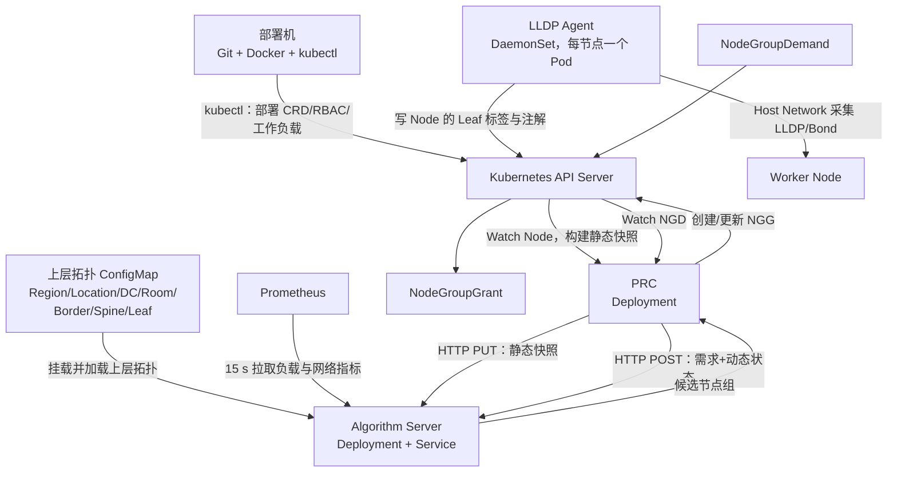
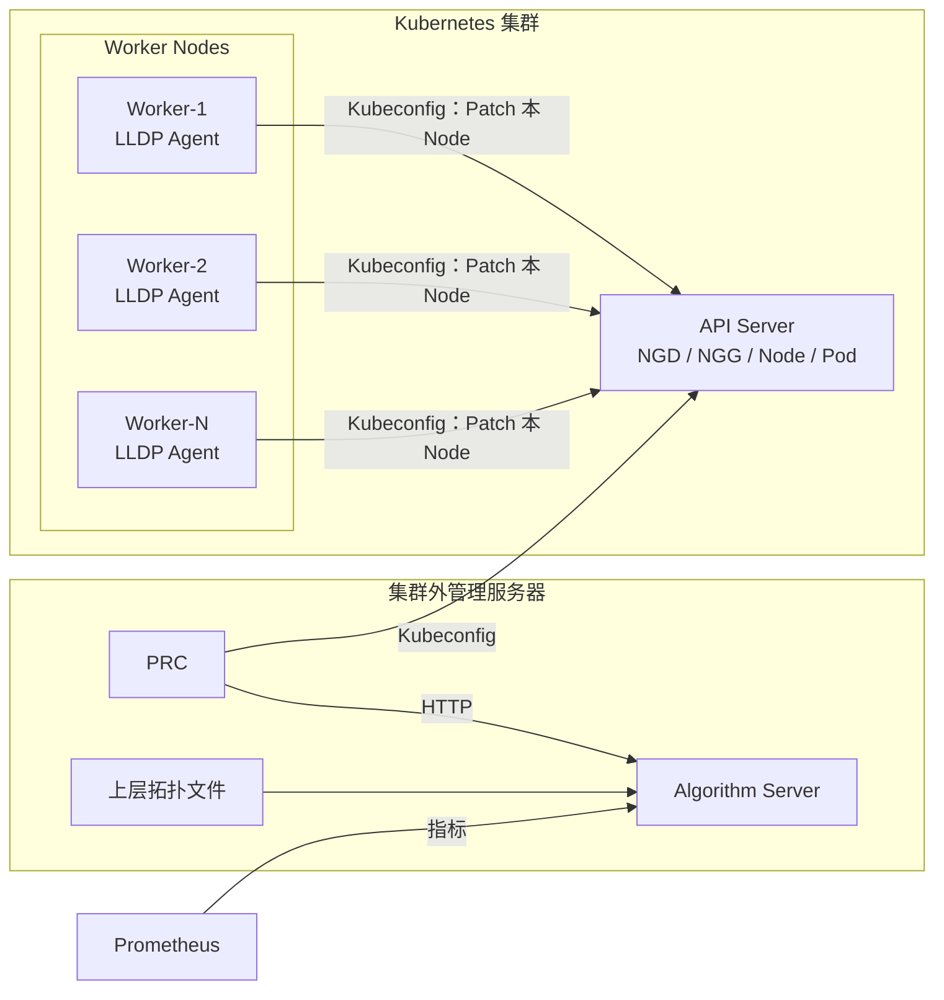

# NGD-NGG 真实 Kubernetes 集群部署说明

> 已新增统一部署封装，实际操作请使用 [deploy/README.md](../../deploy/README.md) 中的入口。下文保留手工部署原理；集群外 PRC 当前需关闭选主，LLDP 挂载完整 `/sys` 的最新配置均由新入口生成。

> 版本：v1.0  
> 适用范围：从 Git 获取本项目后，将 LLDP Agent、Algorithm Server 和 PRC 部署到真实 Kubernetes 集群。  
> 推荐模式：组件在集群内使用 In-Cluster ServiceAccount。Kubeconfig 模式作为需求方明确要求时的备选方案。

## 1. 部署后的整体结构



组件职责：

| 组件 | Kubernetes 形式 | 主要作用 | 是否访问 Kubernetes API |
|---|---|---|---|
| LLDP Agent | DaemonSet | 采集 Node 直连 Leaf 和 Bond 信息，写入 Node 标签/注解 | 是 |
| Algorithm Server | Deployment + Service | 缓存上层拓扑和 Prometheus 指标，运行 Go + Python 算法 | 否 |
| PRC | Deployment | Watch NGD/Node/Pod，调用 Algorithm，创建或更新 NGG | 是 |

## 2. 先分清两种 Kubeconfig

部署中有两个完全不同的“Kubeconfig”概念。

### 2.1 部署机上的 Kubeconfig

部署人员在服务器上运行 `kubectl`，通过本机 Kubeconfig 将 YAML 提交到目标集群：

```text
部署机 kubectl ──本机 Kubeconfig──> Kubernetes API Server
```

无论集群内组件最终使用 In-Cluster 还是 Kubeconfig，部署机都需要有可用的 Kubeconfig。

### 2.2 Pod 内组件的 Kubernetes 身份

PRC 和 LLDP Agent 运行后也要访问 Kubernetes API，有两种方式：

| 方式 | API 地址和证书来源 | 权限来源 | 推荐程度 |
|---|---|---|---|
| In-Cluster | Kubernetes 自动注入的 ServiceAccount Token、CA 和 Service 地址 | ServiceAccount + RBAC | **生产环境推荐** |
| Kubeconfig | 挂载到 Pod 内的 Kubeconfig 文件 | Kubeconfig 内对应的 User/Token/Cert | 仅在需求方明确要求时使用 |

`hostNetwork: true` 只用于 LLDP 访问主机网络，**不代表 LLDP Agent 必须使用 Kubeconfig**。Host Network 和 Kubernetes 身份是两件事。

## 3. 部署前提

### 3.1 部署机

需要安装：

- Git；
- Docker；
- kubectl；
- Bash；
- 可访问项目 Git 仓库和目标镜像仓库。

### 3.2 Kubernetes 集群

部署账号至少要能创建：

- CRD；
- Namespace；
- ServiceAccount、ClusterRole 和 ClusterRoleBinding；
- Deployment、DaemonSet、Service、ConfigMap 和 Secret。

LLDP Agent 还要求集群安全策略允许：

- `hostNetwork: true`；
- `NET_RAW` capability；
- 只读挂载宿主机 `/sys/class/net`。

如果 Pod Security、OPA/Gatekeeper 或其他准入策略禁止上述能力，需要由集群管理员对 `ngd-ngg-system` Namespace 和 LLDP Agent 进行最小范围放行。

### 3.3 生产依赖

- 所有 Worker 能从镜像仓库拉取镜像；
- 目标交换机已启用 LLDP 并向主机发送 LLDPDU；
- Algorithm Server 能访问生产 Prometheus；
- 已准备与真实网络一致的上层拓扑配置。

## 4. 从 Git 获取确定版本

不建议直接部署未固定的开发分支。建议需求方指定 Tag 或 Commit：

```bash
git clone <repository-url>
cd ngd-ngg-scheduling-demo

git fetch --all --tags
git checkout <release-tag-or-commit>
git status
git rev-parse HEAD
```

部署记录中应同时保留：

- Git Commit ID；
- 三个镜像的完整地址与 Tag；
- 上层拓扑配置版本；
- CRD 版本；
- 部署时间和目标集群。

## 5. 确认目标集群

以下命令均通过部署机的 Kubeconfig 执行：

```bash
export KUBE_CONTEXT=<target-context>

kubectl --context "$KUBE_CONTEXT" cluster-info
kubectl --context "$KUBE_CONTEXT" get nodes -o wide
kubectl --context "$KUBE_CONTEXT" auth can-i create customresourcedefinitions
kubectl --context "$KUBE_CONTEXT" auth can-i create clusterroles
kubectl --context "$KUBE_CONTEXT" auth can-i create deployments -n ngd-ngg-system
kubectl --context "$KUBE_CONTEXT" auth can-i create daemonsets -n ngd-ngg-system
```

不要只根据当前 `kubectl config current-context` 猜测集群；每次生产部署都应显式传递 `KUBE_CONTEXT`。

## 6. 构建并推送镜像

定义目标镜像仓库和唯一版本号：

```bash
export REGISTRY=registry.example.com/ngd-ngg
export VERSION=v0.5.0

export PRC_IMAGE="$REGISTRY/prc:$VERSION"
export ALGORITHM_IMAGE="$REGISTRY/algorithm:$VERSION"
export LLDP_AGENT_IMAGE="$REGISTRY/lldp-agent:$VERSION"
```

构建：

```bash
PRC_IMAGE="$PRC_IMAGE" make prc-image
ALGORITHM_IMAGE="$ALGORITHM_IMAGE" make algorithm-image
LLDP_AGENT_IMAGE="$LLDP_AGENT_IMAGE" make lldp-agent-image
```

推送：

```bash
docker push "$PRC_IMAGE"
docker push "$ALGORITHM_IMAGE"
docker push "$LLDP_AGENT_IMAGE"
```

然后把下列文件中的 `image` 改为刚推送的完整镜像地址：

| 组件 | 部署文件 |
|---|---|
| LLDP Agent | `config/manager/lldp-agent.yaml` |
| Algorithm Server | `config/manager/algorithm.yaml` |
| PRC | `config/manager/prc.yaml` |

注意：

1. 构建脚本中的 `PRC_IMAGE` 等环境变量只决定本地构建名称，**不会自动修改部署 YAML**。
2. 当前 YAML 是 `imagePullPolicy: IfNotPresent`，生产应使用不可变的唯一 Tag，不要反复覆盖同一 Tag。
3. 如使用私有镜像仓库，需要在 Pod Spec 配置 `imagePullSecrets`。
4. 如果真实 Worker 不是 `linux/amd64`，需要构建对应架构或多架构镜像。

## 7. 替换生产配置

### 7.1 Algorithm 上层拓扑

`config/manager/algorithm.yaml` 中的 `ngd-ngg-algorithm-topology` ConfigMap 当前是怀来 102 机房样例。真实部署前必须替换为生产拓扑：

```text
Region → Location → DataCenter → Room
                                  └→ Border/Spine/Leaf
```

- Spine 非空：按 Spine 建立逻辑域；
- Spine 为空：回退到 Border Domain；
- Node 到 Leaf 不写入该 ConfigMap，由 LLDP Agent 动态采集并写入 Node。

### 7.2 Prometheus

修改 `config/manager/algorithm.yaml`：

```yaml
- name: PROMETHEUS_URL
  value: http://<prometheus-service>.<namespace>.svc.cluster.local:9090
- name: PROMETHEUS_REFRESH_SECONDS
  value: "15"
- name: PROMETHEUS_STALE_SECONDS
  value: "120"
- name: PROMETHEUS_REQUEST_TIMEOUT_SECONDS
  value: "5"
- name: PROMETHEUS_NODE_LABEL
  value: node
```

如果 Prometheus 有认证，支持以下参数：

```text
PROMETHEUS_BEARER_TOKEN_FILE
PROMETHEUS_CA_FILE
PROMETHEUS_TLS_SERVER_NAME
PROMETHEUS_INSECURE_SKIP_VERIFY
```

Token 和 CA 应放入 Kubernetes Secret 并只读挂载到 Algorithm Pod，不要把 Token 明文写入 Git、ConfigMap 或日志。

### 7.3 LLDP 部署节点

当前 DaemonSet 会尝试部署到所有可调度节点。生产建议使用 `nodeSelector` 或 Node Affinity 限定计算节点，例如：

```yaml
spec:
  template:
    spec:
      nodeSelector:
        node-role.kubernetes.io/worker: ""
```

如 Worker 存在 Taint，还要增加与生产环境一致的 Toleration。

### 7.4 Namespace 和镜像仓库

当前所有 YAML 固定使用 `ngd-ngg-system`。脚本的 `SYSTEM_NAMESPACE` 环境变量不会自动重写 YAML 中的 Namespace。如需更换 Namespace，必须同步修改：

- RBAC 中的 Namespace 和 ServiceAccount subject；
- Deployment、DaemonSet、Service 和 ConfigMap；
- PRC 中 Algorithm Service 的 DNS 地址。

## 8. 模式 A：In-Cluster 部署（推荐）

### 8.1 身份与权限

```text
PRC Pod
  └→ ServiceAccount prc
       └→ ClusterRole ngd-ngg-prc

LLDP Agent Pod
  └→ ServiceAccount lldp-agent
       └→ ClusterRole ngd-ngg-lldp-agent
```

Algorithm Server 不直接访问 Kubernetes API，不需要 Kubeconfig。

### 8.2 安装 CRD 和 RBAC

```bash
KUBE_CONTEXT="$KUBE_CONTEXT" ./scripts/03-install-apis.sh
```

该脚本安装：

- `docs/paas-schedbridge-master-new/crd-deploy/nodegroupdemand-crd.yaml`；
- `docs/paas-schedbridge-master-new/crd-deploy/nodegroupgrant-crd.yaml`；
- `config/rbac/prc.yaml`；
- `config/rbac/lldp-agent.yaml`。

验证：

```bash
kubectl --context "$KUBE_CONTEXT" get crd \
  nodegroupdemands.scheduling.platform.example.io \
  nodegroupgrants.scheduling.platform.example.io

kubectl --context "$KUBE_CONTEXT" get namespace ngd-ngg-system
kubectl --context "$KUBE_CONTEXT" get serviceaccount -n ngd-ngg-system
```

### 8.3 按顺序部署

```text
1. LLDP Agent
2. Algorithm Server
3. PRC
```

执行：

```bash
KUBE_CONTEXT="$KUBE_CONTEXT" ./scripts/05b-deploy-lldp-agent.sh
KUBE_CONTEXT="$KUBE_CONTEXT" ./scripts/05a-deploy-algorithm.sh
KUBE_CONTEXT="$KUBE_CONTEXT" ./scripts/05-deploy-prc.sh
```

先启动 LLDP Agent，使 Node 尽早获得 Leaf 标记；再启动 Algorithm，加载上层拓扑并预热 Prometheus；最后启动 PRC，向 Algorithm 提交 Node 静态快照并处理 NGD。

### 8.4 不建议首次生产部署直接使用 `make deploy`

`make deploy` 会先在部署机重新构建三个镜像，但不会：

- 自动推送镜像到仓库；
- 自动替换 YAML 中的镜像地址；
- 自动替换生产拓扑和 Prometheus 地址。

因此首次生产部署建议使用上述分步脚本。当 CI/CD 已经完成镜像替换与推送后，再封装统一部署命令。

## 9. 模式 B：Pod 内使用 Kubeconfig

### 9.1 适用条件

仅在下列情况使用：

- 需求方规定组件必须显式使用 Kubeconfig；
- 组件需要使用与 Pod ServiceAccount 不同的集群身份；
- API Server 网络地址能从所有相关 Pod 内访问。

不要因为 LLDP Agent 使用 Host Network 就默认切换为 Kubeconfig。

### 9.2 制作可挂载的 Kubeconfig

应使用专用、最小权限身份，不应直接把集群管理员 Kubeconfig 复制到每个 Node。

将证书数据嵌入文件，避免 Kubeconfig 引用部署机本地路径：

```bash
kubectl --context "$KUBE_CONTEXT" config view \
  --raw --flatten --minify > /tmp/ngd-ngg-kubeconfig
```

生成后必须确认：

- `clusters[].cluster.server` 不是 `127.0.0.1` 或只能从部署机访问的地址；
- 证书、Token 和 Key 已嵌入或能被 Pod 挂载；
- 该身份只拥有相应组件所需权限。

### 9.3 LLDP Agent 使用 Kubeconfig

创建 Secret：

```bash
kubectl --context "$KUBE_CONTEXT" -n ngd-ngg-system create secret generic lldp-kubeconfig \
  --from-file=kubeconfig=/tmp/ngd-ngg-kubeconfig
```

LLDP Agent 启动参数：

```text
--kubeconfig=/etc/ngd-ngg/kubeconfig
```

仓库中提供了 `config/manager/lldp-agent-kubeconfig-patch.yaml`，但当前该示例含有：

```text
--mode=LLDP
```

当前 LLDP Agent 代码没有 `--mode` 参数，**实际使用前必须从补丁中删除该参数**，否则 Pod 会因未知参数退出。

修正补丁后，在基础 DaemonSet 已经部署的前提下执行：

```bash
kubectl --context "$KUBE_CONTEXT" -n ngd-ngg-system patch daemonset lldp-agent \
  --type=strategic \
  --patch-file=config/manager/lldp-agent-kubeconfig-patch.yaml

kubectl --context "$KUBE_CONTEXT" -n ngd-ngg-system rollout status daemonset/lldp-agent
```

补丁中的 `automountServiceAccountToken: false` 会禁用 In-Cluster 回退；如果挂载的 Kubeconfig 错误，LLDP Agent 应直接启动失败，不会悄然使用 ServiceAccount。

### 9.4 PRC 使用 Kubeconfig

PRC 启动入口使用 controller-runtime `ctrl.GetConfigOrDie()`，配置优先级是：

```text
--kubeconfig
    ↓
KUBECONFIG 环境变量
    ↓
In-Cluster ServiceAccount
    ↓
$HOME/.kube/config
```

当前 `prc.yaml` 没有挂载 Kubeconfig，因此默认是 In-Cluster。如确需 Kubeconfig，先创建 Secret：

```bash
kubectl --context "$KUBE_CONTEXT" -n ngd-ngg-system create secret generic prc-kubeconfig \
  --from-file=kubeconfig=/tmp/ngd-ngg-kubeconfig
```

然后在 PRC Deployment 中增加：

```yaml
spec:
  template:
    spec:
      automountServiceAccountToken: false
      containers:
      - name: prc
        env:
        - name: KUBECONFIG
          value: /etc/ngd-ngg/kubeconfig
        volumeMounts:
        - name: kubeconfig
          mountPath: /etc/ngd-ngg
          readOnly: true
      volumes:
      - name: kubeconfig
        secret:
          secretName: prc-kubeconfig
          defaultMode: 0440
```

### 9.5 Kubeconfig 身份的 RBAC

这是 Kubeconfig 模式最容易遗漏的地方。

`config/rbac/prc.yaml` 和 `config/rbac/lldp-agent.yaml` 中的 ClusterRoleBinding 默认绑定的是 ServiceAccount。当 Pod 使用 Kubeconfig 中的外部 User 后，这些 ServiceAccount 绑定不会自动授权该 User。

需要将 Kubeconfig 对应的 User 或 Group 另行绑定到：

- LLDP：`ngd-ngg-lldp-agent`；
- PRC：`ngd-ngg-prc`。

绑定前用相应身份检查：

```bash
kubectl --kubeconfig=/tmp/ngd-ngg-kubeconfig auth can-i get nodes
kubectl --kubeconfig=/tmp/ngd-ngg-kubeconfig auth can-i patch nodes
kubectl --kubeconfig=/tmp/ngd-ngg-kubeconfig auth can-i list nodegroupdemands.scheduling.platform.example.io
kubectl --kubeconfig=/tmp/ngd-ngg-kubeconfig auth can-i create nodegroupgrants.scheduling.platform.example.io
```

LLDP 专用身份不应拥有 PRC 的 NGD/NGG 权限。生产环境建议为 LLDP 和 PRC 分别创建 Kubeconfig，不要共用一个高权限账号。

## 10. 模式 C：PRC 和 Algorithm 完全运行在集群外

### 10.1 适用场景与结论

如果不想把 PRC 和 Algorithm Server 部署为 Kubernetes Pod，可以将它们运行在独立管理服务器。该模式下：

| 对象 | 运行位置 | 访问方式 |
|---|---|---|
| PRC | 外部管理服务器 | 通过 Kubeconfig 访问 Kubernetes API |
| Algorithm Server | 外部管理服务器 | 不访问 Kubernetes API；访问 Prometheus |
| LLDP Agent | **每个 Worker 主机** | Host Network 采集 LLDP，通过 Kubeconfig Patch Node |
| NGD/NGG CRD 和对象 | Kubernetes 集群 | 仍保存在 Kubernetes API Server |



**LLDP Agent 不能只在一台外部服务器集中运行一份**。LLDP 是二层邻居发现，每个 Agent 必须在对应 Worker 的主机网络中监听，才能得到该 Node 直连的 Leaf。

### 10.2 Kubernetes 中仍需安装 CRD

即使工作进程全部在集群外，NGD 和 NGG 仍是 Kubernetes 自定义资源，必须先安装 CRD：

```bash
kubectl --context "$KUBE_CONTEXT" apply \
  -f docs/paas-schedbridge-master-new/crd-deploy/nodegroupdemand-crd.yaml

kubectl --context "$KUBE_CONTEXT" apply \
  -f docs/paas-schedbridge-master-new/crd-deploy/nodegroupgrant-crd.yaml
```

Kubeconfig 中的 PRC 身份需要获得 `ngd-ngg-prc` ClusterRole 定义的权限；LLDP 身份需要获得 `ngd-ngg-lldp-agent` ClusterRole 定义的权限。应为两个组件分别准备最小权限 Kubeconfig。

### 10.3 在外部服务器启动 Algorithm Server

先在外部服务器准备生产上层拓扑：

```text
/opt/ngd-ngg/topology.yaml
```

使用 Docker 启动：

```bash
docker network create ngd-ngg-runtime

docker run -d \
  --name ngd-ngg-algorithm \
  --network ngd-ngg-runtime \
  --restart unless-stopped \
  -p 8080:8080 \
  -e PROMETHEUS_URL=https://<prometheus-address> \
  -e PROMETHEUS_REFRESH_SECONDS=15 \
  -e PROMETHEUS_STALE_SECONDS=120 \
  -e PROMETHEUS_REQUEST_TIMEOUT_SECONDS=5 \
  -e PROMETHEUS_NODE_LABEL=node \
  -e TOPOLOGY_CONFIG_FILE=/etc/ngd-ngg/topology.yaml \
  -v /opt/ngd-ngg/topology.yaml:/etc/ngd-ngg/topology.yaml:ro \
  registry.example.com/ngd-ngg/algorithm:v0.5.0
```

如 Prometheus 需要 Token 或自定义 CA，将文件只读挂载到容器，并设置 `PROMETHEUS_BEARER_TOKEN_FILE` 和 `PROMETHEUS_CA_FILE`。

验证：

```bash
docker ps --filter name=ngd-ngg-algorithm
docker logs --tail=200 ngd-ngg-algorithm
curl -fsS http://127.0.0.1:8080/healthz
curl -fsS http://127.0.0.1:8080/readyz
curl -fsS http://127.0.0.1:8080/internal/v1/cache/status
```

### 10.4 在外部服务器启动 PRC

准备 PRC 专用 Kubeconfig：

```text
/opt/ngd-ngg/prc.kubeconfig
```

启动 PRC：

```bash
docker run -d \
  --name ngd-ngg-prc \
  --network ngd-ngg-runtime \
  --restart unless-stopped \
  -p 8081:8081 \
  -e KUBECONFIG=/etc/ngd-ngg/kubeconfig \
  -e ALGORITHM_URL=http://ngd-ngg-algorithm:8080 \
  -e CLUSTER_ID=production-cluster \
  -v /opt/ngd-ngg/prc.kubeconfig:/etc/ngd-ngg/kubeconfig:ro \
  registry.example.com/ngd-ngg/prc:v0.5.0 \
  --leader-elect=true \
  --health-probe-bind-address=:8081
```

检查：

```bash
docker ps --filter name=ngd-ngg-prc
docker logs --tail=200 ngd-ngg-prc
curl -fsS http://127.0.0.1:8081/healthz
curl -fsS http://127.0.0.1:8081/readyz
```

重要限制：

- Kubeconfig 的 API Server 地址必须能从 PRC 容器内访问；
- 不能使用只对部署机有效的 `127.0.0.1:6443`；
- Kubeconfig 如使用 `exec` 认证插件，PRC 的 scratch 镜像中不会自带该外部命令，生产建议使用可直接被 client-go 读取的 Token 或 Client Certificate；
- 单实例也可保留 Leader Election，但 Kubeconfig 身份必须具有 Lease 权限。

### 10.5 在每个 Worker 主机启动 LLDP Agent

每台 Worker 需要一个 Agent 实例。以 Docker 为例：

```bash
docker run -d \
  --name ngd-ngg-lldp-agent \
  --restart unless-stopped \
  --network host \
  --cap-add NET_RAW \
  -e NODE_NAME=<与-kubectl-get-nodes-一致的节点名> \
  -v /sys:/host-sys:ro \
  -v /opt/ngd-ngg/lldp.kubeconfig:/etc/ngd-ngg/kubeconfig:ro \
  registry.example.com/ngd-ngg/lldp-agent:v0.2.0 \
  --kubeconfig=/etc/ngd-ngg/kubeconfig \
  --sys-class-net=/host-sys/class/net \
  --listen-seconds=65 \
  --idle-seconds=3 \
  --resync-seconds=180
```

`NODE_NAME` 必须与 Kubernetes Node `metadata.name` 完全一致，不应盲目使用操作系统 `hostname`。未配置 `--interfaces` 时 Agent 优先且只使用`bond0`；没有`bond0`时才回退到物理网卡自动发现。主备只采集Active Slave的一个Leaf，其他Bond模式要求在65秒内得到两个不同Chassis的Leaf。Agent以180秒为相邻两轮开始时间的目标间隔。

验证单节点：

```bash
docker logs --tail=200 ngd-ngg-lldp-agent
kubectl --kubeconfig=/opt/ngd-ngg/lldp.kubeconfig get node <node-name> -o yaml
```

1000 或 3000 节点环境不应人工逐台执行命令，应使用 Ansible、联通现有运维平台或 systemd 模板进行批量安装、升级和回滚。

### 10.6 集群外模式的启动顺序

```text
1. 在 Kubernetes 安装 NGD/NGG CRD 和外部身份 RBAC
2. 在每个 Worker 启动 LLDP Agent，确认 Node 已写入 Leaf 信息
3. 在管理服务器启动 Algorithm，确认拓扑和 Prometheus 正常
4. 在管理服务器启动 PRC，确认静态快照已被 Algorithm 接受
5. 向 Kubernetes 提交 NGD，检查最终 NGG
```

## 11. 部署后验证

### 11.1 组件状态

本小节命令适用于模式 A/B。模式 C 的进程状态使用第 10 章的 `docker ps`、`docker logs` 和健康检查命令验证。

```bash
kubectl --context "$KUBE_CONTEXT" -n ngd-ngg-system get deployment,daemonset,pod,service -o wide
```

期望：

- `daemonset/lldp-agent` 的 Desired 和 Ready 一致；
- `deployment/ngd-ngg-algorithm` 的 Available 为 1；
- `deployment/prc` 的 Available 为 1。

### 11.2 LLDP 采集与 Node 标记

```bash
kubectl --context "$KUBE_CONTEXT" -n ngd-ngg-system logs daemonset/lldp-agent --tail=100

kubectl --context "$KUBE_CONTEXT" get nodes \
  -L topology.demo.ngg.io/leaf-switch,\
topology.demo.ngg.io/leaf-set-id,\
topology.demo.ngg.io/leaf-count
```

单 Leaf Node 应有 `leaf-switch`；双 Leaf Node 主要通过 `leaf-set-id`、`leaf-count` 以及 Node Annotation 中的 `leaf-switch-ids` 表达。

### 11.3 Algorithm Server

```bash
kubectl --context "$KUBE_CONTEXT" -n ngd-ngg-system logs deployment/ngd-ngg-algorithm --tail=200

kubectl --context "$KUBE_CONTEXT" -n ngd-ngg-system \
  port-forward service/ngd-ngg-algorithm 8080:8080
```

在另一终端查看：

```bash
curl -fsS http://127.0.0.1:8080/healthz
curl -fsS http://127.0.0.1:8080/readyz
curl -fsS http://127.0.0.1:8080/internal/v1/cache/status
```

`healthz` 只表示进程存活；还要在内部状态中确认拓扑、Prometheus 和 Node 静态快照的实际状态。

### 11.4 PRC

```bash
kubectl --context "$KUBE_CONTEXT" -n ngd-ngg-system logs deployment/prc --tail=200
```

日志中不应出现：

- Kubernetes API 认证或 RBAC 错误；
- Algorithm Service DNS 或 HTTP 连接错误；
- Node 静态快照被 Algorithm 拒绝；
- 上层拓扑无法解析 Node Leaf。

### 11.5 NGD 到 NGG 全链路

提交前先确保 NGD 中的拓扑值能够在生产拓扑配置中完成映射。

```bash
kubectl --context "$KUBE_CONTEXT" apply -f <nodegroupdemand.yaml>
kubectl --context "$KUBE_CONTEXT" get ngd -A -w
```

在另一终端查看 NGG：

```bash
kubectl --context "$KUBE_CONTEXT" get ngg -A
kubectl --context "$KUBE_CONTEXT" get ngg -A -o yaml
```

最终验收链路：

```text
LLDP 成功标记 Node
    → Algorithm 加载上层拓扑和 Prometheus
    → PRC 提交 Node 静态快照
    → PRC Watch 到 NGD
    → Algorithm 返回候选节点
    → PRC 创建联通最新结构的 NGG
```

## 12. 常见问题

| 现象 | 优先检查 |
|---|---|
| Pod `ImagePullBackOff` | YAML 中镜像地址、Tag、`imagePullSecrets`、Worker 到镜像仓库网络 |
| LLDP Pod 被拒绝 | Pod Security/OPA，Host Network、`NET_RAW`、HostPath 是否允许 |
| LLDP 无 Leaf 结果 | 交换机 LLDP 是否开启，选择的网卡/Bond 是否正确，日志中是否收到 LLDPDU |
| `forbidden` | In-Cluster 检查 ServiceAccount RBAC；Kubeconfig 模式检查外部 User/Group RBAC |
| Kubeconfig 模式连接失败 | API Server 地址是否能从 Pod 内访问，CA/Token/Client Cert 是否完整 |
| LLDP Kubeconfig Pod 提示 unknown flag | 检查是否已从示例补丁删除 `--mode=LLDP` |
| Algorithm 不 Ready | 上层拓扑 YAML、Prometheus 地址/认证、Python Worker 启动日志 |
| PRC 无法调用 Algorithm | `ALGORITHM_URL`、Service/Endpoint、NetworkPolicy、Algorithm Pod 日志 |
| NGD 不生成 NGG | NGD Status、PRC 日志、静态快照、拓扑映射、资源是否可行 |

## 13. 回滚和变更原则

应用代码回滚时，优先使用上一个确定的镜像 Tag：

```bash
kubectl --context "$KUBE_CONTEXT" -n ngd-ngg-system set image \
  deployment/prc prc=<previous-prc-image>

kubectl --context "$KUBE_CONTEXT" -n ngd-ngg-system rollout status deployment/prc
```

Algorithm 和 LLDP Agent 同理。

CRD 是集群级 API，回滚或删除 CRD 可能影响已有 NGD/NGG 对象，不应将删除 CRD 作为普通应用回滚操作。

上层拓扑配置变更应独立记录版本，修改 ConfigMap 后重启 Algorithm Deployment，并在处理新 NGD 前确认拓扑加载成功。

## 14. 关键文件索引

| 文件 | 作用 |
|---|---|
| `Makefile` | 构建、测试和部署入口 |
| `scripts/03-install-apis.sh` | 安装联通最新 NGD/NGG CRD 和 RBAC |
| `scripts/05b-deploy-lldp-agent.sh` | 部署 LLDP Agent |
| `scripts/05a-deploy-algorithm.sh` | 部署 Algorithm Server |
| `scripts/05-deploy-prc.sh` | 部署 PRC |
| `config/rbac/lldp-agent.yaml` | LLDP In-Cluster ServiceAccount 和最小权限 |
| `config/rbac/prc.yaml` | PRC In-Cluster ServiceAccount 和权限 |
| `config/manager/lldp-agent.yaml` | LLDP Host Network DaemonSet |
| `config/manager/lldp-agent-kubeconfig-patch.yaml` | LLDP Kubeconfig 模式补丁示例 |
| `config/manager/algorithm.yaml` | Algorithm Service、Prometheus 和上层拓扑 |
| `config/manager/prc.yaml` | PRC Deployment 和 Algorithm 地址 |
| `docs/paas-schedbridge-master-new/crd-deploy/` | 联通最新 NGD/NGG CRD |
