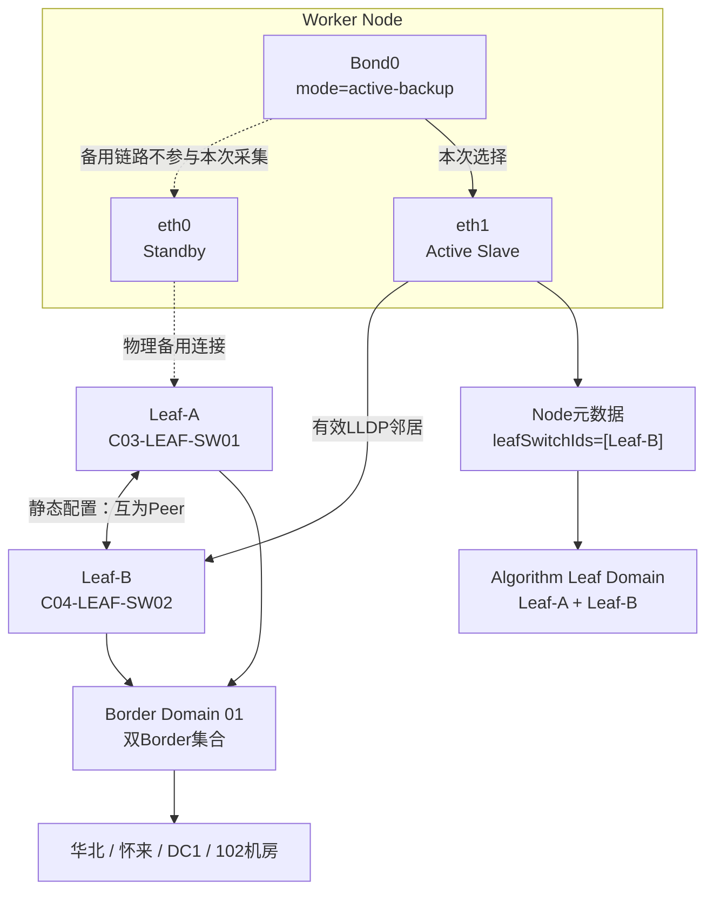
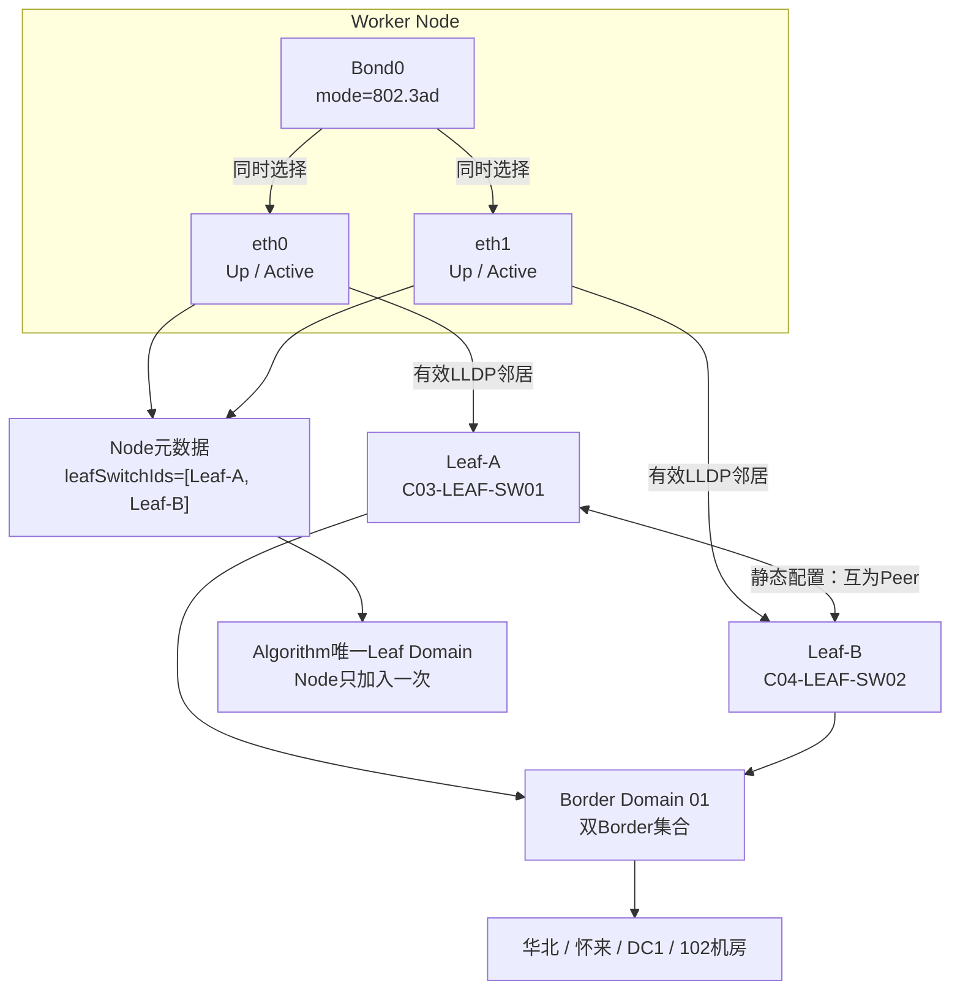
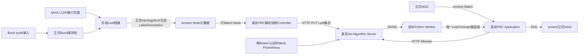

# Group7：Bond主备与负载模式全流程测试

2026-09-10 新增 `bond-master-active-backup` 与 `bond-master-load-balance`：
模拟两个 Leaf 的 LLDP 都在 bond0 上可见，验证 `interface=bond0`、两个 Leaf、
PRC 快照及真实 Algorithm/Python 到 Active NGG。两种场景的 `active` 均为 false，
表示不推断物理 Slave 活动状态。

下文原 `active-backup`、`load-balance` 图示作为显式 Slave 模式回归保留；测试分别显式指定
Active Slave 或有效 Slave 集合，不再代表新版 `auto` / `--interfaces=bond0` 的默认行为。


## 1. 整体测试拓扑与选点规模

Group7的每个子场景都使用一套独立的20节点环境；`active-backup`和`load-balance`依次运行，不是在同一个集群中同时创建40个节点。

```text
区域：华北（CN-NORTH）
└── 位置：怀来（HB-HL）
    └── 数据中心：HB-HL-DC1
        └── 机房：HB-HL-DC1-102
            ├── SPINE：空（当前联通样例没有Spine连接数据）
            └── Border Domain 01
                ├── Border-SW01
                ├── Border-SW02
                │      两个Leaf都上联同一组双Border
                │
                └── Leaf Domain：pair-8e3df4c9cdcb
                    ├── Leaf-A：C03-LEAF-SW01
                    ├── Leaf-B：C04-LEAF-SW02
                    ├── Leaf-A <── 对称Peer链路 ──> Leaf-B
                    │
                    └── Worker Node：20个（worker-0001 ～ worker-0020）
                         └── 每个Node通过bond0物理连接Leaf-A和Leaf-B

NGD最低需求：320 CPU + 1280 GiB内存
单Node容量：  32 CPU + 128 GiB内存 + 4 GPU
最低节点数：  max(320/32, 1280/128) = 10

实际结果：20个候选Node -> Algorithm选择10个 -> NGG写入10个
未选结果：其余10个Node不进入本次NGG
```

| 项目 | Group7实际配置 |
|---|---:|
| 每个子场景的静态Node总数 | 20 |
| 单Node资源 | 32 CPU、128 GiB内存、4 GPU |
| NGD最低资源 | 320 CPU、1280 GiB内存 |
| NGD允许的最大Node数 | 18 |
| Algorithm返回候选组数 | 1个Leaf Domain组 |
| Algorithm最终选中Node数 | 10 |
| NGG中写入Node数 | 10 |
| 未进入NGG的Node数 | 10 |

算法先把两个互为Peer的Leaf归并成唯一Leaf Domain，再在这个域内按负载指标排序并逐个累加节点资源；累加到第10个节点时已经满足NGD最低CPU和内存需求，因此停止选择，不会为了用满`maxNodes=18`而继续增加节点。

## 2. 两种Bond拓扑图

下面两张纯文本图在VS Code普通编辑模式和Markdown预览模式下都能直接看到，不依赖Mermaid插件。

### 2.1 Active-Backup主备模式

```text
                         华北 / 怀来 / DC1 / 102机房
                                      |
                           Border Domain 01
                              /             \
                             /               \
              Leaf-A（C03-LEAF-SW01）   Leaf-B（C04-LEAF-SW02）
                        ^                      ^
                        |                      |
              eth0：Standby              eth1：Active
                        \                      /
                         \                    /
                          Worker Node / bond0
                          mode = active-backup

Agent选择结果：只选择eth1，只采集Leaf-B
写入Node结果：leafSwitchIds = [Leaf-B]
算法归并结果：Leaf-B -> Leaf Domain（Leaf-A + Leaf-B）
```

主机虽然物理连接两个Leaf，但Agent只选择当前Active Slave。主备发生切换时，Node上的Leaf从Leaf-B变成Leaf-A；由于两个Leaf属于同一逻辑域，算法得到的Leaf Domain保持不变。

### 2.2 802.3ad负载均衡模式

```text
                         华北 / 怀来 / DC1 / 102机房
                                      |
                           Border Domain 01
                              /             \
                             /               \
              Leaf-A（C03-LEAF-SW01）   Leaf-B（C04-LEAF-SW02）
                        ^                      ^
                        |                      |
                eth0：Up/Active        eth1：Up/Active
                        \                      /
                         \                    /
                          Worker Node / bond0
                              mode = 802.3ad

Agent选择结果：同时选择eth0、eth1，采集Leaf-A和Leaf-B
写入Node结果：leafSwitchIds = [Leaf-A, Leaf-B]
算法归并结果：Leaf-A + Leaf-B -> 一个Leaf Domain，Node只统计一次
```

两个Slave同时工作，Agent保存两个Leaf。算法根据同一Room、同一Border Domain和对称Peer关系，将两个Leaf合并为一个逻辑域，避免同一Node和资源被重复计算。

## 3. 测试目标

Group7分别验证两种生产Bond模式：

| 子场景 | Bond输入 | 应选择接口 | 写入Node的Leaf |
|---|---|---|---|
| `active-backup` | `active_slave=eth1` | 只选择`eth1` | 只保存Leaf-B |
| `load-balance` | `802.3ad`且eth0/eth1均Up | 选择`eth0`和`eth1` | 保存Leaf-A、Leaf-B |

此外，`TestGroup7_DualLinksToSameLeafAreDeduplicated`专门验证去重边界：
eth0和eth1即使都收到LLDP，只要Chassis/Leaf相同，Node仍写成一个Leaf，
但`leaf-links`保留两条物理链路。正式Socket层还会验证两个不同Chassis后，
才把负载模式判定为双Leaf采集完成。

两个Leaf使用联通式长交换机名称，并在Algorithm上层拓扑中配置为：同一102机房、同一Border Domain、互为对称Peer。因此负载模式的双Leaf最终形成一个Leaf Domain，一个Node只进入一次、资源只统计一次。

### 3.1 Active-Backup详细拓扑（Mermaid）



主备模式下，虽然主机物理上连接两个Leaf，但本次只有`eth1`是Active Slave，因此Agent只保存Leaf-B。Algorithm根据自身静态配置知道Leaf-A与Leaf-B互为Peer，所以Leaf-B仍能稳定映射到同一个双Leaf逻辑域。主备切换到`eth0`后，Node保存值会变为Leaf-A，但逻辑域ID不变。

### 3.2 802.3ad详细拓扑（Mermaid）



负载模式下，两个Slave都处于Up状态，Agent保存两个Leaf及两条链路。Algorithm校验两个Leaf属于同一Room、同一Border Domain且Peer关系对称后，将它们合并成一个Leaf Domain；这个Node不会分别进入Leaf-A组和Leaf-B组。

## 4. 完整流程



这里不打开真实`AF_PACKET`原始套接字，而是用固定的接口→Leaf邻居数据替代物理LLDP报文。Bond选择调用正式Agent共用的`topology_agent/pkg/bond`，Leaf规范化及Node Label/Annotation调用`topology_agent/pkg/topologyfacts`；后续PRC、Algorithm、Python和NGG链路也均为真实生产代码。

## 5. 输入和Expected

```text
testdata/
├── active-backup/
│   ├── input/bond-topology.yaml
│   └── expected/summary.json
└── load-balance/
    ├── input/bond-topology.yaml
    └── expected/summary.json
```

输入YAML包含：Bond名称、模式、Slave列表、Active Slave、每个接口的carrier/operstate，以及每个接口收到的Mock LLDP Leaf和远端端口。

Expected Summary验证：

- 正式Bond代码选中的接口；
- Node最终保存的Leaf集合；
- PRC静态快照中每个Node的Leaf数量；
- Algorithm只返回一个Leaf Domain组；
- Algorithm和NGG均选择10个不重复Node。

## 6. 运行方式

从项目根目录执行：

```bash
make go-test-group7
```

或直接执行：

```bash
source scripts/go-test-env.sh
go test -p=1 ./go_test_suites/group7_bond_topology_flow \
  -run '^TestGroup7_' -v -count=1 -timeout=10m
```

只运行其中一个场景：

```bash
go test -p=1 ./go_test_suites/group7_bond_topology_flow \
  -run '^TestGroup7_BondModesFullFlow/active-backup$' -v -count=1

go test -p=1 ./go_test_suites/group7_bond_topology_flow \
  -run '^TestGroup7_BondModesFullFlow/load-balance$' -v -count=1
```

VS Code可选择`Debug Group7 - Bond topology full flow`后按F5。Debug模式会把PRC/Algorithm/关闭等待超时扩展到10分钟，断点停留时间不会作为有效性能结果。

## 7. 结果文件

每次运行生成：

```text
results/<run-id>/
├── active-backup/
│   ├── actual/
│   │   ├── 01-bond-and-mock-lldp-input.yaml
│   │   ├── 02-node-leaf-metadata.yaml
│   │   ├── 03-prc-static-snapshot.json
│   │   ├── 04-prc-algorithm-request.json
│   │   ├── 05-algorithm-response.json
│   │   ├── 06-ngg.yaml
│   │   ├── 07-prometheus-requests.json
│   │   └── summary.json
│   ├── comparison/diff.txt
│   └── timing.txt
└── load-balance/
    └── 同上
```

`comparison/diff.txt`显示`PASS`表示Actual与Expected一致。

## 8. 计时边界

每个子场景分别计时：

```text
开始：PRC通过Watch观察到NGD并进入Demand Processor
结束：PRC收到真实Algorithm/Python结果并将NGG写为Active
```

Bond sysfs准备、Mock LLDP输入、Node预创建、Algorithm启动、Prometheus预热、PRC静态快照PUT以及结果写盘均不计入业务时间。
