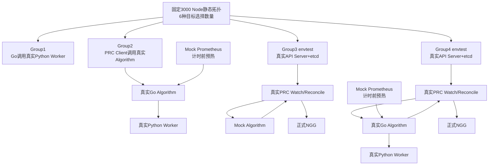
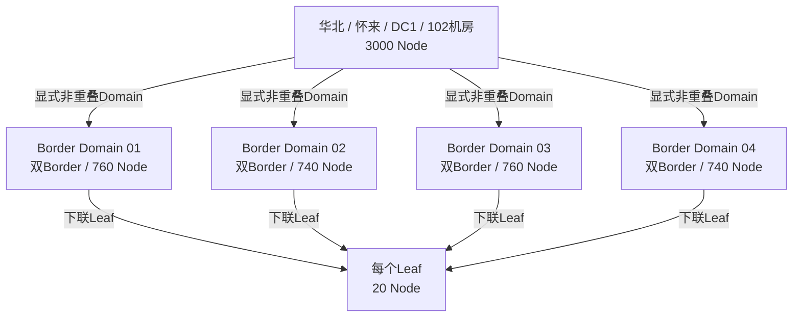

# 3000 Node四组规模性能测试

本目录实现3000个静态候选Node下，分别选择`1000、800、500、300、100、10`个Node的四组Go Test性能矩阵。每个“测试组×选择规模”先预热3次，再正式计时30次，计算Mean、P50、P95、Min、Max和标准差，并自动生成一张24行汇总表。

正式运行ID为`20260825-formal-3000`，共完成：

```text
4个测试组 × 6种选择规模 × 30次 = 720个正式样本
4个测试组 × 6种选择规模 × 3次  = 72个预热样本（不计入统计）
```

720个正式样本全部通过，成功率100%。聚合结果见：

- [Markdown汇总表](reports/20260825-formal-3000/summary.md)
- [CSV汇总表](reports/20260825-formal-3000/summary.csv)
- [完整JSON统计](reports/20260825-formal-3000/statistics.json)
- [运行环境](reports/20260825-formal-3000/environment.json)

## 1. 测试目标

本测试回答两个问题：

1. 静态候选范围固定为3000个Node时，返回不同数量Node需要多长时间；
2. 时间分别消耗在Go/Python算法边界、PRC/Algorithm边界、PRC控制器链路和完整真实算法链路的多少。

这是一套规模性能测试，不替换现有`go_test_suites/group1~group4`中的1000 Node功能正确性测试。规模测试使用全Ready、无资源占用的确定性Node，避免节点故障和资源不足影响“精确选择N个Node”的性能测量。

## 2. 整体测试矩阵

| 项目             | 配置                               |
| ---------------- | ---------------------------------- |
| 静态Node总数     | 3000                               |
| 目标选择数量     | 1000、800、500、300、100、10       |
| 测试组           | 4组                                |
| 每个规模预热     | 3次，不统计                        |
| 每个规模正式样本 | 30次，串行                         |
| 正式样本总数     | 720                                |
| 最大候选组数量   | 3                                  |
| 并发方式         | 单请求串行，不是30个NGD并发        |
| P50/P95算法      | Nearest Rank                       |
| 时间单位         | 毫秒，保留3位小数                  |
| Go并发           | `GOMAXPROCS=2`、`go test -p=1` |

四组关系：



## 3. 3000 Node拓扑

拓扑由[fixture.go](common/fixture.go)确定性生成。Node静态协议为`node-leaf-v1`，上层关系使用独立Algorithm配置：

```text
华北 → 怀来 → HB-HL-DC1 → HB-HL-DC1-102机房：3000 Node
├── Border Domain 01（双Border）：760 Node
├── Border Domain 02（双Border）：740 Node
├── Border Domain 03（双Border）：760 Node
└── Border Domain 04（双Border）：740 Node
SPINE: {}

每个Leaf固定连接20个连续编号的Worker
worker-0001 ... worker-3000
```



每个Node固定资源为：

```text
CPU：32
内存：128Gi
GPU：4
Ready：true
Unschedulable：false
已占用资源：0
```

每个Node带有：

```text
topology.demo.ngg.io/leaf-switch
```

带宽在`25/40/50/100 Gbps`之间循环，时延在`4/2.5/1.5/0.8 ms`之间循环。每个Node还有14项CPU、内存和网络Prometheus指标，共`3000×14=42000`个指标样本。

本测试不启动LLDP。Node只模拟LLDP写入的Leaf标签；Region、Location、DC、Room、双Border Domain、空SPINE、带宽和时延来自`testdata/input/network-topology.yaml`，由真实Algorithm Go层解析。

## 4. 为什么不同数量会落在不同层级

正式NGD不携带拓扑profile。服务端固定`NarrowestFit`，优先选择能容纳全部目标Node的最窄层级：

| 选择Node | Leaf容量20 | Border Domain容量740/760 | Room容量3000 | 最终层级 |
| -------: | ---------: | -----------------------: | -----------: | -------- |
|       10 |       满足 |                        — |            — | Leaf |
| 100/300/500 | 不满足 | 满足 | — | Border Domain |
| 800/1000 | 不满足 | 不满足 | 满足 | Room |

真实Algorithm中：

- 10 Node有150个可行Leaf，评分后返回Top-3；
- 100/300/500 Node有4个可行Border Domain，评分后返回Top-3；
- 800/1000 Node在Room层只有1个可行组，因此返回Top-1；
- PRC始终只把rank 1候选组写入正式NGG。

## 5. 如何精确选择N个Node

每个Node提供32 CPU和128Gi内存。测试根据目标数量计算`minResources`、`quota`和`maxNodes`：

| 选择Node | minResources CPU | minResources内存 | quota              | maxNodes |
| -------: | ---------------: | ---------------: | ------------------ | -------: |
|     1000 |            32000 |         128000Gi | 与minResources相同 |     1000 |
|      800 |            25600 |         102400Gi | 与minResources相同 |      800 |
|      500 |            16000 |          64000Gi | 与minResources相同 |      500 |
|      300 |             9600 |          38400Gi | 与minResources相同 |      300 |
|      100 |             3200 |          12800Gi | 与minResources相同 |      100 |
|       10 |              320 |           1280Gi | 与minResources相同 |       10 |

例如500 Node输入见[testdata/input/demands/select-500.yaml](testdata/input/demands/select-500.yaml)。Algorithm按分数从高到低加入Node，资源达到下限时停止，因此在本测试的同构Node资源条件下精确返回目标数量。

## 6. 四组实现与计时边界

### 6.1 Group1：Go调用Python Worker

代码：[group1 benchmark_test.go](group1_algorithm_worker/benchmark_test.go)

```text
计时前：生成3000 Node Payload、转换为正式Worker协议类型、启动Python Worker、完成3次预热
开始：Go调用worker.CalculatePrepared并序列化正式JSONL请求
业务：Python requirement → topology → loadbalance
结束：Go收到并解析Python JSONL响应
计时后：将内部结果转换为展示用map、校验结果并写入证据文件
```

每次请求包含完整3000 Node静态快照、动态状态和指标快照，因此这组时间包含正式Worker Payload的JSONL编码、进程管道传输、Python解析、算法计算、结果返回和Go解析。展示用`map`与正式Worker协议类型之间的适配转换在计时前后完成，不计入JSONL业务时间。

这里直接调用生产Algorithm内部实际使用的同一个`inner.calculate()`入口。Group1是Group2内部Go调用Python的子区间，因此正常情况下Group1应小于Group2。

### 6.2 Group2：PRC Client调用完整Algorithm

代码：[group2 benchmark_test.go](group2_prc_algorithm/benchmark_test.go)

```text
计时前：启动Mock Prometheus、真实Go Algorithm、真实Python Worker
计时前：Prometheus 42000项指标进入Algorithm内存
计时前：3000 Node静态快照PUT进入Algorithm内存
开始：PRC发送POST /api/v1/allocate
结束：PRC收到并解析Algorithm响应
```

这组采用Warm Cache口径，静态快照上传和Prometheus拉取不进入30次样本。计时包含真实HTTP、Go Algorithm从内存取快照、Go调用Python、三段算法和PRC响应解析。

Group2是Group4内部的Algorithm HTTP子区间。聚合报告会按相同选择规模比较两组30次Mean，要求`Group4 Mean > Group2 Mean`；单次样本受系统抖动影响，不用于这个包含关系判定。

### 6.3 Group3：PRC Watch、Mock Algorithm与NGG

代码：[group3 benchmark_test.go](group3_prc_ngd_ngg/benchmark_test.go)

```text
计时前：envtest启动真实kube-apiserver和etcd
计时前：安装联通NGD/NGG CRD
计时前：创建3000个Node API对象并完成PRC Cache Sync
计时前：启动Mock Algorithm
计时前：独立静态Controller构造并PUT 3000 Node快照，等待确认Ready
开始：PRC通过Watch观察到NGD并进入Reconcile
业务：读取已确认snapshotId、构造Node动态状态、调用Mock Algorithm
业务：PRC处理N个Node结果并写入正式NGG
结束：NGG status.phase=Active
```

Mock Algorithm按目标规模返回一个合法拓扑组和N个稳定排序的具体Node。本组不测真实算法公式，重点测PRC在3000 Node动态输入及10~1000 Node输出下的控制器、协议和Kubernetes写入成本。静态快照同步独立发生在NGD创建前，不进入30次任务样本。

### 6.4 Group4：完整真实Algorithm链路

代码：[group4 benchmark_test.go](group4_full_real_algorithm/benchmark_test.go)

```text
计时前：envtest、CRD、3000 Node、PRC Cache全部Ready
计时前：Mock Prometheus指标已进入真实Algorithm内存
计时前：真实Go Algorithm和Python Worker已经启动
计时前：独立静态Controller已把3000 Node快照同步到Algorithm并确认Ready
开始：PRC通过Watch观察到NGD并进入Reconcile
业务：PRC → HTTP → Go Algorithm → Python Worker
业务：requirement → topology → loadbalance → 候选组
业务：Algorithm → PRC → 正式NGG
结束：NGG status.phase=Active
```

这是当前最接近正式组件链路的结果。任务计时期间只传NGD与Node动态状态，Algorithm读取预先就绪的静态和Prometheus缓存；没有启动Volcano或kube-scheduler，终点是正式NGG生成，不包含Pod Bind。

## 7. 30次样本和统计规则

每个规模严格串行执行：

```text
3次预热，不保存到samples.csv
→ 30次正式调用
→ 每次在结束计时后验证Node数量、去重、rank和状态
→ 耗时先保存在内存
→ 30次结束后统一写CSV/JSON/Markdown
```

业务计时期间不写证据文件。每种规模把第30次已经完成计时的请求和响应保存为展示证据，文件写入不会反向进入`elapsed`。

统计定义：

- `Mean`：30个成功样本的算术平均值；
- `P50`：Nearest Rank第15个样本；
- `P95`：Nearest Rank第29个样本；
- `Min/Max`：最小值和最大值；
- `StdDev`：总体标准差；
- `SuccessRate`：通过完整正确性断言的样本数除以30。

一次样本只要出现以下任一情况，测试立即失败，不把错误样本混入统计：

- Algorithm没有返回`SUCCESS`；
- 第一候选组不是目标Node数量；
- Node重复、rank不连续或顺序不稳定；
- 第三、四组NGG Node数量不正确；
- NGG没有进入`Active`；
- NGD没有最终进入`Fulfilled`。

## 8. 目录和文件说明

```text
scale_benchmark_3000/
├── README.md
├── common/
│   ├── fixture.go          # 3000 Node、拓扑、NGD和运行参数
│   ├── statistics.go       # 30样本、P50/P95/Mean和报告输出
│   └── validate.go         # Algorithm和NGG正确性断言
├── cmd/report/main.go      # 合并四组统计为24行总表
├── testdata/input/
│   ├── fixture-summary.json
│   ├── node-static-snapshot-3000.json
│   ├── node-dynamic-state-3000.json
│   ├── prometheus-metrics-3000.json
│   └── demands/select-*.yaml
├── group1_algorithm_worker/
│   ├── benchmark_test.go
│   └── results/<run-id>/
├── group2_prc_algorithm/
│   ├── benchmark_test.go
│   └── results/<run-id>/
├── group3_prc_ngd_ngg/
│   ├── benchmark_test.go
│   └── results/<run-id>/
├── group4_full_real_algorithm/
│   ├── benchmark_test.go
│   └── results/<run-id>/
└── reports/<run-id>/
    ├── summary.md
    ├── group2-vs-group4.md
    ├── summary.csv
    ├── statistics.json
    └── environment.json
```

每组的`results/<run-id>/`包含：

```text
samples/select-1000.csv ... select-10.csv  # 每次原始耗时
statistics.json                             # 本组6行统计
statistics.csv
summary.md
evidence/select-N/                          # 该规模完整请求与输出
```

证据内容：

| 组     | evidence主要文件                                              |
| ------ | ------------------------------------------------------------- |
| Group1 | `go-to-python-request.json`、`python-to-go-response.json` |
| Group2 | `prc-allocation-request.json`、`algorithm-response.json`  |
| Group3 | `ngd.yaml`、PRC请求、Mock响应、`ngg.yaml`                 |
| Group4 | `ngd.yaml`、PRC请求、真实Algorithm响应、`ngg.yaml`        |

## 9. 如何运行

### 9.1 正式运行全部四组

```bash
cd /mnt/data0/volcano-scheduler/ngd-ngg-scheduling-demo
make benchmark-3000-all
```

该命令自动：

1. 加载数据盘Go、Go缓存和envtest路径；
2. 生成同一个`BENCHMARK_RUN_ID`；
3. 串行运行Group1到Group4；
4. 每组执行6种规模、每种3次预热和30次正式样本；
5. 生成四组独立结果；
6. 合并生成24行总表，并校验Group4完整链路Mean大于Group2 Algorithm子区间Mean。

本次服务器上完整运行约10分钟。第三、四组需要本机回环端口权限，以启动envtest和Mock HTTP服务，不需要Kind、Docker、外部Prometheus或真实Kubernetes集群。

### 9.2 单独运行一组

```bash
make benchmark-3000-group1
make benchmark-3000-group2
make benchmark-3000-group3
make benchmark-3000-group4
```

### 9.3 快速Debug一个规模

例如只调试Group4选择1000个Node，预热0次、正式1次：

```bash
BENCHMARK_RUN_ID=debug-group4-1000 \
BENCHMARK_TARGETS=1000 \
BENCHMARK_SAMPLES=1 \
BENCHMARK_WARMUPS=0 \
make benchmark-3000-group4
```

多个规模使用逗号分隔：

```bash
BENCHMARK_TARGETS=1000,100 make benchmark-3000-group2
```

上述环境变量只用于Debug。正式验收必须保持6个默认规模、3次预热和30次正式样本。

### 9.4 查看结果

```bash
cat go_test_suites/scale_benchmark_3000/reports/20260825-formal-3000/summary.md
```

查看Group4的1000 Node原始30次耗时：

```bash
cat go_test_suites/scale_benchmark_3000/group4_full_real_algorithm/results/20260825-formal-3000/samples/select-1000.csv
```

查看Group4最终1000 Node NGG：

```bash
sed -n '1,200p' go_test_suites/scale_benchmark_3000/group4_full_real_algorithm/results/20260825-formal-3000/evidence/select-1000/ngg.yaml
```

重新生成已有运行的聚合报告：

```bash
BENCHMARK_RUN_ID=20260825-formal-3000 make benchmark-3000-report
```

## 10. 正式测试结果

正式汇总运行ID：`20260825-formal-3000`。Group1/2结果生成于2026年8月25日；Group3/4在独立静态快照Controller完成后于2026年8月26日重新运行。环境为Linux amd64、Go 1.25.13、`GOMAXPROCS=2`；服务器CPU为Intel Xeon Gold 6148，主机共有80个逻辑CPU，但测试主动限制为2个Go执行线程。

| 测试组                       | 静态Node | 选择Node | 次数 | 成功率 | Mean(ms) |  P50(ms) |  P95(ms) | Min(ms) |  Max(ms) | StdDev(ms) |
| ---------------------------- | -------: | -------: | ---: | -----: | -------: | -------: | -------: | ------: | -------: | ---------: |
| Group1-Go-Python             |     3000 |     1000 |   30 | 100.0% |  396.887 |  394.931 |  418.050 | 373.513 |  424.497 |     13.480 |
| Group1-Go-Python             |     3000 |      800 |   30 | 100.0% |  391.920 |  392.238 |  434.362 | 369.530 |  445.729 |     16.210 |
| Group1-Go-Python             |     3000 |      500 |   30 | 100.0% |  377.791 |  376.755 |  408.772 | 352.754 |  422.809 |     13.701 |
| Group1-Go-Python             |     3000 |      300 |   30 | 100.0% |  352.930 |  351.580 |  373.563 | 333.712 |  378.610 |     11.514 |
| Group1-Go-Python             |     3000 |      100 |   30 | 100.0% |  352.186 |  353.987 |  364.803 | 324.823 |  380.804 |     10.994 |
| Group1-Go-Python             |     3000 |       10 |   30 | 100.0% |  338.134 |  333.436 |  374.470 | 303.952 |  388.206 |     18.401 |
| Group2-PRC-Algorithm         |     3000 |     1000 |   30 | 100.0% |  459.026 |  461.181 |  493.190 | 428.857 |  497.603 |     19.250 |
| Group2-PRC-Algorithm         |     3000 |      800 |   30 | 100.0% |  441.354 |  434.640 |  476.811 | 411.988 |  477.274 |     18.277 |
| Group2-PRC-Algorithm         |     3000 |      500 |   30 | 100.0% |  410.269 |  410.534 |  426.916 | 389.104 |  437.468 |      9.294 |
| Group2-PRC-Algorithm         |     3000 |      300 |   30 | 100.0% |  400.930 |  401.663 |  435.738 | 371.893 |  441.061 |     17.398 |
| Group2-PRC-Algorithm         |     3000 |      100 |   30 | 100.0% |  382.910 |  382.071 |  422.710 | 350.590 |  436.397 |     20.055 |
| Group2-PRC-Algorithm         |     3000 |       10 |   30 | 100.0% |  361.810 |  358.471 |  396.573 | 330.435 |  398.558 |     18.425 |
| Group3-PRC-MockAlgorithm-NGG |     3000 |     1000 |   30 | 100.0% |  630.081 |  642.379 |  734.512 | 484.761 |  757.701 |     70.267 |
| Group3-PRC-MockAlgorithm-NGG |     3000 |      800 |   30 | 100.0% |  527.308 |  446.971 |  722.277 | 392.983 |  731.498 |    116.159 |
| Group3-PRC-MockAlgorithm-NGG |     3000 |      500 |   30 | 100.0% |  343.503 |  309.211 |  496.190 | 272.747 |  511.110 |     68.616 |
| Group3-PRC-MockAlgorithm-NGG |     3000 |      300 |   30 | 100.0% |  241.564 |  227.788 |  339.384 | 190.935 |  349.565 |     42.931 |
| Group3-PRC-MockAlgorithm-NGG |     3000 |      100 |   30 | 100.0% |  143.607 |  146.775 |  194.404 | 115.491 |  202.081 |     22.024 |
| Group3-PRC-MockAlgorithm-NGG |     3000 |       10 |   30 | 100.0% |   88.458 |   84.358 |  109.167 |  73.950 |  112.645 |     11.635 |
| Group4-Full-RealAlgorithm    |     3000 |     1000 |   30 | 100.0% | 1068.278 | 1073.947 | 1152.996 | 945.873 | 1155.834 |     52.841 |
| Group4-Full-RealAlgorithm    |     3000 |      800 |   30 | 100.0% |  962.966 |  899.418 | 1215.848 | 773.344 | 1277.481 |    131.781 |
| Group4-Full-RealAlgorithm    |     3000 |      500 |   30 | 100.0% |  752.516 |  723.021 |  873.410 | 674.537 |  922.594 |     64.135 |
| Group4-Full-RealAlgorithm    |     3000 |      300 |   30 | 100.0% |  619.108 |  597.439 |  726.286 | 547.335 |  770.132 |     55.488 |
| Group4-Full-RealAlgorithm    |     3000 |      100 |   30 | 100.0% |  502.839 |  501.921 |  544.589 | 447.480 |  582.142 |     27.346 |
| Group4-Full-RealAlgorithm    |     3000 |       10 |   30 | 100.0% |  420.305 |  422.295 |  444.162 | 393.054 |  453.791 |     15.115 |

## 11. 结果解读

### 11.1 全部规模均能精确返回目标Node数量

720个正式样本全部通过。特别是1000 Node场景已经验证：

- 真实Algorithm能在3000候选Node中返回1000个具体Node；
- PRC能接收和校验大型Algorithm响应；
- envtest API Server能够保存包含1000个Node的正式NGG；
- NGG最终进入`Active`，NGD进入`Fulfilled`。

### 11.2 Group1对返回数量不特别敏感

Group1即使只选10个Node，Mean仍为338.134 ms。原因是每次Go→Python请求始终携带完整3000 Node静态、动态和指标上下文，固定的JSONL编码、管道传输和Python输入解析成本占主要部分。选择数量从10增加到1000后，Mean增加到396.887 ms，增加约59 ms。

修正后的六档Group1 Mean均低于对应Group2 Mean，差值约24~62 ms，符合“Group2在同一个Python Worker调用外继续增加HTTP、缓存解析、动态状态规范化和响应组装”的调用关系。旧Group1把展示用大对象转换误计入业务时间，相关旧结果已经删除且不再进入汇总报告。

### 11.3 Group2纯Algorithm调用为362~459 ms

静态快照和Prometheus缓存提前Ready以后，PRC调用真实Algorithm的P50范围为358.471~461.181 ms。选择数量越多，Python结果构造、JSON响应和Go解析成本逐步增加。

### 11.4 Group3能反映大型NGG写入成本

Group3从10 Node的Mean 88.458 ms上升到1000 Node的630.081 ms。由于Algorithm是轻量Mock且静态同步已经移出计时，增长主要来自PRC处理更大的候选Node列表、构造NGG、API序列化以及etcd写入。

### 11.5 Group4完整链路为0.42~1.07秒Mean

Group4是最重要的结果：

| 选择Node |    Mean |     P50 |     P95 |
| -------: | ------: | ------: | ------: |
|     1000 | 1.068 s | 1.074 s | 1.153 s |
|      800 | 0.963 s | 0.899 s | 1.216 s |
|      500 | 0.753 s | 0.723 s | 0.873 s |
|      300 | 0.619 s | 0.597 s | 0.726 s |
|      100 | 0.503 s | 0.502 s | 0.545 s |
|       10 | 0.420 s | 0.422 s | 0.444 s |

完整链路的P95在选择1000个Node时为1.153秒。该结果说明当前实现能够在本地组件环境下预先维护3000 Node静态缓存，并在任务到达后处理3000 Node动态状态和1000 Node授权结果。

### 11.6 Group2与Group4包含关系正确

聚合报告新增自动校验，六档30次Mean全部满足`Group4完整链路 > Group2 Algorithm HTTP子区间`：

| 选择Node | Group2 Mean | Group4 Mean | 完整链路增量 | 结论 |
| -------: | ----------: | ----------: | -----------: | ---- |
|     1000 |  459.026 ms | 1068.278 ms |   609.252 ms | PASS |
|      800 |  441.354 ms |  962.966 ms |   521.612 ms | PASS |
|      500 |  410.269 ms |  752.516 ms |   342.247 ms | PASS |
|      300 |  400.930 ms |  619.108 ms |   218.179 ms | PASS |
|      100 |  382.910 ms |  502.839 ms |   119.929 ms | PASS |
|       10 |  361.810 ms |  420.305 ms |    58.495 ms | PASS |

生成文件为`reports/<run-id>/group2-vs-group4.md`；任一规模的Group4 Mean不大于Group2 Mean时，聚合报告命令直接失败。

### 11.7 结果适用范围

这些数据适用于当前服务器、本地进程通信和envtest环境，不直接等于联通生产集群时间。生产环境还会受到以下因素影响：

- PRC与Algorithm Pod之间的真实网络RTT；
- 生产Kubernetes API Server和etcd负载；
- Prometheus缓存是否Ready；
- 生产Node/Pod对象数量和Informer压力；
- CPU限额、Python Worker数量和其他并发NGD；
- Volcano或kube-scheduler最终Pod Bind时间。

后续若要评估30个NGD同时到达，需要单独增加并发吞吐测试，统计吞吐量、排队时间和并发P95；不能与本次单请求串行时延直接混用。
