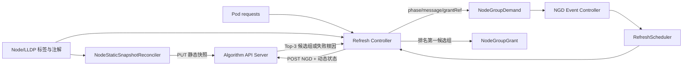

# Platform Resource Controller（PRC）

PRC 是 NGD/NGG 调度链路中的 Kubernetes 控制器。它监听集群级 `NodeGroupDemand`（NGD），采集 Node、Pod 和 LLDP 拓扑数据，将静态快照和单次调度状态发送给 Algorithm API Server，最后把排名第一的候选组写成 `NodeGroupGrant`（NGG）。

PRC 不执行节点评分，也不维护上层交换机拓扑。节点过滤、拓扑分组、资源可行性检查和评分由 Algorithm 完成；PRC 负责 Kubernetes 状态采集、协议校验、对象生命周期和状态发布。

## 1. 处理链路



一次完整处理包含以下步骤：

1. 校验 NGD 的 `schedulerName`、CPU/内存 Quantity 和五级拓扑字段。
2. 读取全部 Node 和未结束 Pod，生成请求级调度状态。
3. 获取已经被当前 Algorithm 进程确认的 Node 静态快照身份。
4. 调用 `POST /api/v1/allocate`。
5. 校验响应身份、快照、排序、分数和节点 UID。
6. 有候选组时创建或更新 `ngg-<ngd-name>`，并将 NGD 标记为 `Fulfilled`。
7. 无候选组时把 Algorithm 返回的根因写入 NGD `status.message`。
8. 按配置周期重新计算；NGD 更新会取消旧请求，NGD 删除会停止刷新并删除对应 NGG。

## 2. 目录结构

```text
prc/
├── README.md
├── PROJECT
├── go.mod
├── go.sum
├── cmd/
│   ├── main.go
│   └── main_test.go
└── pkg/
    ├── application/
    │   └── application.go
    └── controller/
        ├── algorithm_client.go
        ├── prc_controller.go
        ├── refresh_controller.go
        ├── refresh_scheduler.go
        ├── snapshot.go
        ├── static_snapshot_controller.go
        └── *_test.go
```

| 文件 | 职责 |
|---|---|
| `cmd/main.go` | 正式进程入口；读取参数和环境变量，创建并启动 Application。 |
| `pkg/application/application.go` | 统一组装 controller-runtime Manager、健康检查、Leader Election 和全部 Controller。 |
| `pkg/controller/static_snapshot_controller.go` | 监听 Node 静态信息，生成内容 Hash 快照并同步到 Algorithm。 |
| `pkg/controller/snapshot.go` | 生成静态 Node 快照和请求级动态调度状态。 |
| `pkg/controller/refresh_controller.go` | 处理 NGD 创建、更新、删除事件，并运行周期刷新 Worker。 |
| `pkg/controller/refresh_scheduler.go` | 管理每个 NGD 的定时器、UID/generation 和执行取消。 |
| `pkg/controller/prc_controller.go` | 执行一次 NGD→Algorithm→NGG 业务流程，维护 NGD/NGG 状态。 |
| `pkg/controller/algorithm_client.go` | 实现静态快照、缓存状态和分配接口的 HTTP 客户端。 |

## 3. Node 静态快照

静态快照只包含具有有效 Leaf 信息的 Node，当前拓扑协议版本为 `node-leaf-set-v2`。PRC 支持以下输入：

| 类型 | 字段 | 用途 |
|---|---|---|
| Label | `topology.demo.ngg.io/leaf-switch` | 单 Leaf 节点的首选字段。 |
| Label | `topology.demo.ngg.io/switch` | 兼容单 Leaf 字段。 |
| Annotation | `topology.demo.ngg.io/leaf-switch-ids` | JSON 数组，最多两个 Leaf。 |
| Annotation | `topology.demo.ngg.io/leaf-links` | JSON 数组，包含 bond、接口、Leaf、远端端口和 active 状态。 |

静态快照包含 Node 名称、UID、Kubernetes InternalIP、创建时间、`allocatable`、Labels 和直连 Leaf 信息。内容经过稳定排序并计算 `sha256:` Hash。只有 Algorithm 明确确认该 Hash 后，任务计算才会使用它。

Node 静态信息变化时，PRC 会先把快照状态设为未就绪，避免新旧拓扑并发使用。仅心跳变化不会触发无意义的静态快照更新。Algorithm 重启或缓存丢失后，PRC 会重新同步当前快照。

## 4. 请求级动态状态

每次计算都会重新读取 Node 和 Pod：

- `ready`：来自 Node `Ready` Condition。
- `unschedulable`：来自 `node.spec.unschedulable`。
- `requestedResources`：汇总已经绑定到该 Node、且尚未结束的 Pod 容器 requests。

动态状态按 Node UID 排序并计算 `schedulerStateSnapshotId`。它只属于本次请求，不存入静态缓存。

## 5. NGD 输入处理

PRC 使用联通的原始 `scheduling.platform.example.io/v1alpha1` CRD，不修改 CRD 结构。NGD `spec` 会作为完整对象透传给 Algorithm；PRC 在调用前执行必要校验。

当前明确处理的字段包括：

- `schedulerName`
- `nodeSelector`
- `maxNodes`
- `minResources`
- `quota`
- `topologyLabels`
- `grantPolicy.algorithmTimeoutSeconds`

支持的五级拓扑键为：

```text
topology.kubernetes.io/data-center
topology.kubernetes.io/room
topology.kubernetes.io/border-switch
topology.kubernetes.io/spine-switch
topology.kubernetes.io/leaf-switch
```

`minResources.cpu`、`minResources.memory`、`quota.cpu` 和 `quota.memory` 使用 Kubernetes `resource.Quantity` 解析，因此支持 `500m`、`80`、`1Gi`、`400Gi`、`1G` 等合法格式。PRC 不在 Python Worker 中解释这些单位。

## 6. NGD 和 NGG 状态

### NGD 状态

| phase | 触发条件 | 主要字段 |
|---|---|---|
| `Pending` | 新 NGD 等待首次计算 | `message: WaitingForInitialCalculation` |
| `Updating` | NGD generation 发生变化 | 保留当前 `grantRef`，`message: DemandSpecChanged` |
| `Fulfilled` | Algorithm 返回可行候选组 | `grantRef`、`resolvedNodeCount`、选中组信息 |
| `Failed` | 输入非法、Algorithm 不可用或无可行组 | `grantRef: ""`、`resolvedNodeCount: 0`、明确根因 |

失败消息格式为 `<reason>: <detail>`。例如：

```yaml
status:
  phase: Failed
  grantRef: ""
  resolvedNodeCount: 0
  message: >-
    QUOTA_PREVENTS_MINIMUM: 3 nodes matched, but no node group can
    satisfy minResources within quota cpu=80000m,memory=409600Mi
```

可重试错误会先写入 `Failed` 状态，再按默认 10 秒重试。不可重试的输入或业务错误保持失败状态，等待 NGD spec 更新。

### NGG 状态

成功时 PRC 只采用 Algorithm 排名第一的候选组。NGG 名称为 `ngg-<ngd-name>`，并通过 OwnerReference 关联 NGD。

```yaml
status:
  phase: Active
  resolvedCapacity:
    nodes: 1
    cpu: 101680m
    memory: 458090Mi
```

`resolvedCapacity.cpu` 使用毫核 `m`，内存使用 `Mi`，均为 Kubernetes 原生 Quantity 表示。已有 NGG 在新一轮计算变为不可满足时会标记为 `Returned`。PRC 使用独立 SSA Field Manager 更新 spec 和 status，不覆盖消费方维护的 `status.consumer`。

## 7. Algorithm 协议

PRC 调用三个接口：

| 方法 | 路径 | 用途 |
|---|---|---|
| `GET` | `/internal/v1/node-static-cache/status` | 获取 Algorithm Boot ID 和已接受快照。 |
| `PUT` | `/internal/v1/node-static-snapshots/{snapshotId}` | 上传 Node 静态快照。 |
| `POST` | `/api/v1/allocate` | 提交 NGD、静态快照 ID 和请求级动态状态。 |

PRC 不直接信任 Algorithm 返回值。发布 NGG 前会检查：

- request、task、NGD UID 和 generation 一致；
- Algorithm Boot ID、静态快照 ID 和动态快照 ID 一致；
- 状态只能为 `SUCCESS` 或 `UNSATISFIABLE`；
- 候选组最多 3 个，rank 连续且稳定降序；
- 节点分数位于 0～100；
- 节点 UID 存在且名称匹配；
- 不同候选组之间没有重复节点。

Algorithm 返回的 `failure.code` 和 `failure.message` 会进入 NGD 状态。没有结构化根因时使用 `NO_FEASIBLE_NODE_GROUP` 作为兼容回退。

## 8. 启动配置

### 环境变量

| 环境变量 | 默认值 | 说明 |
|---|---|---|
| `ALGORITHM_URL` | `http://ngd-ngg-algorithm.ngd-ngg-system.svc:8080` | Algorithm API Server 地址。 |
| `CLUSTER_ID` | `default-cluster` | 写入静态快照的集群身份。 |
| `LOG_LEVEL` | `info` | 日志等级：`debug`、`info`、`warn` 或 `error`。 |
| `LOG_FORMAT` | `json` | 命令行日志格式：`json` 或 `console`。 |

### 命令行参数

| 参数 | 默认值 | 说明 |
|---|---:|---|
| `--metrics-bind-address` | `0` | Metrics 监听地址；`0` 表示关闭。 |
| `--health-probe-bind-address` | `:8081` | `/healthz` 和 `/readyz` 地址。 |
| `--leader-elect` | `true` | 启用 Leader Election。 |
| `--demand-refresh-interval` | `15s` | 一个 NGD 完成本轮处理后的普通刷新间隔。 |
| `--max-concurrent-refreshes` | `5` | 同时处理不同 NGD 的最大 Worker 数。 |

刷新间隔和并发数必须大于 0。单个 NGD 由 controller-runtime WorkQueue 去重；NGD generation 更新会取消旧请求，并在返回结果前再次检查对象身份，防止旧结果覆盖新需求。

## 9. 构建与测试

运行 PRC 单元测试：

```bash
cd prc
GOWORK=off go test ./...
```

在项目根目录运行集成测试：

```bash
make go-test-group2  # PRC 调用真实 Algorithm 和 Mock Prometheus
make go-test-group3  # envtest 中监听 NGD 并生成 NGG
make go-test-group4  # PRC、Algorithm、Python Worker 完整链路
make go-test-group5  # 周期刷新、更新、删除和 status.consumer 隔离
```

3000 Node 的 PRC 相关性能测试：

```bash
make benchmark-3000-group2
make benchmark-3000-group3
make benchmark-3000-group4
```

## 10. 集群内部署

当前保留的部署入口是 [`deploy-incluster/prc.yaml`](../deploy-incluster/prc.yaml)，其中包含 ServiceAccount、ClusterRole、ClusterRoleBinding 和 Deployment。

先确保 NGD/NGG CRD 和 Algorithm 已部署，再执行：

```bash
kubectl apply -f deploy-incluster/prc.yaml
kubectl rollout status deployment/platform-resource-controller \
  -n welkin-system --timeout=180s
```

检查状态和日志：

```bash
kubectl get deployment platform-resource-controller -n welkin-system -o wide
kubectl get pods -n welkin-system \
  -l app=ngd-ngg-platform-resource-controller -o wide
kubectl logs -n welkin-system deployment/platform-resource-controller -f
```

检查健康接口：

```bash
kubectl port-forward -n welkin-system \
  deployment/platform-resource-controller 8081:8081
curl http://127.0.0.1:8081/healthz
curl http://127.0.0.1:8081/readyz
```

示例清单使用 `imagePullPolicy: IfNotPresent` 并固定到 master3，因为镜像当前导入在该节点的 containerd 中。迁移到其他节点前，需要先确保目标节点可以拉取或已经导入相同镜像。

## 11. RBAC

PRC 需要以下权限：

- 读取和监听 Node、Pod；
- 创建和更新 Event；
- 读取和监听 NGD，更新 NGD status；
- 创建、更新、删除 NGG，更新 NGG status；
- 读写 Leader Election Lease。

完整权限以 [`deploy-incluster/prc.yaml`](../deploy-incluster/prc.yaml) 为准。

## 12. 常见排查

### NGD 一直等待静态快照

检查 PRC 日志中的 `StaticSnapshotNotReady`，再确认：

- 至少一个 Node 具有有效 Leaf Label 或 Annotation；
- `ALGORITHM_URL` 可访问；
- Algorithm 的静态缓存接口正常；
- Node 的 `leaf-switch-ids` 和 `leaf-links` 是合法 JSON，且最多解析出两个 Leaf。

### NGD 显示 AlgorithmRequestFailed

检查 Service DNS、Algorithm Pod 和端口：

```bash
kubectl get service,endpoints -n welkin-system ngd-ngg-algorithm
kubectl get pods -n welkin-system -l app=ngd-ngg-algorithm
kubectl logs -n welkin-system deployment/ngd-ngg-algorithm --tail=100
```

### NGD Failed 但原因看起来不正确

先直接查看状态：

```bash
kubectl get ngd <name> -o jsonpath='{.status.phase}{"\n"}{.status.message}{"\n"}'
```

当前版本会保留 Algorithm 的结构化根因，例如 `NODE_SELECTOR_NO_MATCH`、`INSUFFICIENT_RESOURCES`、`QUOTA_PREVENTS_MINIMUM` 或 `INVALID_TOPOLOGY_LABELS`。如果只看到 `NO_FEASIBLE_NODE_GROUP`，说明 Algorithm 没有返回更具体的 `failure` 对象。

### 删除 NGD 后 NGG 仍存在

正常情况下事件 Controller 会显式删除 `ngg-<ngd-name>`，OwnerReference 也会提供垃圾回收保障。检查 PRC 是否为当前 Leader，以及 ServiceAccount 是否具有 NGG delete 权限。