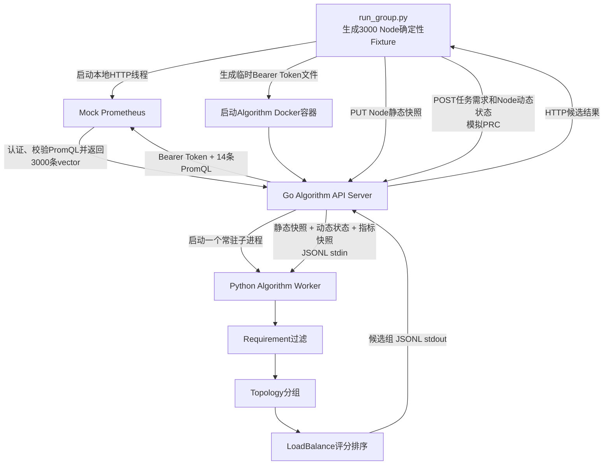

# 第一组：Algorithm Server 独立演示

## 1. 本组验证什么

本组不启动 Kubernetes、PRC、NGD 和 NGG，而是由 `run_group.py` 模拟 PRC，独立验证以下真实组件：

- Go Algorithm API Server；
- Go 内存中的 Node 静态快照；
- Go 定时读取和缓存的 Prometheus 指标；
- Go 启动并通过 stdin/stdout JSONL 调用的常驻 Python Algorithm Worker；
- Python 的 `requirement -> topology -> loadbalance` 算法流水线；
- 3000 Node 场景下的 Cold/Warm 性能和完整中间证据。

入口文件：

- 测试驱动：[`run_group.py`](run_group.py)
- 3000 Node 数据生成：[`../common/fixture.py`](../common/fixture.py)
- 数据规则：[`../common/fixture-config.json`](../common/fixture-config.json)
- Mock Prometheus：[`../common/mock_prometheus.py`](../common/mock_prometheus.py)
- Go Prometheus 客户端：[`../../algorithm_server/go/metrics.go`](../../algorithm_server/go/metrics.go)
- Python 流水线：[`../../algorithm_server/python/algorithm_worker/pipeline.py`](../../algorithm_server/python/algorithm_worker/pipeline.py)

## 2. 如何运行

在项目根目录执行：

```bash
cd /mnt/data0/volcano-scheduler/ngd-ngg-scheduling-demo

make demo-group1-timing    # 第一遍：只计时，不启用Trace和协议落盘
make demo-group1-evidence  # 第二遍：生成完整输入、过程和输出，不作为性能结果
make demo-group1           # 依次运行Timing和Evidence，并校验两遍候选结果相同
```

`make` 会先构建当前源码对应的 `ngd-ngg-algorithm:v0.4.0` 镜像，再执行：

```bash
./test/legacy/group1_algorithm/run-group.sh --mode timing
./test/legacy/group1_algorithm/run-group.sh --mode evidence
```

查看最新结果：

```bash
./test/legacy/show-latest.sh group1_algorithm cold_cache
./test/legacy/show-latest.sh group1_algorithm warm_cache
```

## 3. 整体执行过程



详细步骤如下：

1. `run_group.py` 调用 `fixture.generate()`，在内存生成3000个Node的静态数据、动态状态、Prometheus指标和一次正式资源池请求。
2. `start_prometheus()` 创建 `ThreadingHTTPServer`，绑定宿主机随机端口，并在后台线程运行Mock Prometheus。
3. 测试驱动把测试Token写入临时文件 `.prometheus-token`。
4. `start_algorithm()` 启动Algorithm Docker容器，将Token只读挂载到 `/run/secrets/prometheus-token`，同时设置Mock Prometheus地址。
5. Go Algorithm进程启动一个常驻Python Worker，并启动Prometheus刷新协程。
6. Go携带Bearer Token向Mock Prometheus的 `/api/v1/query` 发起14个instant query，把返回数据构造成内存指标快照。
7. 模拟PRC通过 `PUT /internal/v1/node-static-snapshots/{snapshotID}` 上传Node静态快照。
8. 模拟PRC通过 `POST /api/v1/allocate` 发送完整联通NGD `spec`和本次请求的Node动态状态；请求中不包含算法编排数组。
9. Go根据 `nodeStaticSnapshotId` 解析静态缓存，将静态快照、动态状态和指标快照通过JSONL传给Python Worker。
10. Python依次执行Requirement、Topology和LoadBalance，返回已排序的候选组。
11. Go保持Python给出的分数和顺序，生成最终HTTP响应；测试驱动检查节点数量、候选组层级、排序及忙节点是否被排除。
12. `finally` 中删除Algorithm容器、停止Mock Prometheus并删除临时Token文件。

## 4. Mock Prometheus及认证确认

### 4.1 Group1确实会启动Mock Prometheus

Timing和Evidence会分别调用一次 `start_prometheus()`。它不是一个预先部署的外部服务，而是测试运行时在宿主机启动的独立HTTP Server：

```python
prometheus, state = start_prometheus(
    fixture["metrics"], catalogue, bearer_token, log_path
)
```

服务监听随机端口，Algorithm容器通过以下地址访问宿主机服务：

```text
PROMETHEUS_URL=http://host.docker.internal:<随机端口>
```

每轮运行结束后都会调用 `shutdown()` 和 `server_close()`，不会保留后台Mock服务。

### 4.2 Bearer Token传递链路

测试配置中的Token为：

```text
test-prometheus-token
```

实际链路为：

```text
fixture-config.json
  -> run_group.py写入临时Token文件
  -> Docker只读挂载到/run/secrets/prometheus-token
  -> PROMETHEUS_BEARER_TOKEN_FILE指向该文件
  -> Go读取Token
  -> HTTP请求添加Authorization: Bearer <token>
  -> Mock Prometheus比较请求Token与预期Token
```

Mock只对正式查询接口 `GET /api/v1/query` 执行认证：

| 请求情况 | Mock响应 |
| --- | --- |
| 没有`Authorization` | HTTP 401，`missing bearer token` |
| Token错误 | HTTP 403，`invalid bearer token` |
| Token正确 | 继续校验PromQL并返回HTTP 200 |

`/-/ready`和测试专用的 `/control/*` 不属于指标查询，不执行Bearer认证。

Evidence运行会把每次查询记录到：

```text
evidence-run/infrastructure/prometheus-requests.jsonl
```

一条成功记录类似：

```json
{"method":"GET","path":"/api/v1/query","status":200,"auth":"valid","metric":"cpuUsageRatio","series":3000,"queryMatched":true}
```

因此当前Group1已经验证了“Algorithm携带正确Token并成功读取指标”的成功路径。Mock也实现了缺失Token和错误Token的401/403分支，但本组当前没有单独发送错误凭据作为负向Case。

### 4.3 PromQL和返回格式校验

Mock并不是接到任意请求都返回数据。它会：

1. 从请求中读取 `query` 参数；
2. 与 [`prometheus_metrics.json`](../../algorithm_server/go/prometheus_metrics.json) 中的14条PromQL逐字匹配；
3. 未匹配返回HTTP 422；
4. 匹配后返回与Prometheus instant-query API一致的 `status/data/resultType/vector` 结构；
5. 每个指标返回3000条以 `node` 为Label的时序结果。

## 5. 模拟输入

### 5.1 Node与拓扑

本组不创建3000个真实Kubernetes Node，而是在内存生成相同规模的协议对象：

```text
1 DataCenter
└── 2 Core Switch
    └── 4 Border Switch
        └── 150 Leaf Switch
            └── 每个Leaf连接20个Node，共3000个Node
```

每个Node的静态数据包含：

- Node名称、UID和创建时间；
- CPU `32`、内存 `128Gi`、GPU `4`；
- 任务匹配Label；
- DataCenter、Core、Border、Leaf三层交换机关系；
- 链路带宽和时延。

### 5.2 Node动态状态

每三个Node中的第三个设置为 `inUse=true`：

```text
worker-0003、worker-0006、worker-0009、...、worker-3000
```

因此共有：

- 3000个输入Node；
- 1000个正在使用的Node；
- 2000个可进入算法候选集的Node。

动态状态只随本次Allocate请求传递，不进入Algorithm跨请求缓存。

### 5.3 资源池需求

本组要求一个候选拓扑组提供：

```text
minResources          = 32000 CPU + 128000Gi memory
quota                 = 32000 CPU + 128000Gi memory
maxNodes              = 1000（上限，不是必须节点数）
nodeSelector          = tests.ngg.io/worker=true
widestAllowedLevel    = coreSwitch
maxCandidateGroups    = 3
```

每个可用Node为32 CPU、128Gi，因此该Fixture恰好需要1000个Node；这是资源下限计算的结果，不是把`maxNodes`误当成最低节点数。

### 5.4 Prometheus指标

Mock为每个Node生成14项指标，共 `3000 x 14 = 42000` 个样本，包括CPU、内存、吞吐、包速率、丢包率、错误率、TCP重传率、链路状态、网络利用率和可用带宽。

Go会读取并缓存全部14项指标。当前 `balanced-v2` 评分配置直接使用其中10项：CPU、内存以及8项网络质量指标。

## 6. Python算法如何筛选和选择

### 6.1 第一阶段：Requirement过滤Node

代码：[`requirement.py`](../../algorithm_server/python/algorithm_worker/algorithms/requirement.py)和[`node_view_builder.py`](../../algorithm_server/python/algorithm_worker/services/node_view_builder.py)。

过滤顺序为：

1. 根据 `nodeUID` 找到本次请求的动态状态；
2. 排除 `inUse=true` 的Node；
3. 检查 `nodeSelector`；
4. 检查 `labelSelector.matchLabels` 和 `matchExpressions`；
5. 检查单个Node是否至少能容纳一个Pod的CPU、内存和扩展资源请求；
6. 对保留Node按 `nodeName/nodeUID` 稳定排序。

本Fixture中的实际结果：

| 原因 | 过滤数量 |
| --- | ---: |
| `inUse=true` | 1000 |
| Label不匹配 | 0 |
| 单Pod资源不足 | 0 |
| 最终保留 | 2000 |

Requirement输出会记录：

```json
{
  "availableNodeCount": 2000,
  "filteredNodeCount": 1000,
  "availableNodes": ["这里实际为2000个Node引用"]
}
```

当前Trace记录过滤总数和保留节点清单，没有逐节点记录过滤原因；本Fixture被过滤的1000个节点可以从请求中的 `inUse=true` 直接确定。

### 6.2 第二阶段：Topology选择最窄可行层级

代码：[`topology.py`](../../algorithm_server/python/algorithm_worker/algorithms/topology.py)，层级配置：[`topology_profiles.json`](../../algorithm_server/python/algorithm_worker/config/topology_profiles.json)。

`NarrowestFit`依次尝试：

```text
Leaf -> Border -> Core
```

每一层都会按交换机ID分组。Topology阶段输出允许范围内的全部156个拓扑组；LoadBalance阶段按Leaf、Border、Core逐层检查资源可行性：

| 层级 | 组数 | 单组可用规模 | 是否满足资源下限 |
| --- | ---: | ---: | --- |
| Leaf | 150 | 约13～14个Node | 不满足，继续扩大范围 |
| Border | 4 | 约493～507个Node | 不满足，继续扩大范围 |
| Core | 2 | 1000个Node | 满足，停止扩大范围 |

最终形成两个可行组：

```text
core:core-01：1000个可用Node
core:core-02：1000个可用Node
```

两个Core组都满足要求，因此继续计算组分并排序；Core层已经可行，不再处理更宽层级。

### 6.3 第三阶段：LoadBalance评分排序

代码：[`loadbalance.py`](../../algorithm_server/python/algorithm_worker/algorithms/loadbalance.py)，权重配置：[`loadbalance_profiles.json`](../../algorithm_server/python/algorithm_worker/config/loadbalance_profiles.json)。

处理过程为：

1. 检查Prometheus快照是否可用；
2. 检查每个候选Node是否具有网络指标；
3. 根据CPU、内存和网络指标计算每个Node的 `score`；同一Node跨拓扑层级只计算一次；
4. 组内Node按 `score` 降序排列，同分时按名称和UID稳定排序；
5. 计算组内Node平均分；
6. 根据静态带宽和时延计算拓扑质量分；
7. 计算 `groupScore`；
8. 按Leaf→Border→Core逐层验证，当前层存在可行组后停止，并按 `groupScore` 降序、`groupId` 稳定排序；
9. 最多保留 `maxCandidateGroups=3` 个组，并生成连续的 `rank`。

核心计算关系为：

```text
Node分数 = 资源分与Prometheus指标分的加权结果

Group分数 = 85% × 组内Node平均分
          + 15% × 拓扑质量分
```

当前确定性Fixture的结果为：

| rank | groupId | groupScore | Node数 |
| ---: | --- | ---: | ---: |
| 1 | `core:core-01` | 86.26 | 1000 |
| 2 | `core:core-02` | 86.24 | 1000 |

因此Algorithm最终返回两个候选组，并把 `core:core-01` 排在第一位。第一组测试到这里结束；真正生成NGG以及把 `rank=1` 写入 `activeGroupRef` 是PRC测试和完整链路测试的职责。

## 7. Cold与Warm分别是什么

### 7.1 Timing Run

Cold计时从上传静态快照之前开始，包含：

```text
静态快照PUT -> 等待14项Prometheus指标进入内存 -> 一次Allocate -> 收到并解析响应
```

Warm在静态快照和Prometheus指标都已经位于Go内存后，只执行Allocate。默认先预热5次，再测量30次。

记录两类毫秒时间：

- `prcSendToReceiveMs`：模拟PRC开始业务操作到收到并解析结果；
- `algorithmProcessingMs`：Go HTTP Handler接收Allocate请求到候选结果完成。

Timing不启用Trace，不保存中间协议，文件写入不进入业务计时。

当前3000 Node优化验证结果见：

- `runs/20260824-114122/timing-run/timing-result.json`；
- Warm 30次：Algorithm处理均值 `444.296 ms`，PRC发送到接收均值 `455.798 ms`；
- 候选结果与优化前逐字段一致：`core:core-01`、`core:core-02`，每组1000个Node。

### 7.2 Evidence Run

Evidence是另一次独立运行，目的是保存可展示的原始输入、缓存内容、Go/Python协议和三阶段输出，不作为性能结果。

为了完整提取Python流水线证据，Evidence中的 `cold_cache` 和 `warm_cache` 请求都会在缓存Ready后执行；这里的Case名称用于和Timing结果对应，不应把Evidence文件写入耗时理解为Cold/Warm性能数据。

## 8. 输出目录与展示顺序

每次执行创建：

```text
test/legacy/group1_algorithm/runs/<run-id>/
├── timing-run/
│   ├── timing-result.json
│   └── summary.md
├── evidence-run/
│   ├── infrastructure/
│   │   ├── algorithm-cache-before.json
│   │   ├── algorithm-cache-ready.json
│   │   ├── prometheus-source-node-metrics.json
│   │   ├── prometheus-requests.jsonl
│   │   ├── static-snapshot-put-request.json
│   │   └── static-snapshot-put-response.json
│   ├── cold_cache/
│   └── warm_cache/
├── result.json
└── report.md
```

每个Evidence Case按以下顺序查看：

```text
evidence-run/<case>/
├── 01-prc-go-http/
│   ├── prc-to-go-request.json
│   ├── node-dynamic-state.json
│   └── go-to-prc-response.json
├── 02-go-cache/
│   ├── node-static-snapshot.json
│   ├── prometheus-metric-snapshot.json
│   └── cache-status.json
├── 03-go-python-worker/
│   ├── go-to-python-request.jsonl
│   └── python-to-go-response.jsonl
├── 04-python-pipeline/
│   ├── 01-requirement-input.json
│   ├── 01-requirement-output.json
│   ├── 02-topology-input.json
│   ├── 02-topology-output.json
│   ├── 03-loadbalance-input.json
│   └── 03-loadbalance-output.json
├── 05-final/
│   └── allocation-response.json
└── report.md
```

推荐演示顺序：

1. `infrastructure/prometheus-requests.jsonl`：证明Algorithm携带正确Token读取了14项指标；
2. `01-prc-go-http/prc-to-go-request.json`：展示完整NGD和动态Node状态；
3. `02-go-cache/node-static-snapshot.json`：展示Node静态资源和三层拓扑；
4. `02-go-cache/prometheus-metric-snapshot.json`：展示Go实际缓存的指标；
5. `03-go-python-worker/go-to-python-request.jsonl`：展示Go实际传给Python的完整输入；
6. `04-python-pipeline/01-requirement-output.json`：展示3000过滤为2000；
7. `04-python-pipeline/02-topology-output.json`：展示最终形成两个Core候选组；
8. `04-python-pipeline/03-loadbalance-output.json`：展示Node分数和Group分数；
9. `05-final/allocation-response.json`：展示按分数排序后的最终候选结果。

执行成功时，终端输出类似：

```json
{"status":"PASS","result":".../test/legacy/group1_algorithm/runs/<run-id>"}
```
