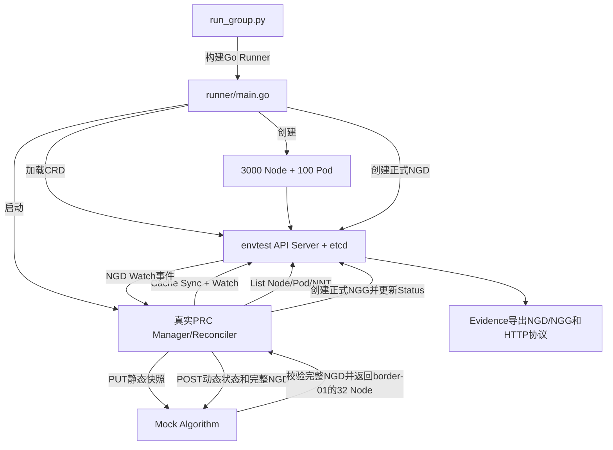

# 第二组：PRC独立测试（normal_create）

## 1. 测试目标和边界

第二组只测试一个正常场景，重点验证PRC，不测试真实Python算法和真实调度器：

- 使用真实 `kube-apiserver + etcd` 的envtest环境；
- 使用真实controller-runtime Manager、Watch、Cache和PRC Reconciler；
- 在envtest中创建3000个Node对象和100个已绑定Pod对象；
- 创建一份字段完整的正式NodeGroupDemand（NGD）；
- 验证PRC原样读取并传输正式NGD字段，不生成算法执行顺序；
- 验证PRC生成Node静态快照、Node动态状态并调用Algorithm协议；
- Algorithm使用可控Mock，只返回一个确定的32 Node候选组；
- 验证PRC最终写入正式NodeGroupGrant（NGG）并更新NGD/NGG Status。

本组不会执行：

- Go Algorithm Server；
- Python `requirement/topology/loadbalance`真实计算；
- Prometheus读取；
- Volcano或kube-scheduler；
- Pod Binding。

这些完整链路由第三组验证。

## 2. 如何运行

在项目根目录执行：

```bash
cd /mnt/data0/volcano-scheduler/ngd-ngg-scheduling-demo

make demo-group2-timing    # 只测PRC Watch到NGG Ready的业务耗时
make demo-group2-evidence  # 重新运行并生成完整输入、协议过程和输出
make demo-group2           # 依次执行Timing和Evidence，并校验核心结果一致
```

底层入口：

```bash
./test_suites/group2_prc/run-group.sh --mode timing
./test_suites/group2_prc/run-group.sh --mode evidence
```

查看最新结果：

```bash
./test_suites/show-latest.sh group2_prc normal_create
```

主要代码：

- Python测试包装：[`run_group.py`](run_group.py)
- envtest及测试主流程：[`runner/main.go`](runner/main.go)
- 正式NGD输入模板：[`input/formal-ngd.yaml`](input/formal-ngd.yaml)
- 真实PRC：[`../../prc/internal/controller/prc_controller.go`](../../prc/internal/controller/prc_controller.go)
- 正式NGD CRD：[`../../docs/paas-schedbridge-master/crd-deploy/nodegroupdemand-crd.yaml`](../../docs/paas-schedbridge-master/crd-deploy/nodegroupdemand-crd.yaml)
- 正式NGG CRD：[`../../config/crd/nodegroupgrant-platform.yaml`](../../config/crd/nodegroupgrant-platform.yaml)

## 3. 本组NGD表达的需求

核心输入如下：

```yaml
apiVersion: scheduling.platform.example.io/v1alpha1
kind: NodeGroupDemand
metadata:
  name: demand-3000-normal
spec:
  schedulerName: volcano
  nodeSelector:
    matchLabels:
      tests.ngg.io/worker: "true"

  topologyRequirement:
    profile: leaf-border-core-v1
    strategy: NarrowestFit
    widestAllowedLevel: coreSwitch

  maxCandidateGroups: 3
  maxNodes: 1000
  quota:
    cpu: "1200"
    memory: 4800Gi
  minResources:
    cpu: "1000"
    memory: 1000Gi
```

字段含义：

| 字段 | 含义 |
| --- | --- |
| `schedulerName: volcano` | 生成给Volcano消费的资源池授权 |
| `nodeSelector` | 只有带测试Worker标签的Node可以进入候选集 |
| `strategy: NarrowestFit` | 从最窄的Leaf层开始，放不下才扩大到Border、Core |
| `widestAllowedLevel: coreSwitch` | 最多允许放宽到Core层；不会跨越Core形成更大范围 |
| `maxCandidateGroups: 3` | Algorithm最多返回3个候选组 |
| `maxNodes: 1000` | 最终正式NGG最多授权1000个Node，不代表必须返回1000个 |
| `minResources` | Algorithm按可分配资源选择满足下限的Node |
| `quota` | Algorithm选择的Node总资源不能突破该上限 |

这里所说的“最低允许拓扑层级”，在协议中使用 `widestAllowedLevel` 表达：搜索顺序为 `Leaf -> Border -> Core`，`coreSwitch` 表示最宽允许放宽到Core。Algorithm内部固定执行`requirement -> topology -> loadbalance`，NGD不再提供编排字段。

## 4. 测试环境和模拟数据

```text
envtest kube-apiserver + etcd
├── 3000个Node API对象
│   ├── 每个Node：32 CPU、128Gi内存、4 GPU
│   ├── 2 Core、4 Border、150 Leaf三层拓扑Label
│   └── 每三个Node中的第三个标记unschedulable
├── 100个已绑定Pod API对象
├── 正式NGD/NGG CRD
├── 真实PRC Manager/Reconciler
└── 可控Mock Algorithm HTTP Server
```

3000 Node是API对象，不会启动3000台虚拟机或3000个容器。envtest提供真实Kubernetes API存储、校验、Watch和Status子资源语义，但不运行kubelet、Volcano或kube-scheduler。

## 5. 详细执行流程



逐步过程：

1. `run_group.py`检查 `.cache/envtest/1.35.5` 中是否存在 `kube-apiserver`、`etcd` 和 `kubectl`。
2. 使用 `golang:1.25-alpine` 构建 `runner/main.go`，生成 `build/test-group2-prc`。
3. 根据共用Fixture生成3000个Kubernetes Node和约100个已绑定Pod的临时输入文件。
4. Runner复制正式NGD/NGG及拓扑CRD到临时目录，启动envtest API Server和etcd。
5. Runner创建3000个Node及其Status，再创建100个Pod及其Status。
6. Runner启动真实controller-runtime Manager和PRC Reconciler，等待Informer Cache完成同步。
7. Runner启动本地Mock Algorithm HTTP Server。
8. Runner从 `input/formal-ngd.yaml` 创建正式NGD。
9. API Server产生NGD Watch事件，PRC开始Reconcile；测试计时器在PRC实际开始处理该UID/generation时记录T0。
10. PRC从API读取Node、Pod和NodeNetworkTopology，并从Node Label获得三层拓扑。
11. PRC构造内容Hash标识的Node静态快照，调用Algorithm静态快照PUT接口。
12. PRC构造本次Node动态调度状态和Allocate请求，其中明确包含：
    - `topologyRequirement.widestAllowedLevel=coreSwitch`；
    - `requirement -> topology -> loadbalance`顺序；
    - 每个算法的参数；
    - `maxCandidateGroups=3`。
13. Mock Algorithm校验完整NGD字段均被保留，且请求中不存在PRC生成的算法编排；不符合即返回HTTP 400。
14. Mock确认PRC原样传输了正式NGD、没有下发算法编排，并从Border-01返回32个确定Node。
15. PRC验证响应身份、快照Hash、Node UID和候选组，然后选择rank 1。
16. PRC校验1000个节点的总CPU和内存满足 `minResources`。
17. PRC创建 `ngg-demand-3000-normal`，写入32个Node及分数、拓扑信息。
18. PRC更新NGG Status为 `Active`，更新NGD Status为 `Fulfilled`。
19. Runner确认NGG节点数、Resolved Capacity和NGD Status全部就绪，记录结束时间。
20. Evidence模式在业务处理完成后才把内存中的对象和HTTP交换写入文件。

## 6. Mock Algorithm的作用

第二组使用Mock是为了把变量限制在PRC：

- 输入仍然是PRC真实生成的3000 Node静态快照和动态状态；
- Mock会真实接收并校验完整NGD、拓扑要求和候选组上限；
- Mock不运行Python评分，只固定返回Border-01的32个节点和90分；
- 因此本组耗时表示PRC和envtest链路，不代表真实Algorithm耗时。

真实算法执行由第三组覆盖。

## 7. Timing Run

核心计时边界：

```text
开始：PRC Reconciler收到该NGD UID/generation并开始业务处理
结束：正式NGG spec、NGG Active Status、NGD Fulfilled Status全部Ready
```

包含：

- PRC List Node/Pod/NNT；
- 静态快照和动态状态构造；
- PRC到Mock Algorithm的HTTP往返；
- NGG创建；
- NGD/NGG Status更新；
- API查询确认对象Ready。

不包含：

- envtest启动；
- 3000 Node和100 Pod创建；
- Manager启动与Cache Sync；
- Runner构建；
- Evidence序列化和文件写入。

单位统一为毫秒，结果写入：

```text
timing-run/timing-result.json
```

## 8. Evidence Run输入、过程和输出

Evidence是一次独立重跑，不作为Timing结果：

```text
evidence-run/normal_create/
├── input/
│   └── ngd-input.yaml
├── process/
│   ├── prc-static-snapshot-request.json
│   ├── prc-static-snapshot-response.json
│   ├── prc-allocation-request.json
│   ├── algorithm-result.json
│   └── prc-algorithm-http.jsonl
└── output/
    ├── ngd-final.yaml
    └── ngg-generated.yaml
```

文件含义：

| 文件 | 说明 |
| --- | --- |
| `ngd-input.yaml` | API Server实际接收的正式NGD，包含拓扑和资源边界 |
| `prc-static-snapshot-request.json` | PRC发送的3000 Node静态资源、Label和三层拓扑 |
| `prc-static-snapshot-response.json` | Mock Algorithm对静态Hash的确认 |
| `prc-allocation-request.json` | PRC发送的动态状态和完整原始资源池NGD |
| `algorithm-result.json` | Mock返回的Border-01候选组和32个具体Node |
| `prc-algorithm-http.jsonl` | PUT/POST接口、状态码和HTTP耗时摘要 |
| `ngd-final.yaml` | 带 `Fulfilled`、grantRef和resolvedNodeCount的NGD |
| `ngg-generated.yaml` | PRC写入Kubernetes的正式NGG及32个授权Node |

推荐展示顺序：

1. `input/ngd-input.yaml`：说明资源池需求、拓扑边界和资源上下限；
2. `process/prc-static-snapshot-request.json`：说明PRC从集群看到的静态资源和拓扑；
3. `process/prc-allocation-request.json`：证明NGD配置被PRC实际转发；
4. `process/algorithm-result.json`：说明Mock Algorithm返回了什么；
5. `output/ngg-generated.yaml`：说明PRC如何把结果转成正式NGG；
6. `output/ngd-final.yaml`：说明需求最终进入Fulfilled。

执行成功时输出：

```json
{"status":"PASS","result":".../test_suites/group2_prc/runs/<run-id>"}
```
