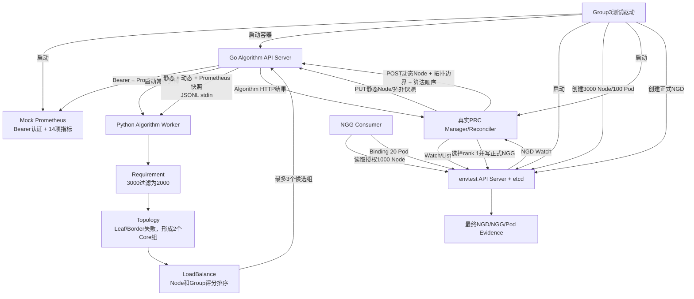

# 第三组：完整链路测试（Cold/Warm）

## 1. 测试目标和边界

第三组验证从NGD进入Kubernetes API到Pod完成模拟Binding的完整业务链路：

- 真实envtest kube-apiserver和etcd；
- 真实PRC Manager/Reconciler；
- 真实Go Algorithm API Server；
- 真实常驻Python Algorithm Worker；
- Mock Prometheus HTTP API及Bearer认证；
- 3000 Node静态、动态、三层拓扑和14项指标；
- 正式NGD输入和正式NGG输出；
- NGG Consumer解析授权节点；
- 通过Kubernetes Binding子资源绑定20个Pod。

本组没有启动真实Volcano或kube-scheduler，因此最后一步是“NGG Consumer + Binding API模拟调度器消费”，用于验证授权范围和绑定结果，不作为真实调度器性能数据。

## 2. 如何运行

在项目根目录执行：

```bash
cd /mnt/data0/volcano-scheduler/ngd-ngg-scheduling-demo

make demo-group3-timing    # Cold/Warm完整链路计时
make demo-group3-evidence  # 重跑Cold/Warm并生成完整证据
make demo-group3           # 依次执行Timing和Evidence并校验结果一致
```

`make`会先构建最新Algorithm镜像，然后执行：

```bash
./test_suites/group3_full_chain/run-group.sh --mode timing
./test_suites/group3_full_chain/run-group.sh --mode evidence
```

查看最新结果：

```bash
./test_suites/show-latest.sh group3_full_chain cold_cache
./test_suites/show-latest.sh group3_full_chain warm_cache
```

主要代码：

- Python测试包装：[`run_group.py`](run_group.py)
- envtest、PRC和Binding流程：[`../group2_prc/runner/main.go`](../group2_prc/runner/main.go)
- 正式NGD输入模板：[`../group2_prc/input/formal-ngd.yaml`](../group2_prc/input/formal-ngd.yaml)
- PRC：[`../../prc/internal/controller/prc_controller.go`](../../prc/internal/controller/prc_controller.go)
- Go Algorithm：[`../../algorithm_server/go`](../../algorithm_server/go)
- Python Algorithm Worker：[`../../algorithm_server/python/algorithm_worker`](../../algorithm_server/python/algorithm_worker)
- NGG Consumer：[`../../ngg_consumer/formalgrant`](../../ngg_consumer/formalgrant)

## 3. 本组NGD表达的需求

Cold和Warm使用相同spec，只使用不同名称：

```yaml
spec:
  schedulerName: volcano
  nodeSelector:
    matchLabels:
      tests.ngg.io/worker: "true"

  topologyRequirement:
    profile: leaf-border-core-v1
    strategy: NarrowestFit
    widestAllowedLevel: coreSwitch

  algorithms:
    - name: requirement
      version: v1
      parameters:
        requiredDistinctNodes: 1000
    - name: topology
      version: v1
      parameters:
        profile: leaf-border-core-v1
        strategy: NarrowestFit
        widestAllowedLevel: coreSwitch
        requiredDistinctNodes: 1000
    - name: loadbalance
      version: v1
      parameters:
        profile: balanced-v2
        requireMetrics: true
        requireNetworkMetrics: true

  maxCandidateGroups: 3
  maxNodes: 1000
  minResources:
    cpu: "1000"
    memory: 1000Gi
```

关键语义：

- `widestAllowedLevel: coreSwitch`：NarrowestFit从Leaf开始，允许逐层扩大到Core，Core是本需求允许的最大拓扑范围；
- `algorithms`数组顺序：`requirement(FILTER) -> topology(GROUP) -> loadbalance(SCORE)`；
- PRC读取该数组并保持顺序发送，Python Worker也会校验阶段不能倒序；
- `requiredDistinctNodes: 1000`：单个候选组必须有1000个不同可用Node；
- `maxCandidateGroups: 3`：最多返回3组；
- `maxNodes: 1000`：正式NGG只授权最终第一候选组中的1000个Node。

## 4. 完整架构和数据流



## 5. 测试数据

### 5.1 Kubernetes和拓扑数据

envtest中创建：

```text
3000 Node
├── Core-01：1500 Node
│   └── 动态过滤后1000 Node可用
└── Core-02：1500 Node
    └── 动态过滤后1000 Node可用

4 Border、150 Leaf，每个Leaf连接20 Node
100个预置已绑定Pod，用于PRC计算requestedResources
20个本Case Pending Pod，用于最后的Binding演示
```

每三个Node中的第三个设置为 `unschedulable=true`，PRC将Node Ready、Unschedulable和已请求资源构造成任务级动态快照。

### 5.2 Prometheus数据

Mock Prometheus为3000个Node提供14项指标并校验Bearer Token和PromQL。Go Algorithm定时读取指标并形成内存快照，Python不直接访问Prometheus。

指标包括CPU、内存、收发字节、收发包、收发丢包率、收发错误率、TCP重传率、链路状态、网络利用率和可用带宽。

## 6. 详细执行流程

### 6.1 环境准备（不计时）

1. `run_group.py`检查envtest二进制并构建Go Runner。
2. 在内存生成3000 Node Fixture、动态状态和42000个Prometheus样本。
3. 启动Mock Prometheus随机端口，初始关闭Cold查询门闩。
4. 生成临时Bearer Token文件并只读挂载到Algorithm容器。
5. 启动最新Go Algorithm容器；Go随即启动一个常驻Python Worker和Prometheus刷新协程。
6. 启动envtest API Server和etcd，安装正式NGD、NGG及拓扑CRD。
7. 在API中创建3000个Node和100个已绑定Pod。
8. 启动真实PRC Manager/Reconciler并等待Cache Sync。

### 6.2 Cold Case

1. Runner调用Mock Prometheus `/control/open`，允许被阻塞的首次指标查询返回。
2. 创建20个名为 `managed-cold-*` 的Pending Pod。
3. 创建 `full-chain-cold` NGD。
4. PRC收到该NGD的Watch事件并开始处理，此时记录Cold T0。
5. PRC List 3000 Node、已有Pod和NNT，生成静态快照Hash及动态状态Hash。
6. PRC将静态Node和拓扑快照PUT到Go Algorithm。
7. PRC发送Allocate请求，包含动态Node、资源池需求、`coreSwitch`拓扑边界和三段算法顺序。
8. Go解析静态缓存和Prometheus缓存，将完整上下文写入Python Worker stdin。
9. Python执行：
   - Requirement：排除1000个不可调度Node，保留2000个；
   - Topology：Leaf和Border组不足1000 Node，Core-01/Core-02各形成一个1000 Node候选组；
   - LoadBalance：使用指标和拓扑质量对Node及两个Core组评分排序。
10. Go将最多3个候选组返回PRC。
11. PRC保持Algorithm顺序，选择rank 1；正式平台NGG契约只写入该组的1000个授权Node。
12. PRC更新NGG为Active、NGD为Fulfilled。
13. Runner读取NGG，NGG Consumer解析出1000个授权Node。
14. Runner通过Kubernetes `pods/binding` 子资源，把20个Pending Pod轮询绑定到授权节点。
15. 检查20个Pod全部具有 `spec.nodeName`，且没有Pod绑定到NGG范围外。

### 6.3 Warm Case

Warm Case不重启envtest、PRC、Algorithm、Python Worker或Prometheus，复用Cold后的：

- Go Node静态快照；
- Go Prometheus指标快照；
- 常驻Python Worker；
- 已同步的PRC Informer Cache。

随后创建20个 `managed-warm-*` Pod和 `full-chain-warm` NGD，重复NGD Watch、PRC调用、真实算法、NGG生成和Binding流程。PRC仍会发送同一内容Hash的静态PUT，Algorithm直接确认已有快照。

## 7. Algorithm如何得到最终候选

本Fixture的确定性过程为：

```text
3000个静态Node
  -> Requirement过滤1000个unschedulable Node
  -> 剩余2000个Node
  -> Leaf组每组约13~14个：不足1000
  -> Border组每组约493~507个：不足1000
  -> Core-01和Core-02各1000个：满足
  -> LoadBalance计算Node score和groupScore
  -> groupScore降序返回候选组
  -> PRC选择rank 1并写入正式NGG
```

Algorithm结果中包含多个候选组；当前正式平台NGG契约只发布第一候选组的具体Node，而不是把所有备用组写入NGG。Algorithm选组依据可以查看 `process/algorithm-result.json`，PRC最终授权可以查看 `output/ngg-generated.yaml`。

## 8. Timing边界

Cold和Warm都使用同一核心边界：

```text
开始：PRC收到该NGD Watch事件并开始Reconcile
结束：NGG Ready，且20个Pod全部通过Binding API绑定完成
```

计入：

- PRC读取集群状态、构造快照；
- PRC与真实Go Algorithm HTTP通信；
- Go调用Python Worker执行三段算法；
- PRC写NGG和Status；
- NGG Consumer解析；
- 20次Binding业务操作。

不计入：

- envtest、Mock Prometheus、Algorithm容器和PRC启动；
- 3000 Node和100个基础Pod创建；
- Manager Cache Sync；
- Cold Case中打开Prometheus门闩和创建20个Pending Pod；
- 测试为阻止Pod Watch刷新而删除NGD的间隙；
- Evidence序列化和文件写入。

实现上会分别记录“Watch到NGG Ready”和“20个Binding”的业务耗时，再相加为Case总耗时，避免测试清理动作进入计时。

## 9. Evidence Run输入、过程和输出

Evidence是与Timing分开的独立运行。每个Case目录为：

```text
evidence-run/<cold_cache|warm_cache>/
├── input/
│   ├── ngd-input.yaml
│   └── pending-pods.yaml
├── process/
│   ├── prc-static-snapshot-request.json
│   ├── prc-static-snapshot-response.json
│   ├── prc-allocation-request.json
│   ├── algorithm-result.json
│   ├── prc-algorithm-http.jsonl
│   └── ngg-consumer/
│       ├── 01-input-formal-ngg.json
│       ├── 02-output-authorized-nodes.json
│       ├── 03-input-output-bindings.json
│       └── 04-output-consumer-status.json
└── output/
    ├── ngd-final.yaml
    ├── ngg-generated.yaml
    └── pods-after-binding.yaml
```

全局环境证据还包括：

```text
evidence-run/infrastructure/prometheus-requests.jsonl
evidence-run/logs/algorithm-server.log
```

文件含义：

| 文件 | 说明 |
| --- | --- |
| `ngd-input.yaml` | 正式输入NGD，包含拓扑边界和算法顺序 |
| `pending-pods.yaml` | Binding前的20个Pod |
| `prc-static-snapshot-request.json` | PRC实际发送的3000 Node静态资源和拓扑 |
| `prc-allocation-request.json` | PRC实际发送的动态状态、拓扑约束和算法顺序 |
| `algorithm-result.json` | 真实Go/Python Algorithm返回的候选组、分数和节点 |
| `prc-algorithm-http.jsonl` | PRC与Algorithm的HTTP接口、状态码和耗时摘要 |
| `01-input-formal-ngg.json` | Consumer实际读取的正式NGG |
| `02-output-authorized-nodes.json` | Consumer解析出的1000个授权Node |
| `03-input-output-bindings.json` | 20个Pod到目标Node的绑定明细 |
| `04-output-consumer-status.json` | Consumer回写NGG的接受状态 |
| `ngd-final.yaml` | 最终Fulfilled NGD |
| `ngg-generated.yaml` | 最终Active NGG及1000个Node |
| `pods-after-binding.yaml` | 20个已经具有 `spec.nodeName` 的Pod |
| `prometheus-requests.jsonl` | Bearer认证及14条PromQL查询审计 |

推荐展示顺序：

1. `input/ngd-input.yaml`：讲清需求、最低允许拓扑层级和算法顺序；
2. `process/prc-allocation-request.json`：证明PRC真实读取并转发了这些配置；
3. `process/algorithm-result.json`：展示两个候选Core组、分数和具体Node；
4. `output/ngg-generated.yaml`：展示PRC最终发布rank 1的1000个Node；
5. `process/ngg-consumer/02-output-authorized-nodes.json`：展示调度侧解析结果；
6. `process/ngg-consumer/03-input-output-bindings.json`：展示20个Binding；
7. `output/pods-after-binding.yaml`：确认最终Pod全部位于授权范围。

执行成功时输出：

```json
{"status":"PASS","result":".../test_suites/group3_full_chain/runs/<run-id>"}
```
