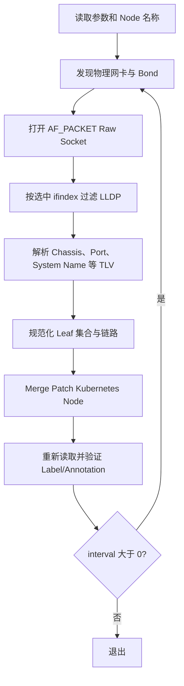

# LLDP Topology Agent

`topology_agent` 以 DaemonSet 方式运行在 Kubernetes 节点上，通过原始 LLDP 报文发现节点直连的上层 Leaf 交换机，并把结果写入 Node Label 和 Annotation。PRC 从这些元数据构建 Node 静态拓扑快照，Algorithm 再把直连 Leaf 与独立配置中的 Room、Border、Spine 等上层拓扑合并。

Agent 只负责 **Node→直连 Leaf**，不推断 Leaf 以上拓扑，也不参与 NGD 计算和节点评分。

## 1. 关键特性

- 直接使用 Linux `AF_PACKET/SOCK_RAW` 接收 EtherType `0x88cc`。
- 不调用 `lldpd`、`lldpcli` 或其他系统 LLDP 服务。
- 支持独立物理网卡、Linux Bond 主接口和显式 Bond Slave。
- 支持 Active-Backup、802.3ad/LACP 及其他 Bond 模式。
- 同一节点可以记录一个或两个直连 Leaf，并保留链路明细。
- 使用官方 `client-go`，支持 In-Cluster 和显式 Kubeconfig。
- Node 更新采用 Merge Patch，写入后重新 GET 并逐项验证。
- 本轮采集失败时保留 Node 上一次成功的拓扑，不写入空结果。

因此，主机是否安装或启动 `lldpd` 不影响本程序。运行所需的是 Linux Raw Socket 权限、宿主机网络视图和交换机实际发送 LLDP 报文。

## 2. 处理流程



代码入口：

```text
main.go
  └─ topologyAgent.run
       └─ topologyAgent.reconcile
            ├─ pkg/bond.SelectInterfaces
            ├─ receiveLLDP
            ├─ topologyfacts.BuildNodeMetadata
            └─ kubeClient.patchNode
```

## 3. 目录结构

```text
topology_agent/
├── main.go
├── agent.go
├── bond.go
├── lldp.go
├── lldp_socket_linux.go
├── lldp_socket_other.go
├── kube_config.go
├── kube.go
├── pkg/
│   ├── bond/
│   │   └── discovery.go
│   └── topologyfacts/
│       └── facts.go
└── *_test.go
```

| 文件 | 职责 |
|---|---|
| `main.go` | Cobra 命令入口、参数校验、Node 名称和 Kubernetes 配置初始化。 |
| `agent.go` | 单次或周期采集流程、邻居到链路事实的转换。 |
| `bond.go` | 主包到 `pkg/bond` 的适配层。 |
| `pkg/bond/discovery.go` | 发现物理网卡、Bond、Slave、模式、Active Slave 和链路状态。 |
| `lldp.go` | LLDP TLV 解析、邻居身份、去重和排序。 |
| `lldp_socket_linux.go` | Linux Raw Socket、组播订阅、Bind、接收和 ifindex 过滤。 |
| `lldp_socket_other.go` | 非 Linux 平台的明确不支持实现。 |
| `pkg/topologyfacts/facts.go` | 规范化 Leaf/链路、生成稳定 Leaf Set ID 和 Node 元数据。 |
| `kube_config.go` | In-Cluster、显式 Kubeconfig 和 Context 选择。 |
| `kube.go` | Node Get、Merge Patch 和回读验证。 |

## 4. 网卡选择

### 自动模式

`--interfaces=auto` 是默认值。Agent 会：

1. 枚举本机接口；
2. 从 sysfs 和 `/proc/net/bonding` 识别 Bond；
3. 选择链路可用的 Bond 主接口；
4. 选择不属于 Bond 的独立物理有线接口；
5. 排除 Bond Slave、Loopback、无线和常见虚拟接口；
6. 找不到合格接口时直接失败，不退化为监听所有接口。

当前 [`deploy-incluster/lldp-agent.yaml`](../deploy-incluster/lldp-agent.yaml) 没有传 `--interfaces`，所以集群实际使用 `auto`。

### 显式接口

```bash
# 只在 bond0 上采集
./topology-agent --interfaces=bond0

# 指定两个物理接口
./topology-agent --interfaces=ens2f0,ens2f1

# 显式指定 Bond Slave，作为运维覆盖
./topology-agent --interfaces=ens2f0
```

只有“恰好一个显式接口”时才对 Raw Socket 执行 `unix.Bind`。自动模式或多接口模式不 Bind，而是在用户态按选中接口的 ifindex 过滤。

生产环境如果已经确定业务上联是 `bond0`，可以在 DaemonSet `args` 中增加：

```yaml
- --interfaces=bond0
```

这样可以避免管理网接口进入 Leaf 集合。

## 5. Bond 处理

### 绑定 Bond 主接口

显式绑定 `bond0` 时，Agent 在 Bond 主接口上接收 LLDP，不展开 Slave。这样能够发现 Bond 上方的 Leaf，同时保留 Bond 模式和 Slave 列表信息。

Raw Socket 在 Bond 主接口上收到报文时，内核通常不会告诉程序报文具体来自哪个 Slave。因此链路会记录：

```yaml
bond: bond0
bondMode: active-backup # 或 802.3ad 等
interface: bond0
active: false
```

这里的 `active: false` 表示 **无法确认物理入接口**，不表示 Leaf 已断开，也不会被当前 PRC/Algorithm 当作不可调度条件。

### Active-Backup

Active-Backup 描述的是节点本机 Bond Slave 的主备关系，不是上层 Leaf 本身的主备状态：

- Active Slave 承担正常数据转发；
- Standby Slave 等待故障切换；
- 两个物理口仍可能分别连接两个 Leaf；
- LLDP 能发现某个 Leaf，只能证明收到了该 Leaf 的控制报文，不能证明它当前承担业务流量。

如果显式采集 Slave，Agent 可以根据 `active_slave` 把 Active-Backup 的活动 Slave 标为 `active=true`。绑定 Bond 主接口时无法可靠映射到 Slave，因此不做推断。

### 802.3ad/LACP 和其他模式

非 Active-Backup 模式没有唯一 Active Slave。Agent 记录 Bond 模式、Slave 和 MII 状态，但不会要求必须发现两个 Leaf。只要本轮至少收到一个有效外部邻居，就会更新 Node 元数据。

## 6. LLDP 接收和解析

Agent 打开：

```text
unix.Socket(AF_PACKET, SOCK_RAW, htons(0x88cc))
```

并在选中的接口上订阅三个标准 LLDP 组播地址。运行需要 root 或 `CAP_NET_RAW`。

当前解析的 TLV 包括：

- Chassis ID 和 Subtype；
- Port ID 和 Subtype；
- TTL；
- Port Description；
- System Name；
- System Description；
- System Capabilities；
- Management Address。

Leaf 身份规则：

1. Chassis ID 用于判断是否为同一台物理交换机；
2. System Name 优先作为写入 Node、并与 Algorithm 拓扑配置匹配的 Leaf ID；
3. System Name 缺失时回退到 Chassis ID；
4. 同一 Chassis 宣告冲突的 System Name 时拒绝本轮结果；
5. 两个不同 Chassis 使用同一个 Leaf 名称时拒绝模糊拓扑；
6. 与本机 hostname/FQDN 相似的邻居会被当作自反射排除。

邻居按“本地接口 + Chassis + Port”去重。重复报文更新同一记录；同一接口上的不同邻居可以同时保留。最终 Leaf 集合按 Leaf ID 排序并生成稳定 Hash。

### 采集窗口

- `count=0`：始终监听完整的 `timeout`。
- `count>0`：达到指定唯一邻居数量后提前结束。
- 超时前至少收到一个有效外部邻居：继续生成元数据。
- 完整窗口内没有有效 LLDP：本轮失败，保留旧 Node 拓扑。

## 7. Node 元数据协议

所有字段使用前缀：

```text
topology.demo.ngg.io/
```

### Labels

| 字段 | 含义 |
|---|---|
| `leaf-set-id` | 排序后 Leaf 集合的短 SHA-256。 |
| `leaf-count` | 去重后的 Leaf 数量。 |
| `leaf-switch` | 只有一个 Leaf 且值符合 Kubernetes Label 规则时写入；否则删除。 |

### Annotations

| 字段 | 含义 |
|---|---|
| `leaf-switch-ids` | JSON Leaf 数组。 |
| `leaf-links` | JSON 链路数组，包含 Bond、接口、Leaf、Chassis、远端端口和 Active 状态。 |
| `source` | 当前为 `LLDP`。 |
| `observed-at` | UTC RFC3339 采集时间。 |
| `local-interface` | 排序后第一条链路的接口，兼容旧消费者。 |
| `remote-port` | 排序后第一条链路的远端端口，兼容旧消费者。 |

示例：

```yaml
metadata:
  labels:
    topology.demo.ngg.io/leaf-count: "2"
    topology.demo.ngg.io/leaf-set-id: 8e3df4c9cdcb
  annotations:
    topology.demo.ngg.io/leaf-switch-ids: '["Leaf-A","Leaf-B"]'
    topology.demo.ngg.io/leaf-links: >-
      [{"bond":"bond0","bondMode":"active-backup","interface":"bond0",
      "leafSwitchId":"Leaf-A","remotePortId":"1/0/1","active":false}]
    topology.demo.ngg.io/source: LLDP
```

PRC 的读取逻辑位于 [`prc/pkg/controller/snapshot.go`](../prc/pkg/controller/snapshot.go)。协议前缀不能单独改成其他名称，否则 PRC 无法构建静态拓扑。

Agent 的规范化函数可以表示多个 Leaf，但当前 PRC 静态快照最多接受两个 Leaf。真实部署应保证一个节点最终只解析出一到两个直连 Leaf；超过两个会导致 PRC 静态快照拒绝该拓扑。

## 8. 参数和环境变量

| 参数 | 默认值 | 说明 |
|---|---:|---|
| `--interfaces` | `LLDP_INTERFACES` 或 `auto` | 逗号分隔的显式接口，或自动发现。 |
| `--node-name` | `NODE_NAME` 或 hostname | 要更新的 Kubernetes Node 名称。 |
| `--kubeconfig` | `KUBECONFIG` 或空 | 显式 Kubeconfig；空时优先 In-Cluster。 |
| `--kube-context` | 空 | 显式 Kubeconfig Context。 |
| `--sys-class-net` | `/sys/class/net` | Bond 和物理接口发现使用的 sysfs 路径。 |
| `--timeout` | `120s` | 单轮接收窗口，必须大于 0。 |
| `--count` | `0` | 最大唯一邻居数；0 表示跑满窗口。 |
| `--interval` | `0` | 两轮开始时间的间隔；0 表示执行一轮后退出。 |

DaemonSet 通过 Downward API 把 `spec.nodeName` 注入 `NODE_NAME`，因此集群部署通常不需要额外传 `--node-name`。

周期以“本轮开始到下一轮开始”为基准。如果采集耗时已经超过 `interval`，下一轮立即开始。

## 9. Kubernetes 认证

认证选择顺序：

1. `--kubeconfig` 或 `KUBECONFIG` 指定的文件；
2. Pod 内的 In-Cluster ServiceAccount；
3. client-go 默认 Kubeconfig 规则。

显式 Kubeconfig 加载失败时不会静默回退到其他身份。

当前集群清单显式设置：

```yaml
- name: KUBERNETES_SERVICE_HOST
  value: 10.129.195.155
- name: KUBERNETES_SERVICE_PORT
  value: "6443"
```

这是目标集群 Kubernetes API 的固定入口，常用于控制面负载均衡地址；它不是 LLDP 采集要求。标准集群通常会自动注入 Kubernetes Service 地址，可按环境决定是否保留。

## 10. 构建和本地运行

运行单元测试：

```bash
cd topology_agent
GOWORK=off go test ./... -v
```

从项目根目录运行统一入口：

```bash
make go-test-topology-agent
```

构建 Linux AMD64 二进制：

```bash
cd topology_agent
CGO_ENABLED=0 GOOS=linux GOARCH=amd64 \
  go build -trimpath -o topology-agent-linux-amd64 .
```

构建 Linux ARM64 二进制：

```bash
CGO_ENABLED=0 GOOS=linux GOARCH=arm64 \
  go build -trimpath -o topology-agent-linux-arm64 .
```

在真实节点执行一次采集：

```bash
sudo ./topology-agent-linux-amd64 \
  --interfaces=bond0 \
  --node-name="$(hostname)" \
  --timeout=65s \
  --count=0 \
  --kubeconfig=/path/to/kubeconfig
```

如果使用 In-Cluster ServiceAccount，则不传 `--kubeconfig`。

## 11. 集群内部署

唯一保留的部署入口是 [`deploy-incluster/lldp-agent.yaml`](../deploy-incluster/lldp-agent.yaml)。当前清单配置：

- DaemonSet：`welkin-system/lldp-agent`；
- 镜像：`hlcsq-registry.cucloud.cn/paas/scheduling/lldp:v0.6.2`；
- 网卡：默认 `auto`；
- 单轮窗口：`65s`；
- `count=0`，每轮跑满窗口；
- 周期：`180s`；
- `hostNetwork: true`；
- Root 用户和 `NET_RAW`；
- 宿主机 `/sys` 只读挂载到 `/host-sys`；
- RBAC：`get/patch nodes`。

部署和检查：

```bash
kubectl apply -f deploy-incluster/lldp-agent.yaml
kubectl rollout status daemonset/lldp-agent \
  -n welkin-system --timeout=300s
kubectl get pods -n welkin-system \
  -l app=ngd-ngg-lldp-agent -o wide
```

必须挂载完整宿主机 `/sys`，不能只挂载 `/sys/class/net`。否则接口 `device` 链接指向的 `../../devices` 可能在容器中断开，物理接口识别会失败。

清单中的 `virtual-kubelet.io/provider=dubhe:NoSchedule` toleration 只是允许 Pod 进入带该污点的节点，不会把 DaemonSet 限定到这些节点。最终部署范围仍由 DaemonSet、其他污点和节点状态共同决定。

## 12. 查看结果

查看所有 Agent Pod：

```bash
kubectl get pods -n welkin-system \
  -l app=ngd-ngg-lldp-agent -o wide
```

查看日志：

```bash
kubectl logs -n welkin-system daemonset/lldp-agent \
  --tail=200
```

查看 Node 拓扑标签：

```bash
kubectl get nodes \
  -L topology.demo.ngg.io/leaf-count \
  -L topology.demo.ngg.io/leaf-set-id \
  -L topology.demo.ngg.io/leaf-switch
```

查看某个 Node 的完整元数据：

```bash
kubectl get node <node-name> -o yaml
```

## 13. 排障

### 没有发现 LLDP 邻居

先在宿主机确认报文：

```bash
sudo tcpdump -i bond0 -nn -e -vv ether proto 0x88cc
```

然后检查：

- 交换机端口是否启用 LLDP；
- 指定接口是否为实际上联；
- Bond 主接口是否 `carrier=1` 且 `operstate=up`；
- 容器是否具有 `NET_RAW`；
- 是否使用 `hostNetwork`；
- `/host-sys/class/net` 是否能看到宿主机接口。

安装 `lldpd` 后能够看到邻居，只能说明系统 LLDP 守护进程可以收包。Topology Agent 仍直接读取 Raw Socket；应继续检查容器权限、网络命名空间、组播订阅和接口选择，而不是把 `lldpd` 当作运行依赖。

### 自动模式选择了错误接口

在日志中查找：

```text
[LLDP-AGENT] FINAL USABLE INTERFACE
[LLDP-AGENT] SELECT interface=
```

如果节点有管理网和业务网，建议显式传 `--interfaces=bond0` 或实际业务接口。

### Node 没有更新

检查：

- `NODE_NAME` 是否与 `metadata.name` 完全一致；
- ServiceAccount 是否具有 `get/patch nodes`；
- Kubernetes API 地址和证书是否正确；
- 日志中是否出现 `VERIFIED Kubernetes Node metadata`。

### 采集失败后旧标签仍存在

这是当前的故障关闭行为。失败轮次不会把旧拓扑清空，避免短暂丢包导致节点立即失去拓扑。应结合 `observed-at` 判断数据是否过期，并通过 Agent 日志定位持续失败原因。

## 14. 行为边界

- Agent 只声明直接观测到的 Leaf，不生成 Room、Border、Spine 或数据中心标签。
- LLDP 邻居存在不等于业务链路当前承载流量。
- `active` 只描述 Agent 能否确认本地链路活动状态，不用于当前调度过滤。
- Agent 不清理其他控制器管理的 Node Label/Annotation。
- 多 Leaf 集合写入 Annotation；兼容的单 Leaf 才同时写入 `leaf-switch` Label。
- Algorithm 使用独立拓扑文件把 Leaf 映射到上层拓扑，PRC 和 Algorithm 不需要因 Bond 采集方式而修改接口。